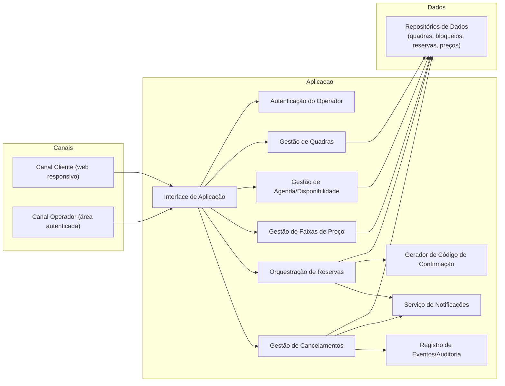
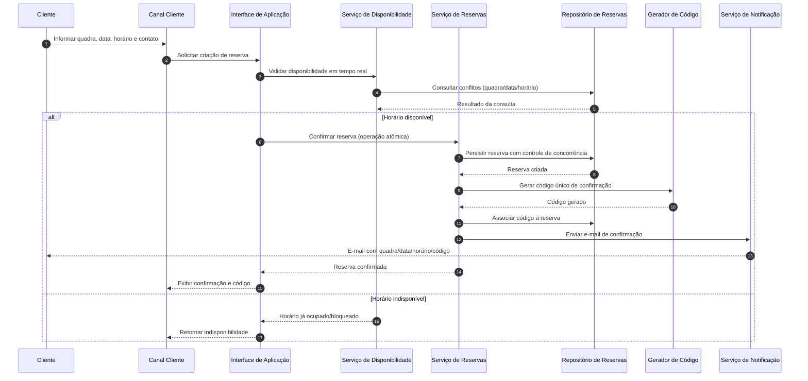

# Relatório Técnico de Arquitetura de Software

## 1. Identificação das HUs

### 1.1 Visão consolidada das Histórias de Usuário

| HU | Perfil | Objetivo | RFs relacionados | RNFs relacionados |
|---|---|---|---|---|
| HU01 | Operador | Cadastrar quadra com tipo, horário e valor | RF01, RF02 | RNF07 |
| HU02 | Operador | Bloquear/remover bloqueio de horários | RF03, RF04 | RNF02, RNF07 |
| HU03 | Operador | Visualizar agenda diária consolidada | RF11 | RNF02, RNF01 |
| HU04 | Operador | Cancelar reserva com justificativa | RF09, RF10 | RNF03, RNF07 |
| HU05 | Cliente | Consultar disponibilidade sem login | RF04, RF07 | RNF01, RNF02, RNF06 |
| HU06 | Cliente | Realizar reserva com dados de contato | RF05, RF06, RF07, RF10 | RNF05, RNF02 |
| HU07 | Cliente | Cancelar reserva por código | RF08 | RNF05, RNF01 |

### 1.2 Atores e fronteiras

- **Cliente (público):** consulta disponibilidade, reserva, cancela via código.
- **Operador (administrativo):** gerencia quadras, bloqueios, agenda e cancelamentos administrativos.
- **Serviço de notificação (externo conceitual):** entrega e-mails de confirmação/cancelamento.

---

## 2. Diagramas de Arquitetura (Mermaid)

### 2.1 Diagrama de componentes (visão lógica)

### 2.2 Diagrama de sequência — realização de reserva (HU06)

---

## 3. Decisões de Arquitetura

1. **Separação de contextos público e administrativo**
   - Público sem autenticação (consulta, reserva, cancelamento por código).
   - Administrativo com autenticação obrigatória (RNF03).

2. **Núcleo modular por capacidades**
   - Módulos: Quadras, Agenda/Disponibilidade, Reservas, Cancelamentos, Preços, Notificações.
   - Suporta manutenibilidade e evolução (RNF07).

3. **Confirmação de reserva atômica**
   - A confirmação só ocorre com validação + gravação indivisível.
   - Mitiga duplo agendamento em concorrência (RNF05, RF07).

4. **Código de confirmação como chave de autoatendimento**
   - Código único associado à reserva (RF06) para cancelamento do cliente (RF08).

5. **Bloqueios como “indisponibilidade de agenda” de primeira classe**
   - Bloqueio de manutenção/feriado afeta diretamente consulta pública (RF03, RF04).

6. **Notificação desacoplada da lógica de reserva**
   - Reserva é registrada primeiro; envio de e-mail é responsabilidade dedicada.
   - Permite reenvio e tratamento de falhas sem quebrar fluxo principal (RF10, HU04).

7. **Modelo de preços por faixa horária**
   - Camada de precificação independente da reserva para suportar horário nobre (RF12).

8. **Agenda consolidada baseada em projeção diária**
   - Visão agregada por data e por quadra para operador (RF11), com foco em desempenho (RNF02).

---

## 4. Tabela de Componentes e Rastreabilidade

| Componente | Responsabilidade Principal | Comunica-se com | Origem (HU / Critério de Aceite) |
|---|---|---|---|
| Canal Cliente | Exibir disponibilidade, receber reserva/cancelamento por código | Interface de Aplicação | HU05, HU06, HU07 |
| Canal Operador | Gestão administrativa autenticada | Interface de Aplicação, Autenticação | HU01, HU02, HU03, HU04 |
| Interface de Aplicação | Orquestrar casos de uso e validações de entrada | Todos os serviços de domínio | Todas as HUs |
| Autenticação do Operador | Controlar acesso da área administrativa | Canal Operador, Interface de Aplicação | RNF03, HU01-HU04 |
| Gestão de Quadras | Cadastrar/editar/remover quadras | Repositórios, Agenda | HU01, RF01, RF02 |
| Gestão de Agenda/Disponibilidade | Calcular horários livres/ocupados/bloqueados | Repositórios, Reservas, Bloqueios | HU02, HU03, HU05 |
| Gestão de Bloqueios | Criar/remover bloqueios de horários | Agenda, Repositórios | HU02 (bloqueio não aparece disponível) |
| Orquestração de Reservas | Confirmar reserva com atomicidade e conflito | Disponibilidade, Repositórios, Códigos, Notificações | HU06, RF07, RNF05 |
| Gerador de Código de Confirmação | Produzir código único por reserva | Reservas | HU06, RF06 |
| Gestão de Cancelamentos | Cancelar por operador (com motivo) e cliente (com código) | Repositórios, Notificações, Auditoria | HU04, HU07, RF08, RF09 |
| Gestão de Preços por Faixa | Definir e aplicar valor por horário | Reservas, Repositórios | RF12 |
| Agenda Consolidada | Projeção diária de ocupação por quadra | Agenda, Repositórios | HU03, RF11 |
| Notificações | Enviar confirmação e cancelamento por e-mail | Reservas, Cancelamentos | RF10, HU04 |
| Repositórios de Dados | Persistir quadras, reservas, bloqueios, preços, motivos | Serviços de domínio | Todas as HUs |
| Auditoria/Registro | Guardar eventos críticos (cancelamentos, alterações) | Cancelamentos, Gestão administrativa | HU04 (motivo obrigatório) |

---

## 5. Bloqueios e Pendências

| Item | Tipo | Impacto Arquitetural | Prioridade |
|---|---|---|---|
| Granularidade do horário (ex.: 30 min, 60 min) | Pendência funcional | Afeta modelo de agenda, conflito e preço | Alta |
| Política de fuso horário e horário de verão | Pendência técnica | Pode gerar inconsistência em disponibilidade | Alta |
| Regra de antecedência mínima/máxima para reservar/cancelar | Pendência de negócio | Impacta validações de API e UX | Média |
| Formato e validade do código de confirmação | Pendência funcional | Impacta segurança/usabilidade de HU07 | Média |
| Política de reenvio em falha de e-mail | Pendência operacional | Impacta confiabilidade percebida | Média |
| Requisitos de acessibilidade além de responsividade | Gap de qualidade | Impacta conformidade de UX e inclusão | Média |
| Definição de volume esperado de acessos simultâneos | Pendência de capacidade | Necessário para garantir RNF02/RNF04 | Alta |

---

## 6. Cobertura de Requisitos

### 6.1 Cobertura de RF

| RF | Cobertura Arquitetural | Status |
|---|---|---|
| RF01 | Gestão de Quadras + Canal Operador | Coberto |
| RF02 | Gestão de Quadras (edição/remoção) | Coberto |
| RF03 | Gestão de Bloqueios + Agenda | Coberto |
| RF04 | Canal Cliente + Agenda/Disponibilidade pública | Coberto |
| RF05 | Canal Cliente + Orquestração de Reservas | Coberto |
| RF06 | Gerador de Código único | Coberto |
| RF07 | Validação de conflito + confirmação atômica | Coberto |
| RF08 | Cancelamento por código | Coberto |
| RF09 | Cancelamento administrativo com motivo | Coberto |
| RF10 | Notificações de confirmação/cancelamento | Coberto |
| RF11 | Agenda Consolidada diária | Coberto |
| RF12 | Gestão de Preços por faixa horária | Coberto |

### 6.2 Cobertura de RNF

| RNF | Estratégia Arquitetural | Status |
|---|---|---|
| RNF01 Usabilidade | Canais responsivos com foco mobile/desktop | Coberto |
| RNF02 Desempenho | Serviço de disponibilidade e projeção de agenda otimizados | Parcial (depende de metas de capacidade detalhadas) |
| RNF03 Segurança | Autenticação para área do operador | Coberto |
| RNF04 Disponibilidade 99% | Componentes desacoplados e operação contínua | Parcial (faltam requisitos operacionais detalhados) |
| RNF05 Confiabilidade | Reserva atômica com controle de concorrência | Coberto |
| RNF06 Compatibilidade | Interface web para navegadores modernos | Coberto |
| RNF07 Manutenibilidade | Arquitetura modular por domínio | Coberto |

---

## 7. Gap Analysis

| Lacuna | Impacto Arquitetural | Ação Recomendada |
|---|---|---|
| Não há regra explícita de duração de reserva e intervalos | Ambiguidade no cálculo de conflitos e preço | Definir unidade de slot e políticas de encaixe |
| Não há SLA de entrega de e-mail | Dificulta critérios de aceite para RF10 | Definir prazo máximo de envio e política de reenvio |
| Não há definição de retenção de histórico/auditoria | Risco de inconsistência legal/operacional | Estabelecer tempo de retenção e trilha mínima de eventos |
| Falta política de autenticação (sessão, expiração, recuperação) | Risco de segurança e UX na área administrativa | Especificar fluxo de autenticação e critérios de segurança |
| Não há critérios de prioridade em concorrência (requisições simultâneas) | Possíveis disputas não determinísticas | Definir regra determinística de “primeiro confirmado” |
| Não há meta de observabilidade (logs/métricas/alertas) | Dificulta sustentar RNF04 e RNF02 em produção | Definir indicadores operacionais mínimos e alarmes |
| Não há política para dados pessoais (nome/e-mail/telefone) | Risco de privacidade e governança | Definir diretrizes de proteção, minimização e consentimento |

**Conclusão:** a arquitetura proposta cobre integralmente os RFs e a maior parte dos RNFs no nível de design lógico. As principais lacunas remanescentes estão em regras operacionais, parâmetros de negócio e governança de dados — itens que devem ser fechados antes da implementação para reduzir retrabalho e risco de produção.