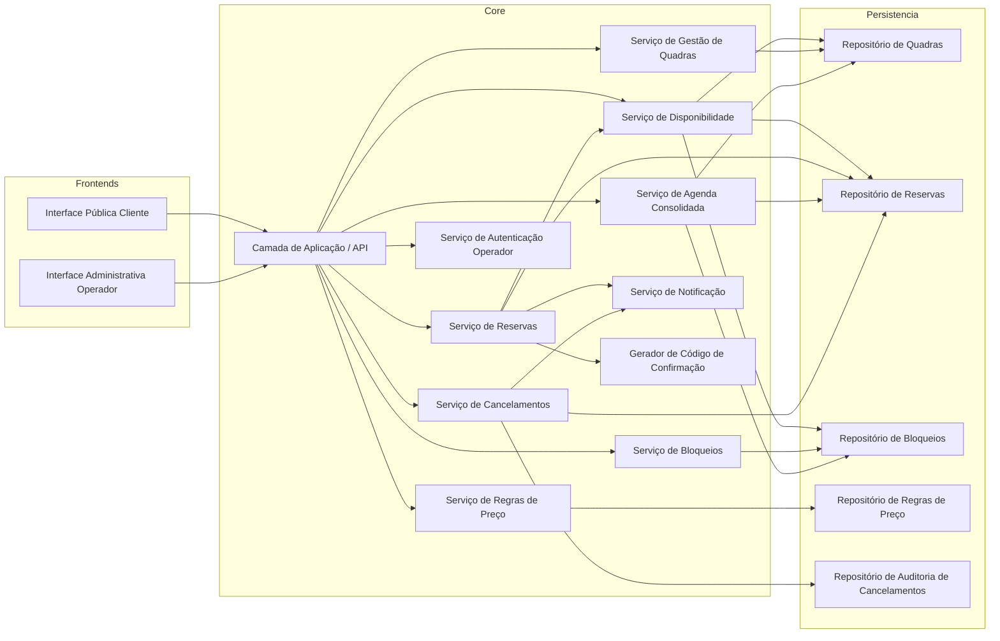
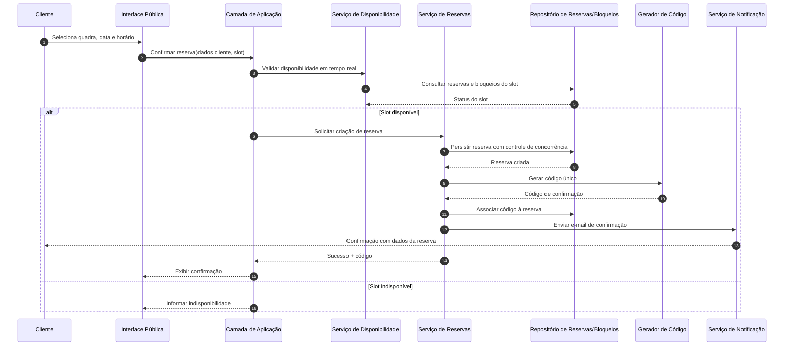
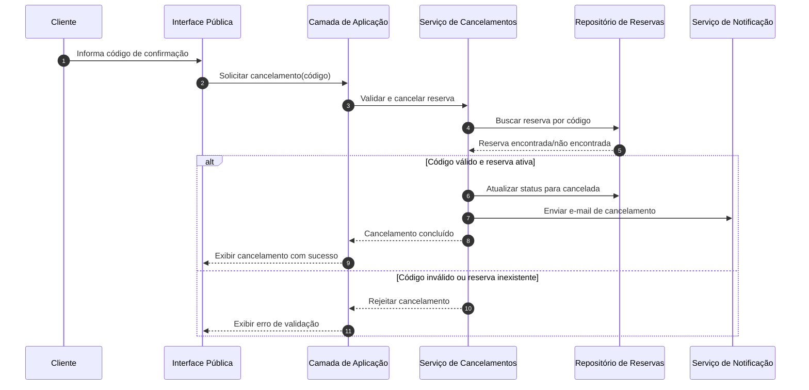

# Relatório Técnico de Arquitetura de Software

## 1. Identificação das HUs

| HU | Perfil | Objetivo | RF Relacionados | RNF Relacionados |
|---|---|---|---|---|
| HU01 | Operador | Cadastrar quadra com tipo, horário e valor | RF01, RF02, RF12 | RNF07 |
| HU02 | Operador | Bloquear horários para manutenção/feriados | RF03, RF04, RF07 | RNF05 |
| HU03 | Operador | Visualizar agenda diária consolidada | RF11 | RNF02, RNF01 |
| HU04 | Operador | Cancelar reserva com motivo e notificar cliente | RF09, RF10 | RNF03, RNF05 |
| HU05 | Cliente | Consultar disponibilidade sem login | RF04 | RNF01, RNF02, RNF06 |
| HU06 | Cliente | Realizar reserva com dados de contato e código | RF05, RF06, RF07, RF10 | RNF05, RNF02 |
| HU07 | Cliente | Cancelar reserva por código de confirmação | RF08 | RNF05 |

---

## 2. Diagramas de Arquitetura (Mermaid)

### 2.1 Diagrama de Componentes (visão lógica)

### 2.2 Diagrama de Sequência — Realizar Reserva (atômica)

### 2.3 Diagrama de Sequência — Cancelamento por Cliente (código)

---

## 3. Decisões de Arquitetura

| ID | Decisão | Motivação | Impacto |
|---|---|---|---|
| DA01 | Separar interface pública e administrativa | Perfis e regras distintas (cliente sem login vs operador autenticado) | Reduz risco de exposição de funções administrativas (RNF03) |
| DA02 | Centralizar regras de disponibilidade em serviço dedicado | Evitar duplicidade e conflito entre reserva, bloqueio e agenda | Consistência entre HU02, HU05, HU06, HU07 |
| DA03 | Confirmar reserva com operação atômica e controle de concorrência | Impedir duplo agendamento em requisições simultâneas | Atende RNF05 e RF07 |
| DA04 | Gerar código de confirmação único por reserva | Suportar cancelamento autônomo do cliente | Atende RF06 e RF08 |
| DA05 | Registrar cancelamento do operador com motivo obrigatório e auditoria | Rastreabilidade operacional e comunicação ao cliente | Atende RF09, HU04 |
| DA06 | Serviço de notificação desacoplado | Reuso em confirmação e cancelamento | Simplifica manutenção e evolução |
| DA07 | Modularizar por domínios (quadras, reservas, bloqueios, preço, agenda) | Facilitar manutenção e inclusão de modalidades | Atende RNF07 |

---

## 4. Tabela de Componentes e Rastreabilidade

| Componente | Responsabilidade Principal | Comunica-se com | Origem (HU / Critério de Aceite) |
|---|---|---|---|
| Interface Pública Cliente | Consulta disponibilidade, reserva e cancelamento por código | Camada de Aplicação | HU05, HU06, HU07 |
| Interface Administrativa Operador | Gestão de quadras, bloqueios, agenda e cancelamentos | Camada de Aplicação, Serviço de Autenticação | HU01, HU02, HU03, HU04 |
| Camada de Aplicação / API | Orquestrar casos de uso e validações de entrada | Todos os serviços de domínio | Todas as HUs |
| Serviço de Autenticação Operador | Validar acesso à área administrativa | Camada de Aplicação | RNF03 |
| Serviço de Gestão de Quadras | Cadastrar/editar/remover quadras | Repositório de Quadras | HU01, RF01, RF02 |
| Serviço de Bloqueios | Criar/remover bloqueios de horários | Repositório de Bloqueios, Disponibilidade | HU02, RF03 |
| Serviço de Disponibilidade | Calcular slots livres/ocupados por quadra e data | Repositórios de quadras, reservas, bloqueios | HU05, HU06, RF04, RF07 |
| Serviço de Reservas | Criar reserva, validar conflito em tempo real | Disponibilidade, Repositório de Reservas, Código, Notificação | HU06, RF05, RF06, RF07, RF10 |
| Gerador de Código de Confirmação | Emitir identificador único | Serviço de Reservas | HU06, RF06 |
| Serviço de Cancelamentos | Cancelar por cliente (código) e por operador (motivo) | Repositório de Reservas, Auditoria, Notificação | HU04, HU07, RF08, RF09 |
| Serviço de Agenda Consolidada | Exibir ocupação diária de todas as quadras | Repositórios de quadras, reservas, bloqueios | HU03, RF11 |
| Serviço de Regras de Preço | Gerir valores por faixa de horário | Repositório de Regras de Preço | RF12 |
| Serviço de Notificação | Enviar e-mails de confirmação/cancelamento | Reservas, Cancelamentos | HU04, HU06, RF10 |
| Repositório de Reservas | Persistência de reservas e status | Reservas, Cancelamentos, Disponibilidade, Agenda | RF05, RF07, RF08, RF09 |
| Repositório de Bloqueios | Persistência de indisponibilidades operacionais | Bloqueios, Disponibilidade, Agenda | HU02, RF03 |
| Repositório de Auditoria de Cancelamentos | Registrar motivo e autoria de cancelamentos | Cancelamentos | HU04, RF09 |

---

## 5. Bloqueios e Pendências

| ID | Pendência | Impacto Arquitetural | Severidade |
|---|---|---|---|
| P01 | Granularidade do horário (30 min, 60 min, customizável) não definida | Modelagem de agenda, conflito e precificação | Alta |
| P02 | Regras de funcionamento por dia da semana/feriados não detalhadas | Cálculo de disponibilidade e UI de consulta | Alta |
| P03 | Política de alteração de reserva (remarcação) não especificada | Pode exigir novo caso de uso e regra de cobrança | Média |
| P04 | Política de expiração de reserva não paga/abandonada não informada | Pode afetar ocupação e experiência do cliente | Média |
| P05 | Requisitos de auditoria além de cancelamento (ex.: edição de quadra) ausentes | Conformidade e rastreabilidade operacional | Média |
| P06 | Volume esperado de acessos simultâneos não definido | Dimensionamento para cumprir RNF02 e RNF04 | Alta |
| P07 | Política de reenvio/falha de e-mail não definida | Confiabilidade de comunicação ao cliente | Média |

---

## 6. Cobertura de Requisitos

### 6.1 Requisitos Funcionais

| RF | Cobertura Arquitetural | Status |
|---|---|---|
| RF01 | Serviço de Gestão de Quadras + Repositório de Quadras | Coberto |
| RF02 | Serviço de Gestão de Quadras | Coberto |
| RF03 | Serviço de Bloqueios | Coberto |
| RF04 | Serviço de Disponibilidade + Interface Pública | Coberto |
| RF05 | Serviço de Reservas | Coberto |
| RF06 | Gerador de Código + Reservas | Coberto |
| RF07 | Disponibilidade + operação atômica de reserva | Coberto |
| RF08 | Serviço de Cancelamentos por código | Coberto |
| RF09 | Cancelamentos com motivo + Auditoria | Coberto |
| RF10 | Serviço de Notificação | Coberto |
| RF11 | Serviço de Agenda Consolidada | Coberto |
| RF12 | Serviço de Regras de Preço | Coberto (detalhamento pendente de regra) |

### 6.2 Requisitos Não Funcionais

| RNF | Estratégia Arquitetural | Status |
|---|---|---|
| RNF01 (Usabilidade) | Interfaces separadas e responsivas por perfil | Parcial (depende de design UI) |
| RNF02 (Desempenho) | Serviço dedicado de disponibilidade e consultas otimizadas | Parcial (depende metas de carga/testes) |
| RNF03 (Segurança) | Autenticação obrigatória na área administrativa | Coberto |
| RNF04 (Disponibilidade 99%) | Separação de responsabilidades e operação contínua | Parcial (depende operação/infra) |
| RNF05 (Confiabilidade) | Reserva atômica + controle de concorrência | Coberto |
| RNF06 (Compatibilidade) | Interface web sem dependência de navegador específico | Parcial (depende testes cross-browser) |
| RNF07 (Manutenibilidade) | Arquitetura modular por domínios | Coberto |

---

## 7. Gap Analysis

1. **Lacuna: unidade de tempo da reserva não definida**  
   - **Impacto:** conflito de agenda, cálculo de preço e UX de calendário.  
   - **Ação recomendada:** definir padrão (ex.: blocos fixos) e regra de arredondamento.

2. **Lacuna: regras de horário de funcionamento por dia/feriado incompletas**  
   - **Impacto:** disponibilidade inconsistente e risco de reservas inválidas.  
   - **Ação recomendada:** especificar calendário operacional por quadra e exceções.

3. **Lacuna: comportamento em falha de notificação por e-mail**  
   - **Impacto:** reserva confirmada sem comunicação ao cliente.  
   - **Ação recomendada:** definir política de retentativa, monitoramento e mensagem em tela como fonte primária.

4. **Lacuna: ausência de metas quantitativas de concorrência**  
   - **Impacto:** difícil validar RNF02/RNF04 em cenários reais.  
   - **Ação recomendada:** estabelecer carga-alvo (usuários simultâneos, pico por minuto) e critérios de teste.

5. **Lacuna: política de governança de dados de cliente (retenção/anonimização) não especificada**  
   - **Impacto:** risco de não conformidade regulatória e excesso de dados.  
   - **Ação recomendada:** definir ciclo de vida de dados pessoais e trilha de consentimento.

6. **Lacuna: fronteira entre cancelamento de cliente e operador em prazos/restrições**  
   - **Impacto:** regra de negócio ambígua e possíveis conflitos operacionais.  
   - **Ação recomendada:** formalizar regras de janela de cancelamento e precedência administrativa.