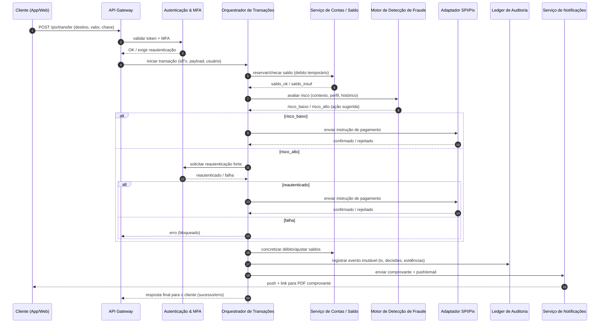

# Relatório Técnico de Arquitetura de Software

## 1. Identificação das HUs

Lista consolidada das Histórias de Usuário (HUs) tratadas e seus elementos chave:

- HU01 — Abrir conta PF com validação de identidade (onboarding digital, validação CPF, documento com foto, notificação em 24h).
- HU02 — Autenticar com múltiplos fatores (MFA obrigatório, OTP e biometria, gestão de métodos).
- HU03 — Realizar transferência via Pix (todas chaves, confirmação destinatário, comprovante PDF, limites/horários).
- HU04 — Pagar boleto com agendamento (leitura linha digitável/código de barras, confirmação, agendamento, lembrete).
- HU05 — Gerenciar cartão de crédito (visualizar fatura, pagar, definir limites, bloquear em <=60s, notificações).
- HU06 — Contestar transação não reconhecida (anexar evidências, bloquear transação, prazo de análise).
- HU07 — Investir em renda fixa (listar produtos, aplicar/resgatar, posição consolidada imediata).
- HU08 — Gerenciar consentimentos Open Finance (autorizar/visualizar/revogar, painel, notificações).
- HU09 — Receber alertas e responder a suspeita de fraude (push+email, confirmar/contestar em 2 cliques, bloqueio preventivo).
- HU10 — Abrir conta PJ com documentação societária (validação CNPJ, sócios, KYC, notificação em 48h).
- HU11 — Realizar TED para fornecedores (validação bancária do destinatário, limites/horários, comprovante PDF).
- HU12 — Gerente: acompanhar carteira e registrar anotações (consentimento do cliente, visão consolidada, histórico/interações).
- HU13 — Gerente: abrir solicitações de serviço em nome do cliente (registro do gerente, notificações, restrição transacional).

As HUs acima derivam dos Requisitos Funcionais (RF01–RF47) e dos Critérios de Aceite listados no enunciado; são a base para rastreabilidade (Seção 4 e 6).

---

## 2. Diagramas de Arquitetura (Mermaid)

Observação: diagramas descrevem responsabilidades e interfaces conceituais, sem prescrever produtos.

2.1 Diagrama de Sequência — Fluxo de transferência Pix (usuário inicia transferência; validações, antifraude e execução)


2.2 Diagrama de Componentes — Visão lógica dos principais módulos e interfaces
```mermaid
graph LR
  subgraph Cliente
    App[App Mobile / Portal Web]
  end

  subgraph Plantaforma_Backend
    APIGW[API Gateway / Facade]
    Auth[Auth & Identity (MFA, SSO)]
    UserMgmt[Gestão de Usuários / Perfis / Consentimentos]
    KYC[KYC & Onboarding Engine]
    Account[Serviço de Contas & Ledger]
    TxOrch[Orquestrador de Transações]
    PixAdapter[Adaptador Pix / SPI]
    TEDAdapter[Adaptador TED / Outros]
    CardSvc[Serviço de Cartões]
    CardGateway[Gateway de Processamento de Cartões (outsourced)]
    Payments[Boleto & Pagamentos]
    Invests[Plataforma de Investimentos / Renda Fixa]
    Fraud[Motor de Detecção de Fraude (tempo real)]
    Notif[Notificações (push, email, SMS)]
    DocStore[Armazenamento de Documentos Criptografados]
    Audit[Ledger de Auditoria Imutável]
    Scheduler[Agendador / Jobs]
    Reporting[Relatórios Regulatórios e Exportações]
    CRM[Portal Gerente de Relacionamento]
    Metrics[Monitoramento & Métricas]
    Backup[Backup / DR Manager]
  end

  subgraph Terceiros
    IdV[Serviço de Verificação de Identidade]
    PCIProc[Processador de Cartões (PCI-DSS)]
    OpenF[Plataformas Open Finance (outras instituições)]
    Banks[Instituições externas / SPI]
  end

  App -->|HTTPS/TLS| APIGW
  APIGW --> Auth
  APIGW --> UserMgmt
  APIGW --> TxOrch
  APIGW --> Account
  APIGW --> CardSvc
  APIGW --> Invests
  UserMgmt --> KYC
  KYC --> IdV
  TxOrch --> Fraud
  TxOrch --> Account
  TxOrch --> PixAdapter
  TxOrch --> TEDAdapter
  PixAdapter --> Banks
  TEDAdapter --> Banks
  CardSvc --> CardGateway
  Payments --> Banks
  Payments -->|linha digitável| DocStore
  DocStore -->|encrypted| Backup
  AllServices --> Audit
  AllServices --> Metrics
  CRM --> UserMgmt
  Auth --> UserMgmt
  UserMgmt --> OpenF
  OpenF -->|API padronizada| APIGW
  Fraud --> Notification[Notif]
  Notification --> App
  Scheduler --> Payments
  Scheduler --> TxOrch
  Reporting --> Audit
```

---

## 3. Decisões de Arquitetura

Cada decisão inclui justificativa, alternativas e impacto.

DA01 — Autenticação centralizada com MFA obrigatório
- Descrição: Implementar um serviço de Autenticação & Identity central que gerencia credenciais, MFA e sessões.
- Justificativa: Cumpre RF03, RNF03, RNF04; facilita rastreabilidade de segurança e gestão de sessão.
- Alternativa: Autenticação distribuída por serviço; rejeitada por complexidade de conformidade e auditoria.
- Impacto: Ponto crítico de disponibilidade; exigir rate-limiting, monitoramento e redundância.

DA02 — Separação de plano de comando (orquestrador) e plano de dados (serviço de contas/ledger)
- Descrição: Orquestrador coordena fluxos (pagamentos, investimentos) e um ledger transacional mantém saldos e movimentos.
- Justificativa: Isola consistência contábil (RNF12, RNF14, RNF15) e permite escalar logicamente.
- Alternativa: Serviço monolítico transacional; rejeitada por bloqueio de escalabilidade e complexidade de manutenção.
- Impacto: Necessidade de transações distribuídas ou compensações; definir mecanismos de idempotência e garantia de não-perda (RNF17).

DA03 — Modelo híbrido síncrono/assíncrono para transações
- Descrição: Validações prévias e reserva de saldo síncrona; execução final via pipeline assíncrono com confirmação.
- Justificativa: Atender latência de UX (saldo em ~1s, RNF14) e requisitos de processamento Pix (RNF15) mantendo resiliência.
- Impacto: Implementar filas, idempotência e validade temporal de reservas; monitorar RPO/RTO.

DA04 — Motor de detecção de fraude em tempo real com integração a orquestrador
- Descrição: Fraude avalia risco e pode bloquear ou requerer reautenticação (RF36–RF39, HU09).
- Justificativa: Requisitos de segurança e UX (notificações em tempo real).
- Impacto: Necessidade de baixa latência e acesso a histórico; definir política de retenção e auditoria de decisões (RNF12).

DA05 — Armazenamento de dados sensíveis criptografado e segregado
- Descrição: Dados sensíveis em repositórios criptografados em repouso; documentos em repositório de objetos criptografados.
- Justificativa: RNF02, RNF06, RNF10.
- Impacto: Gestão de chaves criptográficas (KMS conceitual), backup seguro e controle de acesso granular.

DA06 — Delegar processamento de dados de cartão a processador certificado
- Descrição: Não armazenar dados sensíveis de cartão; integrar com processador PCI-DSS.
- Justificativa: RNF06.
- Impacto: Dependência externa; must-have contratos e SLAs; mecanismo de tokenização.

DA07 — API Gateway com controle de versionamento e suporte a Open Finance
- Descrição: Facade única para políticas de segurança, throttling, roteamento e exposição das APIs públicas de open finance.
- Justificativa: RF44, RNF11.
- Impacto: Definir políticas de consentimento, logs detalhados e identificação de consumidores de API.

DA08 — Ledger de auditoria imutável com retenção mínima de 5 anos
- Descrição: Todas operações, acessos e configurações registradas em ledger imutável com indexação para auditoria.
- Justificativa: RNF12.
- Impacto: Reforça conformidade, precisa de armazenamento durável e política de retenção / exportação.

DA09 — Escalonamento horizontal e implantação multi-zona
- Descrição: Arquitetura projetada para escalonamento horizontal e redundância geográfica.
- Justificativa: RNF13, RNF16, RNF23.
- Impacto: Necessidade de mecanismos de coerência eventual, health checks e failover automatizado.

DA10 — Exposição de métricas e monitoramento em tempo real
- Descrição: Exportar métricas operacionais e alertas para gestão e SRE.
- Justificativa: RNF24.
- Impacto: Definir SLIs/SLOs; planejar testes de carga e runbooks.

---

## 4. Tabela de Componentes e Rastreabilidade

| Componente | Responsabilidade Principal | Comunica-se com | Origem (HU / Critério de Aceite) |
|---|---|---:|---|
| API Gateway / Facade | Entrada unificada, roteamento, autenticação inicial, rate-limiting, versionamento de API | Auth, Orquestrador, Serviços internos, Open Finance APIs | HU02 / RF03; HU08 / RF44; RNF01, RNF04 |
| Auth & Identity (MFA) | Gerenciar autenticação, sessões, MFA (OTP, biometria), encerramento de sessão inativa | API Gateway, UserMgmt, Orquestrador, Notif | HU02 / Critérios; RF03, RF04, RF05 |
| Gestão de Usuários & Consentimentos | Cadastro PF/PJ, perfis, consentimentos, bloqueio de conta, histórico de acessos | Auth, KYC, CRM, OpenF, DocStore | HU01, HU10, HU08 / RF01, RF06, RF41–RF42 |
| KYC & Onboarding Engine | Validação de identidade (CPF/CNPJ, documentos, sócios), integração com providers | UserMgmt, DocStore, IdV (externo) | HU01, HU10 / RF02; RNF08 |
| Serviço de Contas & Ledger (contábil) | Saldo, movimentos, reservas, regras contábeis e rendimentos poupança | Orquestrador, Reporting, Audit | RF08–RF13; HU01, HU07 |
| Orquestrador de Transações | Coordenar fluxos de pagamento, TED, Pix, aplicações de investimento | API Gateway, Account, Fraud, PixAdapter, TEDAdapter, Scheduler | HU03, HU11, HU04, HU07 / RF22–RF27, RF25–RF26 |
| Pix Adapter / SPI Interface | Interface para rede Pix/SPI, garantia de latência e confirmação | Orquestrador, Banks (externo) | HU03 / RF22, RF24 |
| TED Adapter | Interface para transferências interbancárias (TED) | Orquestrador, Banks | HU11 / RF25, RF26 |
| Boleto & Pagamentos | Processar leitura de código de barras, agendamento, pagamento e conciliação | Orquestrador, DocStore, Scheduler | HU04 / RF28–RF31 |
| Serviço de Cartões | Emissão/gestão de cartões (débito/crédito), bloqueio, limites, faturas | Card Gateway (externo), Orquestrador, Account, Notif | HU05, HU06 / RF14–RF21 |
| Gateway de Cartões (terceiro) | Processamento de transações de cartão (tokenização) | Serviço de Cartões | RF06, RF14–RF20 |
| Plataforma de Investimentos | Exposição de produtos, aplicação/resgate, posição consolidada | Account, Orquestrador, Reporting | HU07 / RF32–RF35 |
| Motor de Detecção de Fraude | Avaliar transações em tempo real, pontuar risco, bloquear/prevent | Orquestrador, Account, Notif, Audit | RF36–RF40, HU09 |
| Notificações | Envio de push, email, SMS, alertas de fraude e comprovantes | API Gateway, Auth, Fraud, Orquestrador | HU03, HU05, HU09 / RF20, RF38 |
| Document Storage (criptografado) | Armazenar documentos (contrato social, RG, comprovantes) com criptografia | KYC, UserMgmt, Payments | HU01, HU10 / RNF02, RNF06 |
| Audit Ledger (imutável) | Registro imutável de eventos, operações e decisões | Todos os serviços | RNF12; HU06 (rastreio de contestações) |
| Scheduler / Jobs | Agendamento de pagamentos, lembretes, processamento noturno | Payments, Orquestrador, Notif | HU04 / RF26, RF31 |
| CRM / Portal Gerente | Interface para gerentes, visão consolidada com consentimento, registrar anotações | UserMgmt, Account, Invests, Audit | HU12, HU13 / RF45–RF47 |
| Reporting & Regulatory Export | Geração e envio de relatórios regulatórios (BACEN, SCR) | Account, Audit, KYC | RNF09, RNF07 |
| Backup / DR Manager | Gerenciar backups, RPO/RTO, recuperação multi-zona | DocStore, Account, Audit | RNF22, RNF23 |
| Monitoring & Metrics | Expor SLOs/SLIs, alertas, dashboards | Todos os serviços | RNF24, RNF13 |
| Key Management (KMS - conceitual) | Gestão de chaves de criptografia para dados em repouso e documentos | DocStore, Audit, Backup | RNF02, RNF10 |

Obs.: "Comunica-se com" lista interfaces conceituais. Origem referencia HUs e critérios de aceite ou RFs mais relevantes.

---

## 5. Bloqueios e Pendências

Lista priorizada de bloqueios que impactam design/implementação:

1. Especificação do Provedor SPI / SLAs de processamento
   - Impacto: Necessário para dimensionamento e garantias de RNF15 (10s).
   - Ação: Definir contratos e SLAs com operadora de troca Pix/SPI.

2. Definição de formatos e versões do Open Finance a suportar (fase/regulação)
   - Impacto: Interface pública e requisitos de conformidade (RF44, RNF11).
   - Ação: Alinhar com Compliance sobre versões específicas e cronograma de rollout.

3. Determinação de políticas de retenção detalhadas além do mínimo de 5 anos (logs, consentimentos, documentos)
   - Impacto: Armazenamento e custos de longo prazo; requisitos legais.
   - Ação: Solicitar política de retenção da área jurídica/regulatória.

4. Contratos com processador de cartão (requisitos de tokenização e limites de SLA)
   - Impacto: Design do Serviço de Cartões e fluxo de tokenização (RNF06).
   - Ação: Negociar contrato e definir interface de tokenização.

5. Especificação de critérios de fraude (regras, thresholds, e processo de aprendizado)
   - Impacto: Parametrização do Motor de Detecção de Fraude.
   - Ação: Colaborar com risco/AML para definir regras iniciais e métricas.

6. Definição de política de armazenamento e processamento de biometria
   - Impacto: Requisitos de privacidade (LGPD) e criptografia.
   - Ação: Obter orientação jurídica e técnica sobre template biométrico e consentimento.

7. SLA de bloqueio de cartão e integração com redes externas
   - Impacto: Atender HU05 (<=60s para bloqueio).
   - Ação: Testes de integração e acordos de tempo de resposta com parceiros.

8. Lista de métodos de MFA e critérios de fallback (ex.: perda de dispositivo)
   - Impacto: UX e segurança.
   - Ação: Definir políticas de recuperação de MFA e suporte.

9. Regras contábeis para rendimento da poupança (fontes regulatórias)
   - Impacto: Implementação do cálculo automático de rendimentos (RF11).
   - Ação: Alinhar com área contábil/regulatória sobre fórmulas e calendário.

---

## 6. Cobertura de Requisitos

Resumo de como a arquitetura atende os RFs/HUs (mapeamento por grupo funcional). Para cada requisito principal, componentes responsáveis são indicados.

- Gestão de Usuários e Autenticação (RF01–RF07; HU01, HU02, HU12, HU13)
  - Componentes: UserMgmt, Auth, KYC, DocStore, CRM
  - Cobertura: Cadastro PF/PJ (RF01) → KYC + UserMgmt; MFA (RF03) → Auth; sessão inativa (RF04) → Auth; histórico de acessos (RF05) → UserMgmt + Audit; bloqueio remoto (RF06) → UserMgmt/Auth; gerente com consentimento (RF07) → CRM+UserMgmt+Audit.

- Conta Corrente e Poupança (RF08–RF13; HU01)
  - Componentes: Account, Orquestrador, Scheduler, Reporting
  - Cobertura: Abertura contas (RF08) → KYC + Account; saldo em tempo real (RF09) → Account + caching coerente; extrato com filtros (RF10) → Account + Reporting; rendimento poupança (RF11) → Scheduler + Account; transferências internas (RF12) → Orquestrador + Account; comprovantes PDF (RF13) → Orquestrador + Notif + DocStore.

- Cartões (RF14–RF21; HU05, HU06)
  - Componentes: CardSvc, CardGateway, Notif, Account, Audit
  - Cobertura: Emissão cartões (RF14–RF15) → CardSvc + integração externa; faturas (RF16) → CardSvc + Account; pagamento fatura (RF17) → Orquestrador; limite (RF18) → CardSvc com aprovação (UserMgmt/Orchestration); bloqueio independente (RF19) → CardSvc + CardGateway (<=60s); notificações transações (RF20) → Notif; contestação (RF21) → CardSvc + Audit + Orquestrador.

- Transferências (RF22–RF27; HU03, HU11)
  - Componentes: PixAdapter, TEDAdapter, Orquestrador, Fraud, Account
  - Cobertura: Pix suportado (RF22) → PixAdapter; gestão chaves Pix (RF23) → UserMgmt; processamento em 10s (RF24) → PixAdapter + Orquestrador + SLAs; TED (RF25) → TEDAdapter; agendamento (RF26) → Scheduler; limites diários/horários (RF27) → UserMgmt + Orquestrador.

- Pagamento de Boletos (RF28–RF31; HU04)
  - Componentes: Payments, Orquestrador, DocStore, Scheduler, Notif
  - Cobertura: leitura linha digitável (RF28) → Payments; exibição dados (RF29) → Payments + DocStore; agendamento (RF30) → Scheduler; lembretes (RF31) → Notif + Scheduler.

- Investimentos em Renda Fixa (RF32–RF35; HU07)
  - Componentes: Invests, Account, Orquestrador, Reporting
  - Cobertura: listagem produtos (RF32) → Invests; aplicar/resgatar (RF33) → Orquestrador+Account; posição consolidada (RF34) → Invests+Account; informe de rendimentos (RF35) → Reporting.

- Detecção de Fraudes (RF36–RF40; HU09)
  - Componentes: Fraud, Orquestrador, Notif, Audit
  - Cobertura: monitoramento em tempo real (RF36) → Fraud; bloqueio preventivo (RF37) → Fraud->Orquestrador; notificações imediatas (RF38) → Notif; confirmar/contestar (RF39) → App->Orquestrador->Audit; histórico para auditoria (RF40) → Audit.

- Open Finance (RF41–RF44; HU08)
  - Componentes: API Gateway, UserMgmt, OpenF adapters, Audit, Reporting
  - Cobertura: autorizar compartilhamento (RF41) → UserMgmt + Consent Management; gerenciar/revogar consentimentos (RF42) → UserMgmt; iniciação de pagamentos via terceiros (RF43) → API Gateway + Orquestrador; APIs padronizadas (RF44) → API Gateway + OpenF adapters.

- Gerente de Relacionamento (RF45–RF47; HU12, HU13)
  - Componentes: CRM, UserMgmt, Account, Invests, Audit
  - Cobertura: visão consolidada com consentimento (RF45) → CRM+UserMgmt; registrar interações (RF46) → CRM+Audit; abrir solicitações (RF47) → CRM->Orquestrador (com registro de gerente e notificações).

- Requisitos Não-Funcionais Chave
  - Segurança (RNF01–RNF06): TLS obrigatório na camada de transporte (API Gateway), criptografia em repouso (DocStore/Account), hashes seguros de senha (Auth), rate-limiting (API Gateway), testes de penetração periódicos (processo), delegação de dados de cartão (CardGateway).
  - Conformidade (RNF07–RNF12): KYC (KYC Engine), relatórios regulatórios (Reporting), trilha imutável (Audit).
  - Disponibilidade & Desempenho (RNF13–RNF17): multi-zona, escalonamento horizontal (todos serviços críticos), monitoramento (Metrics), fallback e compensação (Orquestrador).
  - Usabilidade (RNF18–RNF21): app multiplataforma (requisito de produto), confirmações antes de operações (UI + Orquestrador).
  - Infraestrutura & Dados (RNF22–RNF24): Backup/DR Manager, multi-zona implantação, métricas expostas.

Observação: cada RF foi considerado e mapeado para um ou mais componentes; a rastreabilidade detalhada está disponível na Tabela da Seção 4 e no mapa acima.

---

## 7. Gap Analysis

Identificação de lacunas na especificação, impacto arquitetural e recomendações.

Gap 1 — Especificação de SLAs operacionais de provedores externos
- Lacuna: Não há SLAs detalhados para SPI/Pix, processador de cartões e provedores KYC.
- Impacto: Impossibilidade de garantir RNF15 (10s) e HU05 (bloqueio em 60s); dimensionamento incerto.
- Recomendações: Obter contratos/SLAs; definir políticas de retry/compensação e planos de fallback.

Gap 2 — Política de retenção e arquivamento além do mínimo legal
- Lacuna: RNF12 exige 5 anos, mas não detalha retenção de consentimentos, biometria, evidências de contestação.
- Impacto: Implementação de storage e custos não dimensionados; riscos de conformidade LGPD.
- Recomendações: Definir política por classe de dado; mapear storage tiering e custo.

Gap 3 — Critérios e dados para motor de fraude / AML
- Lacuna: Regras, thresholds, fontes de dados e processos de aprendizado não especificados.
- Impacto: Alto risco de falso-positivos/negativos; impacto de UX e compliance.
- Recomendações: Definir conjunto inicial de regras, pipeline de offline training, métricas de performance (TPR/FPR); engajar área de risco.

Gap 4 — Tratamento e armazenamento de dados biométricos
- Lacuna: Não há especificação sobre formato, consentimento e criptografia de templates biométricos.
- Impacto: Risco legal (LGPD); necessidade de controles adicionais.
- Recomendações: Definir política de coleta, consentimento explícito, criptografia, e exclusão por solicitação.

Gap 5 — Regras detalhadas para limites diários/hora e horário noturno/diurno
- Lacuna: RF27 e HU03 indicam limites/horários, mas sem matriz de limites por perfil e exceções.
- Impacto: Regras de bloqueio e UX indeterminadas; orquestrador precisa de parametrização.
- Recomendações: Criar tabela de limites por perfil (PF/PJ/gerente), regras de exceção, e processo de alteração.

Gap 6 — Procedimentos de disputa/contestações e integração com processos de estorno
- Lacuna: Fluxo pós-contestação (investigação, estorno, prazos) não detalhado.
- Impacto: Necessidade de integração com back-office e potenciais inconsistências em estados de transação.
- Recomendações: Definir SLA e processos operacionais; modelar estados de transação (contestada / em investigação / estornada).

Gap 7 — Requisitos de testes de carga e cenários de pico
- Lacuna: RNF16 exige escalonamento, mas faltam workloads e picos esperados (TPS para Pix, consultas de saldo, etc.).
- Impacto: Capacidade de infra errada; risco de não atender RNF13.
- Recomendações: Product/PM definir cenários de carga (picos diários, campanhas, festivais) para testes de performance.

Gap 8 — Políticas de chave e KMS
- Lacuna: RNF02 demanda AES-256, mas não há definição de gestão de chaves, rotação e segregação de acesso.
- Impacto: Falha de conformidade e risco de exposição.
- Recomendações: Definir modelo de KMS, rotação e controles de acesso por serviço.

Gap 9 — Requisitos de conformidade técnica do Open Finance
- Lacuna: Não ficou explícito o nível de logs/auditoria exigido para APIs Open Finance e formatos de consentimento.
- Impacto: Risco de não conformidade com RNF11.
- Recomendações: Mapear especificações regulatórias aplicáveis e implementar mecanismos de consent management auditáveis.

Gap 10 — Detalhamento de relatórios regulatórios (formatos e periodicidade)
- Lacuna: RNF09 indica geração/envio de relatórios, mas sem formatos, periodicidade e triggers.
- Impacto: Risco de não conformidade.
- Recomendações: Alinhar com Compliance e implementar pipelines ETL para exports regulares e on-demand.

---

Fim do relatório.

Observações finais:
- Este relatório adota visão conceitual neutra quanto a fornecedores e tecnologias, descrevendo responsabilidades, interfaces e critérios não-funcionais exigidos.
- Próximos passos recomendados: priorizar resolução das pendências (Seção 5), detalhar contratos/SLAs com terceiros, e definir backlog técnico para implementar infra de orquestração, ledger contábil, motor de fraude e módulos de KYC.