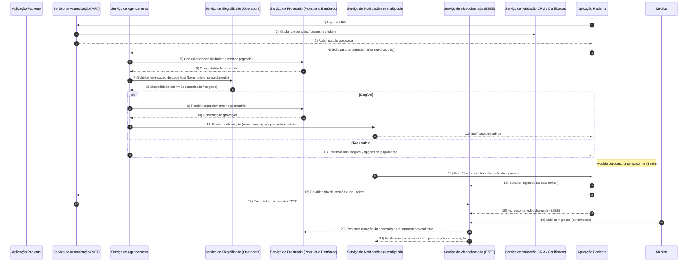

# Relatório Técnico de Arquitetura de Software

## 1. Identificação das HUs

Lista resumida das Histórias de Usuário (HU) mapeadas para o escopo arquitetural:

- HU01 — Cadastrar-se e consentir com o tratamento de dados de saúde (Paciente)
- HU02 — Agendar consulta presencial ou por videochamada (Paciente)
- HU03 — Participar de consulta por videochamada (Paciente)
- HU04 — Visualizar prontuário e resultados de exames (Paciente)
- HU05 — Acessar e compartilhar prescrição digital (Paciente)
- HU06 — Receber notificação de resultado de exame disponível (Paciente)
- HU07 — Validar cadastro com CRM ativo (Médico)
- HU08 — Registrar evolução clínica no prontuário (Médico)
- HU09 — Emitir prescrição digital com validade jurídica (Médico)
- HU10 — Solicitar exame e receber resultado com alerta de valor crítico (Médico)
- HU11 — Acessar prontuário compartilhado entre especialidades (Médico)
- HU12 — Gerenciar médicos e agendas da unidade (Administrador de clínica)
- HU13 — Acompanhar faturamento por convênio (Administrador de clínica)
- HU14 — Processar autorização prévia de procedimentos (Operador de plano de saúde)

(As HUs acima derivam dos requisitos funcionais e critérios de aceite fornecidos.)

---

## 2. Diagramas de Arquitetura (Mermaid)

Diagrama de sequência representando um fluxo crítico: agendamento com verificação de cobertura + notificação + ingresso em videochamada. Contém participantes explícitos e autonumber.



Diagrama de componentes (arquitetura lógica, principais módulos e interfaces):

```mermaid
graph TD
    subgraph Frontend
        PA[Aplicação Paciente (mobile/web)]
        MA[Aplicação Médico (mobile/web)]
        AA[Portal Administrativo]
    end

    subgraph Backend
        Auth[Serviço de Autenticação & MFA]
        Users[Gestão de Usuários & Perfis]
        Scheduling[Serviço de Agendamento]
        MR[Prontuário Eletrônico (EHR)]
        Presc[Serviço de Prescrição Digital]
        Video[Serviço de Videochamada (E2EE)]
        LabInt[Integração Laboratorial (HL7 FHIR)]
        Coverage[Serviço de Elegibilidade / Convênios (TISS)]
        Billing[Gestão de Faturamento / TISS]
        Notif[Serviço de Notificações]
        Audit[Trilha de Auditoria Imutável]
        Storage[Object Storage Criptografado]
        CertIF[Validação CRM & Certificados (CFM / ICP-Brasil)]
        Monitoring[Métricas & Monitoramento]
    end

    PA -->|HTTPS/TLS| Auth
    MA -->|HTTPS/TLS| Auth
    AA -->|HTTPS/TLS| Auth

    Auth --> Users
    Users --> CertIF
    Scheduling --> MR
    MR --> Storage
    Presc --> CertIF
    Presc --> MR
    Presc --> Storage
    Video --> Auth
    Video --> MR
    Video --> Storage
    LabInt --> MR
    LabInt --> Notif
    Coverage --> Scheduling
    Coverage --> Billing
    Billing --> Scheduling
    Billing --> Coverage
    Notif --> PA
    Notif --> MA
    Notif --> AA
    MR --> Audit
    Audit --> Storage
    Storage -->|Replicação geográfica| Storage

    Monitoring --> Auth
    Monitoring --> Scheduling
    Monitoring --> MR
    Monitoring --> Video
    Monitoring --> Billing
```

---

## 3. Decisões de Arquitetura

Lista das principais decisões arquiteturais (AD = Architectural Decision) com justificativa e impactos:

AD-01 — Arquitetura por domínios/bounded contexts
- Decisão: Organizar o sistema em serviços ou módulos por domínio funcional (Autenticação/Usuários, Agendamento, Prontuário, Prescrição, Videochamada, Integrações laboratoriais, Elegibilidade/Convênios, Faturamento, Notificações, Auditoria).
- Justificativa: Claridade de responsabilidade, isolamento de dados sensíveis, escalabilidade independente por módulo (RNF17).
- Impacto: Define contratos de API e limites de segurança; facilita compliance e testes.

AD-02 — Interfaces baseadas em padrões abertos (FHIR / TISS)
- Decisão: Expor e consumir APIs estruturadas conforme padrões de interoperabilidade (p.ex. padrões de troca de dados clínicos e faturamento).
- Justificativa: RNF26 exige uso de padrões abertos; facilita integração com laboratórios e operadoras.
- Impacto: Modelos de dados e adaptações para versões dos padrões; necessidade de tradutores/mediadores para parceiros legados.

AD-03 — Separação forte entre armazenamento de PHI e metadados
- Decisão: Armazenar documentos clínicos e imagens em serviço de object storage criptografado em repouso; dados relacionais/metadados em armazenamento separado, com criptografia aplicacional para campos sensíveis.
- Justificativa: RNF02, RNF18, requisitos de retenção e performance (RNF15).
- Impacto: Políticas de backup e arquivamento, chaves de criptografia e rotação.

AD-04 — Trilha de auditoria imutável com retenção de longo prazo
- Decisão: Criar um componente de Auditoria que registre eventos imutáveis (acessos, alterações) com assinatura de integridade e retenção conforme RNF11 (mínimo 20 anos).
- Justificativa: Requisito regulatório e compliance.
- Impacto: Requisitos de armazenamento a longo prazo, exportação e processos legais.

AD-05 — Autenticação forte e MFA universal
- Decisão: MFA obrigatório para todos os perfis; suporte a OTP por app autenticador e autenticação biométrica no mobile via provedor de autenticação do dispositivo.
- Justificativa: RF03, RNF01, RNF03.
- Impacto: Interfaces para provedores de MFA, tratamento de recuperação de conta e logs de autenticação.

AD-06 — Videochamada com criptografia ponta a ponta (E2EE) e sem gravação de conteúdo
- Decisão: Implementar E2EE para sessões de teleconsulta; servidores intermediários atuarão apenas para sinalização e/ou encaminhamento de pacotes sem ter acesso ao conteúdo de mídia.
- Justificativa: RNF04 e HUs relacionados à videochamada.
- Impacto: Escolhas de topologia (P2P vs roteamento via servidor) e restrições de funcionalidades (por exemplo, gravação proibida no requisito) — necessidade de registrar meta-dados da chamada (duração) sem armazenar mídia.

AD-07 — Serviço de Prescrição integrado ao módulo de assinatura ICP-Brasil
- Decisão: Fluxo de emissão de prescrições com assinatura digital compatível com ICP-Brasil; interface com provedor de certificados para assinatura (inclui certificados em nuvem homologados).
- Justificativa: RF27, HU09, RNF06.
- Impacto: Processo de certificação, gestão de chaves e logs de assinatura.

AD-08 — Contratos de SLA e timeouts para integrações externas
- Decisão: Definir SLAs de tempo para chamadas a operadoras e laboratórios (p.ex. verificação de elegibilidade <= 5s conforme RNF14; respostas de autorização TISS <= 30min conforme HU14), com fallback e mensagens amigáveis ao usuário.
- Justificativa: RNF14, HU14.
- Impacto: Necessidade de mecanismos de retry, cache seguro de status e filas para processamento assíncrono.

AD-09 — Monitoramento, rate limiting e detecção de anomalias
- Decisão: Expor métricas operacionais e aplicar controles de rate limiting e detecção de padrões anômalos para acessos ao prontuário (RNF05, RNF25).
- Justificativa: Segurança e disponibilidade.
- Impacto: Definição de dashboards, alertas e playbooks de resposta a incidentes.

AD-10 — Política de consentimento e controle de acesso por consentimento
- Decisão: Implementar mecanismo de consentimento explícito gravado com data/hora e vínculo a regras de autorização para acesso ao prontuário por terceiros; permitir revogação.
- Justificativa: RF23, HU01, RNF07, RNF12.
- Impacto: Regras de autorização dinâmicas e UI/UX para gestão de consentimentos.

---

## 4. Tabela de Componentes e Rastreabilidade

| Componente | Responsabilidade Principal | Comunica-se com | Origem (HU / Critério de Aceite) |
|---|---:|---|---|
| Serviço de Autenticação & MFA (Auth) | Gerenciar login, MFA, sessões, encerramento automático | Aplicações (Paciente, Médico, Admin), Serviço de Certificados, Serviço de Notificações, Monitoring | RF03, RF05, HU01, HU03 |
| Gestão de Usuários & Perfis (Users) | Cadastro de usuários, perfis (paciente, médico, admin, operador), controle de autorização por perfil | Auth, CertIF, MR, Scheduling | RF01, RF04, HU01, HU07 |
| Validação CRM & Serviços de Certificados (CertIF) | Consulta ao CFM para status de CRM; interface para assinatura ICP-Brasil | Users, Prescrição, Auth | RF02, RF27, HU07, HU09 |
| Serviço de Agendamento (Scheduling) | Gestão de agendas, encaixes, cancelamentos, regras de prazos | MR, Coverage, Notif, Billing | RF07, RF08, RF10, RF12, RF13, HU02, HU12 |
| Serviço de Elegibilidade / Convênios (Coverage) | Verificação em tempo real da cobertura junto à operadora (TISS) | Scheduling, Billing, Operadoras externas | RF09, RF36, RF37, RNF14, HU02, HU14 |
| Serviço de Videochamada (Video) | Criação/gerência de sessões E2EE, tokens de ingresso, compartilhamento de documentos em sessão, registrar duração | Auth, MR, Notif, Storage (apenas para metadados), Monitoring | RF14, RF15, RF16, RF17, RF18, HU03 |
| Prontuário Eletrônico (MR / EHR) | Gestão de registros clínicos, documentos, permissões por consentimento, histórico | Users, Scheduling, Prescrição, LabInt, Audit, Storage | RF19–RF25, HU04, HU08, HU11 |
| Serviço de Prescrição Digital (Presc) | Gerar prescrições, aplicar assinatura ICP-Brasil, validar interações medicamentosas | MR, CertIF, Notif, Storage | RF26–RF30, HU05, HU09 |
| Integração Laboratorial (LabInt) | Receber/solicitar resultados (FHIR), vincular ao prontuário, sinalizar alertas críticos | MR, Notif, Laboratórios parceiros | RF31–RF35, HU06, HU10 |
| Gestão de Faturamento / TISS (Billing) | Gerar guias/fluxo TISS, processar faturamento e coparticipação | Coverage, Scheduling, Operadoras, Storage | RF36–RF41, HU13, HU14 |
| Serviço de Notificações (Notif) | Enviar e-mail e push (confirmação, lembretes, resultados) | Todos os frontends, Scheduling, LabInt, Video | RF11, RF32, HU02, HU06, HU10 |
| Trilha de Auditoria Imutável (Audit) | Registrar logs imutáveis de acessos e alterações com retenção legal | MR, Auth, Presc, Billing, Storage | RF06, RNF11, HU08, HU11 |
| Object Storage Criptografado (Storage) | Armazenar documentos clínicos, imagens, PDFs, backups com redundância geográfica | MR, Presc, LabInt, Audit, Video | RNF02, RNF18, RNF23 |
| Monitoring e Observabilidade (Monitoring) | Métricas operacionais, alertas, dashboards | Todos os serviços | RNF25, RNF13, RNF17 |

Observação: "Comunica-se com" lista integrações internas principais; integrações externas com Operadoras, Laboratórios e CFM são tratadas via contratos de API/standards.

---

## 5. Bloqueios e Pendências

Itens que requerem definição antes ou durante implementação, com impacto e ação recomendada:

1. Integração com CFM (CRM) — especificação da API, SLA e formato de resposta
   - Impacto: Necessário para RF02, HU07; impede desenvolver fluxo de validação automatizada.
   - Ação: Negociar contrato de integração e obter documentação técnica da autoridade.

2. Provedor de certificados ICP-Brasil e modelo de assinatura (local vs certificado em nuvem)
   - Impacto: Afeta Prescrição Digital (RF27, HU09) e procedimentos de auditoria; questões de responsabilidade legal e operativa.
   - Ação: Definir modelo jurídico-operacional e interfaces (API de assinatura) com o time de compliance.

3. Especificação completa do padrão TISS e versão a ser adotada
   - Impacto: Afeta Billing, Coverage, HU14; necessário para implementar tradução de guias e mensagens.
   - Ação: Confirmar versão do padrão TISS e obter exemplos e regras de negócio das operadoras parceiras.

4. Requisitos detalhados de E2EE para video (topologia: P2P vs roteamento intermediário / SFU) e compatibilidade com web/mobile
   - Impacto: Afeta Video, escalabilidade e latência (RNF16); escolha define capacidade de add-on (compartilhamento de tela, gravação - proibida).
   - Ação: Realizar prova de conceito (PoC) focada em E2EE que mantenha impossibilidade de gravação pelo servidor.

5. Política de consentimento (modelo legal e níveis de consentimento)
   - Impacto: Implementação de RF23, HU01, HU11; necessário para regras de autorização.
   - Ação: Definir com jurídico e privacidade os tipos de consentimento e formato de registro (estruturado) exigido.

6. Retenção e arquivamento para 20 anos: capacidade, custo e formato
   - Impacto: Storage e Audit; implica políticas de backup (RNF23).
   - Ação: Definir classificação de dados, tiers de armazenamento e plano de manutenção para long-term retention.

7. Especificação de interações medicamentosas (fonte e atualização de base)
   - Impacto: Presc (RF28, HU09); essencial para alertas e segurança do paciente.
   - Ação: Definir provedor da base de interações/BD e frequência de atualização.

8. Requisitos de desempenho detalhados por carga (picos de consultas, concorrent users)
   - Impacto: Dimensionamento horizontal (RNF17), SLAs.
   - Ação: Coletar estimativas de volume/peaks para modelagem de escala.

9. Política de biometria móvel: armazenamento, processamento e consentimento
   - Impacto: Auth e privacidade; risco legal.
   - Ação: Definir se biometria será processada localmente no dispositivo ou trafegará; alinhar com LGPD.

10. Definição de alcance de logs e metadados permitidos para video (já que gravação é proibida)
    - Impacto: Audit e evidências; registrações necessárias para faturamento.
    - Ação: Padronizar meta-dados (duração, participantes, IPs) que serão armazenados.

---

## 6. Cobertura de Requisitos

Resumo de como a arquitetura cobre os principais requisitos (mapeamento simplificado):

- RF01 (cadastro perfis): Users + Auth (HU01)
- RF02 (validação CRM): CertIF integrado a Users (HU07)
- RF03 (MFA): Auth (HU01, HU03)
- RF04 (controle de acesso por perfil): Users + Auth + MR (HU11)
- RF05 (encerrar sessão inativa): Auth (RNF01)
- RF06 (log de acessos ao prontuário): Audit + MR (RNF11)
- RF07–RF13 (agendamento): Scheduling + Coverage + Notif + MR + Admin (HU02, HU12)
- RF14–RF18 (videochamada): Video + Auth + MR + Notif + Storage (HU03)
- RF19–RF25 (prontuário): MR + Audit + Storage + Users (HU04, HU08, HU11)
- RF26–RF30 (prescrição): Presc + CertIF + MR + Notif (HU05, HU09)
- RF31–RF35 (laboratórios): LabInt + MR + Notif (HU06, HU10)
- RF36–RF41 (planos de saúde / faturamento): Coverage + Billing + Scheduling (HU13, HU14)
- RF42–RF46 (módulo administrativo): AA (Portal Administrativo) + Scheduling + Users + Monitoring (HU12, HU13)

Cobertura RNF relevante:
- RNF01 (TLS) — todas as comunicações cliente-servidor obrigam TLS; especificado no design de redes.
- RNF02 (AES-256 em repouso) — Storage e criptografia aplicacional definidas.
- RNF03 (hash de senhas) — Auth responsabilidade.
- RNF04 (E2EE video) — Video implementa E2EE; metadados registrados no MR/Audit.
- RNF05 (rate limiting) — Auth e API gateways / ingress definem rate limiting e detecção de anomalias.
- RNF06 (ICP-Brasil) — Presc e CertIF.
- RNF07–RNF12 (compliance) — Políticas e componentes Audit, Consent e Data Portability colocados no MR/Users.
- RNF13–RNF18 (disponibilidade/desempenho/escalabilidade) — Arquitetura orientada a escala horizontal com object storage replicado e métricas/monitoramento.
- RNF19–RNF22 (compatibilidade/acessibilidade) — Fronteends (PA/MA/AA) projetados para mobile/web responsivo e requisitos de acessibilidade.
- RNF23–RNF25 (backup/monitoramento/interoperabilidade) — Storage com RPO/RTO definidos; Monitoring expõe métricas; LabInt e Coverage seguem padrões abertos.

Observação: mapeamento detalhado por requisito pode ser expandido em tabela por RF/RNF se requerido.

---

## 7. Gap Analysis

Identificação de lacunas na especificação, impacto arquitetural e recomendações práticas.

Gap 1 — Especificação insuficiente da API do CFM e SLA de validação de CRM
- Impacto: Bloqueia implementação do fluxo de validação automática (RF02/HU07).
- Recomendações: Obter documentação da autoridade reguladora; criar adaptador com retry/backoff; definir fallback manual e processo de aprovação provisória.

Gap 2 — Topologia E2EE da videochamada e requisitos funcionais conflitantes (compartilhamento de documentos vs. proibição de gravação)
- Impacto: Definição de arquitetura de media (P2P vs relay) e como suportar compartilhamento de arquivos sem violar RNF04.
- Recomendações: Validar com seguridade jurídica a lista de meta-dados permitidos; realizar PoC de E2EE com sinalização separada e armazenamento somente de meta-dados e documentos compartilhados via object storage criptografado sob consentimento.

Gap 3 — Modelo de consentimento incompleto (grânulos, escopos, revogação e portabilidade)
- Impacto: Controle de acesso dinâmico ao prontuário (RF23, RNF07, RNF12).
- Recomendações: Especificar tipos de consentimento (acesso por profissional, por unidade, por período), API para revogação e fluxo de notificação; registrar consentimentos como objetos imutáveis.

Gap 4 — Detalhes da base de interações medicamentosas (fonte, atualizações, responsabilidade)
- Impacto: Segurança clínica das prescrições (RF28, HU09).
- Recomendações: Definir fornecedor de conteúdos clínicos e processo de atualização; incluir painel de override justificável e registro de justificativa no Audit.

Gap 5 — Política de retenção além do valor mínimo (20 anos) — arquivamento vs consulta ativa
- Impacto: Custos e arquitetura de storage, performance do prontuário e backups.
- Recomendações: Definir tiers (ativo, arquivado, deep-archive), políticas de restauração e testes de RTO/RPO; incluir processos legais para preservação.

Gap 6 — Níveis de SLAs detalhados para integrações externas (operadoras, laboratórios)
- Impacto: Experiência do usuário (verificação em <=5s), processo de autorização em <=30min (HU14).
- Recomendações: Negociar SLAs com parceiros; implementar cache seguro e circuito-breaker; experiência UX para estados pendentes.

Gap 7 — Requisitos de acessibilidade detalhados (ex.: fluxos críticos a serem conformes WCAG 2.1 AA)
- Impacto: Implementação de frontends (RNF21).
- Recomendações: Definir checklist de conformidade e testes automatizados de acessibilidade no pipeline.

Gap 8 — Critérios de detecção de anomalias e thresholds para rate limiting
- Impacto: Segurança e disponibilidade (RNF05).
- Recomendações: Definir valores iniciais (por perfil e endpoint), métricas mínimas para ajuste e playbooks de mitigação.

Gap 9 — Especificação de metadados mínimos a armazenar para video (duração, participantes, endereço IP, taxas de bits)
- Impacto: Auditoria e faturamento (RF16).
- Recomendações: Definir esquema de metadados e políticas de retenção; validar com compliance.

Gap 10 — Procedimentos operacionais para emergência/contingência (downtime dos parceiros)
- Impacto: Disponibilidade 99,9% e continuidade do atendimento.
- Recomendações: Documentar plano de contingência, failover manual para autorização, e canais alternativos de comunicação.

Priorização recomendada (curto, médio, longo prazo):
- Curto: Obter APIs CFM e TISS; definir modelo de assinatura digital; PoC E2EE; políticas de consentimento.
- Médio: Definir SLAs e caches para elegibilidade; implementar auditoria imutável; base de interações medicamentosas.
- Longo: Estratégia de arquivamento 20+ anos; testes de escala e disponibilidade; integração completa com múltiplas operadoras/laboratórios.

---

Observações finais rápidas:
- O design proposto é neutro quanto a fornecedores e tecnologias, focado em responsabilidades, contratos e padrões (FHIR/TISS/ICP-Brasil).
- Próximo passo recomendado: elaborar um backlog técnico com spikes para PoCs (CFM integration, E2EE PoC, assinatura ICP-Brasil), e um plano de segurança e conformidade com as áreas jurídica e de privacidade.

Fim do relatório.