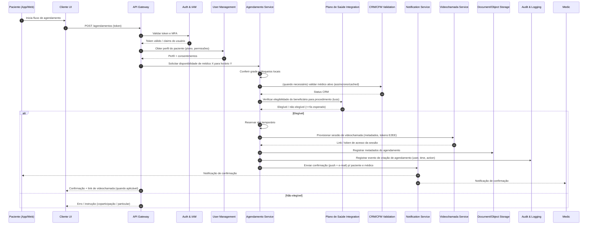

# Relatório Técnico de Arquitetura de Software

## 1. Identificação das HUs

Lista das Histórias de Usuário (HU) recebidas e seu escopo funcional principal:

- HU01 — Cadastrar-se e consentir com o tratamento de dados de saúde (Paciente)  
- HU02 — Agendar consulta presencial ou por videochamada (Paciente)  
- HU03 — Participar de consulta por videochamada (Paciente)  
- HU04 — Visualizar prontuário e resultados de exames (Paciente)  
- HU05 — Acessar e compartilhar prescrição digital (Paciente)  
- HU06 — Receber notificação de resultado de exame disponível (Paciente)  
- HU07 — Validar cadastro com CRM ativo (Médico)  
- HU08 — Registrar evolução clínica no prontuário (Médico)  
- HU09 — Emitir prescrição digital com validade jurídica (Médico)  
- HU10 — Solicitar exame e receber resultado com alerta de valor crítico (Médico)  
- HU11 — Acessar prontuário compartilhado entre especialidades (Médico)  
- HU12 — Gerenciar médicos e agendas da unidade (Administrador de Clínica)  
- HU13 — Acompanhar faturamento por convênio (Administrador de Clínica)  
- HU14 — Processar autorização prévia de procedimentos (Operador de Plano de Saúde)

Observação: cada HU foi usada como origem para componentes e interfaces descritos adiante; quando aplicável os critérios de aceite dos HUs foram traduzidos em responsabilidades e eventos arquiteturais (ex.: notificações, logs de auditoria, consentimento explícito).

---

## 2. Diagramas de Arquitetura (Mermaid)

Diagrama de sequência: fluxo principal "Paciente agenda consulta por videochamada" cobrindo autenticação, verificações de cobertura, reserva de agenda, criação de sessão de videochamada e notificações.



Diagrama de componentes (visão lógica / módulos e principais interfaces):

```mermaid
graph LR
    subgraph Clientes
        Mobile[App Mobile]
        Web[Portal Web]
    end

    subgraph Infraestrutura_APIs
        APIGW[API Gateway]
        Auth[Auth & IAM]
        RateLimiter[Rate Limiter]
        Audit[Audit & Logging]
        Metrics[Monitoring & Metrics]
    end

    subgraph Core_Services
        UserSvc[User & Profile Service]
        ConsentSvc[Consent Management]
        AgendSvc[Agendamento Service]
        Prontuario[Prontuário Eletrônico]
        Prescricao[Prescrição Digital & Assinatura]
        DrugCheck[Interações Medicamentosas]
        VC[Videochamada Service]
        LabInt[Laboratory Integration (HL7 FHIR)]
        PlanInt[Operadora / Plano Integration (TISS)]
        Billing[Billing & Faturamento (TISS)]
        Admin[Admin / Backoffice]
        Notif[Notification Service]
    end

    subgraph Storage_and_Backup
        DocStore[Object Storage (documentos/imagens)]
        DB[Transactional Data Store]
        Archive[Long-term Archive (retenção 20 anos)]
        KeyMgmt[Key Management (KMS)]
    end

    Mobile -->|HTTPS/TLS1.2+| APIGW
    Web -->|HTTPS/TLS1.2+| APIGW
    APIGW --> Auth
    APIGW --> RateLimiter
    APIGW --> UserSvc
    APIGW --> AgendSvc
    APIGW --> Prontuario
    APIGW --> Prescricao
    APIGW --> VC
    APIGW --> Admin
    AgendSvc --> VC
    AgendSvc --> PlanInt
    AgendSvc --> UserSvc
    Prontuario --> DocStore
    Prontuario --> Audit
    Prescricao --> KeyMgmt
    Prescricao --> DrugCheck
    LabInt --> Prontuario
    LabInt --> Notif
    PlanInt --> Billing
    Billing --> Archive
    Notif --> Mobile
    Notif --> Web
    Audit --> Archive
    DB -->|persistência| Archive
    KeyMgmt --> DocStore
    Metrics --> APIGW
    Metrics --> Core_Services
```

Observações sobre os diagramas:
- O diagrama de sequência evidencia tempos críticos (ex.: verificação de elegibilidade em até 5s).
- O componente "Videochamada Service" fornece tokens/metadados e mantém a responsabilidade de E2EE e não gravação de conteúdo, enquanto metadados de sessão (duração, participantes) são persistidos para faturamento/auditoria.
- Integrações externas (CFM, operadoras, laboratórios) são tratadas via adaptadores/integração padronizada (interfaces HL7 FHIR / TISS).

---

## 3. Decisões de Arquitetura

1. Arquitetura orientada a serviços (módulos coesos, comunicação via APIs REST/gRPC):
   - Racional: isolar responsabilidades (Agendamento, Prontuário, Videochamada, Integrações) para escalabilidade horizontal e deploy independente.
   - Trade-off: overhead operacional de múltiplos serviços e coordenação de transações distribuídas; mitigado por patterns de saga/event-driven para operações longas (ex.: autorização de plano + reserva de slot).

2. Gateway de API como ponto único de entrada:
   - Racional: centralizar autenticação, autorização, roteamento, rate limiting e logging de borda.
   - Trade-off: ponto central que exige alta disponibilidade; projetar redundância e health checks.

3. Autenticação e autorização centralizados (Auth & IAM) com suporte a MFA:
   - Racional: atender RNF03 e RF03; unicidade de políticas de acesso por perfil (RF01, RF04).
   - Decisão técnica: tokens com claims para perfis e consentimentos; MFA obrigatório para todos os perfis.

4. Consentimento e governança de acesso ao prontuário:
   - Racional: cumprir HU01, RF23, RNF07 e RNF12.
   - Implementar Consent Management como serviço que fornece decisões de autorização dinâmicas (consentimento granular por especialidade/unidade).

5. Prontuário como serviço de autoridade (single logical record per patient):
   - Racional: RF19-RF25; entrada imutável após assinatura digital (RF25) e adendos rastreáveis.
   - Implementar modelo de versão/append-only para entradas do prontuário; assinatura digital anexa à entrada.

6. Prescrição digital com assinatura ICP-Brasil:
   - Racional: RF27, HU09, RNF06.
   - Regras: integrar módulo de assinatura que interage com provedores de certificado conforme legislação; assegurar atrelamento da prescrição ao prontuário e disponibilidade do QR/JSON de validação.

7. Videochamada com E2EE e não gravação de conteúdo:
   - Racional: RNF04, RF14-RF18, HU03.
   - Metadata (duração, participantes, timestamps) será persistida para faturamento/auditoria sem conteúdo de mídia; design deve prever armazenamento de metadados criptografados e logs de sessão.

8. Integrações padronizadas com operadoras e laboratórios (HL7 FHIR e TISS):
   - Racional: RNF26, RF31-RF35, RF36-RF40, HU10, HU14.
   - Adaptadores de protocolo isolam o core das variações dos parceiros.

9. Auditoria imutável e retenção de 20 anos:
   - Racional: RNF11, RNF23.
   - Implementar trilha de auditoria append-only com armazenamento arquivável (WORM/immutability) e política de retenção; chaves e logs protegidos por KMS.

10. Escalabilidade e resiliência:
    - Racional: RNF13, RNF17, RNF18.
    - Projetar serviços stateless quando possível; usar object storage replicado geograficamente para documentos e imagens; fallback e filas para picos (ex.: solicitações de autorização TISS).

11. Performance de requisitos críticos:
    - Racional: RNF14 (elegibilidade <=5s), RNF15 (prontuário <=3s), RNF16 (video 720p/latência <=150ms).
    - Definir SLAs internos e métricas expostas para monitoramento e alertas.

12. Proteção de dados em repouso e em trânsito:
    - Racional: RNF01, RNF02, RNF03.
    - Todos os dados sensíveis criptografados em repouso; TLS 1.2+ em trânsito; senhas com hashing forte; chaves gerenciadas centralmente.

---

## 4. Tabela de Componentes e Rastreabilidade

| Componente | Responsabilidade Principal | Comunica-se com | Origem (HU / Critério de Aceite) |
|---|---:|---|---|
| API Gateway | Entrada única das APIs; roteamento, autenticação inicial, rate limiting | Auth, Rate Limiter, Core Services, Monitoring | HU02, HU03, RNF01, RNF05 |
| Auth & IAM | Autenticação (MFA), emissão/validação de tokens, gestão de perfis e roles | API Gateway, UserSvc, ConsentSvc | RF03, RF04, HU01 |
| User & Profile Service | Cadastro de usuários, perfis (paciente, médico, admin), armazenamento de dados do plano | Auth, APIGW, PlanInt | RF01, HU01 |
| CRM/CFM Validation Adapter | Validação do CRM junto ao CFM, cache de status de registro | UserSvc, AgendSvc, Admin | RF02, HU07 |
| Consent Management | Registro, revisão e revogação de consentimentos; decisão de acesso ao prontuário | UserSvc, Prontuario, Auth | RF23, HU01, HU11 |
| Agendamento Service | Gestão de agendas, disponibilidade em tempo real, encaixe urgente, cancelamento/remarcação | UserSvc, PlanInt, VC, Notif, Audit | RF07, RF08, RF10, RF12, RF13, HU02, HU12 |
| Videochamada Service | Provisionamento de sessões E2EE, tokens de acesso, metadados de sessão (duração) | AgendSvc, APIGW, Notif, Storage | RF14-RF18, HU03 |
| Prontuário Eletrônico | Gestão do prontuário único, entradas clínicas, documentos, controle de versões e assinaturas | UserSvc, Prescricao, LabInt, ConsentSvc, DocStore, Audit | RF19-RF25, HU04, HU08, HU11 |
| Prescrição Digital & Assinatura | Emissão de prescrições, integração com módulo de assinatura ICP-Brasil, QR Code/validação | Prontuario, DrugCheck, KeyMgmt, APIGW | RF26-RF30, HU05, HU09 |
| Drug Interaction Engine | Verificação de interações medicamentosas em tempo real e alertas | Prescricao, Prontuario | RF28, HU09 |
| Laboratory Integration Adapter | Recebimento de resultados (HL7 FHIR), envio de solicitações, associação ao prontuário | Prontuario, Notif | RF31-RF35, HU06, HU10 |
| Plano de Saúde Integration Adapter | Verificação de elegibilidade, autorização prévia, faturamento TISS | AgendSvc, Billing, APIGW | RF36-RF41, HU02, HU14 |
| Billing & TISS Processor | Geração de guias TISS, faturamento eletrônico, registro de coparticipação | PlanInt, Archive, Admin | RF38-RF41, HU13 |
| Notification Service | Envio de e-mail, push e SMS referentes a confirmações, lembretes e resultados | APIGW, AgendSvc, LabInt, NotifQueues | RF11, HU02, HU06, HU10 |
| Document/Object Storage | Armazenamento criptografado de documentos e imagens; redundância geográfica | Prontuario, LabInt, Prescricao, Archive | RNF02, RNF18, RF21, RF31 |
| Audit & Logging | Registro imutável de acessos e alterações no prontuário; trilha para 20 anos | Prontuario, APIGW, Admin, Archive | RNF11, RF06, HU11 |
| Monitoring & Metrics | Exposição de métricas (latência, erros, disponibilidade) e alertas | Todos os serviços | RNF25, RNF13 |
| Admin / Backoffice Portal | Gestão de unidades, médicos, agendas, relatórios gerenciais | APIGW, Admin, Billing, AgendSvc | RF42-RF46, HU12, HU13 |
| Rate Limiter / WAF | Proteção contra abusos e acessos anômalos | APIGW, Auth | RNF05 |
| Key Management Service (KMS) | Gestão de chaves para criptografia em repouso, assinaturas e tokens | Prescricao, DocStore, Audit | RNF02, RNF06, RNF11 |
| Archive / Long-term Storage | Retenção de dados e logs por 20 anos, políticas de WORM | Audit, Billing, DocStore | RNF11, RNF23 |

Observação: "Comunica-se com" indica dependências de runtime e interfaces previstas; adaptadores isolam protocolos de parceiros (CFM, operadoras, laboratórios).

---

## 5. Bloqueios e Pendências

1. Integração com CFM (CRM Validation):
   - Bloqueio: disponibilidade e contrato da API pública do CFM; formato e SLA de consulta.
   - Ação recomendada: validar endpoints e SLAs; definir caching e políticas de revalidação periódica.

2. Acesso a certificados ICP-Brasil em nuvem:
   - Bloqueio: escolha de provedor homologado e fluxo de integração para assinatura digital (e-CPF ou certificado em nuvem).
   - Ação recomendada: confirmar requisitos de integração com os fornecedores de certificado e homologação com o CFM.

3. Operadoras de plano de saúde (TISS) e laboratórios (FHIR):
   - Bloqueio: cada parceiro pode ter variações de implementação do padrão; disponibilidade de endpoints para autorização em tempo real.
   - Ação recomendada: criar contrato de integração (SLAs, formatos, testes de homologação) e desenvolver adaptadores configuráveis.

4. Requisitos de retenção de 20 anos e arquivamento:
   - Bloqueio: implicações de custo e políticas de criptografia/rotacionamento de chaves a longo prazo.
   - Ação recomendada: definir política de chave (rotações, escrow), plano de arquivamento e testes periódicos de restauração.

5. Especificação de E2EE para videochamada:
   - Bloqueio: definição de como será feita a troca de chaves (endereçamento de metadados sem gravação) e conformidade com LGPD.
   - Ação recomendada: detalhar fluxo de chave E2EE (endpoints de troca, duração, armazenamento de metadados) e validar requisitos legais.

6. Métricas e SLAs de desempenho (capacidade dimensionamento):
   - Bloqueio: ausência de estimativas de volume (usuários ativos simultâneos, concorrência de videochamadas).
   - Ação recomendada: obter estimativas de carga para definir capacidade e testes de stress; criar plano de escalonamento automático.

7. Política de consentimento e granularidade:
   - Bloqueio: nível de granularidade do consentimento (por especialidade, unidade, período) não está totalmente especificado.
   - Ação recomendada: definir modelos de consentimento (escopos) e mecanismo UX para revogação e histórico.

8. Política de retenção vs. direito de esquecimento (LGPD):
   - Bloqueio: conflito entre retenção obrigatória (20 anos) e solicitações de exclusão de titulares.
   - Ação recomendada: estabelecer fluxos legais e técnicos (anonymization/pseudonymization) e documentação jurídica.

9. Gestão de interações medicamentosas:
   - Bloqueio: fonte e atualização da base de conhecimento de interações e parametrização por país/legislação.
   - Ação recomendada: definir fonte(s) autorizadas e processo de atualização/curadoria.

10. SLA para resultado de exames de laboratório:
    - Bloqueio: tempo de disponibilização dos parceiros (nem todos obedecem a mesma cadência).
    - Ação recomendada: acordar tempos de resposta mínimos e modos de notificação incremental.

---

## 6. Cobertura de Requisitos

Resumo de mapeamento entre requisitos (RF / RNF) e elementos arquiteturais (exemplos condensados):

- Gestão de Usuários e Acesso (RF01-RF06):
  - Auth & IAM, User & Profile Service, Rate Limiter, Audit & Logging, Consent Management.
  - RNF03 (hash de senhas) implementado no User & Profile Service; RNF05 (detecção de acessos anômalos) via Rate Limiter e Monitoring.

- Agendamento de Consultas (RF07-RF13):
  - Agendamento Service, UserSvc, PlanInt, VC, Notif, Admin Portal.
  - Disponibilidade em tempo real (RF08) suportada pelo AgendSvc com sincronização de grade (HU12).
  - Cobertura do plano (RF09) via Plano de Saúde Integration (RNF14 tempo <=5s).

- Videochamada Médico-Paciente (RF14-RF18):
  - Videochamada Service (E2EE), APIGW, Notif, Storage (metadados), Auth.
  - RNF04 (E2EE, sem gravação de conteúdo) e RNF16 (latência e resolução) tratados no design de VC.

- Prontuário Eletrônico (RF19-RF25):
  - Prontuário Service, ConsentSvc, DocStore, Audit.
  - Imutabilidade pós-assinatura (RF25) via append-only entries e adendos identificados; RNF11 retenção 20 anos via Archive.

- Prescrição Digital (RF26-RF30):
  - Prescrição & Assinatura, Drug Interaction Engine, Prontuario.
  - RNF06 (certificado ICP-Brasil) implementado no componente de assinatura; QR/validação e controle de receituário especial cobertos.

- Integração com Laboratórios (RF31-RF35):
  - Laboratory Integration Adapter, Prontuario, Notif.
  - HL7 FHIR como padrão de troca (RNF26) e notificação imediata (HU06).

- Cobertura por Planos de Saúde (RF36-RF41):
  - Plano de Saúde Integration Adapter, Billing & TISS Processor, AgendSvc.
  - Geração e transmissão TISS (RF38, RF40) via componente de faturamento; RF37 elegibilidade em tempo real.

- Módulo Administrativo (RF42-RF46):
  - Admin Portal, Admin Service, AgendSvc, Billing, Monitoring.
  - Relatórios e painel de indicadores (RNF25) exposos via Monitoring & Metrics.

- Segurança (RNF01-RNF06):
  - TLS 1.2+ (RNF01) em APIGW e serviços; criptografia AES-256 em repouso (RNF02) gerenciada via Key Management; Rate Limiter / WAF para RNF05.

- Conformidade Regulatória (RNF07-RNF12):
  - Consent Management, Audit & Logging, Prescrição & Assinatura, Document retention (Archive), integração TISS e conformidade CFM resolvida por componentes específicos.

- Disponibilidade/Desempenho/Escalabilidade (RNF13-RNF18):
  - Projetado para deploy em múltiplas zonas, serviços stateless, object storage redundante geograficamente, escalonamento horizontal.

- Usabilidade/Compatibilidade/Acessibilidade (RNF19-RNF22):
  - Clientes Mobile/Web responsivos; fluxos de ingressos em videochamada projetados conforme HU03/HU02; WCAG 2.1 AA aplicado na camada de frontend.

- Infraestrutura e Dados (RNF23-RNF26):
  - Backup contínuo, RPO/RTO definidos, Monitoring & Metrics para exposição de latências e taxas de erro; padrões HL7 FHIR e TISS para integrabilidade.

Cobertura por HU: cada HU foi rastreada para um ou mais componentes na tabela da Seção 4; por exemplo:
- HU02 (Agendar): AgendSvc + PlanInt + Notif + VC + APIGW.
- HU09 (Prescrição): Prescrição & Assinatura + DrugCheck + Prontuario + KeyMgmt.
- HU14 (Autorização prévia): PlanInt + Billing + APIGW (TISS).

---

## 7. Gap Analysis

Identificação de lacunas na especificação, impactos e recomendações práticas:

1. Lacuna: estimativas de carga e uso (concurrency de videochamadas, número de acessos simultâneos ao prontuário).
   - Impacto: dificulta dimensionamento, testes de performance e custo de infraestrutura.
   - Recomendação: coletar projeção de usuários (pico diário, picos simultâneos de chamadas) e definir metas de provisionamento e testes de carga.

2. Lacuna: detalhes operacionais do E2EE para video (troca de chaves, persistência de metadados, multi-participante).
   - Impacto: decisões de segurança e de UX (por ex., necessidade de re-chaveamento) ficam indefinidas; risco de não conformidade.
   - Recomendação: especificar fluxo de distribuição de chaves, requisitos de não gravação (como evitar armazenamento acidental), e tratamento de participantes adicionais (ex.: acompanhantes).

3. Lacuna: política de revogação de consentimento e efeitos retroativos.
   - Impacto: possivelmente contraditório com retenção obrigatória de 20 anos e exigências de auditoria.
   - Recomendação: definir regras de negócio para revogação (ex.: impedir novos acessos, registrar revogação mas manter dados por obrigação legal) e automatizar propagação de revogação para caches e provedores terceiros.

4. Lacuna: especificação de formats/versões exatas de HL7 FHIR e TISS a serem suportados.
   - Impacto: integração com parceiros pode falhar por incompatibilidade de versão/implementação.
   - Recomendação: definir versões mínimas (ex.: FHIR STU3/R4 ou versão aplicável) e cenário de fallback; implementar testes de homologação com cada parceiro.

5. Lacuna: política de chave a longo prazo para criptografia (rotações, escrow, recuperação de dados criptografados durante 20 anos).
   - Impacto: risco de perda de dados por má gestão de chaves; custos legais se dados se tornarem inacessíveis.
   - Recomendação: definir política KMS com rotação, export seguro/escrow e testes de restauração periódicos.

6. Lacuna: regras de negócio para interações medicamentosas (nível de severidade e quem decide override).
   - Impacto: possíveis alertas clínicos excessivos ou falta de alertas críticos.
   - Recomendação: documentar critérios de severidade, fluxo de override (registro obrigatório de justificativa) e atualização da base de conhecimento.

7. Lacuna: procedimentos para procedimentos de emergência/encaixe urgente e notificação do médico (priorização / preempção de slots).
   - Impacto: impacto operacional em agendas e necessidade de regras claras para notificação e aceitação.
   - Recomendação: definir regras de encaixe, notificações em tempo real e limite de pré-emption; implementar fila de prioridade.

8. Lacuna: teste de conformidade e auditoria (processos para certificação SBIS/CFM).
   - Impacto: risco de não obtenção de certificação por falta de evidências/processos.
   - Recomendação: preparar plano de certificação, pacotes de evidência e cronograma de conformidade.

9. Lacuna: custos e políticas de arquivamento a longo prazo (storage cold vs hot) e acessos legais.
   - Impacto: custos operacionais desconhecidos; performance de recuperação.
   - Recomendação: definir classes de armazenamento (ativo vs arquivado), política de recuperação e estimativas de custo.

10. Lacuna: detalhes sobre tratamento de erros e fallback para integrações críticas (operadoras que não respondem em 5s).
    - Impacto: UX ruim e possibilidade de bloqueio de agendamentos.
    - Recomendação: definir timeout, retries exponenciais, modo offline (reservas temporárias com exigência de confirmação posterior) e mensagens de UX claras.

---

Resumo das ações recomendadas imediatas (prioridade alta):
- Obter estimativas de carga e acordos de SLA com CFM, operadoras e laboratórios.
- Definir especificação técnica de E2EE para videochamada e confirmar requisitos de não gravação.
- Definir política de chave e arquivamento para 20 anos (KMS/escrow/rotações).
- Especificar versões de HL7 FHIR e TISS e iniciar testes de homologação com parceiros.
- Documentar fluxos de revogação de consentimento e sua interação com retenção legal.

---

Fim do Relatório.