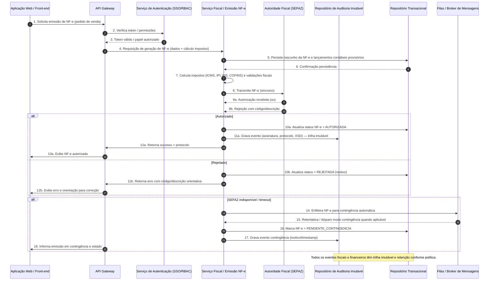

# Relatório Técnico de Arquitetura de Software

## 1. Identificação das HUs
Lista consolidada das Histórias de Usuário tratadas neste relatório (referência direta):

- HU01 — Gerar ordens de produção e calcular necessidade de materiais (MRP)
- HU02 — Monitorar OEE e desvios de produção em tempo real
- HU03 — Gerenciar cotações com múltiplos fornecedores
- HU04 — Acompanhar desempenho de fornecedores
- HU05 — Registrar inspeção de lote e bloquear reprovados
- HU06 — Rastrear lote do insumo ao produto acabado
- HU07 — Emitir NF-e com cálculo automático de impostos
- HU08 — Manter SPED Fiscal atualizado
- HU09 — Processar folha de pagamento mensal
- HU10 — Gerar obrigações acessórias de RH
- HU11 — Visualizar DRE e Fluxo de Caixa em tempo real
- HU12 — Acompanhar indicadores operacionais e financeiros pelo dashboard executivo

Mapeamento rápido para módulos principais (para referência):
- Planejamento & MRP: HU01
- Execução e MES/SCADA ingest: HU02, HU01 (apontamentos)
- Suprimentos / Compras: HU03, HU04
- Qualidade & Lote: HU05, HU06
- Fiscal / NF-e / SPED: HU07, HU08
- RH / Folha: HU09, HU10
- Contabilidade / DRE / Caixa: HU11
- Dashboards / KPIs: HU02, HU04, HU11, HU12

## 2. Diagramas de Arquitetura (Mermaid)

Diagrama de sequência: emissão de NF-e com caminho normal e contingência (inclui autorização SEFAZ, contingência, atualização de status, notificação e escrita em trilha auditável).



Diagrama de componentes (alto nível) — módulos e interfaces principais:

```mermaid
graph TD
  subgraph Frontend
    UI[Interface Web / Mobile Responsiva]
  end

  subgraph Plataforma
    APIGW[API Gateway / Gateways de Integração]
    AuthSvc[Serviço de Autenticação / Autorizações (SSO, RBAC, SoD)]
    Audit[Repositório de Auditoria Imutável]
    EventBus[Event Bus / Broker de Mensagens]
    DataLake[Armazenamento Analítico / DW]
    Monitoring[Métricas & Monitoramento]
  end

  subgraph Domínios
    PCP[PCP / MRP Engine / Sequenciamento]
    MESInt[MES/SCADA Adapter (OPC-UA, MQTT, REST)]
    Inventory[Gestão de Estoque & Endereçamento]
    Quality[Controle de Qualidade por Lote]
    Purchasing[Suprimentos & Cotação/OC/Recebimento]
    Warehouse[Logística / Expedição / Roteirização]
    Fiscal[Motor Fiscal / NF-e / CT-e / SPED]
    HR[Gestão de Pessoal & Folha]
    Accounting[Contabilidade / Lançamentos / DRE]
    Dashboards[Dashboards & KPIs (drill-down)]
  end

  UI -->|REST/gRPC| APIGW
  APIGW --> AuthSvc
  APIGW --> PCP
  APIGW --> Purchasing
  APIGW --> Inventory
  APIGW --> Quality
  APIGW --> Fiscal
  APIGW --> HR
  APIGW --> Accounting
  APIGW --> Dashboards

  PCP --> MESInt
  MESInt --> EventBus
  MESInt --> PCP

  PCP --> Inventory
  Purchasing --> Inventory
  Inventory --> Quality
  Quality --> Inventory
  Inventory --> Warehouse
  Warehouse --> Fiscal
  Purchasing --> Fiscal
  Fiscal --> Accounting
  HR --> Accounting
  Accounting --> Dashboards
  EventBus --> DataLake
  AllServices[PCP Purchasing Inventory Quality Warehouse Fiscal HR Accounting Dashboards] -->|events| EventBus
  AllServices -->|audit events| Audit
  Monitoring -->|metrics| AllServices
  DataLake --> Dashboards
```

Observações sobre diagramas:
- O diagrama de sequência demonstra fluxo crítico (NF-e) com comportamento síncrono e fallback de contingência.
- O diagrama de componentes explicita responsabilidades, interfaces e o barramento de eventos para integração assíncrona e consolidação analítica.

## 3. Decisões de Arquitetura
Cada decisão inclui motivação, consequência e alinhamento com RNFs.

1) Bounded contexts e modularização por domínio
- Decisão: Separar módulos por domínio (PCP, Suprimentos, Qualidade, Fiscal, RH, Contabilidade, Logística, Dashboards) com contratos explícitos.
- Motivação: Complexidade funcional extensa, requisitos de conformidade distintos, necessidade de isolamento de dados por unidade fabril (RF04, RNF16).
- Consequência: Facilita governança de requisitos, deployment independente, escalabilidade e aplicação de políticas SoD.

2) Arquitetura orientada a serviços com event-driven backbone
- Decisão: Comunicação mista: APIs RESTful para operações síncronas (ex.: emissão NF-e, autenticação), e Event Bus para sincronização eventual, integrações MES/SCADA e consolidação analítica.
- Motivação: Requisitos de integração em tempo real (RF11, RNF18) e necessidade de DRE em tempo real (HU11) sem acoplar fortemente serviços transacionais.
- Consequência: Permite escalabilidade e resiliência; introduz necessidade de compensações e design idempotente para eventos.

3) Confiança rígida para operações fiscais e financeiras (síncrono com garantias)
- Decisão: Transmissões fiscais críticas (NF-e/CT-e) tratadas preferencialmente via workflow síncrono com fallback de contingência assíncrona (fila) e trilha auditável imediata.
- Motivação: RNF15, RNF07, HU07 exigem latência e validade jurídica.
- Consequência: Implementar timeouts, retries, idempotência e estado transacional para evitar duplicidade fiscal.

4) Governança de segurança e conformidade aplicada centralmente
- Decisão: Serviços de autenticação e autorização centrais (SSO/LDAP) com RBAC e mecanismos SoD; criptografia de dados sensíveis em repouso e TLS para trânsito.
- Motivação: RF01, RF02; RNF01–RNF05, RNF09, RNF10.
- Consequência: Define pontos de integração obrigatórios para auditoria e exigirá políticas de gestão de chaves e certificação de auditoria.

5) Master Data Management (MDM) e isolamento por unidade fabril
- Decisão: Um serviço de MDM para Produtos, Fornecedores, Centros de Trabalho e Lotes, com visões isoladas por unidade e consolidação central.
- Motivação: RF04 (restrição de acesso por unidade), RNF16 (múltiplas unidades).
- Consequência: Necessidade de modelar identificação global e local, replicação e governança de conflitos.

6) Armazenamento analítico e trilha auditável separada
- Decisão: Repositório transacional para operações e um armazenamento analítico (data lake/warehouse) populado por eventos para dashboards e SPED.
- Motivação: RNF13, RNF14; HU11, HU12; performance dashboards.
- Consequência: Eventual consistency para painéis; requisitos de retenção e integridade para SPED e auditoria.

7) Observabilidade e SLOs operacionais
- Decisão: Métricas, logs estruturados e alertas para todos os módulos, painel de monitoramento e SLAs (incluindo disponibilidade 99,5%).
- Motivação: RNF12, RNF23.
- Consequência: Necessita definição de métricas, thresholds e runbooks.

## 4. Tabela de Componentes e Rastreabilidade

| Componente | Responsabilidade Principal | Comunica-se com | Origem (HU / Critério de Aceite) |
|------------|---------------------------|------------------|----------------------------------|
| Interface Web / Mobile | UI para usuários (operacional, fiscal, RH, dashboards) com responsividade | API Gateway | HU01…HU12 (usabilidade RNF24) |
| API Gateway | Entrada unificada, roteamento, autenticação inicial, rate limiting | AuthSvc, todos os serviços de domínio | RF02, RNF04, RNF19; HUs que usam UI |
| Serviço de Autenticação / RBAC / SSO | Autenticação SSO, autorização, SoD, tokens | API Gateway, todos os serviços | RF01, RF02, RNF03; HU07 (autorização emissão) |
| PCP / MRP Engine | Gestão OP, cálculo MRP, sequenciamento, apontamento | Inventory, MES Adapter, EventBus, DB | HU01 (MRP critérios), RNF13 (tempo MRP) |
| MES/SCADA Adapter | Conector configurável por planta (OPC-UA, MQTT, REST) para receber apontamentos e status | PCP, EventBus | RF11, RNF18; HU02 (OEE) |
| Inventory / WMS | Controle estoque, endereçamento, consumo por OP, bloqueio por qualidade | PCP, Quality, Warehouse, Purchasing | RF09, RF26; HU01, HU05 |
| Quality (Controle de Lote) | Planos de inspeção, registro de resultados, bloqueio de lotes, rastreabilidade | Inventory, PCP, Purchasing, EventBus | RF20–RF25; HU05, HU06 |
| Purchasing / Sourcing | Cadastro fornecedores, cotações, geração OC com fluxo de alçada | Inventory, Accounting, EventBus | RF13–RF19; HU03, HU04 |
| Warehouse / Logistics | Plano expedição, romaneios, integração transportadoras, RMA | Inventory, Fiscal, EventBus | RF26–RF30; HU12 (nível serviço) |
| Fiscal Engine (NF-e / CT-e / SPED) | Cálculo de impostos, geração NF-e/CT-e, transmissão à autoridade, geração SPED | API Gateway, Accounting, SEFAZ, Audit | RF31–RF36; HU07, HU08 |
| SEFAZ Adapter | Interface para transmissão/recepção com SEFAZ e fallback/contingência | Fiscal Engine, Queue | RNF15, RNF17; HU07 |
| HR / Payroll | Cadastro colaboradores, integração ponto, processamento folha, geração eSocial | Timekeeping devices, Accounting, EventBus | RF37–RF42; HU09, HU10 |
| Accounting / General Ledger | Geração automática de lançamentos, plano de contas, DRE e balanço | All services, DataLake | RF43–RF49; HU11 |
| Dashboards & KPI Engine | Dashboards configuráveis, drill-down, alertas de KPI | DataLake, Accounting, EventBus, API | RF50–RF53; HU02, HU11, HU12 |
| Event Bus / Broker | Transporte de eventos dominais, integrações assíncronas, eventual consistency | Todos os serviços, DataLake | RNF18, RNF19; HU11, HU12 |
| Data Lake / Analytics Store | Armazenamento analítico, feed para dashboards e SPED | EventBus, Dashboards, Accounting | RNF13, RNF14; HU11, HU12, HU08 |
| Repositório de Auditoria Imutável | Armazena trilhas de auditoria imutáveis para operações fiscais/financeiras/RH | Todos os serviços, Compliance | RF03, RNF10; HU07, HU08 |
| Monitoring & Metrics | Coleta métricas, logs estruturados, painéis e alertas operacionais | Todos os serviços | RNF23, RNF12 |
| Backup & Recovery Manager | Execução de backups diários/WAL, RPO/RTO operacional | DB, Storage | RNF21 |
| Master Data Management (MDM) | Gestão central de produtos, fornecedores, centros de trabalho | All services | RF05, RF13; HU06 |

(Notas: "Todos os serviços" implica que o componente disponibiliza API/contrato para integração.)

## 5. Bloqueios e Pendências
Itens que devem ser resolvidos para progresso do projeto e riscos arquiteturais:

1) Detalhes de integração com diretório corporativo SSO/LDAP
- Impacto: Sem especificação de esquema, mapeamento de atributos e fluxo SAML/OIDC, implementação de RBAC/SoD ficará incompleta.
- Ação: Obter documentação do diretório e requisitos de provisionamento.

2) Protocolos e endpoints de MES/SCADA por unidade fabril
- Impacto: Adaptação por planta (OPC-UA vs MQTT vs REST) afeta o design do adapter e dimensionamento de capacidade.
- Ação: Inventário de controladores/protocolos por unidade.

3) Fonte oficial de regras fiscais (NCM, alíquotas por UF) e mecanismo de atualização
- Impacto: Cálculo automático de impostos (HU07) depende de fonte canônica e fluxo de atualização.
- Ação: Definir fornecedor/duto de atualização das tabelas fiscais e mecanismo de versionamento.

4) Política de retenção e forma da trilha imutável (formato e armazenamento)
- Impacto: Conformidade RNF10 exige definição técnica (assinatura, retenção, acesso) e solução para imutabilidade.
- Ação: Definir formato de registros de auditoria, níveis de acesso e responsabilidade de custódia.

5) Regras de alçada e matriz de aprovação (compras, financeiro)
- Impacto: Fluxos de aprovação (HU03) dependem de regras configuráveis e autoridade delegada.
- Ação: Definir matriz de aprovações e integração com RBAC.

6) Requisitos de RTO/RPO detalhados para restauração além do RPO máximo de 1h
- Impacto: Planejamento de DR e testes de recuperação.
- Ação: Acordo formal de SLA de recuperação com infra/ops.

7) Especificar formatos e validações exatas para SPED/eSocial
- Impacto: Geração de arquivos e validação antes do envio (HU08, HU10).
- Ação: Obter leiautes vigentes e definir um componente validador de leiautes.

## 6. Cobertura de Requisitos
Resumo de mapeamento de requisitos (RF / RNF / HUs) para componentes e controles arquiteturais.

- RF01, RF02 (Gestão de usuários/SSO): Serviço de Autenticação + API Gateway; UX integrado; autenticação via SSO e gerenciamento de perfis. Cobertura: alta, pendente integração com diretório.
- RF03 (Auditoria): Repositório de Auditoria Imutável + logs estruturados; todas as operações críticas auditadas. Cobertura: alta (necessária política de retenção).
- RF04 (Isolamento por unidade): MDM + controle de escopo em RBAC + partição de dados por unidade em serviços. Cobertura: alta.
- RF05–RF11 (PCP/MRP, apontamento, integração MES): PCP/MRP Engine + MES Adapter + Inventory + Event Bus. Cobertura: alta; RNF13 MRP perf requer dimensionamento.
- RF12 (Alertas de desvio): Dashboards & KPI Engine + Event Bus + Notification via API/Gateway. Cobertura: alta.
- RF13–RF19 (Suprimentos): Purchasing + MDM + Inventory + Accounting; cotação e aprovação por alçada. Cobertura: alta (pendente regras de alçada).
- RF20–RF25 (Qualidade por lote): Quality + Inventory + Audit + Event Bus para bloqueio automático. Cobertura: alta.
- RF26–RF30 (Logística): Warehouse + Inventory + Fiscal + Event Bus. Cobertura: alta.
- RF31–RF36 (Fiscal): Fiscal Engine + SEFAZ Adapter + Audit + SPED generator. Cobertura: alta; pendente fonte de regras fiscais e leiautes.
- RF37–RF42 (RH/Folha): HR + Timekeeping adapters + Accounting + eSocial generator. Cobertura: alta; pendente integração com relógios de ponto (detalhes).
- RF43–RF49 (Contabilidade / DRE): Accounting + Event Bus + DataLake + MDM. Cobertura: alta.
- RF50–RF53 (Dashboards/KPIs): Dashboards & KPI Engine + DataLake; suporte a drill-down e export. Cobertura: alta.
- RNF01–RNF05 (Segurança): TLS, criptografia at-rest, RBAC/SoD, rate-limiting e auditoria periódica. Cobertura: projetada como obrigação central, pendente políticas e gestão de chaves.
- RNF06–RNF11 (Conformidade): Fiscal/RH/SPED/Trilha de auditoria: componentes previstos; ações pendentes para arquivos e retenção. Cobertura: projetada.
- RNF12–RNF17 (Disponibilidade/Desempenho/Resiliência): Arquitetura com redundância, contingência NF-e, MRP performance target. Cobertura: arquiteturalmente suportada; requer testes de carga e sizing.
- RNF18–RNF20 (Integração): MES Adapter, API Gateway e APIs RESTful documentadas. Cobertura: projetada.
- RNF21–RNF24 (Infraestrutura / Backups / Observabilidade / Usabilidade): Backup Manager, Monitoring & Metrics e UI responsiva. Cobertura: projetada.

## 7. Gap Analysis
Identificação de lacunas na especificação original que impactam arquitetura, com impacto e recomendação.

1) Lacuna: Especificação incompleta do formato/versão dos leiautes fiscais (NF-e/SPED/eSocial)
- Impacto arquitetural: Implementação do Motor Fiscal e do gerador de SPED depende de regras e validações exatas; sem isso, testes de conformidade não são possíveis.
- Recomendação: Obter e versionar os XSD/ leiautes oficiais; adotar mecanismo de atualização e testes automatizados de validação.

2) Lacuna: Matriz de alçadas/ regras de aprovação não formalizadas
- Impacto: Design do fluxo de workflows de aprovação (Purchasing) e integração com RBAC/SoD fica incompleto.
- Recomendação: Documento de regras de negócio para alçadas (valores, substituições, escalonamentos).

3) Lacuna: Detalhes operacionais do MES/SCADA por planta (protocolos, topologia, volume de mensagens)
- Impacto: Dimensionamento do adapter, modelos de ingestão e latência de OEE.
- Recomendação: Levantamento por unidade fabril com escala de tráfego esperada; compatibilizar segurança e rede industrial.

4) Lacuna: Política de gestão de chaves criptográficas e cofre de chaves
- Impacto: RNF02 (AES-256) e RNF01 (TLS) exigem KMS/gestão de chaves; sem política, risco de não conformidade.
- Recomendação: Definir processo de rotação, custódia e backups de chaves; incluir em auditoria.

5) Lacuna: Detalhamento de SLAs para integrações externas (transportadoras, bancos, SEFAZ em termos de timeout e retries)
- Impacto: Estratégias de retry/backoff e filas não podem ser parametrizadas corretamente.
- Recomendação: Formalizar SLAs com parceiros e configurar política de contingência.

6) Lacuna: Estratégia de migração de dados e reconciliação histórica
- Impacto: Ao migrar dados legados (estoques, OPs, cadastro fornecedores), Riscos de inconsistência e de geração de SPED incorreto.
- Recomendação: Plano de migração com scripts de conciliação, ambientes de validação e rollback.

7) Lacuna: Requisitos de mobilidade/offline para usuários de chão de fábrica
- Impacto: Interfaces e captura de apontamentos podem precisar funcionar com conectividade intermitente.
- Recomendação: Definir se os clientes de chão permitem operação offline; se sim, especificar capacidade de cache e sincronização.

8) Lacuna: Métricas exatas para dashbord RNF14 (o que é "dados do dia corrente") e requisitos de retenção de dados analíticos
- Impacto: Projeto de DataLake e ETL/CDC para suportar latência e dimensão temporal.
- Recomendação: Definir janelas de atualização e regras de agregação para KPIs.

9) Lacuna: Requisitos legais específicos sobre assinatura digital e validade jurídica dos documentos fiscais (certificados, custodial)
- Impacto: Fiscal Engine/SEFAZ Adapter precisa operar com certificados e cadeia de confiança.
- Recomendação: Definir regime de certificação e quem será responsável pela renovação e guarda.

10) Lacuna: Critérios e políticas de segregação por unidade fabril (multi-tenancy ou schemas separados)
- Impacto: Modelo de dados e rotas de autorização.
- Recomendação: Decidir modelo de isolamento (instância por unidade, esquema lógico ou tags) com impacto em backup, performance e consolidação.

Resumo das ações recomendadas de prioridade:
- Alta prioridade: Obter leiautes fiscais/XSD; matriz de alçadas; inventário MES/SCADA; política de chaves e certificados.
- Média prioridade: SLAs externos; migração de dados; definição de offline/cliente chão.
- Baixa prioridade: Política de retenção analítica detalhada (apesar de importante para compliance).

---

Fim do Relatório.