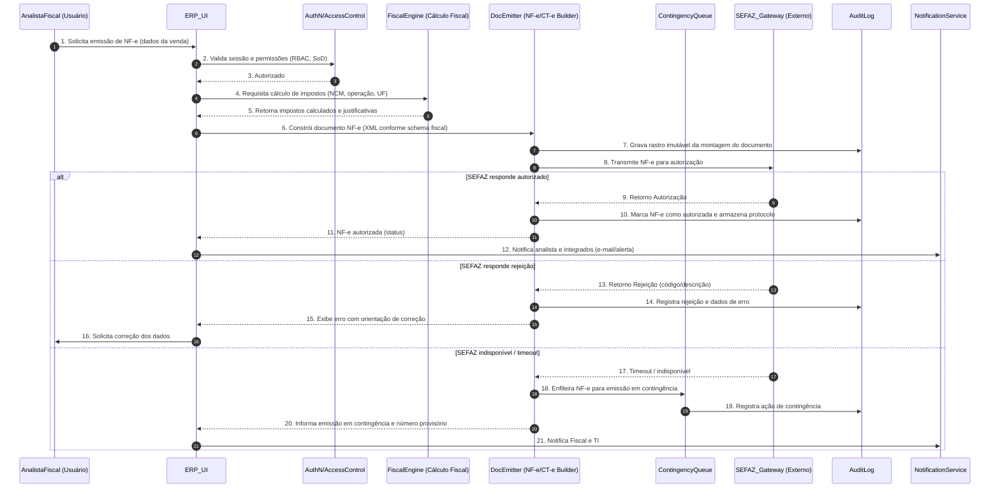

# Relatório Técnico de Arquitetura de Software

## 1. Identificação das HUs
Lista das Histórias de Usuário (HUs) extraídas e referenciadas no relatório:
- HU01 — Gerar ordens de produção e calcular necessidade de materiais (Planejador PCP)
- HU02 — Monitorar OEE e desvios de produção em tempo real (Planejador PCP)
- HU03 — Gerenciar cotações com múltiplos fornecedores (Comprador)
- HU04 — Acompanhar desempenho de fornecedores (Comprador)
- HU05 — Registrar inspeção de lote e bloquear reprovados (Analista de Qualidade)
- HU06 — Rastrear lote do insumo ao produto acabado (Analista de Qualidade)
- HU07 — Emitir NF-e com cálculo automático de impostos (Analista Fiscal)
- HU08 — Manter SPED Fiscal atualizado (Analista Fiscal)
- HU09 — Processar folha de pagamento mensal (Analista de RH)
- HU10 — Gerar obrigações acessórias de RH (Analista de RH)
- HU11 — Visualizar DRE e Fluxo de Caixa em tempo real (Controller)
- HU12 — Acompanhar indicadores operacionais e financeiros pelo dashboard executivo (Diretor/CEO)

Observação: todos os RF e RNF foram considerados ao modelar componentes e interfaces. A rastreabilidade detalhada por requisito aparece nas seções 4 e 6.

## 2. Diagramas de Arquitetura (Mermaid)

- Diagrama de sequência (fluxo de emissão de NF-e com contingência e cálculo de impostos) — atende HU07 e RNF15/RNF02/RNF07/RNF06:



- Diagrama de componentes (visão lógica de módulos e interfaces principais) — cobre os domínios PCP, Suprimentos, Qualidade, Logística, Fiscal, RH, Financeiro, Integração e Infra:

```mermaid
graph TD
  subgraph Core_System
    A[Autenticação & RBAC] 
    B[API Gateway / Orquestrador]
    C[Serviço de Auditoria (Trilha Imutável)]
    D[Catálogo de Produtos e Roteiros]
    E[Gestão Estoque & Lotes]
    F[Planejamento & MRP]
    G[Controle de Produção (OP / Apontamento)]
    H[Qualidade por Lote]
    I[Compras & Cotação]
    J[Recebimento & Conferência]
    K[Compras - Ordens de Compra]
    L[Fiscal & Emissão de Documentos (NF-e/CT-e)]
    M[Contingência de Documentos]
    N[Fornecedores / Performance]
    O[Logística / Expedições]
    P[Contabilidade / Lançamentos Automáticos]
    Q[Folha de Pagamento / RH]
    R[Dashboards & KPI Engine]
    S[Data Warehouse / Reporting]
  end

  subgraph Integrations
    U[MES/SCADA Gateway (OPC-UA / MQTT / REST)]
    V[Sistemas Bancários / Pagamentos]
    W[Parceiros/Clientes via APIs]
    X[Autoridades Fiscais (SEFAZ / SPED endpoints)]
    Y[Relógios de Ponto / Hardware]
  end

  subgraph InfraOps
    Z[Backup & Retenção]
    Z2[Monitoramento & Métricas]
    Z3[Queue/Event Bus (integração assíncrona)]
  end

  A -->|autentica| B
  B --> C
  B --> D
  D --> F
  F --> G
  G --> E
  G --> U
  U --> G
  E --> H
  J --> E
  I --> K
  K --> J
  I --> N
  H --> E
  H --> C
  L --> X
  L --> C
  L --> M
  M --> X
  S --> R
  P --> S
  Q --> P
  R --> S
  Z --> S
  Z2 --> B
  Z3 --> B
  B -->|async/events| Z3
  W --> B
  V --> P
  Y --> Q
```

Observações dos diagramas:
- Os nomes dos componentes são conceituais (não prescrevem tecnologias).
- Interfaces entre módulos devem expor contratos (REST/JSON e filas de eventos) e esquemas (XML/JSON) negociados.
- Gateway centraliza autenticação, autorização e roteamento entre UIs e serviços; integração com Event Bus permite desacoplamento para MRP, contabilização e dashboards em tempo real.

## 3. Decisões de Arquitetura
1. Arquitetura por dominios/bounded contexts:
   - Responsabilidade: isolar responsabilidades por domínio (PCP, Suprimentos, Qualidade, Fiscal, RH, Financeiro).
   - Racional: limita acoplamento, facilita conformidade e evolução normativa (ex.: regras fiscais isoladas).
   - Impacto: define contratos de API e mensagens entre contextos.

2. Comunicação síncrona + assíncrona:
   - Responsabilidade: operações de autorização/consulta (NF-e, consultas fiscais) por APIs síncronas; processamento em lote, MRP, contabilização e integrações com chão de fábrica por eventos/filas assíncronas.
   - Racional: atende requisitos de tempo resposta (RNF14, RNF15) e resilência (RNF17).
   - Impacto: exige mecanismo de retry, dead-letter e visibilidade de mensagens.

3. Persistência com separação de dados operacionais e analíticos:
   - Responsabilidade: cada domínio gerencia seu modelo transacional; Data Warehouse alimenta dashboards/KPIs e SPED.
   - Racional: atende necessidade de DRE em tempo real (RF45) e performance de dashboards (RNF14).
   - Impacto: projeto de ETL/streaming near-real-time, consistência eventual para relatórios.

4. Segurança e conformidade:
   - Responsabilidade: criptografia em repouso para dados sensíveis (financeiro, fiscal, RH), TLS para comunicações (RNF01, RNF02).
   - Racional: atender LGPD, requisitos fiscais e auditoria (RNF06, RNF07, RNF09, RNF10).
   - Impacto: gerenciamento de chaves, políticas de retenção, trilha de auditoria imutável.

5. Isolamento por unidade fabril com consolidação:
   - Responsabilidade: separar dados por unidade (multi-instance lógica ou tenancy com filtros de acesso).
   - Racional: RF04, RNF16 — necessidade de visibilidade local e consolidação central.
   - Impacto: governança de dados e performance de queries multi-unidade.

6. Mecanismo de contingência fiscal automático:
   - Responsabilidade: detectar indisponibilidade externa e alternar emissão para fila/contingência (RNF17).
   - Racional: continuidade fiscal e conformidade.
   - Impacto: gerar número provisório, sincronização posterior e gestão de conflitos.

7. Observabilidade e operabilidade:
   - Responsabilidade: exposição de métricas por módulo, dashboard de saúde, alertas.
   - Racional: RNF23, RNF12 — manutenção de SLA e resposta a incidentes.
   - Impacto: definir métricas padrão (latência de API, taxa de erros, tempo MRP, throughput de eventos).

Decisões não prescreveram tecnologia específica — apenas padrões e responsabilidades.

## 4. Tabela de Componentes e Rastreabilidade

| Componente | Responsabilidade Principal | Comunica-se com | Origem (HU / Critério de Aceite) |
|---|---:|---|---|
| Autenticação & RBAC | Autenticar usuários, integrar SSO/LDAP, aplicar SoD e políticas de alçada | API Gateway, UI, Todos os módulos | RF01, RF02, RNF03; HU07 (autorização), HU09 |
| API Gateway / Orquestrador | Roteamento, validação de tokens, throttling | UI, Serviços de domínio, Integrations | RNF19, RNF04 |
| Serviço de Auditoria (Trilha Imutável) | Registrar logs imutáveis de operações financeiras/fiscal/RH | Todos os módulos, Backup | RF03, RNF10 |
| Catálogo de Produtos e Roteiros | Gerenciar SKU, BOM, roteiros de produção | PCP, MRP, Estoque, Qualidade | RF05, HU01 |
| Gestão de Estoque & Lotes | Controle de saldos, status de lotes, bloqueios | PCP, Qualidade, Logística | RF09, RF26, HU05, HU06 |
| Planejamento & MRP | Cálculo de necessidades e geração de solicitações de compra | Catálogo, Estoque, Compras, Event Bus | RF06, HU01 (Critérios: tempo MRP RNF13) |
| Controle de Produção (OP / Apontamento) | Criar/gerir OPs, apontamentos, status por operação | MRP, MES Gateway, Estoque | RF05, RF08, HU01, HU02 |
| MES/SCADA Gateway | Integração com chão de fábrica (OPC-UA/MQTT/REST) | Controle de Produção, OEE, Event Bus | RF11, RNF18, HU02 |
| Qualidade por Lote | Planos de inspeção, resultados, bloqueios e NC | Gestão de Lotes, PCP, Compras | RF20-RF25, HU05, HU06 |
| Compras & Cotação | Solicitar cotações, comparar propostas e autorizar OCs | Fornecedores, Ordens de Compra | RF13-RF16, HU03 |
| Ordens de Compra & Aprovação | Emissão de OC com fluxos por alçada | Compras, Fornecedores, Financeiro | RF16, HU03 |
| Recebimento & Conferência | Conferência vinculada à OC, registro de lotes | Compras, Estoque, Qualidade | RF17, HU06 |
| Fornecedores / Performance | Histórico de desempenho por item/período | Compras, Dashboards | RF19, HU04 |
| Logística & Expedições | Planejar expedições, romaneios, CT-e | Pedidos de Venda, NF-e, Transportadoras | RF26-RF30 |
| DocEmitter (NF-e/CT-e Builder) | Construir e validar documentos fiscais conforme schemas | FiscalEngine, SEFAZ_Gateway, Audit | RF31-RF36, HU07 |
| FiscalEngine (Cálculo Fiscal) | Regra tributária por NCM/UF/Operação e cálculo de impostos | DocEmitter, Contabilidade | RF32, RNF06, HU07 |
| ContingencyQueue / Manager | Gerenciar emissão offline e sincronização posterior | DocEmitter, SEFAZ_Gateway | RNF17, HU07 |
| Contabilidade / Ledger | Geração automática de lançamentos contábeis | Todos os módulos, Reporting | RF43-RF46, HU11 |
| Folha de Pagamento / RH | Processamento da folha, obrigações (eSocial, CAGED) | Ponto Eletrônico, Financeiro, Audit | RF37-RF42, HU09, HU10, RNF08 |
| Dashboards & KPI Engine | Agregar KPIs, suportar drill-down e metas | Data Warehouse, Event Bus, UI | RF50-RF53, HU02, HU11, HU12 |
| Data Warehouse / Reporting | Armazenar histórico, gerar SPED e relatórios | Todos os módulos, Dashboards | RF48, HU08, HU11 |
| Event Bus / Message Broker | Transporte assíncrono de eventos entre domínios | MRP, Contabilidade, Dashboards | RNF18, RNF19 |
| Backup & Retenção | Backups automáticos; retenção e WAL para RPO/RTO | DBs, Storage | RNF21 |
| Monitoramento & Métricas | Exposição de métricas e alertas operacionais | InfraOps, TI | RNF23, RNF12 |

(Observação: a coluna "Comunica-se com" indica contratos lógicos — REST e/ou eventos. A granularidade de APIs e schemas será definida nas especificações de integração.)

## 5. Bloqueios e Pendências
1. Regras fiscais detalhadas:
   - Pendência: definição completa das regras por NCM, operação e UF (substituições, benefícios, CST/CSOSN).
   - Impacto: impede implementação completa do FiscalEngine e validação de SPED.
   - Ação recomendada: obter matriz de regras fiscais e exemplos de casos de tributação.

2. Especificação do fluxo de alçadas:
   - Pendência: regras de aprovação para OCs (delegação, valores, substituição de aprovador).
   - Impacto: bloqueia modelagem de workflow de compras/ordens.
   - Ação: mapear politicas de alçada e matriz de responsabilidades.

3. Protocolos/formatos de integração com SCADA/MES:
   - Pendência: confirmação de protocolos disponíveis por unidade (OPC-UA, MQTT, REST) e schemas de telemetria.
   - Impacto: impede desenvolvimento do adaptador MES/SCADA e cálculo correto de OEE.
   - Ação: coletar inventário de dispositivos/protocolos por unidade fabril.

4. Thresholds e parâmetros operacionais:
   - Pendência: valores padrão para alertas de desvio de produção, janela de cálculo de OEE e tolerâncias de qualidade.
   - Impacto: parametrização de alertas e KPIs.
   - Ação: definir thresholds por processo ou confirmar que serão configuráveis via UI.

5. Volume e cardinalidade de dados:
   - Pendência: estimativas de número de SKUs ativos, número de OPs/dia, taxa de eventos MES por segundo, tamanho do histórico de logs.
   - Impacto: dimensionamento de infra, performance de MRP (RNF13) e SLAs de dashboards (RNF14).
   - Ação: levantamento de capacidade para dimensionamento.

6. Política de retenção e acesso a logs (auditoria):
   - Pendência: definições detalhadas de retenção além do mínimo legal, políticas de anonimização (LGPD) e acesso.
   - Impacto: projeto de backup e criptografia, requisitos de privacidade.
   - Ação: formalizar política de retenção e regras de pseudonimização.

7. Critérios para geração e versão do SPED/eSocial:
   - Pendência: confirmação de leiautes alvo (versão do SPED/eSocial) e frequência de atualização.
   - Impacto: validação de arquivos e conformidade.
   - Ação: sincronizar com compliance fiscal da empresa.

8. SLAs com autoridades externas:
   - Pendência: acordos operacionais para tempo de retry com SEFAZ e janelas de contingência.
   - Impacto: comportamento da ContingencyQueue e política de sincronização.
   - Ação: definir políticas e processos operacionais.

9. Política de exportação e formatos:
   - Pendência: formatos preferenciais (p.ex. layouts para integração bancária) e homologações necessárias.
   - Impacto: integração com pagamentos e bancos.
   - Ação: coletar layouts e requisitos dos parceiros.

10. Regras de lotes e numeração:
    - Pendência: convenções de numeração de lote, granularidade de rastreabilidade e checkpoints obrigatórios.
    - Impacto: rastreabilidade completa (HU06).
    - Ação: padronizar regras de lote por produto/categoria.

## 6. Cobertura de Requisitos
Resumo rápido de cobertura por domínio (mapeamento conceitual):

- Gestão de Usuários e Acesso (RF01-RF04): coberto por Autenticação & RBAC + Audit Log + API Gateway. HU07/HU09 dependem de SoD e permissões.
- PCP (RF05-RF12): coberto por Catálogo, Planejamento & MRP, Controle de Produção, MES Gateway, Gestão de Estoque. HU01/HU02 mapeadas; RNF13 (tempo MRP) requer dimensionamento.
- Suprimentos (RF13-RF19): coberto por Compras & Cotação, Ordens de Compra, Fornecedores, Recebimento; HU03/HU04 mapeadas.
- Qualidade por Lote (RF20-RF25): coberto por Qualidade por Lote integrado com Gestão de Lotes; HU05/HU06 mapeadas.
- Logística/Distribuição (RF26-RF30): coberto por Gestão de Estoque, Logística & Expedições; integra com DocEmitter para NF-e/CT-e.
- Faturamento Fiscal/NF-e (RF31-RF36): coberto por FiscalEngine, DocEmitter, ContingencyQueue, integração com SEFAZ; HU07/HU08 mapeadas.
- RH e Folha (RF37-RF42): coberto por Folha de Pagamento/RH, integração com Ponto Eletrônico e obrigações; HU09/HU10 mapeadas.
- Contabilidade e DRE (RF43-RF49): coberto por Contabilidade/Ledger e Data Warehouse para DRE em tempo real; HU11 mapeada.
- Dashboards/KPIs (RF50-RF53): coberto por Dashboards & KPI Engine alimentado por Event Bus e Data Warehouse; HU12 mapeada.
- RNFs específicos:
  - Segurança (RNF01-RNF05): atendidos por TLS em comunicações, criptografia em repouso e RBAC/SoD — implementação operacional pendente (gestão de chaves).
  - Conformidade (RNF06-RNF11): arquitetura suporta conformidade; detalhes fiscais e leiautes ainda pendentes.
  - Disponibilidade/Desempenho (RNF12-RNF17): arquitetura prevê alta disponibilidade e contingência; dimensionamento e SLAs requerem dados de volume.
  - Integração (RNF18-RNF20): suportada via MES Gateway, API Gateway e Event Bus; especificação de contratos por unidade pendente.
  - Infra & Backup (RNF21-RNF24): backups e monitoramento previstos; políticas e RPO/RTO definidas no RNF21 (RPO 1h) atendidas conceptualmente.

Observação: cobertura funcional é ampla; pontos críticos que exigem detalhamento técnico e dados operacionais estão listados na seção 5.

## 7. Gap Analysis
Identificação das lacunas mais relevantes, impacto arquitetural e ações recomendadas:

1. Lacuna: Regras fiscais completas (NCM/UF/case matrix)
   - Impacto: FiscalEngine e validações de NF-e/SPED não podem ser testadas com cobertura real; risco de não conformidade.
   - Recomendação: entregar matriz detalhada de tributação com exemplos e casos de teste; priorizar integração com equipe fiscal para homologação.

2. Lacuna: Volume e taxas de eventos MES/OPs e cardinalidade de SKUs
   - Impacto: dimensionamento do MRP, latência dos dashboards e sizing do Event Bus e Data Warehouse.
   - Recomendações: levantamento de dados históricos e estimativas por unidade; definir cenários (pico/normal).

3. Lacuna: Política detalhada de alçadas e workflow de aprovação
   - Impacto: bloqueio na implementação de fluxos de OC e segregação de funções.
   - Recomendação: definir matriz de alçadas, regras de substituição e SLA de aprovação.

4. Lacuna: Definição de thresholds para alertas (OEE, desvios de produção, qualidade)
   - Impacto: notificações e acionadores de alertas sem critérios claros podem gerar ruído operacional.
   - Recomendação: definir thresholds iniciais por processo com possibilidade de ajuste via UI; armazenar histórico de ajustes para tuning.

5. Lacuna: Schemas e contratos de integração com parceiros e SEFAZ (XSD/REST schemas)
   - Impacto: interoperabilidade e certificação (p.ex. homologação SEFAZ) não podem ser finalizadas.
   - Recomendação: coletar XSDs oficiais e contratos de APIs de parceiros; incluir testes de integração automatizados.

6. Lacuna: Política de retenção, anonimização e consentimento (LGPD)
   - Impacto: operações de RH e auditoria podem expor dados além do necessário; riscos legais.
   - Recomendação: formalizar política LGPD, medidas de pseudonimização/anonymization e controles de acesso.

7. Lacuna: Estratégia de contingência detalhada e regras de negócio para sincronização posterior
   - Impacto: risco de duplicidade, conflito de números fiscais e inconsistências ao reconciliar documentos emitidos em contingência.
   - Recomendação: definir processo operacional de reconciliação, idempotência de reenvio e janelas de sincronização.

8. Lacuna: Testes de performance e critérios de aceitação operacionais (SLA)
   - Impacto: RNF13/RNF14/RNF15 possuem limites que precisam ser validados; sem testes não há garantia.
   - Recomendação: plano de testes de carga e performance com cenários representativos e critérios de aceite.

9. Lacuna: Regras de lote e rastreabilidade (granularidade e eventos obrigatórios)
   - Impacto: rastreabilidade end-to-end (HU06) pode perder checkpoints críticos.
   - Recomendação: definir pontos de captura de eventos obrigatórios (recebimento, inspeção, consumo em OP, inspeção final, expedição) e formatos de registro.

10. Lacuna: Políticas de failover e replicação entre unidades e consolidação central
    - Impacto: consolidação central pode ter latência; risco em cenários híbridos.
    - Recomendação: especificar requisitos de consolidação (near-real-time vs batch) e padrões de isolamento por unidade.

Conclusão e próximos passos rápidos:
- Validar e obter os artefatos pendentes listados (matriz fiscal, volumes, contratos de integração, políticas de alçada e LGPD).
- Produzir especificações de API/ESB e contratos de eventos; criar testes de integração com SEFAZ e MES.
- Planejar proof-of-concept das partes críticas: FiscalEngine + DocEmitter com ContingencyQueue e MRP com base de dados representativa.
- Preparar plano de testes de carga para validar RNF13-RNF15.

Fim do Relatório.