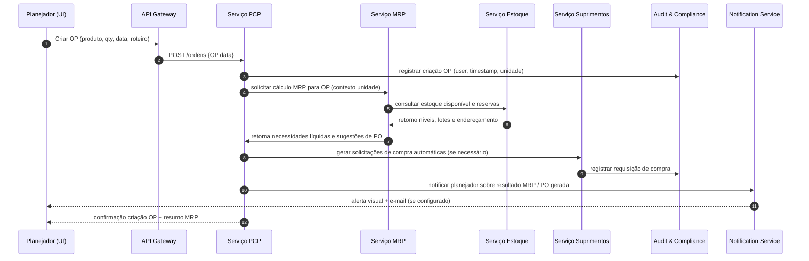
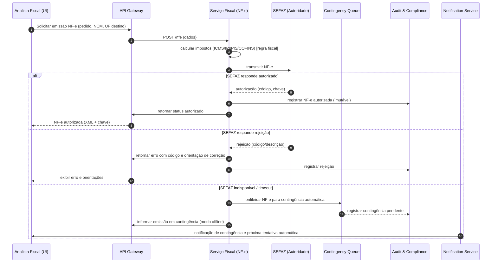

# Relatório Técnico de Arquitetura de Software

## 1. Identificação das HUs

Lista das HUs tratadas neste relatório com referência aos requisitos funcionais (RF) e critérios de aceite:

- HU01 — Gerar ordens de produção e calcular necessidade de materiais  
  - Principais RFs associados: RF05, RF06, RF09, RF14  
  - Critérios de aceite: associação OP -> produto/quantidade/roteiro; MRP calcula necessidades líquidas; geração automática de solicitações de compra.

- HU02 — Monitorar OEE e desvios de produção em tempo real  
  - Principais RFs: RF07, RF08, RF10, RF11, RF12  
  - Critérios de aceite: cálculo OEE via apontamento + integração chão de fábrica; alertas e drill-down.

- HU03 — Gerenciar cotações com múltiplos fornecedores  
  - Principais RFs: RF13, RF15, RF16  
  - Critério: envio cotações, comparação automática, aprovação por alçada.

- HU04 — Acompanhar desempenho de fornecedores  
  - Principais RFs: RF13, RF19 (integração), RF19 também para integração de dados históricos  
  - Critério: painel com índices, filtros e exportação.

- HU05 — Registrar inspeção de lote e bloquear reprovados  
  - Principais RFs: RF20, RF21, RF22, RF23, RF24  
  - Critério: registro de parâmetros, bloqueio automático, notificações.

- HU06 — Rastrear lote do insumo ao produto acabado  
  - Principais RFs: RF23, RF26, RF28  
  - Critério: rastreabilidade completa e exportável.

- HU07 — Emitir NF-e com cálculo automático de impostos  
  - Principais RFs: RF31, RF32, RF33, RF34, RF36, RNF06, RNF07, RNF17  
  - Critério: cálculo e transmissão em até 30s; contingência automática; tratamento de rejeições.

- HU08 — Manter SPED Fiscal atualizado  
  - Principais RFs: RF36, RNF08, RF43 (lançamentos contábeis)  
  - Critério: registros automáticos e validação.

- HU09 — Processar folha de pagamento mensal  
  - Principais RFs: RF37, RF38, RF39, RF40, RNF11, RNF09  
  - Critério: integração ponto eletrônico; geração de remessa bancária; eSocial.

- HU10 — Gerar obrigações acessórias de RH  
  - Principais RFs: RF40, RNF08, RNF09  
  - Critério: geração de arquivos nos leiautes vigentes e alertas de prazo.

- HU11 — Visualizar DRE e Fluxo de Caixa em tempo real  
  - Principais RFs: RF43, RF44, RF45, RF46, RF47, RF49, RF50, RF51, RF52  
  - Critério: DRE consolidada e drill-down até o lançamento contábil.

- HU12 — Dashboard executivo com KPIs operacionais e financeiros  
  - Principais RFs: RF50, RF51, RF52, RF53, RNF14, RNF16  
  - Critério: KPIs mínimos (OEE, produção, receita, margem, qualidade, nível de serviço) com drill-down em até 3 cliques.

Observação: todas as HUs dependem de mecanismos transversais de segurança, auditoria e integração (RNF01–RNF05, RNF10, RNF18–RNF20).

---

## 2. Diagramas de Arquitetura (Mermaid)

Observação: os diagramas apresentam visão lógica de componentes e duas sequências representando fluxos críticos: (A) execução de MRP ao criar OP (HU01) e (B) emissão de NF-e com contingência automatizada (HU07).

A) Diagrama de componentes (visão lógica de alto nível)
```mermaid
graph TD
  subgraph UI
    UI_Web[Portal Web / Dashboards / Mobile]
  end

  subgraph Gateway
    API_GW[API Gateway / Facade]
  end

  subgraph Core
    IAM[Auth & IAM (SSO/LDAP + RBAC)]
    PCP[PCP - Ordens e Planejamento]
    MRP[MRP Engine]
    Inventory[Gestão de Estoque / Endereçamento]
    Purchasing[Suprimentos / Cotação / OC]
    Quality[Controle de Qualidade / Lotes]
    Shopfloor[Adapter Chão de Fábrica (SCADA/MES)]
    Logistics[Logística / Expedição]
    Fiscal[Fiscal & NF-e / CT-e Engine]
    HR[Gestão de RH / Folha]
    Accounting[Contabilidade / Lançamentos]
    Reporting[KPI / OLAP / DRE / Dashboards]
    IntegrationBus[Bus de Integração (eventos/pub-sub)]
    Audit[Audit & Compliance / Ledger imutável]
    Contingency[Contingency Queue - NF-e offline]
    Monitoring[Monitoramento / Métricas / Health]
    FileExport[Exportador (XML/CSV/XLSX) e SPED]
  end

  UI_Web -->|REST/GraphQL| API_GW
  API_GW --> IAM
  API_GW --> PCP
  API_GW --> Inventory
  API_GW --> Purchasing
  API_GW --> Quality
  API_GW --> Logistics
  API_GW --> Fiscal
  API_GW --> HR
  API_GW --> Reporting

  PCP --> MRP
  MRP --> Inventory
  MRP --> Purchasing
  PCP --> Shopfloor
  Shopfloor -->|OP status / Telemetria| PCP
  Shopfloor -->|Eventos (OP start/stop/status)| IntegrationBus

  Inventory --> Quality
  Quality --> Inventory
  Inventory --> Purchasing

  Purchasing --> Contingency
  Fiscal --> Contingency
  Fiscal -->|transmissão NF-e| Contingency
  Fiscal --> IntegrationBus
  IntegrationBus --> Reporting
  IntegrationBus --> Accounting
  Accounting --> Reporting
  HR --> Accounting
  FileExport -->|SPED/Dados| Reporting
  Audit -->|registra| IntegrationBus
  IntegrationBus --> Audit

  Monitoring -->|métricas| UI_Web
  Monitoring --> API_GW
```

B) Sequência: Criação de Ordem de Produção e execução de MRP (HU01)


C) Sequência: Emissão de NF-e com contingência automática (HU07)


---

## 3. Decisões de Arquitetura

1. Estratégia de Bounded Contexts e Modularização
   - Dividir o sistema por domínios funcionais (PCP, Suprimentos, Estoque, Qualidade, Fiscal, RH, Contabilidade, Reporting) com contratos de API bem definidos. Isso facilita evolução independente, responsabilidades claras e isolamento de dados por unidade fabril.

2. Integração baseada em APIs + Barramento de Eventos
   - Comunicação síncrona (API Gateway / REST) para operações transacionais e UI; comunicação assíncrona via barramento de eventos (pub/sub) para integração entre módulos (ex.: eventos de consumo de estoque, emissão NF-e, apontamentos de produção). Permite escalabilidade e eventual consistência controlada.

3. Adapter Layer para Chão de Fábrica
   - Implementar adaptadores configuráveis por unidade fabril que suportem OPC-UA, MQTT e REST/JSON. Adaptadores traduzem eventos de equipamentos em eventos do domínio (apontamento, status máquina).

4. Autenticação/Autorização e Governança de Acesso
   - Integração com SSO corporativo (LDAP/Active Directory) para autenticação centralizada; RBAC com políticas de segregação de funções configuráveis para operações críticas (fiscal/financeiro). Todos os acessos e ações críticos auditáveis.

5. Auditoria imutável e retenção regulamentar
   - Todas as operações financeiras, fiscais e RH serão registradas em um repositório de auditoria com propriedades imutáveis e retenção configurável (mínimo 10 anos), com trilha que atenda exigências legais.

6. Contingência e Resiliência para Fiscal
   - Mecanismo de fila/contingência para NF-e e transmissão automática quando SEFAZ indisponível; logs detalhados de tentativas e tratamento de rejeições com retorno de códigos e orientações ao usuário.

7. Coleta de métricas e observabilidade
   - Expor métricas operacionais por componente para painel de monitoramento (latência, taxa de erro, uso de recursos), além de health checks e alertas.

8. Segurança de dados
   - TLS >= 1.2 para transporte; criptografia em repouso para dados sensíveis (financeiro, fiscal, RH) e gestão de chaves compatível com conformidade; rate limiting e bloqueio por políticas.

9. Armazenamento e partição por unidade fabril
   - Modelo de dados lógico com isolamento/particionamento por unidade fabril para atender restrição de acesso entre unidades e consolidação centralizada para relatórios.

10. Exportação e conformidade de arquivos
    - Componente de exportação com formatos XML, CSV, XLSX e gerador de SPED/eSocial com validações pré-envio.

Decisões não prescrevem tecnologias específicas — descrevem responsabilidades e interfaces conceituais conforme Diretriz de Neutralidade Tecnológica.

---

## 4. Tabela de Componentes e Rastreabilidade

| Componente | Responsabilidade Principal | Comunica-se com | Origem (HU / Critério de Aceite) |
|---|---|---:|---|
| UI (Portal Web / Dashboards) | Interface para usuários; dashboards, formulários e ações | API Gateway, Notification Service, Reporting | HU01, HU02, HU03, HU07, HU11, HU12 |
| API Gateway / Facade | Expor APIs públicas/seguras, roteamento, rate limiting | Todos os serviços core, IAM, Monitoring | Transversal para todas as HUs |
| Auth & IAM | SSO/LDAP integração, RBAC, sessões, SoD enforcement | API Gateway, UI, Audit | RF01, RF02, RNF03 (HU transversais) |
| PCP (Ordens e Planejamento) | Gestão de OP, roteiros, apontamentos | MRP, Shopfloor, Inventory, Audit | HU01 (OP e MRP), HU02 (apontamento) |
| MRP Engine | Cálculo de necessidades, geração de POs sugeridas | Inventory, Purchasing, PCP, Audit | HU01 (MRP em até 10 min) ; RF06 |
| Inventory (Estoque / Endereçamento) | Estoque em tempo real, consumo por OP, bloqueios de lote | PCP, Quality, Purchasing, Logistics | RF09, RF26, HU01, HU05 |
| Purchasing (Suprimentos / Cotação / OC) | Gerir fornecedores, cotações, OCs, aprovação por alçada | Inventory, Audit, Notification | HU03, HU04, RF13–RF16 |
| Quality (Controle por Lote) | Planos de inspeção, resultados, bloqueio lotes | Inventory, PCP, Audit, Notification | HU05, HU06, RF20–RF25 |
| Shopfloor Adapter (SCADA/MES) | Integração com chão de fábrica via OPC-UA/MQTT/REST | PCP, MRP, IntegrationBus | RF11, RNF18 (HU02 HU01) |
| Fiscal & NF-e Engine | Cálculo impostos, geração XML NF-e/CT-e, transmissão SEFAZ | SEFAZ, Contingency, Accounting, FileExport, Audit | HU07, HU08, RF31–RF36, RNF06–RNF07 |
| Contingency Queue | Fila de NF-e/CT-e offline e reenvio automático | Fiscal, Audit, Notification | HU07 (contingência automática) |
| Accounting (Contabilidade) | Lançamentos automáticos, plano de contas configurável | IntegrationBus, Reporting, Audit | RF43–RF49, HU11 |
| HR / Payroll | Cadastro colaboradores, ponto eletrônico, processamento folha | Timeclocks, Accounting, FileExport | HU09, HU10, RF37–RF42 |
| Reporting / KPI Engine / OLAP | DRE em tempo real, dashboards, drill-down | IntegrationBus, Accounting, PCP, Inventory, Quality | HU11, HU12, RF50–RF53 |
| IntegrationBus (Eventos) | Pub/Sub para eventos entre áreas (consumo estoque, NF-e, apontamentos) | Todos os serviços core | Transversal (assistência a HU01–HU12) |
| FileExport / SPED Generator | Geração e validação de arquivos SPED/eSocial e exportações | Fiscal, HR, Accounting, Reporting | HU08, HU10, RF36, RNF08 |
| Audit & Compliance Ledger | Registro imutável de operações (fiscais/financeiras/RH) | Todos os serviços; gera relatórios de auditoria | RNF10, RF03, HU07, HU09 |
| Notification Service | Envio de e-mail, alertas, notificações de painel | UI, Audit, Purchasing, PCP, Quality, Fiscal | HU02 (alertas de desvio), HU05 (notificação reprovado), HU07 |
| Monitoring / Metrics | Métricas operacionais e health checks | All components, UI | RNF23, RNF12 |
| File Storage / Backup Manager | Backups, retenção e criptografia em repouso | All components, Audit | RNF02, RNF21 |
| Exported Documents Repository | Armazenamento de NF-e, CT-e, SPED, relatórios | Fiscal, FileExport, Audit | HU07, HU08 |

Observação: "Comunica-se com" indica interfaces lógicas, não tecnologias específicas.

---

## 5. Bloqueios e Pendências

1. Acesso a ambientes e contratos de integração com SEFAZ e provedores de transmissão NF-e  
   - Impacto: sem credenciais e endpoints oficiais não é possível validar latências de transmissão e tratamento de rejeições reais.  
   - Ação recomendada: obter ambiente de homologação SEFAZ e credenciais de testes.

2. Definição de regras detalhadas de Segregação de Funções (SoD) e matrizes de aprovação por alçada  
   - Impacto: implementação incompleta de controles RBAC e fluxos de aprovação de OCs e notas fiscais.  
   - Ação: workshop com compliance/financeiro para catalogar papéis, níveis de aprovação e exceções.

3. Volume de dados e SLAs de integração com SCADA/MES por unidade fabril (throughput, latência)  
   - Impacto: dimensionamento de adaptadores e barramento de eventos; performance de dashboards em tempo real.  
   - Ação: coletar estimativas de eventos/segundos e amostras de telemetria por unidade.

4. Regras fiscais completas (tabelas de alíquotas, substituição tributária, exceções por NCM/UF) e fontes de atualização automatizada  
   - Impacto: calculadora de impostos precisa de regras completas para evitar rejeições fiscais.  
   - Ação: definir fonte oficial de atualização e processo de atualização contínua das regras fiscais.

5. Política de criptografia e gestão de chaves (KMS) detalhada e responsabilidades legais para retenção >10 anos  
   - Impacto: conformidade normativa e capacidade de restaurar/ler dados antigos.  
   - Ação: definir política de chaves, rotação e procedimentos de recuperação.

6. Definição de semântica de entrega de eventos (at-least-once vs exactly-once) para processos críticos (consumo de estoque, NF-e)  
   - Impacto: riscos de duplicidade ou perda em integrações assíncronas.  
   - Ação: acordar estratégia por tipo de evento e projetar idempotência.

7. Testes de segurança / pentest agendados e critérios de aceitação de risco  
   - Impacto: conformidade RNF05 e exposição a falhas de segurança não detectadas.  
   - Ação: agendar auditorias antes da produção e definir remediações prioritárias.

8. Matrizes de responsabilidade para notificações/alertas (quem recebe e por qual canal)  
   - Impacto: alertas importantes podem não ser atendidos.  
   - Ação: definir listas de distribuição e níveis de severidade.

---

## 6. Cobertura de Requisitos

Resumo de cobertura por família de requisitos (status: Coberto / Parcial / A ser detalhado):

- Gestão de Usuários e Acesso (RF01–RF04): Coberto  
  - Componentes: Auth & IAM, Audit, API Gateway  
  - Observação: SoD e matrizes de alçadas precisam de definição detalhada (pendência).

- PCP e MRP (RF05–RF12): Coberto com ressalvas  
  - Componentes: PCP, MRP, Shopfloor Adapter, Inventory, IntegrationBus, Notification  
  - Observação: dimensionamento do MRP para 50k itens (RNF13) será verificado com dados de volume; integrações SCADA/MES dependem de dados reais.

- Suprimentos (RF13–RF19): Coberto  
  - Componentes: Purchasing, Inventory, Audit, Notification  
  - Observação: comparação automática de propostas e histórico de desempenho implementável via módulo Purchasing + Reporting.

- Controle de Qualidade por Lote (RF20–RF25): Coberto  
  - Componentes: Quality, Inventory, PCP, Audit, Notification  
  - Observação: requisitos de inspeção e bloqueio automático suportados; integração para inspeções automatizadas pode exigir equipamentos/adaptadores.

- Logística e Distribuição (RF26–RF30): Coberto  
  - Componentes: Logistics, Inventory, Fiscal, Reporting  
  - Observação: integração com transportadoras e rastreamento requererá contratos e APIs de parceiros.

- Faturamento Fiscal e NF-e (RF31–RF36): Coberto com contingência  
  - Componentes: Fiscal, Contingency Queue, FileExport, Audit  
  - Observação: transmissão em até 30s (RNF15) depende de rede e SEFAZ; requisitos de schemas XSD atendidos via validação no FileExport.

- RH e Folha (RF37–RF42): Coberto  
  - Componentes: HR, Timeclock adapters, Accounting, FileExport  
  - Observação: obrigações eSocial e arquivos requerem manutenção do leiaute e atualizações regulatórias (RNF08).

- Contabilidade e DRE (RF43–RF49): Coberto  
  - Componentes: Accounting, Reporting, IntegrationBus  
  - Observação: lançamentos automáticos requerem mapeamento contábil detalhado por evento transacional.

- Dashboards e KPIs (RF50–RF53): Coberto  
  - Componentes: Reporting / KPI Engine, UI, IntegrationBus  
  - Observação: performance de carregamento em até 5s (RNF14) dependerá de modelagem OLAP e pré-aggregações.

- Requisitos Não-Funcionais (RNF01–RNF24): Parcial / Coberto com entradas  
  - Segurança (RNF01–RNF05): arquitetura prevê TLS, criptografia em repouso, RBAC, rate limiting; pentests pendentes.  
  - Conformidade (RNF06–RNF11): processos e componentes previstos; atualizações legais e provas de conformidade pendentes.  
  - Disponibilidade/Desempenho (RNF12–RNF17): design tolerante e contingência prevista; SLAs e dimensionamento por volumes pendentes.  
  - Integração (RNF18–RNF20): adaptadores e APIs previstas; documentação de APIs necessária.  
  - Infraestrutura/Dados (RNF21–RNF24): backups, opções de implantação híbrida, métricas e UI responsiva previstas; políticas e testes pendentes.

Conclusão: funcionalidade funcionalmente coberta por componentes propostos; detalhes operacionais, regras fiscais, SoD e dimensionamento requerem inputs adicionais.

---

## 7. Gap Analysis

1. Lacuna: Regras fiscais completas e manutenção automática de tabelas (NCM/aliquota/UF)
   - Impacto: cálculos de impostos e geração NF-e podem gerar rejeições ou erros fiscais.
   - Risco: alto (rejeições fiscais, multas).
   - Recomendações: definir fonte autorizada das regras fiscais; implementar processo de atualização automática e testes de regressão fiscal.

2. Lacuna: Matriz de Segregação de Funções (SoD) e políticas de alçada detalhadas
   - Impacto: implementação parcial de controles de autorização, possíveis conflitos de interesse.
   - Risco: médio-alto (compliance financeiro).
   - Recomendações: realizar workshops com compliance/financeiro para catalogar papéis/níveis e incluir em requisitos de IAM.

3. Lacuna: Dados de dimensionamento (volumes de transações, eventos por segundo, tamanho do catálogo)
   - Impacto: MRP, dashboards e barramento de eventos podem não atender desempenho esperado.
   - Risco: médio (degradação de performance).
   - Recomendações: coletar dados de carga esperada; realizar provas de conceito (PoC) para MRP e consultas OLAP.

4. Lacuna: Semântica de entrega de mensagens (idempotência/duplica) e garantias (exactly-once)
   - Impacto: duplicidade de operações (ex.: múltiplas baixas de estoque) ou perda de eventos.
   - Risco: médio (inconsistências transacionais).
   - Recomendações: definir semântica por fluxo; projetar idempotência em serviços consumidores e correladores de eventos.

5. Lacuna: Política de gestão de chaves e longo prazo (retenção >10 anos)
   - Impacto: impossibilidade de desencriptar dados antigos, risco regulatório.
   - Risco: alto.
   - Recomendações: definir política de KMS, backup das chaves e procedimentos legais/operacionais para retenção e recuperação.

6. Lacuna: Critérios de disponibilidade por componente (SLA 99,5% aplicável a quais serviços?)
   - Impacto: operação fabril pode ser afetada se componentes críticos não tiverem SLAs definidos.
   - Risco: médio.
   - Recomendações: classificar componentes críticos (PCP, MRP, Fiscal) e definir SLAs e estratégias de alta disponibilidade.

7. Lacuna: Procedimentos e regras de contingência detalhadas para NF-e (quando acionar, quantas tentativas, log)
   - Impacto: inconsistência entre emissões offline e posteriores sincronizações.
   - Risco: médio.
   - Recomendações: documentar política de contingência (nº tentativas, backoff, prioridade) e testes end-to-end com homologação SEFAZ.

8. Lacuna: Acordos com fornecedores de integração (transportadoras, MES, relógios de ponto)
   - Impacto: integrações podem não ser possíveis dentro dos formatos/SLAs desejados.
   - Risco: médio.
   - Recomendações: mapear APIs e negociar contratos de integração; implementar adaptadores configuráveis.

9. Lacuna: Definição de thresholds padronizados e mecanismo de configuração de alertas
   - Impacto: variabilidade excessiva entre unidades; dificuldade em operacionalizar alertas de desvio.
   - Risco: baixo-médio.
   - Recomendações: criar catálogo de thresholds por KPI e permitir override por unidade com historização.

10. Lacuna: Testes de conformidade (SPED/eSocial) automatizados contra leiautes oficiais
    - Impacto: risco de rejeição por layout ou inconsistência de dados.
    - Risco: médio.
    - Recomendações: implementar validadores automatizados dos leiautes com atualização para novas versões; incluir em pipeline CI/CD.

Resumo da ação mínima imediata (próximos passos):
- Obter ambiente de homologação SEFAZ e credenciais; executar fluxos de NF-e e contingência.
- Workshop de SoD e alçadas com compliance/financeiro.
- Coleta de métricas/volumes reais para dimensionamento MRP/dashboards e testes de carga.
- Definir política de chaves, retenção e testes de backups/recuperação.
- Definir SLAs por componente e plano de alta disponibilidade para módulos críticos.

---

Fim do Relatório.