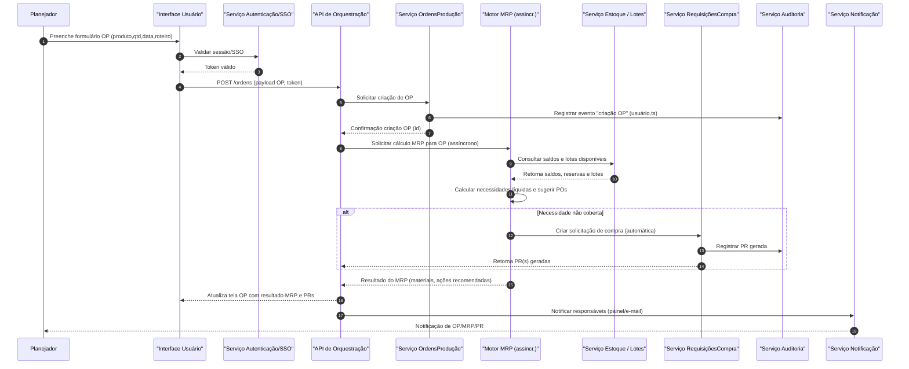
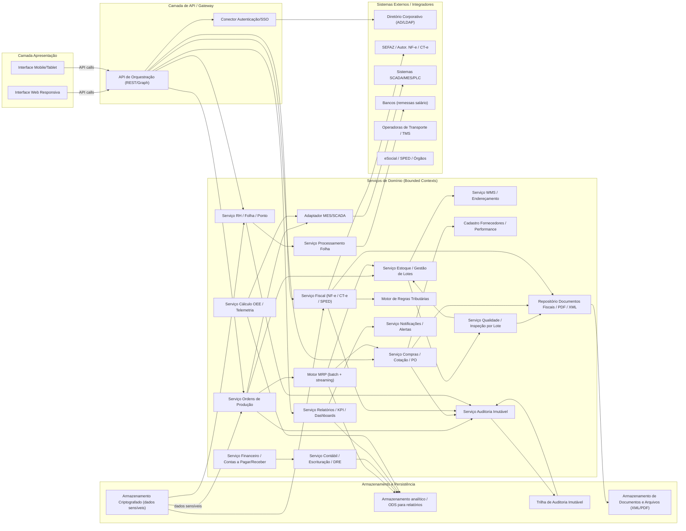

# Relatório Técnico de Arquitetura de Software

## 1. Identificação das HUs

Resumo das Histórias de Usuário (HU) e mapeamento para requisitos funcionais (RF) principais:

- HU01 — Gerar ordens de produção e calcular necessidade de materiais  
  - Principais RFs: RF05, RF06, RF09, RF14  
  - Critérios de aceite: OP associada a produto/quantidade/roteiro; MRP considera estoque/OPs/POs; geração automática de solicitações de compra.

- HU02 — Monitorar OEE e desvios de produção em tempo real  
  - Principais RFs: RF07, RF08, RF10, RF11, RF12  
  - Critérios de aceite: cálculo automático de OEE; alertas e drill-down.

- HU03 — Gerenciar cotações com múltiplos fornecedores  
  - Principais RFs: RF13, RF15, RF16  
  - Critérios de aceite: envio para múltiplos fornecedores; comparação por critérios; aprovação por alçada.

- HU04 — Acompanhar desempenho de fornecedores  
  - Principais RFs: RF19, RF13, RF25  
  - Critérios de aceite: painel com índices de pontualidade/qualidade/preço; filtros; exportação.

- HU05 — Registrar inspeção de lote e bloquear reprovados  
  - Principais RFs: RF20, RF21, RF22, RF23, RF24  
  - Critérios de aceite: registro de parâmetros; bloqueio automático no estoque; notificações.

- HU06 — Rastrear lote do insumo ao produto acabado  
  - Principais RFs: RF23, RF25, RF26, RF29  
  - Critérios de aceite: rastreabilidade completa entre NF-e entrada/OP/consumo/inspeção/NF-e saída; exportação PDF.

- HU07 — Emitir NF-e com cálculo automático de impostos  
  - Principais RFs: RF31, RF32, RF33, RF34, RNF06, RNF07  
  - Critérios de aceite: cálculo automático; transmissão em até 30s; tratamento de rejeição; contingência automática.

- HU08 — Manter SPED Fiscal atualizado  
  - Principais RFs: RF36, RNF08, RNF10  
  - Critérios de aceite: geração automática dos registros; validação pré-transmissão; geração histórica.

- HU09 — Processar folha de pagamento mensal  
  - Principais RFs: RF37, RF38, RF39, RF41, RNF11  
  - Critérios de aceite: integração com ponto; cálculo de encargos; geração de remessa bancária e eSocial.

- HU10 — Gerar obrigações acessórias de RH  
  - Principais RFs: RF40, RNF08, RNF09  
  - Critérios de aceite: geração no leiaute vigente; alertas de prazos; validação antes do envio.

- HU11 — Visualizar DRE e Fluxo de Caixa em tempo real  
  - Principais RFs: RF43, RF45, RF46, RF47, RF49, RF50  
  - Critérios de aceite: DRE consolidada e por centro de custo; drill-down até lançamentos.

- HU12 — Acompanhar indicadores pelo dashboard executivo  
  - Principais RFs: RF50, RF51, RF52, RF53, RNF14, RNF16  
  - Critérios de aceite: KPIs mínimos (OEE, produção x planejado, receita vs meta, etc.); drill-down em ≤3 cliques; exportação.

Observação: as HUs cobrem os fluxos transversais majoritariamente; RFs não cobrados diretamente por HUs específicas (p.ex. RF18, RNF12, RNF13) foram consideradas nos requisitos de produção e infraestrutura e aparecem nas decisões e componentes.

---

## 2. Diagramas de Arquitetura (Mermaid)

Abaixo dois diagramas: sequência (fluxo HU01) e diagrama de componentes alto-nível.

1) Diagrama de sequência (HU01: criação de OP e cálculo MRP)

2) Diagrama de componentes (visão lógica de domínios e integrações)

---

## 3. Decisões de Arquitetura

Cada decisão declara responsabilidade, motivação e implicações.

1. Bounded contexts e serviços por domínio (microserviços lógicos)
   - Responsabilidade: separar funcionalidades (PCP, Estoque, Compras, Qualidade, Fiscal, RH, Financeiro, Contabilidade, KPI).
   - Motivação: escalabilidade por unidade fabril, isolamento de dados, deploy/atualização independentes.
   - Implicações: exige definição clara de APIs, contratos e versionamento; integrações assíncronas e mensageria para consistência eventual.

2. Orquestração via API Gateway + Serviços especializados
   - Responsabilidade: roteamento, autenticação, limitação de taxa e agregação de serviços.
   - Motivação: simplificar consumidores e aplicar políticas transversais (segurança, logging).
   - Implicações: ponto de controle único; dimensionar para picos de dashboard e emissão fiscal.

3. Integração híbrida (sincrona REST para comandos, assíncrona para eventos/transfers)
   - Responsabilidade: comandos críticos (ex.: emissão NF-e) preferencialmente síncronos com timeout; MRP e eventos de chão de fábrica por streams/filas.
   - Motivação: atender RNF15 (tempo de emissão NF-e) e RNF13 (MRP em até 10 minutos), preservar responsividade UI.
   - Implicações: definir SLAs para filas; garantir idempotência de operações.

4. Adapters para SCADA/MES com protocolos padrão configuráveis
   - Responsabilidade: suportar OPC-UA, MQTT e REST/JSON por unidade fabril.
   - Motivação: RNF18; heterogeneidade de chão de fábrica.
   - Implicações: necessidade de mapeamentos de sinais, esquemas de mensagens e tolerância a latência.

5. Catálogo Mestre de Produtos/Fornecedores e Identificação de Lotes
   - Responsabilidade: referência única (SKU, NCM, unidade de medida, controle por lote).
   - Motivação: rastreabilidade de lotes (RF23) e cálculo fiscal (RF32).
   - Implicações: governança de dados mestres; políticas de versionamento; processo de importação inicial.

6. Motor de regras tributárias e fiscal
   - Responsabilidade: encapsular regras por NCM/UF/operação para cálculo de impostos e geração de NF-e e SPED.
   - Motivação: RNF06 / RNF07; complexidade fiscal brasileira.
   - Implicações: necessidade de atualização contínua; interface de administração para tabelas e exceções.

7. Repositório de documentos fiscais e auditoria imutável
   - Responsabilidade: armazenar XML/PDF de NF-e/CT-e e manter trilha de auditoria com retenção legal mínima de 10 anos.
   - Motivação: RNF10 e RNF21.
   - Implicações: requisito de criptografia em repouso e controle de acesso estrito.

8. Controle de acesso RBAC + SSO e segregação de funções (SoD)
   - Responsabilidade: autorização por papéis com políticas por módulo, função e unidade fabril.
   - Motivação: RF01, RF02, RNF03.
   - Implicações: modelagem granular de perfis; auditoria de exceções e logs.

9. Estratégia de contingência para emissão fiscal
   - Responsabilidade: modo de contingência automático e sincronização posterior (failover).
   - Motivação: RNF17, HU07.
   - Implicações: política de reconciliação e indicadores de divergência; fila persistente de NF-e.

10. Armazenamento criptografado dos dados sensíveis
    - Responsabilidade: cifrar dados financeiros, fiscais e de RH em repouso (AES-256 conforme RNF02).
    - Motivação: RNF02, RNF09.
    - Implicações: gestão de chaves; impacto em backup/restores e replicação.

11. Observabilidade: métricas, logs, tracing e alertas
    - Responsabilidade: painel operacional em tempo real (RNF23) e coleta de métricas de negócio e infra.
    - Motivação: atender SLA de disponibilidade e permitir troubleshooting.
    - Implicações: padronizar métricas/exportadores; políticas de retenção de logs.

12. Armazenamento analítico (ODS/BI store) para dashboards e DRE em tempo real
    - Responsabilidade: ingestão contínua de eventos transacionais para alimentar KPI e DRE em near‑real‑time.
    - Motivação: RF45, RF50, RNF14.
    - Implicações: pipeline de ETL/ELT near-real-time; políticas de reconcilição e latência para dashboards.

13. Estratégia de backup e RPO/RTO
    - Responsabilidade: backups automáticos diários e WAL contínuo com RPO ≤ 1 hora; retenção mínima de 90 dias.
    - Motivação: RNF21.
    - Implicações: testes periódicos de restore; armazenagem segregada e criptografada.

Observação: todas as decisões mantêm neutralidade tecnológica: descrevem responsabilidades e requisitos de integração sem prescrever produtos.

---

## 4. Tabela de Componentes e Rastreabilidade

| Componente | Responsabilidade Principal | Comunica-se com | Origem (HU / Critério de Aceite) |
|---|---:|---|---|
| Interface Web Responsiva | UI para usuários; telas de OP, MRP, qualidade, fiscal, RH, dashboards | API de Orquestração | HU01, HU02, HU05, HU07, HU11, HU12 |
| Interface Mobile/Tablet | Acesso móvel para apontamentos e inspeções | API | HU02, HU05 |
| API de Orquestração / Gateway | Roteamento, autenticação, agregação, rate limiting | Serviços de domínio, AuthProxy | Transversal (várias HUs) |
| Serviço Autenticação/SSO (AuthProxy) | Integração com diretório corporativo; emissão/validação tokens | Diretório (AD/LDAP), API | RF02, RNF03 |
| Serviço Ordens de Produção (OP) | CRUD de OPs; ligação a roteiros e apontamentos | MRP, Estoque, MES, Audit | HU01 (OP criado), RF05, RF08 |
| Motor MRP | Calcular necessidades líquidas; gerar recomendações e PRs | OP, Estoque, Proc, BIStore | HU01 (MRP), RF06, RNF13 |
| Serviço Estoque / Gestão de Lotes | Saldos, reservas, bloqueio de lotes, endereçamento | OP, WMS, QA, BIStore | RF09, RF26, HU05, HU06 |
| WMS / Endereçamento | Controle de localização física e romaneios | Estoque, Shipping | RF26, RF28 |
| Serviço Compras / Cotação (PROC) | Gerenciar cotações, comparação e fluxos de aprovação | SUPPL, PR, Audit, DOC | HU03, RF14, RF15, RF16 |
| Cadastro Fornecedores / Performance (SUPPL) | Histórico de desempenho e dados de fornecedores | PROC, BIStore | HU04, RF13, RF19 |
| Serviço Requisições/Ordens de Compra (PR/PO) | Emissão de PR/PO e integração de aprovações | PROC, Audit, FIN | HU01 (PR autom.), HU03 |
| Serviço Recebimento | Conferência entrada, vínculo à OC, geração nota | DOC, Estoque, QA | RF17, HU06 |
| Serviço Qualidade (QA) | Planos de inspeção, registros por lote, não conformidade | Estoque, DOC, Audit, NOTIF | HU05, HU06, RF20-RF25 |
| Adaptador MES/SCADA | Coleta de dados em tempo real (OP status, telemetria) | MESsys, OEE, OP | RF11, RNF18, HU02 |
| Serviço OEE / Telemetria | Cálculo OEE por centro/turno e geração de alertas | MES, BIStore, NOTIF | HU02, RF10, RF12 |
| Serviço Fiscal (NF-e/CT-e/SPED) | Emissão/transmissão NF-e/CT-e; contingência; SPED | TAX, SEFAZ, DOC, Audit | HU07, HU08, RF31-RF36, RNF06,RNF07 |
| Motor de Regras Tributárias (TAX) | Cálculo de tributos por NCM/UF/operação | Fiscal, CONT | RF32, RNF06 |
| Serviço Financeiro (AP/AR) | Contas a pagar/receber, projeção de fluxo | CONT, FIN, Bank | RF47, HU11 |
| Serviço Contábil / Escrituração (CONT) | Lançamentos contábeis e DRE em tempo real | FIN, BIStore | HU11, RF43-RF46, RNF48 |
| Serviço RH / Folha (RH) | Cadastro colaboradores, férias, benefícios | PAY, ClockAdapter, Audit | HU09, HU10, RF37-RF42, RNF11 |
| Serviço Ponto / Clock Adapter | Integração relógios de ponto e registro de ponto | RH, PAY | RF38, HU09 |
| Serviço Processamento Folha (PAY) | Cálculo folha, encargos, geração remessas | RH, Bank, Gov | HU09, RF39, RF40 |
| Serviço Relatórios / KPI / Dashboards (KPI) | Dashboards executivos, drill-down e exportação | BIStore, API, NOTIF | HU11, HU12, RF50-RF53, RNF14 |
| Serviço Notificações / Alertas (NOTIF) | Envio de e-mail, push e alertas visuais | API, KPI, QA, OP | HU02, HU05, HU07 |
| Serviço Auditoria Imutável (AUDIT) | Registro imutável de operações críticas | Ledger, All Services | RF03, RNF10 |
| Repositório Documentos (DOC/Files) | Armazenamento XML/PDF de NF-e/CT-e e documentos | Fiscal, PROC, QA | RF31, RF35, RF36 |
| Armazenamento Criptografado | Guarda dados sensíveis (fiscal, financeiro, RH) | FISCAL, RH, CONT | RNF02, RNF09 |
| BIStore / ODS Analítico | Armazenamento otimizado para dashboards e DRE | KPI, CONT, MRP | HU11, HU12, RNF14 |
| Monitoramento & Observability | Métricas, logs, tracing e painéis para TI | All Services | RNF23 |
| Backup & Recovery Service | Execução de políticas de backup e WAL | EncryptedDB, Files, Ledger | RNF21 |
| Integração SEFAZ / Órgãos (conector) | Comunicação padronizada com SEFAZ/eSocial | Fiscal, Gov | RF31-RF36, RNF07,RNF08 |
| Conector Bancário | Envio de remessas para crédito salarial | PAY, Bank | HU09 |
| Conector TMS / Transportadoras | Integração para envio de ocorrências e tracking | WMS, Transport | RF27, RF29 |

---

## 5. Bloqueios e Pendências

Itens que bloqueiam decisões finais de projeto ou exigem esclarecimento:

1. Especificação do diretório corporativo
   - Pendente: formatos de atributos exigidos (e.g., mapeamento de grupos, UFs por unidade) e política de provisionamento (SCIM ou sincronização manual).
   - Impacto: definição de claims/roles para RBAC e SoD.

2. Versões oficiais de schemas XSD e regras SEFAZ / SPED
   - Pendente: confirmação das versões de XSD NF-e/CT-e e leiautes do SPED/eSocial a adotar.
   - Impacto: construção do conector fiscal e testes de homologação.

3. Regras tributárias detalhadas
   - Pendente: manual de tributação por NCM/UF e políticas de substituição tributária, regimes especiais, alíquotas aplicáveis.
   - Impacto: parametrização do motor tributário e exemplos de cálculo para casos complexos.

4. Política de thresholds de negócios
   - Pendente: definição de thresholds default para alertas de OEE, desvios de produção e para disparo de MRP/PR automático.
   - Impacto: lógica de notificação e automações.

5. SLA e requisitos de throughput com SCADA/MES
   - Pendente: frequência de telemetria, volume de mensagens por segundo, topologia do chão de fábrica (nº de dispositivos).
   - Impacto: dimensionamento de adaptadores e buffers, requisitos de storage.

6. Estratégia de implantação (on‑prem / nuvem privada / híbrida)
   - Pendente: política de TI (preferências por localização de dados, conectividade entre plantas e central).
   - Impacto: escolhas de rede, replicação e RTO/RPO operacionais.

7. Especificação de esquema de identificação de lotes
   - Pendente: regras de geração de lote (fornecedor, data, série), codificação e tamanho.
   - Impacto: rastreabilidade e integração com fornecedores.

8. Política de gestão de chaves criptográficas
   - Pendente: responsável por KMS, rotação de chaves e procedimento de recuperação.
   - Impacto: conformidade com RNF02 e recuperação de backups.

9. Decisões de retenção de logs operacionais e de auditoria
   - Pendente: prazos diferenciados entre logs operacionais e trilha imutável de auditoria (RNF21 dá 90 dias para backup e 10 anos para auditoria, mas detalhamento técnico é necessário).
   - Impacto: sizing de armazenamento e custos.

10. Requisitos de performance concorrente
    - Pendente: número de usuários simultâneos por unidade fabril, volumes transacionais diários (OPs, NF-e, apontamentos).
    - Impacto: dimensionamento do API Gateway, banco de dados e filas.

Ações recomendadas: levantar por workshops com stakeholders técnicos e de negócio para formalizar os pontos acima antes da implementação da infraestrutura e do motor fiscal.

---

## 6. Cobertura de Requisitos

Resumo de cobertura funcional e não-funcional por componente/decisão.

- Segurança e Acesso
  - Coberto por: AuthProxy, RBAC, Serviço Auditoria, EncryptedDB. (RF01, RF02, RF03, RNF01-RNF05)

- PCP e MRP
  - Coberto por: OP, MRP, Estoque, MES Adapter, PR. (RF05‑RF12, HU01, HU02)
  - RNFs: RNF13 (MRP ≤10min) — dependente de dimensionamento e dados mestres.

- Suprimentos e Compras
  - Coberto por: PROC, SUPPL, PR, Recebimento. (RF13‑RF19, HU03, HU04)

- Qualidade/Lotes
  - Coberto por: QA, Estoque, DOC. (RF20‑RF25, HU05, HU06)

- Logística/Expedição
  - Coberto por: WMS, Shipping connector, DOC. (RF26‑RF30)

- Fiscal e SPED
  - Coberto por: Fiscal, TAX, DOC, SEFAZ connector, Gov connector. (RF31‑RF36, HU07, HU08, RNF06‑RNF08)

- RH/Folha
  - Coberto por: RH, PAY, Clock Adapter, Gov connector. (RF37‑RF42, HU09, HU10, RNF11)

- Contabilidade e Financeiro
  - Coberto por: FIN, CONT, BIStore. (RF43‑RF49, HU11)

- Dashboards e KPIs
  - Coberto por: KPI, BIStore, NOTIF. (RF50‑RF53, HU11, HU12, RNF14)

- Infraestrutura e Operação
  - Coberto por: Backup & Recovery, Monitoramento, Ledger. (RNF12‑RNF23)

Observação: cobertura técnica está alinhada com as HUs listadas; requisitos como RNF12 (99,5% disponibilidade) e RNF16 (isolamento entre unidades fabris) exigem detalhamento e validação de implantação.

---

## 7. Gap Analysis

Identificação de lacunas na especificação com impacto arquitetural e recomendações.

1. Gap: Especificação incompleta do catálogo mestre (MDM) — identificadores, atributos e governança
   - Impacto: MRP, fiscal e rastreabilidade dependem de dados mestres consistentes; inconsistência pode provocar erros em cálculos de imposto, MRP e rastreamento.
   - Recomendação: criar documento de MDM definindo atributos obrigatórios (SKU, NCM, UoM, controle por lote, lead times) e processo de limpeza/importação.

2. Gap: Regras tributárias incompletas e versões de leiautes fiscais não definidas
   - Impacto: risco de erros fiscais e rejeição de NF-e; não cumprimento de RNF06/RNF07.
   - Recomendação: obter matriz de tributação por NCM/UF/operação e versão XSD oficial; planejar atualização contínua e testes de homologação.

3. Gap: Falta de SLAs e volumes para integração com SCADA/MES e para emissão NF-e
   - Impacto: dimensionamento inadequado de adaptadores e filas; risco de perda/atraso de telemetria e não atendimento a RNF15.
   - Recomendação: coletar requisitos de taxa de eventos por segundo, latência aceitável e plano de disponibilidade da rede entre fábricas e central.

4. Gap: Política de contingência e reconciliação pouco detalhada para emissão fiscal
   - Impacto: risco de duplicidade de NF-e, perda de sincronização com SEFAZ e problemas legais.
   - Recomendação: definir fluxo de contingência (modo offline), identificadores de reconciliação e processo operacional para sincronização pós-contingência.

5. Gap: Detalhes de SoD e regras RBAC por operação crítica não especificados
   - Impacto: implementação incorreta de controles que podem permitir fraudes ou bloquear operações legítimas.
   - Recomendação: mapear segregação de funções por processo financeiro e fiscal; criar matriz de controles e workflows de exceção.

6. Gap: Estratégia de escalabilidade e particionamento de dados por unidade fabril
   - Impacto: necessidade de isolamento e consolidação central conforme RNF16; sem especificação, risco de segurança e performance.
   - Recomendação: definir modelo de tenancy lógico (schema por unidade, tags de unidade, sharding) e política de agregação central.

7. Gap: Critérios de retenção e anonimização para conformidade LGPD incompletos
   - Impacto: não conformidade com RNF09 pode gerar penalidades; necessidade de anonimização/anonimato em relatórios.
   - Recomendação: definir regras de retenção por tipo de dado, processos de anonimização e acesso justificado a dados pessoais.

8. Gap: Requisitos de performance e concorrência para dashboards e DRE não detalhados
   - Impacto: risco de dashboards lentos; não atendimento a RNF14.
   - Recomendação: definir volumes de consultas, cardinalidade de dados e tempos alvo para consultas analíticas; projetar BIStore com agregações.

9. Gap: Falta de definição das interfaces de relógios de ponto e formatos de arquivos bancários
   - Impacto: atraso na entrega das integrações de RH e pagamento de salários.
   - Recomendação: coletar especificações técnicas dos fabricantes de relógios de ponto e bancos parceiros; padronizar adaptadores.

10. Gap: Não foram definidas métricas operacionais mínimas e playbooks de SRE/ops
    - Impacto: equipe de TI sem critérios claros para operar e responder incidentes; ameaça à RNF12.
    - Recomendação: definir SLOs/SLA, runbooks para incidentes críticos (emissão fiscal, MRP, produção) e políticas de manutenção.

Conclusão geral das lacunas: antes de iniciar implementação é crítico formalizar o catálogo mestre, regras fiscais completas, SLAs de integração com MES, política de contingência fiscal e matriz de RBAC/SoD. Essas lacunas têm impacto direto em conformidade legal, operação fabril e desempenho do sistema.

---

Observações finais e próximos passos recomendados:
- Realizar workshops de alinhamento com equipes fiscais, PCP, suprimentos, RH e TI para fechar gaps listados (prioridade alta: fiscal, MDM, SLAs MES).
- Produzir especificação de APIs (contratos) e exemplos de payloads para as integrações críticas (NF-e, MES, relógio de ponto).
- Planejar pilotos por unidade fabril para validar adaptadores MES/SCADA e medir volumes reais antes de rollout em produção.
- Definir cronograma de testes de homologação fiscal com órgãos competentes e ambiente de contingência controlado.

Fim do relatório.