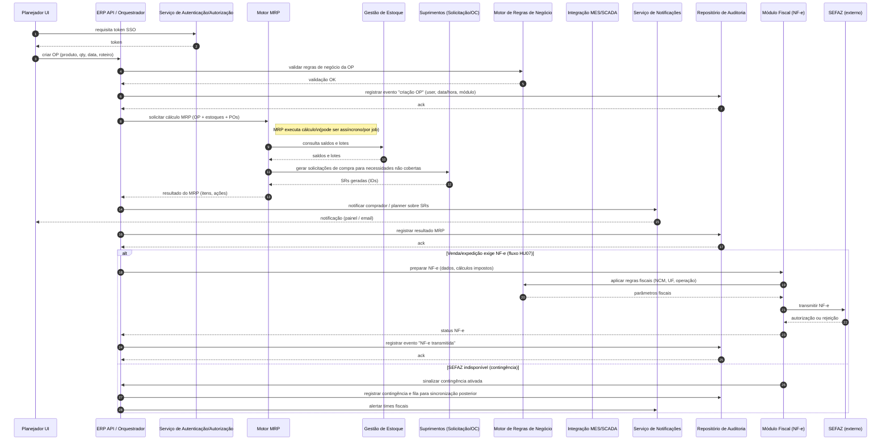

# Relatório Técnico de Arquitetura de Software

## 1. Identificação das HUs

Resumo das Histórias de Usuário (HU) recebidas e mapeamento inicial para requisitos funcionais (RF) relevantes.

- HU01 — Gerar ordens de produção e calcular necessidade de materiais
  - Principais RFs: RF05, RF06, RF09, RF14, RF26
  - Critérios de aceite: associação OP/roteiro; MRP considerando estoque/OPs/POs; geração automática de solicitações de compra.

- HU02 — Monitorar OEE e desvios de produção em tempo real
  - Principais RFs: RF07, RF08, RF10, RF11, RF12
  - Critérios de aceite: cálculo OEE por integração com chão de fábrica; alertas; drill-down.

- HU03 — Gerenciar cotações com múltiplos fornecedores
  - Principais RFs: RF13, RF15, RF16
  - Critérios de aceite: envio de RFQ a vários fornecedores; comparação por critérios; fluxo de alçada.

- HU04 — Acompanhar desempenho de fornecedores
  - Principais RFs: RF13, RF19, RF19 (integração/exportação), RF19 (APIs)
  - Critérios de aceite: painéis com índices; filtros; exportação.

- HU05 — Registrar inspeção de lote e bloquear reprovados
  - Principais RFs: RF20, RF21, RF22, RF23
  - Critérios de aceite: registro de parâmetros; bloqueio automático de lote; notificações.

- HU06 — Rastrear lote do insumo ao produto acabado
  - Principais RFs: RF23, RF24, RF25
  - Critérios de aceite: rastreabilidade completa; consulta de OPs e clientes; exportação PDF.

- HU07 — Emitir NF-e com cálculo automático de impostos
  - Principais RFs: RF31, RF32, RF33, RF34, RNF06, RNF07, RNF15
  - Critérios de aceite: cálculo de impostos; transmissão em ≤30s; mensagens de erro; contingência automática.

- HU08 — Manter SPED Fiscal atualizado
  - Principais RFs: RF36, RNF08
  - Critérios de aceite: geração automática de registros; validação; geração histórica.

- HU09 — Processar folha de pagamento mensal
  - Principais RFs: RF37, RF38, RF39, RF41, RNF11, RNF02, RNF10
  - Critérios de aceite: integração com ponto; cálculos de encargos; geração de remessa bancária/eSocial.

- HU10 — Gerar obrigações acessórias de RH
  - Principais RFs: RF40, RNF08, RNF09
  - Critérios de aceite: leiautes vigentes; alertas de prazo; validação pré-envio.

- HU11 — Visualizar DRE e Fluxo de Caixa em tempo real
  - Principais RFs: RF43, RF44, RF45, RF46, RF47, RNF12, RNF16
  - Critérios de aceite: DRE consolidada/por centro; fluxo de caixa realizado/projetado; drill-down.

- HU12 — Acompanhar indicadores operacionais e financeiros pelo dashboard executivo
  - Principais RFs: RF50, RF51, RF52, RF53
  - Critérios de aceite: KPIs mínimos (OEE, produção, receita, margem, qualidade, serviço); variação percentual; drill-down até transação em ≤3 cliques.

Observação: as HUs acima orientam a identificação de componentes, interfaces e decisões de arquitetura constantes nas próximas seções.

---

## 2. Diagramas de Arquitetura (Mermaid)

A seguir dois diagramas em Mermaid: 1) diagrama de sequência (fluxo crítico HU01 + HU07) e 2) diagrama de componentes detalhado.

- Cenário do diagrama de sequência: criação de Ordem de Produção (HU01) que dispara cálculo MRP e, se necessário, geração de Solicitação de Compra / Ordem de Compra; mostra integração com módulo de Estoque, Motor MRP, Motor de Regras de Negócio, Módulo de Notificações e Repositório de Logs/Auditoria; inclui caminho alternativo para emissão de NF-e (HU07) com contingência.



- Diagrama de componentes (visão lógica, mostrando responsabilidades e interfaces entre componentes principais):

```mermaid
graph TD
  subgraph Interfaces Externas
    A[AD/LDAP SSO]:::ext
    B[SEFAZ / Autoridades Fiscais]:::ext
    C[SCADA/MES / PLCs]:::ext
    D[Transportadoras / APIs Partners]:::ext
    E[Bancos / Gateway de Pagamentos]:::ext
  end

  subgraph Camada de Apresentação
    UI[Web / Mobile UI (Responsividade)]:::ui
  end

  subgraph Plataforma ERP
    Auth[Autenticação & RBAC / SSO]:::comp
    API[API Orquestradora / Facade]:::comp
    Audit[Auditoria Imutável & Logging]:::comp
    Notif[Notificações (e-mail, push, alerts)]:::comp
    Integration[Gateway de Integração & Adaptadores]:::comp
  end

  subgraph Domínio Funcional
    UserMgmt[Gestão de Usuários & Acesso]:::comp
    PCP[Planejamento & Controle da Produção]:::comp
    MRP[Motor MRP / Planejamento Material]:::comp
    Inventory[Gestão de Estoque & Lotes]:::comp
    Purchasing[Suprimentos / Cotação / OC]:::comp
    Quality[Controle de Qualidade por Lote]:::comp
    Logistics[Logística & Expedição]:::comp
    Fiscal[Módulo Fiscal / NF-e / CT-e]:::comp
    RH[Gestão de RH & Folha]:::comp
    Accounting[Contabilidade & Lançamentos]:::comp
    Reporting[Dashboards & KPI / OLAP-like views]:::comp
    MESAdapter[Módulo de Integração MES/SCADA]:::comp
    DataModel[Modelo de Persistência & Retenção]:::comp
    Messaging[Barramento de Mensagens / Eventos]:::comp
  end

  %% comunicações
  UI -->|REST/gRPC/API| API
  API --> Auth
  API --> Audit
  API --> Notif
  API --> Integration
  API --> Messaging

  API --> UserMgmt
  API --> PCP
  API --> Purchasing
  API --> Inventory
  API --> Quality
  API --> Logistics
  API --> Fiscal
  API --> RH
  API --> Accounting
  API --> Reporting

  PCP --> MRP
  MRP --> Inventory
  MRP --> Purchasing
  MRP --> Messaging
  Inventory --> Quality
  Quality --> Inventory
  Logistics --> Fiscal
  Purchasing --> Inventory
  Purchasing --> Messaging
  MESAdapter --> Messaging
  MESAdapter --> PCP
  MESAdapter --> Inventory
  Messaging --> Reporting
  Messaging --> Accounting
  Messaging --> Audit

  Integration --> A
  Integration --> B
  Integration --> C
  Integration --> D
  Integration --> E

  DataModel -->|persist| Inventory
  DataModel -->|persist| PCP
  DataModel -->|persist| Purchasing
  DataModel -->|persist| Quality
  DataModel -->|persist| Fiscal
  DataModel -->|persist| RH
  DataModel -->|persist| Accounting
  DataModel -->|backup/wal| Audit

  classDef comp fill:#eef,stroke:#333,stroke-width:1px
  classDef ui fill:#efe,stroke:#333,stroke-width:1px
  classDef ext fill:#ffe,stroke:#333,stroke-width:1px
```

Notas sobre os diagramas:
- O diagrama de sequência evidencia requisitos de auditoria (RF03), MRP (RF06), controle de estoque/lotes (RF09, RF23) e emissão NF-e com contingência (RF31, RF34, RNF15).
- O diagrama de componentes é intencionalmente tecnológico-agnóstico: descreve responsabilidades, conectores lógicos (API, Messaging, Integration) e fronteiras de dados.

---

## 3. Decisões de Arquitetura

Cada decisão lista a responsabilidade/objetivo, alternativas consideradas e implicações.

1. Arquitetura orientada a domínios (modular por área funcional)
   - Responsabilidade: separar áreas (PCP, Qualidade, Fiscal, RH, Contabilidade, Suprimentos, Logística) para permitir evolutividade, governança e isolamento de dados por unidade fabril.
   - Alternativas: monólito único vs. modular monolítico vs. micro-serviços. Opta-se por arquitetura modular com opções de implantação independente por módulo.
   - Implicações: facilita escalabilidade por módulo (RNF16), mas requer contratos de API claros, versionamento e governança de dados.

2. Orquestração via API Gateway / Orquestrador lógico
   - Responsabilidade: expor um ponto unificado para UI e integrações, autenticação, roteamento e implementação de políticas transversais (TLS, rate limiting, audit).
   - Alternativas: chamadas diretas entre módulos. Orquestrador central reduz acoplamento dos clientes e centraliza políticas de segurança.
   - Implicações: ponto crítico de disponibilidade — aplicar mecanismos de HA e redundância (RNF12).

3. Modelo de integração híbrido (eventos + APIs síncronas)
   - Responsabilidade: suportar integrações de baixa latência (NF-e, consultas) e processamento assíncrono (MRP, geração de relatórios, sincronização com MES).
   - Alternativas: somente REST síncrono; somente event-driven. Combinação atende requisitos de tempo real e cargas batch (RNF13, RNF14).
   - Implicações: exige modelo de contrato de eventos, esquema de mensagens, estratégias de idempotência e rastreabilidade.

4. Motor MRP e motor de regras separados
   - Responsabilidade: motor MRP realiza cálculos pesados e pode ser executado em batch/near-real-time; motor de regras encapsula decisões fiscais, de alçada e bloqueios de qualidade.
   - Alternativas: regras embutidas no MRP. Separar favorece governança de regras e facilita atualização por domínio fiscal/negócio (RNF06, RNF07).
   - Implicações: contratos claros e versionamento; testes de regressão para regras.

5. Controle de lotes e rastreabilidade como capacidades transversais no modelo de dados
   - Responsabilidade: garantir vínculo imutável entre notas fiscais de entrada, lotes de matéria-prima, consumo por OP, inspeções e NF-e de saída.
   - Alternativas: rastreabilidade fragmentada por módulo. Rastreabilidade centralizada reduz risco de inconsistências (RF23, HU06).
   - Implicações: necessidade de identificadores globais de lote, políticas de retenção e acesso restrito (RNF09, RNF02).

6. Auditoria imutável e retenção longa
   - Responsabilidade: armazenar trilhas de auditoria com garantia de integridade e retenção mínima conforme RNF10.
   - Alternativas: logs comuns no banco de dados. Recomendado repositório com controles de escrita apenas e versionamento.
   - Implicações: plano de armazenamento e estratégia de backup/archival (RNF21).

7. Gestão de segurança, RBAC e SoD
   - Responsabilidade: implementar controle por papéis granulares e segregação de funções, especialmente para operações financeiras e fiscais (RNF03, RF01).
   - Alternativas: permissões por grupo simples. Escolha por RBAC com suporte a regras de SoD configuráveis.
   - Implicações: necessidade de definição formal de perfis e regras de alçada; integração com SSO corporativo (RF02).

8. Integração com chão de fábrica (protocolos padrões)
   - Responsabilidade: suportar OPC-UA, MQTT e REST/JSON conforme RNF18.
   - Alternativas: uso exclusivo de um protocolo. Suporte multi-protocolo por adaptadores facilita implantação por unidade fabril.
   - Implicações: necessidade de adaptadores configuráveis por unidade, registradores de topologia e segurança de protocolo.

9. Estratégia de contingência para NF-e
   - Responsabilidade: detecção automática de indisponibilidade da SEFAZ, ativação de contingência e sincronização posterior (RNF17).
   - Alternativas: intervenção manual. Automação reduz risco de não conformidade.
   - Implicações: fila de sincronização, verificação de integridade e replays com idempotência.

10. Observabilidade e monitoramento centralizado
    - Responsabilidade: expor métricas operacionais (latência, jobs MRP, filas, erros), logs estruturados e alertas (RNF23).
    - Alternativas: monitoramento descentralizado. Centralizar facilita operação 24/7 e SLAs.

Cada decisão possui testes de aceitação arquitetural vinculados a RNFs (ex.: MRP timebox RNF13, dashboards RNF14).

---

## 4. Tabela de Componentes e Rastreabilidade

| Componente | Responsabilidade Principal | Comunica-se com | Origem (HU / Critério de Aceite) |
|---|---|---:|---|
| API Orquestrador / Facade | Expor APIs, roteamento, aplicação de políticas transversais (autenticação, rate limiting) | UI, Auth, Audit, Módulos de Domínio, Integration | HU01, HU02, HU07 |
| Autenticação & RBAC / SSO | Autenticação SSO, emissão/validação de tokens, autorização por papéis e regras SoD | API, UserMgmt, Integration (AD/LDAP) | RF01, RF02, RNF03 |
| Gestão de Usuários & Perfis | CRUD usuários, perfis, permissões granulares por módulo/unidade | API, Auth, Audit | RF01 |
| Motor MRP | Executar cálculo de necessidade de materiais, gerar solicitações de compra | PCP, Inventory, Purchasing, Messaging, Audit | HU01, RF06, RNF13 |
| PCP (Ordens de Produção) | CRUD OPs, roteiros, sequenciamento, apontamento | MRP, MESAdapter, Inventory, Quality, Audit | RF05, RF07, RF08, HU01 |
| Gestão de Estoque & Lotes | Saldos, reservas, inventário por endereçamento, bloqueio de lotes | PCP, Purchasing, Quality, Logistics, DataModel | RF09, RF26, RF22, HU05 |
| Suprimentos (RFQ / OC / Aprovação) | Gestão fornecedores, RFQ, comparação de propostas, OC com alçada | Purchasing, MRP, API, Audit, Notif | RF13, RF14, RF15, RF16, HU03 |
| Controle de Qualidade por Lote | Planos de inspeção, registros por lote, bloqueios, NC | Quality, Inventory, PCP, Audit, Notif | RF20-RF25, HU05, HU06 |
| MES/SCADA Adapter | Adaptadores para protocolos industriais e ingestão em tempo real | MES, PCP, Inventory, Messaging | RF11, RNF18, HU02 |
| Mensageria / Barramento de Eventos | Transporte de eventos assíncronos entre módulos, persistência de eventos | Todos os módulos, Reporting, Audit | RNF18, HU01, HU02 |
| Módulo Fiscal (NF-e / CT-e) | Cálculo de impostos, geração NF-e/CT-e, transmissão/contingência | API, Rules, SEFAZ, Audit, Logistics | RF31-RF36, HU07, HU08 |
| Motor de Regras de Negócio | Centraliza regras fiscais, alçadas, critérios de cotação e qualidade | Fiscal, Purchasing, API, MRP | RF15, RNF06, RNF07 |
| Contabilidade & Lançamentos | Escrituração automática, plano de contas, geração DRE/Balanço | All módulos, Reporting, Audit | RF43-RF49, HU11 |
| RH & Folha | Cadastro colaboradores, ponto eletrônico, cálculo de folha e obrigações | Integration (ponto), API, Audit, Banking | RF37-RF42, HU09, HU10 |
| Dashboards & KPI / Reporting | Visualização KPIs, DRE, drill-down, exportação | Reporting, Messaging, Accounting, PCP, Quality | RF50-RF53, HU11, HU12 |
| Notificações & Alertas | Envio de e-mail, alertas visuais, thresholds configuráveis | API, Purchasing, Quality, Reporting | RF12, HU02, HU05 |
| Repositório de Auditoria Imutável | Armazenamento de logs de operações com retenção legal | API, Audit, All modules | RF03, RNF10 |
| Data Model & Retenção | Modelo de persistência para entidades, políticas de retenção e backup | All modules, Backup | RNF02, RNF21 |
| Integration Gateway | Adaptadores externos (bancos, transportadoras, SEFAZ, órgãos) | SEFAZ, Bancos, Partners, API | RF31-RF36, HU07, HU10 |
| Monitoramento & Observability | Métricas, tracing, dashboards operacionais para TI | All modules, Admin | RNF23 |
| Backup & Recuperação | Execução de backups diários e WAL contínuo, RPO/RTO | DataModel, Admin | RNF21 |

Observação: tabela mapeia componente → responsabilidades → com quem comunica e origem HU/criterio.

---

## 5. Bloqueios e Pendências

Lista das restrições e informações em aberto que bloqueiam decisões de implementação detalhada.

1. Especificação do SSO corporativo
   - Bloqueio: protocolo exato (SAML, OpenID Connect, Kerberos?) e detalhes do diretório corporativo.
   - Impacto: implementação inicial de SSO, mapeamento de atributos e provisionamento de perfis.
   - Ação: obter especificação de SSO/AD com atributos e política de provisionamento.

2. Regras de segregação de funções (SoD) e matrizes de autorização
   - Bloqueio: definições de perfis e regras de alçada detalhadas (níveis de aprovação, limites monetários).
   - Impacto: modelagem RBAC e fluxos de aprovação automáticos.
   - Ação: workshop com Compliance/Financeiro para definição formal das matrizes e políticas.

3. Contratos e SLA com sistemas de chão de fábrica
   - Bloqueio: topologia do MES/SCADA por unidade, protocolos disponíveis, latência e segurança de rede.
   - Impacto: dimensionamento de adaptadores, requisitos de segurança para borda.
   - Ação: levantamento por unidade fabril e assinatura de contrato técnico com planta.

4. Volume e perfil de carga esperada (TPS, jobs MRP, usuários concorrentes)
   - Bloqueio: números de transações por segundo, tamanho das bases (nº itens, nº lotes), picos sazonais.
   - Impacto: definição de capacidade, particionamento de dados e dimensionamento de job MRP (RNF13/RNF16).
   - Ação: coletar estatísticas históricas ou estimativas de negócio.

5. Lista completa de integrações externas e formatos de mensagem
   - Bloqueio: especificações de parceiros (transportadoras, bancos), formatos e certificados.
   - Impacto: desenvolvimento de adaptadores e testes de homologação.
   - Ação: consolidar inventário de integrações e obter contratos técnicos.

6. Política de criptografia e gerenciamento de chaves
   - Bloqueio: procedimentos para chaves de cifragem em repouso (RNF02) e TLS mutual if required.
   - Impacto: conformidade com RNF02 e operacionalização de backups encriptados.
   - Ação: definir política de KMS e rotação de chaves com área de Segurança.

7. Regras fiscais e tabelas por UF/NCM atualizadas
   - Bloqueio: acesso ao convênio de atualizações e fonte oficial de tabelas.
   - Impacto: precisão dos cálculos de impostos (RNF06).
   - Ação: validar processo de atualização automatizada de tabelas fiscais e responsável.

8. Definição do identificador global de lote / plano de rastreabilidade
   - Bloqueio: padrão de identificação, nível de agregação (lote, sub-lote, serial).
   - Impacto: rastreabilidade end-to-end (RF23, HU06).
   - Ação: decisão conjunta com Qualidade/Produção sobre granularidade e migração.

9. Políticas de retenção além de 10 anos e arquivamento offline
   - Bloqueio: custo e local de arquivamento regulamentar.
   - Impacto: dimensionamento de armazenamento e backup (RNF21, RNF10).
   - Ação: definir SLA de retenção por tipo de dado com Legal/Financeiro.

10. Critérios de threshold e regras de alerta configuráveis
    - Bloqueio: valores iniciais de thresholds para OEE, desvios e KPIs.
    - Impacto: configuração inicial dos painéis e do mecanismo de notificações.
    - Ação: definir thresholds por acordo de processo com operações.

---

## 6. Cobertura de Requisitos

Resumo de rastreabilidade entre requisitos (RF / RNF / HU) e componentes/decisões.

- Segurança
  - RNF01 (TLS): coberto por API Orquestrador, Integration Gateway e política de transporte — Decisão: exigir TLS ≥ 1.2.
  - RNF02 (Dados criptografados em repouso): Data Model & Retenção e Backup & Recuperação — design para cifragem em repouso.
  - RNF03 (RBAC/SoD): Autenticação & RBAC + Gestão de Usuários — requer definição de matrizes (pendência).
  - RNF04 (rate limiting / bloqueio): API Orquestrador + Auth + Notif.
  - RNF05 (testes de penetração): Monitoramento & Observability + políticas de segurança organizacional.

- Planejamento e PCP
  - RF05–RF12: atendidos por PCP, MRP, Inventory, MESAdapter, Messaging e Notif. RNF13 (MRP ≤10min) mapeado a Motor MRP com capacidade de execução em batch/para job scheduling.

- Suprimentos
  - RF13–RF19: Suprimentos (RFQ/OC), Purchasing, MRP, API, Notif, Audit.

- Qualidade por Lote
  - RF20–RF25: Quality, Inventory, Audit, Notif — rastreabilidade implementada via DataModel e IDs globais de lote (pendência: padrão de ID).

- Logística e Distribuição
  - RF26–RF30: Logistics, Inventory, Fiscal, Integration Gateway — documentos de expedição, romaneios, rastreamento.

- Faturamento Fiscal
  - RF31–RF36 e RNF06–RNF08: Fiscal, Motor de Regras, Integration Gateway (SEFAZ); Contingência suportada por fila e reprocessamento (RNF17). RNF07 (schemas XSD) atendido por validação em Módulo Fiscal.

- RH e Folha
  - RF37–RF42 e RNF11, RNF09: RH, Integration (ponto), Audit; obrigações (eSocial etc.) geradas pelo módulo RH conforme leiautes (pendência: atualização de leiautes oficiais).

- Contabilidade e DRE
  - RF43–RF49: Accounting, Messaging, Reporting; lançamento automático via eventos de todos os módulos (RF43).

- Dashboards e KPIs
  - RF50–RF53: Reporting, Messaging, API, Notif — garantem drill-down e exportação (PDF/Excel).

- Infraestrutura e Operação
  - RNF12 (99,5%): Orquestrador + HA/replicação (definição operacional pendente).
  - RNF21 (Backups): Backup & Recuperação + DataModel.
  - RNF22 (deploy on-prem/cloud/híbrido): arquitetura modular permite modelos de implantação variados.
  - RNF23 (métricas): Monitoramento & Observability.

Observação: cobertura funcional alta; lacunas listadas na Seção 5 exigem resolução para implementação completa.

---

## 7. Gap Analysis

Identificação de lacunas de especificação, risco arquitetural e ações recomendadas priorizadas.

1. Gap: Especificação SSO/Provisionamento de Identidade
   - Risco: atraso na integração de login único e mapeamento de perfis; impacto em testes de segurança e provisionamento.
   - Impacto arquitetural: bloqueio de implementação de RBAC e alçadas automáticas.
   - Recomendação: obter especificação do serviço de identidade (protocolo, atributos, certificados) e executar prova de conceito de integração; priorizar antes das releases que envolvam RH/Financeiro.

2. Gap: Matriz de SoD e regras de alçada detalhadas
   - Risco: violações de segregação de funções; problemas de conformidade.
   - Impacto: RBAC e workflows de aprovação não totalmente implementáveis.
   - Recomendação: workshop com Compliance e Finanças para documentar todas as alçadas; criar cases de teste para validação.

3. Gap: Volume e perfil de carga para dimensionamento de MRP e infra
   - Risco: não cumprimento dos RNFs de desempenho (MRP ≤10min, dashboards ≤5s).
   - Impacto: necessidade de reengenharia da solução de cálculo e de agregação de dados.
   - Recomendação: coletar dados reais/estimativas; executar simulação de carga; ajustar partição de dados, caching e job scheduling.

4. Gap: Padrão de identificação de lotes e granularidade de rastreabilidade
   - Risco: inconsistências em recalls; dificuldades em gerar relatórios de rastreabilidade.
   - Impacto: re-trabalho para refatorar históricos e migração de dados.
   - Recomendação: definir padrão global de lote/serial, normalizar registros legado antes da migração.

5. Gap: Especificações de integração com parceiros (formatos, certificados, SLAs)
   - Risco: atrasos na homologação com transportadoras, bancos e SEFAZ.
   - Impacto: bloqueio de expedição (NF-e) e pagamentos.
   - Recomendação: consolidar inventário de integrações, iniciar homologações em paralelo com desenvolvimento.

6. Gap: Política de chave criptográfica e rotinas de cifragem em repouso
   - Risco: não conformidade com RNF02 e auditorias.
   - Impacto: necessidade de reprojeto para proteção de dados.
   - Recomendação: definir política KMS, rotação de chaves e responsabilidades.

7. Gap: Regras fiscais por UF e atualização automatizada das tabelas NCM
   - Risco: cálculo impreciso de impostos (RNF06).
   - Impacto: contingências fiscais e retrabalhos.
   - Recomendação: contrato com fonte de dados fiscal e automação de atualização; criar testes de validação fiscal.

8. Gap: Critérios de thresholds para alertas e SLA operacional
   - Risco: alertas ineficazes, excesso de ruído ou falta de ação.
   - Impacto: perda de confiança nos painéis.
   - Recomendação: definir thresholds iniciais por processo com possibilidade de ajuste via UI por perfis autorizados.

9. Gap: Plano detalhado de backup/archival para retenção de 10+ anos
   - Risco: custos e requisitos de restauração não dimensionados.
   - Impacto: não conformidade em auditoria fiscal.
   - Recomendação: elaborar plano de storage-tiered + procedimentos de recuperação, testes regulares de restore.

10. Gap: Estratégia de testes de integração contínua com sistemas externos (SEFAZ, MES, bancos)
    - Risco: falhas em produção por falta de homologação automatizada.
    - Impacto: problemas operacionais.
    - Recomendação: criar ambientes de homologação, stubs/mocks e suites de testes de contrato (consumer-driven contract tests).

Priorização recomendada (curto/médio/prazo):
- Curto prazo (imperativos legais/segurança): SSO spec, SoD matrix, fiscal tables, KMS policy, NF-e contingência tests.
- Médio prazo (operacional): volumes de carga, lot IDs, backup/archival plan, integration specs.
- Longo prazo (otimização): tuning de MRP, dashboards em nível de performance, expansão multi-fábrica.

---

Versão final: este relatório apresenta a arquitetura conceitual e a rastreabilidade entre HUs, RFs e RNFs. As decisões são tecnicamente neutras e focadas em responsabilidades e interfaces conforme diretriz. Próximo passo recomendado: execução de milestones curtos (sprints) para resolver pendências críticas (Seção 5) e realização de POCs para SSO, MRP e integração MES antes do desenvolvimento em larga escala.