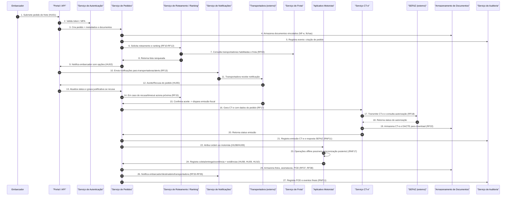

# Relatório Técnico de Arquitetura de Software

## 1. Identificação das HUs
Lista consolidada das Histórias de Usuário (HU) mapeadas diretamente dos requisitos fornecidos:

- HU01 — Registrar pedido de frete (RF05, RF06, RF09, RF10, RF13)
- HU02 — Selecionar transportadora e contratar seguro (RF10, RF11, RF12, RF41, RF17)
- HU03 — Acompanhar pedidos e receber comprovante de entrega (RF07, RF37, RF39, RF31)
- HU04 — Abrir sinistro por avaria ou extravio (RF42, RF43, RF44)
- HU05 — Aceitar pedidos de frete e gerenciar frota (RF10, RF13, RF14, RF03)
- HU06 — Acompanhar operação dos motoristas em tempo real (RF25, RF30, RF31, RF26)
- HU07 — Consultar demonstrativo financeiro de repasse (RF48, RF47, RF46)
- HU08 — Executar coleta com registro de evidências (RF24, RF23, RF09)
- HU09 — Registrar entrega com assinatura digital do destinatário (RF27, RF38, RF37, RNF10, RNF17)
- HU10 — Registrar ocorrência durante o transporte (RF26, RF31, RF33, RF34)
- HU11 — Rastrear carga em tempo real sem cadastro (RF30, RNF05, HU12)
- HU12 — Receber notificações de cada etapa da entrega (RF33, RNF05)
- HU13 — Monitorar SLA de fretes e acionar contingência (RF16, RNF12, RNF15)
- HU14 — Acompanhar painel financeiro da plataforma (RF49, RF45, RF46)

Observação: cada HU aqui sintetiza os RFs relacionados e será utilizada para rastreabilidade nas seções seguintes.

---

## 2. Diagramas de Arquitetura (Mermaid)

- Diagrama de sequência (fluxo principal: registro de pedido → roteamento → aceite → emissão CT-e → operação motorista → POD)


- Diagrama de componentes (visão de alto nível mostrando responsabilidades e interfaces)
```mermaid
graph TD
  subgraph Frontend
    PortalWeb["Portal Web / API Gateway"]
    DriverApp["Aplicativo Motorista"]
    TrackingLink["Interface de Rastreamento (link público)"]
  end

  subgraph Core
    Auth["Serviço de Autenticação & Autorização"]
    OrderSvc["Serviço de Pedidos"]
    Routing["Serviço de Roteamento & Ranking"]
    Fleet["Serviço de Gestão de Frota e Motoristas"]
    CTESvc["Serviço de CT-e & Fiscal"]
    Insurance["Serviço de Integração com Seguradoras"]
    Notification["Serviço de Notificações (e-mail/SMS/push)"]
    Finance["Serviço Financeiro & Faturamento"]
    Realtime["Serviço de Rastreamento em Tempo Real"]
    Audit["Serviço de Auditoria Imutável"]
    Docs["Armazenamento de Documentos & POD"]
    TSDB["Banco de Séries Temporais (posições)"]
    GeoSvc["Serviço de Consultas Geoespaciais/Mapas"]
    Metrics["Monitoramento & Métricas Operacionais"]
  end

  subgraph Integrations
    SEFAZ["SEFAZ / Autoridade Fiscal (API)"]
    Carriers["Sistemas das Transportadoras (API)"]
    Payment["Provedor de Pagamentos (externo)"]
    Insurers["Sistemas Seguradoras (API)"]
  end

  PortalWeb -->|REST/gRPC| Auth
  PortalWeb -->|REST/gRPC| OrderSvc
  DriverApp -->|Sync / push| Realtime
  DriverApp -->|API / sync| OrderSvc
  TrackingLink -->|read only token| Realtime
  OrderSvc -->|events / commands| Routing
  Routing -->|consulta| Fleet
  OrderSvc -->|documentos| Docs
  OrderSvc -->|emitir CT-e| CTESvc
  CTESvc -->|API (contrato versionado)| SEFAZ
  CTESvc -->|armazenar DACTE| Docs
  OrderSvc -->|dispatch| Notification
  OrderSvc -->|movimentações| Audit
  Realtime -->|armazenar posições| TSDB
  Realtime -->|geocoding/route| GeoSvc
  Finance -->|dados| OrderSvc
  Finance -->|repasse| Carriers
  Insurance -->|cotação/contratação| Insurers
  Metrics -->|coleta| OrderSvc
  Metrics -->|dashboard| PortalWeb
  Docs -->|acesso protegido| PortalWeb
  Audit -->|imutável| Docs
```

---

## 3. Decisões de Arquitetura

1. Estilo arquitetural: arquitetura orientada a serviços com comunicação por APIs e eventos
   - Racional: clara separação de responsabilidades (pedidos, roteamento, CT-e, rastreamento), facilita escalabilidade independente de cada domínio (alta taxa de updates de geolocalização vs operações transacionais de CT-e).
   - Trade-off: maior complexidade de orquestração e observabilidade; exige contrato de APIs e governança de versão.

2. Comunicação síncrona e assíncrona combinada
   - Síncrono: operações transacionais que exigem resposta imediata (autenticação, consulta de status, emissão inicial de CT-e).
   - Assíncrono/Events: notificações, processamento de ranking em lote, atualização de indicadores, replicação de eventos para auditoria e faturamento.
   - Racional: garante responsividade ao usuário e tolerância a picos; permite reprocessamento de eventos.

3. Serviços independentes para funcionalidades de negócios críticas
   - Serviços identificados: Pedido, Roteamento/Ranking, Frota, Rastreamento (tempo real), CT-e, Financeiro, Insurance, Notificação, Auditoria.
   - Racional: isolamento de falhas, deploys independentes, escalabilidade por carga (p.ex. TSDB para geolocalização).

4. Armazenamento diferenciado por característica dos dados
   - Dados transacionais e documentos vinculados precisam de armazenamento com suporte a ACID/consistência; posições precisam de armazenamento otimizado para séries temporais e consultas geoespaciais; audit logs devem ser imutáveis.
   - Racional: respeitar os RNFs sobre criptografia em repouso, retenção e consulta eficiente.

5. Autenticação e autorização centralizada com políticas MFA
   - Perfis com papéis (embar., transportadora, motorista, destinatário, admin) e controles de acesso por recurso.
   - Racional: cumprimento dos RNFs (MFA para admins/embarcadores) e princípio de menor privilégio.

6. Proteção de rastreamento via token de acesso com prazo limitado
   - Token único para cada link de rastreamento, expiração automática, escopo limitado ao frete.
   - Racional: atender RNF05 (não expor dados de outros fretes).

7. Offline-first para aplicativo do motorista
   - Sincronização eventual, fila local de eventos, resolução de conflitos por versão/timestamps, garantia de persistência local até confirmação.
   - Racional: RNF17 (modo offline completo) e usabilidade em campo.

8. Emissão fiscal com modo contingência
   - Workflow suportando emissão normal e contingência offline com posterior sincronização e tratamento de erros/rollback.
   - Racional: atender RF19 e RNF07/RNF08; exigir mecanismo de retry e logs fiscais.

9. Auditoria imutável e retenção fiscal
   - Logs de auditoria append-only com retenção mínima indicada (>=5 anos) e proteção contra alteração.
   - Racional: RNF11, requisitos fiscais.

10. Observabilidade e monitoramento operacional
    - Métricas aplicacionais: latência de roteamento (RNF13), throughput de geolocalização (RNF16), disponibilidade (RNF12), integrações externas.
    - Racional: apoio às operações e SLA.

11. Governança de contratos de integração
    - APIs de integração versionadas para SEFAZ, seguradoras e transportadoras.
    - Racional: RNF24 para permitir evolução independente.

Observação: todas as decisões acima explicitam responsabilidades e padrões; não são prescritivas quanto a produtos ou fornecedores.

---

## 4. Tabela de Componentes e Rastreabilidade

| Componente | Responsabilidade Principal | Comunica-se com | Origem (HU / Critério de Aceite) |
|---|---:|---|---|
| Portal Web / API Gateway | Interface web para embarcadores/transportadoras/admins; roteia requisições e aplica políticas de autenticação/autorização | Auth, OrderSvc, Finance, Metrics, Notification | HU01, HU02, HU03, RNF03, RNF20 |
| Aplicativo Motorista (Driver App) | UI/UX para motoristas: ordens, coleta, entrega, ocorrências; suporte offline e sincronização | OrderSvc, Realtime, Docs, Auth | HU08, HU09, HU10, RNF17, RNF18, RNF21 |
| Interface de Rastreamento por Link | Página pública/protegida para destinatários visualizar posição e histórico | Realtime, OrderSvc, Docs | HU11, RNF05, RF30 |
| Serviço de Autenticação & Autorização (Auth) | Gestão de identidade, MFA, tokens, roles & permissions | PortalWeb, DriverApp, OrderSvc, Fleet | RF01, RF02, RNF03, RNF04 |
| Serviço de Pedidos (OrderSvc) | CRUD de pedidos, status workflow, vínculo de documentos, orquestra eventos de negócio | Docs, Routing, CTESvc, Notification, Audit, Finance | HU01, RF05-RF09, RF14, HU03 |
| Serviço de Roteamento & Ranking (Routing) | Seleção e ranqueamento de transportadoras por critérios configuráveis; fallback em caso de recusa | Fleet, Notification, OrderSvc, Metrics | RF10-RF16, HU02, RNF13 |
| Serviço de Gestão de Frota e Motoristas (Fleet) | Cadastro/associação de veículos, motoristas, vinculação por transportadora | Auth, Routing, OrderSvc, Realtime | RF03, HU05 |
| Serviço de CT-e & Fiscal (CTESvc) | Geração, validação, transmissão e controle de CT-e; contingência e cancelamento | SEFAZ, Docs, OrderSvc, Audit | RF17-RF22, RNF07, RNF08, RNF11 |
| Serviço de Notificações (Notification) | Orquestra envio de e-mails, SMS e push conforme eventos configurados | OrderSvc, Realtime, PortalWeb | RF33-RF36, HU12 |
| Serviço de Rastreamento em Tempo Real (Realtime) | Recebe e processa streams de posicionamento; expõe feeds em tempo real e histórico | DriverApp, TSDB, GeoSvc, TrackingLink | RF25, RF30-RF32, RNF15, RNF16 |
| Banco de Séries Temporais / Geoespacial (TSDB) | Armazenamento otimizado para posições e consultas espaciais | Realtime, GeoSvc, Metrics | RNF23, RF31, RNF16 |
| Serviço de Geoespacial / Roteamento de Mapas (GeoSvc) | Cálculo de previsões de chegada, rotas otimizadas e consultas geoespaciais | Realtime, Routing, PortalWeb | RF29, RF32 |
| Armazenamento de Documentos & POD (Docs) | Armazenamento criptografado de NF-e, fotos, assinaturas, POD, DACTE | OrderSvc, CTESvc, PortalWeb, Audit | RF09, RF22, RF37-RF39, RNF02 |
| Serviço de Auditoria Imutável (Audit) | Trilhas de auditoria append-only com retenção e exportação | Todos os serviços críticos | RF04, RNF11 |
| Serviço Financeiro & Faturamento (Finance) | Cálculo de frete, comissão, geração de faturas e demonstrativos de repasse | OrderSvc, Payment, PortalWeb | RF45-RF49, HU07, HU14 |
| Serviço de Integração com Seguradoras (Insurance) | Cotação, contratação e acompanhamento de sinistros | OrderSvc, Insurers, Docs, Notification | RF41-RF44, HU02, HU04 |
| Monitoramento & Métricas (Metrics) | Métricas operacionais, alertas e dashboards | Todos os serviços | RNF25, RNF12, RNF13 |
| Gateways/Adapters de Integração Externa | Abstração e versionamento dos contratos (SEFAZ, seguradoras, transportadoras, pagamentos) | CTESvc, Insurance, Carriers, Payment | RNF24, RF17-RF19, RF41 |
| Módulo de Gerenciamento de Políticas (Config) | Parametrização de regras: critérios de ranking, prazos de respostas, políticas de cancelamento | Routing, OrderSvc, Notification | RF11, RF15, RF08 |
| Sistema de Fila/Event Bus (mensageria) | Backbone para comunicação assíncrona e desacoplamento (notificações, auditoria, faturamento) | OrderSvc, Notification, Audit, Metrics | RF13, RF16, RNF16 |

Observação: "Origem" referencia HU e critérios de aceite relevantes ou RFs diretamente atendidos.

---

## 5. Bloqueios e Pendências

1. Contratos e especificações da SEFAZ
   - Pendência: confirmação do leiaute XSD e SLAs de transmissão/autorização (exatidão de versionamento).
   - Impacto: impede testes de integração e validação da fila de contingência (RF17-RF19).
   - Ação recomendada: obter contrato/endpoint de homologação e XSD oficiais; definir time-window para testes.

2. Acordos com seguradoras e contratos de API
   - Pendência: disponibilidade de APIs para cotação/contratação e fluxo de sinistros (RF41-RF44).
   - Impacto: bloqueia implementação do fluxo de contratação integrada e automação de sinistros.
   - Ação: negociar contratos de integração e ambientes de homologação.

3. Políticas de segurança e chaves de criptografia
   - Pendência: definição de gestão de chaves (KMS), políticas de rotação e acesso (RNF02, RNF11).
   - Impacto: sem definição, não é possível implementar criptografia conforme RNF02 e compliance LGPD.
   - Ação: definir política de chaves e armazenamento seguro antes do armazenamento de dados sensíveis.

4. Regras de negócio incompletas/parametrizações
   - Ex.: critérios de cálculo de frete (tabela, tarifas), regras exatas de ranking (ponderação), política de cancelamento (prazos e penalidades).
   - Impacto: bloqueia entrega de componentes de roteamento, financeiro e UI de seleção.
   - Ação: definir matriz de critérios e exemplos de cálculo; priorizar workshops com stakeholders de pricing.

5. Definição de SLA de aceitação pela transportadora
   - Pendência: timeout padrão para resposta/aceitação, comportamento de retries e justificativas aceitas.
   - Impacto: comportamento de fallback (RF15) fica indefinido.
   - Ação: documentar timeouts e ações automáticas; parametrizar no módulo Config.

6. Requisitos legais sobre timestamp / validade jurídica de assinatura
   - Pendência: confirmar nível de assinatura eletrônica exigido (assinatura avançada/qualificada) e requisitos técnicos para timestamping (RNF10).
   - Impacto: implementação do POD com validade jurídica pode exigir integração/serviço de carimbo de tempo.
   - Ação: consultar área jurídica e provedor de timestamp legalmente reconhecido no país.

7. Dados de base para ranking e índice de desempenho
   - Pendência: definição de fontes históricas, métricas e janela temporal para cálculo do índice (RF16).
   - Impacto: ranking poderá ser inconsistente enquanto não houver dados históricos.
   - Ação: definir scoring inicial, regras de bootstrap e política de recalculo.

8. Capacidade / Volume esperados e contratos de escalabilidade
   - Pendência: previsão de picos de atualizações de localização e número de fretes concorrentes por período.
   - Impacto: dimensionamento de TSDB, Realtime e filas.
   - Ação: coletar estimativas de carga para testes de performance.

---

## 6. Cobertura de Requisitos

Sumário de mapeamento entre componentes e RFs/HUs principais (resumo — cobertura funcional):

- Gestão de usuários e acesso
  - RF01–RF04: Auth, PortalWeb, Audit
- Pedidos de frete
  - RF05–RF09: OrderSvc, Docs, Routing, Notification
- Roteamento e seleção de transportadoras
  - RF10–RF16: Routing, Fleet, Notification, Config
- Documento de Transporte — CT-e
  - RF17–RF22: CTESvc, Gateways, Docs, Audit
- Operação do motorista
  - RF23–RF29: DriverApp, Realtime, OrderSvc, Docs, GeoSvc
- Rastreamento em tempo real
  - RF30–RF32: Realtime, TSDB, TrackingLink, GeoSvc
- Notificações
  - RF33–RF36: Notification, OrderSvc, DriverApp
- Comprovante de Entrega Digital (POD)
  - RF37–RF40: Docs, OrderSvc, Audit (timestamping componente a confirmar), Auth
- Seguros e sinistros
  - RF41–RF44: Insurance, Docs, OrderSvc, Notification
- Financeiro e faturamento
  - RF45–RF49: Finance, OrderSvc, Docs, Notification, Audit

Observações específicas de cobertura:
- RNF01–RNF06 (Segurança): contemplados com Auth centralizado, TLS obrigatório no trânsito, tokenização do link de rastreamento; implementação de MFA e controles de sessão devem ser definidos pela equipe de segurança.
- RNF07–RNF11 (Conformidade): CTESvc e Audit contemplam requisitos fiscais e de retenção; integração de timestamp legal precisa confirmação.
- RNF12–RNF17 (Disponibilidade/Desempenho): arquitetura orientada a serviços, TSDB para posições, Realtime e mensageria suportam escalabilidade; políticas de monitoração (Metrics) mapeadas.
- RNF18–RNF21 (Usabilidade/Compatibilidade): DriverApp e PortalWeb especificam diretrizes; detalhes UX para luvas/baixa luminosidade devem ser detalhados na fase de design de produto.
- RNF22–RNF25 (Infra/Dados): Backup, TSDB e APIs versionadas contemplados; exigem definição de RPO/RTO concretos e contratos de armazenamento.

---

## 7. Gap Analysis

1. Gap: Critérios e pesos do algoritmo de ranking (RF11, RF12)
   - Impacto arquitetural: sem critérios definidos não é possível modelar a interface de Config e as APIs de ranking; teste de desempenho e escalabilidade do algoritmo fica indefinido.
   - Risco: decisões arbitrárias no run-time podem causar rejeição por transportadoras/embarcadores.
   - Recomendação: realizar workshop para definir critérios (preço, prazo, tipo veículo, performance histórica) e pesos iniciais; implementar mecanismo de parametrização e A/B testing.

2. Gap: Regras comerciais de precificação e tabela de frete (RF45)
   - Impacto: módulo financeiro não poderá calcular valores corretos; integração de comissionamento ficará ambígua.
   - Recomendação: obter regras de cálculo (ex.: tarifas por km, tarifa mínima, adicionais por tipo de carga) e validar com contabilidade.

3. Gap: Política de cancelamento e penalidades (RF08)
   - Impacto: exigência de lógica no OrderSvc e na interface de cobrança; risco jurídico e disputa em operações.
   - Recomendação: definir política clara com prazos configuráveis e cenários (aceito vs não aceito).

4. Gap: Contrato de integração e SLAs com SEFAZ e seguradoras (RF17, RF41)
   - Impacto: impede testes de homologação e dimensionamento de retry/backoff; CT-e em contingência não pode ser completamente verificado.
   - Recomendação: obter ambientes de homologação, XSDs e acordos com tempo de resposta esperados.

5. Gap: Especificação técnica do timestamp e assinatura com validade jurídica (RF38, RNF10)
   - Impacto: a validade jurídica do POD depende de conformidade com lei; a arquitetura precisa integrar serviço de timestamping legal.
   - Recomendação: confirmar requisitos legais com jurídico e escolher modelo de integração compatível (assinatura avançada/qualificada ou carimbo equivalente).

6. Gap: Política de retenção e anonimização de dados pessoais (RNF09, RNF11)
   - Impacto: arquitetura de dados precisa suportar requests de exclusão/anonimização e retenção para fiscais.
   - Recomendação: definir políticas por tipo de dado (p.ex. motoristas vs destinatários) e implementar mecanismos de pseudonimização/anonimização.

7. Gap: Detalhes do fluxo de sinistro e nível de integração com seguradora (RF42, RF43, RF44)
   - Impacto: sem contrato, não é possível automatizar o acompanhamento do sinistro; documentação e evidências podem ficar inconsistentes.
   - Recomendação: mapear o fluxo de sinistro com seguradora piloto e estudar API para encaminhamento e callback de status.

8. Gap: Mecanismo de entrega de notificações escalável e fallback (RF33–RF36)
   - Impacto: não há definição de provedores preferenciais, retry, SLA de entrega de SMS/email, e preferências do destinatário.
   - Recomendação: definir políticas de retry, templates de mensagem e permitir fallback entre canais.

9. Gap: Resolução de conflitos em sincronização offline do motorista (RNF17)
   - Impacto: possíveis duplicações de eventos, perda de ordem temporal e inconsistências no status do pedido.
   - Recomendação: definir estratégia de versão (event timestamps, monotonically increasing sequence per device), regras de merge e validações de negócio no OrderSvc.

10. Gap: Definição de volumes e metas de desempenho (RNF12, RNF16)
    - Impacto: dimensionamento da infra e testes de carga não podem ser realizados com precisão.
    - Recomendação: coletar estimativas de transações por minuto, número médio de posições por veículo por minuto, crescimento previsto.

11. Gap: Regras para tokenização do link público (RNF05)
    - Impacto: segurança do rastreamento e risco de exposição de dados.
    - Recomendação: especificar algoritmo de geração de token, política de expiração e revogação e mecanismos de rate-limit.

12. Gap: Processo de bootstrap do índice de desempenho da transportadora (RF16)
    - Impacto: novos parceiros podem não ter índice; ranking pode ser enviesado.
    - Recomendação: definir política de bootstrap com reputação inicial, penalidades por falta de histórico e atualização incremental.

Ações recomendadas de priorização:
- Curto prazo (próximas sprints): obter contratos com SEFAZ e seguradoras, definir políticas de segurança e chaves, parametrizar timeout de aceitação de transportadora, definir política de cancelamento e pesos iniciais de ranking.
- Médio prazo: projetar e implementar mecanismos de offline sync e resolução de conflitos; integrar serviço de timestamping; criar pipelines para cálculo de índice de desempenho.
- Longo prazo: testes de performance e escalabilidade baseados em estimativas reais de carga; otimizações e ajustes após pilotos.

---

Fim do relatório.