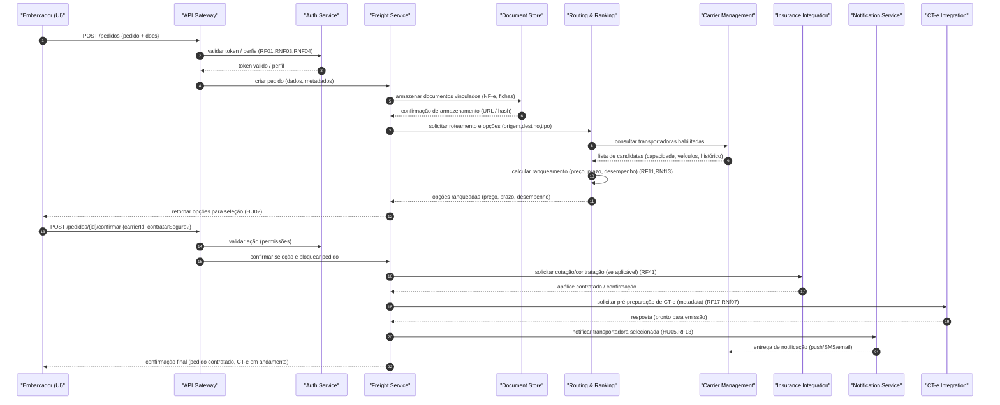
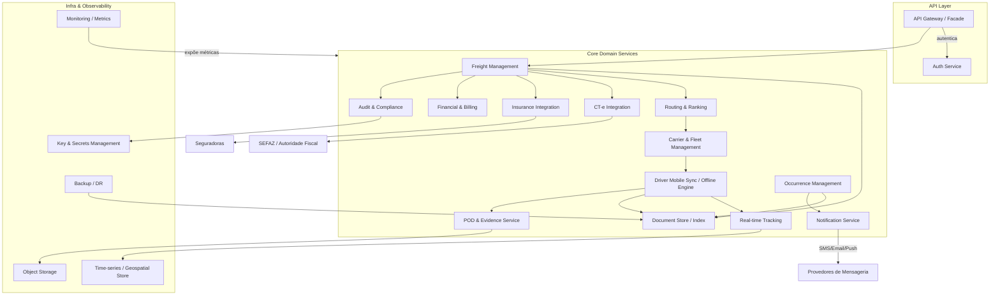

# Relatório Técnico de Arquitetura de Software

## 1. Identificação das HUs
Lista das Histórias de Usuário (HU) presentes no lote e resumo curto do propósito funcional:

- HU01 — Registrar pedido de frete: captura de dados do pedido, upload de documentos e início do roteamento automático.  
- HU02 — Selecionar transportadora e contratar seguro: apresentar opções ranqueadas, contratação de seguro e confirmação do frete (disparando emissão de CT-e/fluxo de aceite).  
- HU03 — Acompanhar pedidos e receber comprovante de entrega: visão consolidada e disponibilização do POD.  
- HU04 — Abrir sinistro por avaria/extravio: abertura e vinculação de sinistro ao pedido/ocorrências.  
- HU05 — Aceitar pedidos e gerenciar frota: notificação de novos pedidos; aceite/recusa pela transportadora; gestão de motoristas/veículos.  
- HU06 — Acompanhar operação dos motoristas em tempo real: painel com posições e alertas de ocorrências.  
- HU07 — Consultar demonstrativo financeiro de repasse: demonstrativos por período, exportação e filtros.  
- HU08 — Executar coleta com registro de evidências: captura foto, assinatura do remetente, volumes e evento de coleta.  
- HU09 — Registrar entrega com assinatura do destinatário: geração de POD com foto, assinatura e geolocalização (com validade jurídica), offline suportado.  
- HU10 — Registrar ocorrência durante o transporte: categorizar, anexar fotos e notificar stakeholders.  
- HU11 — Rastrear carga em tempo real sem cadastro: link público protegido por token e expiração, mapa e histórico de eventos.  
- HU12 — Receber notificações de cada etapa: e-mail/SMS configuráveis pelo destinatário.  
- HU13 — Monitorar SLA de fretes e acionar contingência: painel de administradores com alertas de SLA.  
- HU14 — Acompanhar painel financeiro da plataforma: painel financeiro consolidado e filtros/exportação.

Observação: os RFs complementares (por exemplo RF01–RF49 e RNF01–RNF25) são tratados na rastreabilidade por componente (Seção 4 e 6).

---

## 2. Diagramas de Arquitetura (Mermaid)

- Sequência principal: fluxo de registro e contratação de frete (HU01 → HU02), incluindo roteamento, ranqueamento, contratação de seguro, armazenamento de documentos e notificação. Este diagrama demonstra as responsabilidades e integrações entre componentes conceituais.

- Diagrama de componentes (visão lógica — domínios e interfaces principais):

Observação: o diagrama acima é conceitual — componentes representam responsabilidades lógicas e interfaces. Implementações tecnológicas permanecem neutras.

---

## 3. Decisões de Arquitetura
Cada decisão abaixo indica motivação, trade-offs e impacto sobre requisitos:

1. Separação clara entre API Gateway, Serviços de Domínio e Integrações externas  
   - Motivação: isolar autenticação, aplicar políticas de segurança e versionamento de contrato (RNF24, RNF12, RNF25).  
   - Trade-off: complexidade operacional maior (deploys, observabilidade).  
   - Impacto: facilita atualizações independentes de integrações (SEFAZ, seguradoras) e permite aplicar políticas de throttling e caching.

2. Serviço dedicado de Routing & Ranking com contrato configurável  
   - Motivação: roteamento automático e ranqueamento com critérios configuráveis (RF10–RF16, RNF13).  
   - Trade-off: necessidade de dados históricos (índice de desempenho) e pipelines para atualização contínua.  
   - Impacto: requisito de pipelines de ingestão e modelo de dados para performance (offline recalculo, latência <= 10s).

3. Motor de mensagens/fluxo assíncrono entre serviços e integrações externas  
   - Motivação: desacoplar notificações, emissão de CT-e, contratação de seguro e processamento de POD para tolerância a latência e falhas externas (RNF14, RNF17).  
   - Trade-off: necessidade de mecanismos de idempotência e garantia de entrega.  
   - Impacto: melhora resiliência e escalabilidade para picos de eventos de rastreamento.

4. Canal específico para rastreamento em tempo real com armazenamento em banco otimizado para séries temporais e consultas geoespaciais  
   - Motivação: RNF23, RNF16 e necessidade de atualizações frequentes (RF25, RF30–RF32).  
   - Trade-off: introduz custo e complexidade de modelagem temporal/geoespacial.  
   - Impacto: requisitos de retenção e políticas de agregação de dados (RPO/RTO).

5. Driver Mobile App com Engine Offline e sincronização conflict-aware  
   - Motivação: RNF17, HU08, HU09 (operar offline sem perda de eventos).  
   - Trade-off: complexidade no modelo de sincronização e resolução de conflitos (por exemplo, volumes diferentes informados).  
   - Impacto: necessidade de mecanismos de versionamento de evento e fila local no dispositivo.

6. Serviço de POD com carimbo de tempo e armazenamento imutável (trilha auditorial)  
   - Motivação: RNF10, RNF11, RF37–RF39 — validade jurídica e retenção de provas.  
   - Trade-off: políticas de criptografia e assinatura digital exigem definição legal/operacional.  
   - Impacto: integração com serviço de timestamping ou autoridade de certificação (pendência: clarificar mecanismo exato).

7. Camada de Audit / Compliance com trilha imutável e retenção de 5 anos  
   - Motivação: RNF11, RNF09 (LGPD) — manter registros fiscais e financeiros imutáveis.  
   - Trade-off: armazenamento de grandes volumes e requisitos de criptografia/controle de acesso.  
   - Impacto: definir política de acesso e processos de anonimização/eliminação conforme LGPD.

8. Política de segurança: TLS mínimo 1.2, criptografia em repouso com padrão AES-256 e MFA para perfis sensíveis  
   - Motivação: RNF01–RNF05, RNF02, RNF03.  
   - Trade-off: necessidade de gerenciamento de chaves, rotação e integração com processos de identidade.  
   - Impacto: exigir KMS e procedimentos operacionais documentados.

9. Exposição de métricas e painel de monitoramento em tempo real  
   - Motivação: RNF25, RNF12 — latências, disponibilidade e operações financeiras.  
   - Trade-off: overhead de instrumentação.  
   - Impacto: essenciais para cumprimento de SLA 99,5% e operação proativa.

10. Versionamento de contratos das integrações externas  
    - Motivação: RNF24 — permitir evolução independente de cada integração (SEFAZ, seguradoras).  
    - Trade-off: necessidade de gerência e testes de compatibilidade.  
    - Impacto: reduzir risco de downtime por mudanças externas.

---

## 4. Tabela de Componentes e Rastreabilidade

| Componente | Responsabilidade Principal | Comunica-se com | Origem (HU / Critério de Aceite) |
|---|---:|---|---|
| API Gateway | Expor APIs, roteamento, rate-limit, versionamento | Auth Service, Freight, Notification, CT-e, Docs | HU01, HU02 (critério: iniciar roteamento); RF02 |
| Auth Service | Autenticação, autorização, MFA, tokens, sessões | API Gateway, Freight, Carrier, DriverApp | RF01, RF02, RNF03, RNF04 |
| Freight Management | CRUD de pedidos, orquestração de fluxo de contratação, estado do frete | Docs, Routing, Carrier, Insurance, CT-e, Finance, Audit, Notification | HU01, HU02, HU03, RF05–RF09, RF45 |
| Document Store | Armazenamento seguro e indexado de documentos e evidências (NF-e, fotos, POD) | Freight, POD, Occurrence, Audit | RF09, HU01, HU08, HU09, RF44 |
| Routing & Ranking | Seleção automática de transportadoras, cálculo de ranqueamento | Freight, Carrier Management, Historical Metrics | RF10–RF16, HU01, HU02 |
| Carrier & Fleet Management | Cadastro e gestão de transportadoras, motoristas e veículos | Routing, DriverApp, Notification | RF03, HU05 |
| Driver Mobile Sync / Offline Engine | App driver: ordens do dia, offline, sync, coleta/entrega e evidências | Carrier, Tracking, Docs, POD, API Gateway | RF23–RF29, HU08, HU09, RNF17, RNF18 |
| Real-time Tracking | Receber e processar posições, calcular ETA, histórico de eventos | DriverApp, TSDB, Freight, Notification | RF25, RF30–RF32, RNF15, RNF16 |
| POD & Evidence Service | Gerar POD com assinatura, foto, timestamp e disponibilizar download | DriverApp, DocStore, Audit, Notification | RF37–RF39, HU09, RNF10 |
| Occurrence Management | Registrar ocorrências, anexar evidências e notificar stakeholders | DriverApp, Freight, Carrier, Notification, Docs | RF26, RF40, HU10 |
| Insurance Integration | Cotação e contratação de seguro por viagem | Freight, External Insurers | RF41, HU02, HU04 |
| CT-e Integration | Preparar, transmitir e acompanhar CT-e com autoridade fiscal | Freight, ExternalSEFAZ | RF17–RF22, RNF07, RNF08 |
| Financial & Billing | Cálculo de frete, comissões, faturas, demonstrativos e repasses | Freight, Carrier, Finance Panel, Audit | RF45–RF49, HU07, HU14 |
| Notification Service | Envio de e-mail/SMS/push, links de rastreamento com tokens | Freight, Carrier, Recipient, DriverApp | RF13, RF33–RF36, HU12 |
| Audit & Compliance | Registro imutável de eventos críticos, trilhas e retenção legal | Todos os serviços | RF04, RNF11, RNF09 |
| Monitoring & Metrics | Expor métricas operacionais e alertas | Todos os serviços, Admin Panel | RNF25, RNF12, HU13 |
| Time-series / Geospatial Store (TSDB) | Armazenamento otimizado para posições e consultas geoespaciais | Tracking, Routing, Monitoring | RNF23, RNF16, RF25, RF30 |
| Backup & DR | Backups diários, retenção e RPO/RTO | Docs, TSDB, Finance, Audit | RNF22 |
| Key & Secrets Management | Gerenciamento de chaves para criptografia em repouso e TLS | All services (especialmente CT-e, POD, Audit) | RNF02, RNF01 |

Observações:
- Cada componente exposto acima deve ter contratos de API bem definidos e versionados (RNF24).
- O Driver Mobile deve encapsular lógica de fila local e idempotência para suportar RNF17.

---

## 5. Bloqueios e Pendências
Itens que impedem decisões finais de implementação ou podem atrasar entregas:

1. Contrato e SLAs com SEFAZ (integração CT-e) — pendente confirmar formatos exatos, endpoints, e comportamento esperado em contingência (RF17–RF22, RNF07).  
2. Especificação legal e técnica do mecanismo de timestamp e assinatura eletrônica para POD (RNF10) — precisa definir autoridade de carimbo de tempo e conformidade com Lei nº 14.063/2020.  
3. Contratos / APIs das seguradoras — padronização de cotação/contratação e eventos de sinistro (RF41–RF44).  
4. Definição de políticas de retenção, anonimização e processo de atendimento a solicitações LGPD (RNF09, RNF11) — procedimentos para exclusão/portabilidade.  
5. Especificação dos limites de taxa, QPS e carga esperada para posicionamento de motoristas (para dimensionamento do TSDB e mecanismos de ingestão) (RNF16, RNF12).  
6. Definição da forma exata do token de rastreamento do destinatário: validade, revogação e regeneração automática (RF30, RNF05).  
7. Provedores de envio de SMS/Email e política de fallback/alta disponibilidade para notificações críticas (RF33–RF36).  
8. Regras de negócio para cálculo de frete e de comissão (fórmula, tabelas, exceções) necessárias para implementar Financeiro (RF45–RF49).  
9. Critérios de ranqueamento e pesos configuráveis (por preço, prazo, tipo de veículo, desempenho) — precisam ser parametrizados ou decididos (RF11–RF12).  
10. Requisitos de nível de criptografia de backups e chave-rotation policy (RNF02, RNF22).

Recomendação: priorizar acordos com SEFAZ e seguradoras e aprovar políticas de segurança/retention antes do desenvolvimento de integrações críticas.

---

## 6. Cobertura de Requisitos
Resumo de mapeamento funcional entre requisitos (RF / RNF) e componentes/soluções arquiteturais:

- Gestão de Usuários e Acesso (RF01–RF04): coberto por Auth Service, API Gateway, Audit & Compliance. RNF03 (MFA) implementado em Auth. Auditoria por Audit Service (RF04).
- Pedidos de Frete (RF05–RF09, HU01/HU03): Freight Management + Document Store + Routing; uploads via DocStore; visão consolidada via Freight + Monitoring.
- Roteamento e Seleção (RF10–RF16, HU02): Routing & Ranking + Carrier Management + Historical Metrics alimentando índices de desempenho; Notificações via Notification Service (RF13–RF15).
- CT-e (RF17–RF22): CT-e Integration + Freight Management + Audit; suporte a contingência prevista (RF19) assumido por fila assíncrona e persistência local até reenvio.
- Operação do Motorista (RF23–RF29, HU08–HU10): Driver Mobile Sync + POD Service + Tracking + Offline Engine; provas e assinaturas via POD & DocStore; offline e sync (RNF17).
- Rastreamento em Tempo Real (RF30–RF32, HU11): Tracking + TSDB + Notification; links protegidos por token (RNF05) com expiração.
- Notificações (RF33–RF36, HU12): Notification Service com preferências por destinatário; painel de alertas para Admin (HU13).
- POD (RF37–RF40, HU09): POD Service + DocStore + Audit (timestamp, assinatura, disponibilização).
- Seguros e Sinistros (RF41–RF44, HU04): Insurance Integration + Freight + Occurrence Management + Docs; sinistro vinculado ao pedido.
- Financeiro e Faturamento (RF45–RF49, HU07/HU14): Financial Service + Freight + Audit + Export capability (CSV, PDF).
- Segurança (RNF01–RNF06): TLS em camada API, criptografia em repouso via Key Management, tokens e MFA no Auth Service, acesso a geolocalização restrito via Freight/Authorization checks.
- Conformidade Regulatória (RNF07–RNF11): CT-e Integration para schema XSD; POD com timestamps; Audit para retenção 5 anos; LGPD processos dependentes de políticas a definir.
- Disponibilidade e Desempenho (RNF12–RNF17): arquitetura distribuída, filas assíncronas, TSDB escalável; objetivos de latência (10s roteamento, 30s CT-e, 30s atualização de posição) influenciam SLAs internos.
- Usabilidade / Compatibilidade (RNF18–RNF21): DriverApp projetado com acessibilidade, prioritariamente Android (conforme RNF19) e iOS; web responsiva.
- Infraestrutura e Dados (RNF22–RNF25): Backup & DR, TSDB para geospatial, integração versionada com SEFAZ/Seguradoras, painel de métricas.

Cobertura: todos os RFs e RNFs foram mapeados a componentes; pendências de implementação decorrem de bloqueios listados (Seção 5).

---

## 7. Gap Analysis
Identificação de lacunas nos requisitos com impacto arquitetural e recomendações:

1. Lacuna: Regras exatas para cálculo de frete e comissão (RF45–RF46)  
   - Impacto: componente Financeiro fica indefinido; testes e validação de faturamento impossíveis.  
   - Recomendação: definir tabela de preços, regras de cálculo (por peso, volume, distância, tolok), tratamentos de exceções, e política de arredondamento.

2. Lacuna: Especificação do algoritmo/pesos do ranqueamento (RF11–RF12)  
   - Impacto: Routing & Ranking não pode ser parametrizado nem testado; decisões automáticas arriscam aceitação inadequada.  
   - Recomendação: fornecer default de pesos e UI de configuração para ajustes por administrador; coletar dados históricos para calibragem.

3. Lacuna: Detalhes do contrato técnico com SEFAZ e comportamento em contingência (RF17–RF21)  
   - Impacto: CT-e Integration requer entendimento do fluxo de contingência, tempos de retry, schemas XSD e códigos de erro.  
   - Recomendação: obter especificação técnica de integração e ambiente sandbox da autoridade fiscal antes de implementação.

4. Lacuna: Processo legal e técnico para carimbo de tempo e assinatura eletrônica do POD (RNF10)  
   - Impacto: validade jurídica do POD incerta; risco legal.  
   - Recomendação: envolver jurídico e área de compliance para definir mecanismo aceito (timestamping/PKI) e integração com entidade emissora do carimbo.

5. Lacuna: Política de LGPD — tempo de retenção vs. direitos do titular (RNF09)  
   - Impacto: procedimentos de exclusão, portabilidade e anonimização não definidos; risco de não conformidade.  
   - Recomendação: definir workflows de atendimento a solicitações LGPD e mapeamento de dados sensíveis; incluir rotinas de pseudonimização e logs de acesso.

6. Lacuna: Tokens de rastreamento — período de validade e revogação (RF30, RNF05)  
   - Impacto: potencial vazamento de URLs temporárias; necessidade de revogação imediata em caso de suspeita.  
   - Recomendação: definir TTL padrão, mecanismo de revogação e assinatura do token (incluir nonce), e UI/endpoint para regeneração.

7. Lacuna: Dimensionamento e SLAs de ingestão de geolocalização (RNF16, RNF12)  
   - Impacto: sem números esperados, não é possível dimensionar TSDB, pipelines e provisionar recursos.  
   - Recomendação: coletar estimativas (número de motoristas concorrentes, frequência de update por motorista, picos) para dimensionamento.

8. Lacuna: Estratégia de notificações (fallback, rate-limit e consentimento) (RF33–RF36)  
   - Impacto: falha em notificações críticas e gerenciamento de preferências do destinatário.  
   - Recomendação: definir provedores primário/secundário, políticas de retry e opt-in/out; confirmar responsabilidade por custos de SMS.

9. Lacuna: Processo de onboarding de transportadoras (verificação, compliance e SLA) (RF03, RF16)  
   - Impacto: risco operacional se transportadoras não forem validamente cadastradas; métricas de desempenho inválidas.  
   - Recomendação: especificar checklist de onboarding, requisitos documentais e validações automáticas.

10. Lacuna: Mecanismo de imutabilidade para trilha de auditoria (RNF11)  
    - Impacto: retenção e imutabilidade exigida por legislação fiscal e contábil.  
    - Recomendação: definir arquitetura para trilha imutável (append-only, hashes encadeados), políticas de retenção e processos de verificação.

11. Lacuna: Critérios para acionamento automático da próxima transportadora (RF15)  
    - Impacto: ambiguidade em timeout vs. manual overrides; possibilidade de conflitos de assignments.  
    - Recomendação: definir timeout padrão, política de escalonamento, e regras para reassign e notificação.

12. Lacuna: Procedimentos de recuperação de eventos gerados em modo offline (detalhamento de idempotência) (RNF17)  
    - Impacto: risco de duplicidade de eventos (coleta/entrega) ao sincronizar.  
    - Recomendação: definir identificadores únicos por evento, versionamento por sequência e reconciliação automática/manual.

Ações recomendadas imediatas:
- Realizar workshops com stakeholders (fiscal, jurídico, financeiro e operações) para sanar lacunas críticas (CT-e, POD, LGPD, cálculo de frete).  
- Obter contratos técnicos e sandboxes das integrações externas (SEFAZ, seguradoras, provedores de SMS/email).  
- Coletar dados operacionais (quantidade de motoristas, frequência de envio de posição) para dimensionamento.  
- Definir políticas de segurança operacionais (KMS, rotação de chaves, MFA) e plano de DR.

---

Fim do Relatório.

Observação final: este documento é uma especificação arquitetural conceitual, neutra quanto a tecnologias e fornecedores conforme diretiva; implementações concretas devem seguir os contratos, SLAs e decisões de tecnologia aprovadas pelo time de engenharia após resolver as pendências listadas.