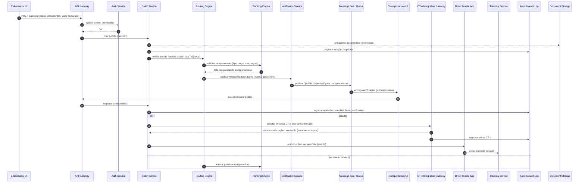

# Relatório Técnico de Arquitetura de Software

## 1. Identificação das HUs
Lista consolidada das Histórias de Usuário (HU) presentes nos requisitos de entrada, com referência direta aos critérios de aceite principais:

- HU01 — Registrar pedido de frete (RF05, RF06, RF09; critérios: campos obrigatórios, upload documentos, roteamento automático).
- HU02 — Selecionar transportadora e contratar seguro (RF10–RF16, RF41; critérios: exibir ranqueamento, contratar seguro, disparar CT-e).
- HU03 — Acompanhar pedidos e receber comprovante de entrega (RF07, RF37–RF39; critérios: visão consolidada, POD disponível).
- HU04 — Abrir sinistro por avaria ou extravio (RF42–RF44; critérios: vinculação ao pedido, anexos, notificações).
- HU05 — Aceitar pedidos de frete e gerenciar frota (RF10, RF13–RF16, RF03; critérios: notificação com dados, prazo de aceite, justificativa).
- HU06 — Acompanhar operação dos motoristas em tempo real (RF25, RF30–RF32, RNF23; critérios: mapa, alertas, contato).
- HU07 — Consultar demonstrativo financeiro de repasse (RF48, RF45–RF47; critérios: listagem, filtros, exportação).
- HU08 — Executar coleta com registro de evidências (RF23–RF25, RF24; critérios: foto, volumes, assinatura, transmissão).
- HU09 — Registrar entrega com assinatura digital do destinatário (RF27, RF37–RF39, RNF10, RNF17; critérios: foto, assinatura, POD ≤ 60s, offline).
- HU10 — Registrar ocorrência durante o transporte (RF26; critérios: categorização, anexos, notificações).
- HU11 — Rastrear carga em tempo real sem cadastro (RF30–RF32, RNF05; critérios: link tokenizado, mapa, eventos, expiração).
- HU12 — Receber notificações de cada etapa da entrega (RF33–RF36; critérios: eventos, preferências).
- HU13 — Monitorar SLA de fretes e acionar contingência (RNF12, RNF13, HU13; critérios: painel de risco, alertas).
- HU14 — Acompanhar painel financeiro da plataforma (RF49, RNF25; critérios: KPIs, filtros, exportação).

Observação: cada HU foi mapeada para os requisitos funcionais (RF) e não-funcionais (RNF) relevantes nos critérios de aceite acima.

---

## 2. Diagramas de Arquitetura (Mermaid)

Diagrama de sequência representando o fluxo principal desde o registro do pedido até aceite da transportadora, emissão de CT-e e início do rastreamento. Inclui participantes e passos assíncronos (filas/ eventos) — autonumber obrigatório presente.



Componente de alto nível (component diagram) mostrando os subsistemas e interfaces principais:

```mermaid
graph LR
  subgraph Plataforma
    APIGW[API Gateway]
    Auth[Auth & RBAC Service]
    UM[User Management]
    OrderSvc[Order / Freight Service]
    Routing[Routing & Ranking Engine]
    Notification[Notification Service (email/SMS/push)]
    CTegw[CT-e Integration Gateway]
    InsuranceGw[Insurance Integration]
    Financial[Financial / Billing Service]
    POD[POD & Evidence Service]
    Tracking[Tracking Service (time-series)]
    DriverSync[Offline Sync Module]
    Docs[Document Storage]
    Audit[Audit & Immutability Store]
    Metrics[Monitoring & Metrics]
    Scheduler[Scheduler & Retry]
    TokenLink[Tokenized Tracking Link Service]
  end

  subgraph Externos
    TransportadoraUI[Transportadora UI]
    EmbarcadorUI[Embarcador UI]
    DestinatarioLink[Destinatário via Link]
    MotoristaApp[Driver Mobile App]
    SEFAZ[SEFAZ / Fiscal Authority]
    Seguradora[Seguradora Parceira]
    SMSProvider[SMS / Gateway de Mensagem]
    EmailProvider[Email Provider]
  end

  %% Comunicação entre componentes
  EmbarcadorUI --> APIGW
  TransportadoraUI --> APIGW
  MotoristaApp --> APIGW
  APIGW --> Auth
  APIGW --> UM
  APIGW --> OrderSvc
  OrderSvc --> Docs
  OrderSvc --> Routing
  Routing --> Ranking[Ranking subcomponent]
  Routing --> Notification
  Notification --> SMSProvider
  Notification --> EmailProvider
  OrderSvc --> CTegw
  CTegw --> SEFAZ
  OrderSvc --> InsuranceGw
  InsuranceGw --> Seguradora
  OrderSvc --> Financial
  MotoristaApp --> DriverSync
  DriverSync --> Tracking
  Tracking --> TokenLink
  TokenLink --> DestinatarioLink
  OrderSvc --> POD
  POD --> Docs
  AllLogs[(Logs/Events)] -.-> Audit
  Metrics --> Scheduler
  Audit --> Docs
```

Observação: os nomes acima representam responsabilidades lógicas (serviços/ subsistemas). Interfaces públicas devem ser baseadas em contratos versionados (APIs/ eventos), conforme RNF24.

---

## 3. Decisões de Arquitetura
(Decisões chave e justificativas, mantendo neutralidade tecnológica)

1. Estilo arquitetural: arquitetura orientada a serviços (serviços independentes, comunicação via APIs REST/gRPC + mensagens assíncronas para eventos). Justificativa: isolar responsabilidades (roteamento, rastreamento, faturamento), facilitar escalabilidade independente e implantação incremental.

2. Comunicação síncrona vs assíncrona: operações de baixa latência e feedback imediato (autenticação, criação de pedido) usarão chamadas síncronas; fluxo de notificação, ranking escalonamento, aceites e eventos de rastreamento usarão fila/event-bus assíncrono para resiliência e desacoplamento (atende RNF16, RNF17).

3. Mobile offline-first: o aplicativo do motorista deve suportar modo offline com armazenamento local de eventos e mecanismo de sincronização (DriverSync) para garantir RNF17. Conflitos resolvidos por estratégia de última escrita válida + eventos idempotentes.

4. Rastreamento: dados de geolocalização modelados e armazenados em um componente otimizado para séries temporais / consultas geoespaciais (Tracking Service) com APIs de consulta e projeção de rota para previsões dinâmicas (RF30–RF32, RNF23).

5. Segurança e conformidade: TLS obrigatório em trânsito (RNF01), criptografia em repouso para dados sensíveis (RNF02). RBAC e MFA para perfis sensíveis (RNF03). Links de rastreamento tokenizados com validade curta e escopo mínimo (RNF05).

6. CT-e e integrações externas: isolamento por gateway contratual (CT-e Integration Gateway) com suporte a modo offline/contingência e filas de reenvio, respeitando o schema e modalidades exigidos (RNF07–RNF08, RF17–RF21). Versão de contrato controlada (RNF24).

7. Auditoria imutável: escrituração de eventos críticos (financeiro, CT-e, aceite/recusa) em armazenamento com características de imutabilidade e retenção conforme RNF11; logs de auditoria associados a cada transação (RF04).

8. POD e timestamp: geração de POD com assinatura eletrônica e carimbo de tempo com validade jurídica conforme RNF10; o sistema deve registrar metadados de prova (hash do conteúdo, metadados de assinatura) e disponibilizar download imediato.

9. Financeiro e faturamento: componente de faturamento desacoplado que consolida eventos de finalização de frete, aplica regras de comissão (RF46) e gera faturas/ demonstrativos (RF47–RF49).

10. Observabilidade e operações: métricas, alertas e painel em tempo real para latências, taxas de aceitação e disponibilidade (RNF25). Backups diários com retenção e RPO/RTO conforme RNF22.

11. Política de retry e compensação: para integrações críticas (SEFAZ, seguradora) implementar filas com retry exponencial, DLQ e mecanismos de compensação para garantir eventual consistência (RNF14, RF19).

12. Privacidade (LGPD): minimizar exposição de dados, aplicar anonimização/pseudonimização nos acessos públicos (token de rastreamento) e política de acesso por escopo.

---

## 4. Tabela de Componentes e Rastreabilidade

| Componente | Responsabilidade Principal | Comunica-se com | Origem (HU / Critério de Aceite) |
|---|---:|---|---|
| API Gateway | Ponto único de entrada, roteamento de API, autenticação básica, rate limiting | Auth, Order Service, User Management, Notification | HU01, HU02, HU05 (notificações) |
| Auth Service & RBAC | Autenticação, emissão/validação de tokens, MFA, políticas de sessão | API Gateway, User Management, Audit | RF01, RNF03, RNF04 |
| User Management | CRUD de usuários e perfis (embar., transp., motorista, destin., admin) | Auth, API Gateway, Transportadora UI | RF01, RF03 |
| Order / Freight Service | Persistência e orquestração de pedidos, estado do ciclo de vida do frete | Docs, Routing, Financial, CT-e Gateway, POD | RF05–RF09, HU01 |
| Routing Engine | Filtragem de transportadoras habilitadas por rota/tipo, acionamento do ranking | Order Service, Ranking Engine, Notification | RF10, RF13, RF15, HU02 |
| Ranking Engine | Calcula score por critérios (preço, prazo, histórico) | Routing, Order Service, Metrics | RF11–RF12, HU02 |
| Notification Service | Envio de e-mail, SMS, push; gerenciamento de preferências | Order Service, Transportadora UI, Destinatário Link, SMS/Email Providers | RF33–RF36, HU12 |
| CT-e Integration Gateway | Emissão e transmissão de CT-e, contingência, consultas a SEFAZ | Order Service, SEFAZ, Audit | RF17–RF22, RNF07–RNF08 |
| Insurance Integration Gateway | Cotação e contratação de seguro por viagem | Order Service, Seguradora | RF41, HU02 |
| Tracking Service | Armazenamento de posições (séries temporais), APIs de consulta e projeção | DriverSync, Tokenized Link, Order Service, Metrics | RF25, RF30–RF32, RNF23 |
| Driver Mobile App (client) | Execução de coletas/entregas, captura de fotos/assinaturas, envio de geolocalização | API Gateway, Driver Sync, Notification | RF23–RF29, HU08–HU10 |
| Offline Sync Module | Sincronização bidirecional, resiliência offline, conflito/queue local | Driver App, Tracking, Order Service | RNF17, HU08, HU09 |
| POD & Evidence Service | Geração de POD, assinatura eletrônica, timestamping, armazenamento de evidências | Order Service, Docs, Audit | RF37–RF39, RNF10 |
| Document Storage | Armazenamento seguro de NF-e, imagens, laudos | Order Service, POD, Audit | RF09, RF44, HU04 |
| Audit & Immutability Store | Registro imutável de eventos críticos (financeiro/fiscal) | All services | RF04, RNF11 |
| Financial / Billing Service | Cálculo de frete, aplicação de comissões, geração de faturas/repasse | Order Service, Accounting UI, Docs | RF45–RF49, HU07 |
| Tokenized Tracking Link Service | Geração/validação de links tokenizados para destinatários | Tracking Service, Notification | RF30, RNF05, HU11 |
| Monitoring & Metrics | Métricas operacionais, painéis, alertas (SLA) | All services, Ranking, Routing | RNF25, HU13, HU14 |
| Scheduler & Retry | Agendamento (timeout de aceite), retries, DLQ handling | Routing, CT-e Gateway, Notification | RF15, RNF14 |
| Documented API Contracts Registry | Versionamento de contratos de integração | CT-e Gateway, Insurance, SEFAZ, Integrations | RNF24 |
| Export/Reporting Module | Geração de CSV/PDF para relatórios financeiros e demonstrativos | Financial, Admin UI | RF47–RF49, HU07, HU14 |

---

## 5. Bloqueios e Pendências
Itens que requerem decisão/entrada externa antes da implementação completa:

1. Especificações de integração com SEFAZ:
   - Pendente: versão XSD oficial a ser suportada e canais de teste/autorização.
   - Impacto: define contrato do CT-e Gateway, fluxos de contingência e requisitos de retry.

2. Contratos com seguradoras parceiras:
   - Pendente: APIs de cotação/contratação, SLA, formatos de resposta e requisitos de segurança.
   - Impacto: afeta Insurance Integration Gateway e fluxo HU02/HU04.

3. Provedores de mensagens (SMS / push) e política de custos:
   - Pendente: seleção e SLAs de provedores de SMS/push.
   - Impacto: disponibilidade e latência das notificações (RF33–RF36).

4. Requisitos de escala esperada:
   - Pendente: número esperado de motoristas ativos, atualizações de posição por minuto, volume diário de pedidos.
   - Impacto: dimensionamento do Tracking Service, filas e RPO/RTO.

5. Especificação jurídica do carimbo de tempo:
   - Pendente: procedimento legal aceitável para timestamping em POD (provedor de tempo confiável, logs de CA).
   - Impacto: conformidade RNF10 e validade jurídica do POD.

6. Política detalhada de retenção e arquivamento:
   - Pendente: períodos por tipo de dado além dos mínimos (ex.: imagens, vídeos, sinistros).
   - Impacto: custos de armazenamento, estratégia de tiering e backup.

7. Requisitos de integração com ERPs financeiros das transportadoras/embaracadores:
   - Pendente: formatos, autenticação e mapeamento de contas.
   - Impacto: Financial Service e exportadores.

8. Regras de negócio detalhadas para ranqueamento:
   - Pendente: pesos, periodicidade de atualização do índice de desempenho e fontes de dados.
   - Impacto: implementação do Ranking Engine e consistência do ranque.

9. Política de MFA e métodos aceitáveis:
   - Pendente: SMS, app autenticador ou outros.
   - Impacto: Auth Service e experiência do usuário (RNF03).

---

## 6. Cobertura de Requisitos
Mapeamento resumido RF / RNF -> Componentes responsáveis (confirmação de cobertura):

- RF01 (cadastro perfis): User Management, Auth Service.
- RF02 (restrição por perfil): Auth Service & RBAC, API Gateway.
- RF03 (transportadora gerenciar motoristas/veículos): User Management, Transportadora UI, Order Service.
- RF04 (log de auditoria): Audit & Immutability Store, Audit hooks em Order/CT-e/Financial.
- RF05–RF09 (pedidos, documentos, valor): Order Service, Document Storage, Routing.
- RF10–RF16 (roteamento/seleção): Routing Engine, Ranking Engine, Notification, Scheduler & Retry.
- RF17–RF22 (CT-e): CT-e Integration Gateway, Scheduler, Audit.
- RF23–RF29 (operacao motorista): Driver Mobile App, Offline Sync Module, Tracking Service, POD Service.
- RF30–RF32 (rastreamento público): Tokenized Tracking Link Service, Tracking Service, Notification.
- RF33–RF36 (notificações): Notification Service, Templates, Preferences store.
- RF37–RF40 (POD): POD & Evidence Service, Document Storage, Audit.
- RF41–RF44 (seguros/sinistros): Insurance Integration Gateway, Order Service, Document Storage, Notification.
- RF45–RF49 (financeiro): Financial / Billing Service, Order Service, Docs, Export/Reporting Module.
- RNF01 (TLS): API Gateway, inter-service TLS requirement (arquitetural).
- RNF02 (criptografia at-rest): Document Storage, Audit, Financial storage.
- RNF03–RNF05 (MFA, tokens rastreamento): Auth Service (MFA), Tokenized Tracking Link Service.
- RNF07–RNF11 (conformidade): CT-e Gateway, POD Service, Audit, Document Storage.
- RNF12–RNF17 (avail./perf./scal./offline): Monitoring, Routing/Ranking performance behaviours, Tracking Service, Driver Sync.
- RNF18–RNF21 (usab./compat.): Driver App UX rules, responsive portals.
- RNF22–RNF25 (backup/infra/interop): Backup policies, API Contracts Registry, Metrics.

Cobertura das HUs: todos os HUs têm componentes designados na Tabela de Componentes; cross-checks entre HUs (ex.: HU09 offline + POD) contemplados via DriverSync + POD Service.

---

## 7. Gap Analysis

Identificação das principais lacunas nos requisitos que afetam decisões arquiteturais, com impacto e ações recomendadas.

1. Gap: Volume esperado de telemetria (posições por minuto / motoristas concorrentes)
   - Impacto: dimensionamento do Tracking Service (throughput, retenção), estratégia de sharding e custos de armazenamento.
   - Ação recomendada: coletar estimativas de QPS e taxa de atualização por motorista; definir políticas de downsampling/retention e SLAs de consulta.

2. Gap: Especificação detalhada do índice de desempenho das transportadoras (formulação/ pesos)
   - Impacto: não é possível implementar Ranking Engine repetível e auditável.
   - Ação recomendada: definir fórmula (fatores, pesos, janela de cálculo), dados de entrada e processo de recalculo.

3. Gap: Contratos/SLAs das integrações externas (SEFAZ, seguradoras, provedores de SMS)
   - Impacto: políticas de retry, timeout e requisitos de contingência não podem ser finalizadas.
   - Ação recomendada: negociar contratos e publicar APIs de integração com SLAs e ambientes de homologação.

4. Gap: Especificação legal e técnica do carimbo de tempo (timestamping)
   - Impacto: validade jurídica do POD e conformidade RNF10 pode ficar em risco.
   - Ação recomendada: validar mecanismo aceito (entidade de carimbo confiável) e registrar requisitos de prova criptográfica.

5. Gap: Política completa de retenção por tipo de dado além do mínimo fiscal
   - Impacto: custo e estratégia de armazenamento (tiering) indefinidos.
   - Ação recomendada: elaborar matriz de retenção (ex.: imagens sinistro 5 anos, telemetria 90 dias), classificação de sensibilidade.

6. Gap: Detalhes operacionais para failover e RTO frente a indisponibilidade de integrações externas
   - Impacto: disponibilidade (RNF12) e comportamento de contingência do fluxo de pedidos (ex.: emitir CT-e em contingência).
   - Ação recomendada: definir playbooks de contingência e automatizar transições entre modos (normal ↔ contingência).

7. Gap: Requisitos de auditoria de performance e retenção (frequência de checkpoint e indexação)
   - Impacto: consulta e compliance (RNF11) podem ser afetadas sem estratégia de indexação.
   - Ação recomendada: definir índices de consulta, formatos de armazenamento imutável e estratégia de exportação para auditoria externa.

8. Gap: Definição de métricas e thresholds no painel de monitoramento (quando alertar SLA em risco)
   - Impacto: painel do administrador (HU13/HU14) não terá critérios programáveis para alertas.
   - Ação recomendada: definir regras (ex.: ETA vs prazos, número de recusas em janela X) e níveis de severidade.

9. Gap: Fluxo de reconciliação financeiro com transportadoras (prazos de repasse, formas de pagamento)
   - Impacto: Financial Service não poderá automatizar pagamentos/repasse.
   - Ação recomendada: formalizar política de repasse, prazos e integrações bancárias/ERP.

10. Gap: Estratégia de testes end-to-end para modo offline do motorista
    - Impacto: riscos de perda de eventos ou duplicidade na sincronização.
    - Ação recomendada: definir cenários de teste, critérios de idempotência e mecanismos de detecção de conflito.

Resumo das ações prioritárias (curto prazo):
- Coletar volumes e SLAs esperados (telemetria, pedidos).
- Formalizar contratos com SEFAZ e seguradoras (API contracts + ambientes).
- Definir fórmula do ranking e thresholds de alerta.
- Especificar política de retenção e mecanismo jurídico para timestamping.

---

Observações finais
- O design proposto prioriza modularidade e desacoplamento (serviços com contratos versionados e event-bus) para atender requisitos de escalabilidade, resiliência e governança.
- Próximo passo recomendado: workshop com partes interessadas (fiscal, jurídico, seguradora, operações, TI) para resolver as pendências listadas e obter SLAs e volumes para dimensionamento.
- Todos os componentes e interações estão descritos em termos conceituais para manter neutralidade tecnológica, conforme diretriz obrigatória.