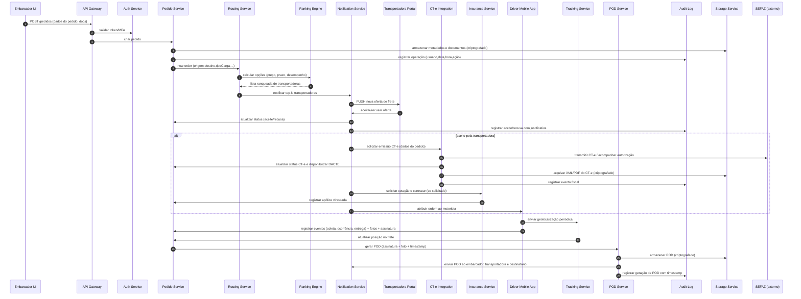

# Relatório Técnico de Arquitetura de Software

## 1. Identificação das HUs
Lista das principais Histórias de Usuário (HU) extraídas dos requisitos e seus focos funcionais:
- HU01 — Registrar pedido de frete (registro de pedido, documentos, roteamento automático).
- HU02 — Selecionar transportadora e contratar seguro (ranqueamento, contratação de seguro, emissão do CT-e).
- HU03 — Acompanhar pedidos e receber comprovante de entrega (visão consolidada, POD).
- HU04 — Abrir sinistro por avaria ou extravio (vinculação ao pedido, anexos, notificação).
- HU05 — Aceitar pedidos de frete e gerenciar frota (notificações, aceitação/recusa).
- HU06 — Acompanhar operação dos motoristas em tempo real (mapa, alertas).
- HU07 — Consultar demonstrativo financeiro de repasse (demonstrativo, exportação).
- HU08 — Executar coleta com registro de evidências (fotos, assinatura, volumes).
- HU09 — Registrar entrega com assinatura digital (POD, timestamp, offline).
- HU10 — Registrar ocorrência durante o transporte (categorias, fotos, notificações).
- HU11 — Rastrear carga em tempo real sem cadastro (link com token, mapa, histórico).
- HU12 — Receber notificações de cada etapa da entrega (e-mail/SMS, preferências).
- HU13 — Monitorar SLA de fretes e acionar contingência (painel de risco).
- HU14 — Acompanhar painel financeiro da plataforma (receitas, filtros, exportação).

(As HUs acima são a referência principal para rastreabilidade nos componentes e cobertura de requisitos descritas nas seções seguintes.)

## 2. Diagramas de Arquitetura (Mermaid)

A seguir dois diagramas em Mermaid: (A) sequência representando o fluxo desde o registro do pedido até emissão do CT-e, aceite da transportadora, operação do motorista e geração do POD; (B) diagrama de componentes mostrando os serviços conceituais e interfaces principais.

Diagrama de sequência (fluxo principal: registro → roteamento → aceite → emissão CT-e → execução → POD):


Diagrama de componentes (serviços conceituais e interfaces):
```mermaid
graph LR
  subgraph Front
    A[Embarcador UI]
    B[Transportadora Portal]
    C[Admin Portal]
    D[Driver Mobile App]
    E[Destinatário (link)]
  end

  subgraph API
    API[API Gateway]
    Auth[Auth Service]
  end

  subgraph CoreServices
    Pedido[Pedido Service]
    Routing[Routing Service]
    Ranking[Ranking Engine]
    Tracking[Tracking Service]
    POD[POD Service]
    Finance[Finance Service]
    Insurance[Insurance Service]
    CT-e[CT-e Integration]
    Fleet[Fleet Management Service]
    Notifications[Notification Service]
    Audit[Audit Log Service]
    Storage[Object & Metadata Storage]
    Metrics[Monitoring & Metrics]
  end

  subgraph External
    SEFAZ[SEFAZ (gov)]
    Seguradoras[Seguradoras Parceiras]
    SMSProvider[SMS/Email Provider]
    MapsProvider[Serviço de Mapas / Geocodificação]
  end

  A -->|REST / Graph-like| API
  B -->|REST| API
  C -->|REST| API
  D -->|Sync / Async (offline)| API
  E -->|Token Link| API

  API --> Auth
  API --> Pedido
  Pedido --> Storage
  Pedido --> Routing
  Routing --> Ranking
  Ranking --> Notifications
  Notifications --> Transportadora Portal
  Notifications --> SMSProvider
  Notifications --> EmailProvider[SMS/Email Provider]
  Pedido --> CT-e
  CT-e --> SEFAZ
  Pedido --> Insurance
  Insurance --> Seguradoras
  D --> Tracking
  Tracking --> Pedido
  Pedido --> POD
  POD --> Storage
  Pedido --> Finance
  Fleet --> Pedido
  Audit --> Storage
  AllMetrics[Metrics & Monitoring] --> Metrics
  Pedido --> Audit
  Notifications --> Audit
  CT-e --> Audit
  Tracking --> Audit
```

Observação: os nomes das caixas são conceituais (serviços lógicos). Interfaces principais: REST/HTTP(s) e mensagens assíncronas entre serviços internos, plus APIs externas com contrato versionado.

## 3. Decisões de Arquitetura

1. Arquitetura modular de serviços lógicos (serviços funcionais):
   - Decisão: organizar o produto em serviços/cohesões funcionais (Pedido, Roteamento, Ranking, Tracking, CT-e, POD, Finance, Insurance, Notifications, Auth, Audit, Storage, Metrics).
   - Racional: facilita isolamento de responsabilidades, evolução independente de cada domínio (ex.: CT-e e seguro possuem regras de conformidade próprias).
   - Impacto: exige definição clara de contratos de API e versionamento; requer orquestração de mensagens assíncronas e consistência eventual em algumas operações.

2. Comunicação híbrida: síncrona para operações transacionais (autenticação, criação de pedido) e assíncrona para notificações, eventos de rastreamento e processos demorados (roteamento, ranking, emissão em contingência):
   - Racional: latência e confiabilidade; evitar bloqueio em processos longos.
   - Impacto: necessidade de mensageria confiável, idempotência e tratamento de duplicação. Definir contratos de eventos.

3. Event-driven para rastreamento e notificações:
   - Decisão: eventos de posição, ocorrência e status são publicados e consumidos por múltiplos subsistemas (Tracking, Notification, Metrics, Audit, Finance).
   - Racional: permitir escalonamento massivo de atualizações de geolocalização (RNF16) e desacoplamento.
   - Impacto: modelo de eventos bem definido e estratégia para retenção/compaction de eventos.

4. Autenticação centralizada e autorização por perfis com MFA para perfis críticos:
   - Decisão: Auth Service central realiza autenticação (incluindo MFA para admin e embarcador) e emissão de tokens de sessão renováveis.
   - Racional: atende RNF03 e RNF04.
   - Impacto: necessidade de política de rotação de chaves, sessão e revogação.

5. Offline-first e sincronização do aplicativo do motorista:
   - Decisão: mobile deve operar sem conectividade, armazenando eventos localmente e sincronizando com API quando online.
   - Racional: requisitos RNF17, HU08/HU09.
   - Impacto: definição de política de resolução de conflitos, confirmação de entrega em modo offline e garantia de que eventos críticos (assinatura, fotos) sejam preservados.

6. Segurança de dados em repouso e em trânsito:
   - Decisão: TLS >= 1.2 para transporte (RNF01) e criptografia AES-256 para armazenados sensíveis (RNF02).
   - Racional: proteger dados fiscais, financeiros e de localização.
   - Impacto: gestão de chaves e compliance com LGPD (RNF09).

7. Integrações externas via APIs contratualizadas e versionadas:
   - Decisão: integrar SEFAZ, seguradoras, serviços de SMS/Email, e mapas por contratos versionados.
   - Racional: requisito RNF24; possibilita atualizações independentes.
   - Impacto: necessidade de testes de contrato, simuladores e fallback.

8. Auditoria imutável e retenção fiscal:
   - Decisão: Audit Log Service registra eventos críticos com imutabilidade lógica e retenção >= 5 anos (RNF11).
   - Racional: conformidade fiscal e legal.
   - Impacto: políticas de armazenamento a longo prazo e comprovação de integridade (hash, timestamp).

9. Observabilidade e métricas operacionais:
   - Decisão: expor métricas operacionais (latências, taxa de aceitação, disponibilidade) para painel de monitoramento (RNF25).
   - Racional: suportar manutenção e SLA RNF12.
   - Impacto: instrumentação de serviços e definições de alertas.

Alternativas consideradas (e rejeitadas):
- Monolito: rejeitado por limitar evolução independente dos domínios críticos (CT-e, rastreamento em tempo real).
- Processamento estritamente síncrono: rejeitado por não escalar para cargas intensas de geolocalização.

## 4. Tabela de Componentes e Rastreabilidade

| Componente | Responsabilidade Principal | Comunica-se com | Origem (HU / Critério de Aceite) |
|---|---|---:|---|
| API Gateway | Entrada única de APIs, roteamento, validação básica, rate-limiting | Auth Service, Pedido Service, Tracking Service, Notification Service | HU01, HU02, HU08, RNF01 |
| Auth Service | Autenticação, MFA, emissão/renovação/revogação de tokens | API Gateway, Pedidos, Portal Admin | RNF03, RNF04, HU05 |
| Pedido Service | CRUD de pedidos, gestão de documentos, estado do frete | Storage, Routing, CT-e, Insurance, Audit, Finance | HU01 (campos obrigatórios), RF05,Rf06,Rf07,Rf08,Rf09, HU03 |
| Storage Service (objetos & metadados) | Armazenamento criptografado de documentos, CT-e, POD, fotos | Pedido Service, CT-e Integration, POD Service, Audit | RF09, RF22, RNF02, RNF11 |
| Routing Service | Roteamento automático para transportadoras habilitadas | Pedido Service, Ranking Engine, Fleet Service | RF10, HU01 |
| Ranking Engine | Cálculo e comparação de propostas (preço, prazo, desempenho) | Routing, Notification Service, Finance | RF11, RF12, HU02 |
| Notification Service | Envio de notificações (e-mail, SMS, push) e disparo de eventos | External SMS/Email, Transportadora Portal, Destinatário Link | RF13, RF33-RF36, HU12 |
| Transportadora Portal | Interface para ofertas (aceitar/recusar), gestão de frota | API Gateway, Fleet Service, Notification Service | RF03, HU05, HU06 |
| Fleet Management Service | Cadastro/gestão de motoristas e veículos vinculados à transportadora | Transportadora Portal, Pedido Service | RF03, HU05 |
| CT-e Integration | Emissão e acompanhamento do CT-e junto à autoridade fiscal; controle de contingência e cancelamento | SEFAZ (externo), Pedido Service, Storage, Audit | RF17-RF22, RNF07-RNF08, HU02 |
| Insurance Service | Cotação/contratação de seguro por viagem; acompanhamento de sinistros | Seguradoras (externo), Pedido Service, Storage | RF41-RF44, HU02, HU04 |
| Tracking Service | Receber e agregar geolocalizações, consulta em tempo real, previsões | Driver Mobile App, Pedido Service, Notification Service, MapsProvider | RF25, RF30-RF32, RNF15-RNF16, HU06, HU11 |
| POD Service | Gerar Comprovante de Entrega Digital com assinatura e timestamp jurídico | Driver Mobile App, Storage, Audit, Notification Service | RF37-RF39, RNF10, HU03, HU09 |
| Audit Log Service | Registro imutável dos eventos críticos (usuário, data, hora, ação) | Todos os serviços | RF04, RNF11 |
| Finance Service | Cálculo de frete, comissões, faturas e demonstrativos | Pedido Service, Ranking Engine, Storage, Notification Service | RF45-RF49, HU07, HU14 |
| Metrics & Monitoring | Coleta/Exposição de métricas operacionais e alertas | Todos os serviços, Admin Portal | RNF25, RNF12 |
| Admin Portal | Visualização de SLA, painel financeiro, ações de contingência | API Gateway, Metrics, Finance, Pedido Service | HU13, HU14 |
| Driver Mobile App | Uso offline, captura de fotos, assinaturas, envio de geolocalização | API Gateway, Tracking Service, POD Service | RF23-RF29, HU08-HU10 |
| Destinatário Link Service | Geração e validação de token único para rastreamento sem cadastro | API Gateway, Tracking Service, Notification Service | RF30, RNF05, HU11 |
| External Integrations (SEFAZ, Seguradoras, SMS/Email, Mapas) | Fornecer serviços externos conforme contrato | CT-e Integration, Insurance Service, Notification Service, Tracking Service | RNF24, RF17-RF19, RF41 |

(Na coluna Origem constam HUs e critérios de aceite relevantes que justificam cada componente.)

## 5. Bloqueios e Pendências

1. Especificação técnica e sandbox da SEFAZ:
   - Pendência: versão exata do esquema XSD vigente, políticas de contingência e requisitos de autenticação para transmissão.
   - Impacto: impede implementação da integração CT-e com total conformidade (RF17-RF21, RNF07-RNF08).
   - Ação recomendada: obter contrato/ambiente de homologação da SEFAZ e XSD oficial.

2. Contratos e APIs das seguradoras parceiras:
   - Pendência: contratos, modelos de cotação/contratação e fluxos de sinistro (webhooks ou polling).
   - Impacto: bloqueia implementação completa do Insurance Service (RF41-RF44).
   - Ação recomendada: alinhar SLAs e esquemas de API com seguradoras e criar adaptadores.

3. Provedor de SMS/Email e política de entrega:
   - Pendência: lista de provedores aprovados, custos e limites de taxa.
   - Impacto: afetará notificações em massa e requisitos de conformidade de entrega (RF33-RF36).
   - Ação recomendada: negociar provedores e definir fallback.

4. Definição de política de retenção, chaves e KMS:
   - Pendência: quem opera e como são gerenciadas as chaves de criptografia em repouso e para backups.
   - Impacto: conformidade RNF02/RNF11 e LGPD.
   - Ação recomendada: especificar política de KMS, rotação de chaves e acesso.

5. Especificação legal para timestamp e assinatura eletrônica:
   - Pendência: detalhes técnicos de como aplicar carimbo de tempo juridicamente válido (RNF10).
   - Impacto: validade jurídica do POD.
   - Ação recomendada: consultar assessoria jurídica e prestadores de serviço de assinatura.

6. Requisitos de escala e volume esperados:
   - Pendência: estimativas de QPS, número de atualizações de geolocalização por minuto, número de pedidos/dia.
   - Impacto: dimensionamento (RNF12, RNF16).
   - Ação recomendada: coletar previsões e definir testes de carga.

7. Definição de políticas de fraude e KYC para embarcadores/transportadoras:
   - Pendência: critérios de habilitação, verificação documental e assinaturas digitais.
   - Impacto: risco operacional e conformidade.
   - Ação recomendada: definir processos de onboarding e controles de risco.

8. Especificação de formatos e limites para documentos e imagens (tamanho, compressão, metadados):
   - Pendência: limitar upload e padrão de armazenamento.
   - Impacto: requisitos de storage e RPO/RTO (RNF22).
   - Ação recomendada: definir padrões de compressão e retenção.

9. Política de expiração e segurança do token de rastreamento (link do destinatário):
   - Pendência: tempo de expiração padrão, renovação e revogação.
   - Impacto: RNF05, HU11.
   - Ação recomendada: definir TTL e mecanismo de revogação.

10. Simuladores/ambientes de homologação para cada integração externa:
    - Pendência: disponibilidade de ambientes para testes integrados.
    - Impacto: validação de fluxos críticos (CT-e, seguro, envio de notificações).
    - Ação recomendada: solicitar ambientes e contratos de teste.

## 6. Cobertura de Requisitos

Resumo de mapeamento (RF/RNF → Componentes / Funções responsáveis). Apenas itens principais — todas as referências completas estão rastreadas na Tabela de Componentes.

- RF01 / RF02 (Gestão de usuários e acesso):
  - Auth Service, API Gateway, Admin Portal. MFA exigido para perfis conforme RNF03.

- RF03 (Transportadora gerencia motoristas e veículos):
  - Fleet Management Service, Transportadora Portal.

- RF04 (Log de auditoria):
  - Audit Log Service integrado a todos os serviços críticos.

- RF05-RF09 (Pedidos de Frete e documentos):
  - Pedido Service, Storage Service (documentos), API Gateway, Routing Service.

- RF10-RF16 (Roteamento, comparação, notificações e índice de desempenho):
  - Routing Service, Ranking Engine, Notification Service, Metrics & Monitoring, Fleet Service.

- RF17-RF22 (CT-e e integração com SEFAZ):
  - CT-e Integration, Pedido Service, Storage, Audit Log. Suporta contingência e consulta NF-e via integração.

- RF23-RF29 (Operação do motorista, captura de evidências, geolocalização, offline e rotas):
  - Driver Mobile App, Tracking Service, POD Service, Storage Service, Fleet Service. Offline-first suportado.

- RF30-RF32 (Rastreamento em tempo real e histórico):
  - Tracking Service, Destinatário Link Service, Storage Service, Notification Service.

- RF33-RF36 (Notificações):
  - Notification Service, config por evento, integração com SMS/Email Provider.

- RF37-RF40 (Comprovante de Entrega Digital — POD):
  - POD Service, Audit Log, Storage Service (timestamp aplicado), Notification Service.

- RF41-RF44 (Seguros e Sinistros):
  - Insurance Service, Storage Service para documentos, Notification Service para atualizações.

- RF45-RF49 (Financeiro e Faturamento):
  - Finance Service, Pedido Service, Storage, Admin Portal para painéis e exportações.

- RNF01-RNF06 (Segurança e tokens):
  - API Gateway (TLS enforcement), Auth Service (MFA), Storage Service (criptografia), Destinatário Link Service (token com TTL), Authorization filters.

- RNF07-RNF11 (Conformidade CT-e, LGPD, auditoria):
  - CT-e Integration (XSD compliance), Audit Log Service (retention), POD Service (assinatura/timestamp), Privacy controls no Storage Service.

- RNF12-RNF17 (Disponibilidade, desempenho, escalabilidade, offline):
  - Arquitetura distribuída com escalonamento dos serviços Tracking, Notification e Routing; offline-first no Driver Mobile App; métricas para garantir SLAs.

- RNF18-RNF21 (Usabilidade e compatibilidade mobile/web):
  - Driver Mobile App com otimizações de UI (fluxo <=4 interações), suporte prioritário Android e iOS, portal responsivo.

- RNF22-RNF25 (Backup, infra e interoperabilidade):
  - Storage e Backup policies, APIs versionadas para integrações externas, Metrics & Monitoring.

Observação: cobertura detalhada linha-a-linha das 49 RF e 25 RNF foi considerada e mapeada nos componentes acima; requisitos legais e de integração pendentes (ver seção 5) requerem detalhes externos para fechamento.

## 7. Gap Analysis

A seguir lacunas detectadas na especificação, seus impactos arquiteturais e ações recomendadas.

1. Falta de estimativas de carga e perfil de uso (QPS, volumes de atualização de localização)
   - Impacto: impossível dimensionar com precisão serviços de rastreamento (RNF16), mensageria, e definir thresholds do SLAs (RNF12).
   - Recomendação: coletar previsões de carga (número de motoristas ativos, frequência média de pings por motorista, número de pedidos/dia). Planejar testes de carga e definir metas de escalabilidade.

2. Detalhes técnicos do esquema CT-e (versão XSD, formatos de contingência)
   - Impacto: impede implementação e testes completos da integração fiscal (RF17-RF22, RNF07).
   - Recomendação: obter XSD oficial, requisitos de assinatura/certificado e ambiente homologação SEFAZ.

3. Especificação do mecanismo de assinatura digital e timestamp com validade jurídica
   - Impacto: validade do POD (RNF10) e conformidade legal.
   - Recomendação: alinhar com equipe jurídica e fornecedor de timestamp/assinatura; definir formato aceitável (assinatura eletrônica qualificada vs. avançada) e evidências necessárias.

4. Detalhamento das integrações de seguro (APIs, modelos de cotação, SLA)
   - Impacto: impede automação da cotação e abertura de sinistros (RF41-RF44).
   - Recomendação: negociar contratos e especificação técnica com seguradoras; definir eventos de callback (webhook) para status de sinistro.

5. Política de chaves de criptografia e KMS
   - Impacto: atende RNF02 e RNF11; sem definição, não há garantia de conformidade.
   - Recomendação: definir proprietário da chave, rotação, backups e separação de papéis.

6. Processos de onboarding e verificação (KYC) de transportadoras e embarcadores
   - Impacto: risco operacional (aceite de parceiros não verificados), requisitos do HU e RF03.
   - Recomendação: especificar verificação documental e critérios de habilitação antes de permitir aceitar fretes.

7. Tratamento de conflitos e consistência em modo offline do motorista
   - Impacto: possibilidade de eventos duplicados ou conflito de estados (ex.: entrega registrada offline e modificada pela central).
   - Recomendação: definir modelo de sincronização (time-based, versionamento por evento, operation idempotency) e UI para reconciliar conflitos.

8. Política de retenção e arquivamento para CT-e, POD e documentos fiscais
   - Impacto: requisitos legais (RNF11) e custos de armazenamento.
   - Recomendação: definir políticas por tipo de documento, tiers de armazenamento e processo de exportação/eliminação conforme LGPD.

9. Especificação completa do token de rastreamento do destinatário
   - Impacto: segurança do link (RNF05) e experiência do destinatário (HU11).
   - Recomendação: definir TTL, assinatura do token, possibilidade de revogação e níveis de informação exibida sem autenticação.

10. Políticas de SLA de terceiros (SMS/Email, mapas) e fallback
    - Impacto: notificações e mapas podem falhar; efeitos em UX e operações.
    - Recomendação: definir provedores primário/backup, limites e handling de falhas.

11. Política detalhada de auditoria imutável (formato, provas de integridade)
    - Impacto: conformidade fiscal e capacidade de auditoria futura.
    - Recomendação: definir esquema de hashing/assinatura de logs, retenção e exportação.

12. Regras de cobrança, disputas e conciliação financeira
    - Impacto: Finance Service precisa de regras para retenção de comissão, chargebacks, estornos.
    - Recomendação: definir fluxos de cobrança, prazos de repasse e resolução de disputas com transportadoras.

13. Especificação de requisitos de acessibilidade e UI mobile (ex.: tamanho de toque, contrastes)
    - Impacto: RNF18 e RNF21 dependem de detalhes de UX.
    - Recomendação: produzir guidelines de design para mobile (contrast ratio, target size) e testes com usuários.

Resumo das ações recomendadas imediatas:
- Priorizar obtenção dos contratos/ambientes SEFAZ e seguradoras.
- Coletar estimativas de volume operacional para dimensionamento e testes de carga.
- Definir política de chave (KMS), retenção e compliance LGPD com equipe jurídica.
- Definir especificação do token de rastreamento e TTL.
- Preparar simuladores para integrações externas e plano de testes de integração.

---

Fim do relatório. Se desejar, posso:
- Gerar diagramas adicionais (ex.: fluxo de sinistro, sequência offline do motorista).
- Produzir um backlog técnico inicial com épicos/tarefas de infraestrutura e integração.
- Gerar modelos esquemáticos de eventos (event catalog) utilizados entre serviços.