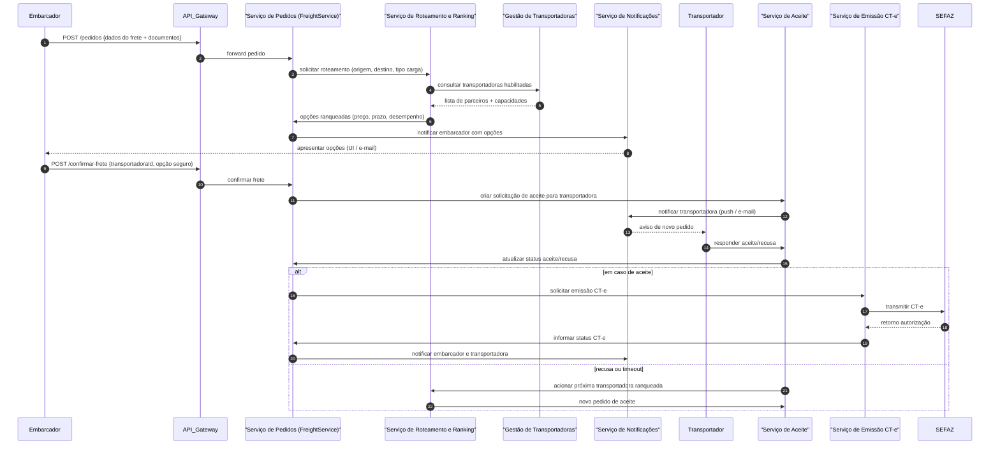
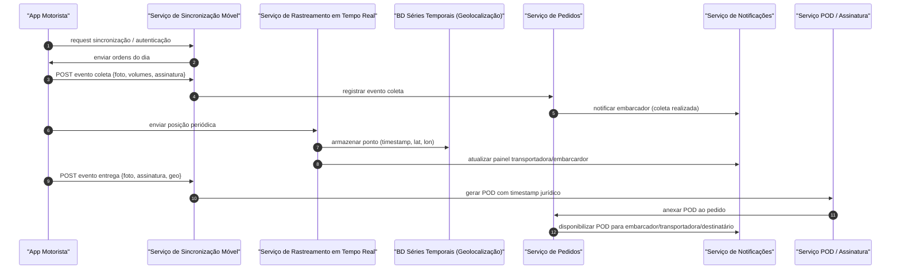

# Relatório Técnico de Arquitetura de Software

## 1. Identificação das HUs

Lista das Histórias de Usuário consideradas no projeto (referência direta às HUs fornecidas):

- HU01 — Registrar pedido de frete (embarque, documentos, roteamento automático)
- HU02 — Selecionar transportadora e contratar seguro (ranking e contratação)
- HU03 — Acompanhar pedidos e receber comprovante de entrega (POD)
- HU04 — Abrir sinistro por avaria ou extravio (integração com seguradora)
- HU05 — Aceitar pedidos de frete e gerenciar frota (transportadora)
- HU06 — Acompanhar operação dos motoristas em tempo real (painel transportadora)
- HU07 — Consultar demonstrativo financeiro de repasse (transportadora)
- HU08 — Executar coleta com registro de evidências (motorista)
- HU09 — Registrar entrega com assinatura digital do destinatário (POD legal)
- HU10 — Registrar ocorrência durante o transporte (ocorrências)
- HU11 — Rastrear carga em tempo real sem cadastro (link público com token)
- HU12 — Receber notificações de cada etapa da entrega (destinatário)
- HU13 — Monitorar SLA de fretes e acionar contingência (administrador)
- HU14 — Acompanhar painel financeiro da plataforma (administrador financeiro)

As HUs acima cobrem os fluxos primários de usuários embarcador, transportadora, motorista, destinatário e administrador, e servem de base para rastreabilidade dos requisitos nesta arquitetura.

---

## 2. Diagramas de Arquitetura (Mermaid)

Observação: Diagramas descrevem responsabilidades e interfaces conceituais (neutralidade tecnológica).

2.1 Sequência: Registro de pedido, roteamento, aceite e emissão de CT-e


2.2 Sequência: Fluxo do motorista (coleta, rastreamento, entrega, POD)


2.3 Diagrama de Componentes (classDiagram)
```mermaid
classDiagram
class API_Gateway {
  +validarToken()
  +rateLimit()
  +rodarRoteamento()
}
class AuthService {
  +autenticar()
  +autorizar(perfil)
  +mfaVerify()
}
class FreightService {
  +criarPedido()
  +atualizarStatus()
  +anexarDocumentos()
}
class RoutingService {
  +avaliarTransportadoras()
  +rankearOpcoes()
  +aplicarRegrasConfig()
}
class PartnerService {
  +gerenciarTransportadoras()
  +gerenciarMotoristasFrota()
}
class AcceptanceService {
  +solicitarAceite()
  +tratarRecusaTimeout()
}
class CTeService {
  +gerarCTe()
  +transmitirSEFAZ()
  +consultarStatus()
  +modoContingencia()
}
class TrackingService {
  +receberPosicao()
  +calcularETA()
  +fornecerRastreamentoPublico()
}
class TimeSeriesDB {
  +armazenarPosicoes()
  +consultasGeoespaciais()
}
class DocumentStorage {
  +armazenarDocumento()
  +controleAcesso()
}
class NotificationService {
  +enviarEmail()
  +enviarSMS()
  +pushMobile()
}
class InsuranceService {
  +cotacaoSeguro()
  +contratarSeguro()
  +abrirSinistro()
}
class FinancialService {
  +calcularFrete()
  +calcularComissao()
  +gerarFaturas()
}
class PODService {
  +gerarPOD()
  +aplicarTimestamp()
}
class AuditService {
  +registrarOperacaoImutavel()
  +consultaAuditoria()
}
class Monitoring {
  +exporMetricas()
  +alertasSLA()
}
API_Gateway --> AuthService
API_Gateway --> FreightService
FreightService --> RoutingService
RoutingService --> PartnerService
FreightService --> AcceptanceService
AcceptanceService --> NotificationService
FreightService --> CTeService
CTeService --> "SEFAZ (externo)"
TrackingService --> TimeSeriesDB
FreightService --> DocumentStorage
FreightService --> PODService
FreightService --> NotificationService
FreightService --> InsuranceService
FinancialService --> FreightService
AuditService <.. FreightService
Monitoring <.. TrackingService
Monitoring <.. CTeService
```

---

## 3. Decisões de Arquitetura

Listagem das decisões arquiteturais principais (conceituais, neutras quanto a produtos):

1. Estilo arquitetural
   - Arquitetura orientada a serviços (serviços independentes por domínio funcional): Serviços centrais para Pedidos, Roteamento, Aceite, Emissão CT-e, Rastreamento, Notificações, Financeiro, Seguro, POD, Autenticação, Auditoria e Armazenamento de documentos.
   - Motivação: modularidade, autonomia de implantação, escalabilidade por domínio (ex.: rastreamento com alto volume).

2. Comunicação e integração
   - APIs versionadas e contratadas para todas as integrações externas (SEFAZ, seguradoras, emissores de CT-e, provedores de SMS/Email). Interfaces claramente definidas (REST/HTTP + contratos de mensagem).
   - Assincronia por eventos para fluxos que toleram latência (aceite transporte, sinistros, atualização de índice de desempenho) via barramento de mensagens interno, garantindo desacoplamento entre serviços e resiliência a picos.

3. Modelo de persistência
   - Dados transacionais (pedidos, faturas, usuários) em armazenamento transacional consistente.
   - Geolocalização em banco otimizado para séries temporais e consultas geoespaciais (armazenamento e índices próprios).
   - Documentos (NF-e, fotos, DACTE, POD, laudos) em storage de objetos com controle de acesso.
   - Auditoria imutável: trilha de auditoria com garantias de imutabilidade e retenção legal (por ex., assinatura de eventos ou ledger append-only conceitual).

4. Disponibilidade, escalabilidade e resiliência
   - Serviços críticos (rastreamento, roteamento, emissão CT-e, notificações) dimensionados horizontalmente.
   - Circuit-breakers e fallback para integrações externas (SEFAZ, seguradoras); modo de contingência para emissão CT-e com sincronização posterior.
   - Aplicativo móvel operando em modo offline com sincronização eventual e resolução de conflitos por versão/timestamp.

5. Segurança e conformidade
   - Comunicação cliente-servidor obrigatoriamente por TLS 1.2+.
   - Criptografia em repouso para dados sensíveis (finanças, fiscais, localização) com chaves gerenciadas por serviço de gerenciamento de chaves (conceitual).
   - Autenticação centralizada com MFA obrigatório para perfis administrativos e embarcadores.
   - Permissões finas: controle de acesso por cargo/perfil (embarcardor vs transportadora vs motorista vs destinatário).
   - Link de rastreamento público protegido por token único com expiração e escopo restrito.
   - Suporte à LGPD: minimização, consentimento quando aplicável, e ferramentas para atendimento a solicitações de titulares.

6. Legalidade da assinatura e timestamp
   - POD deve incorporar carimbo de tempo com validade jurídica (fluxo de assinatura eletrônica auditado e com evidências). Arquitetura prevê componentes para aplicar timestamp legal ao POD no momento da assinatura.

7. Observabilidade e operação
   - Exposição de métricas operacionais e de negócio (latência de roteamento, taxa de aceitação, disponibilidade de integrações) em painel de monitoramento.
   - Logs estruturados e tracing distribuído entre serviços para investigação de incidentes.

8. Governança de contratos externos
   - Todas integrações externas (SEFAZ, seguradoras, emissores) com contratos versionados e teste de compatibilidade automatizado antes de atualização em produção.

Decisões recusadas (resumo conceitual)
- Centralizar todos os domínios em uma única base de dados transacional para simplificar consultas: recusado por impacto em escalabilidade e isolamento de falhas (especialmente para rastreamento em tempo real).

---

## 4. Tabela de Componentes e Rastreabilidade

| Componente | Responsabilidade Principal | Comunica-se com | Origem (HU / Critério de Aceite / RF / RNF) |
|---|---|---:|---|
| API_Gateway | Entrada única de APIs, roteamento, validação tokens, rate limiting | AuthService, FreightService, TrackingService, other services | HU01, HU02, RF01, RNF01 |
| AuthService (Gestão de Acesso) | Autenticação, autorização, MFA, gestão de sessões | API_Gateway, UserManagement | RF01, RF02, RNF03, RNF04 |
| UserManagement | Cadastro/gerência de usuários/perfis (embar., trans., motorista, destinatário, admin) | AuthService, PartnerService | RF01, RF03, HU05 |
| FreightService (Pedidos) | Criação/atualização de pedidos, armazenamento metadados, anexos | RoutingService, AcceptanceService, DocumentStorage, CTeService, PODService, FinancialService, AuditService | RF05, RF06, RF07, RF08, RF09, HU01, HU03 |
| DocumentStorage | Armazenamento seguro de arquivos (NF-e, fotos, DACTE, POD, laudos) | FreightService, PODService, InsuranceService | RF09, RF22, RNF02 |
| RoutingService | Roteamento automático, critérios configuráveis, ranqueamento e fallback | PartnerService, FreightService, AcceptanceService, Monitoring | RF10, RF11, RF12, RF15, RNF13 |
| PartnerService (Transportadoras / Frota) | Gerenciar cadastro de transportadoras, motoristas, veículos | RoutingService, AcceptanceService, TrackingService | RF03, HU05 |
| AcceptanceService | Gerenciar ciclo de convite/aceite/recusa/timeout | NotificationService, FreightService, RoutingService | RF13, RF14, RF15, HU05 |
| NotificationService | Envio de e-mail/SMS/push; preferências de notificação | FreightService, AcceptanceService, TrackingService, UserManagement | RF33, RF34, RF35, RNF05, HU12 |
| CTeService | Geração/Transmissão/Contingência/Cancelamento de CT-e; controle de status | FreightService, SEFAZ (externo) | RF17, RF18, RF19, RF20, RF21, RNF07, RNF08 |
| SEFAZ (integração externa) | Autoridade fiscal externa para autorização CT-e | CTeService | RF18, RF20, RNF07 |
| TrackingService | Receber posições, calcular ETA, apresentar rastreamento público | MotoristaApp/SyncService, Geodb, NotificationService, FreightService | RF25, RF30, RF31, RF32, RNF15, RNF16 |
| TimeSeriesDB (Geolocation DB) | Armazenar pontos de localização e consultas geoespaciais | TrackingService, Monitoring | RNF23, RF25 |
| SyncService (Mobile Sync) | Sincronização offline/online do app do motorista; fila local | MotoristaApp, FreightService, TrackingService, DocumentStorage | RF23, RF24, RF28, RNF17 |
| PODService | Gerar POD, aplicar assinatura/timestamp jurídica, disponibilizar download | SyncService, FreightService, DocumentStorage, AuditService | RF37, RF38, RF39, RNF10, HU09 |
| InsuranceService | Cotação/contratação seguro por viagem e abertura de sinistros | FreightService, NotificationService, Insurance Partners | RF41, RF42, RF43, RF44, HU02, HU04 |
| FinancialService | Calcular frete, comissão, gerar faturas e demonstrativos | FreightService, PartnerService, NotificationService | RF45, RF46, RF47, RF48, RF49, HU07, HU14 |
| AuditService | Registro imutável de operações críticas para conformidade | Todos os serviços críticos (FreightService, FinancialService, CTeService) | RF04, RNF11 |
| Monitoring | Métricas e alertas (latência, taxa de aceite, disponibilidade) | RoutingService, TrackingService, CTeService, AcceptanceService | RNF25, RNF12, RNF13 |
| Admin Portal | Interfaces de operação: painel SLA, painéis financeiros, reassign manual | FreightService, Monitoring, FinancialService, NotificationService | HU13, HU14 |
| PublicTrackingGateway | Acesso público ao rastreamento via token temporário | TrackingService, DocumentStorage | RF30, HU11, RNF05 |

Observações:
- "Comunica-se com" indica dependências mínimas necessárias para o comportamento do componente. Implementação concreta dos protocolos e formatos fica a cargo do time de integração (must use APIs versionadas).
- Origem combina HU, RF e RNF para rastreabilidade do requisito que motiva o componente.

---

## 5. Bloqueios e Pendências

Listagem dos pontos que exigem decisão/entregas externas antes da implementação completa:

1. Integração com SEFAZ
   - Pendências: definição do contrato técnico, certificados digitais, fluxo de contingência (exigências operacionais), testes de homologação com autoridade fiscal.
   - Impacto: sem integração e certificação não é possível cumprir RF17–RF22; testa modo contingência (RF19).

2. Contratos e APIs das seguradoras parceiras
   - Pendências: especificação de APIs de cotação, contratação e acompanhamento de sinistros; SLAs e formatos de documentos aceitos.
   - Impacto: sem isso, HU02 e HU04 ficam limitadas à interface manual ou a um mock de integração.

3. Requisitos legais e de timestamp
   - Pendências: especificar o mecanismo aceito para timestamp e assinatura eletrônica com validade jurídica (provedor de serviços de assinatura ou forma legal aplicável).
   - Impacto: implementação do POD com validade jurídica (RF38, RNF10) depende dessa definição.

4. Token de rastreamento público e gestão de expiração
   - Pendências: definição dos parâmetros de segurança do token (comprimento, criptografia, validade máxima) e políticas de reuso/renovação.
   - Impacto: segurança do rastreamento público (RNF05, HU11).

5. Fornecedores de notificação (SMS/Email/push)
   - Pendências: seleção de provedores e acordos de nível de serviço para envio massivo e internacional (se aplicável).
   - Impacto: confiabilidade e custo das notificações (RF33–RF36).

6. Política de retenção e chave de criptografia
   - Pendências: definição de KMS/SGP conceitual (procedimentos de rotação de chave, backup de chaves) e políticas de retenção além do mínimo legal.
   - Impacto: conformidade com RNF02 e RNF11.

7. Requisitos de desempenho e dimensionamento quantitativo
   - Pendências: estimativas de volume (número médio e pico de updates de geolocalização por minuto, número de pedidos/dia, fotos por dia) para dimensionamento.
   - Impacto: arquitetura precisa de números para dimensionar TimeSeriesDB e barramento de eventos (RNF16, RNF12).

8. Especificação detalhada do algoritmo de ranqueamento
   - Pendências: definição de pesos padrão/fluxo de ajuste por usuários (como UI de configuração de critérios) e limites de tolerância.
   - Impacto: comportamento de roteamento e satisfação do embarcador (RF11, RF12).

9. Regras de cancelamento e política configurável
   - Pendências: definição precisa da política (prazos, penalidades) para permitir a lógica de cancelamento (RF08).
   - Impacto: regras de negócio em FreightService e cobrança/reversão financeira.

Ações recomendadas: priorizar negociações e provas de conceito com SEFAZ e seguradoras; obter estimativas de carga e escolher proveniência de requisitos legais (timestamp) antes do MVP.

---

## 6. Cobertura de Requisitos

Mapeamento objetivo entre requisitos (RF / RNF / HU) e componentes/decisões arquiteturais.

- RF01, RF02 (Gestão de Usuários e Acesso)
  - Coberto por: AuthService, UserManagement, API_Gateway
  - Atende RNF03 (MFA) via AuthService.

- RF03 (Transportadora gerencia motoristas/veículos)
  - Coberto por: PartnerService, UserManagement.

- RF04 (Log de auditoria operações críticas)
  - Coberto por: AuditService (append-only), integração com FreightService, FinancialService, CTeService.

- RF05–RF09 (Pedidos de Frete e documentos)
  - Coberto por: FreightService, DocumentStorage, RoutingService, NotificationService, AcceptanceService.

- RF10–RF16 (Roteamento e seleção)
  - Coberto por: RoutingService, PartnerService, AcceptanceService, Monitoring.
  - RNF13 (tempo ≤10s) tratado via dimensionamento de RoutingService e cache de dados de capacidade.

- RF17–RF22 (CT-e e SEFAZ)
  - Coberto por: CTeService com integração contratada com SEFAZ, modo de contingência e controle de cancelamento.

- RF23–RF29 (Operação do Motorista / Mobile)
  - Coberto por: MotoristaApp (offline), SyncService, TrackingService, DocumentStorage, PODService.
  - RNF17 (offline completo) e RNF18/RNF21 (usabilidade) considerados no design do app e do SyncService.

- RF30–RF32 (Rastreamento em tempo real)
  - Coberto por: PublicTrackingGateway, TrackingService, TimeSeriesDB, NotificationService.
  - RNF15 (atualização ≤30s) garantida por perfil de envio do app e processamento do TrackingService.

- RF33–RF36 (Notificações)
  - Coberto por: NotificationService, integração de preferências baseada em DocumentStorage/UserManagement.

- RF37–RF40 (POD)
  - Coberto por: PODService, DocumentStorage, AuditService.
  - RNF10 (validade jurídica) previsto via componente de assinatura/timestamp (pendência: definição do provedor de timestamp legal).

- RF41–RF44 (Seguros e Sinistros)
  - Coberto por: InsuranceService, FreightService, DocumentStorage, NotificationService.

- RF45–RF49 (Financeiro e Faturamento)
  - Coberto por: FinancialService (cálculo de frete, retenção de comissão, geração de faturas e demonstrativos) e integração com FreightService/PartnerService.

- RNF01–RNF06 (Segurança)
  - Coberto por: API_Gateway (TLS enforcement), AuthService (MFA), encryption-at-rest definido para DocumentStorage, TimeSeriesDB e bancos de dados transacionais; tokenização de link de rastreamento pelo PublicTrackingGateway.

- RNF07–RNF11 (Conformidade)
  - Coberto por: CTeService (XSD/versionamento) — pendência de XSD vigente; AuditService para trilha imutável; PODService para assinatura conforme RNF10.

- RNF12–RNF17 (Disponibilidade, Desempenho, Escalabilidade, Resiliência)
  - Coberto por: desenho de serviços escaláveis, TimeSeriesDB otimizado, barramento de eventos assíncrono e mecanismos de fallback/contingência; necessita dimensionamento numérico.

- RNF18–RNF21 (Usabilidade/Compatibilidade)
  - Coberto por: diretrizes de UI/UX aplicadas em Apps e Portal (conceitual); compatibilidade web/mobile considerada.

- RNF22–RNF25 (Infraestrutura e Dados)
  - Coberto por: backup diário e RPO/RTO definidos no plano operacional; TimeSeriesDB e APIs versionadas; Monitoring para métricas.

Cobertura: arquitetura cobre funcionalmente todos os RF e RNF listados, com bloqueios principalmente em integrações externas e definições quantitativas (ver seção 5).

---

## 7. Gap Analysis

Identificação de lacunas na especificação original, impactos arquiteturais e recomendações:

1. Gap: Ausência de estimativas de carga (QPS, número de motoristas ativos, frequência de updates de geolocalização)
   - Impacto: impossibilita dimensionamento preciso do TimeSeriesDB, do barramento de mensagens e do plano de escalabilidade (RNF16).
   - Recomendação: coletar estimativas por classe de uso (pico/normal) para planejar testes de carga e SLOs.

2. Gap: Falta de definição do provedor/mecanismo de timestamp jurídico e requisitos técnicos para assinatura eletrônica (ex.: formatos aceitos, cadeia de confiança)
   - Impacto: não é possível garantir conformidade de RF38/RNF10 até validar mecanismo legalmente aceito.
   - Recomendação: validar com área jurídica e provedor(es) de assinatura eletrônica; definir formato de documento assinado e integração.

3. Gap: Especificação incompleta do algoritmo de ranqueamento (pesos e critérios configuráveis, regras de negócio em empate)
   - Impacto: comportamento de roteamento pode divergir das expectativas do negócio; testes de aceitação ambíguos.
   - Recomendação: definir política padrão de ranqueamento e UI/endpoint para configurar pesos; incluir histórico para recalibração.

4. Gap: Política de cancelamento pouco detalhada (prazos exatos, penalidades, como reverter cobrança)
   - Impacto: fluxo de cancelamento (RF08) e cálculo financeiro (RF45–RF49) pode ficar inconsistente.
   - Recomendação: especificar regras contratuais e de negócio, e modelar efeitos financeiros no FinancialService.

5. Gap: Especificação de dados pessoais e políticas de anonimização/eliminação para LGPD (RNF09)
   - Impacto: necessidade de processos e endpoints para excluir/anonimizar dados; impactos em auditoria e contabilidade.
   - Recomendação: definir mapa de tratamento de dados, prazos de retenção por tipo e API para atendimento de titulares.

6. Gap: Requisitos de SLA operacionais (alertas exatos, SLAs para integrações externas, RTO/RPO detalhados)
   - Impacto: Monitoring e resposta a incidentes precisam de metas testáveis.
   - Recomendação: detalhar SLOs por serviço (ex.: tempo de resposta roteamento 10s, taxa de sucesso de CT-e 99%) e acordos com provedores externos.

7. Gap: Regras detalhadas para operação em modo offline (prioridade de eventos, ordenação, resolução de conflitos)
   - Impacto: risco de perda ou duplicação de eventos (coleta/entrega) e inconsistência temporal dos eventos.
   - Recomendação: especificar modelo de filas locais do app, strategy de retry/exponential backoff, e esquema de versionamento por evento (event IDs, timestamps e reconciliador no SyncService).

8. Gap: Não há definição explícita de níveis de acesso em multi-tenancy (por ex.: transportadora não deve ver dados de outra)
   - Impacto: risco de exposição indevida de dados (RNF06).
   - Recomendação: definir modelo de scoping por tenant (transportadora/embarcardor) e políticas de autorização no AuthService.

9. Gap: Integração com provedores de SMS e limites de custo/budget
   - Impacto: custos e entregabilidade das notificações podem afetar experiência do destinatário (RF33).
   - Recomendação: avaliar múltiplos provedores e fallback por canal (e-mail) e permitir preferências do destinatário.

10. Gap: Faltam critérios precisos para cálculo e retenção de índice de desempenho das transportadoras (RF16)
    - Impacto: Ranking e decisões automáticas poderão se basear em métricas mal definidas.
    - Recomendação: definir fórmulas (peso por atraso, ocorrências por volume, taxa de aceite) e janela de avaliação.

Ações gerais recomendadas:
- Realizar workshops com stakeholders (jurídico, fiscal, operações, financeiro e TI) para fechar gaps críticos (SEFAZ, assinatura, cargas).
- Priorizar PoCs para integração SEFAZ e para carga de rastreamento em tempo real.
- Elaborar documentos de contratos técnicos com seguradoras e provedores de notificação.
- Produzir especificações de testes de carga e de aceitação (incluindo teste de offline e contingência CT-e).

---

Fim do relatório.