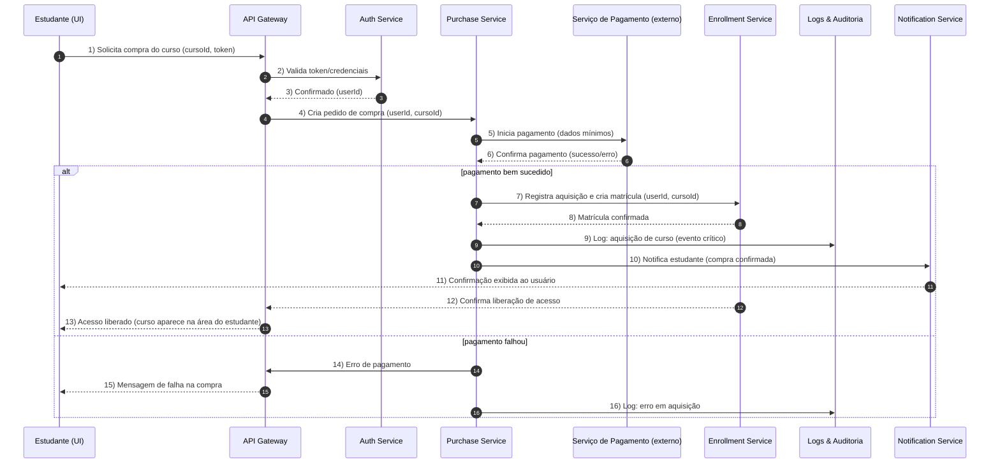

# Relatório Técnico de Arquitetura de Software

## 1. Identificação das HUs
Lista mapeada das Histórias de Usuário (HU) previstas e seus focos principais:
- HU01 — Criar e estruturar um curso: criação/edição de curso, módulos, aulas, upload de vídeo.
- HU02 — Publicar e despublicar curso: controle de visibilidade, políticas de acesso pós-despublicação.
- HU03 — Acompanhar matrículas do curso: painel do instrutor com contagem de matrículas (near‑real‑time).
- HU04 — Acompanhar engajamento por aula: métricas por aula (visualizações, taxa de conclusão).
- HU05 — Cadastrar-se na plataforma: registro de estudante com validação de e‑mail e senha.
- HU06 — Adquirir um curso: compra/registro de aquisição e liberação de acesso imediata.
- HU07 — Assistir aulas e acompanhar progresso: streaming de vídeo, marcar aulas como concluídas, progresso atualizado.
- HU08 — Receber e baixar o certificado de conclusão: emissão automática e download em PDF.
- HU09 — Acessar meus cursos adquiridos: lista centralizada com progresso e navegação direta às aulas.

Requisitos Funcionais (RF01–RF16) foram atribuídos às HUs acima conforme descrito: por exemplo RF01 → HU01, RF05 → HU02, RF11 → HU08, RF16 → HU05/HU01 (autenticação).

## 2. Diagramas de Arquitetura (Mermaid)

Abaixo há dois diagramas: (A) diagrama de componentes de alto nível; (B) diagrama de sequência completo (fluxo de aquisição e liberação de acesso).

Diagrama A — Componentes de Alto Nível
```mermaid
graph LR
  subgraph Cliente
    WebApp[Web / Mobile App]
  end

  subgraph Plataforma
    APIGateway[API Gateway]
    AuthService[Serviço de Autenticação & Sessão]
    UserService[Serviço de Usuário / Perfil]
    CourseService[Serviço de Gestão de Cursos]
    MediaService[Serviço de Media: Upload & Processamento]
    Storage[Object Storage (externo)]
    StreamingSvc[Serviço de Streaming / CDN]
    PurchaseService[Serviço de Aquisições]
    EnrollmentService[Serviço de Matrícula / Controle de Acesso]
    ProgressSvc[Serviço de Progresso]
    CertificateSvc[Serviço de Emissão de Certificados]
    AnalyticsSvc[Serviço de Métricas / Agregação]
    NotificationSvc[Serviço de Notificações / Emails]
    LogsAndAudit[Logs & Auditoria]
    MessageBus[Message Bus / Event System]
  end

  WebApp -->|HTTP/HTTPS API| APIGateway
  APIGateway --> AuthService
  APIGateway --> CourseService
  APIGateway --> MediaService
  APIGateway --> PurchaseService
  APIGateway --> EnrollmentService
  APIGateway --> ProgressSvc
  APIGateway --> CertificateSvc
  CourseService --> Storage
  MediaService --> Storage
  MediaService -->|event: video_uploaded| MessageBus
  MessageBus --> MediaService
  MessageBus --> AnalyticsSvc
  PurchaseService --> EnrollmentService
  PurchaseService --> LogsAndAudit
  EnrollmentService --> UserService
  EnrollmentService --> LogsAndAudit
  ProgressSvc --> MessageBus
  ProgressSvc --> LogsAndAudit
  CertificateSvc --> Storage
  AnalyticsSvc --> Storage
  AnalyticsSvc --> APIGateway
  StreamingSvc --- Storage
  StreamingSvc --> WebApp
  NotificationSvc --> WebApp
  NotificationSvc --> LogsAndAudit
```

Diagrama B — Sequência (autonumber) — Aquisição de Curso e Liberação de Acesso


Observações sobre diagramas:
- Os participantes representam serviços lógicos. Comunicação entre serviços deve ocorrer via APIs internas seguras e filas/eventos para operações assíncronas.
- Streaming de vídeos é feito diretamente por um Serviço de Streaming/ CDN que consome objetos do Object Storage; o MediaService cuida apenas do upload/ processamento e registro de metadados.

## 3. Decisões de Arquitetura

Resumo das decisões principais, justificativas e impactos:

1. Arquitetura orientada a serviços (serviços lógicos separados por responsabilidade)
   - Motivação: clareza de responsabilidades, escalabilidade independente (vídeo, compra, analytics).
   - Impacto: necessidade de orquestração de comunicação e definição de contratos de API.

2. Separação de Media e Object Storage externo
   - Motivação: RNF04 exige armazenamento desacoplado para vídeos; RNF03 exige streaming.
   - Implementação conceitual: MediaService (upload + processamento/validações) grava objetos no Object Storage e publica eventos de processamento.

3. Streaming via serviço dedicado / CDN
   - Motivação: entrega por streaming (RNF03) e necessidades de performance (RNF06).
   - Impacto: MediaService deverá produzir arquivos/pacotes compatíveis com streaming; controle de acesso em fronteira (tokenized URLs ou autorização na camada de streaming).

4. Controle de acesso por matrícula com consistência forte
   - Motivação: RNF01 e regras de negócio (estudante só acessa após aquisição; aquisição imediata - HU06).
   - Decisão: operações de compra registram matrícula com confirmação síncrona; leitura de autorização para reprodução de vídeo deve consultar EnrollmentService (ou cache com invalidação forte).

5. Autenticação e armazenamento seguro de senhas
   - Motivação: RNF02 e RF06.
   - Decisão: usar hash seguro (ex.: bcrypt ou equivalente conforme RNF02); sessões tokenizadas, com expiração e renovação.

6. Eventos e Message Bus para consistência eventual e trabalho assíncrono
   - Motivação: atualizar métricas (HU03/HU04) e emitir certificados (HU08) sem bloquear fluxo principal.
   - Decisão: eventos para video_upload, aula_concluida, compra_confirmada, certificado_emitido; Analytics e CertificateSvc processam assincronamente.

7. Certificado gerado por serviço dedicado
   - Motivação: HU08 exige PDF com campos específicos.
   - Decisão: CertificateSvc gera PDF quando recebe evento "curso_concluido_por_user", armazena no Storage e expõe download seguro.

8. Logs e auditoria centralizados para eventos críticos
   - Motivação: RNF09 (registro obrigatório de aquisições, emissão de certificado, erro de upload).
   - Decisão: cada serviço publica eventos críticos ao LogsAndAudit com metadados.

9. Métricas com janela near‑real‑time
   - Motivação: HU03 critério: atualizados em tempo real ou com defasagem máxima 1 hora; RNF06 painel em <=3s.
   - Decisão: pipeline de agregação que processa eventos em tempo real e materializa vistas consultáveis; dashboards read‑optimized.

10. Requisitos de usabilidade e compatibilidade
    - Motivação: RNF05 e RNF08.
    - Decisão: API e UI devem ser responsivas; as APIs pensadas para suportar clientes web/mobile modernos.

Trade-offs:
- Consistência imediata para matrículas vs. eventual para métricas. Garantir que autorização de conteúdo seja imediata é prioritário.
- Processamento de vídeo assíncrono pode causar latência na disponibilidade do vídeo para streaming — precisa de comunicação clara ao instrutor.

## 4. Tabela de Componentes e Rastreabilidade

| Componente | Responsabilidade Principal | Comunica-se com | Origem (HU / Critério de Aceite) |
|------------|---------------------------|------------------|----------------------------------|
| API Gateway | Centralizar entrada HTTP/HTTPS, roteamento e autenticação básica | Auth Service, Course Service, Purchase Service, Enrollment Service, Media Service, Progress Service, Certificate Service | RF16; HU05, HU06 |
| Auth Service | Gerenciar autenticação, sessão, hashing de senhas e verificação de credenciais | User Service, API Gateway | RF06, RNF02; HU05 |
| User Service | CRUD de usuários (estudante, instrutor), perfis e validações | Auth Service, Enrollment Service | RF06; HU05 |
| Course Service | CRUD de cursos/módulos/aulas, estado de publicação | Media Service, Storage, API Gateway, Analytics Service | RF01, RF02, RF04, RF05; HU01, HU02 |
| Media Service | Uploads de vídeo, validação inicial e envio a processamento/transcodificação; grava metadados | Object Storage, Message Bus, Course Service | RF03, RNF04, RNF03; HU01 |
| Object Storage (abstração) | Armazenar arquivos de vídeo, thumbnails e PDFs (externo ao app) | Media Service, Streaming Service, Certificate Service | RNF04; HU01, HU08 |
| Streaming Service | Entregar video por streaming ao cliente com controles (play/pause/velocidade) | Object Storage, API Gateway, WebApp | RNF03, RNF10; HU07 |
| Purchase Service | Orquestrar fluxo de compra e integração com serviço de pagamento externo | API Gateway, Payment Provider (externo), Enrollment Service, Logs | RF07, RF08; HU06 |
| Enrollment Service | Gerenciar matrículas, permissões de acesso a conteúdo | Purchase Service, User Service, Course Service, Auth Service | RF08, HU06 |
| Progress Service | Registrar conclusão de aulas, calcular progresso por curso | API Gateway, Message Bus, Enrollment Service, Logs | RF09, RF10, RNF07; HU07 |
| Certificate Service | Gerar e disponibilizar certificados (PDF) quando curso é concluído | Progress Service, Object Storage, Notification Service, Logs | RF11, RF15; HU08 |
| Analytics Service | Agregar eventos para métricas de engajamento; fornecer dados ao painel do instrutor | Message Bus, API Gateway, Storage (materialized views) | RF13, RF14, RNF06; HU03, HU04 |
| Notification Service | Enviar notificações e e‑mails (compra, certificado, erros) | API Gateway, Purchase Service, Certificate Service | HU06, HU08 |
| Message Bus | Transporte de eventos assíncronos (video_uploaded, aula_concluida, compra_confirmada, certificado_emitido, erro_upload) | Media Service, Progress Service, Analytics Service, Certificate Service | RNF09; HU03, HU04, HU08 |
| Logs & Audit | Repositório de logs/evidências de eventos críticos | Todos os serviços | RNF09; RF07, RF11, RF03 |
| Serviço de Pagamento (externo) | Fornecer autorização/confirmacao de pagamento | Purchase Service | HU06 (critério: liberação imediata) |

Observações: "Object Storage" é modelado como componente externalizado; sua interface é a API de objetos (put/get/list) acessível ao MediaService, StreamingService e CertificateService.

## 5. Bloqueios e Pendências

Itens pendentes que impactam implementação e devem ser resolvidos antes de desenvolvimento detalhado:

1. Especificação do Processo de Pagamento
   - Pendência: escolha do modelo de integração (redirecionamento, API direta, webhook) e requisitos de segurança/PCI.
   - Impacto: define comportamento síncrono/assíncrono de PurchaseService e fluxos de retry.
   - Recomendação: definir fluxo de pagamento, requisitos de tratamento de chargebacks e testes de integrações.

2. Pipeline de Processamento de Vídeo (transcodificação / formatos / legendas)
   - Pendência: formatos de saída aceitos, suporte a múltiplas bitrates (ABR/HLS/DASH), legendas/closed captions.
   - Impacto: afeta MediaService, Storage, StreamingSvc, e experiência do estudante.
   - Recomendação: definir spec de transcodificação, política de thumbnails, e estratégia de jobs (sync/async).

3. Políticas de Autorização do Streaming
   - Pendência: mecanismo de proteção de conteúdo (URLs temporários, tokens assinados, validação por header).
   - Impacto: segurança do vídeo (RNF01) e integração com StreamingSvc.
   - Recomendação: definir contrato de autorização entre EnrollmentService e StreamingSvc.

4. Modelo e Template do Certificado (visual e campos)
   - Pendência: layout do PDF, elementos obrigatórios e dados dinâmicos.
   - Impacto: CertificateSvc precisa do template para geração.
   - Recomendação: coletar template e requisitos de impressão/assinatura digital se aplicável.

5. Requisitos de Retenção de Logs e Compliance
   - Pendência: período de retenção, requisitos legais de privacidade e exportação de dados.
   - Impacto: infraestrutura de LogsAndAudit e custos de armazenamento.
   - Recomendação: definir política de retenção e acesso a logs.

6. Requisitos de SLA e Escalonamento para Uploads/Transcodificação
   - Pendência: limites de tempo aceitáveis para processamento de vídeo e políticas de retry.
   - Impacto: UX do instrutor e necessidade de monitoramento/alerta.
   - Recomendação: definir SLOs e estratégias de retry/circuit breaking.

7. Autenticação Multifatorial / Verificação de e‑mail
   - Pendência: necessidade de MFA e fluxo de verificação de e‑mail não especificado.
   - Impacto: segurança de contas (RNF02) e fluxo de cadastro (HU05).
   - Recomendação: definir obrigatoriedades e fluxos opcionais.

8. Requisitos de Localização / Internacionalização
   - Pendência: idiomas suportados, formatos de data/numero.
   - Impacto: UI e templates de certificados.
   - Recomendação: definir escopo de I18n.

9. Volume esperado e estimativas de carga
   - Pendência: estimativas de usuários, uploads por dia, horas pico.
   - Impacto: dimensionamento e estratégias de scaling.
   - Recomendação: obter previsões de uso para definir capacidade.

## 6. Cobertura de Requisitos

Mapeamento resumido de cobertura (como o projeto endereça cada requisito):

Requisitos Funcionais
- RF01 (criar curso): Coberto — Course Service + MediaService para capa (HU01).
- RF02 (módulos/aulas): Coberto — Course Service.
- RF03 (upload vídeo): Coberto — MediaService -> Storage; logs de erro (RNF09).
- RF04 (editar/remover): Coberto — Course Service endpoints.
- RF05 (publicar/despublicar): Coberto — Course Service com flags de visibilidade e regras de acesso (HU02).
- RF06 (cadastro): Coberto — User Service + Auth Service (HU05).
- RF07 (adquirir curso): Coberto — Purchase Service + Payment external + EnrollmentService (HU06).
- RF08 (liberação pós-aquisição): Coberto — EnrollmentService garante autorização imediata.
- RF09 (registrar conclusão de aula): Coberto — ProgressService.
- RF10 (controle de progresso): Coberto — ProgressService + EnrollmentService; cálculo percentual por curso.
- RF11 (emitir certificado): Coberto — CertificateService acionado por evento de conclusão.
- RF12 (exibir progresso): Coberto — API + ProgressService; UI exibe percentual (HU07/HU09).
- RF13 (painel de matrículas): Coberto — AnalyticsService agregando matriculas; materialized views.
- RF14 (métricas de engajamento): Coberto — AnalyticsService processando eventos (visualizações, conclusão).
- RF15 (download certificado): Coberto — CertificateService + Storage com endpoint seguro.
- RF16 (login/logout): Coberto — Auth Service.

Requisitos Não-Funcionais (exemplo de como são atendidos):
- RNF01 (restrição de acesso): Coberto — EnrollmentService + Streaming authorization.
- RNF02 (hash seguro): Coberto — Auth Service (hasher seguro conforme RNF02).
- RNF03 (streaming): Coberto — MediaService + StreamingSvc para reprodução por streaming.
- RNF04 (object storage externo): Coberto — Object Storage abstrato.
- RNF05 (responsividade): Atendido em nível de UI — exigência para desenvolvimento frontend.
- RNF06 (painel <=3s): Atendido via materialized views/indices em AnalyticsService (requer tuning).
- RNF07 (salvar progresso automaticamente): Coberto — ProgressService grava à marcação; recomenda SLO de durabilidade.
- RNF08 (navegadores): Atendido no plano de QA (UI responsiva).
- RNF09 (logs eventos críticos): Coberto — LogsAndAudit central.
- RNF10 (controles de acessibilidade no player): Atendido no escopo do StreamingSvc/Player (UI).

Status geral: cobertura arquitetural completa para requisitos funcionais e muitos RNFs; pendências críticas listadas na seção 5 precisam ser resolvidas para implementação operacional.

## 7. Gap Analysis

Identificação de lacunas na especificação, impactos arquiteturais e recomendações:

1. Lacuna: Especificação do processo de pagamento e requisitos de segurança/chargeback
   - Impacto: determina fluxo síncrono vs. assíncrono de PurchaseService, tratamento de falhas e consistência da matrícula.
   - Risco: desbloqueio de acesso indevido ou perda de receita.
   - Recomendação: definir interface do provedor de pagamento, fluxos de notificação (webhooks), e políticas de retry e reversão.

2. Lacuna: Detalhes do pipeline de vídeo (transcodificação, resoluções, legendas)
   - Impacto: afeta MediaService, Storage e StreamingSvc; pode exigir processamento intensivo.
   - Risco: experiência de reprodução inconsistente, incompatibilidade com players.
   - Recomendação: definir formatos de entrega (ex.: HLS/DASH), bitrates mínimos, e requisitos de legendas.

3. Lacuna: Mecanismo de proteção do streaming (tokenization, signed URLs, headers)
   - Impacto: segurança de conteúdo (direito de acesso pós-aquisição).
   - Risco: vazamento de conteúdo.
   - Recomendação: escolher e documentar o método de autorização do streaming e integração com EnrollmentService.

4. Lacuna: Especificação do template do certificado (assinatura, validade)
   - Impacto: CertificateService não pode gerar PDFs formalmente sem template.
   - Risco: necessidade de retrabalho visual/legal.
   - Recomendação: definir layout e possíveis requisitos de assinatura digital.

5. Lacuna: Políticas de retenção e privacidade de dados
   - Impacto: Logs, backups, e conformidade legal.
   - Risco: não conformidade e exposição de dados pessoais.
   - Recomendação: definir política de retenção, acesso e anonimização.

6. Lacuna: Requisitos para visualizações e cálculos de métricas (ex.: janela temporal, agregações)
   - Impacto: modelagem de dados do AnalyticsService.
   - Risco: métricas errôneas ou performance degradada.
   - Recomendação: especificar KPIs, janelas de atualização, e tolerância a latência (≤1h já citado).

7. Lacuna: Concurrency e operações de reordenação de módulos/aulas
   - Impacto: possibilidade de conflitos de edição simultânea por instrutores.
   - Risco: perda de alterações e experiência ruim.
   - Recomendação: definir estratégias de lock/ot/controle de versão para edição colaborativa ou single-writer.

8. Lacuna: Requisitos de internacionalização e formatos
   - Impacto: certificados, UI, datas.
   - Recomendação: definir escopo de idiomas e formatos regionais.

9. Lacuna: Testes de carga e dimensionamento (número de usuários simultâneos; throughput de streaming)
   - Impacto: dimensionamento da infra e custos.
   - Recomendação: obter estimativas de tráfego e definir SLOs para cada serviço.

10. Lacuna: Políticas de segurança adicionais (MFA, políticas de senha além do mínimo)
    - Impacto: segurança operacional.
    - Recomendação: definir política de senhas (expiração, força), necessidade de MFA e verificação de e‑mail obrigatória.

Ações recomendadas prioritárias:
- Priorizar especificação do fluxo de pagamento e autorização de streaming.
- Definir o pipeline de processamento de vídeo e templates de certificado.
- Especificar SLAs/SLOs para uploads, geração de certificado e painel de métricas.
- Determinar políticas de compliance e retenção de logs.
- Planejar testes de carga com estimativas reais de uso.

---
Fim do Relatório.