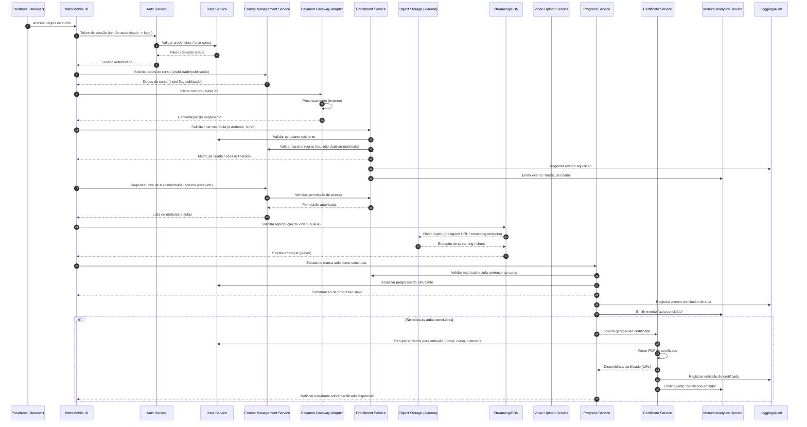

# Relatório Técnico de Arquitetura de Software

## 1. Identificação das HUs

- HU01 — Criar e estruturar um curso  
  Responsabilidade principal: gestão de cursos, módulos e aulas (CRUD), upload inicial de vídeo, organização/ordenamento antes da publicação.

- HU02 — Publicar e despublicar curso  
  Responsabilidade principal: controle de visibilidade/publicação por curso; regras de acesso diferenciadas para estudantes já matriculados.

- HU03 — Acompanhar matrículas do curso  
  Responsabilidade principal: contagem e exposição de total de matrículas por curso (painel do instrutor), atualizada em tempo real ou com defasagem ≤ 1h.

- HU04 — Acompanhar engajamento por aula  
  Responsabilidade principal: coleta e apresentação de métricas por aula (visualizações, taxa de conclusão).

- HU05 — Cadastrar-se na plataforma  
  Responsabilidade principal: registro de usuário (validação de e‑mail único, senha com regra mínima).

- HU06 — Adquirir um curso  
  Responsabilidade principal: fluxo de compra/contratação, criação de matrícula/registro de acesso.

- HU07 — Assistir aulas e acompanhar progresso  
  Responsabilidade principal: reprodução de vídeo via streaming, marcação de aulas como concluídas, atualização imediata do progresso.

- HU08 — Receber e baixar o certificado de conclusão  
  Responsabilidade principal: emissão automática de certificado (PDF) quando todas as aulas concluídas e disponibilização para download.

- HU09 — Acessar meus cursos adquiridos  
  Responsabilidade principal: área do estudante com listagem de cursos adquiridos, capa, título, percentual de progresso e acesso direto às aulas.

Observação: os RF e RNF listados no enunciado são parte integrante deste relatório e foram utilizados para traçar responsabilidades e decisões.

---

## 2. Diagramas de Arquitetura (Mermaid)

Diagrama de sequência (fluxo típico: cadastro/login, aquisição de curso, acesso ao conteúdo, marcação de aula concluída e emissão de certificado):



Diagrama de componentes (visão lógica com fronteiras e integrações externas):

```mermaid
graph LR
    subgraph Frontend
        UI[Web / Mobile UI]
        Player[Video Player (acessibilidade básica)]
    end

    subgraph Backend
        API[API Gateway / Facade]
        Auth[Auth Service]
        User[User Service]
        Course[Course Management Service]
        VideoU[Video Upload & Ingest Service]
        Enrollment[Enrollment Service]
        Progress[Progress & Certificate Service]
        Metrics[Metrics / Analytics Service]
        Logs[Logging & Audit]
        Notification[Notification Service]
    end

    subgraph InfraExternos
        Storage[Object Storage (externo)]
        CDN[Streaming / CDN]
        Payment[Payment Provider (externo)]
    end

    UI -->|REST/GraphQL| API
    Player -->|request stream| CDN
    API --> Auth
    API --> User
    API --> Course
    API --> VideoU
    API --> Enrollment
    API --> Progress
    API --> Metrics
    API --> Notification
    VideoU --> Storage
    CDN --> Storage
    Enrollment --> Payment
    AllLogs[("Eventos críticos\nacquis., cert., upload erros")] --> Logs
    Course --> Storage
    VideoU -->|ingest/transcode| Storage
    Metrics --> Logs
    Progress --> Cert[Certificate Service]
    Progress --> Logs
```

Observações sobre os diagramas:
- Os nomes dos componentes são conceituais (responsabilidades e interfaces). Não há prescrição de produtos/exatos serviços.
- O streaming é realizado via CDN/Streaming externo sobre objetos armazenados em Object Storage; upload de vídeos passa por serviço de ingest que valida e registra metadados.
- Eventos (matrícula, aula concluída, emissão de certificado, erro de upload) são registrados em Logs e enviados a Metrics para relatórios do instrutor.

---

## 3. Decisões de Arquitetura

1. Estilo arquitetural
   - Arquitetura modular orientada a serviços (serviços conceituais isolados: Auth, User, Course, Enrollment, Progress/Certificate, Video Upload, Metrics, Logging). Justificativa: separação de responsabilidades, escalabilidade e independência de implantação das partes mais críticas (upload/streaming, métricas).

2. Segurança e autenticação (RNF01, RNF02)
   - Autenticação centralizada (Auth Service) com tokens de sessão/short-lived tokens para APIs. Senhas devem ser armazenadas com hash seguro (seguir explicitamente RNF02 — ex.: bcrypt indicado no requisito como exemplo). Autorização baseada em checagens por serviço (ex.: Enrollment Service autoriza acesso ao conteúdo).

3. Armazenamento e entrega de vídeo (RNF03, RNF04)
   - Vídeos armazenados em Object Storage externo (desacoplamento do servidor de aplicação). Entrega via Streaming/CDN com endpoints de streaming (presigned URLs ou tokens de acesso temporário). Uploads passam por Video Upload & Ingest Service que valida, registra e envia para Storage; ingest pode disparar transcodificação/geração de thumbnails (transcodificação NÃO especificada nos requisitos — sinalizada em gaps).

4. Consistência e eventos
   - Matrículas (Enrollment) e emissão de certificados: operações transacionais fortes (consistência imediata). Métricas e painéis: modelo eventual-consistente (eventos emitidos por serviços que alimentam o Metrics Service). Para atender RNF06 (painel ≤ 3s), usar cache / pre-aggregação e atualização near‑real-time; defasagem máxima 1h aceita para alguns agregados (HU03).

5. Logs, auditoria e monitoramento (RNF09)
   - Eventos críticos (aquisição, emissão de certificado, erro de upload) devem ser sempre registrados em Logging Service com persistência e retenção definida pelo time de operações. Logs também alimentam Metrics.

6. Geração de certificado
   - Geração automática por Progress/Certificate Service quando a última aula for marcada como concluída (HU08). Documento gerado em PDF armazenado como artefato acessível via URL autenticada.

7. Performance do painel do instrutor (RNF06)
   - Painel alimentado por Metrics Service, com pre-aggregações e cache para atender latências ≤3s. Em caso de cargas maiores, usar camada de caching e índices precomputados.

8. Acessibilidade do player (RNF10)
   - Player expõe controles básicos: play/pause, volume, velocidade. Deve ser parte da camada Frontend (Player) e expor hooks para coleta de visualizações e eventos de playback.

9. Backups e recuperação
   - Objetos essenciais (metadados, logs, certificados) precisam de política de backup e recuperação; definir RTO/RPO (não especificados — veja gaps).

Registro de trade-offs:
- Consistência forte para matrícula vs. eventual para métricas: priorizamos experiência do estudante (liberação de acesso imediata) e performance do painel.

---

## 4. Tabela de Componentes e Rastreabilidade

| Componente | Responsabilidade Principal | Comunica-se com | Origem (HU / Critério de Aceite) |
|---|---|---:|---|
| UI (Web/Mobile) | Interface responsiva para instrutores e estudantes; player com controles de acessibilidade | API Gateway, Player, CDN, Notification | HU01, HU02, HU05, HU07, HU09; RNF05, RNF10 |
| Auth Service | Autenticação e emissão de tokens; gestão de sessões; política de senhas (hash seguro) | User Service, API Gateway | HU05, HU16 (RF16); RNF02, RNF01 |
| User Service | CRUD de usuários (instrutor/estudante), validação e unicidade de e-mail | Auth, Enrollment, Progress, Cert | HU05, HU08; critérios: e-mail único, senha ≥8 |
| Course Management Service | CRUD de cursos, módulos e aulas; status publicado/rascunho; reorder de módulos/aulas | Video Upload, Enrollment, API | HU01, HU02; critérios: título e descrição obrigatórios |
| Video Upload & Ingest Service | Receber uploads, validar arquivos, registrar metadados, enviar para Object Storage | Storage (externo), Course, Logs, Metrics | HU01; RF03; RNF04, RNF09 |
| Object Storage (externo) | Armazenar arquivos de vídeo e PDFs de certificados (externo ao app) | CDN, Video Upload, Certificate Service | RNF04, RNF03 |
| CDN / Streaming Service | Entrega de conteúdo em streaming (chunked), endpoints de reprodução | Storage, UI/Player | RNF03, RNF10 |
| Enrollment Service | Criar/gerenciar matrículas; assegurar acesso somente a adquirentes | Payment, User, Course, Logs | HU06, RF07, RNF01, HU02 critérios (manter acesso após despublicação) |
| Progress & Certificate Service | Registrar marcação de aulas concluídas; calcular progresso; gerar certificados (PDF) | Enrollment, User, Course, Storage, Logs, Metrics | HU07, HU08, RF09, RF10, RF11, RNF07 |
| Payment Adapter (externo) | Integração com provedor de pagamento para processar aquisições | Enrollment, API | HU06; critério: acesso liberado imediatamente após aquisição |
| Metrics / Analytics Service | Agregar métricas (visualizações, taxa de conclusão, matrículas); fornecer API para painel do instrutor | Course, Progress, Enrollment, Logs, UI | HU03, HU04, RNF06 |
| Logging & Audit Service | Persistir eventos críticos: aquisição, emissão de certificado, erros de upload | Todos os serviços | RNF09 |
| Notification Service | Notificações (e-mail/in-app) sobre compra, certificado disponível, etc. | User, Enrollment, Cert | HU06, HU08 |
| API Gateway / Facade | Roteamento, autenticação, rate limiting, pontual de integração | Todos os serviços | RF16, RNF08 |

Observação: "Origem" vincula componente a HU e critérios de aceite extraídos do enunciado para rastreabilidade.

---

## 5. Bloqueios e Pendências

1. Pagamento — especificação ausente
   - Bloqueio: nenhum detalhe sobre fluxo de pagamento (cartão, boleto, wallet), políticas de reembolso, integração com fornecedores ou requisitos de segurança de pagamento (PCI).  
   - Impacto: impede definição precisa do Enrollment Service (transações, rollback, confirmação instantânea) e testes integrados.
   - Recomendação: definir fornecedor/fluxo ou ao menos especificar interface esperada e cenários (autorização vs captura imediata, reembolso).

2. Transcodificação / formatos de vídeo
   - Bloqueio: requisitos não indicam formatos, codecs, resoluções, legendas, bitrate adaptativo ou disponibilidade de múltiplas qualidades (ABR).
   - Impacto: afeta Video Upload Service, Storage e CDN/Streaming; sem definição podemos criar solução genérica, mas não otimizada.
   - Recomendação: definir conjuntos de formatos e necessidade de legendas/closed captions; priorizar suporte a streaming adaptativo.

3. Volume e SLAs de carga
   - Bloqueio: ausência de estimativas de usuários, volume de vídeos, níveis de concorrência e SLAs de disponibilidade.  
   - Impacto: dificulta dimensionamento, caching e políticas de escalabilidade para atender RNF06 (tempo de painel ≤3s).
   - Recomendação: obter estimativas de carga/uso (usuários simultâneos, requisições por segundo, tamanho médio do vídeo).

4. Política de retenção e compliance
   - Bloqueio: sem política de retenção de vídeos, logs e certificados; sem requisitos de conformidade (LGPD/GDPR).
   - Impacto: afeta armazenamento, custos e design de segurança/privacidade.
   - Recomendação: definir retenção mínima, políticas de exclusão e requisitos de consentimento/dados pessoais.

5. Modelo de monetização e regras de acesso adicionais
   - Bloqueio: regras relacionadas a descontos, cupons, gift access, compra em grupo, acesso temporário não especificadas.
   - Impacto: pode alterar Enrollment Service e lógica de autorização de acesso.
   - Recomendação: clarificar casos de compra/renovação e regras de acesso.

6. Template e assinatura visual do certificado
   - Bloqueio: sem especificação do layout/assinatura do certificado (formato exato, assinatura digital).
   - Impacto: implementação da geração de PDF depende de campos fixos e design.
   - Recomendação: fornecer template e requisitos de segurança (ex.: assinatura digital/verificação).

7. Políticas de remoção / despublicação
   - Bloqueio: sem regras sobre efeitos de despublicação em novos usuários, acesso retroativo, e conteúdos dependentes.
   - Impacto: afeta Course Management e Enrollment (HU02 já indica que alunos matriculados mantêm acesso; confirmar comportamentos de instrutor/integridade de conteúdos).
   - Recomendação: formalizar políticas de despublicação e edge-cases.

---

## 6. Cobertura de Requisitos

Mapeamento resumido (RF / RNF → componentes principais cobrindo o requisito):

- RF01 (Criar curso): Course Management, Auth, UI — Coberto.
- RF02 (Organizar módulos/aulas): Course Management, UI — Coberto.
- RF03 (Upload de vídeo): Video Upload & Ingest Service, Storage — Coberto; gap: transcodificação/formats não especificados (ver seção 7).
- RF04 (Editar/remover): Course Management — Coberto.
- RF05 (Publicar/despublicar): Course Management, Enrollment (regras) — Coberto (incluir regra: alunos já adquiridos mantêm acesso).
- RF06 (Cadastro): User Service, Auth, UI — Coberto.
- RF07 (Adquirir curso): Payment Adapter, Enrollment, Logs — Parcialmente coberto (falta especificação de fluxo de pagamento).
- RF08 (Acesso somente após aquisição): Enrollment, Auth, Course, CDN — Coberto (Controle de autorização no Enrollment).
- RF09 (Registrar conclusão de aula): Progress Service, Logs — Coberto.
- RF10 (Controlar progresso): Progress Service, User Service — Coberto.
- RF11 (Emitir certificado): Certificate Service (parte do Progress), Storage — Coberto (requer template).
- RF12 (Exibir percentual progresso): Progress Service, UI — Coberto.
- RF13 (Painel de número total de matrículas): Metrics Service, Enrollment — Coberto.
- RF14 (Métricas de engajamento por aula): Metrics Service, Progress, Logs — Coberto.
- RF15 (Download do certificado): Certificate Service, Storage, UI — Coberto.
- RF16 (Login/logout): Auth Service, UI — Coberto.

Mapeamento RNF:
- RNF01 (Restrição de acesso): Auth, Enrollment — Coberto.
- RNF02 (Hash de senhas): Auth, User — Coberto (seguindo exemplo do requisito).
- RNF03 (Streaming): CDN, Storage, Player — Coberto.
- RNF04 (Object Storage): Video Upload, Storage abstraído — Coberto.
- RNF05 (Responsividade): UI — Coberto (requer validação de design).
- RNF06 (Painel ≤ 3s): Metrics Service + cache/pre-aggregation — Parcialmente coberto; depende de SLAs e dimensionamento (ver gaps).
- RNF07 (Salvar progresso sem risco de perda): Progress Service com confirmação síncrona e logs — Coberto (recomendado mecanismo de retry/ack).
- RNF08 (Compatibilidade navegadores): UI — Coberto (requer testes).
- RNF09 (Logs de eventos críticos): Logging & Audit Service — Coberto.
- RNF10 (Acessibilidade do player): Player (frontend) — Coberto.

Observação: “Coberto” significa que há um componente responsável; algumas coberturas dependem de escolhas não especificadas (pagamento, transcodificação, SLAs).

---

## 7. Gap Analysis

1. Gap: Especificação de meio de pagamento e fluxo transacional  
   - Impacto arquitetural: define modelos de rollback, garantia de liberação imediata do acesso, reembolso e idempotência.  
   - Risco: implementação incorreta do Enrollment pode permitir duplicidade de matrículas ou falha na liberação imediata.  
   - Ação recomendada: especificar provedor/fluxo (autorização/captura), cenários de falha e política de reembolso; padronizar interface de Payment Adapter. Prioridade: Alta.

2. Gap: Requisitos de vídeo (formatos, bitrate, legendas, transcodificação, DRM)  
   - Impacto: Video Upload Service e Storage precisam de requisitos claros para dimensionamento, pipeline de ingest e processamento (transcoding/thumbnail); afeta custo e UX de streaming.  
   - Risco: suporte insuficiente a dispositivos; incompatibilidades no player.  
   - Ação: definir formatos suportados, necessidade de legendas, ABR (adaptive bitrate) e se há exigência de proteção (DRM). Prioridade: Alta.

3. Gap: Volume esperado, taxa de acesso e SLAs operacionais (RTO/RPO)  
   - Impacto: dimensionamento de serviços, caching, políticas de escalonamento e custo. RNF06 (painel ≤3s) depende de capacidade de infra.  
   - Ação: coletar estimativas de carga (usuários ativos diários, vídeos, acessos simultâneos) e definir SLAs. Prioridade: Alta.

4. Gap: Políticas de retenção, backup, privacidade e conformidade (LGPD/GDPR)  
   - Impacto: armazenamento de dados pessoais, logs, e objetos (vídeos, certificados).  
   - Ação: definir tempo de retenção, políticas de exclusão e requisitos legais de proteção/consentimento. Prioridade: Média/Alta.

5. Gap: Template e verificação do certificado (assinatura, validade)  
   - Impacto: geração e validação do PDF, possibilidade de fraude.  
   - Ação: definir template, metadados obrigatórios e se haverá assinatura/verificação digital. Prioridade: Média.

6. Gap: Regras de negócios para despublicação e efeitos colaterais  
   - Impacto: integridade de acesso de usuários existentes e visibilidade pública. HU02 traz critério parcial (manter acesso aos já adquiridos), mas pontos como prazos e exceções não especificados.  
   - Ação: formalizar comportamento em despublicação (quando instrutor edita conteúdo, remove aulas, etc.). Prioridade: Média.

7. Gap: Logs e monitoring — níveis, retenção, alertas e SLAs de logs  
   - Impacto: compliance e detecção de falhas (erros de upload, emissão de certificados).  
   - Ação: definir níveis de logs, política de retenção e alertas (ex.: erro de upload > X em Y minutos). Prioridade: Média.

8. Gap: Acessibilidade ampliada e internacionalização  
   - Impacto: público alvo e conformidade com padrões de acessibilidade. RNF10 exige controles básicos; porém requerimentos não cobrem legendas ou leitura de tela.  
   - Ação: definir nível de acessibilidade exigido (WCAG) e necessidade de legendas/CC. Prioridade: Baixa/Média.

9. Gap: Possíveis casos de fraude / proteção de conteúdo (ex.: impedir compartilhamento de credenciais)  
   - Impacto: segurança de conteúdo; RNF01 cobre restrição por aquisição mas não previne compartilhamento de sessão.  
   - Ação: definir políticas de sessões concorrentes, limites por conta e detecção de anomalias. Prioridade: Média.

10. Gap: Mecanismo de testes e dados para métricas e painéis  
    - Impacto: validação do RNF06 (painel ≤3s) e HU03/HU04.  
    - Ação: criar benchmarks e definir SLAs de atualização, mecanismos de pre-aggregation. Prioridade: Média.

Resumo de ações prioritárias:
- Definir fluxo de pagamentos e interface (Alta).
- Especificar pipeline de vídeo (formatos, transcodificação, legendas) (Alta).
- Fornecer estimativas de carga e SLAs operacionais (Alta).
- Definir políticas de retenção/compliance (Alta).

---

Fim do Relatório.