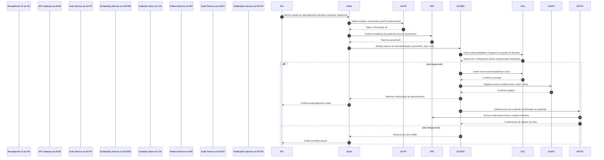

# Relatório Técnico de Arquitetura de Software

## 1. Identificação das HUs

Resumo das Histórias de Usuário (HU) recebidas e relação direta com requisitos funcionais (RF) e critérios de aceite mais relevantes.

- HU01 — Visualizar agenda unificada dos dentistas  
  - RF relevantes: RF03, RF04, RF06, RF07, RNF06, RNF09  
  - Critérios de aceite: visão diária/semana; distinção visual por dentista; filtros.

- HU02 — Agendar, cancelar e remarcar consulta  
  - RF relevantes: RF03, RF04, RF05, RF06, RF07, RF08  
  - Critérios de aceite: apenas horários válidos; bloqueio de sobreposições; envio de e-mail.

- HU03 — Registrar pagamento de cobrança  
  - RF relevantes: RF20, RF21, RF22  
  - Critérios de aceite: pagamento total/parcelado; identificação de cobranças em aberto; atualização imediata.

- HU04 — Registrar procedimento no prontuário  
  - RF relevantes: RF09, RF10, RF13, RNF05, RNF02  
  - Critérios de aceite: data/descrição/observações; rastreabilidade; histórico ordenado.

- HU05 — Anexar radiografias e documentos clínicos ao prontuário  
  - RF relevantes: RF11, RF12, RNF03, RNF07  
  - Critérios de aceite: formatos (JPEG/PNG/PDF); metadados; controle de acesso.

- HU06 — Consultar prontuário completo do paciente  
  - RF relevantes: RF09, RF10, RF11, RF12, RNF02, RNF03  
  - Critérios de aceite: abas organizadas; busca por nome/CPF; restrição de acesso.

- HU07 — Gerar cobrança após atendimento  
  - RF relevantes: RF18, RF19, RF20  
  - Critérios de aceite: seleção de procedimentos; aplicação de tabela de convênio; disponibilidade para recepção.

- HU08 — Gerenciar dentistas e suas grades de horário  
  - RF relevantes: RF03, RF07, RF05  
  - Critérios de aceite: definir dias/horários; alterações afetam apenas futuros agendamentos.

- HU09 — Gerenciar materiais e receber alertas de estoque baixo  
  - RF relevantes: RF14, RF15, RF16, RF17  
  - Critérios de aceite: alerta destacado; reposição a partir do alerta.

- HU10 — Consultar relatório de faturamento  
  - RF relevantes: RF22, RF18, RF19  
  - Critérios de aceite: filtros; totais agrupados; export CSV/PDF.

- HU11 — Acessar agendamentos pelo portal  
  - RF relevantes: RF23, RF24  
  - Critérios de aceite: autenticação; exibir data/hora/dentista; histórico.

- HU12 — Acessar e baixar documentos clínicos pelo portal  
  - RF relevantes: RF23, RF25, RF11, RNF03  
  - Critérios de aceite: visibilidade controlada; downloads por documento; restrição às anotações internas.

Observação: cada HU acima está vinculada explicitamente aos RFs citados e aos critérios de aceite do enunciado.

---

## 2. Diagramas de Arquitetura (Mermaid)

Abaixo há dois diagramas em Mermaid: um diagrama de componentes (visão estática dos módulos e interfaces) e um diagrama de sequência detalhando o fluxo de agendamento (HU02) com autonumber.

```mermaid
graph LR
  subgraph Frontend
    RP[Recepção UI]
    DU[Dentista UI]
    PU[Portal Paciente]
    AU[Admin UI]
  end

  subgraph API
    AGW[API Gateway / Facade]
    AUTH[Auth Service (RBAC & Sessões)]
    SCHED[Scheduling Service]
    CAL[Calendar Store]
    PAT[Patient Service]
    PRONTO[Prontuário Service]
    DOC[Document Storage (external)]
    INV[Inventory Service]
    BILL[Billing Service]
    NOTIF[Notification Service]
    REPORT[Reporting Service]
    AUDIT[Audit / Imutável]
    BACKUP[Backup & Retenção]
  end

  RP --> AGW
  DU --> AGW
  PU --> AGW
  AU --> AGW

  AGW --> AUTH
  AGW --> SCHED
  AGW --> PAT
  AGW --> PRONTO
  AGW --> INV
  AGW --> BILL
  AGW --> REPORT

  SCHED --> CAL
  SCHED --> PAT
  SCHED --> AUTH
  SCHED --> NOTIF
  SCHED --> AUDIT

  PRONTO --> DOC
  PRONTO --> AUDIT
  PRONTO --> AUTH
  PRONTO --> PAT

  BILL --> PAT
  BILL --> SCHED
  BILL --> AUDIT
  BILL --> REPORT
  BILL --> NOTIF

  INV --> AUDIT
  INV --> NOTIF

  NOTIF --> PAT
  NOTIF --> AUDIT

  BACKUP -.-> CAL
  BACKUP -.-> PAT
  BACKUP -.-> PRONTO
  BACKUP -.-> BILL
  BACKUP -.-> INV
  BACKUP -.-> DOC

  DOC -. external object storage .-> BACKUP
```

Sequence diagram (fluxo de agendamento: HU02 — recepcionista agenda uma consulta; inclui verificação de conflito, reserva e notificação por e-mail):



Notas sobre diagramas:
- Componentes representam responsabilidades lógicas (serviços e repositórios).
- Document Storage está explicitamente modelado como serviço de armazenamento externo desacoplado do servidor de aplicação (RNF07).
- Audit Service é projetado como log imutável (RNF05).

---

## 3. Decisões de Arquitetura

Lista de decisões arquiteturais principais, com motivação e impactos.

1. Separação por domínios funcionais (serviços lógicos):
   - Responsabilidade: organizar Scheduling, Prontuário, Billing, Inventory, Notification, Reporting, Auth, Audit.
   - Motivação: clareza de responsabilidades, isolamento de regras clínicas, requisitos de segurança e compliance.
   - Impacto: facilita escalabilidade e implantação independente; exige definição clara de interfaces e contratos.

2. Contrato API unificado (API Gateway / Facade):
   - Responsabilidade: consolidar autenticação, autorização, roteamento e validação básica.
   - Motivação: reduzir acoplamento UI <-> serviços e centralizar políticas de segurança e rate-limiting.
   - Impacto: ponto único de entrada; requer alta disponibilidade.

3. Armazenamento de documentos em object storage externo (desacoplado):
   - Responsabilidade: armazenar radiografias e documentos clínicos fora do datastore primário.
   - Motivação: RNF07 exige external storage; melhora escalabilidade e separação de backups.
   - Impacto: necessidade de controle de acesso granular e links expirados; dependência de serviço externo abstraído via interface.

4. Controle de acesso RBAC e sessão com timeout de 30 minutos:
   - Responsabilidade: autenticação e autorização por perfis (admin, recepcionista, dentista, paciente).
   - Motivação: RNF01, RNF04, RNF03 (LGPD).
   - Impacto: implementação de políticas de sessão, gerenciamento de revogação e logs de auditoria.

5. Imutabilidade de logs de alteração de prontuário:
   - Responsabilidade: Audit Service grava eventos append-only com usuário/data/hora/ação.
   - Motivação: RNF05 garantia de rastreabilidade.
   - Impacto: políticas de retenção e acesso a esses logs; definir como exibir correções (versões do registro).

6. Consistência e concorrência para agendamentos:
   - Responsabilidade: Scheduling Service garante atomicidade na reserva de slot.
   - Motivação: evitar sobreposição (RF06/HU02).
   - Abordagem: lock curto ou transação de reserva; rejeitar concorrência com mensagem clara.  
   - Impacto: necessidade de estratégia para alta concorrência e fallback (ex.: retry, filas).

7. Política de dados sensíveis e conformidade:
   - Responsabilidade: criptografia em trânsito e em repouso, controle de acesso a documentos clínicos, consentimento do paciente.
   - Motivação: RNF02, RNF03 (LGPD e normas do Conselho).
   - Impacto: definir processos legais e técnicos para anonimização, exportação e exclusão.

8. Disponibilidade e performance:
   - Responsabilidade: projetar redundância para componentes críticos (API Gateway, Scheduling, Calendar Store) para atender RNF06 (3s) e RNF08 (99,5% uptime).
   - Motivação: garantir experiência de recepção (agenda unificada) e operação clínica.
   - Impacto: dimensionamento, caching de visões unificadas com controle de validade.

9. Backup e retenção:
   - Responsabilidade: backups automáticos diários com retenção mínima de 30 dias.
   - Motivação: RNF11.
   - Impacto: definir políticas de restauração, testes de DR (recuperação).

Observação: todas as decisões se referem a responsabilidades e estratégias; não foram prescrito produtos ou fabricantes.

---

## 4. Tabela de Componentes e Rastreabilidade

| Componente | Responsabilidade Principal | Comunica-se com | Origem (HU / Critério de Aceite) |
|---|---:|---|---|
| Recepção UI | Interface para recepcionistas: agendamento, cancelamento, remarcação, registro de pagamentos | API Gateway | HU01, HU02, HU03 (critérios de aceite: filtros, bloqueio de sobreposição, atualização imediata) |
| Dentista UI | Interface clínica: acessar/editar prontuário, upload de documentos, gerar cobranças | API Gateway | HU04, HU05, HU06, HU07 (critérios: registro com data/hora/dentista; upload formatos) |
| Portal Paciente (UI) | Portal web para pacientes: visualizar agendamentos, histórico, download de documentos | API Gateway | HU11, HU12 (autenticação, acesso controlado a documentos) |
| Admin UI | Painel do administrador: cadastrar dentistas, grades, painel de estoque, relatórios | API Gateway | HU08, HU09, HU10 (grade de horários, alertas de estoque, relatórios) |
| API Gateway / Facade | Centraliza APIs, roteia requisições, aplica autenticação/autorização | Auth, Scheduling, Prontuário, Billing, Inventory, Reporting | Todas as HUs (ponto de entrada) |
| Auth Service (RBAC & Sessões) | Gerencia autenticação, perfis, sessões e validação de permissões; 30min timeout | API Gateway, todos serviços que requerem autorização | RNF01, RNF04; HU11 (autenticação paciente) |
| Scheduling Service | Regras de agendamento, verificação de grade, bloqueio de sobreposição e reserva atômica | Calendar Store, Patient Service, Auth, Notification, Audit | HU01, HU02, HU08 (bloqueio de sobreposição, grade) |
| Calendar Store | Persistência de agendas individuais de dentista com índices por período | Scheduling Service, Reporting | RF03, RNF06 (tempo de resposta) |
| Patient Service | Cadastro/consulta de pacientes e metadados (nome, CPF, vínculo dentista) | Prontuário, Scheduling, Billing, Auth | RF01, RF24, HU06 |
| Prontuário Service | CRUD de entradas clínicas, histórico de procedimentos, associação arquivo-meta | Document Storage, Audit, Auth | RF09, RF10, RF12, RNF05 |
| Document Storage (object storage externo) | Armazenamento de arquivos clínicos (imagens, PDFs) com controle de acessos/links | Prontuário Service, Portal Paciente, Backup | RF11, RNF07, HU05, HU12 |
| Audit Service (imutável) | Registro append-only de alterações importantes com usuário/data/hora | Todos serviços que alteram dados clínicos/financeiros | RNF05, RF13, HU04 |
| Inventory Service | Cadastro e controle de materiais, entradas/saídas, alertas de estoque baixo | Audit, Notification, Admin UI | RF14, RF15, RF16, RF17, HU09 |
| Billing Service | Cadastro de procedimentos, convênios, geração de cobranças e controle de pagamentos | Patient Service, Scheduling, Reporting, Notification | RF18, RF19, RF20, RF21, HF07, HU03 |
| Notification Service | Envio de e-mails/alertas (confirmação/cancelamento/remarcação) e registro de disparos | Scheduling, Billing, Inventory, Patient Service | RF08, HU02, HU03, HU05 |
| Reporting Service | Geração de relatórios (faturamento por período/dentista/modalidade) e export (CSV/PDF) | Billing, Calendar Store, Patient Service | RF22, HU10 |
| Backup & Retention Service | Orquestra backups diários, retenção mínima e políticas de restauração | All persistent stores, Document Storage | RNF11 |
| Monitoring & Health | Coleta de métricas, alertas de disponibilidade/uptime | API Gateway, all services | RNF08, RNF06 |

---

## 5. Bloqueios e Pendências

Itens que precisam de decisão ou informação adicional antes da implementação detalhada:

1. Definição dos limites não-funcionais detalhados:
   - Carga esperada (número de usuários concorrentes, picos diários) para dimensionar Calendar Store e caches.
   - Tempo máximo aceitável para operações assíncronas (e.g., envio de e-mail).
2. Especificação da política de retenção de documentos clínicos e logs:
   - Períodos legais exigidos, requisitos de descarte seguro, versionamento.
3. Requisitos legais e de compliance mais detalhados:
   - Requisitos específicos do Conselho Federal de Odontologia (procedimentos mínimos de rastreabilidade, formatos exigidos).
4. Definição de formatos e integração com tabelas de convênios:
   - Estrutura e atualizações das tabelas de convênio (import/export), regras de precificação.
5. Regras exatas para "dentistas vinculados ao paciente":
   - Critérios para vínculo (ex.: dentista que atendeu o paciente em X período, ou vínculo explícito).
6. Política de tamanhos máximos e limites de tipos de arquivos para upload (radiografias, DICOM?, tamanho máximo por arquivo).
7. SLA para notificações (retries, dead-letter) e provedor/abstração de envio de e-mail/SMS.
8. Estratégia de alta disponibilidade e DR (failover automático, RTO/RPO desejados além do 99,5%).
9. Processo de migração de dados legado (se houver): mapeamento de campos, limpeza e anonimização.
10. Definição de formato dos logs de auditoria (schema) e mecanismo de armazenamento imutável (detalhes de verificação de integridade).

Cada pendência pode impactar escolhas de projeto (ex.: dimensionamento, mecanismo de lock para agendamentos, níveis de criptografia e key management).

---

## 6. Cobertura de Requisitos

Visão de alto nível de quais componentes cobrem cada requisito funcional e não funcional, e métricas de verificação sugeridas.

- RF01 / RF02 (Gestão de usuários e acesso): Auth Service, API Gateway, Patient Service  
  - Verificação: testes de permissão por perfil; sessão expirations após 30 min (RNF01).

- RF03 / RF04 / RF05 / RF06 / RF07 (Agenda): Scheduling Service, Calendar Store, Admin UI, Recepção UI  
  - Verificação: teste de concorrência para sobreposição; performance da visão unificada < 3s (RNF06); filtros por dentista (HU01).

- RF08 (Notificações por e-mail): Notification Service conectado a Patient Service e Scheduling Service  
  - Verificação: envio automático em confirmação/cancelamento/remarcação; logs de entrega.

- RF09 / RF10 / RF11 / RF12 / RF13 (Prontuário): Prontuário Service, Document Storage, Audit Service, Dentista UI  
  - Verificação: entradas com data/hora/dentista; upload aceitando JPEG/PNG/PDF; logs imutáveis (RNF05); acesso restrito (RNF03).

- RF14 / RF15 / RF16 / RF17 (Materiais): Inventory Service, Admin UI, Notification Service, Audit Service  
  - Verificação: cadastro e movimentação de estoque; alertas quando <= quantidade mínima.

- RF18 / RF19 / RF20 / RF21 / RF22 (Faturamento): Billing Service, Reporting Service, Patient Service, Scheduling Service  
  - Verificação: geração de cobrança por atendimento; aplicação de tabela de convênio; registro de pagamentos; relatórios exportáveis.

- RF23 / RF24 / RF25 (Portal do Paciente): Portal Paciente, Auth Service, Patient Service, Prontuário Service, Document Storage  
  - Verificação: autenticação; mostrar agendamentos futuros e histórico; downloads permitidos apenas para documentos liberados.

- RNF01 a RNF11 (Não Funcionais):
  - RNF01 (sessões): Auth Service — política de expiração 30 min.
  - RNF02, RNF03 (LGPD e controle de acesso): Auth Service + Prontuário + Document Storage + Audit Service — restrições de acesso por vínculo.
  - RNF04 (hash de senhas): Auth Service — armazenamento seguro de credenciais.
  - RNF05 (rastreabilidade): Audit Service — registros imutáveis com usuário/data/hora.
  - RNF06 (desempenho agenda): Calendar Store + Scheduling + caching na camada de apresentação.
  - RNF07 (object storage): Document Storage externo desacoplado.
  - RNF08 (disponibilidade): redundância e monitoramento para API Gateway e serviços críticos.
  - RNF09 / RNF10 (usabilidade/compatibilidade): Frontend responsivo e testes cross-browser.
  - RNF11 (backup): Backup & Retention Service — diária, retenção >= 30 dias.

Observação: pontos de verificação (testes de aceitação) devem incluir cenários de carga, segurança, e compliance.

---

## 7. Gap Analysis

Identificação de lacunas na especificação, impacto arquitetural e recomendações concretas.

1. Lacuna: Especificação incompleta do perfil "dentista vinculado ao paciente"
   - Impacto: regras de autorização para acesso a documentos e prontuário podem estar ambíguas (RNF03).
   - Recomendação: definir formalmente o modelo de vínculo (ex.: atributo patient.dentistas_vinculados com timestamp; regras para acessos retroativos), incluir casos de transferência de vínculo.

2. Lacuna: Não há definição de tamanhos máximos de arquivos e formatos além de JPEG/PNG/PDF (ex.: DICOM)
   - Impacto: dimensionamento do armazenamento, políticas de upload e pré-processamento de imagens não definidas.
   - Recomendação: especificar limites por arquivo, tipos aceitos, compressão/thumbnailing e políticas de retenção.

3. Lacuna: Ausência de SLAs detalhados para notificações (retries, confirmação de entrega, canais alternativos)
   - Impacto: comportamento diante de falhas de envio de e-mail não definido; experiência do usuário pode ficar inconsistente.
   - Recomendação: definir políticas de retry, fila de mensagens, e fallback (ex.: notificação via portal) e metrificar delivery rates.

4. Lacuna: Requisitos de backup/DR não detalham RTO/RPO além da retenção de 30 dias
   - Impacto: arquitetura de recuperação pode ser subdimensionada; tempo de recuperação não especificado.
   - Recomendação: definir RTO (tempo máximo de recuperação) e RPO (ponto máximo de perda de dados) por componente crítico (prontuário, agenda, faturamento).

5. Lacuna: Comportamento ao alterar grade de horário do dentista (HU08: "não impactar agendamentos já existentes" precisa de regras)
   - Impacto: mudanças na grade podem gerar conflitos com agendamentos futuros; falta de política de notificação ou migração.
   - Recomendação: definir regra de transição (p.ex. alteração somente para novos agendamentos; notificar pacientes afetados; opção de remanejar automaticamente com aprovação).

6. Lacuna: Falta de definição de política para exclusão/edição retroativa de prontuário
   - Impacto: conflitos entre rastreabilidade (RNF05) e necessidade de correção de erros.
   - Recomendação: definir política de "emenda" (nova entrada corrige a anterior) vs. remoção física; armazenar versões e permitir anotações de correção com motivo e usuário.

7. Lacuna: Não definido mecanismo exato para garantir a imutabilidade dos logs (ex.: assinaturas, verificação de integridade)
   - Impacto: conformidade legal pode exigir métodos verificáveis.
   - Recomendação: definir mecanismo técnico (hash encadeado, WORM storage, ou similar conceitual) e política de auditoria.

8. Lacuna: Requisito RNF06 (agenda unificada < 3s) não possui métricas de carga/escopo (n° dentistas, consultas por dia)
   - Impacto: não é possível garantir ou validar a meta de performance sem baseline.
   - Recomendação: obter estimativas de domínio (nº dentistas, consultas diárias, frequência de acesso da recepção) para dimensionamento e definição de caching.

9. Lacuna: Integração com convênios (RF19) — formato de tabelas, atualização e gestão de versões de tabela
   - Impacto: aplicação automática de valores pode falhar sem contratos/formatos.
   - Recomendação: definir formato de import/export para tabelas de convênio, versão, e prioridade de aplicação (data de vigência).

10. Lacuna: Requisitos de usabilidade detalhados (fluxos móveis vs desktop, acessibilidade)
    - Impacto: requisitos RNF09 e RNF10 podem ficar incompletos sem critérios de aceitação de UI.
    - Recomendação: elaborar guidelines de responsividade, breakpoints e testes cross-browser/assistive technologies.

Ações imediatas recomendadas:
- Conduzir workshops com stakeholders (clínica, dentistas, jurídico) para resolver lacunas críticas: políticas de vínculo, retenção, SLAs de notificação e backup.
- Estabelecer um conjunto mínimo de dados de carga (Nº dentistas, Nº consultas/dia, tamanho médio de arquivos) para dimensionamento.
- Definir contratos de APIs (especificações de endpoints, schemas) que incluam erros e códigos para condições de concorrência no agendamento.
- Priorizar definição de políticas de auditoria e imutabilidade em conjunto com equipe jurídica/compliance.

---

Fim do Relatório.

Observações finais:
- O design acima segue a Diretriz de Neutralidade Tecnológica: apresenta responsabilidades, interfaces e componentes conceituais sem prescrever produtos ou frameworks.
- Próximo passo recomendado: gerar API contract (OpenAPI-style) e modelos de dados para entidades críticas (Agendamento, Prontuário, Documento, Cobrança) e prototipar os fluxos de alto risco (agendamento concorrente; upload/download de documentos; emissão de cobranças).