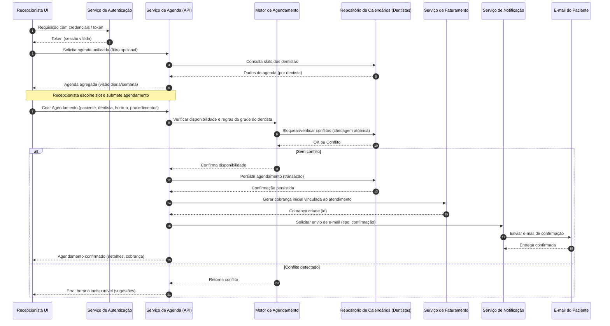
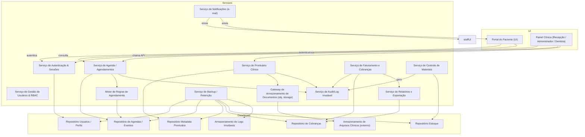

# Relatório Técnico de Arquitetura de Software

## 1. Identificação das HUs

Lista das Histórias de Usuário (HU) do lote e a responsabilidade funcional principal associada:

- HU01 — Visualizar agenda unificada dos dentistas  
  - Visão unificada diária/semanal, filtros por dentista, distinção visual de disponibilidade. (RF03, RF04, RNF06)

- HU02 — Agendar, cancelar e remarcar consulta  
  - Processo de criação/alteração/exclusão de atendimento com checagem de conflitos e notificações por e-mail. (RF03, RF05, RF06, RF07, RF08)

- HU03 — Registrar pagamento de cobrança  
  - Registrar pagamento total/parcial, atualização imediata do status da cobrança. (RF20, RF21, HU03 critérios)

- HU04 — Registrar procedimento no prontuário  
  - Inserção rastreável de entradas no prontuário com data/hora/dentista. (RF09, RF10, RF13, RNF05)

- HU05 — Anexar radiografias e documentos clínicos ao prontuário  
  - Upload e vínculo de arquivos acessíveis mediante controle de acesso. (RF11, RF12, RNF03, RNF07)

- HU06 — Consultar prontuário completo do paciente  
  - Visualização organizada do histórico clínico e documentos. (RF09, RF12, HU06 critérios)

- HU07 — Gerar cobrança após atendimento  
  - Emissão de cobrança discriminando procedimentos e aplicando tabelas de convênios. (RF18, RF19, RF20, HU07 critérios)

- HU08 — Gerenciar dentistas e suas grades de horário  
  - CRUD de dentistas e configuração de grades que afetam somente agendamentos futuros. (RF03, RF07; HU08 critérios)

- HU09 — Gerenciar materiais e receber alertas de estoque baixo  
  - Cadastro de materiais, movimentações e alertas quando abaixo do mínimo. (RF14, RF15, RF16, RF17)

- HU10 — Consultar relatório de faturamento  
  - Relatórios filtráveis e exportáveis sobre faturamento. (RF22; HU10 critérios)

- HU11 — Acessar agendamentos pelo portal  
  - Portal autenticado para visualizar agendamentos futuros e histórico. (RF23, RF24; HU11 critérios)

- HU12 — Acessar e baixar documentos clínicos pelo portal  
  - Download de documentos explicitamente liberados pelo dentista; restrição de anotações internas. (RF25, RNF03; HU12 critérios)

Observação: todos os HUs estão relacionados com os Requisitos Funcionais e os Requisitos Não Funcionais listados no escopo.

---

## 2. Diagramas de Arquitetura (Mermaid)

A seguir dois diagramas conceituais: (A) sequência do fluxo de agendamento (HU02) cobrindo autenticação, verificação de conflito e notificação; (B) diagrama de componentes mostrando principais módulos, responsabilidades e interfaces.

A) Diagrama de sequência — Agendamento criado/confirmado (HU02)

B) Diagrama de componentes (visão lógica)

---

## 3. Decisões de Arquitetura

1. Arquitetura em camadas e serviços coerentes com responsabilidades:
   - Separação entre apresentação (UIs), serviços de domínio (Agenda, Prontuário, Faturamento, Inventário), infra de documentos e serviços transversais (Autenticação, Notificação, Auditoria, Backup, Relatórios).
   - Benefício: isolamento de domínio, deploy e escalabilidade independentes, responsabilidades claras para testes.

2. Autenticação e autorização centralizadas:
   - Serviço de Autenticação e RBAC (gestão de perfis: administrador, recepcionista, dentista, paciente). Políticas de autorização aplicadas a nível de API e UI.
   - Sessões com timeout de 30 minutos de inatividade (RNF01).

3. Agenda e Scheduler desacoplados:
   - AgendaService expõe APIs transacionais; Motor de Regras (Scheduler) encapsula validações de grade, regras de conflito e políticas de bloqueio atômico para evitar sobreposição (RF06, HU02).
   - Persistência com operações atômicas/optimistic locking ou transações para evitar race conditions.

4. Prontuário clínico com armazenamento de metadados e objeto storage para arquivos:
   - Metadados e histórico armazenados em repositório transacional; arquivos pesados (radiografias, PDFs) armazenados em object storage desacoplado (RNF07). DocumentService atua como gateway que aplica controles de acesso (RNF03).
   - Controle de acesso aplicado tanto ao nível de metadado quanto ao URL/objeto.

5. Auditoria imutável:
   - Todas as alterações significativas em prontuário, agendamentos e faturamento geram entradas de auditoria com usuário, data/hora e contexto (RNF05). Armazenamento WORM ou equivalente para garantir imutabilidade lógica.

6. Notificação assíncrona:
   - Envio de e-mails (confirmação/cancelamento/remarcação) feito de forma assíncrona via NotificationService, com garantias de retry/filas e idempotência para evitar duplicidade (RF08, HU02).

7. Faturamento e integração de convênios:
   - BillingService mantém tabelas de procedimentos e aplica regras de convênio na geração de cobranças (RF18–RF21, HU07). Permite registro de pagamentos parciais e controle de cobranças em aberto.

8. Gestão de estoque e vínculo ao atendimento:
   - InventoryService registra entradas/saídas e permite vínculo de consumo por atendimento (RF14–RF17, HU09). Gera alertas e notificações para o painel de administrador.

9. Relatórios e exportação:
   - ReportingService gera relatórios filtros (por período, dentista, modalidade) e exportações CSV/PDF (HU10). Deve consultar fontes transacionais e/ou um repositório analítico para desempenho.

10. Backups e retenção:
    - BackupService realiza backups diários com retenção mínima de 30 dias e estratégia testada de restore (RNF11).

11. Segurança, privacidade e conformidade:
    - Dados clínicos tratados conforme LGPD e normas do órgão regulador (RNF02). Controle de acesso restrito para documentos clínicos (RNF03).
    - Senhas armazenadas com hash seguro conforme requisito (RNF04 — ex.: hash forte recomendado).
    - Criptografia em trânsito e em repouso para dados sensíveis (especificação técnica a detalhar).

12. Performance e experiência:
    - Cache de visualização para agenda unificada (com invalidação adequada) para atender RNF06 (<= 3s). UI responsiva e compatibilidade com navegadores modernos e dispositivos móveis (RNF09, RNF10).

13. Contratos de API e versionamento:
    - APIs explícitas e versionadas (contratos) para permitir evolução sem quebra de clientes (UIs, integrações com terceiros).

Observação: todas as decisões mantêm neutralidade tecnológica — descrevem responsabilidades e interfaces, sem prescrever produtos ou frameworks, exceto referência ao exemplo de hash já citado nos requisitos.

---

## 4. Tabela de Componentes e Rastreabilidade

| Componente | Responsabilidade Principal | Comunica-se com | Origem (HU / Critério de Aceite) |
|---|---:|---|---|
| Serviço de Autenticação & Sessões | Autenticar usuários, gerir sessões, aplicar timeout de 30 min | UserService, StaffUI, PatientPortal, APIs | RNF01, HU11 (autenticação), HU01 (acesso da recepção) |
| Serviço de Gestão de Usuários & RBAC | CRUD de usuários, perfis (admin, recep., dentista, paciente), regras de autorização | AuthService, UI, AuditService | RF01, RF02, HU08 |
| Serviço de Agenda / Agendamentos | Manter agendas por dentista, APIs para criar/alterar/cancelar agendamento | Scheduler, CalendarDB, NotificationService, BillingService | RF03–RF07, RF08, HU01, HU02 |
| Motor de Regras de Agendamento (Scheduler) | Validar grade do dentista, checar conflitos, sugerir alternativas | AgendaService, CalendarDB | RF06, RF07, HU02, HU08 |
| Repositório de Calendários (CalendarDB) | Persistir eventos/slots por dentista | AgendaService, Scheduler | RF03, RF04, HU01 |
| Serviço de Prontuário Clínico | CRUD de prontuários, histórico clínico, rastreabilidade | ProntuarioDB, DocumentService, AuditService | RF09–RF13, HU04, HU06 |
| Gateway de Documentos / Object Storage | Upload, controle de acesso, geração de links de download | ProntuarioService, ObjectStorage, PatientPortal | RF11, RF25, RNF03, RNF07, HU05, HU12 |
| Serviço de Notificação (e-mail) | Enviar e-mails de confirmação/cancelamento/remarcação e notificações de alerta | AgendaService, NotificationQueue, PatientEmail | RF08, HU02, HU01 |
| Serviço de Faturamento (Billing) | Cadastro de procedimentos, tabelas de convênio, gerar cobranças, registrar pagamentos | BillingDB, AgendaService, ReportingService | RF18–RF22, HU03, HU07, HU10 |
| Serviço de Inventário / Materiais | Cadastro de materiais, registrar entradas/saídas, alertas de estoque baixo | InventoryDB, UI Admin, AuditService | RF14–RF17, HU09 |
| Serviço de Auditoria / Log Imutável | Registrar logs imutáveis com usuário/data/hora em alterações críticas | Todos os serviços | RNF05, RF13 |
| Serviço de Relatórios & Exportação | Geração de relatórios, filtros, export CSV/PDF | BillingDB, CalendarDB, ProntuarioDB | RF22, HU10 |
| Serviço de Backup / Retenção | Agendamento de backups diários e retenção mínima de 30 dias | Todos os repositórios | RNF11 |
| Painel Clínica (UI) | Interface para recepção, dentistas e administração | AuthService, AgendaService, ProntuarioService, BillingService, InventoryService | HU01–HU10 |
| Portal do Paciente (UI) | Interface pública autenticada para pacientes ver agendamentos e documentos | AuthService, AgendaService, ProntuarioService, DocumentService | RF23–RF25, HU11, HU12 |

---

## 5. Bloqueios e Pendências

1. Política de Consentimento e Privacidade (LGPD)
   - Bloqueio: necessidade de definição formal das bases legais para tratamento de dados clínicos e do fluxo de consentimento para compartilhamento de documentos com o paciente.
   - Impacto: controla acesso ao DocumentService e retenção de dados; atraso impacta entregas de prontuário/portal.
   - Ação recomendada: esclarecimento jurídico e definição de formulário de consentimento que será registrado no sistema.

2. Requisitos de Criptografia e Backup de Documentos Clínicos
   - Bloqueio: especificação técnica ausente sobre algoritmos/gerenciamento de chaves para criptografia em repouso e em trânsito.
   - Impacto: afeta design de armazenamento de documentos e conformidade.
   - Ação: definir política de criptografia, gestão de chaves e requisitos de auditoria para armazenamento de blobs.

3. Integração com provedores de e-mail e SLA de entrega
   - Bloqueio: não especificado níveis de entrega, fallback para falha de envio e requisitos de retenção de eventos de notificação.
   - Impacto: estratégia de retry, filas e garantia de entrega.
   - Ação: definir requisitos de SLA de envio e política de retry/alerta.

4. Dados de Convênio e Tabelas de Procedimento
   - Bloqueio: formato/atualização das tabelas de convênio (import/integração) não especificados.
   - Impacto: afeta cálculo automático de valores (HU07).
   - Ação: obter formato dos convênios; definir interface de importação/atualização manual e automática.

5. Regras detalhadas de conciliação e meios de pagamento
   - Bloqueio: não há especificação de integrações com gateways de pagamento, estornos ou conciliação bancária.
   - Impacto: implementações de registro de pagamento parcial e relatórios financeiros.
   - Ação: definir integrações/formatos ou workflow manual para registro de pagamentos.

6. Políticas de retenção e exclusão de documentos clínicos
   - Bloqueio: limites de tempo de guarda, políticas de anonimização/anulação não detalhadas.
   - Impacto: backlog legal e requisitos de backup.
   - Ação: definição de política de retenção (em conformidade com CFO / LGPD).

7. Tamanho máximo de arquivos e formatos adicionais
   - Bloqueio: não especificadas regras de tamanho máximo, limites de resolução de radiografias nem formatos além dos citados.
   - Impacto: dimensionamento de object storage e UX de upload.
   - Ação: definir limites por tipo de arquivo e compressão/transformação server-side.

8. Conflitos concorrenciais detalhados (estratégia de bloqueio)
   - Bloqueio: escolha entre bloqueio pessimista vs. optimistic locking para agendamentos não decidida.
   - Impacto: possibilidade de race conditions em horários concorrentes.
   - Ação: definir estratégia (por exemplo, reserva temporária + confirmação) e timeout de reserva.

9. SLA operacional e acordos de disponibilidade
   - Bloqueio: RNF08 define 99,5% uptime, mas falta definição de monitoramento, SLOs e runbook.
   - Impacto: arquitetura de alta disponibilidade, requisitos de redundância.
   - Ação: estabelecer SLO/SLA operacionais e plano de incident response.

10. Ambiguidade quanto ao acesso de dentistas a prontuários
    - Bloqueio: "dentistas vinculados ao paciente" precisa de definição clara de vínculo (ex.: pacientes atendidos pela clínica vs. pacientes atribuídos a um dentista).
    - Impacto: regras de autorização no ProntuarioService.
    - Ação: definir e modelar vínculo paciente-dentista e exceções (substituições, equipe).

---

## 6. Cobertura de Requisitos

Mapeamento resumido de cobertura (Coberto / Parcial / Não Coberto) e componente responsável:

- RF01 (Cadastro de usuários perfis) — Coberto — UserService
- RF02 (Restrição por perfil) — Coberto — AuthService + UserService + políticas RBAC
- RF03 (Agenda individual por dentista) — Coberto — AgendaService + CalendarDB
- RF04 (Agenda unificada, recepção) — Coberto — AgendaService + StaffUI
- RF05 (Recepcionista agendar/cancelar/remarcar) — Coberto — AgendaService + Scheduler + NotificationService
- RF06 (Impedir sobreposição no mesmo dentista) — Coberto (parcial: estratégia concorrência a definir) — Scheduler + CalendarDB
- RF07 (Configurar grade de horários por dentista) — Coberto — AgendaService + Scheduler (HU08)
- RF08 (Notificação por e-mail ao paciente) — Coberto (dependente de integração e SLA de e-mail) — NotificationService
- RF09 (Prontuário por paciente com histórico) — Coberto — ProntuarioService + ProntuarioDB
- RF10 (Dentista registrar procedimento) — Coberto — ProntuarioService (HU04)
- RF11 (Upload e armazenamento de radiografias) — Coberto — DocumentService + ObjectStorage
- RF12 (Consultar/editar registros pelos dentistas dos seus pacientes) — Coberto (depende de definição de vínculo) — ProntuarioService
- RF13 (Registro com data/hora/dentista) — Coberto — ProntuarioService + AuditService
- RF14 (Cadastro de materiais/equipamentos) — Coberto — InventoryService
- RF15 (Registrar entradas/saídas estoque) — Coberto — InventoryService
- RF16 (Alerta quando estoque abaixo do mínimo) — Coberto — InventoryService + NotificationService
- RF17 (Vincular consumo de materiais a atendimento) — Coberto — InventoryService + AgendaService
- RF18 (Cadastro de procedimentos com código/valor) — Coberto — BillingService
- RF19 (Registro de convênios e tabelas) — Coberto (parcial: formato de importação não definido) — BillingService
- RF20 (Gerar cobrança por atendimento) — Coberto — BillingService
- RF21 (Registrar pagamento e controlar em aberto) — Coberto (parcial: integrações de pagamento) — BillingService
- RF22 (Relatórios de faturamento) — Coberto — ReportingService
- RF23 (Portal web para pacientes) — Coberto — PatientPortal
- RF24 (Portal visualizar agendamentos e histórico) — Coberto — PatientPortal + AgendaService + ProntuarioService
- RF25 (Portal download de documentos clínicos) — Coberto — DocumentService + ObjectStorage + ProntuarioService

Requisitos Não Funcionais (selecionados):
- RNF01 (Autenticação e timeout 30 min) — Coberto — AuthService
- RNF02 (LGPD & normas CFO) — Parcial (conceito implementado; dependente de políticas formais) — Política organizacional + ProntuarioService
- RNF03 (Controle de acesso a documentos) — Coberto — DocumentService + AuthService (pendência: definição de vínculo)
- RNF04 (Hash seguro de senhas) — Coberto — AuthService (implementar hash forte; RNF cita exemplo)
- RNF05 (Log imutável das alterações no prontuário) — Coberto — AuditService
- RNF06 (Agenda unificada carregue <= 3s) — Parcial (depende de dimensionamento, caching e SLAs infra) — AgendaService + Cache
- RNF07 (Object storage para documentos) — Coberto — DocumentService + ObjectStorage
- RNF08 (Disponibilidade 99,5%) — Parcial (necessita SLO, infra) — Operações / Arquitetura infra
- RNF09 (Responsividade UI) — Coberto — UI design / Front-end (diretrizes)
- RNF10 (Compatibilidade navegadores) — Coberto — UI (diretrizes)
- RNF11 (Backup diário retenção 30 dias) — Coberto — BackupService

Resumo: a maior parte dos requisitos funcionais possui cobertura arquitetural direta; pendências principais giram em torno de detalhamentos operacionais, políticas legais e integrações externas.

---

## 7. Gap Analysis

1. Consentimento LGPD e registro explícito
   - Lacuna: não foi definido como/onde será registrado o consentimento do paciente para armazenamento e compartilhamento de documentos clínicos.
   - Impacto arquitetural: necessidade de campo e fluxos adicionais no ProntuarioService e UI; logs de consentimento relacionados à auditoria.
   - Recomendações: definir modelo de consentimento e APIs para registrar/consultar consentimentos. Incluir consentimento como pré-condição para disponibilizar documentos no portal.

2. Especificações de criptografia e gerenciamento de chaves
   - Lacuna: ausência de requisitos técnicos (algoritmo, rotação de chaves, KMS).
   - Impacto: projeto de armazenamento de documentos e backups pode não atender conformidade.
   - Recomendações: definir padrão de criptografia em repouso e em trânsito, política de rotação de chaves e quem gerencia as chaves.

3. Estratégia para prevenção de condição de corrida (agendamentos)
   - Lacuna: escolha entre reserva temporária, bloqueio pessimista, ou optimistic locking não definida.
   - Impacto: risco de dupla reserva em pico de concorrência.
   - Recomendações: adotar reserva temporária com timeout para UI e confirmação atômica; modelar testes de carga e cenários concorrentes.

4. Integração e formato das tabelas de convênio
   - Lacuna: não há especificação de como convênios serão importados/atualizados.
   - Impacto: geração automática de cobranças pode aplicar valores incorretos.
   - Recomendações: definir interface de importação (CSV/JSON) e rotina de validação; painel administrativo para revisão.

5. Detalhes de pagamentos (gateways, estornos, conciliação)
   - Lacuna: não especificado integração com meios de pagamento nem política de reconciliação.
   - Impacto: impossibilidade de automatizar fluxo de pagamento e relatórios financeiros.
   - Recomendações: definir requisitos de pagamento (pagamento em cartão, boleto, registro offline), campos de conciliação e exportáveis.

6. Políticas de retenção e exclusão de prontuários e documentos
   - Lacuna: período de retenção, anonimização e exclusão não definidos.
   - Impacto: impacto legal e operacional em backups e recuperação.
   - Recomendações: estabelecer política de guarda de documentos e processos automáticos de anonimização/exclusão.

7. Tamanho máximo e tipos de arquivo, processamento de imagens
   - Lacuna: limites de upload e necessidade de geração de miniaturas/visualização não definidos.
   - Impacto: dimensionamento de storage e UX (upload lento).
   - Recomendações: estabelecer limites por tipo e implementar processamento assíncrono para gerar visualizações.

8. Métricas operacionais, monitoramento e SLOs
   - Lacuna: ausência de métricas detalhadas (tempo de resposta, latência, erros).
   - Impacto: cumprimento de RNF06 e RNF08 sem definição de como medir.
   - Recomendações: definir SLOs/SLA, métricas-chave e painéis; criar runbooks para incidentes.

9. Regra de vínculo “dentista vinculado ao paciente”
   - Lacuna: não está claro se vinculação é dinâmica (por atendimento) ou fixa.
   - Impacto: autorização no prontuário e no acesso a documentos.
   - Recomendações: definir modelo de relacionamento paciente-dentista (historical vs. atual), regras para substituições e acesso de equipe.

10. Exportações e formato de relatórios (PDF/CSV)
    - Lacuna: layout e campos obrigatórios em exportações não especificados (ex.: dados sensíveis que devem ser mascarados).
    - Impacto: divergências entre expectativas e entrega.
    - Recomendações: definir templates de relatório, campos, e regras de anonimização.

Prioridade das ações recomendadas:
1. Definição legal (consentimento LGPD) e política de retenção (alta prioridade).
2. Estratégia concorrência de agendamento e testes de carga (alta).
3. Especificação de pagamentos e convênios (média-alta).
4. Criptografia e chave (média).
5. Limites de upload e processamento de imagens (média).
6. Métricas/SLOs e runbooks (média).

---

Fim do Relatório.