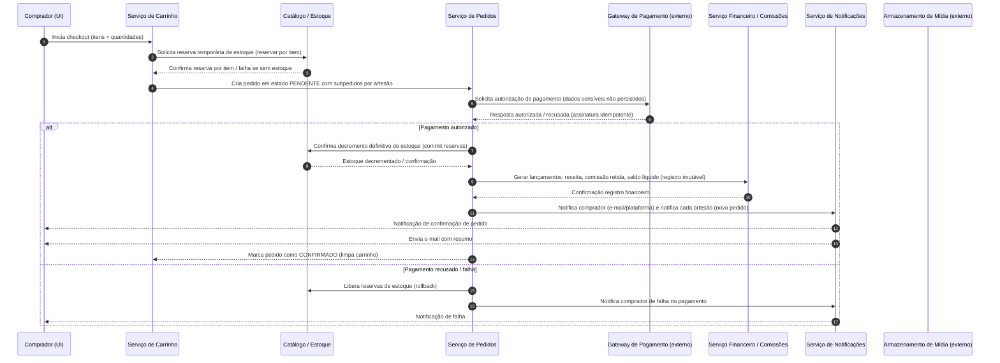

# Relatório Técnico de Arquitetura de Software

## 1. Identificação das HUs
Lista das Histórias de Usuário (HU) tratadas neste relatório e seus objetivos funcionais principais:

- HU01 — Cadastrar produto com fotos  
  Objetivo: permitir cadastro completo de produtos com múltiplas imagens, publicação imediata.

- HU02 — Gerenciar estoque dos produtos  
  Objetivo: atualização manual e automática do estoque; bloquear vendas quando estoque = 0.

- HU03 — Acompanhar e atualizar status dos pedidos recebidos  
  Objetivo: painel para artesão listar pedidos e alterar status (recebido → em preparação → enviado → entregue).

- HU04 — Visualizar painel financeiro  
  Objetivo: apresentar histórico de vendas, comissões e saldo líquido disponível.

- HU05 — Solicitar saque do saldo disponível  
  Objetivo: registrar solicitação de saque com dados bancários e atualizar saldo em processamento.

- HU06 — Responder avaliações de compradores  
  Objetivo: permitir resposta pública única por avaliação, imutável após publicação.

- HU07 — Navegar e pesquisar produtos  
  Objetivo: navegação por categorias, busca em tempo real, ocultar produtos sem estoque por padrão.

- HU08 — Adicionar itens ao carrinho e finalizar compra  
  Objetivo: carrinho consolidado com itens de múltiplos artesãos e pagamento integrado; garantia transacional de pagamento/estoque.

- HU09 — Acompanhar status dos pedidos  
  Objetivo: visualizar status por subpedido (por artesão), atualizar em tempo real.

- HU10 — Avaliar produto após entrega  
  Objetivo: avaliação 1–5 e comentário após entrega, única avaliação por item.

- HU11 — Gerenciar categorias da plataforma  
  Objetivo: CRUD de categorias por administrador com regras ao remover categoria com produtos.

- HU12 — Configurar percentual de comissão  
  Objetivo: administrar percentual de comissão, afetando vendas futuras e gerando log auditável.

---

## 2. Diagramas de Arquitetura (Mermaid)

A seguir dois diagramas mermaid: (A) sequência de checkout/confirmação de pedido (fluxo crítico para RNF08 e RF13–RF22, RF26–RF29) e (B) diagrama de componentes com interfaces principais.

A) Fluxo de checkout com múltiplos artesãos, reserva de estoque e confirmação de pagamento


B) Diagrama de componentes e interfaces (visão lógica)
```mermaid
graph TD
  subgraph Plataforma
    UI[Interface Web / Mobile] 
    Auth[Serviço de Autenticação & Autorização]
    UserMgmt[Serviço de Gestão de Usuários & Perfis]
    Catalog[Serviço de Catálogo de Produtos]
    Media[Adapter -> Armazenamento de Mídia Externo]
    Cart[Serviço de Carrinho]
    Order[Serviço de Pedidos & Subpedidos]
    Inventory[Serviço de Estoque / Reserva]
    Payment[Adapter -> Gateway de Pagamento Externo]
    Finance[Serviço Financeiro & Ledger Imutável]
    Reviews[Serviço de Avaliações]
    Notifications[Serviço de Notificações (e-mail, in-app)]
    Admin[Console Administrativo]
    Audit[Serviço de Logs / Auditoria]
  end

  UI -->|API| Auth
  UI -->|API| Catalog
  UI -->|API| Cart
  UI -->|API| Order
  UI -->|API| Reviews
  UI -->|API| Admin

  Auth --> UserMgmt
  Catalog --> Media
  Cart --> Inventory
  Order --> Inventory
  Order --> Payment
  Payment -->|webhook| Order
  Order --> Finance
  Finance --> Audit
  Order --> Notifications
  Reviews --> Notifications
  Admin --> Catalog
  Admin --> Finance
  Admin --> Audit
  UserMgmt --> Audit
```

---

## 3. Decisões de Arquitetura
Resumo das decisões arquiteturais principais e justificativas (neutralidade tecnológica mantida).

1. Arquitetura por domínios/bounded contexts
   - Separar responsabilidades em componentes lógicos: Autenticação, Gestão de Usuários, Catálogo & Mídia, Estoque, Carrinho, Pedidos, Pagamentos, Financeiro/Ledger, Avaliações, Notificações e Administração.
   - Justificativa: favorece isolação de preocupações (segurança, consistência financeira), manutenção e escalabilidade para requisitos de performance e disponibilidade.

2. Interfaces e protocolos
   - Interfaces entre componentes expostas via APIs bem definidas (RESTful/HTTP + contratos de mensagens para integrações assíncronas).
   - Eventos assíncronos para comunicações com menor acoplamento (por ex. notificações, atualização de painéis e atualizações de cache de catálogos).
   - Justificativa: atende requisitos de usabilidade/performance (RNF05/RNF06) e desacoplamento (RNF04).

3. Fluxo transacional do checkout (RNF08)
   - Usar padrão de reserva + confirmação: ao iniciar checkout, reservar estoque (soft lock). Executar autorização/captura de pagamento no gateway externo. Apenas após confirmação de pagamento, confirmar o pedido e decrementar estoque permanentemente. Em caso de falha, liberar reservas.
   - Implementar idempotência nos pontos de interação com o gateway (webhooks) e proteção contra duplicidade.
   - Justificativa: garante que não haja cobrança sem decremento de estoque e que falha de pagamento não altere estoque.

4. Consistência financeira e rastreabilidade (RNF09)
   - Manter ledger imutável de transações financeiras (venda, comissão, saque) com timestamp, partes envolvidas e valores. Os registros financeiros são gerados por um componente Financeiro separado que expõe interface de consulta ao painel do vendedor.
   - Todas as alterações críticas (alteração de comissão, saque, confirmação de pedido, falha de pagamento) geram logs auditáveis (RNF13).

5. Armazenamento de mídia (RNF04)
   - Fotos de produtos armazenadas em serviço de object storage desacoplado (acesso via URLs assinadas/links públicos controlados).
   - O componente de Catálogo mantém referências (metadados) às imagens sem armazenar blobs na aplicação.

6. Segurança e LGPD (RNF01, RNF02, RNF03, RNF11)
   - Autenticação + autorização baseada em perfis (admin / artesão / comprador), com possibilidade de perfis múltiplos por usuário (RF03).
   - Senhas armazenadas com hash seguro conforme RNF02 (Ex.: algoritmo de hashing com sal, conforme política do requisito).
   - Gateway de pagamento tratado como integração externa via HTTPS; dados sensíveis de cartão não são persistidos (RNF03).
   - Implementar controles de consentimento e exercícios de direitos previstos pela LGPD (ex.: exportação e exclusão de dados pessoais).

7. Notificações e atualizações em tempo real
   - Para atualização de status de pedidos em tempo real (HU03, HU09), suportar canal de push/in-app (sockets) e fallback via polling; além de notificações por e-mail para eventos críticos (RF18, RF19).

8. Compartimentação de responsabilidades entre pedidos e subpedidos
   - Ao criar um pedido com itens de múltiplos artesãos, gerar subpedidos por artesão para que cada artesão gerencie seu fluxo (RF22, HU03, HU09). Financeiro calcula comissões e saldos por subpedido.

9. Painel financeiro e cálculos de comissão
   - Componentizar lógica de cálculo (percentual configurável) em FinanceService; alterações de percentual aplicam-se somente a operações futuras e geram log auditável (HU12).

10. Logs e observabilidade
    - Registrar eventos críticos e métricas de disponibilidade e performance. Logs estruturados com correlação de transações para rastreamento (RNF13, RNF12).

---

## 4. Tabela de Componentes e Rastreabilidade

| Componente | Responsabilidade Principal | Comunica-se com | Origem (HU / Critério de Aceite / RF) |
|---|---:|---|---|
| Interface Web / Mobile (UI) | Apresentar fluxos de compra, gestão de produtos, painel do artesão e administração | Auth, Catalog, Cart, Order, Reviews, Admin | HUs: HU01–HU12; RNF07 |
| Serviço de Autenticação & Autorização (Auth) | Autenticação, sessões, controle de perfis (multi-perfil) e autorização por role | UI, UserMgmt | RF01, RF02, RF03; RNF01, RNF02 |
| Serviço de Gestão de Usuários (UserMgmt) | CRUD de usuários, perfis, dados pessoais, consentimentos LGPD | Auth, Audit | RF01, HU — perfil; RNF11 |
| Serviço de Catálogo de Produtos (Catalog) | CRUD de produtos, publicação/despublicação, pesquisa por nome/categoria/artesão, média de avaliações | Media, Inventory, Reviews, UI, Admin | RF04–RF12, HU01, HU07 |
| Adapter → Armazenamento de Mídia Externo (MediaStorage) | Upload, versão e entrega de fotos de produtos; geração de URLs | Catalog, UI | RNF04; HU01 |
| Serviço de Carrinho (Cart) | Gerenciar itens do carrinho, ajustes de quantidade, resumo do pedido | UI, Inventory, Order | RF13–RF15, HU08 |
| Serviço de Estoque / Reserva (Inventory) | Reserva temporária, confirmação/rollback e decremento definitivo de estoque | Catalog, Cart, Order | RF07–RF09; HU02 |
| Serviço de Pedidos & Subpedidos (Order) | Criar pedidos e subpedidos por artesão, gerenciar estados, integrar com pagamento | Inventory, Payment, Finance, Notifications | RF16–RF22, HU03, HU08, HU09 |
| Adapter → Gateway de Pagamento Externo (Payment) | Orquestra autorização/captura; expõe webhook para confirmação de pagamento | Order, Finance | RF16–RF19, RNF03, RNF08 |
| Serviço Financeiro & Ledger Imutável (Finance) | Cálculo e retenção de comissão, registro imutável de transações, painel financeiro do artesão | Order, Admin, Audit | RF26–RF30, RNF09; HU04, HU05, HU12 |
| Serviço de Avaliações (Reviews) | Gerenciar avaliações, cálculo de média, permitir resposta do artesão (imutável) | Catalog, Notifications | RF23–RF25, HU06, HU10 |
| Serviço de Notificações (Notification) | Enviar e-mail, notificações in-app; orquestrar notificações por evento | Order, Reviews, Admin, UI | RF18, RF19, HU03 |
| Console Administrativo (Admin) | Gerenciar categorias, configurar comissão, operações administrativas | Catalog, Finance, Audit | RF12, RF27, HU11, HU12 |
| Serviço de Logs / Auditoria (Audit) | Registrar logs imutáveis para eventos críticos e alterações de configuração | Todos os componentes | RNF09, RNF13, HU12 |

---

## 5. Bloqueios e Pendências
Itens que precisam de resolução/decisão para implementação e/ou integração, com impacto estimado:

1. Integração com Gateway de Pagamento (PCI-DSS)
   - Pendência: seleção de provedor e definição do fluxo (autorização vs autorização+captura; suporte a PIX ou equivalente).
   - Impacto: alta — afeta RNF03 e RNF08 (transações) e a implementação de webhooks/idempotência.

2. Política de reservas de estoque (tempo de reserva)
   - Pendência: qual o timeout padrão para reservas de estoque no fluxo de checkout (ex.: 10 minutos).
   - Impacto: médio — afeta concorrência em vendas e experiência do usuário (possíveis cart collisions).

3. Processo de conciliação e cronograma de repasses/saques
   - Pendência: definir quando a comissão é retida definitivamente, calendário de repasses e integração bancária para saque.
   - Impacto: alto — afeta FinanceService, UX do saldo e requisitos legais fiscais.

4. Requisitos de KYC e validação de dados bancários para saque
   - Pendência: nível de verificação exigido para habilitar saques (documentação, limites).
   - Impacto: alto para conformidade e prevenção de fraudes (RNF11).

5. Garantia de imutabilidade do ledger financeiro
   - Pendência: especificar mecanismo (append-only store, assinaturas, WORM) e políticas de retenção, backups e exportação.
   - Impacto: alto — afeta rastreabilidade (RNF09) e auditoria.

6. SLA e estratégia de alta disponibilidade / recuperação de desastre
   - Pendência: definições detalhadas de RTO/RPO e arquitetura de redundância regional.
   - Impacto: alto para atender RNF12 (99,5% disponibilidade).

7. Política de moderação de conteúdo e resposta a avaliações
   - Pendência: regras para remover avaliações/editar respostas (HU06 impõe resposta única e imutável).
   - Impacto: baixo/medio para operações e experiência.

8. Requisitos legais e fiscais (impostos sobre vendas)
   - Pendência: tratamento e cálculo de impostos por jurisdição, retenções obrigatórias.
   - Impacto: alto para financeiro e relatórios.

---

## 6. Cobertura de Requisitos
Mapeamento resumido RF/HU → componentes responsáveis.

- RF01 / RF02 / RF03 (Usuários e Acesso)
  - Componentes: Auth, UserMgmt, UI
  - HUs: Implicitamente suportadas por todas (perfil único/múltiplo).

- RF04 / RF05 / RF06 / RF07 / RF08 / RF09 / RF10 / RF11 / RF12 (Catálogo & Estoque & Categorias)
  - Componentes: Catalog, MediaStorage, Inventory, Admin
  - HUs: HU01, HU02, HU07, HU11

- RF13 / RF14 / RF15 / RF16 / RF17 / RF18 / RF19 / RF20 / RF21 / RF22 (Carrinho & Pedidos)
  - Componentes: Cart, Order, Payment, Inventory, Notifications, UI
  - HUs: HU08, HU03, HU09

- RF23 / RF24 / RF25 (Avaliações)
  - Componentes: Reviews, Catalog, Notifications
  - HUs: HU06, HU10

- RF26 / RF27 / RF28 / RF29 / RF30 (Comissão e Painel Financeiro)
  - Componentes: Finance, Admin, Order, Audit
  - HUs: HU04, HU05, HU12

- RNF01 / RNF02 / RNF03 / RNF11 (Segurança & Conformidade)
  - Componentes: Auth, UserMgmt, Payment adapter, Audit
  - Observação: Implementar políticas de LGPD (consentimento, anonimização, exportação/exclusão).

- RNF04 (Armazenamento de fotos)
  - Componentes: MediaStorage, Catalog

- RNF05 / RNF06 (Desempenho)
  - Componentes: Catalog (indexação, caches), Finance (pre-aggregações), UI
  - Observação: usar caches e índices, pre-cálculo de agregados para o painel financeiro.

- RNF08 / RNF09 / RNF13 (Confiabilidade / Rastreabilidade / Logs)
  - Componentes: Order, Payment, Finance, Audit
  - Observação: garantir transações compostas e ledger imutável.

- RNF12 (Disponibilidade)
  - Componentes: arquitetura operacional (infraestrutura), todos os serviços críticos.

Tabela de rastreabilidade consolidada (exemplo parcial)
| Requisito | Componentes principais |
|---|---|
| HU01 / RF04 | Catalog, MediaStorage, UI |
| HU02 / RF07–RF09 | Inventory, Catalog, Order |
| HU03 / RF20 | Order, Notifications, UI |
| HU04 / RF28–RF29 | Finance, Order, UI |
| HU05 / RF30 | Finance, Admin, Audit |
| HU06 / RF25 | Reviews, Notifications |
| HU07 / RF10–RF11 | Catalog, UI, Search (index) |
| HU08 / RF13–RF19 | Cart, Order, Payment, Inventory, Notifications |
| HU09 / RF21–RF22 | Order, UI, Notifications |
| HU10 / RF23 | Reviews, Order |
| HU11 / RF12 | Admin, Catalog, Notifications |
| HU12 / RF26–RF27 | Admin, Finance, Audit |

---

## 7. Gap Analysis
Identificação de lacunas na especificação, impactos arquiteturais e recomendações concretas.

1. Fluxo de pagamentos: autorização vs captura e reembolsos
   - Lacuna: Não há definição clara sobre autorização temporária, captura ou reembolso e prazos de estorno.
   - Impacto: Afeta transacionalidade (RNF08), reconciliação financeira e UX de comprador/ar­te­são.
   - Recomendações: definir políticas de autorização/captura, regras de reembolso e APIs de compensação; validar com o provedor de pagamento escolhido.

2. Temporalidade e regras de repasses/saques
   - Lacuna: Falta definição do calendário de repasses (ex.: imediato vs semanal) e regras de retenção por disputa.
   - Impacto: Atinge cálculo de saldo, disponibilidade para saque (HU05) e relatórios fiscais.
   - Recomendações: definir política de liquidação e retenção; especificar estados financeiros (disponível, em processamento, retido).

3. Gestão de devoluções e disputas
   - Lacuna: Não há requisitos sobre devolução de produtos, estornos ou disputas entre comprador e artesão.
   - Impacto: Necessário para operação segura; afeta ledger e rollback de comissões/estoque.
   - Recomendações: adicionar histórias de usuário e requisitos de processo de devolução, prazos e compensações.

4. Regras fiscais e tributárias
   - Lacuna: Ausência de requisitos sobre impostos sobre vendas, emitir notas fiscais ou retenções por jurisdição.
   - Impacto: Alto para FinanceService e conformidade legal.
   - Recomendações: obter requisitos fiscais por jurisdição e incorporar cálculo/relatórios fiscais.

5. Política de retenção e imutabilidade de logs/ledger
   - Lacuna: Não especificado o mecanismo e o período de retenção de registros imutáveis.
   - Impacto: Afeta conformidade e capacidade de auditoria (RNF09).
   - Recomendações: definir retenção, formato exportável e mecanismo de imutabilidade (append-only, assinaturas).

6. Limites de concorrência/controle de concorrência para estoque
   - Lacuna: Não especificado mecanismo detalhado (optimistic locking, reserving tokens) para evitar oversell em alta concorrência.
   - Impacto: Pode violar RNF08 e RF08; causar vendas de itens sem estoque.
   - Recomendações: especificar algoritmos de reserva temporária, timeout e verificação atômica (p.ex. usando locks lógicos/versão).

7. Identidade e KYC para saque do artesão
   - Lacuna: Nível de verificação e dados exigidos não especificados.
   - Impacto: Risco de fraude, compliance.
   - Recomendações: definir critérios KYC e limites de saque; integração com validação bancária.

8. Escalabilidade da busca (real-time search enquanto digita)
   - Lacuna: não há definição de indexação, latência aceitável para search-as-you-type.
   - Impacto: RNF05; experiência de busca (HU07).
   - Recomendações: definir requisitos de latência para busca em tempo real e estratégia de indexação; incluir paginação e caches.

9. Internacionalização / multi-moeda
   - Lacuna: moeda e localidade não definidos.
   - Impacto: Financeiro e UX.
   - Recomendações: definir escopo geográfico e suporte a moedas, formatos e conversões.

10. Monitoramento, métricas e SLAs operacionais
    - Lacuna: sem métricas detalhadas (RTO/RPO, tempo de recuperação) e alertas.
    - Impacto: cumprimento RNF12.
    - Recomendações: definir SLOs por componente, runbooks, e estratégia de replicação/backup.

---

Observações finais e próxima etapa recomendada:
- O design proposto atende aos requisitos funcionais e não funcionais fornecidos com uma abordagem modular e neutra em tecnologia.  
- Recomenda-se que o time técnico priorize a resolução das pendências listadas (pagamento, repasses, KYC, devoluções, SLAs) antes da definição de infra/serviços específicos.  
- A fase seguinte deve produzir:
  1) Especificação de integração detalhada com o(s) gateway(s) de pagamento (endpoints, webhooks, idempotência).  
  2) Contratos de API (endpoints, payloads) para cada componente crítico.  
  3) Plano de testes de carga para validar RNF05/RNF06 e testes de concorrência de estoque.  

Fim do relatório.