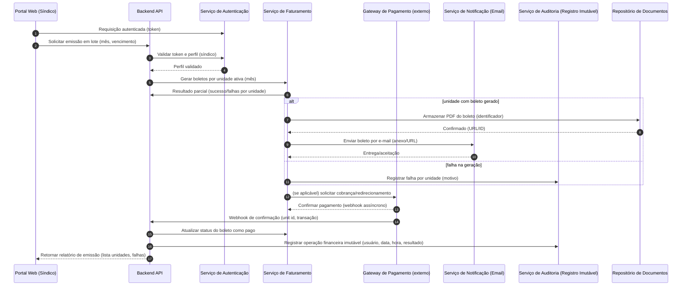
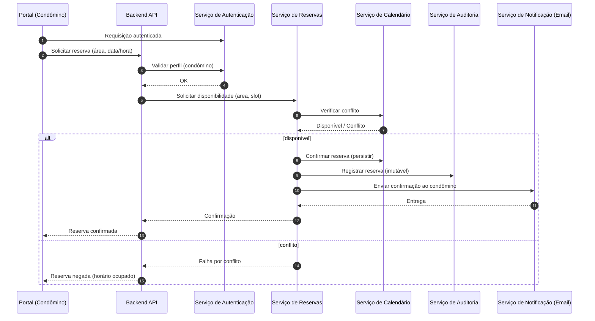

# Relatório Técnico de Arquitetura de Software

## 1. Identificação das HUs

Mapeamento principal entre Histórias de Usuário (HU) e requisitos funcionais (RF) / critérios de aceite:

- HU01 — Cadastrar unidades e moradores  
  - RF04, RF05, RF06, RF07, critérios: blocos/número obrigatórios, CPF único, múltiplos moradores por unidade.

- HU02 — Emitir boletos em lote  
  - RF09, RF10, RF11, RF12, RF13, RF14, RF15, critérios: mês/vencimento, boleto por unidade ativa, e-mail, indicar falhas.

- HU03 — Acompanhar inadimplências  
  - RF15, RF09, RF10, RNF08, critérios: listar atrasos, filtros, export CSV.

- HU04 — Publicar comunicados  
  - RF16, RF17, critérios: título/texto/data, notificação por e‑mail, fixar no topo.

- HU05 — Gerenciar ocorrências  
  - RF21, RF22, RF23, RF24, critérios: listagem com campos, filtros, notificação por status.

- HU06 — Criar e registrar assembleias  
  - RF18, RF19, RF20, critérios: notificar criação, associar ata, anexos.

- HU07 — Gerenciar áreas comuns e reservas  
  - RF25, RF26, RF27, RF28, RF29, critérios: regras de reserva, calendário, cancelamento.

- HU08 — Visualizar e pagar boleto pelo portal  
  - RF10, RF11, RF12, critérios: listagem, baixar boleto, atualização automática de status.

- HU09 — Reservar área comum  
  - RF25, RF26, RF27, RF28, critérios: disponibilidade em tempo real, confirmação imediata, e‑mail de confirmação.

- HU10 — Registrar e acompanhar ocorrência  
  - RF21, RF23, RF24, critérios: categoria, anexos/fotos, histórico, notificações.

- HU11 — Pré-autorizar entrada de visitante  
  - RF31, RF32, RF33, critérios: registrar visita antecipada, visibilidade na portaria, cancelamento.

- HU12 — Acompanhar assembleias e consultar atas  
  - RF18, RF19, RF20, critérios: exibir assembleias futuras e atas em PDF.

- HU13 — Registrar entrada e saída de visitantes  
  - RF30, RF32, RF33, critérios: nome/documento/unidade/horários, destacar pré‑autorização, saída com horário.

- HU14 — Consultar pré-autorizações de acesso  
  - RF31, RF32, RF33, critérios: listagem filtrável, vincular registro à pré‑autorização.

Requisitos não funcionais (selecionados e rastreados): RNF01–RNF13 conforme cobertura das HUs na Seção 6.

---

## 2. Diagramas de Arquitetura (Mermaid)

(Atenção: diagramas conceituais mantendo neutralidade tecnológica — responsabilidades e interfaces.)

2.1. Diagrama de Sequência — Emissão de boletos em lote (HU02)


2.2. Diagrama de Componentes — Visão modular de alto nível
```mermaid
graph LR
  subgraph UIs
    Portal[Portal Web / Mobile (Usuários)]
    Portaria[Interface Portaria (Funcionário)]
  end

  subgraph Backend
    API[API Gateway / Orquestrador]
    Auth[Serviço de Autenticação & Autorização]
    Users[Serviço de Usuários & Papéis]
    Units[Serviço de Unidades e Moradores]
    Billing[Serviço de Faturamento / Boletos]
    Payments[Adapter: Integração com Gateway de Pagamento]
    Notices[Serviço de Comunicados e Assembleias]
    Occurrences[Serviço de Ocorrências]
    Reservations[Serviço de Áreas Comuns e Reservas]
    Visitors[Serviço de Visitantes / Pré‑autorizações]
    Storage[Serviço de Armazenamento de Documentos e Anexos]
    Audit[Serviço de Auditoria (logs imutáveis)]
    Notifications[Serviço de Notificações (Email / Push)]
    Reporting[Serviço de Relatórios (inadimplência/exports)]
    Scheduler[Serviço de Agendamentos / Jobs]
  end

  Portal -->|REST/GraphQL| API
  Portaria -->|REST| API
  API --> Auth
  API --> Users
  API --> Units
  API --> Billing
  API --> Notices
  API --> Occurrences
  API --> Reservations
  API --> Visitors
  Billing --> Payments
  Billing --> Storage
  Notices --> Storage
  Occurrences --> Storage
  Visitors --> Storage
  Any --> Audit
  Any --> Notifications
  Reporting --> Storage
  Scheduler --> Billing
  Scheduler --> Notifications
```

2.3. Diagrama de Sequência — Reserva de área comum (HU09)


---

## 3. Decisões de Arquitetura

1. Arquitetura modular orientada a domínios (serviços lógicos)
   - Racional: separar responsabilidades (identidade, faturamento, reservas, ocorrências, notificações, auditoria) facilita escalabilidade, testes e manutenção.
   - Impacto: interfaces bem definidas (APIs internas) e contratos entre serviços; facilita futura distribuição em serviços independentes.

2. Contratos e API Gateway/Orquestrador
   - Racional: expor uma fachada unificada ao Portal e Portaria; centralizar autenticação, autorização e rate limiting.
   - Impacto: simplifica clientes; exige versionamento de APIs.

3. Segurança e Autenticação
   - Requisito: sessões inativas encerradas em 30 minutos (RNF01); senhas armazenadas com hash seguro conforme RNF02 (ex.: bcrypt indicado pelo requisito).
   - Decisão: autenticação centralizada com gerenciamento de sessão/expiração, suporte a tokens revogáveis e mecanismos de refresh com políticas de expiração configuráveis.
   - Observação: estratégia para MFA e SSO deve ser decidida como extensão (pendência).

4. Pagamentos e conformidade PCI-DSS
   - Decisão: manter apenas o mínimo de informações necessárias; delegar captura e armazenamento de dados sensíveis ao gateway de pagamento conforme RNF03. Integração via APIs e webhooks para confirmação de pagamento.
   - Impacto: exigir controle rígido de logs e fluxos assincronos (webhooks), além de auditoria imutável para operações financeiras (RNF05).

5. Auditoria e Imutabilidade
   - Decisão: todas as operações financeiras e eventos críticos devem gerar registros de auditoria imutáveis (append-only), incluindo usuário, timestamp e payload mínimo.
   - Impacto: componente de auditoria central com interface de consulta, retenção e exportação; necessidade de políticas de retenção e proteção contra adulteração.

6. Consistência e transações em lote (emissão de boletos)
   - Decisão: emissão em lote será tratada como operação transacional lógica: criar registros por unidade, persistir estado, e em caso de falha registrar quais unidades falharam sem invalidar as demais (RNF11).
   - Impacto: cada item no lote tem estado independente; operações idempotentes e logs de falha detalhados.

7. Disponibilidade e Performance
   - Decisão: projetar componentes com escalabilidade horizontal para suportar uptime 99,5% (RNF07) e latência de painéis críticos < 3s (RNF08) sob cargas esperadas.
   - Impacto: definir SLIs/SLOs, estratégias de cache para dashboards e calendário, e jobs assíncronos para envio de e-mails e geração de boletos.

8. Armazenamento de documentos e anexos
   - Decisão: separar armazenamento de objetos (boletos, atas, PDFs, fotos de ocorrências) do armazenamento de metadados; expor URLs assinadas temporárias para download.
   - Impacto: políticas de retenção e controle de acesso finos, processamento de arquivos (tamanho, tipo, varredura antivírus) como requisitos de detalhamento.

9. Notificações e Entregabilidade de Email
   - Decisão: serviço de notificações centralizado que cancele/reagende envios e ofereça templates e filas assíncronas para não bloquear operações críticas (e.g., emissão em lote).
   - Impacto: necessidade de monitoramento de entrega e retries; política de notificações por preferência de usuário.

10. Conformidade com LGPD
    - Decisão: criar workflows para consentimento, acesso, retificação e eliminação de dados pessoais; auditoria de acesso a dados pessoais.
    - Impacto: requer processos operacionais e suporte a requisições de titulares.

---

## 4. Tabela de Componentes e Rastreabilidade

| Componente | Responsabilidade Principal | Comunica-se com | Origem (HU / Critério de Aceite) |
|---|---:|---|---|
| API (Orquestrador / Gateway) | Expor endpoints ao portal/portaria; roteamento; agregação de respostas | Auth, Users, Units, Billing, Reservations, Occurrences, Notices, Visitors, Notifications, Audit | HU02, HU09, HU13 (muitos critérios de aceite) |
| Serviço de Autenticação & Autorização (Auth) | Autenticar usuários; gerenciar sessões; aplicar controle de acesso por perfil | API, Users, Audit | RF01, RF02, RF03, RNF01, HU01 |
| Serviço de Usuários & Papéis (Users) | CRUD de perfis (síndico, condômino, funcionário, admin); roles/permissions | API, Auth, Audit | RF01, RF02, HU01 |
| Serviço de Unidades e Moradores (Units) | Gerenciar unidades, moradores, vínculos proprietário/inquilino, veículos; desativação lógica | API, Users, Audit, Storage | RF04–RF08, HU01 |
| Serviço de Faturamento / Boletos (Billing) | Configurar taxas; gerar boletos individuais e em lote; estados de cobrança | API, Payments, Storage, Notifications, Audit | RF09–RF15, HU02, HU03, HU08 |
| Adapter de Integração com Gateway de Pagamento (Payments) | Comunicação com gateway externo; webhooks de confirmação | Billing, API, Audit | RF11, RF12, HU02, HU08, RNF03 |
| Serviço de Comunicados e Assembleias (Notices) | Criar/publicar comunicados; criar assembleias, publicar atas, anexos | API, Storage, Notifications, Audit | RF16–RF20, HU04, HU06, HU12 |
| Serviço de Ocorrências (Occurrences) | Registrar, categorizar e atualizar ocorrências; anexos; histórico de status | API, Storage, Notifications, Audit | RF21–RF24, HU05, HU10 |
| Serviço de Áreas Comuns e Reservas (Reservations) | Cadastro de áreas; regras de reserva; evitar sobreposições; calendário | API, Calendar, Storage, Notifications, Audit | RF25–RF29, HU07, HU09 |
| Serviço de Visitantes / Pré‑autorizações (Visitors) | Registrar entradas/saídas; pré‑autorizações; histórico de acessos | API, Portaria UI, Notifications, Audit | RF30–RF33, HU11–HU14 |
| Serviço de Armazenamento de Documentos (Storage) | Armazenar PDFs, anexos, fotos; metadados e URLs seguras | API, Notices, Occurrences, Billing | HU02, HU06, HU10 |
| Serviço de Notificações (Email / Push) | Envio assíncrono de e‑mails e notificações; templates e filas | API, Billing, Notices, Occurrences, Reservations, Visitors | RF17, HUs com critérios de NOTIF |
| Serviço de Auditoria / Registro Imutável (Audit) | Registrar operações críticas imutáveis com usuário e timestamp | Todos os serviços | RNF05, RNF06, RNF13, operações financeiras (HU02) |
| Serviço de Relatórios (Reporting) | Painel de inadimplência, export CSV, relatórios gerenciais | Billing, Units, Storage, API | RF15, HU03 |
| Scheduler / Jobs | Execução de tarefas agendadas: emissão periódica, backups, retries | Billing, Notifications, Storage, Audit | RNF12, HU02 |

Observações de rastreabilidade: cada componente tem associação direta com HUs e critérios de aceite; o Audit é transversal para RNF05/RNF06/RNF13 e todas as operações financeiras.

---

## 5. Bloqueios e Pendências

1. Seleção e contrato do Gateway de Pagamento
   - Pendência: escolher o(s) provedor(es) e definir o modelo de integração (checkout hospedado vs tokenização).
   - Impacto: determina o fluxo de pagamento, controle de tokens, requisitos de compliance detalhados (RNF03) e webhooks.

2. Política de retenção de logs e auditoria além do mínimo exigido
   - Pendência: confirmar retenção de logs de auditoria, formatos de exportação e criptografia em repouso.
   - Impacto: afetará custo de armazenamento e processos de compliance LGPD.

3. Detalhes de SLA e capacidade (RPS, usuários simultâneos)
   - Pendência: estimativas de carga e objetivos de SLO/SLI para dimensionamento e caching.
   - Impacto: parâmetros para arquitetar escalabilidade e dimensionamento do serviço de relatórios (RNF07 / RNF08).

4. Fluxos de conformidade LGPD (processos operacionais)
   - Pendência: definir processos para atendimento a direitos do titular (acesso, correção, exclusão) e papel do suporte.
   - Impacto: design do componente Users/Units e do processo de anonimização/exclusão.

5. Política de backups e recuperação
   - Pendência: confirmar RTO/RPO, local de backup e criptografia, além do requisito mínimo (RNF12).
   - Impacto: design da rotina de backup e testes de restore.

6. Requisitos de segurança avançada
   - Pendência: definir necessidade de MFA, SSO corporativo, e detalhamento de políticas de senhas além do hash.
   - Impacto: afeta Auth e a UX de login.

7. Regras detalhadas de reservas
   - Pendência: convenções de bloqueios por tempo, política de cancelamento e notificações (ex.: multas, janelas de cancelamento).
   - Impacto: regras de negócio no Reservations e validações no Calendar.

8. Especificação de arquivos aceitos
   - Pendência: tipos, tamanhos máximos, e necessidade de varredura antivírus para anexos (atas, fotos).
   - Impacto: Storage e políticas de segurança.

9. Mecanismo de imutabilidade / prova de integridade
   - Pendência: decidir a técnica (append-only log, assinatura, etc.) para o Audit.
   - Impacto: implementação de garantias contra adulteração.

10. Estratégia de notificações em massa (limites, retries)
    - Pendência: limites por dia, políticas de throttling e fallback.
    - Impacto: experiência do usuário e entregabilidade de e‑mails em emissões em lote.

---

## 6. Cobertura de Requisitos

Resumo de mapeamento (alto nível) entre RF / RNF e componentes:

- RF01, RF02, RF03 (Gestão de usuários e acesso)  
  - Cobertura: Auth, Users, API. RNF01 (sessões 30 min) implementado em Auth.

- RF04–RF08 (Unidades e moradores)  
  - Cobertura: Units, Users, Storage (para anexos de documentos), Audit (registro de alterações). HU01.

- RF09–RF15 (Financeiro — Boletos)  
  - Cobertura: Billing, Payments, Storage (PDFs), Notifications (envio por e‑mail), Audit (registro imutável), Reporting (inadimplência). RNF03 (PCI‑DSS) e RNF05/RNF11 aplicados. HU02, HU03, HU08.

- RF16–RF20 (Comunicados e Assembleias)  
  - Cobertura: Notices, Storage (atas/PDFs), Notifications (e‑mail), Audit. HU04, HU06, HU12.

- RF21–RF24 (Ocorrências)  
  - Cobertura: Occurrences, Storage (fotos/anexos), Notifications, Audit. HU05, HU10.

- RF25–RF29 (Reserva de áreas comuns)  
  - Cobertura: Reservations, Calendar, Notifications, Audit. RNF08 para performance no calendário. HU07, HU09.

- RF30–RF33 (Controle de acesso e visitantes)  
  - Cobertura: Visitors, Portaria UI, Notifications, Audit, Units (vinculação à unidade). HU11–HU14, RNF06 (registro de visitante).

- RNF01–RNF13 (Non‑functional)
  - RNF01 (sessão): Auth.  
  - RNF02 (senha hash): Auth, Users.  
  - RNF03 (PCI-DSS): Payments, Billing (integração limitada).  
  - RNF04 (LGPD): Users, Units, Audit, Storage (políticas de acesso/removal).  
  - RNF05/RNF06 (rastreabilidade): Audit transversal.  
  - RNF07 (Disponibilidade 99,5%): Arquitetura de escala e redundância aplicada a API, Billing, Auth, Storage.  
  - RNF08 (Desempenho painel/calendário): Reporting, Reservations, Calendar, cache.  
  - RNF09/RNF10 (Usabilidade/Compatibilidade): UIs responsivas e testes cross‑browser.  
  - RNF11 (Emissão em lote transacional): Billing, Audit, API.  
  - RNF12 (Backup 90 dias): Scheduler, Storage, Backup process.  
  - RNF13 (Logs de eventos críticos): Audit, centralização de logs.

Cobertura Técnica dos Critérios de Aceite: cada HU listada tem componentes responsáveis (ver Tabela da Seção 4). Export CSV (HU03) suportado pelo Reporting; envio de e‑mail em publicação (HU04) via Notifications; prevenção de reservas sobrepostas (HU09) via Calendar/Reservations.

---

## 7. Gap Analysis

A. Lacunas de especificação e impacto arquitetural

1. Pagamentos — Fluxo e requisitos do gateway
   - Lacuna: nenhum gateway específico selecionado; falta especificação se o fluxo é “checkout hospedado”, tokenização, ou captura direta.
   - Impacto: integração, responsabilidades de armazenamento de dados sensíveis, e requisitos de certificação PCI-DSS. Afeta design de Payments, Billing e políticas de segurança.
   - Recomendação: decidir modelo de integração e formalizar contrato; definir webhooks, códigos de erro e formato de confirmação.

2. Detalhamento de SLAs e volumes
   - Lacuna: não há métricas de carga (usuários simultâneos, volume de boletos mensais).
   - Impacto: dimensionamento para atender RNF07/RNF08, definição de caches e limites de escalonamento.
   - Recomendação: coletar estimativas de usuários/unidades e cargas esperadas para dimensionamento e testes de performance.

3. Requisitos de backup e recuperação detalhados
   - Lacuna: RNF12 indica backup diário e retenção mínima, mas falta RTO/RPO e locais.
   - Impacto: design de política de backup, testes de restauração e compliance.
   - Recomendação: definir RTO/RPO, locais (offsite), e plano de testes de restauração.

4. Processos LGPD (direitos do titular)
   - Lacuna: procedimentos de atendimento a solicitações de acesso/remoção não definidos.
   - Impacto: necessidade de workflows operacionais e APIs para exportação/anulação de dados; auditoria adicional.
   - Recomendação: definir fluxos para atendimento de titulares e exigir campos de consentimento quando aplicável.

5. Mecanismo de imutabilidade para auditoria
   - Lacuna: RNF05 exige registro imutável, mas não especifica técnica (append-only, assinaturas, cadeia).
   - Impacto: implementação e garantia de prova de integridade.
   - Recomendação: definir mecanismo (ex.: logs append-only com retenção e assinaturas por serviço) e rotinas de verificação.

6. Regras de negócio de reservas
   - Lacuna: sem definição clara de antecedência mínima/máxima, janelas de cancelamento, penalidades.
   - Impacto: lógica em Reservations e UX.
   - Recomendação: especificar regras por área (HU07) e validar contra casos de uso.

7. Política de anexos e segurança de arquivos
   - Lacuna: tipos de arquivos permitidos, tamanho máximo e necessidade de varredura antivírus.
   - Impacto: storage, processamento e segurança.
   - Recomendação: definir whitelist/blacklist, limites e scanners.

8. Detalhes de notificação (entregabilidade, volume, retries)
   - Lacuna: falta política de throttling e tratamento de erros (bounces).
   - Impacto: emissões em lote (boletos, comunicados) podem não escalar ou atingir limites.
   - Recomendação: definir política de envio, fallback e monitoramento de entregas.

9. Autorização e granularidade de permissões
   - Lacuna: perfis definidos, mas regras finas de permissão (ex.: quem pode editar veículos, cancelar reservas) não detalhadas.
   - Impacto: risco de exposição de funcionalidades indevidas.
   - Recomendação: mapear matrizes de permissão por ação/objeto.

10. Métricas, observabilidade e monitoramento
    - Lacuna: sem definição de métricas, logs centralizados e alertas.
    - Impacto: dificultará cumprir 99,5% uptime e responder a incidentes.
    - Recomendação: definir SLIs/SLOs, métricas críticas e plano de monitoramento/alertas.

B. Ações recomendadas imediatas para o time de desenvolvimento

1. Workshop para decisão do modelo de pagamento e seleção de gateway (definir contratos de webhook).
2. Estimativa de carga e definição de SLAs operacionais (SLO/SLI) para dimensionamento.
3. Definição de políticas LGPD e workflows para atendimento de titulares.
4. Especificar políticas de backup (RTO/RPO), retenção de logs e testes de restore.
5. Decidir técnica de auditoria imutável e integrar nos designs dos serviços financeiros.
6. Detalhar regras de reserva e cancelamento por área e formalizar no backlog.
7. Definir política de anexos (tipos/tamanho/varredura) e incorporar ao Storage.
8. Formalizar matriz de permissões por perfil com exemplos de cenários.
9. Projetar pipelines de observabilidade (logs, métricas, traces) e rotina de testes de carga.
10. Preparar cenários de testes de aceitação para HUs críticas: emissão em lote, atualização por webhook de pagamento, conflito de reservas e registro/encerramento de visitante.

---

Fim do Relatório.