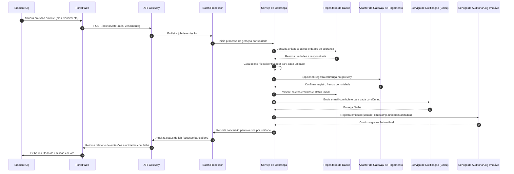

# Relatório Técnico de Arquitetura de Software

## 1. Identificação das HUs
Lista consolidada das Histórias de Usuário e principais critérios de aceite que guiam a arquitetura:

- HU01 — Cadastrar unidades e moradores  
  - Critérios: bloco e número obrigatórios; nome, CPF (único), e-mail obrigatórios; múltiplos moradores por unidade (proprietário/inquilino).  
- HU02 — Emitir boletos em lote  
  - Critérios: mês de referência e vencimento; gerar boleto individual por unidade ativa; envio por e‑mail; indicar falhas individuais.  
- HU03 — Acompanhar inadimplências  
  - Critérios: listar unidades com boletos vencidos; filtros (bloco, período, faixa de atraso); exportar CSV.  
- HU04 — Publicar comunicados  
  - Critérios: título, corpo e data; notificação por e‑mail a todos; fixar comunicado.  
- HU05 — Gerenciar ocorrências  
  - Critérios: listagem com data/unidade/categoria/descrição/status; filtros; notificação por e‑mail em mudanças de status.  
- HU06 — Criar e registrar assembleias  
  - Critérios: notificar condôminos na criação; ata associada à assembleia; anexos (ex.: PDF).  
- HU07 — Gerenciar áreas comuns e reservas  
  - Critérios: configurar regras (horários/antecedência); calendário; cancelar reservas com notificação.  
- HU08 — Visualizar e pagar boleto pelo portal  
  - Critérios: listar boletos por status; visualizar/baixar boleto; atualização automática de status após confirmação.  
- HU09 — Reservar área comum  
  - Critérios: disponibilidade em tempo real; confirmação imediata se disponível; confirmação por e‑mail.  
- HU10 — Registrar e acompanhar ocorrência  
  - Critérios: categoria/descrição/anexo; histórico e notificações por e‑mail.  
- HU11 — Pré‑autorizar entrada de visitante  
  - Critérios: nome e data; visibilidade para portaria; cancelamento permitido.  
- HU12 — Acompanhar assembleias e consultar atas  
  - Critérios: exibir assembleias futuras; baixar atas em PDF.  
- HU13 — Registrar entrada e saída de visitantes  
  - Critérios: nome, documento, unidade e horário; destacar pré‑autorizações; registrar saída.  
- HU14 — Consultar pré‑autorizações de acesso  
  - Critérios: listar pré‑autorizações do dia; filtros; vincular registro de entrada à pré‑autorization.

(Requisitos funcionais RF01–RF33 e RNF01–RNF13 foram considerados no mapeamento das HUs acima.)

---

## 2. Diagramas de Arquitetura (Mermaid)

2.1 Diagrama de sequência: Emissão de boletos em lote (HU02)


2.2 Diagrama de componentes (visão lógica)
```mermaid
graph TD
  subgraph UI
    Portal[Portal Web/Mobile]
    Portaria[Terminal da Portaria]
  end

  subgraph Gateway
    APIGW[API Gateway / Facade]
  end

  subgraph Serviços
    Auth[AuthN/AuthZ]
    User[Gerenciamento de Usuários]
    Unit[Unidades & Moradores]
    Billing[Gestão Financeira e Boletos]
    Payment[Adapter de Pagamento (Gateway)]
    Notifications[Notificações (Email/SMS/Push)]
    Occurrences[Ocorrências]
    Reservations[Reservas & Calendário]
    Visitors[Controle de Acesso / Visitantes]
    Assemblies[Assembleias & Comunicados]
    Scheduler[Scheduler / Batch Processor]
    Reports[Relatórios & Painéis]
    Audit[Audit & Registro Imutável]
    Storage[Armazenamento de Documentos]
    Backup[Serviço de Backup & Retenção]
  end

  subgraph Dados
    DB[Repositório de Dados (modelos)]
    Blob[Armazenamento de Arquivos (atas, anexos)]
  end

  UI -->|HTTPS| APIGW
  Portaria -->|HTTPS / Local API| APIGW
  APIGW --> Auth
  APIGW --> User
  APIGW --> Unit
  APIGW --> Billing
  APIGW --> Occurrences
  APIGW --> Reservations
  APIGW --> Visitors
  APIGW --> Assemblies
  APIGW --> Reports

  Billing --> Payment
  Billing --> DB
  User --> DB
  Unit --> DB
  Occurrences --> DB
  Reservations --> DB
  Visitors --> DB
  Assemblies --> DB
  Reports --> DB

  Notifications -->|envia| Email[(SMTP/Provider)]
  Billing --> Notifications
  Assemblies --> Notifications
  Occurrences --> Notifications
  Reservations --> Notifications

  Audit --> DB
  Billing --> Audit
  Visitors --> Audit
  Occurrences --> Audit

  Storage --> Blob
  Assemblies --> Storage
  Occurrences --> Storage

  Backup --> DB
  Backup --> Blob
```

Observações sobre os diagramas:
- Diagramas expressam componentes lógicos e fluxos principais (emissão de boletos, notificações, persistência e auditoria).  
- Interfaces entre componentes são expostas via APIs internas e adaptadores (ex.: Adapter de Pagamento) para permitir desacoplamento e testes.

---

## 3. Decisões de Arquitetura
As decisões listadas a seguir são conceituais, neutras quanto a produtos, e fundamentam o projeto.

1. Estilo arquitetural: arquitetura modular com serviços lógicos desacoplados (camadas de apresentação, orquestração, domínio e persistência). Favorecer serviços coesos por domínio funcional (billing, reservations, visitors, etc.) para facilitar manutenibilidade e evolução (seção 4 mapeia componentes).

2. API Gateway / Facade: todas as solicitações de UI e portaria passam por um gateway que implementa roteamento, autenticação, autorização, throttling e agregação básica de dados.

3. Contrato e versão de API: expor APIs bem definidas com versionamento; contratos devem incluir comportamento de resposta para operações em lote (reportar sucessos/falhas por item).

4. Integração com gateway de pagamento: encapsular comunicação em um Adapter/Provider (Payment Adapter) que implementa retry, idempotência e tratamento de retorno assíncrono (webhooks). Respeitar RNF03 (PCI-DSS): o sistema não deve armazenar dados sensíveis de cartão; somente tokens/identificadores retornados pelo gateway. Logs com dados sensíveis truncados.

5. Emissão em lote transacional: implementar orquestração com controle de consistência por item e registro imutável de operações (RNF11, RNF05). Em caso de falha parcial, persistir o estado de cada item e gerar relatório detalhado para o síndico.

6. Autenticação e autorização: sessões autenticadas com timeout de 30 minutos de inatividade (RNF01). Senhas armazenadas com hash seguro conforme RNF02 (ex.: algoritmo de derivação resistente a GPU conforme orientação de segurança). Políticas de autorização baseadas em papéis (sindico, condômino, funcionário, administrador) e atributos (por exemplo: acesso a dados apenas da sua unidade).

7. Notificações (e‑mail): filas/processamento assíncrono para envio de e‑mails; confirmar entrega ou falha e reprocessar conforme política. Notificações para publicações, alterações de ocorrência, novidades de assembleia e envio de boletos (HU02, HU04, HU05, HU06).

8. Calendário e reservas: verificar conflitos em tempo real com verificação atômica (lock otimista/controle de concorrência). Regras por área (horário permitido, antecedência mínima/máxima) configuráveis por síndico.

9. Portaria / Terminais offline: permitir operação em modo degradado no terminal da portaria (caching de pré‑autorizações do dia) e sincronização eventual com o sistema central; registrar operações com marcação de origem (portaria) e reconciliar divergências.

10. Auditoria e rastreabilidade: todas as operações financeiras e acessos de visitante geram registro imutável com usuário, data e hora (RNF05, RNF06). Logs críticos exportáveis para compliance e investigação.

11. Backup e retenção: cópias automáticas diárias com retenção mínima de 90 dias (RNF12). Planos de restauração e testes periódicos de backup.

12. Observabilidade e logs: instrumentar eventos críticos (emissão/pagamento de boletos, publicações, atualizações de ocorrências, registros de acesso) com níveis e correlação (IDs de transação). Monitoramento de SLAs e uso para alertas operacionais (RNF07, RNF08).

13. Performance e escalabilidade: camadas sem estado escaláveis horizontalmente (APIs, processamento batch, notificações) para garantir disponibilidade 24/7 e cumprir SLAs de resposta nos painéis (RNF07, RNF08).

14. Proteção de dados e LGPD: implementar controles de minimização e consentimento, acesso baseado em papéis, capacidade de anonimização/exclusão quando exigido, e registro de bases legais para tratamento (RNF04).

15. Exportação de dados e relatórios: endpoints que geram CSV/PDF para exportação; geração assíncrona para relatórios pesados.

---

## 4. Tabela de Componentes e Rastreabilidade

| Componente | Responsabilidade Principal | Comunica-se com | Origem (HU / Critério de Aceite) |
|---|---|---:|---|
| API Gateway / Facade | Autenticação inicial, roteamento, rate limit, agregação de serviços | Frontend, Portaria, Auth, todos os serviços | RF02, RNF01; HU02, HU08 |
| AuthN/AuthZ | Gerenciar autenticação, sessões, rotação de tokens, políticas de acesso por papel | API Gateway, User | RF01, RF03, RNF01, RNF02 |
| User Management | CRUD de usuários, perfis, papéis, senhas (hash) | Auth, DB | RF01, HU01 |
| Unidades & Moradores | Cadastro de unidades, moradores, vínculo, status (ativo/desativado) | User, DB, Visitors | RF04, RF05, RF06, RF07; HU01 |
| Billing & Invoicing | Configurar taxa, gerar boletos individuais e em lote, status do boleto | DB, Payment Adapter, Notifications, Audit, Reports | RF09–RF15; HU02, HU03, HU08 |
| Payment Adapter | Interface com gateway de pagamento (registro/consulta/webhooks) | Billing, External Gateway | RF11, RF12, RNF03; HU02, HU08 |
| Notifications | Envio de e‑mail/SMS/push, filas, templates e retries | Billing, Assemblies, Occurrences, Reservations | RF17, RF16, RF24; HU02, HU04, HU05, HU09 |
| Reservations & Calendar | Cadastro de áreas, regras, reservas, verificação de conflito, calendário | DB, Notifications, Reports | RF25–RF29; HU07, HU09 |
| Occurrences | Registro, categorização, status, histórico, anexos | DB, Notifications, Storage, Audit | RF21–RF24; HU05, HU10 |
| Visitors / Access Control | Pré‑autorizações, registro de entrada/saída, histórico de visitantes | DB, Portaria, Notifications, Audit | RF30–RF33; HU11, HU13, HU14 |
| Assemblies & Communications | Criar assembleias, publicar comunicados, registrar atas e anexos | DB, Notifications, Storage | RF16–RF20; HU04, HU06, HU12 |
| Reports & Dashboards | Painel de inadimplência, exportações CSV, métricas | DB, Billing, Reservations, Reports UI | RF15; HU03 |
| Scheduler / Batch Processor | Jobs periódicos e execução de emissões em lote | Billing, DB, Notifications, Audit | RF13; HU02 |
| Audit & Immutability | Registro imutável de operações críticas e trilhas de auditoria | Todos os serviços, DB | RNF05, RNF06, RNF13 |
| Storage (Blob) | Armazenamento de anexos (atas, comprovantes, fotos) | Assemblies, Occurrences, DB | HU06, HU10 |
| Backup & Retenção | Execução de backups automáticos e retenção | DB, Storage | RNF12 |
| Reporting Exporter | Gerar CSV/PDF para exportação e downloads | Reports, Storage | HU03, HU12 |
| Frontend Portal | Interface web/mobile para moradores e síndico | API Gateway | RNF09, RNF10; diversas HUs |
| Portaria Terminal | Interface para funcionários registrar visitantes e consultar pré‑autorizações | API Gateway | RF30–RF33; HU13, HU14 |

(Notas: "DB" refere‑se ao repositório de dados conceitual. Componentes expõem APIs conceituais e contratos entre si.)

---

## 5. Bloqueios e Pendências
- Definição do contrato técnico e fluxo exato com o Gateway de Pagamento (webhooks, códigos de retorno, tokenização) — impacto direto em Billing e Payment Adapter. (pendência: especificação do protocolo/assinatura de webhooks)
- Políticas detalhadas de retenção e anonimização para conformidade LGPD (ex.: quando e como anonimizar históricos de moradores/visitantes). (pendência: decisão legal/compliance)
- Requisitos de disponibilidade do terminal da portaria (modo offline, janela de sincronização) não estão quantitativamente especificados. (pendência: definir janela offline e SLA de reconciliação)
- Requisitos de SLA de entrega de notificações (e‑mail) e estratégia de fallback (SMS/Push) não especificados. (pendência: política de retry e canais alternativos)
- Formato dos boletos (dados obrigatórios, layout, instruções de pagamento) e necessidade de integrações bancárias regionais não estão detalhados. (pendência: especificação do layout e regras fiscais/tributárias locais)
- Política de retenção de logs de auditoria/registro imutável (por quanto tempo armazenar e sob quais condições disponibilizar). (pendência: definição de retenção e acesso para auditoria)

---

## 6. Cobertura de Requisitos
Mapeamento dos principais requisitos (RF/RNF) para componentes e decisões arquiteturais:

- RF01, RF03 (Cadastro e Auth): Coberto por User Management e AuthN/AuthZ; API Gateway centraliza autenticação e sessão (RNF01).
- RF02 (Controle de acesso): Coberto via AuthZ, políticas de papel/atributo; APIGW aplica controle e validação.
- RF04–RF08 (Unidades, Moradores, Veículos): Coberto por Unidades & Moradores; Storage para anexos; permitir desativação mantendo histórico (HU01).
- RF09–RF15 (Financeiro/Boletos): Coberto por Billing & Invoicing, Scheduler, Payment Adapter, Notifications e Audit. RNF05 (registro imutável) e RNF11 (transacionalidade de lotes) atendidos por Audit e orquestração com granularidade por item.
- RF16–RF20 (Comunicados e Assembleias): Coberto por Assemblies & Communications e Notifications; Storage para atas e anexos.
- RF21–RF24 (Ocorrências): Coberto por Occurrences, Notifications e Storage; Audit registra mudanças (RNF13).
- RF25–RF29 (Reservas): Coberto por Reservations & Calendar com lógica de conflito e regras configuráveis; Reports para calendário do síndico.
- RF30–RF33 (Visitantes): Coberto por Visitors/Access Control e Portaria Terminal; histórico armazenado e disponível ao síndico (RNF06).
- RNF01–RNF03 (Segurança): Sessões 30 min implementadas em Auth; senhas armazenadas com hash seguro (RNF02); pagamento atende a diretrizes de não armazenar dados de cartão (RNF03) via Payment Adapter.
- RNF04 (LGPD): Cobertura conceitual via controle de acesso, minimização e políticas de anonimização (pendência para detalhamento jurídico).
- RNF05–RNF06–RNF13 (Rastreabilidade / Logs): Cobertos por Audit & Immutability e logs de eventos críticos.
- RNF07–RNF08 (Disponibilidade/Desempenho): Coberto por arquitetura escalável, componentes sem estado, e otimizações nos painéis; medidas operacionais necessárias para cumprir 99,5% e 3s no painel (tuning e capacity planning).
- RNF09–RNF10 (Usabilidade/Compatibilidade): Coberto por Frontend responsivo; testes multi‑browser necessários.
- RNF11 (Emissão de lote transacional): Coberto por orquestração itemizada e registro de falhas por unidade.
- RNF12 (Backup): Coberto por componente Backup & Retenção.

Cobertura das HUs: todas as HUs (HU01–HU14) possuem componente(s) atribuídos conforme a tabela da seção 4; rastreabilidade direta das funcionalidades essenciais.

---

## 7. Gap Analysis

Identificação de lacunas na especificação, impacto arquitetural e recomendações:

1. Gap: Especificação incompleta do protocolo de integração com o gateway de pagamento (formatos, webhooks, idempotência, tratamento de erros).
   - Impacto: Implementação do Payment Adapter fica ambígua; risco de tradução incorreta de estados de pagamento (pago, pendente, estornado).
   - Recomendação: Obter documento técnico do(s) gateway(s) alvo(s) com exemplos de payloads, códigos de erro, requisitos de segurança (assinatura HMAC), e definir cenários de teste (webhook replay, casos de falha parcial).

2. Gap: Política de conformidade LGPD incompleta (base legal, prazos para exclusão/anonymização, consentimento para comunicações).
   - Impacto: Requisitos de retenção e processos de exclusão/anonymização podem afetar a modelagem de dados e a auditoria imutável.
   - Recomendação: Conduzir sessão com jurídico/compliance para definir fluxos de dados pessoais, registros que não podem ser deletados e processos de anonimização. Definir API para "requisição de exclusão" e fluxos de reenquadramento de dados.

3. Gap: Critérios de disponibilidade e recuperação para terminais da portaria (offline behavior, tolerância de sincronização).
   - Impacto: Necessidade de cache local e reconcile aumenta complexidade do componente Visitors e portaria; riscos de inconsistência temporária.
   - Recomendação: Definir requisitos de funcionalidade offline (quais operações permitidas), janela máxima de sincronização e política de resolução de conflitos.

4. Gap: Especificação de formato e normas para boletos (detalhes fiscais e de apresentação).
   - Impacto: Layout da ordem de pagamento e dados obrigatórios podem variar; obriga maior flexibilidade no módulo de geração de boletos.
   - Recomendação: Definir modelo de boleto e regras locais; desacoplar gerador de documento em módulo parametrizável por parâmetros regionais.

5. Gap: Falta de metas de SLA para entrega de notificações e comportamento de retry.
   - Impacto: Dificulta definição de estratégia para Notifications (prioridade de canais, fallback, timeout).
   - Recomendação: Estabelecer objetivos de entrega por canal (ex.: 95% entrega de e‑mail em 15 minutos) e políticas de fallback (SMS, notificação no portal).

6. Gap: Requisitos não detalham requisitos de testes de carga e escalabilidade (nº de usuários simultâneos esperados).
   - Impacto: Planejamento de capacidade para cumprir RNF07 e RNF08 fica incerto.
   - Recomendação: Recolher estimativas de tráfego (usuários ativos/consulta de painel) e definir cenários de teste (picos mensais: emissão de boletos, acesso em horários de assembleia).

7. Gap: Política detalhada de retenção e acesso a logs de auditoria imutável.
   - Impacto: Pode conflitar com LGPD e requisitos legais; tamanho de armazenamento e custo operacional indefinidos.
   - Recomendação: Definir período mínimo de retenção de logs, critérios para acesso (apenas administradores com justificativa), e exportabilidade para auditoria externa.

8. Gap: Requisitos de segurança operacional (varredura de vulnerabilidades, gestão de segredos, rotação de chaves) não especificados.
   - Impacto: Risco de exposição de credenciais (por exemplo, credenciais do gateway de pagamento) e falhas de segurança.
   - Recomendação: Definir políticas de gestão de segredos, rotação e pentests periódicos como parte do pipeline de entrega.

9. Gap: Não há definição de contratos de dados entre Frontend e Backend (campos, validações, códigos de erro).
   - Impacto: Pode gerar retrabalho entre equipes de frontend e backend.
   - Recomendação: Produzir especificações de API (ex.: OpenAPI/Swagger conceitual) com modelos de resposta/erro e exemplos.

10. Gap: Processos de reconciliação de pagamentos manuais (RF14) não detalhados (comprovantes, validação, conciliação contábil).
    - Impacto: Risco de inconsistência nos saldos e no painel de inadimplência.
    - Recomendação: Definir fluxo de registro manual de pagamento com upload de comprovante, processo de validação e auditoria, e integração com relatório financeiro.

Ações de curto prazo recomendadas ao time:
- Priorizar obtenção de documentação do gateway de pagamento e definição de políticas de notificação e backups.  
- Realizar workshop com jurídico para LGPD e retenção de dados.  
- Produzir contratos de API e modelos de dados para as áreas críticas (boletos, reservas, visitantes).  
- Definir testes de carga e um plano de capacity planning para cumprir RNFs.

---

Observações finais concisas:
- O desenho proposto mantém neutralidade tecnológica e prioriza modularidade, segurança e rastreabilidade conforme RNFs.  
- Resolver as pendências listadas (pagamento, LGPD, terminais de portaria e políticas de notificação/backup) é crítico para reduzir riscos de implementação e para garantir conformidade e disponibilidade.