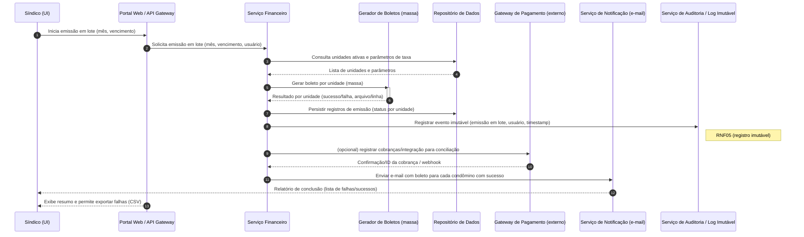

# Relatório Técnico de Arquitetura de Software

## 1. Identificação das HUs

Lista de Histórias de Usuário (HU) recebidas e mapeamento rápido aos requisitos funcionais (RF) relevantes.

- HU01 — Cadastrar unidades e moradores  
  - Resumo: CRUD de unidades e moradores; vínculo e papéis (proprietário/inquilino); CPF único.  
  - RF relevantes: RF04, RF05, RF06, RF07, RNF04 (LGPD).

- HU02 — Emitir boletos em lote  
  - Resumo: Emissão de boletos por mês para todas unidades, notificação por e‑mail; relatório de falhas.  
  - RF relevantes: RF09, RF10, RF11, RF12, RF13, RF15, RNF03, RNF05, RNF11, RNF13.

- HU03 — Acompanhar inadimplências  
  - Resumo: Painel de inadimplência com filtros e export CSV.  
  - RF relevantes: RF15, RF10, RF12, RNF08, RNF05.

- HU04 — Publicar comunicados  
  - Resumo: Publicação e notificação por e‑mail; fixar comunicados.  
  - RF relevantes: RF16, RF17, RNF13.

- HU05 — Gerenciar ocorrências  
  - Resumo: Registrar/encaminhar/categorizar/atualizar ocorrências com histórico e notificações.  
  - RF relevantes: RF21, RF22, RF23, RF24, RNF13.

- HU06 — Criar e registrar assembleias  
  - Resumo: Agendamento, notificação, ata e anexos.  
  - RF relevantes: RF18, RF19, RF20, RNF13.

- HU07 — Gerenciar áreas comuns e reservas  
  - Resumo: Cadastro de áreas, regras de reserva, calendário e cancelamentos.  
  - RF relevantes: RF25, RF26, RF27, RF28, RF29, RNF08.

- HU08 — Visualizar e pagar boleto pelo portal  
  - Resumo: Acesso a boletos, download e atualização de status.  
  - RF relevantes: RF10, RF11, RF12, RNF03, RNF08.

- HU09 — Reservar área comum  
  - Resumo: Reserva em tempo real, confirmação imediata, e‑mail de confirmação.  
  - RF relevantes: RF25, RF26, RF27, RF28, RNF08.

- HU10 — Registrar e acompanhar ocorrência  
  - Resumo: Registro com fotos, histórico de status, notificações.  
  - RF relevantes: RF21, RF23, RF24, RNF13.

- HU11 — Pré-autorizar entrada de visitante  
  - Resumo: Pré‑autorização visível na portaria, cancelamento.  
  - RF relevantes: RF31, RF32, RNF06.

- HU12 — Acompanhar assembleias e consultar atas  
  - Resumo: Visualização de assembleias e download de atas (PDF).  
  - RF relevantes: RF18, RF19, RF20.

- HU13 — Registrar entrada e saída de visitantes  
  - Resumo: Registro de entrada/saída por funcionário; ligação a pré‑autorização.  
  - RF relevantes: RF30, RF31, RF32, RF33, RNF06.

- HU14 — Consultar pré-autorizações de acesso  
  - Resumo: Listagem filtrável para o funcionário e vinculação ao registro de visita.  
  - RF relevantes: RF31, RF32, RNF06.

Observação: todos os HUs que envolvem autenticação/controle de perfis estão relacionados a RF01–RF03 e RNF01–RNF02.

---

## 2. Diagramas de Arquitetura (Mermaid)

Abaixo seguem dois diagramas em Mermaid: um diagrama de sequência (complete, com autonumber) cobrindo a emissão de boletos em lote (HU02) e um diagrama de componentes que mostra os módulos conceituais e interfaces entre eles.

Diagrama de sequência — Emissão de boletos em lote (HU02)


Diagrama de componentes — visão conceitual
```mermaid
graph LR
  subgraph UI
    Portal[Portal Web / Mobile]
  end

  subgraph Backend
    Auth[Serviço de Autenticação & Autorizações]
    Users[Gestão de Usuários & Perfis]
    Units[Gestão de Unidades & Moradores]
    Finance[Serviço Financeiro / Boletos]
    Payments[Integração com Gateway de Pagamento]
    Notif[Serviço de Notificações (e-mail/sms)]
    Occ[Gestão de Ocorrências]
    Reservations[Reservas & Calendário de Áreas Comuns]
    Access[Controle de Acesso & Visitantes]
    Assemblies[Assembleias & Atas]
    Reports[Relatórios & Painéis]
    Audit[Auditoria & Logs Imutáveis]
    Backup[Serviço de Backup / Retenção]
    Storage[Armazenamento de Documentos (atas, anexos, fotos)]
  end

  Portal -->|API| Auth
  Auth --> Users
  Users --> Units
  Units --> Finance
  Finance --> Payments
  Finance --> Audit
  Finance --> Notif
  Units --> Reservations
  Reservations --> Storage
  Reservations --> Audit
  Portal --> Occ
  Occ --> Audit
  Portal --> Access
  Access --> Audit
  Access --> Storage
  Portal --> Assemblies
  Assemblies --> Storage
  Reports --> Audit
  Backup --> Storage
  Backup --> Audit
  Notif --> Storage
  Payments -->|Webhook/Consulta| Finance
```

Observações sobre diagramas:
- Todos os participantes e componentes são conceituais e descritos de forma neutra (sem tecnologias específicas).  
- Interfaces externas claramente identificadas: Gateway de Pagamento, Serviço de Notificação (e‑mail), armazenamento de documentos.  
- Audit representa o requisito de registros imutáveis e logs críticos (RNF05, RNF06, RNF13).

---

## 3. Decisões de Arquitetura

1. Modularização por subdomínio funcional  
   - Separar o sistema em módulos/coisas: Autenticação, Gestão de Usuários/Unidades, Financeiro, Reservas, Ocorrências, Controle de Acesso, Assembleias, Notificações, Auditoria, Relatórios e Backup.  
   - Racional: isolamento de responsabilidade, limites claros para escalabilidade e segurança.

2. APIs internas bem definidas e contrato de integridade  
   - Comunicação entre módulos por interfaces/contratos (REST/HTTP ou RPC conceitual) com versionamento.  
   - Racional: evolução independente dos módulos e clareza de responsabilidades.

3. Garantia de consistência transacional para emissão em lote (RNF11)  
   - Emitir boletos em modo transacional lógico: cada unidade gera um registro atômico; a operação de lote deve produzir um manifesto detalhado de sucesso/falha por unidade. Em caso de falha parcial, não destruir dados válidos; registrar compensações e falhas.  
   - Racional: cumprir RNF11 e permitir reprocessamento manual/automático de falhas.

4. Tratamento de confirmações do gateway de pagamento (eventual consistency)  
   - Confirmações de pagamento podem chegar por callback/webhook; o sistema aplica atualização idempotente do status do boleto e registra evento imutável (RNF05).  
   - Racional: robustez frente a retries e latência do provedor externo.

5. Auditoria imutável e rastreabilidade  
   - Toda emissão, pagamento, registro manual de pagamento, publicação de comunicado, atualização de ocorrência e entrada de visitante gera um evento de auditoria com identidade do usuário e timestamp (RNF05, RNF06, RNF13). Eventos armazenados de forma append-only e exportáveis.

6. Segurança e conformidade com LGPD (RNF04)  
   - Minimização de dados pessoais, consentimento/propósito, retenção configurável, mecanismos de anonimização/exportação quando requerido. Senhas armazenadas com hashing seguro (conceito: algoritmo de hashing forte — RNF02). Sessões expiradas automaticamente após 30 minutos de inatividade (RNF01).

7. Notificações desacopladas (async)  
   - Envio de e‑mail/alerta via fila/serviço de notificação para não bloquear operações críticas (ex.: emissão em lote). Confirmação de envio e fallback (retry) com log.

8. Backup e retenção  
   - Backups automáticos diários com retenção mínima de 90 dias (RNF12). Testes periódicos de restauração.

9. Escalabilidade e desempenho  
   - Componentes com alto consumo (Finance, Notif, Reservations, Reports) projetados para escalar horizontalmente e possibilitar caching em camadas de leitura para painéis, observando validade e confidencialidade dos dados.

10. Conciliação financeira e segurança do gateway (RNF03)  
   - Não armazenar dados sensíveis de cartão; manter integração conforme diretrizes de conformidade de processamento de pagamentos. Registrar IDs de transação do gateway para conciliação.

11. Gestão de arquivos (atas, anexos, fotos)  
   - Controle de acesso e auditoria para download; metadados versionados e políticas de retenção para cumprimento da LGPD e espaço.

---

## 4. Tabela de Componentes e Rastreabilidade

| Componente | Responsabilidade Principal | Comunica-se com | Origem (HU / Critério de Aceite) |
|---|---|---:|---|
| Portal Web / Mobile (UI) | Interface para síndico, condômino e funcionário; envio de comandos e exibição de painéis | Auth, Users, Units, Finance, Reservations, Occ, Access, Assemblies, Notif | HU01–HU14 |
| Serviço de Autenticação & Autorizações | Login, logout, sessões, controle de perfis, expiração de sessão 30min (RNF01) | Portal, Users | RF01, RF02, RF03, RNF01, RNF02 |
| Gestão de Usuários & Perfis | CRUD de usuários, perfis (síndico, condômino, funcionário, admin) | Auth, Units | RF01, RF02, HU01 |
| Gestão de Unidades & Moradores | CRUD de unidades, vínculo de moradores, status (ativo/inativo), veículos | Users, Storage, Reservations, Reports | RF04–RF08, HU01 |
| Serviço Financeiro / Boletos | Configuração de taxas, geração de boletos unitários e em lote, estado de boletos | Repositório, BoletoGenerator, Payments, Notif, Audit | RF09–RF15, HU02, HU03, HU08 |
| Gerador de Boletos (módulo) | Produção de arquivo/representação de boleto por unidade | Serviço Financeiro, Storage | RF10, RF13, HU02, HU08 |
| Integração com Gateway de Pagamento | Comunicação externa para processamento / conciliação de pagamentos | Serviço Financeiro (webhooks) | RF11, RF12, RNF03, HU02, HU08 |
| Serviço de Notificações | Envio de e‑mail/sms/alertas e templates, retries | Portal, Serviço Financeiro, Reservations, Occ, Assemblies | RF17, HU02, HU04, HU06, HU09, HU10 |
| Gestão de Ocorrências | Registro, categorização, atualização e histórico de ocorrências; anexos | Portal, Notif, Audit, Storage | RF21–RF24, HU05, HU10 |
| Reservas & Calendário | Cadastro de áreas, regras, bloqueio de sobreposições, calendário por área | Units, Storage, Notif, Audit | RF25–RF29, HU07, HU09 |
| Controle de Acesso & Visitantes | Pré‑autorizações, registro de entrada/saída, histórico por unidade | Portal, Auth, Notif, Audit, Storage | RF30–RF33, HU11–HU14 |
| Assembleias & Atas | Agendamento, notificações, upload/consulta de atas (PDF) | Portal, Storage, Notif, Audit | RF18–RF20, HU06, HU12 |
| Relatórios & Painéis (Inadimplência, Calendário) | Geração de painéis, filtros, export CSV, performance (<=3s) | Repositório, Audit, Portal | RF15, RF29, RNF08, HU03 |
| Auditoria & Logs Imutáveis | Registro append-only de operações críticas (financeiras, acessos, alterações) | Todos os módulos | RNF05, RNF06, RNF13 |
| Repositório de Dados (conceitual) | Persistência de entidades (unidades, usuários, boletos, reservas, ocorrências) | Todos os módulos | Todas as HUs relacionadas a CRUD/consulta |
| Armazenamento de Documentos | Armazenamento de atas, anexos, fotos; controle de acesso | Assemblies, Occ, Reservations, Portal | HU06, HU10, HU07 |
| Backup & Retenção | Execução de backups diários e políticas de retenção (>=90 dias) | Repositório, Storage, Audit | RNF12 |
| Serviço de Filas/Async (conceitual) | Desacoplar notificações, processamento de lote, integração | Finance, Notif, Reports, Reservations | HU02, HU04, HU09 |

Observações:
- "Repositório de Dados" e "Armazenamento de Documentos" são conceitos neutros (persistência primária e armazenamento de arquivos).  
- Auditoria centraliza registros imutáveis exigidos pelos RNFs.

---

## 5. Bloqueios e Pendências

Itens que requerem decisões, esclarecimentos ou entradas externas antes de detalhar a implementação:

1. Seleção do gateway de pagamento e escopo da integração  
   - Impacto: determina protocolo do webhook, formatos, suporte a conciliação e limites de taxa; necessário para especificar handlers e segurança (RNF03, RNF05).

2. Política de cálculo de taxas e multas por atraso  
   - Impacto: regras de negócio para geração de boletos, juros/multa, e retroatividade; afeta Finance e relatórios.

3. Requisitos legais/operacionais detalhados sobre LGPD  
   - Impacto: políticas de retenção, anonimização, fluxo para solicitações de titulares (ex.: direito de apagar/portabilidade) e logs de consentimento.

4. Provedor/estratégia de envio de e‑mail (SLAs, limites)  
   - Impacto: entrega de notificações em massa (boleto em lote, comunicados, assembleias); estratégia de retry e filas.

5. Política de retenção de documentos e tamanhos máximos de anexos  
   - Impacto: dimensionamento de armazenamento, rotina de backup/cleanup.

6. Acordo de níveis de serviço e infraestrutura para atingir 99,5% uptime (RNF07)  
   - Impacto: planejamento de alta disponibilidade, monitoramento e failover; definir responsáveis por SRE/infra.

7. Requisitos de auditabilidade detalhados (consultas, exportações, retenção imutável)  
   - Impacto: design de armazenamento append-only e controles de acesso.

8. Detalhes de regras de reservas (horários permitidos, antecedência mínima/máxima por área)  
   - Impacto: validações de negócio e lógica de bloqueio de sobreposição (RF27, HU07).

9. Padrões de autenticação desejados (2FA, SSO)  
   - Impacto: política de segurança e UX relacionados a Auth.

---

## 6. Cobertura de Requisitos

Resumo de cobertura por categoria; indica onde cada requisito é atendido conceptualmente.

- Gestão de Usuários e Acesso (RF01–RF03; RNF01, RNF02)  
  - Coberto por: Auth, Users. Sessão expira 30 minutos (RNF01). Senhas com hash seguro (RNF02). Controle de perfis em Users/Authorizations.

- Gestão de Unidades e Moradores (RF04–RF08; RNF04)  
  - Coberto por: Units, Users, Storage. Suporte para múltiplos moradores por unidade, marcação proprietário/inquilino, desativação sem perda de histórico. Políticas de LGPD aplicadas.

- Financeiro — Boletos (RF09–RF15; RNF03, RNF05, RNF11, RNF13)  
  - Coberto por: Finance, Gerador de Boletos, Payments, Audit, Notif, Repositório. Emissão unitária e em lote, integração com gateway, atualização automática por webhook, painel de inadimplência e export CSV. Emissão em lote transacional lógico com manifesto de falhas (RNF11). Auditoria de todas operações financeiras (RNF05).

- Comunicados e Assembleias (RF16–RF20; RNF13)  
  - Coberto por: Assemblies, Notif, Portal, Storage, Audit. Publicação e notificação por e‑mail; anexos e atas armazenadas.

- Ocorrências (RF21–RF24; RNF13)  
  - Coberto por: Occ, Notif, Storage, Audit. Registro com anexos, categorização, histórico e notificações sobre status.

- Reserva de Áreas Comuns (RF25–RF29; RNF08)  
  - Coberto por: Reservations, Units, Notif, Storage. Bloqueio de sobreposição garantido pela lógica de reserva; filtros e calendário. Painel e API projetados para resposta em <=3s para carregamento (RNF08).

- Controle de Acesso e Visitantes (RF30–RF33; RNF06)  
  - Coberto por: Access, Portal, Audit, Storage. Pré‑autorizações visíveis aos funcionários, registros de entrada/saída, histórico por unidade.

- Requisitos não funcionais adicionais  
  - Disponibilidade 99,5% (RNF07): arquitetura projetada para redundância e escalabilidade; detalhes de infra pendentes.  
  - Backups diários com retenção >=90 dias (RNF12): Backup & Retenção componente.  
  - Logs críticos e rastreabilidade (RNF13, RNF05, RNF06): Audit central fornece registros append-only.

Cobertura HU → componentes (resumo):
- HU01: Units, Users
- HU02/HU08: Finance, BoletoGenerator, Payments, Notif, Audit
- HU03: Reports, Repositório, Audit
- HU04: Assemblies/Comunicados, Notif, Portal
- HU05/HU10: Occ, Notif, Storage, Audit
- HU06/HU12: Assemblies, Storage, Notif
- HU07/HU09: Reservations, Units, Notif
- HU11/HU13/HU14: Access, Portal, Audit

---

## 7. Gap Analysis

Lista de lacunas na especificação, impacto arquitetural e recomendações de ação (priorizadas).

1. Lacuna: Regras de cálculo de taxa condominial, multas e juros (variantes por unidade/tipo)  
   - Impacto: Afeta emissão de boletos, relatórios e históricos financeiros.  
   - Recomendação: Definir fórmula(s) exatas, regimes de arredondamento, periodicidade de aplicação e se há cobranças extras (rateios). Documentar casos de exceção.

2. Lacuna: Formato e requisitos legais do boleto (layout, dados obrigatórios, aceitação bancária)  
   - Impacto: Integração com gerador de boletos; conformidade e aceitação por instituições de pagamento.  
   - Recomendação: Especificar o layout/standard requerido e campos mínimos a serem gerados; listar validações.

3. Lacuna: Comportamento em caso de disputa/pagamento revertido (chargeback/reembolso)  
   - Impacto: Necessidade de fluxos de conciliação e reversão, impactos no painel de inadimplência e auditoria.  
   - Recomendação: Definir processos para reabertura de boleto, marcação de cobrança contestada e notificações.

4. Lacuna: SLA e limites do provedor de e‑mail / volumetria de notificações (emissões em lote)  
   - Impacto: Possíveis gargalos e filas; necessidade de fallback.  
   - Recomendação: Estimar volume mensal/diário de e‑mails e definir política de retries, backoff e filas.

5. Lacuna: Regras detalhadas de reserva (p.ex., duração máxima, bloqueios múltiplos, políticas de cancelamento)  
   - Impacto: Lógica de bloqueio de sobreposição e UX.  
   - Recomendação: Definir políticas por área (horários, antecedência, multas de cancelamento).

6. Lacuna: Requisitos de escalabilidade e dimensionamento para cumprir 99,5% uptime  
   - Impacto: Aglutina decisões de infra/replicação e monitoramento.  
   - Recomendação: Definir objetivos de RTO/RPO, métricas de monitoramento e plano de capacidade.

7. Lacuna: Política de retenção e anonimização para cumprimento da LGPD (logs, backups, documentos)  
   - Impacto: Armazenamento, backups e processos de atendimento a titulares.  
   - Recomendação: Definir prazos por tipo de dado e processos para solicitações de titular.

8. Lacuna: Requisitos de performance detalhados além do painel (ex.: latência aceitável de APIs críticas)  
   - Impacto: Planos de caching e escalabilidade.  
   - Recomendação: Definir SLIs/SLOs para endpoints críticos (emitir boleto, reservar área, autenticar).

9. Lacuna: Conformidade e testes de segurança (pen tests, criptografia em trânsito/repouso)  
   - Impacto: Projetos de segurança, certificações e auditorias.  
   - Recomendação: Estabelecer requisitos mínimos de criptografia e plano de testes.

10. Lacuna: Definição de metadados e limites para anexos (formatos, tamanho máximo, retenção)  
    - Impacto: Requisitos de storage e UX de upload.  
    - Recomendação: Definir limites e validar no front/back.

11. Lacuna: Política de acesso granular / matriz de permissões (ex.: quais ações síndico vs admin vs funcionário podem executar)  
    - Impacto: Autorização e segurança.  
    - Recomendação: Criar matriz de permissões detalhada para todas as operações administrativas.

Passos recomendados imediatos:
- Workshop com stakeholders (síndicos, administradora, financeiro, portaria) para definir regras de negócio pendentes (taxas, reservas, políticas de cancelamento).
- Escolha do gateway de pagamento e provedor de e‑mail para detalhar integrações e SLAs.
- Definição de políticas de LGPD e de retenção de dados com apoio jurídico.
- Especificação de testes de performance e segurança como parte do plano de QA.

---

Fim do Relatório.