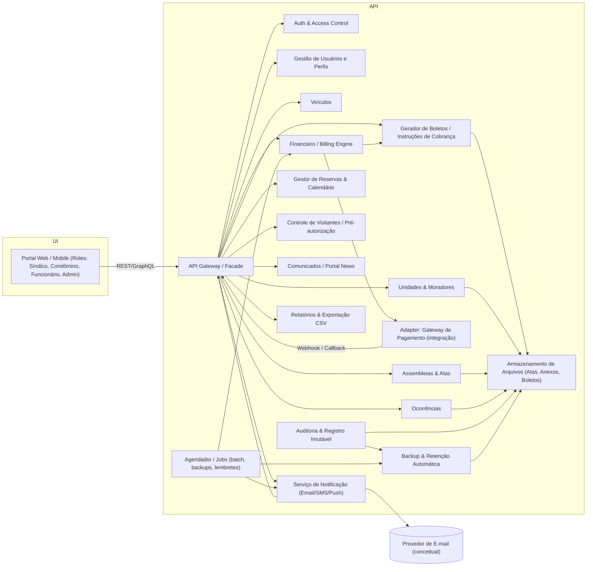

# Relatório Técnico de Arquitetura de Software

## 1. Identificação das HUs

Lista das Histórias de Usuário (HU) identificadas e capacidades principais envolvidas:

- HU01 — Cadastrar unidades e moradores
  - Capacidade: Gestão de Unidades, Moradores e Vínculos (proprietário/inquilino).
- HU02 — Emitir boletos em lote
  - Capacidade: Emissão de cobranças em lote, geração de boletos, integração com gateway, notificação por e-mail, relatórios de falhas.
- HU03 — Acompanhar inadimplências
  - Capacidade: Painel financeiro, consultas e exportação CSV.
- HU04 — Publicar comunicados
  - Capacidade: Publicação/Notificação de comunicados, fixação no portal.
- HU05 — Gerenciar ocorrências
  - Capacidade: Registro/categorização/fluxo de ocorrências, notificações por mudança de status.
- HU06 — Criar e registrar assembleias
  - Capacidade: Agenda de assembleias, notificação, upload/associação de atas e anexos.
- HU07 — Gerenciar áreas comuns e reservas
  - Capacidade: Cadastro de áreas, regras de reserva, calendário e cancelamento.
- HU08 — Visualizar e pagar boleto pelo portal
  - Capacidade: Visualização/download de boletos, atualização automática de status após confirmação.
- HU09 — Reservar área comum
  - Capacidade: Reserva em tempo real, confirmação e notificação.
- HU10 — Registrar e acompanhar ocorrência
  - Capacidade: Abertura de ocorrência com anexos, rastreamento de histórico e notificações.
- HU11 — Pré-autorizar entrada de visitante
  - Capacidade: Pré-autorização de visitantes, visibilidade para portaria, cancelamento.
- HU12 — Acompanhar assembleias e consultar atas
  - Capacidade: Listagem e download de atas e assembleias agendadas.
- HU13 — Registrar entrada e saída de visitantes
  - Capacidade: Registro de entrada/saída com vínculo a pré‑autorizações, histórico consultável.
- HU14 — Consultar pré-autorizações de acesso
  - Capacidade: Consulta e vinculação de pré‑autorizações no momento do registro.

Observação: cada HU será atendida por um conjunto de componentes modulares descritos nas Seções 2 e 4.

---

## 2. Diagramas de Arquitetura (Mermaid)

Abaixo há dois diagramas Mermaid: 1) diagrama de sequência completo com autonumber cobrindo o fluxo crítico de HU02 (emissão de boletos em lote) incluindo caminho de erro/registro de falhas; 2) diagrama de componentes mostrando os módulos e suas interfaces conceituais.

Diagrama de Sequência — Emissão de boletos em lote (HU02)
```mermaid
sequenceDiagram
autonumber
participant Síndico
participant Portal
participant BatchService as "Serviço de Emissão em Lote"
participant UnitService as "Serviço de Unidades"
participant BillingEngine as "Motor de Cálculo de Taxas"
participant BoletoGen as "Gerador de Boletos"
participant PaymentAdapter as "Adapter Gateway de Pagamento"
participant EmailService as "Serviço de Notificação (E-mail)"
participant Audit as "Serviço de Auditoria/Registro Imutável"

Síndico->>Portal: Solicita emissão em lote (mêsRef, vencimento)
Portal->>BatchService: Enfileira job de emissão (mêsRef, vencimento, usuário)
BatchService->>UnitService: Recuperar unidades ativas e dados de responsáveis
UnitService-->>BatchService: Lista de unidades e contatos
BatchService->>BillingEngine: Calcular valores por unidade (regras, tipos)
BillingEngine-->>BatchService: Valores por unidade
alt Para cada unidade
  BatchService->>BoletoGen: Gerar boleto (dados unidade, valor, vencimento)
  BoletoGen-->>BatchService: Boleto gerado (PDF/ID/metadata)
  BatchService->>PaymentAdapter: Registrar instrução de pagamento (opcional / cobrança eletrônica)
  PaymentAdapter-->>BatchService: Confirmação registro / erro
  alt Registro OK
    BatchService->>EmailService: Enviar boleto por e-mail ao condômino
    EmailService-->>BatchService: Entrega OK / falha
    BatchService->>Audit: Registrar emissão (imutável)
    Audit-->>BatchService: OK
  else Falha parcial (geração / gateway / e-mail)
    BatchService->>Audit: Registrar falha específica (unidade, causa)
    Audit-->>BatchService: OK
  end
end
BatchService->>Portal: Retornar relatório de execução (sucessos/falhas)
Portal-->>Síndico: Exibir relatório; permitir download CSV das falhas
```

Diagrama de Componentes — Visão Conceitual


---

## 3. Decisões de Arquitetura

Decisões principais, justificativas e implicações:

1. Arquitetura modular por domínios funcionais (bounded contexts)
   - Domínios: Autenticação/Autorização, Cadastro (Unidades/Moradores/Veículos), Financeiro (Emissão/Registro/Conciliação), Comunicações, Ocorrências, Reservas, Visitantes, Assembleias, Auditoria/Backup.
   - Justificativa: separação clara de responsabilidades facilita governança, evolução e testes; atende requisitos de segurança e rastreabilidade.

2. Interfaces bem definidas via APIs internas e eventos assíncronos
   - Sincronização via APIs para consultas/ações críticas; eventos assíncronos para notificações (ex.: publicação de comunicado, confirmação de pagamento).
   - Justificativa: desacoplamento, escalabilidade e garantia de entrega de notificações; permite processamento assíncrono de lote.

3. Orquestração transacional para emissão em lote com lógica de compensação parcial
   - A emissão em lote será tratada por um componente de orquestração que registra resultados unitários e garante atomicidade lógica (não necessariamente ACID distribuído): em caso de falhas, registrar quais unidades falharam e não corromper os demais.
   - Justificativa: atende RNF11 (transacionalidade lógica) e critérios da HU02.

4. Registro imutável para operações financeiras e logs de acesso de visitantes
   - Todos os eventos financeiros e acessos de visitantes são registrados com metadados (usuário, timestamp) e imutáveis (append-only) para auditoria e conformidade (RNF05, RNF06, RNF13).
   - Justificativa: rastreabilidade e conformidade regulamentar.

5. Integração com gateway de pagamento via adapter e webhooks
   - O sistema não armazena dados de cartão (RNF03); utiliza adapter para registrar instruções e tratar callbacks/confirmations.
   - Justificativa: cumprir PCI-DSS e permitir troca de provedores sem impactar domínio financeiro.

6. Sessões curtas e hash seguro de senhas
   - Sessões inativas encerradas após 30 minutos; senhas armazenadas com hash seguro (RNF01, RNF02).
   - Justificativa: atende requisitos de segurança.

7. Escalabilidade e performance para painéis críticos
   - Cache conceitual para painéis (inadimplência, calendário) e índices adequados para consultas; consultas precomputadas/aggregations para manter tempo de resposta <=3s (RNF08).
   - Justificativa: atender RNF08.

8. Políticas de privacidade e anonimização/configuração para LGPD
   - Fornecer mecanismos para exportação/eliminação de dados pessoais mediante solicitações compatíveis com LGPD e retenção mínima explícita.
   - Justificativa: conformidade (RNF04).

9. Armazenamento de arquivos e backup com retenção mínima de 90 dias
   - Arquivos (atas, PDFs, imagens) versionados e submetidos a backup automático diário com retenção >=90 dias (RNF12).
   - Justificativa: disponibilidade de documentos e conformidade de backup.

10. Monitoramento e SLA operacional para disponibilidade 99,5%
    - Monitoramento dos componentes críticos (APIs, scheduler, adapter de pagamento) com alertas e runbooks operacionais; capacidade de escalonamento automático conceitual.
    - Justificativa: atender RNF07.

Observação: as decisões são tecnológicas neutras — descrevem responsabilidades e padrões de integração sem prescrever produtos ou frameworks específicos.

---

## 4. Tabela de Componentes e Rastreabilidade

| Componente | Responsabilidade Principal | Comunica-se com | Origem (HU / Critério de Aceite) |
|---|---:|---|---|
| API Gateway / Facade | Expor APIs unificadas, roteamento, autenticação inicial, throttling conceitual | UI Portal, Auth, todos os serviços | Geral / RNF01, RNF07 |
| Auth & Access Control | Autenticação, autorização por perfil, gestão de sessão (timeout 30min) | API Gateway, Users | RF01, RF02, RF03 / RNF01, RNF02 |
| Gestão de Usuários e Perfis (Users) | CRUD de usuários, perfis (síndico, condômino, funcionário, admin) | Auth, Units, Notifications | RF01, RF02 / HU01 |
| Unidades & Moradores (Units) | Cadastro de unidades, vinculação de moradores, status (ativo/inativo) | Users, Vehicles, Finance, FileStore | RF04, RF05, RF06, RF07 / HU01 |
| Veículos | Cadastro de veículos por unidade | Units | RF08 |
| Financeiro / Billing Engine | Configuração de taxas por unidade/tipo, cálculo de valores, geração de registros financeiros | Units, BoletoGen, PaymentAdapter, AuditLog, Reporting | RF09–RF15 / HU02, HU03, HU08 |
| Gerador de Boletos (BoletoGen) | Criar instruções/artefatos de cobrança por unidade (PDF/ID/metadata) | Finance, FileStore, PaymentAdapter, Notifications, AuditLog | RF10, RF13 / HU02, HU08 |
| Adapter Gateway de Pagamento (PaymentAdapter) | Integração com gateway: registro de instruções, receber confirmações via webhook | BoletoGen, Finance, API Gateway, AuditLog | RF11, RF12 / RNF03 |
| Orquestrador de Emissão em Lote (BatchService) | Controla job de emissão em lote, registro de sucesso/falhas unitárias | Finance, UnitService, BoletoGen, PaymentAdapter, Notifications, AuditLog | RF13 / HU02 / RNF11 |
| Notifications (Serviço de Notificação) | Envio de e-mails/alertas (comunicados, boletos, mudanças de status) | API Gateway, Users, Communications, Occurrences, Reservations, Assemblies | RF17, RF24, HU02, HU04, HU05, HU06, HU09, HU10 |
| Comunicados / Portal News | Criação/publicação de comunicados, fixação no portal | Notifications, API Gateway, FileStore | RF16, RF17 / HU04 |
| Assembleias & Atas | Agendamento de assembleias, associação e armazenamento de atas/anexos | Notifications, FileStore, API Gateway | RF18, RF19, RF20 / HU06, HU12 |
| Ocorrências | Registro, categorização e atualização de status; anexos | Notifications, FileStore, Users | RF21–RF24 / HU05, HU10 |
| Reservas & Calendário (Reservations) | Cadastro de áreas, regras, disponibilidade em tempo real, prevenir sobreposições | Notifications, API Gateway, Scheduler, Units | RF25–RF29 / HU07, HU09 |
| Visitantes & Pré-autorização (Visitors) | Registrar entrada/saída, pré-autorização pelos condôminos, histórico | Notifications, API Gateway, AuditLog | RF30–RF33 / HU11, HU13, HU14 |
| Auditoria & Registro Imutável (AuditLog) | Registros imutáveis de operações financeiras e acessos de visitantes; trilhas de auditoria | All services, FileStore, BackupManager | RNF05, RNF06, RNF13 |
| FileStore (Armazenamento de Arquivos) | Armazenamento versionado de PDFs, atas, anexos, imagens de ocorrências | Assemblies, BoletoGen, Occurrences, Users | RF19, RF10, HU06, HU10 |
| Scheduler / Jobs | Execução de tarefas programadas: emissão em lote, backups, lembretes, limpeza | BatchService, BackupManager, Notifications | RNF12, HU02 |
| Reporting & Export | Geração de painéis (inadimplência), exportação CSV | Finance, Units, API Gateway | RF15, HU03 |
| Backup & Retenção | Backup diário automático, retenção >=90 dias, políticas de retenção | FileStore, AuditLog | RNF12 |
| Portal UI | Interfaces responsivas para todos os perfis (mobile/desktop) | API Gateway | RNF09, RNF10, todas HUs |

Notas:
- Todas as comunicações entre componentes críticos (financeiro, auditoria) devem incluir metadata de auditoria (usuário, timestamp) e ID de correlação.
- A tabela mantém neutralidade tecnológica — são responsabilidades conceituais.

---

## 5. Bloqueios e Pendências

Lista de itens que impactam a arquitetura e exigem decisão adicional:

1. Seleção e contrato com Gateway de Pagamento
   - Impacto: definição de formatos de integração, SLAs de confirmação, mecanismos de retry e webhook; necessário para implementar PaymentAdapter.
   - Recomendações: priorizar entendimento dos contratos, métodos de registro de instruções e formatos de retorno.

2. Regras de negócio de cobrança detalhadas (juros, multas, descontos, prorrogação, prorrata)
   - Impacto: BillingEngine precisa dessas regras para cálculo correto; ausência gera implementação ambígua.
   - Recomendações: definir política de cobrança (juros por dia, multa fixa, isenções).

3. Escopo de multi-condomínio / multi-instância
   - Impacto: modelo de dados, isolamento de dados e configuração (um sistema para vários condomínios vs. uma instalação por condomínio).
   - Recomendações: confirmar escopo de produto (multi‑tenancy lógico ou físico).

4. Políticas detalhadas de LGPD e consentimento
   - Impacto: processos de anonimização, pedidos de exclusão, retenção e consentimento para comunicações.
   - Recomendações: alinhar com jurídico para definir fluxo de atendimento a requisições de titulares.

5. SLA e provedor de e‑mail/notification
   - Impacto: entrega de notificações críticas (boletos, comunicados); afetará UX e rastreabilidade.
   - Recomendações: definir garantias de entrega e fallback (retries, relatório de falhas).

6. Regras de reservas (janela de cancelamento, antecedência mínima/máxima)
   - Impacto: lógica do Reservations e UI; necessária para evitar conflitos e processar cancelamentos.
   - Recomendações: validar com síndicos as políticas padrão.

7. Forma de conciliação manual de pagamentos fora da plataforma
   - Impacto: Financeiro precisa de processo para registrar pagamentos externos e reconciliar com boletos emitidos.
   - Recomendações: especificar fluxo de upload de comprovantes e regras de associação automática.

8. Requisitos de retenção e criptografia para backups e logs
   - Impacto: BackupManager e FileStore; necessário para conformidade e segurança.
   - Recomendações: definir RTO/RPO, criptografia at-rest e in-transit.

9. Definição de métricas e alertas operacionais
   - Impacto: para atingir RNF07 (99,5%) e garantir observabilidade.
   - Recomendações: definir SLOs, métricas e runbooks.

10. Política de arquivos grandes / anexos (tamanho máximo, tipos permitidos)
    - Impacto: FileStore, upload UX, backup.
    - Recomendações: estabelecer limites e validações.

---

## 6. Cobertura de Requisitos

Mapeamento resumido de RF e RNF para componentes principais (cobertura funcional):

- RF01, RF02, RF03 (Gestão de Usuários e Acesso)
  - Componentes: Users, Auth & Access Control, API Gateway

- RF04, RF05, RF06, RF07, RF08 (Unidades, Moradores, Veículos)
  - Componentes: Units, Users, Vehicles, FileStore

- RF09, RF10, RF11, RF12, RF13, RF14, RF15 (Financeiro — Boletos)
  - Componentes: Finance, BoletoGen, PaymentAdapter, BatchService, AuditLog, Notifications, Reporting

- RF16, RF17 (Comunicados)
  - Componentes: Communications, Notifications, API Gateway, FileStore

- RF18, RF19, RF20 (Assembleias)
  - Componentes: Assemblies, Notifications, FileStore

- RF21, RF22, RF23, RF24 (Ocorrências)
  - Componentes: Occurrences, Notifications, AuditLog, FileStore

- RF25, RF26, RF27, RF28, RF29 (Reservas)
  - Componentes: Reservations, Scheduler, Notifications, API Gateway

- RF30, RF31, RF32, RF33 (Controle de Acesso e Visitantes)
  - Componentes: Visitors, Notifications, AuditLog, Units

Cobertura dos RNF e critérios transversais:

- RNF01 (sessões 30min) — Auth & Access Control, API Gateway
- RNF02 (hash de senha) — Auth & Access Control
- RNF03 (PCI-DSS / sem armazenamento de cartão) — PaymentAdapter, Finance (orientação de não armazenar dados sensíveis)
- RNF04 (LGPD) — Users, Units, FileStore, AuditLog, BackupManager (processos de anonimização/eliminação)
- RNF05, RNF06 (rastreabilidade imutável) — AuditLog, Finance, Visitors
- RNF07 (99,5% disponibilidade) — API Gateway, Scheduler, redundância/monitoramento (operacional)
- RNF08 (tempo de resposta <=3s para painéis) — Reporting, Finance (agregações/caches)
- RNF09, RNF10 (usabilidade/compatibilidade) — Portal UI, API Gateway
- RNF11 (emissão em lote transacional) — BatchService, AuditLog, Finance
- RNF12 (backup diário 90 dias) — BackupManager, FileStore
- RNF13 (logs de eventos críticos) — AuditLog, BackupManager

Observações:
- Cada HU está mapeada conforme a Seção 1; componentes apontados implementam os critérios de aceite especificados.

---

## 7. Gap Analysis

Identificação de lacunas, impacto arquitetural e recomendações de mitigação:

1. Lacuna: Seleção do Gateway de Pagamento e definição de API/contrato
   - Impacto: sem isso, implementação de PaymentAdapter e tratamento de confirmações fica indefinido; testes de ponta a ponta não são possíveis.
   - Ação recomendada: obter especificação do gateway (endpoints, webhooks, formatos, códigos de erro) e definir testes de integração e simulação.

2. Lacuna: Regras detalhadas de cobrança (juros, multa, descontos, prorrata)
   - Impacto: BillingEngine não terá regras completas para cálculo; emissão de boletos pode gerar erros legais/financeiros.
   - Ação recomendada: formalizar política de cobrança e casos de exceção; criar matriz de regras e exemplos de cálculo.

3. Lacuna: Escopo de multi-tenancy e isolamento de dados
   - Impacto: modelagem de dados, autorização e backup podem necessitar de ajustes para isolar condomínios distintos.
   - Ação recomendada: decidir multi-tenancy (lógico por tenant ID ou instância por cliente) e refletir no design de dados e das rotas.

4. Lacuna: Política de cancelamento de reservas e regras de conflito (timezones, janelas)
   - Impacto: comportamento de Reservations e UX pode ficar inconsistente e sujeito a race conditions.
   - Ação recomendada: definir políticas de antecedência/antecedência máxima, janela mínima de cancelamento e regras de prioridade.

5. Lacuna: Processo detalhado para conciliação de pagamentos off-line
   - Impacto: Financeiro pode registrar pagamentos incorretamente; relatórios de inadimplência podem ficar errados.
   - Ação recomendada: definir fluxo de upload/validação de comprovantes, regras de matching automático e ações manuais.

6. Lacuna: Definição de métricas observáveis e SLOs para 99,5% uptime
   - Impacto: sem SLOs clarificados, operações não têm metas precisas para recuperação e escalonamento.
   - Ação recomendada: definir SLO/SLA por componente, tempo de recuperação (RTO) e capacidade requerida.

7. Lacuna: Especificação de requisitos de retenção/eliminação em LGPD (além de backup mínimo)
   - Impacto: pode gerar risco legal e desacordo com solicitações de titulares.
   - Ação recomendada: estabelecer procedimentos para atendimento de solicitações LGPD (exportar dados, anonimizar, excluir), e definir logs de auditoria retidos.

8. Lacuna: Requisitos de usuários e matriz de permissões (detalhamento por ação)
   - Impacto: regras finas de autorização (quem pode cancelar reservas, emitir boletos, registrar pagamento manual) não estão totalmente definidas.
   - Ação recomendada: elaborar matriz de permissões por perfil e cenários de aprovação.

9. Lacuna: Política de limites e tipos permitidos para anexos (tamanho, formatação)
   - Impacto: FileStore e BackupManager necessitam de limites para dimensionamento e custos.
   - Ação recomendada: definir limites e validar upload no client e no servidor.

10. Lacuna: Estratégia de testes operacionais e plano de recuperação (DR)
    - Impacto: disponibilidade e RTO/RPO não garantidos; operação impactada em incidentes graves.
    - Ação recomendada: definir plano de testes de DR, backups válidos, e procedimentos de restauração.

Resumo de impacto: essas lacunas afetam principalmente Financeiro (cálculos e integração com gateway), políticas de segurança e conformidade (LGPD), disponibilidade/observabilidade, e regras de negócio operacionais (reservas, conciliação). Resolver essas pendências antes da implementação mitigará retrabalho e riscos regulatórios.

---

Fim do Relatório.