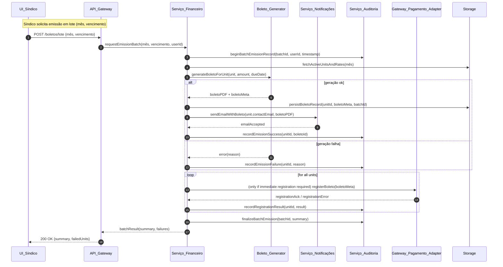
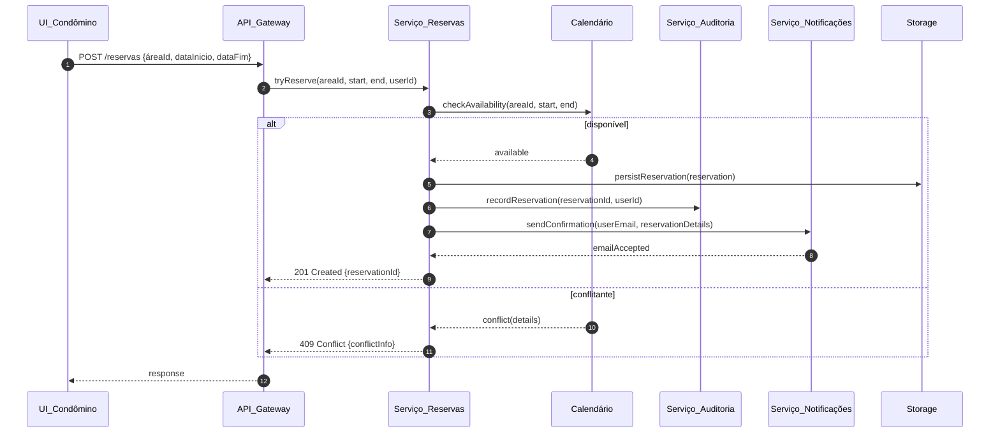

# Relatório Técnico de Arquitetura de Software

## 1. Identificação das HUs
Lista das Histórias de Usuário (HU) extraídas e principais critérios de aceite referenciados:
- HU01 — Cadastrar unidades e moradores (crit.: bloco/número obrigatórios; nome/CPF/e-mail obrigatórios; CPF único; múltiplos moradores por unidade).  
- HU02 — Emitir boletos em lote (crit.: mês+vencimento; boleto por unidade ativa; envio por e‑mail; indicar falhas).  
- HU03 — Acompanhar inadimplências (crit.: listar unidades com boletos em atraso; filtros; exportar CSV).  
- HU04 — Publicar comunicados (crit.: título/corpo/data; notificação por e‑mail; fixar comunicado).  
- HU05 — Gerenciar ocorrências (crit.: listagem com dados; filtros; notificação de autor nas atualizações).  
- HU06 — Criar e registrar assembleias (crit.: notificar criação; ata associada; anexos).  
- HU07 — Gerenciar áreas comuns e reservas (crit.: regras de horário/antecedência; calendário; cancelamento com notificação).  
- HU08 — Visualizar e pagar boleto pelo portal (crit.: listar boletos; baixar boleto; atualização automática do status).  
- HU09 — Reservar área comum (crit.: disponibilidade em tempo real; confirmação imediata; e‑mail de confirmação).  
- HU10 — Registrar e acompanhar ocorrência (crit.: categoria/descrição/anexos; histórico de atualizações; notificações).  
- HU11 — Pré‑autorizar entrada de visitante (crit.: nome/data; visível ao funcionário; cancelamento possível).  
- HU12 — Acompanhar assembleias e consultar atas (crit.: exibir assembleias; baixar atas em PDF).  
- HU13 — Registrar entrada e saída de visitantes (crit.: nome/documento/unidade/horário; destaque de pré‑autorizações; registrar saída).  
- HU14 — Consultar pré‑autorizações de acesso (crit.: listagem com filtros; vincular entrada à pré‑autorização).

(Os RFs detalhados no enunciado foram incorporados às HUs acima; mapeamento por componente na Seção 4 e cobertura na Seção 6.)

---

## 2. Diagramas de Arquitetura (Mermaid)

2.1 Diagrama de Componentes (visão lógica de alto nível)
```mermaid
graph TD
  UI[Portal Web / Mobile (UI)]
  API[API Gateway / Facade]
  Auth[Serviço de Autenticação & Autorização]
  Users[Serviço de Gestão de Usuários e Perfis]
  Units[Serviço de Unidades e Moradores]
  Finance[Serviço Financeiro (Boletos & Faturas)]
  Payments[Adapter: Integração com Gateway de Pagamento (externo)]
  BoletoGen[Boleto Generator / Emissor]
  Audit[Serviço de Auditoria & Logs Imutáveis]
  Notifications[Serviço de Notificações (e-mail/Push)]
  Comm[Serviço de Comunicados & Assembleias]
  Occ[Serviço de Ocorrências]
  Reservations[Serviço de Reservas e Áreas Comuns]
  Access[Serviço de Controle de Acesso e Visitantes]
  Storage[Repositório de Dados / Persistência]
  Blob[Armazenamento de Documentos (atas, anexos, boletos)]
  Jobs[Job Scheduler / Worker Pool]
  Backup[Serviço de Backup e Retenção]

  UI -->|REST/GraphQL| API
  API --> Auth
  API --> Users
  API --> Units
  API --> Finance
  API --> Comm
  API --> Occ
  API --> Reservations
  API --> Access
  Finance --> BoletoGen
  BoletoGen --> Blob
  Finance --> Payments
  Payments -->|Webhook / Callback| Finance
  Payments -->|confirmação| Audit
  AllServices ---|persist| Storage
  AllServices --> Audit
  AllServices --> Notifications
  Jobs --> Finance
  Jobs --> Reservations
  Backup --> Storage
```

2.2 Diagrama de Sequência — Emissão de boletos em lote (HU02 / RF13 / RNF11)


2.3 Diagrama de Sequência — Reserva de área comum (HU09 / RF26 / RF27)


---

## 3. Decisões de Arquitetura

1. Arquitetura Modular em Camadas e Serviços Coesos  
   - Responsabilidade: decompor domínio em serviços lógicos (Autenticação, Usuários, Unidades, Financeiro, Reservas, Ocorrências, Comunicados, Controle de Acesso, Notificações, Auditoria).  
   - Justificativa: permite isolamento de responsabilidades, escalabilidade por função e independência de evolução.

2. API Gateway / Facade  
   - Responsabilidade: ponto unificado de entrada para UI e clientes, roteamento, validação leve e orquestração de autenticação/autorização.  
   - Justificativa: simplifica consumo pelas interfaces e centraliza políticas transversais (rate‑limit, logging, versionamento).

3. Consistência e Transações/Compensação (para emissão em lote)  
   - Decisão: operações que alteram vários agregados (ex.: emissão em lote) devem usar transações locais por unidade e um mecanismo de coordenação de lote com idempotência e registro auditável; em caso de falhas parciais, registrar estado por unidade e permitir retry/compensação.  
   - Justificativa: atende RNF11 (emissão transacional) sem exigir transação distribuída estrita, reduzindo risco de corrupção de dados.

4. Auditoria Imutável e Registro de Eventos Críticos  
   - Responsabilidade: todas as operações financeiras e eventos críticos (emissão/pagamento, comunicação, alterações de ocorrência, registros de visita) geram entradas imutáveis com usuário, timestamp e metadados (RNF05, RNF13, RNF06).  
   - Justificativa: conformidade, rastreabilidade e suporte a auditoria/forense.

5. Integração com Gateway de Pagamento por Adapter + Webhooks  
   - Decisão: integração assíncrona via adaptador e callbacks/webhooks para confirmação de pagamento; seguir diretrizes PCI‑DSS e não armazenar dados sensíveis de cartão (RNF03).  
   - Justificativa: confiabilidade na reconciliação e aderência a segurança.

6. Notificações Assíncronas (e‑mail / push)  
   - Responsabilidade: serviço de notificações desacoplado, usado por múltiplos serviços para envio de comunicados, boletos e atualizações de ocorrências/ reservas.  
   - Justificativa: desacoplamento, retry e capacidade de observabilidade.

7. Jobs/Workers para Processamento em Lote e Tarefas Agendadas  
   - Aplicação: emissão em lote, geração periódica de boletos, envio de lembretes, limpeza e backups agendados.

8. Armazenamento de Documentos (atas, anexos, boletos) separado do repositório transacional  
   - Responsabilidade: armazenar arquivos binários com metadados referenciados em dados transacionais; políticas de retenção e LGPD aplicadas.

9. Segurança e Gerenciamento de Senhas  
   - Decisão: senhas armazenadas com hash seguro conforme requisito (ex.: bcrypt mencionado no RNF02). Sessões com timeout de 30 minutos de inatividade (RNF01).  
   - Observação: criptografia em trânsito e em repouso para dados pessoais e financeiros.

10. Alta Disponibilidade e Backup  
    - Requisitos: disponibilidade mínima 99,5% e backup diário com retenção mínima de 90 dias (RNF07, RNF12). Arquitetura deve permitir failover e restauração testada.

---

## 4. Tabela de Componentes e Rastreabilidade

| Componente | Responsabilidade Principal | Comunica-se com | Origem (HU / Critério de Aceite / RF / RNF) |
|---|---|---:|---|
| API Gateway / Facade | Expor APIs, roteamento, validação básica, autenticação/autorizações iniciais | UI, Serviços internos | HU02, HU09, RF02, RNF01 |
| Serviço de Autenticação & Autorização | Gerenciar login/logout, sessões, perfis, roles, sessão timeout | API, Audit | RF01, RF02, RF03, RNF01, RNF02 |
| Serviço de Gestão de Usuários e Perfis | CRUD de usuários (síndico, condômino, funcionário, admin) e perfis | API, Storage, Audit | RF01, HU01 |
| Serviço de Unidades e Moradores | Gerenciar unidades, moradores, vínculos (proprietário/inquilino), veículos, desativações | API, Storage, Audit | RF04, RF05, RF06, RF07, RF08, HU01 |
| Serviço Financeiro (Boletos & Faturas) | Configurar taxas, emissão (single/lote), registro de pagamentos manuais, painel de inadimplência | Boleto Generator, Payments Adapter, Notifications, Storage, Audit, Jobs | RF09–RF15, HU02, HU03, HU08, RNF05, RNF11 |
| Boleto Generator / Emissor | Gerar representação do boleto (PDF/meta), validações por unidade | Finance, Blob, Audit | RF10, RF13, HU02 |
| Adapter: Integração com Gateway de Pagamento | Registrar títulos, receber confirmações via webhook, notificar Financeiro | Finance, Audit | RF11, RF12, RNF03, HU08 |
| Serviço de Comunicados & Assembleias | Criar/comunicar comunicados, criar assembleias, gerenciar atas e anexos | Notifications, Blob, Storage, Audit | RF16–RF20, HU04, HU06, HU12 |
| Serviço de Ocorrências | Registro, categorização, atualização de status, histórico e notificações | Notifications, Storage, Audit | RF21–RF24, HU05, HU10 |
| Serviço de Reservas e Áreas Comuns | Cadastro de áreas, regras, calendarização, prevenção de sobreposição, cancelamento | Calendar, Jobs, Notifications, Storage, Audit | RF25–RF29, HU07, HU09 |
| Serviço de Controle de Acesso e Visitantes | Pré‑autorizações, registros de entrada/saída, histórico de visitas | Notifications, Storage, Audit | RF30–RF33, HU11, HU13, HU14 |
| Serviço de Notificações (E‑mail/Push) | Envio de e‑mails e notificações assíncronas, templates, retries | Todos os serviços | RF17, RF24, RNF13, HUs diversas |
| Serviço de Auditoria & Logs Imutáveis | Registrar eventos críticos imutáveis com metadados (usuário, timestamp) | Todos os serviços, Storage | RNF05, RNF06, RNF13; aplicável a HU02, HU03, HU13 etc. |
| Repositório de Dados / Persistência | Armazenar entidades relacionais/NO‑SQL necessárias, índices para consultas (ex.: painel) | Todos os serviços | RNF12, RNF07, HU01–HU14 |
| Armazenamento de Documentos (Blob) | Armazenar PDFs, atas, anexos, boletos | Boleto Generator, Comunicados, Occ, Blob | HU02, HU06, HU12 |
| Job Scheduler / Worker Pool | Processamento em lote, geração de boletos, limpeza, reenvio de notificações | Finance, Reservations, Notifications, Audit | HU02, HU07, RNF11 |
| Serviço de Backup e Retenção | Orquestrar backups diários e retenção de 90+ dias | Storage, Blob | RNF12 |
| Calendar (Serviço de Calendário) | Índice e verificação de disponibilidade por área em tempo real | Reservations, API | RF27, HU09, HU07 |

---

## 5. Bloqueios e Pendências

1. Integração com Gateway de Pagamento:
   - Bloqueio: especificações do gateway (endpoints, formatos, requisitos de segurança, SLAs, webhooks).  
   - Impacto: necessário para projetar adapter e fluxos de reconciliação; afeta testes de ponta a ponta do fluxo de pagamento.  
   - Ação recomendada: obter documentação técnica, sandbox e requisitos de certificação PCI do provedor.

2. Capacidade e SLAs de E‑mail/Notificações:
   - Bloqueio: definição de volume esperado e políticas de retry/queuing para envio de boletos e comunicados.  
   - Impacto: afeta o dimensionamento do serviço de notificações e tolerância a falhas (envios em lote).  
   - Ação: levantar estimativas de volume mensal de mensagens; definir políticas de retry e listas de bloqueio.

3. Requisitos funcionais/legais adicionais de LGPD:
   - Bloqueio: políticas de consentimento, propósito, eliminação/anonimização de dados e definição de encarregado.  
   - Impacto: modelagem de dados pessoais, fluxos de exclusão/desativação e retenção.  
   - Ação: alinhar com área jurídica para políticas de privacidade e fluxos de atendimento de direitos dos titulares.

4. Definição de métricas operacionais e SLA de disponibilidade:
   - Bloqueio: definições concretas de RTO/RPO e tolerância a perda de dados em eventos de falha.  
   - Impacto: escolha de estratégias de backup/replicação e plano de recuperação.  
   - Ação: definir RTO/RPO aceitáveis e janelas de manutenção.

5. Requisitos de performance e dimensionamento:
   - Bloqueio: falta de estimativas de carga (número de unidades, usuários simultâneos, volume de boletos por mês).  
   - Impacto: dificulta escolha de escalabilidade e tuning para atender RNF07 (99,5%) e RNF08 (painéis em <3s).  
   - Ação: coletar estimativas para capacidade e testes de carga.

6. Políticas de retenção e anonimização de documentos e logs:
   - Bloqueio: prazos específicos além do mínimo de backup (ex.: atas, histórico de ocorrências).  
   - Impacto: afeta arquitetura de armazenamento e conformidade LGPD.  
   - Ação: definir políticas de retenção por tipo de dado.

---

## 6. Cobertura de Requisitos

Resumo de mapeamento RF / RNF / HUs para componentes (alto nível):

- Autenticação & Sessões (RF01, RF02, RF03, RNF01, RNF02) → Serviço de Autenticação & API Gateway.  
- Gestão de Unidades/Moradores/Veículos (RF04–RF08, HU01) → Serviço de Unidades e Moradores + Repositório.  
- Financeiro / Boletos / Pagamentos (RF09–RF15, HU02, HU03, HU08) → Serviço Financeiro, Boleto Generator, Payments Adapter, Audit, Notifications, Jobs.  
- Comunicados e Assembleias (RF16–RF20, HU04, HU06, HU12) → Serviço Comunicados & Assembleias, Notifications, Blob.  
- Ocorrências (RF21–RF24, HU05, HU10) → Serviço de Ocorrências, Notifications, Audit.  
- Reservas de Áreas Comuns (RF25–RF29, HU07, HU09) → Serviço de Reservas, Calendar, Jobs, Notifications.  
- Controle de Acesso e Visitantes (RF30–RF33, HU11, HU13, HU14) → Serviço de Controle de Acesso e Visitantes, Notifications, Audit.  
- Rastreabilidade e Logs (RNF05, RNF06, RNF13) → Serviço de Auditoria & Logs Imutáveis.  
- Disponibilidade / Backup / Retenção (RNF07, RNF12) → Arquitetura de alta disponibilidade, Backup Service.  
- Desempenho de painéis e calendários (RNF08) → Serviços Financeiro e Reservas + camadas de cache/índices (conceitual) para consultas rápidas.  
- Usabilidade/Compatibilidade (RNF09, RNF10) → UI responsiva + API compatível com navegadores modernos (especificação de front-end fora do escopo arquitetural detalhado).

Cobertura por HU (resumo):
- HU01 → Units service.  
- HU02 → Finance + BoletoGen + Payments + Notifications + Audit.  
- HU03 → Finance + Audit + Storage + Export (CSV).  
- HU04 → Comm + Notifications + Blob.  
- HU05 → Occ + Notifications + Audit.  
- HU06 → Comm + Blob + Notifications.  
- HU07 → Reservations + Calendar + Notifications.  
- HU08 → Finance + Payments Adapter + Notifications.  
- HU09 → Reservations + Calendar + Notifications.  
- HU10 → Occ + Storage + Notifications.  
- HU11 → Access + Notifications.  
- HU12 → Comm + Blob.  
- HU13 → Access + Audit + Notifications.  
- HU14 → Access + UI + Storage.

(Detalhamento fino de endpoints, modelos de dados e contratos deve constar na especificação de API/contratos.)

---

## 7. Gap Analysis

1. Gap: Especificação do Gateway de Pagamento (contratos e sandbox)
   - Impacto arquitetural: sem isso, não é possível finalizar adapter, reconciliação e testes de fluxo de pagamento; risco na conformidade PCI.  
   - Recomendação: obter contrato técnico e ambiente de testes do gateway; definir cenários de erro e formatos de webhook; validar requisitos de segurança e certificação.

2. Gap: Volume esperado e requisitos de desempenho por funcionalidade
   - Impacto: dimensionamento da infraestrutura (workers, filas, capacidade de e‑mail), índices para consultas do painel de inadimplência e calendário.  
   - Recomendação: capturar estimativas (número de unidades, média de boletos/mês, picos de acesso) e realizar testes de carga para garantir RNF07/RNF08.

3. Gap: Políticas detalhadas de LGPD e retenção por tipo de dado
   - Impacto: projeto de anonimização, consentimento, fluxos de exclusão lógica/irreversível e retenção de backup.  
   - Recomendação: definir mapa de dados pessoais, políticas de retenção e processos para requisições de titulares (acesso, correção, exclusão).

4. Gap: Critérios operacionais para disponibilidade e recuperação (RTO/RPO)
   - Impacto: escolha de topologia de alta disponibilidade, replicação e procedimentos de restauração.  
   - Recomendação: definir RTO/RPO aceitáveis; documentar runbooks e testar failover e restauração de backup periodicamente.

5. Gap: Regras detalhadas de reservas (bloqueios de horário, regras per‑área)
   - Impacto: lógica de verificação de sobreposição e UI de disponibilidade em tempo real.  
   - Recomendação: especificar regras por área (horários proibidos, antecedência máxima/mínima, políticas de cancelamento) para implementação do Reservation service.

6. Gap: Regras de negócio para cálculo da taxa condominial (ex.: por unidade ou por tipo)
   - Impacto: geração correta de boletos e faturamento por tipo/unidade.  
   - Recomendação: definir esquema tarifário e regras de aplicação (pro rata, descontos, isenções).

7. Gap: Política de anexos e tamanhos máximos (atas, fotos de ocorrências)
   - Impacto: dimensionamento de armazenamento blob e validações no upload; segurança (scan de conteúdo).  
   - Recomendação: definir limites de tamanho, tipos de arquivo permitidos e retenção de anexos.

8. Gap: Gestão de consentimentos para envio de notificações (opt‑in / opt‑out)
   - Impacto: conformidade com comunicação por e‑mail e registro de preferências.  
   - Recomendação: incluir fluxo de preferência de comunicação no cadastro de usuário e persistir consentimentos com timestamp.

9. Gap: Mecanismo de indexação/denormalização para painéis (inadimplência e calendário)
   - Impacto: sem estratégia de consulta rápida, risco de exceder os 3 segundos (RNF08).  
   - Recomendação: projetar índices, visualizações materializadas ou caches com atualização controlada por eventos para painéis críticos.

10. Gap: Procedimentos operacionais para logs e retenção de auditoria imutável
    - Impacto: conformidade e capacidade forense; armazenamento de grande volume.  
    - Recomendação: definir retenção e rotação de logs, armazenamento frio e meios de pesquisa/consulta.

Conclusão e próximos passos imediatos:
- Priorizar obtenção das integrações externas (gateway de pagamento, serviço de e‑mail) e políticas legais (LGPD, políticas de retenção).  
- Definir estimativas de carga e SLAs operacionais para dimensionamento e provas de conceito.  
- Elaborar especificação de APIs (contratos), modelos de dados e fluxos de autorização para começarem os desenvolvimentos por componentes com testes integrados (emissão em lote e reservas como prioridades iniciais).

--- 

Relatório concluído. Se desejarem, posso:
- Gerar a especificação de API (endpoints, payloads, respostas e erros) para os serviços prioritários (Financeiro, Reservas, Autenticação).  
- Produzir modelos de dados conceituais (ERD) e esquemas de índice para os painéis críticos.