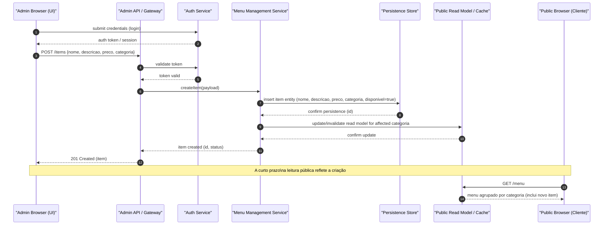
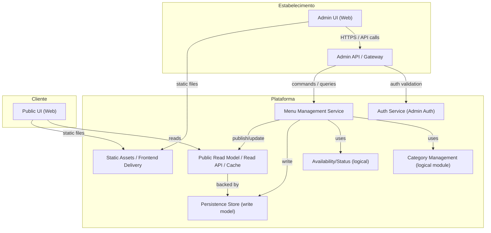

# Relatório Técnico de Arquitetura de Software

## 1. Identificação das HUs

Lista das Histórias de Usuário (HU) identificadas no lote e resumo de intenção / responsabilidade arquitetural:

- HU01 — Cadastrar item no cardápio  
  - Intenção: Permitir ao estabelecimento inserir novo item com nome, descrição e preço; refletir imediatamente no cardápio público.  
  - Responsabilidade arquitetural chave: API administrativa para criação de itens + atualização do repositório de leitura pública/camada de cache para baixa latência.

- HU02 — Organizar itens por categoria  
  - Intenção: Permitir criação/edição/ordenação de categorias e associação de um item a exatamente uma categoria.  
  - Responsabilidade: Modelagem de domínio para Item e Categoria; serviço de gestão de categorias; interface administrativa para ordenação.

- HU03 — Editar item do cardápio  
  - Intenção: Atualizar dados do item e refletir mudanças imediatamente no cardápio público.  
  - Responsabilidade: Operação de atualização no serviço de gestão de menu com propagação eventual/consistente para leitura pública.

- HU04 — Marcar item como indisponível  
  - Intenção: Marcar temporariamente item como indisponível sem removê-lo; permitir reversão.  
  - Responsabilidade: Atributo de disponibilidade no modelo; UI pública que exiba indicador; APIs para toggle.

- HU05 — Remover item do cardápio  
  - Intenção: Excluir item após confirmação; removê-lo da visão pública.  
  - Responsabilidade: Operação de deleção lógica/física definida; UI administrativa com confirmação.

- HU06 — Visualizar o cardápio sem cadastro  
  - Intenção: Cliente acessa cardápio por URL sem autenticação; responsive e rápido.  
  - Responsabilidade: API pública/endpoint de leitura que não exige autenticação; front-end público responsivo.

- HU07 — Navegar pelo cardápio por categorias  
  - Intenção: Exibir itens agrupados por categoria na visão do cliente.  
  - Responsabilidade: Endpoints de consulta que retornem estrutura de categorias + itens; UI pública com agrupamento.

- HU08 — Identificar itens indisponíveis  
  - Intenção: Apresentar visualmente os itens indisponíveis sem removê-los.  
  - Responsabilidade: UI pública apresenta indicador baseado em campo disponibilidade do item.

## 2. Diagramas de Arquitetura (Mermaid)

Observação: diagramas descritos em termos conceituais e sem prescrição de tecnologia específica.

2.1 Diagrama de sequência — fluxo: Cadastrar item e atualização da visão pública

2.2 Diagrama de componentes (visão lógica)

## 3. Decisões de Arquitetura

D1 — Separação de caminhos de escrita e leitura (CQRS leve):  
- Racional: HUs exigem atualizações imediatas para administração e carregamento rápido para clientes públicos (RNF02). Separar o modelo de escrita (operações administrativas) do modelo de leitura (endpoints otimizados para consulta) facilita performance e disponibilidade da visão pública.  
- Impacto: Necessário mecanismo de atualização/invalidação do read model e políticas de consistência (eventual ou síncrona).

D2 — Autenticação para área administrativa (RNF03):  
- Racional: Acesso administrativo deve ser protegido por autenticação; a visão pública permanece aberta.  
- Impacto: Definir token/session, proteção de endpoints administrativos, controle de sessões e políticas de senha. Especificação exata do mecanismo (ex.: tipo de token, MFA) fica pendente.

D3 — Interfaces RESTful/HTTP para separação de UIs e serviços:  
- Racional: Diferentes UIs (admin e público) comunicam com APIs bem definidas; favorece modularidade (RNF05) e compatibilidade com navegadores (RNF06).  
- Impacto: Definir contratos de API, versões e mensagens de erro.

D4 — Cache / Read model para desempenho do cardápio (RNF02, RNF04):  
- Racional: Para garantir carregamento em até 3s e alta disponibilidade pública, manter uma camada de leitura rápida (cache ou materialized view) que sirva o menu agrupado por categoria.  
- Impacto: Estratégia de invalidação ou atualização quando itens forem criados, editados, removidos ou alterarem disponibilidade.

D5 — Modelagem de domínio simples e explícita (Item — Categoria — Disponibilidade):  
- Racional: Requisito de unicidade de categoria por item e controle de ordem das categorias exigem modelagem clara.  
- Impacto: Regras de negócio: item.belongsTo(category) e category.order. Possível necessidade de campos para ordenação (ordem das categorias).

D6 — UI pública responsiva e acessível (RNF01, RNF07):  
- Racional: Exigido responsividade e conformidade WCAG 2.1 nível A.  
- Impacto: Requisitos de frontend, estrutura semântica e testes de acessibilidade; imagens e contraste definidos no projeto de interface.

D7 — Operação e disponibilidade (RNF04):  
- Racional: Target 99% de disponibilidade implica considerar redundância e monitoramento para componentes públicos.  
- Impacto: Necessidade de planos de deploy resilientes, monitoramento e estratégias de recuperação; SLAs e infraestrutura operacional devem ser definidos fora deste documento.

D8 — Exclusão com confirmação e opção de deleção lógica:  
- Racional: Requisito de confirmação antes de excluir (HU05) e necessidade de histórico/recuperação recomenda deleção lógica por padrão.  
- Impacto: Definir política de retenção e remoção final.

D9 — Acessibilidade de leitura sem autenticação (HU06):  
- Racional: Endpoints públicos não exigem credenciais; porém, operações administrativas estão protegidas.  
- Impacto: Reforçar segregação de rotas e CORS conforme necessário.

Observações adicionais: todas as decisões seguem neutralidade tecnológica — responsabilidades e interfaces descritas sem prescrição de produtos ou frameworks.

## 4. Tabela de Componentes e Rastreabilidade

| Componente | Responsabilidade Principal | Comunica-se com | Origem (HU / Critério de Aceite) |
|---|---:|---|---|
| Admin UI (Interface Administrativa) | Fornecer telas para criar/editar/remover itens e categorias, controlar ordem e disponibilidade; realizar confirmação em exclusões | Admin API, Auth Service, Static Assets | HU01, HU02, HU03, HU04, HU05 (critério: validação de campos, confirmação antes de excluir, imediato refletir) |
| Public UI (Interface de Cliente) | Exibir cardápio responsivo, agrupado por categoria, indicar indisponíveis (acessível sem autenticação) | Read Model, Static Assets | HU06, HU07, HU08 (critério: carregamento por URL, dispositivos móveis, indicação visual) |
| Auth Service (Gateway de Autenticação) | Autenticar/autorizar usuários administrativos; emitir/validar tokens/sessões | Admin API, Persistence (usuários) | RNF03 (autenticação por usuário e senha) |
| Admin API (Gateway Administrativo) | Receber comandos do Admin UI; validar autorização; encaminhar operações ao MenuService | Auth Service, MenuService | HU01–HU05 (operações CRUD administrativas, validações) |
| Menu Management Service (Write Model) | Executar regras de negócio para criação/edição/deleção de itens; gerenciar associação a categorias e disponibilidade | Persistence, CategoryService, AvailabilityModule, Read Model | HU01, HU02, HU03, HU04, HU05 (critério: alterações refletidas imediatamente) |
| Category Management (módulo lógico) | Criar/editar/remover/ordenar categorias; garantir 1 categoria por item | MenuService, Persistence, Read Model | HU02 (criação/nome livre, 1 categoria por item, ordem controlável) |
| Availability/Status Module (módulo lógico) | Marcar/desmarcar item como indisponível; expor estado para UI pública | MenuService, Read Model | HU04, HU08 (critério: visível, reversível) |
| Persistence Store (Write DB / Store) | Persistência de entidades (Item, Category, User, Audit) | MenuService, Auth Service, Read Model | HU01–HU05 (gravação e recuperação de dados) |
| Public Read Model / Cache / Read API | Fornecer endpoints otimizados para leitura do cardápio (agrupado por categoria) e servir rapidamente ao Public UI | Persistence, MenuService, Public UI | HU06, HU07, RNF02 (carregamento < 3s), RNF06 (compatibilidade) |
| Static Assets / Frontend Delivery | Servir recursos estáticos (CSS, JS, imagens) otimizados para navegadores e dispositivos | Admin UI, Public UI, Browsers | RNF01, RNF06, RNF07 (responsividade, compatibilidade, acessibilidade) |
| Audit & Logging (componente de observabilidade) | Registrar operações administrativas e erros para investigação e compliance | Admin API, MenuService, Auth Service | RNF04 (disponibilidade operacional), pendência para requisitos de auditoria (ver Gap Analysis) |

Notas de rastreabilidade: a coluna Origem indica HU(s) ou critérios de aceite que demandaram o componente. Componentes como Read Model e Persistence suportam múltiplas HUs.

## 5. Bloqueios e Pendências

- B1 — Especificação de autenticação e autorização administrativa completa: tipo de credenciais, políticas de senha, rotação, escopo de permissões (bloqueia implementação da Auth Service com requisitos de segurança). Ação: definir política de identidade e roles mínimas (ex.: administrador de cardápio).

- B2 — SLA operacional e detalhes de infra para atingir RNF04 (99% 24/7): infraestrutura, redundância, backup/recovery e responsabilidades operacionais não foram especificadas. Ação: equipe de operações deve definir ambiente de execução, SLAs e runbooks.

- B3 — Política de consistência (sincrona vs eventual) entre write model e read model: requisito “exibir imediatamente” sugere baixa latência, mas falta decisão sobre garantia forte vs eventual. Ação: decidir nível de consistência aceitável; se forte for requerido, definir mecanismos de transação/replicação síncrona.

- B4 — Estratégia de cache/invalidação do Read Model: falta definir política de TTL, invalidação de categoria/itens e comportamento em falhas. Ação: definir política de atualização (push vs pull) e tolerância a falhas.

- B5 — Requisitos de segurança além de autenticação (ex.: criptografia em trânsito/repouso, proteção contra injeção e CSRF, rate limiting): não detalhados. Ação: definir requisitos de segurança aceitáveis e controles operacionais.

- B6 — Critérios detalhados de acessibilidade (componentes exatos WCAG 2.1 A a cumprir, idiomas, suporte de leitores de tela): pendente. Ação: produzir checklist de acessibilidade e testes automatizados.

- B7 — Backup, retenção e estratégia de exclusão final: remoção lógica sugerida, mas políticas de retenção/privacidade não definidas. Ação: definir políticas de retenção de dados e regras de purge.

- B8 — Testes e métricas de desempenho (simulações de carga esperada): ausência de volumes e perfil de carga para dimensionamento. Ação: definir tráfego esperado e metas para testes de carga.

## 6. Cobertura de Requisitos

6.1 Mapeamento funcional (RF) e HUs para componentes (resumo)

- RF01 (cadastrar itens)  
  - Cobertura: Admin UI, Admin API, Menu Management Service, Persistence, Read Model  
  - HU: HU01

- RF02 (editar item)  
  - Cobertura: Admin UI, Admin API, Menu Management Service, Persistence, Read Model  
  - HU: HU03

- RF03 (remover item)  
  - Cobertura: Admin UI (confirmação), Admin API, Menu Management Service, Persistence, Read Model  
  - HU: HU05

- RF04 (criar/editar/remover categorias)  
  - Cobertura: Admin UI, Admin API, Category Management, Persistence, Read Model  
  - HU: HU02

- RF05 (associar item a categoria)  
  - Cobertura: Menu Management Service, Persistence, Admin UI, Read Model  
  - HU: HU01, HU02

- RF06 (marcar como indisponível)  
  - Cobertura: Admin UI, Admin API, Availability Module, Persistence, Read Model, Public UI  
  - HU: HU04

- RF07 (reativar item)  
  - Cobertura: mesma que RF06  
  - HU: HU04

- RF08 (exibir cardápio ao cliente sem autenticação)  
  - Cobertura: Public UI, Read Model (public endpoints), Static Assets  
  - HU: HU06

- RF09 (exibir itens agrupados por categoria na visão do cliente)  
  - Cobertura: Read Model (agrupamento), Public UI, Category Management  
  - HU: HU07

- RF10 (indicar visualmente indisponíveis na visão cliente)  
  - Cobertura: Availability Module, Read Model, Public UI (indicação visual)  
  - HU: HU08

- RF11 (exibir nome, descrição e preço)  
  - Cobertura: Persistence, Read Model, Public UI, Admin UI  
  - HU: HU01, HU03, HU06

6.2 Mapeamento não-funcional (RNF) para decisões/componentes

- RNF01 (Usabilidade — responsividade): coberto por Public UI e Admin UI; decisão D6.  
- RNF02 (Desempenho — carregamento ≤ 3s): coberto por Read Model / Cache e Static Assets; decisão D4.  
- RNF03 (Segurança — autenticação administrativa): coberto por Auth Service e Admin API; decisão D2.  
- RNF04 (Disponibilidade 99%): qualitativamente abordada por redundância arquitetural (Read Model e separação de leitura) e observabilidade; ação requerida em B2.  
- RNF05 (Manutenibilidade / modularidade): arquitetura modular com serviços lógicos separados (MenuService, CategoryService, AvailabilityModule).  
- RNF06 (Compatibilidade — navegadores): Public UI e Static Assets; exige testes cross-browser.  
- RNF07 (Acessibilidade WCAG 2.1 A): responsabilidade do Public UI; pendência B6 para critérios e testes.

Estado geral: Todos os RFs e HUs têm componente(s) responsáveis mapeados. RNFs estão contemplados na arquitetura, mas demandam decisões operacionais e critérios detalhados (ver Bloqueios/Pendências).

## 7. Gap Analysis

Identificação de lacunas na especificação original, impactos na arquitetura e ações recomendadas.

GAP 1 — Nível de consistência entre escrita e leitura (imediato vs eventual)  
- Descrição: Requisitos mencionam que alterações devem ser exibidas "imediatamente". Não está claro se "imediatamente" exige consistência forte (sincrona) ou é aceitável latência muito baixa (eventual, com replicação rápida).  
- Impacto arquitetural: Escolha entre atualização síncrona do read model (implica maior acoplamento e latência na escrita) ou replicação/eventual com mecanismos de eventual consistency e retry. Pode afetar confiabilidade e complexidade.  
- Ação recomendada: Definir a janela máxima aceitável entre operação administrativa e visibilidade pública (e.g., <1s, <5s). Com base nisso escolher estratégia (sincronização, pub/sub, ou atualização direta).

GAP 2 — Detalhes de autenticação / autorização e gestão de contas administrativas  
- Descrição: RNF03 exige proteção por usuário e senha, mas não define fluxo de recuperação de senha, controle de sessões, ou níveis de permissão.  
- Impacto: Afeta segurança, UX administrativo e implementação do Auth Service.  
- Ação: Definir requisitos de gestão de credenciais, políticas de senha, recuperação, roles mínimas e políticas de sessão.

GAP 3 — Estratégia de cache/invalidação e comportamento sob falha  
- Descrição: Falta definição de TTL, política de invalidação por categoria/item, comportamento quando Read Model está inacessível.  
- Impacto: Pode causar exibição de dados obsoletos ou downtime do cardápio público, afetando RNF02 e RNF04.  
- Ação: Definir política de invalidação (push on update) e fallback (servir última versão válida) e monitoramento.

GAP 4 — Política de deleção/retenção e auditoria  
- Descrição: HU05 requer confirmação antes de excluir, mas não especifica se a exclusão é lógica ou física, retenção de dados ou necessidade de histórico/audit trail.  
- Impacto: Afeta conformidade, possibilidade de restauração e requisitos legais.  
- Ação: Definir política de deleção (soft delete + purge periódica ou hard delete) e requisitos de auditoria (logs de alterações) e retenção.

GAP 5 — Volumes esperados e requisitos de escalabilidade/testes de carga  
- Descrição: RNFs definem tempo de carregamento e disponibilidade, mas não definem cargas esperadas (número de visitantes simultâneos, número médio de itens/categorias).  
- Impacto: Não é possível dimensionar infraestrutura, definir estratégias de escalonamento automático ou necessidades de cache.  
- Ação: Obter estimativas de tráfego e cargas para dimensionamento e cenários de teste.

GAP 6 — Mídia (imagens) e conteúdo enriquecido do cardápio  
- Descrição: Requisitos citam apenas nome, descrição e preço; não mencionam suporte a imagens, alergênicos, variações ou extras.  
- Impacto: Se imagens forem necessárias no futuro, será preciso planejar armazenamento de mídia, CDN e considerações de performance e acessibilidade.  
- Ação: Confirmar se imagens ou campos adicionais serão necessários; caso afirmativo, estender modelo de dados e pipeline de entrega de mídia.

GAP 7 — Logs, monitoramento e alertas operacionais  
- Descrição: RNF04 exige disponibilidade, mas não especifica métricas, pontos de monitoramento, ou alertas críticos.  
- Impacto: Sem métricas e alertas, equipes não terão visibilidade para manter a disponibilidade exigida.  
- Ação: Definir métricas (latência de read model, erros 5xx, disponibilidade), SLIs/SLOs e plano de observabilidade.

GAP 8 — Requisitos de segurança adicionais (rate limiting, proteção de endpoints públicos)  
- Descrição: Apenas autenticação administrativa é especificada. Não há menção a proteção contra abuso de endpoints públicos.  
- Impacto: Risco de scraping, DoS ou uso indevido que pode afetar disponibilidade.  
- Ação: Definir limites de taxa e mecanismos de mitigação.

GAP 9 — Internacionalização / moeda / formatos de preço  
- Descrição: Não há informação sobre múltiplas moedas ou formatação regional.  
- Impacto: Pode afetar a apresentação de preço e requisitos de negócio para estabelecimentos em diferentes regiões.  
- Ação: Confirmar necessidade de suporte a localizações e moedas; se necessário, ampliar modelo.

GAP 10 — Testes de acessibilidade e critérios de aceitação detalhados (WCAG 2.1 A)  
- Descrição: RNF07 pede conformidade com WCAG 2.1 A, mas não define cobertura exata ou critérios de níveis mínimos de teste.  
- Impacto: Pode haver retrabalho no frontend se critérios não forem claros.  
- Ação: Definir checklist mínimo de WCAG e incluir testes automatizados/validação na pipeline.

Resumo das ações prioritárias recomendadas ao time:
1. Definir política de consistência entre write/read e janela aceitável de atualização imediata.  
2. Especificar detalhes de autenticação/autorização e gerenciamento de contas.  
3. Definir estratégia de cache/read model e política de invalidação/fallback.  
4. Definir política de deleção, retenção e requisitos de auditoria.  
5. Fornecer estimativas de carga para dimensionamento e testes de desempenho.  
6. Especificar se suporte a imagens/atributos adicionais será necessário.  
7. Definir métricas de observabilidade e planos de monitoramento/alerta.  
8. Detalhar requisitos de segurança operacionais (rate limiting, proteção de endpoints).

---

Fim do Relatório.