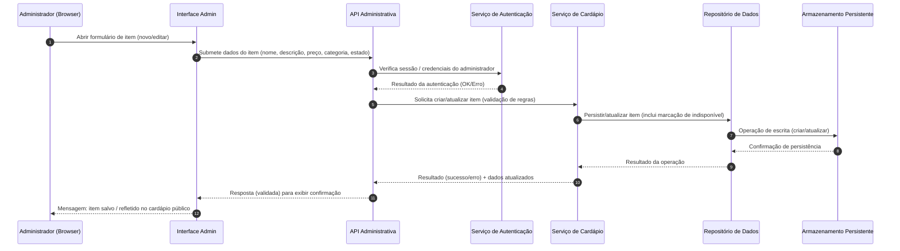

# Relatório Técnico de Arquitetura de Software

## 1. Identificação das HUs

Mapeamento das Histórias de Usuário (HU) e requisitos funcionais relacionados:

- HU01 — Cadastrar item no cardápio
  - RF relacionados: RF01, RF08, RF11
- HU02 — Organizar itens por categoria
  - RF relacionados: RF04, RF05, RF09, RF11
- HU03 — Editar item do cardápio
  - RF relacionados: RF02, RF08, RF11
- HU04 — Marcar item como indisponível
  - RF relacionados: RF06, RF07, RF10, RF11
- HU05 — Remover item do cardápio
  - RF relacionados: RF03, RF08
- HU06 — Visualizar o cardápio sem cadastro
  - RF relacionados: RF08, RNF01, RNF06
- HU07 — Navegar pelo cardápio por categorias
  - RF relacionados: RF09, RNF01, RNF07
- HU08 — Identificar itens indisponíveis
  - RF relacionados: RF10, RNF07

Observação: cada HU inclui critérios de aceite descritos no enunciado (validações, visualização imediata, confirmação antes de exclusão, responsividade, etc.) — esses critérios servem de origem para componentes e interfaces.

---

## 2. Diagramas de Arquitetura (Mermaid)

1) Diagrama de sequência — fluxo típico: Administrador cadastra/edita item (inclui autenticação administrativa e persistência).  


2) Diagrama de componentes — visão modular e interfaces conceituais:
```mermaid
graph TD
  subgraph Interface Cliente
    PublicUI[UI Pública (navegador do cliente)]
  end

  subgraph Interface Administrativa
    AdminUI[UI Administrativa (navegador do estabelecimento)]
  end

  subgraph Back-end
    PublicAPI[API Pública (consulta de cardápio)]
    AdminAPI[API Administrativa (CRUD de itens/categorias)]
    AuthService[Serviço de Autenticação e Autorização]
    MenuService[Serviço de Domínio: Cardápio e Regras]
    CategoryService[Serviço de Domínio: Categorias e Ordenação]
    Repo[Repositório de Persistência]
    AssetService[Serviço de Recursos Estáticos (opcional)]
    CacheLayer[Camada de Cache/Distribuição de Conteúdo]
    Monitoring[Serviços de Registro/Monitoramento]
  end

  PublicUI -->|GET /menu| PublicAPI
  AdminUI -->|POST/PUT/DELETE /admin/*| AdminAPI
  AdminAPI --> AuthService
  AdminAPI --> MenuService
  MenuService --> Repo
  CategoryService --> Repo
  PublicAPI --> MenuService
  PublicAPI --> CacheLayer
  AssetService -->|assets (imagens)| PublicUI
  CacheLayer --> Repo
  Monitoring --> AdminAPI
  Monitoring --> PublicAPI
```

Observações do diagrama de componentes:
- Interfaces cliente e administrativa são separadas logicamente (mesma base de serviços no back-end, mas rotas e políticas distintas).
- Cache/Distribuição é conceitual para atender RNF02 (tempo de carregamento) e RNF04 (disponibilidade).
- Repositório centraliza operações de leitura/escrita de itens e categorias; serviços de domínio encapsulam regras (validações, estado indisponível, ordenação).

---

## 3. Decisões de Arquitetura

1. Separação de Concernes (Frontend Público vs Administrativo)
   - Decisão: Interfaces públicas (somente leitura) e administrativas (leitura/escrita) expõem APIs distintas.
   - Racional: Permite aplicar políticas de segurança, caching e escalabilidade diferentes; facilita atender RNF03 (autenticação administrativa) sem impactar acesso público.
   - Trade-offs: Aumenta número de end-points, exige coordenação de contratos API.

2. Serviços de Domínio (MenuService, CategoryService)
   - Decisão: Encapsular regras de negócio (validação de campos obrigatórios, regras de disponibilidade, ordem de categorias) em serviços de domínio.
   - Racional: Melhora manutenibilidade (RNF05) e testabilidade; centraliza lógica usada por APIs públicas e administrativas.
   - Trade-offs: Introduz camada extra e necessidade de definir contratos claros entre API e serviços.

3. Cache e Camada de Distribuição de Conteúdo
   - Decisão: Introduzir camada de cache para leituras públicas e servir recursos estáticos por meio de um serviço de distribuição.
   - Racional: Atende RNF02 (carregamento <= 3s) e contribui para RNF04 (disponibilidade).
   - Trade-offs: Complexidade de invalidação de cache quando itens são alterados — requer estratégia de expiração/invalidade.

4. Autenticação e Autorização Centralizada para Área Administrativa
   - Decisão: Serviço dedicado para autenticação/controles de sessão para proteger APIs administrativas.
   - Racional: Enforce RNF03; permite políticas de senha, sessões, bloqueio por tentativas e auditoria.
   - Trade-offs: Definir políticas (expiração, recuperação) que não estão no escopo atual — ver Gap Analysis.

5. Consistência e Visibilidade Imediata
   - Decisão: Garantir que operações administrativas reflitam alterações imediatamente na vista pública (requer invalidação síncrona do cache ou atualização do índice de leitura).
   - Racional: Critério de aceite de HU01/HU03 exige visibilidade imediata.
   - Trade-offs: Pode impactar desempenho de escrita; necessidade de balancear consistência/latência.

6. Acessibilidade e Responsividade no Frontend
   - Decisão: Construir UIs com componentes responsivos e sem exigência de autenticação para o cliente.
   - Racional: Atende RNF01 e RNF07; reduz atrito (HU06).
   - Trade-offs: Testes adicionais para garantir compatibilidade com navegadores (RNF06).

7. Observabilidade e Monitoramento
   - Decisão: Registro de operações administrativas, métricas de latência e disponibilidade.
   - Racional: Necessário para cumprir RNF04 e facilitar diagnóstico em produção.
   - Trade-offs: Requer definição de métricas, níveis de logs e política de retenção.

---

## 4. Tabela de Componentes e Rastreabilidade

| Componente | Responsabilidade Principal | Comunica-se com | Origem (HU / Critério de Aceite) |
|---|---:|---|---|
| UI Pública (PublicUI) | Exibir cardápio agrupado por categoria; indicar indisponibilidade; responsividade/Acessibilidade | PublicAPI, AssetService, CacheLayer | HU06, HU07, HU08; RNF01, RNF07 |
| UI Administrativa (AdminUI) | Formulários CRUD para itens/categorias; controles de ordenação; fluxos de confirmação | AdminAPI, AuthService | HU01, HU02, HU03, HU04, HU05; critérios: validação, confirmação |
| API Pública (PublicAPI) | Endpoints de leitura para cardápio público; aplica cache headers | MenuService, CacheLayer | RF08, RF09, RF10, RF11; HU06, HU07, HU08 |
| API Administrativa (AdminAPI) | Endpoints protegidos para CRUD de itens/categorias; invalidar cache | AuthService, MenuService, CategoryService, Repo | RF01–RF07; HU01–HU05 |
| Serviço de Autenticação (AuthService) | Autenticação/Autorização de administradores; sessões | AdminAPI, AdminUI | RNF03 (autenticação), segurança administrativa |
| Serviço de Cardápio (MenuService) | Validação de campos, regras de disponibilidade, mapeamento entre itens e categorias; publicar eventos de invalidação | Repo, CacheLayer, PublicAPI | HU01, HU03, HU04; critérios: validação, visibilidade imediata |
| Serviço de Categorias (CategoryService) | CRUD de categorias, controle de ordem, lógica de associação de item->categoria | Repo, AdminAPI, MenuService | HU02; requisito: controlar ordem de categorias |
| Repositório de Persistência (Repo) | Operações de leitura/escrita duráveis para itens e categorias | DataStore (conceitual), MenuService, CategoryService | RF01–RF05, RF11 |
| Camada de Cache/Distribuição (CacheLayer) | Cache de consultas de leitura, headers para clientes, entrega otimizada de recursos | PublicAPI, PublicUI, AssetService | RNF02, RNF04 |
| Serviço de Recursos Estáticos (AssetService) | Servir imagens/recursos estáticos de itens (se houver) | PublicUI, CacheLayer | RNF02, RNF06 |
| Observabilidade/Monitoramento (Monitoring) | Coleta de logs, métricas de latência/disponibilidade, alertas | AdminAPI, PublicAPI, MenuService | RNF04 (disponibilidade), manutenção operacional |
| Gateways/Rate-Limiter (conceitual) | Proteção contra abuso, limitações de requisições administrativas | AdminAPI, AuthService | Segurança operacional, proteção contra ataques |

Observação: "DataStore" é conceitual como destino do Repo; escolhas concretas de produto ficam para implementação (Regra de Neutralidade Tecnológica).

---

## 5. Bloqueios e Pendências

- Política de Autenticação: faltam detalhes sobre requisitos de senha (complexidade, expiração, recuperação) e multi-fator. Impacto: impede especificação completa do AuthService e testes de segurança.
- Estratégia de Cache/Invalidade: não há definição de TTLs, invalidação síncrona vs eventual. Impacto: implementação do cache pode quebrar requisito de "visibilidade imediata".
- Requisitos de SLA detalhados: RNF04 exige 99% de disponibilidade, mas não há RTO/RPO, janelas de manutenção, ou requisitos de recuperação. Impacto: dificulta projeto de alta disponibilidade e plano de monitoramento.
- Volume e Carga Esperada: ausência de estimativas de número de itens, acessos simultâneos e picos. Impacto: dimensionamento (capacidade, cache sizing) e garantia de RNF02/RNF04.
- Requisitos de Auditoria/Log: não especificado quali/quantitativamente quais operações devem ficar auditadas. Impacto: políticas de conformidade e rastreabilidade da área administrativa.
- Suporte a Imagens/Recursos: não há definição se itens terão imagens, formatos aceitos e limites de tamanho. Impacto: design do AssetService e impacto no tempo de carregamento.
- Localização e Formato Monetário: não há regras sobre moeda, decimais e formato de preços. Impacto: validações de preço e exibição.
- Backups e Retenção de Dados: políticas de retenção/backup não especificadas (ex.: histórico de itens, preço). Impacto: recuperação de dados e requisitos legais.
- Critérios de teste de acessibilidade: RNF07 cita WCAG 2.1 nível A, mas não fornece checklist de requisitos mínimos. Impacto: aceitação de UI pública.

---

## 6. Cobertura de Requisitos

Resumo de rastreabilidade entre requisitos (RF / RNF / HUs) e componentes principais.

A) Cobertura por Requisito Funcional (RF)

- RF01 (Cadastrar itens): AdminUI, AdminAPI, MenuService, Repo — HU01
- RF02 (Editar item): AdminUI, AdminAPI, MenuService, Repo — HU03
- RF03 (Remover item): AdminUI, AdminAPI, MenuService, Repo — HU05
- RF04 (Criar/editar/remover categorias): AdminUI, AdminAPI, CategoryService, Repo — HU02
- RF05 (Associar item a categoria): AdminUI, AdminAPI, MenuService, CategoryService, Repo — HU02
- RF06 (Marcar indisponível): AdminUI, AdminAPI, MenuService, Repo — HU04
- RF07 (Reativar item): AdminUI, AdminAPI, MenuService, Repo — HU04
- RF08 (Exibir cardápio sem autenticação): PublicUI, PublicAPI, MenuService, CacheLayer — HU06
- RF09 (Itens agrupados por categoria): PublicUI, PublicAPI, MenuService, CategoryService — HU07
- RF10 (Indicação visual de indisponibilidade): PublicUI, PublicAPI, MenuService — HU08
- RF11 (Exibir nome, descrição e preço): PublicUI, PublicAPI, MenuService, Repo — HU01..HU08

B) Cobertura por Requisitos Não Funcionais (RNF)

- RNF01 (Responsividade): PublicUI, AdminUI — UI/Frontend
- RNF02 (Desempenho — <3s): CacheLayer, PublicAPI, AssetService, MenuService — exige testes de carga
- RNF03 (Segurança — autenticação área administrativa): AuthService, AdminAPI, Gateways/Rate-Limiter
- RNF04 (Disponibilidade 99%): CacheLayer, redundância dos serviços Back-end, Monitoring
- RNF05 (Manutenibilidade): Estrutura por serviços (MenuService, CategoryService, etc.) e contratos claros
- RNF06 (Compatibilidade navegadores): PublicUI, AdminUI — políticas de testagem e suporte
- RNF07 (Acessibilidade WCAG 2.1 A): PublicUI — requer checklist e testes de conformidade

Observação: Cobertura implementada conceitualmente nos componentes listados; implementação deve incluir testes de integração e E2E para validar aceitação.

---

## 7. Gap Analysis

Lista de lacunas na especificação (ordenação por prioridade, com impactos e ações recomendadas).

1. Autenticação e Segurança Administrativa (ALTA)
   - Lacuna: requisitos de política de senha, recuperação, bloqueio por tentativas e nível de auditoria não especificados.
   - Impacto: dificuldade em definir o AuthService corretamente; risco de implementações inseguras.
   - Ação recomendada: definir política de autenticação (complexidade de senha, expiração, recuperação), requisitos de auditoria (quais ações registrar) e requisitos de bloqueio/ratelimiting.

2. Estratégia de Cache e Consistência (ALTA)
   - Lacuna: TTL, política de invalidação (invalidação imediata vs eventual), cache por rota/usuário não detalhados.
   - Impacto: risco de o cardápio público não refletir alterações administrativas imediatamente (contraria critérios de aceite).
   - Ação recomendada: especificar política de invalidação (p.ex. evento síncrono de invalidação de cache por chave), níveis de consistência aceitáveis e testes de latência após invalidação.

3. Volume de Uso e Dimensionamento (ALTA)
   - Lacuna: falta de estimativas de tráfego, número de itens por estabelecimento e picos.
   - Impacto: impede dimensionamento adequado e garantias de RNF02/RNF04.
   - Ação recomendada: coletar estimativas de tráfego (requests/s), tamanho médio de catálogo e SLAs de pico para dimensionamento/provisionamento.

4. Requisitos de Backup, Retenção e Recuperação (MÉDIA)
   - Lacuna: ausência de RTO/RPO e políticas de retenção de dados.
   - Impacto: sem política, risco de perda de dados e não conformidade com requisitos legais/regulatórios.
   - Ação recomendada: definir periodicidade de backup, janelas de retenção e objetivos de recuperação.

5. Suporte a Recursos de Mídia (MÉDIA)
   - Lacuna: não há definição se itens terão imagens, limites de tamanho, formatos e otimização.
   - Impacto: planejamento do AssetService e impacto no desempenho do carregamento.
   - Ação recomendada: definir necessidade de imagens, restrições e processo de otimização/transformação.

6. Localização e Formato Monetário (MÉDIA)
   - Lacuna: não especifica moeda, formatação e arredondamento.
   - Impacto: ambiguidades na validação e exibição de preços.
   - Ação recomendada: definir padrão monetário, número de casas decimais e política para impostos (se aplicável).

7. Requisitos de Testes de Acessibilidade (BAIXA/MÉDIA)
   - Lacuna: WCAG 2.1 nível A é mencionado, mas sem checklist mínimo (por exemplo: contraste, navegação por teclado, labels).
   - Impacto: critérios de aceite pouco acionáveis para equipe de UI.
   - Ação recomendada: detalhar checklist mínimo e critérios de aceitação automatizáveis/manuals.

8. Auditoria e Histórico de Mudanças (BAIXA)
   - Lacuna: nenhum requisito sobre manter histórico de alterações nos itens (quem alterou, quando, antes/depois).
   - Impacto: dificulta auditoria e retorno em caso de erro.
   - Ação recomendada: definir se será mantido histórico, quais campos versionar e período de retenção.

9. Política de Exclusão (Remoção vs Soft-Delete) (BAIXA)
   - Lacuna: RF03 fala em remoção, mas não esclarece se remoção é definitiva ou soft-delete.
   - Impacto: pode interferir em logs, histórico e possibilidade de restauração.
   - Ação recomendada: decidir entre remoção física ou lógica (soft-delete) e atualizar critérios de aceite.

10. Testes e Critérios de Aceitação Operacionais (MÉDIA)
   - Lacuna: não há especificações de testes de carga (nº de usuários simultâneos), testes de usabilidade e métricas de sucesso.
   - Impacto: dificuldade em validar RNFs durante entrega.
   - Ação recomendada: definir scripts/rotinas de teste de carga, metas de latência e checklist de usabilidade.

Prioridade recomendada: abordar itens de ALTA antes de iniciar implementação para evitar retrabalho; itens MÉDIA podem ser resolvidos durante iteração inicial com definição clara no backlog; itens BAIXA podem ser abordados progressivamente.

---

Fim do Relatório.

Observação final: Este projeto foi descrito em termos conceituais e neutros (responsabilidades e interfaces), sem prescrição de produtos ou frameworks, conforme diretriz de neutralidade tecnológica. Recomenda-se que a equipe de produto priorize o fechamento das pendências listadas antes do início do desenvolvimento para reduzir riscos arquiteturais.