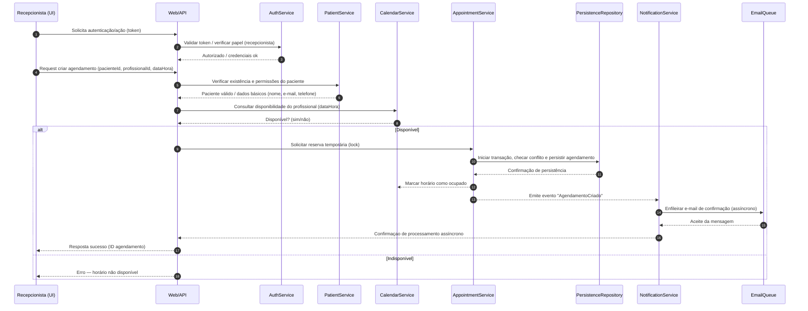
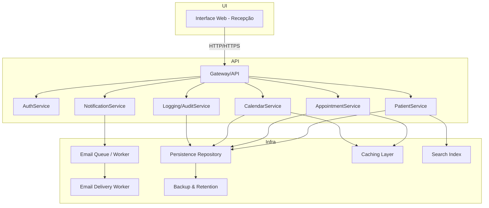

# Relatório Técnico de Arquitetura de Software

## 1. Identificação das HUs

Lista das Histórias de Usuário (IDs referenciadas no relatório):
- HU01 — Cadastrar paciente
- HU02 — Pesquisar paciente
- HU03 — Visualizar agenda do profissional
- HU04 — Registrar agendamento
- HU05 — Cancelar agendamento
- HU06 — Remarcar agendamento
- HU07 — Consultar histórico do paciente
- HU08 — Receber confirmação de agendamento por e-mail
- HU09 — Receber notificação de cancelamento ou remarcação por e-mail

Relação rápida com Requisitos Funcionais (RF) e Não-Funcionais (RNF) relevantes:
- RF01, RF02, RF03 → HU01, HU02
- RF04, RF11 → HU03
- RF05, RF06, RF08 → HU04, HU06
- RF07 → HU05
- RF09, RF10 → HU08, HU09
- RF12 → HU07
- RNF01, RNF02, RNF08 → aplicam-se transversais a todas as HUs

## 2. Diagramas de Arquitetura (Mermaid)

2.1 Diagrama de Sequência: Registrar Agendamento (inclui confirmação por e‑mail)

2.2 Diagrama de Componentes: Visão lógica dos módulos e dependências

## 3. Decisões de Arquitetura

3.1 Visão geral
- Arquitetura em camadas lógicas: Interface (UI), Gateway/API, Serviços de domínio (Patient, Appointment, Calendar, Notification), Persistência e Infraestrutura (fila, cache, indexação, logs).
- Comunicação síncrona para operações de consulta/alteração imediata (ex.: checar disponibilidade, criar/cancelar agendamento). Comunicação assíncrona para notificações por e‑mail (garante responsividade, tolerância a falhas episódicas do serviço de entrega de e‑mail).
- Separação clara entre regras de negócio de agendamento (AppointmentService + CalendarService) e interface de persistência (Repository).

3.2 Consistência e Concorrência (RF06)
- Estratégia de reserva: operações de criação/remoção de agendamento ocorrem dentro de uma unidade transacional que checa conflitos antes da persistência definitiva.
- Recomenda-se mecanismo de “lock” lógico por slot (p. ex. reserva pessimista de curto prazo) ou verificação de concorrência com fallback de retry (optimistic + conflito detectado) — decisão operacional a definir em implementação.
- CalendarService expõe uma API para checagem de disponibilidade por intervalo e para marcar/desmarcar slots; AppointmentService gerencia transações de criação e liberação de slots.

3.3 Notificações por e‑mail (RF09, RF10, RNF05)
- Enfileiramento assíncrono de mensagens de notificação (EmailQueue). Worker consome fila e faz tentativas com backoff até TTL configurado; falha total gera alerta/registro.
- Requisito RNF05 (envio em até 5 minutos) é atendido via fila com prioridade normal e retries curtos; monitoramento de processamento deve alertar violações de SLA.

3.4 Segurança e LGPD (RNF01, RNF02)
- Autenticação e autorização centralizadas (AuthService). Perfis: recepcionista, administrador. Permissões finas para operações sensíveis (ex.: exclusão/pseudonimização de dados).
- Dados pessoais: aplicar princípios de minimização e controles de acesso. Dados sensíveis devem ser criptografados em repouso e em trânsito; logs e visualizações mascaram campos sensíveis quando necessário.
- Funcionalidade para consentimento e revogação deve ser prevista (não detalhada nos requisitos), assim como processos de anonimização/exclusão por solicitação legal.

3.5 Auditoria e Logs (RNF08)
- Logging/AuditService centralizado para registrar operações críticas: criação, cancelamento, remarcação de consultas, alterações cadastrais, login/alteração de perfis.
- Logs de auditoria devem conter: quem executou, timestamp, entidade afetada, antes/depois, motivo (quando aplicável). Definir política de retenção conforme LGPD.

3.6 Performance e Usabilidade (RNF03, RNF04)
- Cache de visão de calendário (visões diária/semanal) com TTL curto para reduzir latência de carregamento (meta: < 2s por RNF04). Atualização imediata de cache por eventos de alteração.
- Indexação para pesquisa de pacientes (HU02): suportar buscas parciais e paginação.
- UI deve suportar navegação diária/semanal e distinção visual clara entre ocupados/ disponíveis.

3.7 Disponibilidade (RNF06)
- Componentização para permitir escalonamento horizontal dos serviços API, workers e serviços de notificação. Monitoramento e health checks para instâncias; failover para workers.
- Definição de janela de disponibilidade (“horário de funcionamento da clínica”) é necessária para avaliação pormenorizada do 99% uptime.

3.8 Manutenibilidade e Observabilidade
- Mecanismos de métricas e alertas para latência de resposta do API, fila de e‑mails, taxa de conflitos de agendamento e falhas no envio.
- Planos de rollback para operações críticas e testes automatizados para fluxos de agendamento.

3.9 Interfaces conceituais (neutralidade tecnológica)
- API HTTP/HTTPS entre UI e Gateway/API.
- Interface de serviço síncrona para consultas e modificações do domínio.
- Interface de evento/fila para notificações assíncronas.
- Interface de persistência genérica (Repository) com operações CRUD e consultas por índices.

## 4. Tabela de Componentes e Rastreabilidade

| Componente | Responsabilidade Principal | Comunica-se com | Origem (HU / Critério de Aceite / RF / RNF) |
|------------|---------------------------|------------------|---------------------------------------------|
| Interface Web - Recepção | Fornecer UI para recepcionista: cadastro, pesquisa, calendário, agendamento, cancelamento, remarcação, histórico | Gateway/API | HU01, HU02, HU03, HU04, HU05, HU06, HU07; RNF03 |
| Gateway/API | Validação de requisições, roteamento para serviços de domínio, autenticação/authorization forwarding | AuthService, PatientService, AppointmentService, CalendarService, NotificationService, LoggingService | Cross-cutting para todas as HUs; RNF01, RNF07 |
| AuthService | Autenticação e autorização de usuários; emissão/validação de tokens | Gateway/API, LoggingService | RNF01; HU fluxo de uso |
| PatientService | Gestão de cadastro de pacientes: criar, editar, validar duplicidade, busca | Repository, SearchIndex, LoggingService | RF01, RF02, RF03; HU01, HU02 (critérios: validação e não duplicidade) |
| AppointmentService | Regras de negócio de criação, cancelamento e remarcação de agendamentos; garantia de não duplicidade | CalendarService, Repository, NotificationService, LoggingService | RF05, RF06, RF07, RF08; HU04, HU05, HU06 |
| CalendarService | Configuração de grade de horários, consulta de disponibilidade (diária/semanal), marcação de slots | Repository, Cache, AppointmentService | RF04, RF11; HU03 |
| NotificationService | Enfileirar notificações (e‑mail), tratamento de eventos de agendamento para envio | EmailQueue, Gateway/API, LoggingService | RF09, RF10; HU08, HU09; RNF05 |
| Persistence Repository | Armazenamento de pacientes, agendamentos, configurações de grade e logs | PatientService, AppointmentService, CalendarService, LoggingService | RF01–RF12; RNF02 |
| EmailQueue / Workers | Fila de entrega e workers que processam envios, retry/backoff, dead-letter handling | NotificationService, External Email Delivery Interface | RNF05; HU08, HU09 |
| SearchIndex | Índice para pesquisa rápida de pacientes (supports partial matches) | PatientService, Gateway/API | HU02 (busca parcial) |
| Cache Layer | Cache para visões de calendário (diária/semanal) e dados de consulta frequente | CalendarService, AppointmentService | RNF04, RNF03 |
| Logging/AuditService | Registro de eventos críticos e operações sensíveis, armazenamento e exportação | Gateway/API, PatientService, AppointmentService, NotificationService, Repository | RNF08; Auditoria para HU01–HU07 |
| Backup & Retention | Políticas de backup, retenção e restauração de dados | Repository, LoggingService | RNF02 (LGPD), operacionais |

## 5. Bloqueios e Pendências

Itens que exigem decisão/entrada do Product Owner / Stakeholders antes da implementação:

1. Identificador único do paciente
   - Pendência: requisitos mencionam CPF em critérios de aceite de HU01, mas RF01 não inclui CPF explicitamente. Necessário confirmar se CPF será coletado e obrigatório.
   - Impacto: modelos de dados, verificação de duplicidade, requisitos legais (LGPD).
2. Definição de "horário de funcionamento da clínica"
   - Pendência: RNF06 define 99% uptime durante horário de funcionamento — especificar intervalo diário/semanais para cálculo.
   - Impacto: Sizing, contrato de SLA, janelas de manutenção.
3. Política de retenção de dados e logs (LGPD)
   - Pendência: períodos legais/operacionais de retenção e requisitos de anonimização/exclusão.
   - Impacto: Backup & Retention, Logging/AuditService.
4. Política de consentimento/uso de dados do paciente
   - Pendência: como e onde será registrado o consentimento e fluxo de revogação.
   - Impacto: UI de cadastro, controles de acesso, operações de anonimização.
5. Regras de negócio não especificadas sobre agendamentos
   - Pendência: duração padrão de consultas, granularidade de slots, buffer entre consultas, regras de remarcação/cancelamento (prazos, multas).
   - Impacto: CalendarService, validações de negócio, UI.
6. SLA e prioridades de e‑mail
   - Pendência: confirmar expectativa de entrega em até 5 minutos em todos os casos, prioridades de e‑mail (ex.: confirmações vs lembretes).
   - Impacto: configuração de fila, dimensionamento de workers, alertas.
7. Requisitos de autenticação detalhados
   - Pendência: métodos de autenticação (senha, SSO, MFA), ciclo de vida de contas e provisionamento.
   - Impacto: AuthService, políticas de segurança.
8. Política de recuperação e objetivos RTO/RPO
   - Pendência: definir objetivos de recuperação após falha.
   - Impacto: Backup & Retention, disponibilidade, dimensionamento.

## 6. Cobertura de Requisitos

Mapeamento direto (resumo) entre requisitos e componentes/decisões:

- RF01 (cadastrar pacientes)
  - Componentes: Interface Web, Gateway/API, PatientService, Repository
  - Observações: validação de e‑mail no serviço, verificação de duplicidade (CPF/e‑mail) em PatientService; HU01 critérios aplicados.

- RF02 (editar paciente)
  - Componentes: Interface Web, PatientService, Repository, LoggingService
  - Observações: alteração auditada; controle de permissões via AuthService (RNF01).

- RF03 (pesquisar pacientes)
  - Componentes: Interface Web, Gateway/API, PatientService, SearchIndex
  - Observações: pesquisa parcial suportada por SearchIndex; paginação recomendada.

- RF04 (exibir agenda)
  - Componentes: Interface Web, CalendarService, Cache Layer
  - Observações: visões diária/semanal, navegação entre dias/semanas; uso de cache para desempenho (RNF04, RNF03).

- RF05 (registrar consulta)
  - Componentes: AppointmentService, CalendarService, PatientService, Repository, NotificationService, EmailQueue
  - Observações: transação e checagem de conflito; evento para envio de e‑mail (RNF05).

- RF06 (impedir duplo agendamento)
  - Componentes: AppointmentService, CalendarService, Repository
  - Observações: bloqueios/cheques transacionais ou estratégia optimista com retries.

- RF07 (cancelar consulta)
  - Componentes: AppointmentService, CalendarService, NotificationService, Repository, LoggingService
  - Observações: confirmação UI; liberação imediata de slot; enfileiramento de e‑mail de cancelamento.

- RF08 (remarcar consulta)
  - Componentes: AppointmentService, CalendarService, NotificationService, Repository
  - Observações: seleção de novo horário disponível; liberação do anterior; envio de e‑mail.

- RF09/RF10 (e‑mails de confirmação/cancelamento/remarcação)
  - Componentes: NotificationService, EmailQueue, Email Delivery Worker
  - Observações: assíncrono, retries, monitoração de SLA (RNF05).

- RF11 (configurar grade de horários)
  - Componentes: CalendarService, Interface Web, Repository
  - Observações: UI de administração (perfil administrador); validação de regras da grade.

- RF12 (histórico de consultas)
  - Componentes: PatientService, AppointmentService, Repository, Interface Web
  - Observações: histórico com status; acesso a partir do cadastro do paciente (HU07).

- RNF01 (autenticação)
  - Componentes: AuthService, Gateway/API
  - Observações: roles (recepcionista, administrador) aplicadas.

- RNF02 (LGPD)
  - Componentes: PatientService, Repository, LoggingService, Backup & Retention
  - Observações: criptografia, anonimização, políticas de retenção.

- RNF03 (compatibilidade UI e visual calendário)
  - Componentes: Interface Web
  - Observações: suporte principais navegadores.

- RNF04 (desempenho agenda ≤ 2s)
  - Componentes: Cache Layer, CalendarService, API
  - Observações: caching, pré-busca e otimização de queries.

- RNF05 (envio do e‑mail ≤ 5 minutos)
  - Componentes: NotificationService, EmailQueue, Workers
  - Observações: monitoração e alertas de SLA.

- RNF06 (99% uptime durante horário da clínica)
  - Componentes: Infraestrutura geral (redundância), Monitoring/Health checks
  - Observações: definição do horário de funcionamento pendente.

- RNF07 (compatibilidade navegadores)
  - Componentes: Interface Web
  - Observações: testes cross-browser.

- RNF08 (logs operações críticas)
  - Componentes: Logging/AuditService
  - Observações: registros de criação, cancelamento, remarcação; definir retenção.

## 7. Gap Analysis

Identificação de lacunas na especificação, impacto arquitetural e recomendações.

1. Lacuna: Identificador único do paciente (CPF) — inconsistência entre HU01 e RF01
   - Impacto: definição do esquema de dados, regras de duplicidade, necessidades legais.
   - Risco: implementação de duplicidade incorreta; conflitos legais/compliance.
   - Recomendação: confirmar campos obrigatórios (CPF?) e regras de validação; documentar política de non-duplication (prioridade: CPF > e‑mail).

2. Lacuna: Duração de consulta, granularidade de slots e buffers
   - Impacto: CalendarService precisa conhecer duração e restrições; UI e lógica de disponibilidade dependem disso.
   - Risco: agendamentos inválidos, sobreposição não prevista.
   - Recomendação: especificar duração padrão (minutos), possibilidade de customização por profissional, e regra de buffer entre consultas.

3. Lacuna: Regras de remarcação e cancelamento (prazos, políticas)
   - Impacto: regras de negócio em AppointmentService; notificações e possíveis validações de permissão.
   - Risco: divergências entre UI e processos operacionais.
   - Recomendação: definir janelas mínimas para cancelamento/remarcação sem penalidade e regras de autorização.

4. Lacuna: Definição exata do "horário de funcionamento da clínica" para cálculo do uptime
   - Impacto: planejamento de disponibilidade e manutenção.
   - Recomendação: acordar horário (p. ex. dias úteis e horários) e converter 99% em janelas de manutenção aceitáveis.

5. Lacuna: Política de retenção e anonimização de dados (LGPD)
   - Impacto: Backup & Retention, LoggingService, endpoints de exclusão/anonymize.
   - Recomendação: definir prazos legais/operacionais para retenção e processo para solicitação de eliminação/anonymização.

6. Lacuna: Estratégia de autenticação detalhada (MFA/SSO)
   - Impacto: AuthService design e UX.
   - Recomendação: decidir métodos de autenticação e requisitos de segurança (força da senha, rotatividade, MFA se necessário).

7. Lacuna: Exigência de logs de auditoria — retenção, formato e exportação
   - Impacto: arquitetura de Logging/AuditService, custos de armazenamento.
   - Recomendação: definir período de retenção e requisitos de exportação/consulta para auditoria legal.

8. Lacuna: Política de SLA para envio de e‑mails além do tempo máximo (5 minutos)
   - Impacto: dimensionamento de EmailQueue, alerting.
   - Recomendação: definir percentil aceitável (p. ex. 95% até 5 minutos) e escalonamento em caso de falha.

9. Lacuna: Tratamento de fusos horários / horário de verão
   - Impacto: CalendarService e exibição para pacientes/profissionais.
   - Recomendação: definir política de timezone (normalmente horário local da clínica) e testes para mudanças de horário.

10. Lacuna: Disponibilidade de canais além do e‑mail (ex.: SMS, push)
    - Impacto: notificações futuras.
    - Recomendação: preparar NotificationService com camada de abstração para suportar múltiplos canais no futuro.

11. Lacuna: Regras de concorrência entre múltiplos pontos de atendimento/profissionais
    - Impacto: CalendarService modelagem — se profissionais compartilham salas/recursos, conflitos adicionais surgem.
    - Recomendação: confirmar se existem recursos/recintos compartilhados e expandir modelo de slot.

12. Lacuna: Testes automatizados e critérios de aceitação operacionais
    - Impacto: qualidade e implementação contínua.
    - Recomendação: definir suíte de testes integrados/end-to-end cobrindo conflito de agendamento, envio de e‑mail, busca e autenticação.

Resumo das ações recomendadas para o time de desenvolvimento / PO:
- Preencher as pendências 1–7 com PO/Stakeholders antes do início do sprint de implementação.
- Definir política de dados (retention/consent) com equipe jurídica para atender LGPD.
- Elaborar contratos de SLA internos para email/serviços e métricas a monitorar.
- Documentar regras de negócios de agendamentos (duração, buffers, políticas de cancelamento/remarcação).
- Planejar testes de carga para validar RNF04 e dimensionamento de caches/queues.

— Fim do relatório —