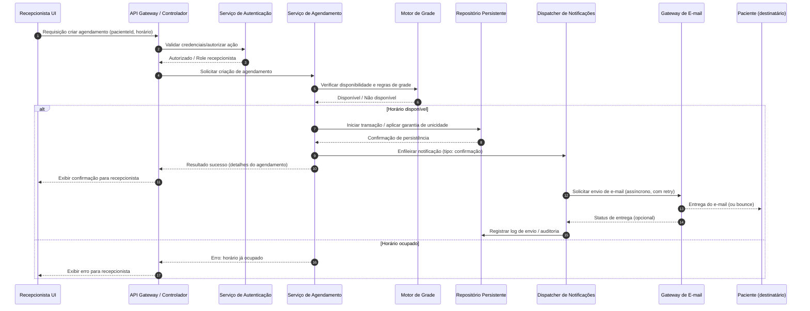

# Relatório Técnico de Arquitetura de Software

## 1. Identificação das HUs
Lista das Histórias de Usuário (HU) consideradas no projeto e assinaladas como origem dos requisitos funcionais e de aceitação:

- HU01 — Cadastrar paciente (RF01, RF02, RNF02)
- HU02 — Pesquisar paciente (RF03)
- HU03 — Visualizar agenda do profissional (RF04, RNF03, RNF04)
- HU04 — Registrar agendamento (RF05, RF06, RF09, HU04 critérios)
- HU05 — Cancelar agendamento (RF07, RF10, HU05 critérios)
- HU06 — Remarcar agendamento (RF08, RF10, HU06 critérios)
- HU07 — Consultar histórico do paciente (RF12)
- HU08 — Receber confirmação por e-mail (RF09, RNF05, HU08 critérios)
- HU09 — Receber notificação de cancelamento/remarcação por e-mail (RF10, RNF05, HU09 critérios)

Observações iniciais:
- Há uma menção ao CPF como impedimento de duplicidade no critério de aceite da HU01, porém o RF01 não cita CPF explicitamente. Isso será destacado como gap na Seção 7.

## 2. Diagramas de Arquitetura (Mermaid)

Diagrama de sequência (fluxo de criação de agendamento com notificação assíncrona):



Diagrama de componentes (alto nível):

```mermaid
graph TD
    UI[Interface Recepcionista (Web / Browser)] -->|HTTP/REST| API[API Gateway / Controlador]
    API --> Auth[Serviço de Autenticação / Autorização (RBAC)]
    API --> PatientService[Serviço de Pacientes (CRUD, Busca)]
    API --> Appointment[Serviço de Agendamento]
    Appointment --> Schedule[Motor de Grade / Validador de Disponibilidade]
    PatientService --> DB[Repositório Persistente (Dados Pessoais)]
    Appointment --> DB
    Notification[Dispatcher de Notificações / Jobs] --> EmailGateway[Gateway de E-mail (SMTP/API)]
    Appointment --> Notification
    API --> Audit[Serviço de Logs / Auditoria]
    Appointment --> Audit
    PatientService --> Audit
    subgraph Infraestrutura Conceitual
        DB
        EmailGateway
    end
```

Observação: diagramas mantêm nível conceitual e descrevem interfaces e responsabilidades, sem prescrever tecnologia específica.

## 3. Decisões de Arquitetura
1. Estilo arquitetural: arquitetura em camadas com serviços coesos (UI → API → Domínio/Serviços → Persistência) e componentes bem definidos (PatientService, AppointmentService, NotificationDispatcher). Racional: separação de responsabilidades facilita manutenção, testes e implantação incremental.

2. Consistência e integridade do agendamento: garantir unicidade do slot por meio de verificação de disponibilidade + operação atômica (transação com verificação de unicidade ou mecanismo de lock no nível de recurso). Racional: previne duplo agendamento (RF06, HU04).

3. Notificações assíncronas: envio de e-mail executado por um componente assíncrono (Dispatcher/Job Processor) com filas internas e política de retry/exponential backoff para garantir envio em até 5 minutos (RNF05). Racional: desacopla fluxo crítico de criação do agendamento e dá tolerância a latências de entrega de e-mail.

4. Autenticação e autorização (RBAC): acesso restrito a recepcionistas e administradores (RNF01). Todas as APIs críticas exigem tokens/credenciais e verificação de permissões. Racional: atender requisito de segurança.

5. LGPD e proteção de dados: responsabilidade de garantir confidencialidade, controle de acesso, registros de consentimento, possibilidade de anonimização/exclusão por política de retenção e logs de auditoria para operações críticas (RNF02). Racional: conformidade legal e proteção de dados.

6. Logs e auditoria: todas as operações críticas (criação, cancelamento, remarcação) registradas com quem fez a ação, timestamp e payload mínimo necessário, com armazenamento seguro e controles de retenção (RNF08).

7. Interface de calendário performática: Calendar UI com visualizações diária/semana (RNF03) e paginação/carregamento incremental para respeitar tempo de resposta ≤ 2s (RNF04). Racional: experiência de uso e performance.

8. Compatibilidade: APIs RESTful e interfaces web compatíveis com navegadores modernos (RNF07). Racional: máxima cobertura de compatibilidade.

9. Disponibilidade: projetar componentes como stateless quando possível e permitir replicação para atender 99% uptime (RNF06). Racional: disponibilidade operacional.

10. Observabilidade e métricas: coletar métricas de latência, taxas de erro, disponibilidade e filas de notificação para operar SLAs de envio de e-mail e carregamento de agenda.

Decisões pendentes (ver Seção 5) incluirão políticas detalhadas de retenção LGPD, estratégia exata de autenticação e limites operacionais (e.g., tempo mínimo para remarcação).

## 4. Tabela de Componentes e Rastreabilidade

| Componente | Responsabilidade Principal | Comunica-se com | Origem (HU / Critério de Aceite) |
|---|---:|---|---|
| Interface Recepcionista (UI) | Apresentar formulários, visualização de agenda (diária/semana), navegação entre dias/semanas, validação básica de entrada | API Gateway | HU01, HU02, HU03, HU04, HU05, HU06 |
| API Gateway / Controlador | Expor endpoints, validação de autenticação/autorizações, orquestração de chamadas a serviços | UI, Auth, PatientService, AppointmentService, Audit | Todas as HUs |
| Serviço de Autenticação / Autorização (Auth) | Autenticar usuários e aplicar RBAC (roles: recepcionista/administrador) | API Gateway, Audit | RNF01 |
| Serviço de Pacientes (PatientService) | CRUD de pacientes, busca parcial, validação de e-mail, prevenção de duplicidade (por e-mail/CPF) | DB, Audit | RF01, RF02, RF03, HU01, HU02 |
| Serviço de Agendamento (AppointmentService) | Gerenciar criar/cancelar/remarcar consultas, aplicar regras de não duplicidade e liberação de horários | Schedule, DB, Notification, Audit | RF04, RF05, RF06, RF07, RF08, HU03, HU04, HU05, HU06 |
| Motor de Grade / Validador de Disponibilidade (Schedule) | Definir e validar horários de atendimento do profissional (grade), calcular slots disponíveis | AppointmentService, DB | RF11, HU03 |
| Repositório Persistente (DB) | Armazenamento seguro de dados de pacientes, agendamentos e logs de auditoria (com controles LGPD) | PatientService, AppointmentService, Audit | RF01..RF12, RNF02 |
| Dispatcher de Notificações / Job Processor (Notification) | Enfileirar e processar envios de e-mail (confirmação, cancelamento, remarcação) com retry e SLA | AppointmentService, Email Gateway, DB, Audit | RF09, RF10, RNF05, HU04, HU05, HU06, HU08, HU09 |
| Gateway de E-mail (integração externa conceitual) | Interface para entrega de e-mails ao destinatário, retorno de status/erros | Notification | RF09, RF10, RNF05 |
| Serviço de Logs e Auditoria (Audit) | Registrar operações críticas com metadados (quem, quando, o quê), armazenar conforme política de retenção | API Gateway, PatientService, AppointmentService, Notification, DB | RNF08, RNF02 |
| Search Index / Serviço de Busca (opcional interno) | Otimizar buscas parciais por nome/telefone | PatientService, DB | RF03, HU02 |
| Cache / Camada de Cache (opcional) | Cache de visualização da agenda para reduzir latência de leitura na UI (respeitando consistência) | Calendar UI, AppointmentService | RNF04, HU03 |

## 5. Bloqueios e Pendências
1. Identificador único do paciente:
   - Pendência: requisito conflituoso — HU01 exige evitar duplicação por CPF ou e-mail, porém RF01 não lista CPF entre campos obrigatórios.
   - Impacto: definição do identificador primário impacta validação de duplicidade, fluxos de alteração e requisitos LGPD.
   - Ação recomendada: definir explicitamente se CPF será coletado e obrigatório; especificar formato e tratamento (hashing ou criptografia) conforme LGPD.

2. Políticas de retenção e anonimização (LGPD):
   - Pendência: períodos de retenção para dados pessoais, critérios para anonimização/exclusão, e procedimentos de atendimento a solicitações do titular.
   - Impacto: armazenamento, backups, logs, e procedimentos operacionais.
   - Ação: elaborar política de dados e fluxos para exclusão/anonimização.

3. Regras de negócio de cancelamento/remarcação:
   - Pendência: janelas mínimas para cancelamento/remarcação sem penalidade, limites de remarcações, notificações em massa etc.
   - Impacto: lógica no AppointmentService e nas notificações.
   - Ação: obter políticas operacionais da clínica.

4. SLA de entrega de e-mail e estratégia de fallback:
   - Pendência: definir ações em caso de falha de entrega (retries, alertas ao administrador, SMS alternativo).
   - Impacto: cumprimento do RNF05 e experiência do paciente.
   - Ação: acordar política de retry, tempo máximo de tentativa e canais alternativos.

5. Volume esperado e dimensionamento:
   - Pendência: tráfego esperado (nº pacientes, agendamentos por dia) para calibrar requisitos de performance/infraestrutura.
   - Impacto: arquitetura de escala, caches e requisitos de disponibilidade.
   - Ação: coletar estimativas reais para dimensionamento.

6. Estratégia de autenticação específica:
   - Pendência: escolher entre autenticação local, integração com identidade corporativa ou single sign-on.
   - Impacto: integração do Auth, procedimentos de provisionamento de usuários.
   - Ação: decidir modelo de identidade.

7. Timezone e calendário:
   - Pendência: definição do comportamento com fusos horários (se aplicável) e horário de verão.
   - Impacto: corretude das datas/horários mostrados nos e-mails e UI.
   - Ação: definir timezone padrão da clínica e política de conversão.

8. Conteúdo das notificações (templates) e idioma:
   - Pendência: definição de templates de e-mail (campos obrigatórios, assinatura, marca da clínica).
   - Impacto: Notif/EmailGateway precisa de templates e variáveis.
   - Ação: criar templates aprovados por negócio.

## 6. Cobertura de Requisitos
Mapa simplificado (RF / HU → Componentes responsáveis) com observações de atendimento:

- RF01 (Cadastro de pacientes): PatientService, API, DB, Auth. Critério de aceite (validação e duplicidade) → Implementado no PatientService; gap: CPF não declarado no RF01 (ver Seção 5).
- RF02 (Editar paciente): PatientService, API, DB, Audit.
- RF03 (Pesquisar pacientes): PatientService, Search Index (opcional), API, UI. Suporta buscas parciais (HU02).
- RF04 (Exibir agenda): AppointmentService, Schedule, API, UI, Cache. Suporta views diária/semana (HU03) e navegação.
- RF05 (Registrar consulta): AppointmentService, Schedule, DB, Notification, API, Auth. Garante seleção apenas de horários disponíveis.
- RF06 (Impedir duplo agendamento): AppointmentService + DB (controle de unicidade/lock), Schedule. Risco mitigado por transação atômica.
- RF07 (Cancelar consulta): AppointmentService, DB, Notification, Audit, API.
- RF08 (Remarcar consulta): AppointmentService, Schedule, DB, Notification, Audit. Lógica para liberar slot anterior implementada no fluxo.
- RF09 / HU08 (Enviar e-mail de confirmação em até 5 minutos): Notification, EmailGateway, DB. SLA suportado por dispatcher com retry; precisa definir SLAs de infraestrutura externa.
- RF10 / HU09 (E-mails de cancelamento/remarcação): Notification, EmailGateway, DB.
- RF11 (Configurar horários de atendimento): Schedule, API, UI. Permitirá definição de grade de horários por profissional.
- RF12 / HU07 (Histórico de consultas): AppointmentService, DB, API, UI. Histórico com status, data e horário.

Relação com RNFs:
- RNF01 (Autenticação): Auth + API.
- RNF02 (LGPD): DB, Audit, PatientService (processos de anonimização/exclusão).
- RNF03 (Usabilidade - calendário): UI, Calendar Renderer, API.
- RNF04 (Desempenho 2s): Cache, API, AppointmentService. Requer testes de carga.
- RNF05 (Envio em até 5 minutos): Notification, EmailGateway com retry e SLA operacional de filas.
- RNF06 (Disponibilidade 99%): arquitetura redundante, serviços stateless e mecanismos de failover operacionais.
- RNF07 (Compatibilidade navegadores): UI com práticas web compatíveis.
- RNF08 (Logs): Audit component e políticas de retenção.

Observação: Para cumprir RNF04 e RNF05 é necessário estabelecer métricas/alertas e testes de performance.

## 7. Gap Analysis

1. Gap: Identificador Único do Paciente (CPF)
   - Descrição: HU01 exige bloqueio de duplicidade por CPF ou e-mail, porém RF01 não menciona CPF como campo obrigatório.
   - Impacto arquitetural: altera modelagem do paciente, formato/funções de validade, requisitos LGPD (CPF é dado sensível).
   - Recomendação: decidir se CPF será obrigatório; definir formato e proteção (criptografia em repouso, pseudonimização) e incluir no modelo de dados.

2. Gap: Duração de consulta e granularidade de slots
   - Descrição: requisitos não especificam duração da consulta nem se os horários são slots fixos ou intervalos variáveis.
   - Impacto: motor de grade (Schedule) precisa dessa informação para calcular disponibilidade e impedir sobreposição.
   - Recomendação: especificar duração padrão, possibilidade de variação por tipo de atendimento e regras de buffer entre consultas.

3. Gap: Multi-profissionais / multi-salas
   - Descrição: RF fala "agenda do profissional", mas não detalha se haverá múltiplos profissionais simultâneos e alocação de salas.
   - Impacto: modelo de dados e validação de disponibilidade podem precisar de dimensão adicional (profissional, sala).
   - Recomendação: indicar se o sistema deve suportar múltiplos profissionais e recursos associados.

4. Gap: Políticas de cancelamento/remarcação (janelas e restrições)
   - Descrição: Não há regras sobre antecedência mínima, taxas ou limites de remarcação.
   - Impacto: regras embutidas no AppointmentService e notificações.
   - Recomendação: definir regras de negócio para permitir implementação consistente.

5. Gap: Estratégia de recuperação/backup e RTO/RPO
   - Descrição: RNF06 pede disponibilidade 99% mas não detalha RTO/RPO nem operação de recuperação.
   - Impacto: especificação de infraestrutura e procedimentos operacionais.
   - Recomendação: definir RTO, RPO e procedimentos de failover.

6. Gap: Entregabilidade de e-mail e tratamento de bounces
   - Descrição: RNF05 requer envio em até 5 minutos, mas não trata bounces, filas de spam ou alternativa de comunicação.
   - Impacto: Notificações podem falhar e pacientes não informados.
   - Recomendação: definir política de retry, alertas a recepção em caso de falha e possível canal alternativo (ex.: SMS).

7. Gap: Política de logs e retenção sob LGPD
   - Descrição: RNF02 e RNF08 exigem conformidade, mas períodos de retenção e escopo de logs não definidos.
   - Impacto: armazenamento e requisitos legais.
   - Recomendação: definir política de retenção, mecanismo para atender pedidos de exclusão e anonimização.

8. Gap: Localização / timezone e formato de datas
   - Descrição: Não há definição de timezone e formato regional usado em e-mails e UI.
   - Impacto: possíveis confusões em horários comunicados ao paciente.
   - Recomendação: definir timezone da clínica e política de conversão/armazenamento de datas (recomenda-se armazenar em formato consistente).

9. Gap: Testes de carga e critérios de aceitação de performance
   - Descrição: RNF04 e RNF05 requerem metas; falta definição de ramp-up, carga simultânea e métricas de sucesso.
   - Impacto: dimensionamento e tuning.
   - Recomendação: elaborar plano de testes com cenários representativos de uso.

10. Gap: Acesso do paciente ao histórico ou painel do paciente
    - Descrição: HUs focam recepcionista e notificações por e-mail; não há HU para painel do paciente.
    - Impacto: caso futuro exija acesso por paciente, design precisa suportar autenticação e consentimentos.
    - Recomendação: avaliar necessidade futura e se deve ser considerado desde já.

Resumo de ações imediatas:
- Definir CPF como campo obrigatório ou remover da regra de duplicidade.
- Especificar duração de consultas, regras de buffer e comportamento da grade.
- Determinar políticas de retenção LGPD e RTO/RPO.
- Elaborar templates de e-mails e política de retry/bounce.
- Fornecer estimativas de carga.

---

Fim do relatório. Se desejar, posso:
- Gerar diagramas adicionais (classe detalhada do domínio) ou especificações de APIs (contratos REST/DTOs) mantendo neutralidade tecnológica;
- Propor fluxo de testes de carga e critérios de aceitação técnicos;
- Elaborar proposta de políticas LGPD e modelos de registro de consentimento.