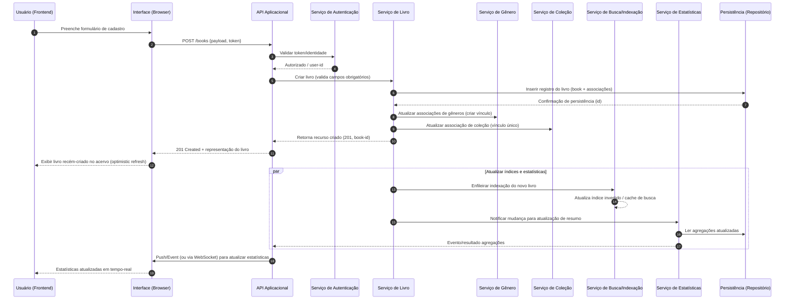

# Relatório Técnico de Arquitetura de Software

## 1. Identificação das HUs

Tabela resumo das Histórias de Usuário (HU) e rastreabilidade inicial para requisitos funcionais (RF):

| HU ID | Resumo | RF(s) cobertos |
|-------|--------|----------------|
| HU01 | Cadastrar livro (título, autor, editora, tipo físico/digital, status) | RF01, RF04, RF05, RF13 |
| HU02 | Atualizar status de leitura | RF05, RF10 |
| HU03 | Criar/editar/remover gêneros e associar livros | RF06, RF08, RF11 |
| HU04 | Criar/editar/remover coleções e associar livros (1 coleção por livro) | RF07, RF08 |
| HU05 | Filtrar acervo por atributos e combinar filtros | RF09 |
| HU06 | Buscar por título/autor com retorno parcial e dinâmico | RF12 |
| HU07 | Visualizar resumo estatístico (totais por status, gêneros frequentes) | RF10, RF11, RNF05 |
| HU08 | Exportar acervo em CSV/JSON para download no navegador | RNF07, RNF04 |

Observações:
- Cada HU é mapeada para os RFs mais diretamente relacionados; RFs transversais (ex.: persistência, segurança, usabilidade) são considerados nas decisões arquiteturais.
- Critérios de aceite de cada HU foram utilizados como origem para componentes que suportam validação, consistência e atualizações em tempo-real.

---

## 2. Diagramas de Arquitetura (Mermaid)

Abaixo estão os diagramas conceituais principais. Todos os diagramas são neutros em tecnologia e mostram responsabilidades e interfaces.

2.1 Diagrama de sequência: cadastro de livro (fluxo completo, atualização de índice de busca e atualização de estatísticas em tempo-real)



2.2 Diagrama de componentes (visão lógica e interfaces)

```mermaid
graph TD
    subgraph Cliente
        UI[Interface (Web/Mobile responsiva)]
    end

    subgraph Backend
        API[API Aplicacional (REST/HTTP/GraphQL)]
        Auth[Serviço de Autenticação & Autorização]
        BookSvc[Serviço de Livro (CRUD)]
        GenreSvc[Serviço de Gênero]
        CollSvc[Serviço de Coleção]
        SearchSvc[Serviço de Busca / Filtro / Indexação]
        StatsSvc[Serviço de Estatísticas e Agregações]
        ExportSvc[Serviço de Exportação (CSV/JSON)]
    end

    subgraph Persistência
        DB[Repositorio Persistente (dados do usuário, livros, relações)]
        IndexCache[Índice de Busca / Cache]
    end

    UI -- API: Requisições HTTP + WS/Push
    API -- Auth: Validar identidade/autorização
    API -- BookSvc: Operações CRUD livro
    API -- GenreSvc: CRUD gêneros
    API -- CollSvc: CRUD coleções
    BookSvc -- DB: Persistir livro, associações
    GenreSvc -- DB: Persistir gêneros
    CollSvc -- DB: Persistir coleções
    BookSvc -- SearchSvc: Atualizar índice
    SearchSvc -- IndexCache: Indexação/consulta rápida
    BookSvc -- StatsSvc: Emitir eventos de mudança
    StatsSvc -- DB: Calcular agregações (ou ler agregações pré-computadas)
    ExportSvc -- DB: Ler conjuntos para gerar CSV/JSON
    API -- ExportSvc: Solicitar exportação + fornecer arquivo para download
```

2.3 Diagrama de classes / entidades (modelo conceitual de dados)

```mermaid
classDiagram
    class Usuário {
        +id
        +nome
        +email
        +hashedPassword
    }
    class Livro {
        +id
        +titulo
        +autor
        +editora
        +tipo  <<enum: Físico, Digital>>
        +status  <<enum: Não Lido, Lendo, Concluído>>
        +dataCadastro
    }
    class Gênero {
        +id
        +nome
    }
    class Coleção {
        +id
        +nome
    }

    Usuário "1" o-- "N" Livro : possui
    Livro "N" o-- "N" Gênero : pertence_a
    Livro "N" o-- "0..1" Coleção : pertence_a
```

---

## 3. Decisões de Arquitetura

Lista das decisões arquiteturais principais, justificativas e implicações:

D1 — Isolamento por usuário e autenticação obrigatória
- Decisão: todo acesso requer autenticação; dados isolados por identificador do usuário.
- Justificativa: RNF01 exige acervo pessoal e isolado.
- Impacto: serviços e persistência devem filtrar por user-id; testes de autorização precisam cobrir todas as APIs.

D2 — API única com serviços lógicos separados (Book, Genre, Collection, Search, Stats, Export)
- Decisão: separar responsabilidades em componentes lógicos (serviços) para clareza, testabilidade e escalabilidade.
- Justificativa: facilita manutenção, cobertura dos HUs e evolução (adicionar features como histórico).
- Impacto: definir contratos/contratos internos entre serviços; orquestração via API.

D3 — Indexação/serviço de busca separado para atender filtros e buscas parciais com desempenho (<= 2s)
- Decisão: consultas de listagem/filtragem delegadas a componente de busca/index.
- Justificativa: RNF03 (performace) e HUs de busca/filtragem dinâmicas.
- Impacto: requisito de consistência eventual entre dados persistidos e índice; necessidade de estratégias de atualização (síncrona leve ou fila assíncrona).

D4 — Atualizações em tempo-real do resumo estatístico
- Decisão: evento de mudança disparado em operações CRUD para StatsSvc que atualiza vistas/aggregations e notifica UI.
- Justificativa: RNF05 e critérios de aceitação HU02/HU07.
- Impacto: implementar mecanimos de entrega (push/long-polling/WS) e garantir latência baixa para atualizações.

D5 — Modelo de dados: Livro com relacionamentos N:N com Gênero e 0..1 com Coleção
- Decisão: modelar gêneros como N:N; coleção como associação única.
- Justificativa: HU03 (vários gêneros) e HU04 (uma coleção por livro).
- Impacto: operações de remoção de gênero/coleção devem desvincular sem excluir livros (critério explícito).

D6 — Exportação sob demanda gerada no servidor e entregue ao cliente
- Decisão: ExportSvc prepara CSV/JSON com todos os campos e disponibiliza download via API.
- Justificativa: RNF07 e HU08.
- Impacto: considerar limitações de memória e streaming para grandes bases; fornecer feedback ao usuário.

D7 — Validação e regras de negócio no backend
- Decisão: validações críticas (campos obrigatórios, enums de status/tipo, unicidade) aplicadas no backend.
- Justificativa: segurança e integridade dos dados.
- Impacto: frontend realiza validação UX, backend garante consistência.

D8 — UI responsiva e progressiva
- Decisão: front-end deve ser responsivo e oferecer feedback imediato (optimistic updates) e acessível em navegadores citados.
- Justificativa: RNF02, RNF06, e dinamicidade exigida pelas HUs.
- Impacto: testes em múltiplos navegadores; desacoplamento UI/API.

Observação: todas as decisões preservam neutralidade tecnológica — não são prescritos produtos ou frameworks.

---

## 4. Tabela de Componentes e Rastreabilidade

| Componente | Responsabilidade Principal | Comunica-se com | Origem (HU / Critério de Aceite) |
|------------|---------------------------|------------------|----------------------------------|
| Interface (UI) | Capturar entrada do usuário, renderizar acervo, filtros e estatísticas, fornecer download | API Aplicacional | HU01, HU05, HU06, HU07, RNF02, RNF06 |
| API Aplicacional | Contrato público das operações (auth, livros, gêneros, coleções, busca, export) | UI, Auth, BookSvc, GenreSvc, CollSvc, SearchSvc, ExportSvc, StatsSvc | Todos (orquestração) |
| Serviço de Autenticação (Auth) | Autenticar e autorizar requisições; prover user-id para operações | API Aplicacional, DB (usuários) | RNF01 |
| Serviço de Livro (BookSvc) | CRUD de livros; validação de campos obrigatórios; garantir tipo e status válidos | DB, GenreSvc, CollSvc, SearchSvc, StatsSvc, API | HU01, HU02, HU03, HU04, RF01, RF02, RF03, RF13 |
| Serviço de Gênero (GenreSvc) | CRUD de gêneros; manter vínculos de livros sem excluir livros ao remover gênero | DB, BookSvc, API | HU03, RF06 |
| Serviço de Coleção (CollSvc) | CRUD de coleções; garantir 1 coleção por livro; desvincular sem excluir livros | DB, BookSvc, API | HU04, RF07 |
| Serviço de Busca/Indexação (SearchSvc) | Indexar livros; executar filtros combinados e buscas parciais com latência baixa | DB, IndexCache, API, UI | HU05, HU06, RF09, RF12, RNF03 |
| Serviço de Estatísticas (StatsSvc) | Calcular e manter resumo do acervo (totais por status, gêneros frequentes) e notificar UI | DB, API, BookSvc, SearchSvc | HU07, RF10, RF11, RNF05 |
| Serviço de Exportação (ExportSvc) | Gerar CSV/JSON contendo todos os campos do acervo e entregar para download | DB, API, UI | HU08, RNF07 |
| Persistência (DB) | Armazenar livros, gêneros, coleções, usuários e relações | BookSvc, GenreSvc, CollSvc, StatsSvc, ExportSvc, Auth | RNF04 |
| Índice/Camada de Cache (IndexCache) | Armazenamento otimizado para consultas de busca/filtragem | SearchSvc, API | RNF03 |

Observações:
- A coluna “Origem” refere-se à HU ou critério de aceite que motivou o componente.
- Comunicação entre componentes pode ser sincrona (chamada API) ou assíncrona (eventos/filas) dependendo da operação (definido nas decisões).

---

## 5. Bloqueios e Pendências

Lista de itens pendentes que impactam projeto/implementação:

1. Política de Autenticação e Gerenciamento de Conta
   - Pendência: especificar métodos de inscrição/recuperação de conta e requisitos de senha.
   - Impacto: bloqueia definições de fluxos de Auth e UX.

2. Volume estimado de dados e SLAs de desempenho reais
   - Pendência: estimativa do número médio e pico de livros por usuário e número de usuários concorrentes.
   - Impacto: dimensionamento de indexação, cache e estratégias de paginação.

3. Estratégia de sincronização e multi-dispositivo
   - Pendência: definir se há suporte offline e sincronização conflitante.
   - Impacto: necessário para garantir consistência eventual e UX em dispositivos móveis.

4. Critérios de retenção e limites de exportação
   - Pendência: definir limites máximos por exportação (tamanho/linhas) e políticas de chunking/streaming.
   - Impacto: implementação de ExportSvc streaming/assíncrono.

5. Requisitos de auditoria/historicidade
   - Pendência: especificar se histórico de alterações (ex.: histórico de status) deve ser mantido.
   - Impacto: altera modelagem de dados e necessidade de tabela de histórico/event-sourcing.

6. Requisitos de acessibilidade e internacionalização
   - Pendência: decisão sobre suporte a múltiplos idiomas / normas de acessibilidade.
   - Impacto: UI e mensagens server-side.

7. Testes cross-browser e matriz de dispositivos
   - Pendência: listar navegadores/versões alvo para cumprir RNF06.
   - Impacto: planejamento de testes e possíveis polyfills.

---

## 6. Cobertura de Requisitos

Mapeamento direto RF/HU -> Componentes responsáveis e status de cobertura (Concluído/Planejado/Parcial):

- RF01 (Cadastrar livro): BookSvc, API, UI, Auth, DB — Planejado
- RF02 (Editar livro): BookSvc, API, UI, DB — Planejado
- RF03 (Remover livro): BookSvc, API, UI, DB, StatsSvc — Planejado
- RF04 (Três status de leitura): BookSvc, UI — Concluído (especificado no modelo)
- RF05 (Atualizar status a qualquer momento): BookSvc, API, UI, StatsSvc — Planejado
- RF06 (CRUD gêneros): GenreSvc, API, UI, DB — Planejado
- RF07 (CRUD coleções): CollSvc, API, UI, DB — Planejado
- RF08 (Associação livro ↔ gêneros/coleção): BookSvc, GenreSvc, CollSvc, DB — Planejado
- RF09 (Filtrar por qualquer atributo): SearchSvc, API, UI, IndexCache — Planejado (requer index)
- RF10 (Resumo total por status): StatsSvc, API, UI, DB — Planejado
- RF11 (Gêneros mais frequentes): StatsSvc, API, DB — Planejado
- RF12 (Pesquisa por título/autor via campo): SearchSvc, API, UI — Planejado
- RF13 (Diferenciar físico/digital): BookSvc, UI, DB — Concluído (incluído no modelo)

HU Coverage (sumário)
- HU01: Coberto por BookSvc + API + UI + Auth (Planejado)
- HU02: Coberto por BookSvc + StatsSvc + UI (Planejado)
- HU03: Coberto por GenreSvc + BookSvc + UI (Planejado)
- HU04: Coberto por CollSvc + BookSvc + UI (Planejado)
- HU05: Coberto por SearchSvc + API + UI (Planejado)
- HU06: Coberto por SearchSvc + UI (Planejado)
- HU07: Coberto por StatsSvc + UI (Planejado)
- HU08: Coberto por ExportSvc + API + UI (Planejado)

Observações:
- “Planejado” significa que o componente e a interface foram identificados e modelados; falta detalhamento de APIs e testes de integração.
- Áreas com cobertura parcial dependem de decisões pendentes (Seção 5).

---

## 7. Gap Analysis

Identificação de lacunas na especificação, impactos arquiteturais e recomendações de ação.

Gap G1 — Autenticação/gestão de conta incompleta
- Impacto: sem detalhes, não é possível definir fluxos de login/recuperação e políticas de segurança.
- Recomendação: especificar fluxos (registro, login, reset de senha, sessões) e requisitos de segurança (ex.: expiração de sessão, MFA opcional).

Gap G2 — Conflitos de edição concorrente e multi-dispositivo
- Impacto: risco de perda de alterações se o mesmo livro for editado em múltiplos dispositivos simultaneamente.
- Recomendação: definir política de concorrência (último grava vence; locking otimista com versão/timestamp; ou histórico de mudanças).

Gap G3 — Comportamento offline / sincronização
- Impacto: UX em dispositivos móveis sem conexão não especificada; inconsistências na estatística em tempo real podem surgir.
- Recomendação: decidir se haverá suporte offline; se sim, definir estratégia de sincronização e resolução de conflitos.

Gap G4 — Volume e performance não dimensionados
- Impacto: RNF03 (<=2s) depende de dados reais; sem estimativas, não é possível dimensionar index e cache.
- Recomendação: coletar estimativas (média e percentil de número de livros por usuário, usuários concorrentes) e definir requisitos de SLA detalhados.

Gap G5 — Auditoria e histórico de status
- Impacto: HU02 e análises futuras podem demandar histórico de mudanças (quando e por quem o status mudou).
- Recomendação: esclarecer necessidade de manter histórico; se necessário, incluir componente de audit logs/historicidade.

Gap G6 — Regras de validação e limites (tamanho de campos, caracteres especiais, limites de exportação)
- Impacto: inconsistências de validação entre UI e backend.
- Recomendação: definir regras de domínio (tamanho máximo de título/autor/editora, formatos aceitos) e limites de export (max linhas/MB).

Gap G7 — Segurança adicional: proteção contra brute-force, rate limiting, e exposição de dados via export
- Impacto: RNF01 exige segurança; detalhes operacionais não estão especificados.
- Recomendação: definir políticas de rate limiting, logs de acesso, e validações na exportação para evitar vazamento acidental.

Gap G8 — Requisitos de testes (cross-browser, responsividade) não detalhados
- Impacto: RNF02/RNF06 dependem da matriz de navegadores/dispositivos.
- Recomendação: definir a matriz alvo (versões mínimas) e critérios de aceitação em testes automáticos.

Gap G9 — Internacionalização e acessibilidade não definidas
- Impacto: UX pode não atender requisitos legais/regulatórios de acessibilidade.
- Recomendação: decidir nível de compatibilidade com padrões de acessibilidade e suporte a idiomas.

Gap G10 — Backups, retenção e restauração
- Impacto: RNF04 pede persistência sem perda; detalhes operacionais de backup e restauração não especificados.
- Recomendação: definir frequência de backup, testes de restauração e formatos exportáveis para backup manual.

Resumo das Ações Recomendadas (priorizadas)
1. Definir política de autenticação e gestão de contas (G1) — ALTA prioridade.
2. Fornecer estimativas de volume e SLAs (G4) — ALTA prioridade para dimensionamento.
3. Decidir sobre suporte offline e política de concorrência (G2, G3) — MÉDIA/ALTA.
4. Especificar requisitos de audit/history e políticas de exportação (G5, G6, G7) — MÉDIA.
5. Definir matriz de testes e requisitos de acessibilidade (G8, G9) — MÉDIA.
6. Definir backup/retention/restore (G10) — MÉDIA.

---

Fim do Relatório.

Observação final: este relatório provê uma base neutra e arquitetural adequada para iniciar iterações de desenvolvimento. Recomenda-se que o time realize workshops técnicos para transformar decisões em contratos de API, modelos de dados físicos e planilhas de dimensionamento antes da implementação.