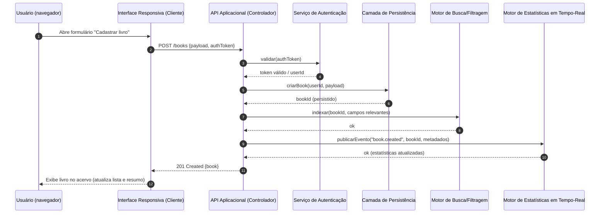

# Relatório Técnico de Arquitetura de Software

## 1. Identificação das HUs
Mapeamento das Histórias de Usuário e seus critérios de aceite (resumo):

- HU01 — Cadastrar livro
  - Campos: título (obrigatório), autor (obrigatório), editora, tipo (físico/digital), status (não lido/ lendo/ concluído)
  - Aceite: Livro aparece imediatamente no acervo.
- HU02 — Atualizar status de leitura
  - Status mutável a qualquer momento; estatísticas atualizadas imediatamente.
- HU03 — Organizar livros por gênero
  - Criar, renomear, remover gêneros; livro pode ter múltiplos gêneros; remoção desassocia sem excluir livros.
- HU04 — Organizar livros por coleção
  - Criar, renomear, remover coleções; livro pertence a no máximo 1 coleção; remoção desassocia sem excluir livros.
- HU05 — Filtrar o acervo
  - Filtros combináveis por título, autor, editora, status, gênero, coleção, tipo; resultados dinâmicos; limpar filtros em um clique.
- HU06 — Pesquisar livros por título ou autor
  - Busca por substrings; resultados dinâmicos enquanto digita.
- HU07 — Visualizar resumo do acervo
  - Total geral; total por status; gêneros mais frequentes; estatísticas atualizadas automaticamente.
- HU08 — Exportar o acervo
  - Exportação completa em CSV ou JSON, todos os campos, gerada pelo navegador.

(HUs derivadas diretamente dos RFs listados no enunciado; cada HU cobre um subconjunto de RFs conforme rastreabilidade na Seção 6.)

---

## 2. Diagramas de Arquitetura (Mermaid)

A arquitetura proposta é em camadas com interface responsiva (cliente), API aplicacional (lógica de negócio e coordenação), serviços de suporte (autenticação, indexação/busca, exportação, estatísticas em tempo-real) e persistência durável. A seguir: diagrama de sequência (fluxo de cadastro) e diagrama de componentes.

- Diagrama de sequência: fluxo de cadastrar livro, indexar para busca, atualizar estatísticas e retorno ao usuário.



- Diagrama de componentes (visão lógica, interfaces expostas):

```mermaid
graph TD
  subgraph Cliente
    UI[Interface Responsiva (Web/RWD)]
    CacheC[(Cache Local / Estado)]
  end

  subgraph Servidor
    API[API Aplicacional (Controlador de Domínio)]
    Auth[Serviço de Autenticação & Autorização]
    BL[Camada de Lógica de Negócio]
    Export[Gerador de Exportação (CSV/JSON)]
    Stats[Motor de Estatísticas em Tempo-Real]
    Search[Indexador / Motor de Busca e Filtragem]
  end

  subgraph Armazenamento
    DB[Persistência Durável (entidades: User, Book, Genre, Collection, Audit)]
    OBJ[Armazenamento de Arquivos (opcional para digitais)]
    Backup[(Mecanismo de Backup / Export)]
  end

  UI -->|HTTPS / API Contract| API
  UI -->|WebSocket / Push| Stats
  API --> Auth
  API --> BL
  BL --> DB
  BL --> Search
  BL --> Export
  BL --> Stats
  BL --> OBJ
  Search --> DB
  Export --> DB
  Backup --> DB
  DB --> Backup
```

Notas sobre os diagramas:
- Interfaces entre componentes são contratuais (endpoints/msgs). A API é o único ponto de entrada do cliente ao domínio.
- Stats aceita atualizações por eventos internos e expõe push para UI (WebSocket/Server-Sent Events) para cumprir atualização imediata.
- Index/Search fornece consultas rápidas e filtragem tipo "contains" para suporte à busca dinâmica.

---

## 3. Decisões de Arquitetura

Lista de decisões arquiteturais relevantes e justificativas (neutras quanto a tecnologias específicas):

1. Autenticação como requisito obrigatório
   - Responsabilidade: isolar acervo por usuário (RNF01).
   - Interface: token de sessão/JWT-like ou sessão com verificação por cada chamada de API.
   - Justificativa: garante segregação de dados; API valida antes de executar ações.

2. API aplicacional como contrato único
   - Responsabilidade: exposição de operações CRUD para Book/Genre/Collection, operações de busca/filtragem, exportação e endpoints de estatísticas.
   - Interface: contrato HTTP/JSON com endpoints bem documentados (verbos coerentes).
   - Justificativa: separa UI da lógica de negócio; facilita testes e evolução.

3. Modelo de domínio simples e normalizado
   - Entidades principais: User, Book, Genre, Collection, Audit/Event.
   - Regras importantes:
     - Book: possui título*, autor*, editora, tipo (físico/digital), status (não lido/ lendo/ concluído), referências a gêneros (N:N) e coleção (0..1).
     - Gênero: CRUD livre; remoção apenas desassocia.
     - Coleção: CRUD livre; livro pertence a no máximo uma coleção.

4. Indexação / Motor de busca para busca dinâmica e filtragem rápida
   - Responsabilidade: fornecer pesquisa por substring e filtragem combinada com resposta em < 2s (RNF03), independente do volume.
   - Interface: API de consulta especializada (consulta por campos, filtros combinados, ordenação, paginação).
   - Justificativa: operações de texto parcial e filtros compostos exigem estrutura otimizada; solução deve ser mantida separada da camada de persistência primária.

5. Estatísticas em tempo real via publicação de eventos internos
   - Responsabilidade: manter contadores (total geral, total por status, gêneros mais frequentes) atualizados imediatamente (RNF05, HU07).
   - Interface: publicação de eventos (ex.: book.created, book.updated, book.deleted) dentro da aplicação; componente de Stats atualiza agregados e notifica UI.
   - Justificativa: separa custo de cálculo de agregados da latência das operações transacionais; permite atualizações push ao cliente.

6. Exportação no cliente (geração de arquivo via API ou por download gerado pelo navegador)
   - Responsabilidade: geração de CSV/JSON com todos os campos do acervo (HU08, RNF07).
   - Interface: endpoint de exportação que retorna payload pronto para download, ou endpoints que forneçam dados para geração no cliente.
   - Justificativa: garante download direto no navegador sem depender de ferramentas externas.

7. Consistência e integridade
   - Responsabilidade: operações que alteram relacionamentos (remoção de gênero/coleção) devem desassociar sem excluir Book.
   - Interface: endpoints de remoção com comportamento definido (desassociar vs cascade).
   - Justificativa: atende HU03/HU04.

8. Disponibilidade / Persistência durável
   - Responsabilidade: garantir que dados não sejam perdidos ao fechar/recarregar app (RNF04).
   - Interface: persistência com confirmação de gravação antes de resposta 2xx ao cliente.
   - Justificativa: requisito explícito.

9. Neutralidade tecnológica e extensibilidade
   - A arquitetura é agnóstica; interfaces e contratos são destacados para permitir escolha técnica posterior.

---

## 4. Tabela de Componentes e Rastreabilidade

| Componente | Responsabilidade Principal | Comunica-se com | Origem (HU / Critério de Aceite) |
|------------|---------------------------|------------------|----------------------------------|
| Interface Responsiva (UI) | Apresentação, formulários, filtros dinâmicos, interação do usuário, download de export | API, Stats (push), Cache Local | HU01, HU02, HU05, HU06, HU07, HU08 (ex.: livro aparece imediatamente; busca dinâmica) |
| API Aplicacional (Ponto único de entrada) | Orquestra validação, autenticação, regras de negócio e coordenação entre serviços | UI, Auth, BL, Export, Search, Stats | RF01-RF13, RNF01-RNF07, HU01-HU08 |
| Serviço de Autenticação | Validar identidade e autorização para isolar dados por usuário | API | RNF01 |
| Camada de Lógica de Negócio (BL) | Regras de domínio: validações (título e autor obrigatórios), associações livres, remoções que desassociam | API, DB, Search, Stats, Export | HU01, HU02, HU03, HU04, critérios de aceite (campos obrigatórios, desvinculação) |
| Persistência Durável (DB) | Armazenamento de entidades: User, Book, Genre, Collection, Audit | BL, Backup, Search, Export | RNF04, HU01-HU08 |
| Motor de Busca / Filtragem (Index) | Indexação de campos para busca por substring e filtros combinados; consultas rápidas | BL, API, DB | RF09, HU05, HU06, RNF03 |
| Motor de Estatísticas em Tempo-Real (Stats) | Agregados: totais por status, gêneros mais frequentes; push para UI | BL, API, UI | RF10, RF11, RNF05, HU02, HU07 |
| Gerador de Exportação (CSV/JSON) | Construir e retornar arquivos de exportação completos | BL, API, DB | RNF07, HU08 |
| Cache Local / Estado Cliente | Minimizar latência percebida; armazenar lista atual enquanto navega | UI | RNF02, RNF05 |
| Backup / Export Service (processo de Backup) | Mecanismo para exportar/backup periódicos/manuais do DB | DB, Export | RNF04, RNF07 |
| Armazenamento de Arquivos (opcional) | Guardar arquivos associados a livros digitais (se necessário) | BL, API, DB | RF13 (implicação operacional para livros digitais) |

Observação: "Origem" indica HU ou critério de aceite que originou a responsabilidade.

---

## 5. Bloqueios e Pendências

Itens que necessitam de definição antes do desenvolvimento ou que impactam a arquitetura:

1. Especificação da gestão de identidade
   - Detalhes pendentes: fluxo de cadastro/recuperação de senha, política de senha, se haverá SSO.
   - Impacto: implementação de Auth pode variar (tokens, sessões, expiração); afeta UX e segurança.

2. Volume esperado de dados e perfil de uso
   - Falta definição de número médio/máximo de livros por usuário e número de usuários simultâneos.
   - Impacto: dimensionamento de Index e estratégia de performance para cumprir RNF03.

3. Comportamento em relação a livros digitais (RF13)
   - Requisitos não especificam armazenamento de arquivos, streaming, direitos autorais nem tamanho máximo.
   - Impacto: se for necessário armazenar arquivos, exige componente de armazenamento de objetos e políticas de proteção/privacidade.

4. Política de retenção de backups e requisitos legais
   - Pendência: frequência e retenção de backup, criptografia de backup.
   - Impacto: operação e custo de manutenção.

5. Requisitos de segurança detalhados (cryp. em trânsito/repouso, logs, auditoria)
   - Pendência: nível de proteção exigido.
   - Impacto: implementação de criptografia, logs de auditoria e políticas de acesso.

6. Definição de offline/ sincronização
   - Pendência: se aplicativo deve funcionar offline no cliente e como resolver conflitos de sincronização.
   - Impacto: pode exigir mecanismo de sincronização e resolução de conflitos.

7. SLAs e métricas de observabilidade
   - Falta: métricas de latência, disponibilidade e alertas.
   - Impacto: dificulta definição de SLOs e dimensionamento operacional.

---

## 6. Cobertura de Requisitos

Rastreabilidade RF/RNF → Componentes / Mecanismos que cobrem o requisito.

- RF01 (Cadastrar livro): API Aplicacional + BL + Persistência + UI. HU01.
- RF02 (Editar livro): API + BL + Persistência + Index + Stats + UI. HU01/HU02.
- RF03 (Remover livro): API + BL + Persistência + Index + Stats + UI. (desassociação de gênero/coleção tratada na BL). HU03/HU04.
- RF04 (Três status de leitura): BL + UI — campo enumerado controlado; Persistência armazena enum. HU01.
- RF05 (Atualizar status): API + BL + Persistência + Stats + UI (push). HU02.
- RF06 (CRUD gêneros): API + BL + Persistência + Index (opcional para filtros) + UI. HU03.
- RF07 (CRUD coleções): API + BL + Persistência + UI. HU04.
- RF08 (Associação gêneros/coleção): BL + Persistência + API + UI. HU03/HU04.
- RF09 (Filtrar por qualquer atributo): Index (motor de busca/filtragem) + API + UI. HU05.
- RF10 (Resumo total por status): Stats + API + UI. HU07.
- RF11 (Gêneros mais frequentes): Stats (agregação) + API + UI. HU07.
- RF12 (Pesquisar por título/autor): Index + API + UI (busca dinâmica). HU06.
- RF13 (Diferenciar físico/digital): Modelagem em Book.tipo + UI + BL + Persistência; opcionalmente Armazenamento de Arquivos se houver arquivos digitais. HU01.

Requisitos Não Funcionais:
- RNF01 (Autenticação): Serviço de Autenticação + API. Coberto por arquitetura.
- RNF02 (Usabilidade — responsivo): UI projetada responsiva; testes em dispositivos móveis/desktops.
- RNF03 (Desempenho — listagem/filtragem ≤ 2s): Index e paginação; caching; cobertura proposta (dependente do volume).
- RNF04 (Persistência): Persistência Durável (DB) + Backup.
- RNF05 (Resumo em tempo real): Stats + eventos internos + push ao UI.
- RNF06 (Compatibilidade navegadores): UI e testes (políticas de compatibilidade).
- RNF07 (Exportar CSV/JSON): Componente Export + API + UI para download.

Cobertura geral: todos os RFs e RNFs são representados por componentes; implementação detalhada e dimensionamento dependem das pendências listadas (Seção 5).

---

## 7. Gap Analysis

Identificação de lacunas na especificação, impactos arquiteturais e recomendações.

1. Identidade e Autenticação (lacuna)
   - Falta: métodos exatos de autenticação, fluxos de cadastro/recuperação e requisitos de sessão.
   - Impacto: decisões de implementação (tokens, expiração, revogação) afetarão design do Auth e UX.
   - Recomendação: definir política de identidade (cadastro, reset, expiração de sessão, MFA opcional); documentar contratos de autorização.

2. Escopo e armazenamento de "livros digitais" (lacuna)
   - Falta: se serão armazenados arquivos, limites de tamanho, formatos e direitos autorais.
   - Impacto: exige componente de armazenamento de arquivos, políticas de privacidade e custos.
   - Recomendação: esclarecer se digital = apenas metadados ou arquivo binário; definir cap de tamanho e regras de distribuição.

3. Volume esperado e requisitos de escalabilidade (lacuna)
   - Falta: número médio/máximo de registros por usuário e usuários simultâneos.
   - Impacto: definição de arquitetura do Index e dimensionamento do sistema para cumprir RNF03.
   - Recomendação: coletar estimativas de volume; definir testes de carga; escolher estratégia de shard/index se necessário.

4. Requisitos de segurança detalhados (lacuna)
   - Falta: criptografia em repouso, em trânsito, logs de auditoria, conformidade.
   - Impacto: pode alterar componentes (adicionar camadas de criptografia, gerenciamento de chaves).
   - Recomendação: definir políticas de segurança e conformidade, incluindo requisitos de auditoria.

5. Offline / Sincronização e Conflitos (lacuna)
   - Falta: comportamento offline do cliente não está especificado.
   - Impacto: se requerido, aumenta complexidade (sincronização, resolução de conflitos, versionamento).
   - Recomendação: decidir se há suporte offline; se sim, definir modelo de sincronização (last-write-wins, merges, CRDTs).

6. Operacionalização: backups, restauração, monitoramento (lacuna)
   - Falta: frequência/retenção de backups e métricas operacionais.
   - Impacto: sem definição, pode comprometer recuperação de dados.
   - Recomendação: estabelecer política de backup e plano de restauração; definir métricas e alertas.

7. Performance realista da filtragem (observação)
   - RNF03 exige listagem/filtragem ≤ 2s "independentemente do volume" — tecnicamente ambíguo.
   - Impacto: pode exigir limites operacionais; sem limites, custo e complexidade altos.
   - Recomendação: negociar SLOs baseados em volumes razoáveis (ex.: 10k/100k livros) e definir limites/paginação.

8. Testes de usabilidade e compatibilidade (lacuna)
   - Falta: critérios de aceitação para responsividade e navegadores exatos.
   - Impacto: pode introduzir retrabalho se não testado em navegadores alvo.
   - Recomendação: definir matriz mínima de navegadores/versões e critérios de responsividade.

9. Auditoria e histórico de alterações (potencial lacuna)
   - Falta: requisito explícito de histórico de alterações ou log de auditoria.
   - Impacto: sem logs, rastreabilidade de quem alterou o quê é limitada.
   - Recomendação: adicionar requisito para auditoria mínima (alterações em livros/status, criação/remoção de gêneros/coleções).

10. Exportação — limites e performance (lacuna)
    - Falta: tamanho máximo do arquivo exportado, se exportação será síncrona ou assíncrona.
    - Impacto: exports muito grandes podem travar o navegador; necessidade de geração assíncrona.
    - Recomendação: definir limites ou opção de geração assíncrona por e-mail/URL temporária para grandes volumes.

---

Observações finais e próximas ações recomendadas (priorizadas)
1. Validar decisões de identidade e autorizações (altíssima prioridade).
2. Recolher estimativas de volume de dados e cenários de carga para ajustar Index e garantir RNF03.
3. Decidir política sobre livros digitais (armazenamento de arquivos).
4. Definir políticas de backup/retenção e requisitos de segurança (criptografia/auditoria).
5. Elaborar contratos de API (endpoints, formatos, erros) e protótipos de UI responsiva para validação de HU05/HU06/HU07.
6. Criar plano de testes (funcionais, carga, usabilidade, cross-browser) e POC do fluxo de exportação para validar experiência de download.

--- 

Documento preparado para orientar a próxima iteração (desenho detalhado e backlog técnico).