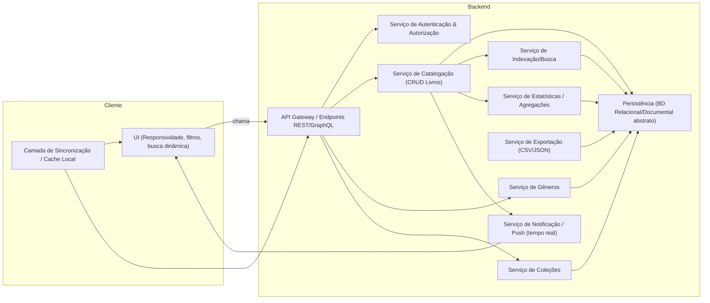

# Relatório Técnico de Arquitetura de Software

## 1. Identificação das HUs
Lista de Histórias de Usuário e critério(s) de aceite diretamente atendidos pelo projeto arquitetural:

- HU01 — Cadastrar livro  
  - Critérios: título e autor obrigatórios; status entre não lido/ lendo/ concluído; aparecimento imediato no acervo.  
  - Relacionado: RF01, RF04, RF05, RF13, RNF04, RNF05.

- HU02 — Atualizar status de leitura  
  - Critérios: alteração entre estados a qualquer momento; refletido imediatamente nas estatísticas.  
  - Relacionado: RF05, RF10, RNF05.

- HU03 — Organizar livros por gênero  
  - Critérios: criar/renomear/remover gêneros; associação múltipla; remoção desvincula (não exclui livros).  
  - Relacionado: RF06, RF08, RNF04.

- HU04 — Organizar livros por coleção  
  - Critérios: criar/renomear/remover coleções; livro pertence a 1 coleção; remoção desvincula.  
  - Relacionado: RF07, RF08, RNF04.

- HU05 — Filtrar o acervo  
  - Critérios: combinar múltiplos filtros; atualização dinâmica; limpar filtros.  
  - Relacionado: RF09, RNF02, RNF03.

- HU06 — Pesquisar livros por título ou autor  
  - Critérios: busca parcial; resultados dinâmicos enquanto digita.  
  - Relacionado: RF12, RNF03, RNF05.

- HU07 — Visualizar resumo do acervo  
  - Critérios: total geral e por status; gêneros mais frequentes; atualizações automáticas.  
  - Relacionado: RF10, RF11, RNF05.

- HU08 — Exportar o acervo  
  - Critérios: incluir todos os campos; escolha CSV/JSON; arquivo disponível para download.  
  - Relacionado: RF07 (dados de coleção), RNF07, RNF04.

Observação: cada HU resume e foca critérios de aceite que serão rastreados na Tabela de Componentes (Seção 4) e na Cobertura de Requisitos (Seção 6).

---

## 2. Diagramas de Arquitetura (Mermaid)

Diagrama de Sequência — fluxo típico: cadastro de livro e atualização de estatísticas (autonumber obrigatório)
```mermaid
sequenceDiagram
    autonumber
    participant Usuário
    participant UI as "Interface (Browser/App)"
    participant App as "Aplicação Cliente"
    participant API as "API Backend"
    participant Auth as "Serviço de Autenticação"
    participant Catalog as "Serviço de Catalogação"
    participant DB as "Armazenamento Persistente"
    participant Index as "Serviço de Indexação/Busca"
    participant Notif as "Serviço de Notificação / Atualização em Tempo Real"

    Usuário->>UI: Preenche formulário (título, autor, editora, tipo, status, gêneros, coleção)
    UI->>App: Submete comando "CriarLivro"
    App->>API: POST /livros (token)
    API->>Auth: Validar token de usuário
    Auth-->>API: Token válido / identificador do usuário
    API->>Catalog: request CreateBook(dto, userId)
    Catalog->>DB: Begin transaction; INSERT livro + relacionamentos
    DB-->>Catalog: Confirmação persistência
    Catalog->>Index: Indexar novo registro (assíncrono possível)
    Index-->>Catalog: Ok (ou acknowledgment)
    Catalog->>Notif: Emitir evento "LivroCriado" (contendo resumo de alterações)
    Notif-->>API: Distribui evento para sessões do usuário
    API-->>App: 201 Created + payload do livro
    App-->>UI: Atualiza lista local e limpa formulário
    Notif->>UI: Evento "LivroCriado" recebido -> atualizar estatísticas e listas
    UI-->>Usuário: Livro aparece no acervo; resumo atualizado
```

Diagrama de Componentes (visão lógica): principais módulos e interações


Diagrama de Classes/Entidades (modelo conceitual)
```mermaid
classDiagram
  class Usuario {
    +id: UUID
    +nome: string
    +email: string
  }

  class Livro {
    +id: UUID
    +titulo: string
    +autor: string
    +editora: string
    +tipo: enum {Fisico, Digital}
    +status: enum {NaoLido, Lendo, Concluido}
    +dataCriacao: datetime
    +usuarioId: UUID
  }

  class Genero {
    +id: UUID
    +nome: string
    +usuarioId: UUID
  }

  class Colecao {
    +id: UUID
    +nome: string
    +usuarioId: UUID
  }

  Usuario "1" o-- "*" Livro : possui
  Livro "*" o-- "*" Genero : pertence_a
  Livro "*" --> "0..1" Colecao : pertence_a
  Genero o-- Usuario : pertence_a
  Colecao o-- Usuario : pertence_a
```

---

## 3. Decisões de Arquitetura

1. Arquitetura geral: Aplicação cliente + API backend (separação clara de responsabilidades), com serviços lógicos para Catalogação, Gêneros, Coleções, Busca/Indexação, Estatísticas, Exportação e Notificações.
   - Racional: modularidade, testabilidade e escalabilidade.

2. Segurança e isolamento por usuário (RNF01):
   - Todas as operações autenticadas e autorizadas por identificador do usuário.
   - Dados do usuário isolados por scoping (campo usuarioId em todas as entidades relevantes).

3. Modelo de dados e integridade:
   - Entidades principais: Livro, Genero, Colecao, Usuario.
   - Restrições lógicas:
     - Livro.titulo e Livro.autor obrigatórios.
     - Livro.tipo: enum Físico/Digital (RF13).
     - Livro.status: enum (não lido, lendo, concluído).
     - Relacionamento Livro <-> Genero: muitos-para-muitos.
     - Relacionamento Livro -> Colecao: zero ou um (um por vez).

4. Consistência e transações:
   - Operações de escrita (criar/editar/remover livro) são transacionais localmente ao serviço de catalogação para garantir persistência (RNF04).
   - Indexação para busca e atualizações de estatísticas podem seguir consistência eventual: criar/editar -> persistir no armazenamento primário -> publicar evento para indexação/estatísticas/notifications.
   - Racional: baixa latência no caminho crítico de escrita; aceita pequena janela de sincronização para busca/estatísticas.

5. Busca, filtragem e performance (RNF03, RNF05, HU05, HU06):
   - Buscar e filtrar devem usar um componente de indexação otimizado (estrutura indexável) para garantir respostas rápidas e busca parcial (prefixo/substring) e combinada por múltiplos filtros.
   - Resultado paginado e com limites por página; suporte a combinação de filtros e busca incremental (typed search).
   - Racional: atendimento ao requisito de resposta em até 2s sob cargas por evitar varreduras completas no armazenamento primário.

6. Atualização em tempo real das estatísticas (RNF05, HU02, HU07):
   - Publicação de eventos (LivroCriado, LivroAtualizado, LivroRemovido) internos; propagação para front-end por canal de atualização em tempo real (push) ou por polling curto conforme capacidade do cliente.
   - Racional: garantir atualização imediata do resumo do acervo sem recarregar página completa.

7. Exportação (RNF07, HU08):
   - Serviço de exportação gera arquivo CSV ou JSON a partir do armazenamento persistente; para exportes grandes, geração por streaming e disponibilização para download.
   - Racional: evitar tempo de espera indefinido e memória excessiva.

8. Gerenciamento de exclusões de domínio (HU03/HU04):
   - Remover gênero/coleção apenas desvincula relações; não exclui livros.
   - Regra: ao deletar gênero -> remover associações; ao deletar coleção -> definir coleçãoId=null para livros associados.

9. Responsabilidade de UI:
   - Responsividade (RNF02) e compatibilidade com navegadores modernos (RNF06) exigem UI que adapte layout e recursos de entrada.
   - Busca dinâmica (HU06) implementada com debounce no cliente e chamadas incrementais ao backend.

10. Observabilidade e operações:
    - Instrumentação para métricas de latência de listagem/filtragem, contagem de eventos, erros e uso de exportação; logs correlacionados por request-id.

Observação: todas as decisões são apresentadas em termos conceituais (sem prescrever produtos/fabricantes) conforme Diretriz de Neutralidade Tecnológica.

---

## 4. Tabela de Componentes e Rastreabilidade

| Componente | Responsabilidade Principal | Comunica-se com | Origem (HU / Critério de Aceite) |
|------------|----------------------------|------------------|----------------------------------|
| Interface (UI) | Fornecer interface responsiva para cadastro, edição, filtros, busca dinâmica, visualização de resumo e exportação | API, Camada de Sincronização Local, Serviço de Notificação | HU01 (aparecer imediatamente), HU05 (filtros dinâmicos), HU06 (busca dinâmica), RNF02 |
| API Gateway / Endpoints | Validar autenticação, rotear chamadas para serviços apropriados, aplicar autorização por usuário | UI, Auth, Catalog, Genre, Collection, Search, Export, Stats | RNF01, HU01, HU05, HU08 |
| Serviço de Autenticação & Autorização | Autenticar usuários, emitir/validar tokens, prover identidade para scoping de dados | API | RNF01 |
| Serviço de Catalogação (CRUD Livros) | CRUD de livros, aplicar validações (título/autor obrigatórios), gerenciar relacionamentos com gêneros/coleções | Storage, Search, Stats, Notif, API | HU01 (campos obrigatórios), RF01, RF02, RF03, RF05, RF13 |
| Serviço de Gêneros | Criar/editar/remover gêneros, gerenciar relação livros↔gêneros (muitos-para-muitos) | Storage, Catalog, API | HU03 (criar/renomear/remover; desvincular sem excluir livros), RF06, RF08 |
| Serviço de Coleções | Criar/editar/remover coleções, gerenciar associação livros↔coleção (0..1) | Storage, Catalog, API | HU04 (1 coleção por livro; remoção desvincula), RF07, RF08 |
| Serviço de Indexação/Busca | Indexar registros para busca parcial e combinada; atender consultas de filtro/ordenacao/paginação | Storage, Catalog, API | HU05, HU06, RF09, RNF03 |
| Serviço de Estatísticas (Agregação) | Calcular totais por status, frequência de gêneros, e manter resumo atualizado (pode consumir eventos) | Storage, Catalog, Notif, API | HU07, RF10, RF11, RNF05 |
| Serviço de Notificação / Tempo Real | Entregar eventos de alteração (criação/atualização/exclusão) ao cliente para atualização imediata do resumo/acervo | Catalog, API, UI | HU01, HU02, HU07, RNF05 |
| Serviço de Exportação | Gerar arquivos CSV/JSON contendo todos os campos; suportar streaming para grandes volumes | Storage, API | HU08, RNF07 |
| Persistência (Armazenamento) | Persistir entidades com garantia de durabilidade; suportar consultas primárias e transações | Catalog, Genre, Collection, Search, Stats, Export | RNF04 |
| Camada de Sincronização / Cache Local (Cliente) | Cache de acervo no cliente para UX offline limitado e reduzir latência de navegação; aplica estratégias de invalidation | UI, API | RNF02, RNF05 |

Rastreabilidade de componentes para requisitos-chave:
- Filtragem e busca (RF09 / RF12 / HU05 / HU06): API + Serviço de Indexação/Busca + UI.
- Estatísticas em tempo real (RF10 / RF11 / HU07 / RNF05): Serviço de Estatísticas + Serviço de Notificação + UI.
- Export (RNF07 / HU08): Serviço de Exportação + API + Persistência.

---

## 5. Bloqueios e Pendências

1. Especificação de escala alvo / volume de dados (RNF03 ambíguo):
   - Pendência: definir número esperado de registros por usuário e carga simultânea para validar a meta "independentemente do volume".
   - Impacto: sem essa definição, dimensionamento de indexação, paginação e requisitos de infra podem ficar sub ou superdimensionados.
   - Recomendação: time de produto deve fornecer estimativas (ex.: média/percentil de livros por usuário, número de usuários simultâneos).

2. Estratégia de autenticação/identidade:
   - Pendência: não há detalhes sobre gestão de contas (cadastro, recuperação, provedores).  
   - Impacto: implementação de fluxo de login/registro/recuperação indefinida; políticas de senha/2FA não especificadas.  
   - Recomendação: definir fluxo de onboarding e políticas mínimas de senha (ou provedor externo).

3. Critérios exatos para "atualização em tempo real" (RNF05):
   - Pendência: latência aceitável para "tempo real" (ex.: <1s, <5s).  
   - Impacto: escolha entre push persistente (maior complexidade) vs polling curto.  
   - Recomendação: definir SLA de latência do resumo e volume de conexões simultâneas.

4. Exportação de grandes volumes:
   - Pendência: comportamento desejado para export de acervos muito grandes (streaming, processamento assíncrono).  
   - Impacto: sem definição, risco de timeouts ou consumo excessivo de memória.  
   - Recomendação: adotar geração assíncrona com notificação de conclusão e limite por arquivo.

5. Regras de negócio não totalmente explicitadas:
   - Ao editar/remover gêneros ou coleções, confirmar comportamento esperado para sincronização de índices/estatísticas em janelas de eventual consistência.
   - Recomendação: documentar contrato de eventos (formatos, campos mínimos).

6. Políticas de retenção e backup:
   - Pendência: frequência de backups, requisitos de restauração.  
   - Impacto: RNF04 (persistência) não define RPO/RTO.  
   - Recomendação: definir política mínima de backup e testes de restauração.

7. Requisitos de acessibilidade e internacionalização:
   - Pendência: não há menção sobre idiomas e acessibilidade.  
   - Recomendação: decidir priorização se necessário.

---

## 6. Cobertura de Requisitos

Mapeamento conciso dos RF / RNF / HUs para componentes e mecanismo de atendimento:

- RF01 (Cadastrar livro) — Atendido por: UI -> API -> Serviço de Catalogação -> Persistência. Validações no serviço e resposta imediata via Notificação para UI (HU01).
- RF02 (Editar livro) — Serviço de Catalogação com transação; eventos publicados para Search/Stats/Notif.
- RF03 (Remover livro) — Serviço de Catalogação remove (ou marca soft-delete se necessário); eventos para atualizar índices e estatísticas.
- RF04 (Três status) — Definido no modelo (enum); UI e validação no backend (HU01).
- RF05 (Atualizar status) — Endpoint para atualização de status; evento para Stats e Notif (HU02).
- RF06 (CRUD gêneros) — Serviço de Gêneros; operações garantem desvinculação sem deleção de livros (HU03).
- RF07 (CRUD coleções) — Serviço de Coleções; garante at most 1 colecao por livro (HU04).
- RF08 (Associações) — Repositórios e serviços que gerenciam relacionamentos muitos-para-muitos (gêneros) e 0..1 (coleção).
- RF09 (Filtrar por qualquer atributo) — Serviço de Indexação/Busca com suporte a combinações de filtros; UI permite composição de filtros (HU05).
- RF10 (Resumo total por status) — Serviço de Estatísticas calcula e responde em tempo real via Notif e endpoints (HU07).
- RF11 (Gêneros mais frequentes) — Stats mantém agregações de frequência e expõe ao UI.
- RF12 (Pesquisa por título/autor) — Indexação suporta busca parcial; UI com busca incremental (HU06).
- RF13 (Diferenciar físico/digital) — Campo tipo em Livro; UI apresenta seleção/filtragem por tipo (HU01).

Não funcionais:
- RNF01 (Segurança) — Autenticação/Autorização e scoping por usuarioId aplicados em todos os serviços e queries.
- RNF02 (Usabilidade responsiva) — Requisitos de UI responsiva e compatibilidade com navegadores implementados na camada cliente.
- RNF03 (Desempenho listagem/filtragem <=2s) — Meta atendida por arquitetura de indexação, paginação e cache; requer parâmetros de escala para validação.
- RNF04 (Persistência durável) — Armazenamento persistente com transações e políticas de backup (detalhes operacionais pendentes).
- RNF05 (Resumo atualizado em tempo real) — Eventos + Notif + atualização cliente com debounce/merge para evitar flapping.
- RNF06 (Compatibilidade de navegadores) — UI desenvolvida com práticas compatíveis (testes em navegadores modernos).
- RNF07 (Export CSV/JSON) — Serviço de Exportação que gera e disponibiliza arquivo via API.

Cobertura: Todos os RF e HUs têm componentes atribuídos; RNFs têm soluções arquiteturais propostas, embora algumas dependam de escolhas operacionais e SLAs (ver Seção 5).

---

## 7. Gap Analysis

1. Gap: Escopo e métricas de "independentemente do volume" (RNF03)
   - Impacto arquitetural: seleção e dimensionamento de indexação, requisitos de cache, paginização e integração assíncrona dependem de número esperado de registros por usuário e número de usuários simultâneos.
   - Ação recomendada: produto deve fornecer estimativas (ex.: 95% usuários < X livros, maiores acervos até Y registros) e nível de simultaneidade esperada; incluir testes de carga com cenários representativos.

2. Gap: Detalhes de autenticação e gestão de contas (RNF01)
   - Impacto: definição de fluxos de registro/recuperação, políticas de sessão, expiração de tokens e suporte a múltiplos dispositivos.
   - Ação: decidir fluxo de identidade (registro por email/senha, SSO, recuperação) e documentar políticas de segurança.

3. Gap: SLA de "tempo real" e política de atualização (RNF05)
   - Impacto: se latência aceitável for muito baixa (<500ms), exigirá infra de push persistente e dimensionamento de conexões; se mais relaxada permite polling.
   - Ação: definir latência alvo e taxa máxima de eventos por usuário.

4. Gap: Exportação de exportes massivos e interface do usuário para export (RNF07 / HU08)
   - Impacto: sem definição de limites, export pode causar timeouts. Também faltam especificações de cabeçalho/ordem de campos no CSV.
   - Ação: definir limitação de tamanho por arquivo, opções de export assíncrono e esquema de colunas para CSV.

5. Gap: Políticas de concorrência e conflitos multi-dispositivo
   - Impacto: comportamento quando dois clientes editam o mesmo livro simultaneamente não está descrito (last-write-wins, locks, merge).
   - Ação: definir política de resolução de conflitos e UX esperado (aviso de edição concorrente ou controle de versão).

6. Gap: Requisitos de auditoria e histórico de alterações
   - Impacto: sem esses requisitos, não há rastreabilidade de mudanças (quem alterou o status quando). Pode ser exigido por produto.
   - Ação: decidir se manter histórico de alterações e eventos (recomendado para rastreabilidade e undo).

7. Gap: Backup/retention e requisitos de recuperação (RNF04)
   - Impacto: falta RPO/RTO impede definição de estratégia de persistência e plano de recuperação.
   - Ação: definir objetivos de backup/retention.

8. Gap: Internacionalização e acessibilidade
   - Impacto: mercado/alvos dependem de suporte a múltiplos idiomas e padrões de acessibilidade.
   - Ação: decidir prioridade e incluir requisitos se aplicável.

Resumo das ações críticas para mitigação:
- Obter estimativas de escala e SLAs de latência (prioridade alta).
- Definir fluxo de autenticação e políticas de sessão (prioridade alta).
- Especificar comportamento de exportação e limites (prioridade média).
- Especificar política de concorrência/versão para edições simultâneas (prioridade média).
- Definir retenção/backups e observabilidade (prioridade média).

---

Documento preparado para guiar o time de implementação. Para avançar, recomenda-se: 1) validação das pendências listadas com o Product Owner; 2) elaboração de contratos (API) e contratos de evento (payloads); 3) plano de testes de carga focado nas metas de desempenho.