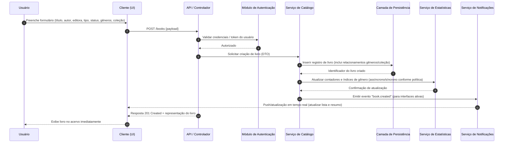

# Relatório Técnico de Arquitetura de Software

## 1. Identificação das HUs

Resumo das Histórias de Usuário (HU) e vínculo com requisitos funcionais principais:

- HU01 — Cadastrar livro  
  - RF01, RF04, RF13
  - Critérios: título e autor obrigatórios; tipo (físico/digital); status entre {não lido, lendo, concluído}; imediata aparição no acervo.

- HU02 — Atualizar status de leitura  
  - RF05, RF04, RF10
  - Critérios: alteração a qualquer momento; atualização imediata das estatísticas.

- HU03 — Organizar livros por gênero  
  - RF06, RF08
  - Critérios: criar/renomear/remover gêneros; múltiplos gêneros por livro; desvinculação ao remover gênero.

- HU04 — Organizar livros por coleção  
  - RF07, RF08
  - Critérios: criar/renomear/remover coleções; apenas uma coleção por livro; desvinculação ao remover coleção.

- HU05 — Filtrar o acervo  
  - RF09
  - Critérios: combinar múltiplos filtros; resultados dinâmicos; limpar filtros com um clique.

- HU06 — Pesquisar livros por título ou autor  
  - RF12
  - Critérios: busca por correspondência parcial; resultados dinâmicos à medida que digita.

- HU07 — Visualizar resumo do acervo  
  - RF10, RF11, RNF05
  - Critérios: total geral e por status; gêneros mais frequentes; atualização automática.

- HU08 — Exportar o acervo  
  - RNF07
  - Critérios: exportar todos os campos em CSV ou JSON; escolha de formato; download via navegador.

Cobertura direta também a RF02 (edição), RF03 (remoção) e RF13 (diferenciar físico/digital) que permeiam as HUs acima.

---

## 2. Diagramas de Arquitetura (Mermaid)

2.1 Diagrama de Sequência — Cenário: Cadastrar livro (HU01)


2.2 Diagrama de Componentes — Visão lógica e interfaces
```mermaid
graph LR
  subgraph Cliente
    UI[Client UI (móvel / desktop)]
  end

  subgraph Servidor
    API[API / Controlador REST/Graph-like]
    Auth[Módulo de Autenticação & Autorização]
    Catalog[Serviço de Catálogo de Livros (CRUD)]
    Genre[Gerenciador de Gêneros]
    Collection[Gerenciador de Coleções]
    Search[Motor de Busca & Filtros (indexação)]
    Stats[Serviço de Estatísticas e Agregação]
    Export[Serviço de Exportação (CSV/JSON)]
    Notif[Serviço de Notificações / Canal Realtime]
    Persist[Camada de Persistência (DB + Índices)]
  end

  UI-->|API calls / Realtime|API
  API-->|Validação|Auth
  API-->|Calls CRUD|Catalog
  API-->|Calls CRUD|Genre
  API-->|Calls CRUD|Collection
  API-->|Query|Search
  Catalog-->|Read/Write|Persist
  Genre-->|Read/Write|Persist
  Collection-->|Read/Write|Persist
  Search-->|Lê índices / Atualiza índices|Persist
  Catalog-->|Emite eventos|Notif
  Stats-->|Consulta/Agrega|Persist
  Export-->|Lê dados|Persist
  Notif-->|Push/Subscribe|UI
```

---

## 3. Decisões de Arquitetura

1. Arquitetura em Camadas / Componentes bem definidos  
   - Separação clara entre camada de apresentação (UI), orquestrador/API, serviços de domínio (Catálogo, Gêneros, Coleções, Estatísticas), motor de busca/filtragem, exportação e persistência.  
   - Responsabilidade: cada componente é dono de sua lógica e possui interfaces bem definidas (APIs internas ou eventos).

2. Comunicação síncrona e assíncrona combinada  
   - Operações CRUD primárias são expostas via chamadas síncronas (request/response) para garantir feedback imediato ao usuário.  
   - Atualizações de estatísticas e notificações em tempo real podem ser tratadas de forma assíncrona (eventos internos) para não bloquear a criação/edição de registros.

3. Autenticação e isolamento por usuário (single-tenant lógico)  
   - Todos os endpoints exigem autenticação; dados são filtrados por identificador de usuário para garantir isolamento.  
   - Sessões/tokens devem ser validados na borda da API (autorização centralizada).

4. Índices e motor de busca para cumprir requisito de desempenho de filtragem (< 2s)  
   - Manter índices adequados (por título, autor, editora, status, gênero, coleção, tipo) e um componente de busca otimizado para consultas multi-atributo e buscas parciais.  
   - Paginação, projeção de campos e limites de página para evitar carregamento massivo.

5. Atualização em tempo real do resumo (RNF05)  
   - Serviço de notificação/publicação de eventos que alimenta UI ativamente (canal de atualização em tempo real). Para ambientes sem canal ativo, usar polling com atualização incremental.

6. Consistência e visibilidade imediata (UX)  
   - Aplicar estratégia de confirmação imediata na UI (optimistic update) com rollback em caso de erro do servidor para garantir a impressão de resposta instantânea exigida pelos critérios de aceite.

7. Operações de remoção não destrutivas para relações (HU03 / HU04)  
   - Ao remover gênero ou coleção, desvincular relacionamentos sem excluir o livro. Registrar histórico/controle para permitir restauração se necessário.

8. Exportação por demanda e streaming do arquivo  
   - Exportação completa em CSV ou JSON gerada sob demanda; para catálogos muito grandes, usar geração por streaming para evitar uso excessivo de memória.

9. Observabilidade e métricas  
   - Instrumentar componentes para latências de busca/CRUD, taxa de eventos, falhas de autenticação e taxa de erro da exportação para garantir os SLAs de desempenho e usabilidade.

10. Neutralidade tecnológica mantida  
    - Todas as decisões descritas especificam padrões e responsabilidades, sem vincular a soluções ou produtos específicos.

---

## 4. Tabela de Componentes e Rastreabilidade

| Componente | Responsabilidade Principal | Comunica-se com | Origem (HU / Critério de Aceite / RF / RNF) |
|---|---|---:|---|
| Client UI (móvel/desktop) | Interface responsiva para cadastro, edição, busca, filtros, visualização de resumo e exportação | API, Notification | HU01, HU02, HU05, HU06, HU07, HU08; RNF02, RNF06 |
| API / Controlador | Orquestra solicitações, valida entradas, encaminha para serviços de domínio, aplica autorização | UI, Auth, Catalog, Genre, Collection, Search, Export, Stats | RF01-RF13; HU01-HU08 |
| Módulo de Autenticação & Autorização | Autenticar usuário, aplicar políticas de acesso, isolar dados por usuário | API, Persistence (para credenciais/meta) | RNF01 (autenticação, isolamento de acervo) |
| Serviço de Catálogo de Livros | Regras de negócio de livros (CRUD), validações (título/autor obrigatórios), gestão de tipo físico/digital | API, Persistence, Search, Stats, Notif, Genre, Collection | HU01, HU02, HU03, HU04, RF01, RF02, RF03, RF05, RF13 |
| Gerenciador de Gêneros | CRUD de gêneros, relacionamentos com livros, regras de desvinculação | API, Persistence, Catalog | HU03, RF06, RF08 (critério: desvincular sem excluir livros) |
| Gerenciador de Coleções | CRUD de coleções, assegura 1 coleção por livro, desvinculação sem exclusão | API, Persistence, Catalog | HU04, RF07, RF08 |
| Motor de Busca & Filtros | Índices e consultas para filtros combinados e busca por texto parcial; suporta paginação | API, Persistence | RF09, RF12, RNF03 |
| Serviço de Estatísticas & Agregação | Calcula totals por status, identifica gêneros mais frequentes, atualiza em tempo real | Catalog, Persistence, Notif, API | HU07, RF10, RF11, RNF05 |
| Serviço de Exportação (CSV/JSON) | Gerar e disponibilizar arquivos exportáveis, streaming para grandes volumes | API, Persistence | HU08, RNF07 |
| Camada de Persistência | Armazenamento durável de livros, gêneros, coleções, índices; transações e integridade | Catalog, Genre, Collection, Search, Stats, Export, Auth | RNF04, RNF03 |
| Serviço de Notificações / Realtime | Canal de publicação de eventos para UI (atualização imediata do resumo e lista) | Catalog, Stats, UI | RNF05, HU01, HU02, HU07 |

---

## 5. Bloqueios e Pendências

Pendências de especificação e decisões necessárias para implementação:

1. Escopo de escala esperado (número médio/máximo de livros por usuário; número de usuários)  
   - Impacto: dimensionamento de índice, estratégia de paginação, memória e necessidades do motor de busca.  
   - Recomendação: definir faixas de carga esperada (pequena, média, grande).

2. Estratégia de autenticação e requisitos de segurança detalhados  
   - Falta especificação: políticas de senha, expiração de sessão, necessidade de autenticação multifator, criptografia em trânsito e repouso.  
   - Impacto: design do módulo Auth e conformidade com normas.  
   - Recomendação: definir políticas de segurança e requisitos regulamentares.

3. Critério de consistência para estatísticas (sincrono vs assíncrono)  
   - Falta especificação: se estatísticas devem refletir 100% imediatamente ou permitir pequena latência. RNF05 exige "tempo real", mas não define consistência estrita.  
   - Impacto: escolha entre atualizações síncronas (latência nas operações) ou assíncronas (complexidade de eventual consistency).  
   - Recomendação: definir SLA de "realidade" das estatísticas (ex.: <1s) e se operações críticas exigem bloqueio.

4. Regras de negócios sobre remoção/edição concorrente  
   - Falta especificação: comportamento se dois dispositivos editam o mesmo livro simultaneamente.  
   - Impacto: necessidade de controle de concorrência (versões/ETag).  
   - Recomendação: decidir estratégia (last-write-wins, merge guiado, controle por versão).

5. Formato e limite da exportação  
   - Falta especificação: limites de tamanho, compressão, campos obrigatórios no CSV (ordem/escape) e tratamento de caracteres especiais.  
   - Recomendação: definir esquema de exportação e limites por solicitação.

6. Política de retenção e exclusão de dados  
   - Falta especificação: soft-delete necessário? logs de auditoria?  
   - Impacto: design do Persistence e processos de recuperação.  
   - Recomendação: definir política de retenção e conformidade.

7. Requisitos de acessibilidade e internacionalização (i18n)  
   - Falta especificação: suporte a múltiplos idiomas e normas de acessibilidade.  
   - Recomendação: incluir requisitos se aplicáveis.

8. Detalhes do comportamento da busca por parcialidade  
   - Falta especificação: sensível a maiúsculas/minúsculas, acentos, stemming, ranking.  
   - Recomendação: definir se busca deve suportar aproximação/fuzzy e regras de ordenação.

9. Métricas SLA para RNF03 (2 segundos) e RNF05 (tempo real) em ambientes com diferentes volumes  
   - Recomendação: estabelecer testes de carga e metas por faixa de dados.

---

## 6. Cobertura de Requisitos

Mapeamento de cobertura (status: Coberto / Parcial / Necessita esclarecimento)

Requisitos Funcionais (RF):
- RF01 (Cadastro de livro) — Coberto (Catalog Service, API, UI) — HU01
- RF02 (Editar livro) — Coberto (Catalog Service, API, UI) — HU01/HU02
- RF03 (Remover livro) — Coberto (Catalog Service, API, UI) — HU01
- RF04 (Três status de leitura) — Coberto (Domain model; validação no UI/API) — HU01/HU02
- RF05 (Atualizar status a qualquer momento) — Coberto (API + Stats + Notif) — HU02
- RF06 (CRUD gêneros) — Coberto (Genre Manager) — HU03
- RF07 (CRUD coleções) — Coberto (Collection Manager) — HU04
- RF08 (Associação livro ↔ gêneros/coleção) — Coberto (Catalog Service + Persist) — HU03/HU04
- RF09 (Filtrar por qualquer atributo) — Coberto (Search & Filter Engine) — HU05
- RF10 (Resumo total por status) — Coberto (Stats Service + Notif) — HU07
- RF11 (Gêneros mais frequentes) — Coberto (Stats Service) — HU07
- RF12 (Pesquisa por título/autor) — Coberto (Search Engine) — HU06
- RF13 (Diferenciar físico/digital) — Coberto (Domain model e UI) — HU01

Requisitos Não Funcionais (RNF):
- RNF01 (Autenticação e isolamento) — Coberto (Auth module + per-user filtering) — pendência: definir política de segurança detalhada.
- RNF02 (Usabilidade responsiva) — Coberto conceitualmente (Client UI responsiva) — depende de requisitos de UI/UX e testes.
- RNF03 (Desempenho: listagem/filtragem ≤ 2s) — Parcial (Search Engine + índices planejados); pendência: definir escala alvo e testes de carga.
- RNF04 (Persistência durável) — Coberto conceitualmente (Persistence Layer + export) — pendência: backup/retention policy.
- RNF05 (Resumo em tempo real) — Coberto (Notif + Stats) — pendência: definir tolerância de latência.
- RNF06 (Compatibilidade com navegadores) — Coberto conceitualmente (Client deve seguir web standards) — depende de testes cross-browser.
- RNF07 (Exportar CSV/JSON) — Coberto (Export Service) — pendência: definir limites de exportação e detalhes de formatação.

Observação: todos os HUs estão contemplados por componentes e fluxos, com exceções de detalhes operacionais e de nível de serviço que requerem decisões adicionais listadas na seção de bloqueios.

---

## 7. Gap Analysis

Identificação de lacunas, impacto arquitetural e ações recomendadas.

1. Gap: Escopo de escala não definido (nº usuários e nº livros por usuário)  
   - Impacto: escolha de estratégia de indexação, dimensionamento do motor de busca, necessidade de sharding/particionamento.  
   - Ação recomendada: definir cenários de escala (ex.: até 10k livros/usuário, até 100k etc.) e criar testes de carga correspondentes.

2. Gap: Política de segurança detalhada ausente (senha, MFA, criptografia, logs)  
   - Impacto: projeto incompleto do módulo de autenticação e de requisitos de conformidade; potencial risco de segurança.  
   - Ação: especificar requisitos de segurança (hashing, expiração de tokens, MFA opcional/obrigatório, criptografia em trânsito/repouso), requisitos de auditoria.

3. Gap: Consistência das estatísticas em "tempo real" não quantitativa  
   - Impacto: permite implementações que atendam apenas a aparente "imediaticidade", podendo violar UX esperado.  
   - Ação: definir SLA (ex.: atualizações em ≤1s) e escolher mecanismo (síncrono vs assíncrono com confirmações).

4. Gap: Conflitos de edição concorrente não especificados  
   - Impacto: risco de perda de alterações em múltiplos dispositivos; necessidade de mecanismos de versionamento ou bloqueio.  
   - Ação: definir política de concorrência (controle de versão, ETag, merge guiado).

5. Gap: Regras da busca parcial (case/acentos/fuzzy/ranking) não especificadas  
   - Impacto: inconsistência na experiência de pesquisa; implementação pode ser insuficiente para expectativas do usuário.  
   - Ação: definir requisitos de matching (case insensitive, normalização de acentos, apoio a fuzzy) e ordenação.

6. Gap: Limites e formato detalhado da exportação (CSV control chars, encoding, compressão)  
   - Impacto: risco de exportações inválidas para certas plataformas; problemas com grandes volumes.  
   - Ação: definir esquema CSV (encapsulamento, separador, encoding) e política de export stream/compressão.

7. Gap: Política de deleção e histórico/auditoria não definida  
   - Impacto: risco ao permitir remoção irreversível de dados; dificuldades para recuperação.  
   - Ação: definir soft-delete vs hard-delete, retenção e logs de auditoria.

8. Gap: Requisitos de offline ou sincronização não especificados  
   - Impacto: se desejado, exige arquitetura adicional (sincronização, conflito) — caso contrário, deveria ser explicitamente proibido.  
   - Ação: confirmar necessidade de suporte offline.

9. Gap: Acessibilidade e internacionalização não especificadas  
   - Impacto: alcance e conformidade podem ser limitados.  
   - Ação: definir prioridades de a11y e i18n se aplicável.

Prioridade de ações recomendadas (curto prazo):
- Definir escala alvo e realizar testes de performance para RNF03.
- Especificar política de segurança e autenticação (RNF01).
- Definir SLA de "tempo real" para RNF05 e estratégia (sincrono/assíncrono).
- Especificar regras de busca parcial e formatação de exportação.

---

Resumo executivo de próximos passos:
1. Validar com product owner as decisões pendentes listadas (escala, segurança, SLAs, concorrência, export format).  
2. Elaborar protótipo de API e modelos de dados (domínio Livro, Gênero, Coleção) com controle de versões.  
3. Implementar motor de busca com índices e criar testes de carga para garantir RNF03.  
4. Projetar e validar o fluxo de autenticação/isolamento de dados.  
5. Implementar mecanismo de eventos/notifications para garantir atualização em tempo real do resumo (RNF05) e conduzir testes UX de responsividade (RNF02).

Fim do relatório.