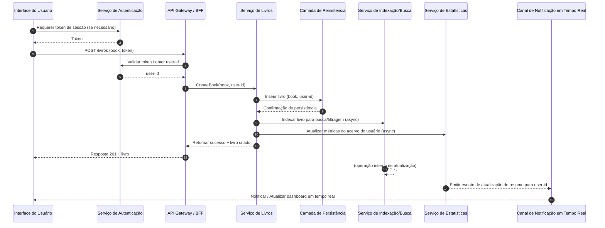

# Relatório Técnico de Arquitetura de Software

## 1. Identificação das HUs

- HU01 — Cadastrar livro  
  Descrição: Cadastro de livro com título, autor, editora, tipo (físico/digital) e status de leitura. Critérios: título e autor obrigatórios; status entre não lido/ler/concluído; aparecimento imediato no acervo.

- HU02 — Atualizar status de leitura  
  Descrição: Alterar status do livro a qualquer momento. Critérios: atualização entre os 3 estados; reflexo imediato nas estatísticas.

- HU03 — Organizar livros por gênero  
  Descrição: CRUD de gêneros; associação múltipla de gêneros a livros; exclusão de gênero apenas desvincula.

- HU04 — Organizar livros por coleção  
  Descrição: CRUD de coleções; livro pertence a no máximo uma coleção; exclusão de coleção apenas desvincula.

- HU05 — Filtrar o acervo  
  Descrição: Filtragem por qualquer atributo e combinação de filtros; resultados dinâmicos; limpar todos filtros.

- HU06 — Pesquisar livros por título ou autor  
  Descrição: Busca parcial dinâmica enquanto digita.

- HU07 — Visualizar resumo do acervo  
  Descrição: Estatísticas gerais e por status; gêneros mais frequentes; atualização automática.

- HU08 — Exportar o acervo  
  Descrição: Exportação completa em CSV ou JSON; escolha de formato; download via navegador.

## 2. Diagramas de Arquitetura (Mermaid)

Abaixo há dois diagramas: um diagrama de sequência (fluxo de cadastro + atualização de estatísticas e indexação para busca) e um diagrama de componentes que apresenta os módulos conceituais e suas interfaces.

Sequência (Cadastrar livro -> persistir -> indexar -> atualizar estatísticas -> notificar UI):


Diagrama de Componentes — visão conceitual modular:
```mermaid
graph LR
  subgraph Cliente
    UI[Interface Responsiva (web/mobile)]
    UI -->|REST/GraphQL| API
    UI -->|WebSocket/EventSource| WS
  end

  subgraph InfraAPI
    API[API Gateway / BFF]
    Auth[Serviço de Autenticação (interface)]
    WS[Canal de Notificação em Tempo Real]
  end

  subgraph Serviços de Domínio
    BookS[Serviço de Livros]
    GenreS[Serviço de Gêneros]
    CollS[Serviço de Coleções]
    SearchS[Serviço de Busca/Filtragem]
    StatsS[Serviço de Estatísticas/Resumo]
    ExportS[Serviço de Exportação CSV/JSON]
  end

  subgraph Persistência
    DB[Armazenamento de Dados (entidades por usuário)]
    Index[Index para Busca/Filtragem]
    Storage[Armazenamento de Arquivos Digitais (se houver)]
  end

  UI --> API
  API --> Auth
  API --> BookS
  API --> GenreS
  API --> CollS
  API --> SearchS
  API --> ExportS
  BookS --> DB
  GenreS --> DB
  CollS --> DB
  BookS --> Index
  SearchS --> Index
  StatsS --> DB
  ExportS --> DB
  BookS --> StatsS
  StatsS --> WS
  API --> WS
  BookS --> Storage
```

## 3. Decisões de Arquitetura

1. Estilo arquitetural: arquitetura modular e orientada a serviços (serviços de domínio menores e coesos). Justificativa: separação clara de responsabilidades facilita manutenção, testes e evolução (HU03, HU04, HU07).

2. Interfaces e contratos:
   - Todas as interações entre cliente e servidor passam por uma API com contratos bem definidos (endpoints ou esquema de consulta). Interfaces documentadas e versionadas.
   - Serviços internos expõem APIs internas (REST/ RPC conceitual) com contratos estáveis para orquestração assíncrona e sincronizada.

3. Autenticação e isolamento por usuário (RNF01):
   - Autenticação centralizada que fornece identidade (user-id) usada em todas as operações para garantir isolamento de acervo. Há verificação de autoridade em todas as operações CRUD.

4. Consistência e atualizações imediatas (HU01, HU02, RNF05):
   - Operação de escrita é confirmada pela persistência antes de resposta ao cliente para garantir que o livro aparece imediatamente no acervo.
   - Atualização das estatísticas: atualização por evento (sincrona leve + processamento assíncrono garantido) para manter desempenho e entrega imediata ao UI via canal em tempo real.

5. Busca e filtragem (HU05, HU06, RNF03):
   - Separação entre armazenamento primário e índice/serviço de busca para consultas rápidas e suporte a busca parcial. Índice mantido eventual-consistente com persistência primária.
   - Suporte a filtragem combinada no serviço de busca e fallback ao banco para consultas muito específicas.

6. Performance e escalabilidade (RNF03):
   - Paginação, projeção de campos e indexação para reduzir latência.
   - Caching seletivo no cliente e nas respostas de leitura frequente (por usuário) para reduzir carga de consulta.
   - Operações de leitura devem responder < 2s; planejamento de testes de carga e monitoramento para validar sob volumes esperados.

7. Persistência e durabilidade (RNF04, RNF07):
   - Persistência transacional para CRUD de livros, gêneros e coleções. Exportação gera arquivo temporário para download direto pelo navegador.
   - Propostas de mecanismo de backup/exports periódicos e export manual via interface.

8. Export (HU08):
   - Serviço de exportação que gera CSV ou JSON a partir da representação canônica do modelo e disponibiliza para download via API; execução em background se necessário.

9. Diferenciação físico vs digital (RF13):
   - Campo tipado no modelo de livro (enum conceitual: FISICO, DIGITAL) com possível vínculo a Storage para conteúdos digitais.

10. Compatibilidade e usabilidade (RNF02, RNF06):
    - UI responsiva, eventos em tempo real para atualização do resumo (RNF05), e práticas para compatibilidade com navegadores modernos.

11. Observabilidade e monitoramento:
    - Métricas de latência, taxa de erros, contadores de operações por usuário e tempo de atualização do índice/estatísticas.

12. Tratamento de concorrência:
    - Regras de negócio definem comportamentos de conflito (ex.: última escrita vence ou uso de controle otimista de versão) — detalhes pendentes (ver seção de bloqueios).

Observação de neutralidade: nenhuma tecnologia, produto ou fornecedor específico é citado — apenas responsabilidades e interfaces conceituais.

## 4. Tabela de Componentes e Rastreabilidade

| Componente | Responsabilidade Principal | Comunica-se com | Origem (HU / Critério de Aceite) |
|------------|---------------------------|------------------|----------------------------------|
| Interface do Usuário (UI) | Apresentar acervo, formulários, filtros, busca e resumo; interagir em tempo real com o usuário | API, WS | HU01, HU05, HU06, HU07, RNF02, RNF06 |
| Serviço de Autenticação (Auth) | Autenticar usuário e fornecer identidade para isolamento de dados | API, UI | RNF01 |
| API Gateway / BFF (API) | Orquestrar chamadas do cliente para serviços de domínio; validar tokens | UI, Auth, BookS, GenreS, CollS, SearchS, ExportS, WS | Geral (todas HUs) |
| Serviço de Livros (BookS) | CRUD de livros; aplicar regras de negócio (campos obrigatórios, tipo físico/digital, associação a gênero/coleção) | API, Persistence, Index, StatsS, Storage | HU01, HU02, HU03, HU04, RF01, RF02, RF03, RF08, RF13 |
| Serviço de Gêneros (GenreS) | CRUD de gêneros; manter vínculos com livros sem excluir livros ao remover gênero | API, Persistence | HU03, RF06 |
| Serviço de Coleções (CollS) | CRUD de coleções; garantir que livro pertença a no máximo uma coleção | API, Persistence | HU04, RF07 |
| Serviço de Busca/Filtragem (SearchS / Index) | Consulta rápida, busca parcial, composição de múltiplos filtros | API, Index, Persistence | HU05, HU06, RF09, RNF03 |
| Serviço de Estatísticas (StatsS) | Calcular e manter resumo do acervo (totais por status, gêneros mais frequentes) | BookS, Persistence, WS, API | HU07, RF10, RF11, RNF05 |
| Serviço de Exportação (ExportS) | Gerar arquivos CSV e JSON completos do acervo para download | API, Persistence, Storage | HU08, RNF07 |
| Camada de Persistência (Persistence / DB) | Armazenamento transacional de entidades (Livro, Gênero, Coleção, Usuário) | BookS, GenreS, CollS, StatsS, ExportS | RNF04, todas HUs |
| Armazenamento de Arquivos (Storage) | Armazenar arquivos digitais vinculados quando houver (opcional) | BookS, ExportS | RF13 |
| Canal de Notificação em Tempo Real (WS/Event) | Entrega de eventos para UI (atualização de estatísticas, notificações) | StatsS, API, UI | RNF05, HU01, HU02, HU07 |

## 5. Bloqueios e Pendências

- M1: Método de autenticação não especificado (protocolo, token lifespan, SSO). Impacto: implementação de segurança e integração. Ação: definir protocolo/fluxo de autenticação e requisitos de sessão.
- M2: Volume esperado de registros por usuário não informado (média e picos). Impacto: dimensionamento de índice, estratégia de paginação e garantia do RNF03. Ação: coletar estimativas de volume (ex.: livros por usuário e usuários simultâneos).
- M3: Requisitos de sincronização entre múltiplos dispositivos/offline não estão definidos. Impacto: políticas de sincronização e resolução de conflitos. Ação: decidir se haverá suporte offline e como resolver conflitos (último grava/merge).
- M4: Regras de concorrência e versão de entidade não detalhadas. Impacto: possíveis inconsistências em edição simultânea. Ação: definir política de conflito (lock otimista, campos editáveis, versionamento).
- M5: Tratamento de anexos/arquivos digitais (tamanho máximo, tipos permitidos, necessidade de preview/streaming). Impacto: Storage e interface de upload. Ação: definir políticas e limites de arquivo.
- M6: Requisitos de retenção, auditoria e logs não especificados. Impacto: conformidade e auditabilidade. Ação: definir níveis mínimos de logging e retenção.
- M7: Não há SLAs operacionais detalhados (uptime, RTO/RPO). Impacto: planejamento de operação. Ação: definir acordos de operação/backup.

## 6. Cobertura de Requisitos

- RF01 (Cadastrar livro) — Coberto. Fluxo suportado por BookS; UI e API garantem campos obrigatórios. HU01.
- RF02 (Editar livro) — Coberto. BookS CRUD; controles de concorrência pendentes (ver M4).
- RF03 (Remover livro) — Coberto. BookS + persistência.
- RF04 (Três status de leitura) — Coberto. Status modelado como enum/dominio; UI e validação no BookS (HU01, HU02).
- RF05 (Atualizar status a qualquer momento) — Coberto. Endpoint de atualização; StatsS para refletir imediatamente via evento/WS (HU02, RNF05).
- RF06 (CRUD de gêneros) — Coberto. GenreS; remoção desvincula livros (HU03).
- RF07 (CRUD de coleções) — Coberto. CollS; regra de pertença única aplicada (HU04).
- RF08 (Associar livro a gêneros e coleção) — Coberto. BookS suporta múltiplos gêneros e uma coleção (HU03, HU04).
- RF09 (Filtrar por qualquer atributo) — Coberto parcialmente. SearchS + Index projetados para suportar filtros combinados; implementação precisa de índices adequados e estratégia para filtros complexos (RNF03) — requer definição de volumes (M2).
- RF10 (Resumo com total por status) — Coberto. StatsS mantém contadores e WS notifica UI (HU07, RNF05).
- RF11 (Gêneros mais frequentes) — Coberto. StatsS mantém agregação de frequência (HU07).
- RF12 (Pesquisar por título ou autor via campo de busca) — Coberto. SearchS com suporte a busca parcial e atualização dinâmica (HU06).
- RF13 (Diferenciar físico/digital) — Coberto. Campo tipo no modelo; opcional Storage para conteúdo digital (HU01, RF13; ver M5 para regras de arquivos).

- RNF01 (Autenticação e isolamento) — Coberto conceitualmente. Necessária especificação do método de autenticação (M1).
- RNF02 (Responsividade) — Coberto na UI; detalhes de implementação de front-end não especificados, mas é requisito de projeto de UI.
- RNF03 (Listagem/filtragem < 2s) — Coberto com estratégia de indexação, paginação e caching; risco dependente de volumes e cargas (M2). Recomendação: testes de performance e ajustes no índice/arquitetura.
- RNF04 (Persistência durável) — Coberto: operações síncronas de persistência e export.
- RNF05 (Resumo em tempo real) — Coberto via eventos e canal em tempo real (WS).
- RNF06 (Compatibilidade navegadores) — Coberto no nível de requisito de UI; deve constar como critério de teste.
- RNF07 (Exportável CSV/JSON) — Coberto pelo ExportS, com geração para download direto (HU08).

## 7. Gap Analysis

1. Gap: Especificação da autenticação/identidade (M1)  
   - Impacto arquitetural: não é possível definir políticas de sessão, segurança de APIs, requisitos de criptografia em trânsito, e integração com provedores de identidade.  
   - Risco: escolha inadequada pode expor dados ou dificultar integração.  
   - Ação recomendada: definir protocolo/fluxo (por ex., token-based, duração, refresh), requisitos de senha/recuperação e se haverá integração externa.

2. Gap: Volume esperado e SLAs de desempenho (M2)  
   - Impacto: dimensionamento do índice de busca, cache e requisitos de particionamento; validação do RNF03 permanece incerta.  
   - Risco: falha em atingir <2s sob cargas reais.  
   - Ação: obter estimativas (livros/usuário, usuários concorrentes, picos), criar testes de carga e ajustar índices/caching.

3. Gap: Suporte offline e sincronização multi-dispositivo (M3)  
   - Impacto: define se serão necessárias filas locais, merge de conflitos e tolerância eventual.  
   - Risco: inconsistência entre dispositivos; UX ruim se não definido.  
   - Ação: decidir se offline será requisito e especificar política de conflito (merge, última escrita ou resolução assistida).

4. Gap: Políticas de concorrência/versões (M4)  
   - Impacto: risco de sobrescrita de dados ou comportamento inesperado em edição simultânea.  
   - Ação: definir mecanismo (controle otimista por versão, locks no domínio, mensagens de conflito).

5. Gap: Regras de anexos/arquivos digitais (M5)  
   - Impacto: dimensionamento do Storage, segurança de uploads e limites de tamanho.  
   - Ação: definir tipos permitidos, tamanho máximo, necessidade de thumbnails/previews e retenção.

6. Gap: Estratégia de backup, retenção e auditoria (M6)  
   - Impacto: recuperação de dados e conformidade.  
   - Ação: definir RPO/RTO, política de retenção e logs de auditoria para operações críticas.

7. Gap: Requisitos UX detalhados e comportamentos de filtros (ex.: ordenação padrão, combinação e precedência de filtros)  
   - Impacto: podem surgir discrepâncias entre backend e expectativas de UI (ex.: filtro por múltiplos gêneros — operação AND/OR).  
   - Ação: especificar semântica de filtros (AND vs OR), ordenações suportadas e UX para limpar filtros.

8. Gap: Metas operacionais e monitoramento (SLO/SLI)  
   - Impacto: sem métricas, não há garantia de atendimento dos RNFs.  
   - Ação: definir métricas de latência, erro, utilização e alertas.

Resumo das ações urgentes:
- Definir autenticação e autorização (M1).
- Fornecer estimativas de volume e usuários concorrentes (M2).
- Decidir política de sincronização/offline e conflito (M3/M4).
- Definir regras de arquivos digitais (M5).
- Estabelecer SLAs operacionais e políticas de backup (M6).

Conclusão breve:
O design proposto atende conceitualmente todos os requisitos funcionais e não funcionais apontados, mediante confirmação das pendências listadas. A arquitetura modular com serviços de domínio separados (Livros, Gêneros, Coleções, Busca, Estatísticas, Export) permite cumprir as HU e RNF previstos, garantindo isolamento por usuário, atualizações em tempo real e capacidade de escalar leitura e busca. Antes da implementação, é crítico fechar as pendências de autenticação, volumes esperados, políticas de concorrência e regras para conteúdo digital para eliminar riscos arquiteturais e validar o requisito de performance de 2 segundos.