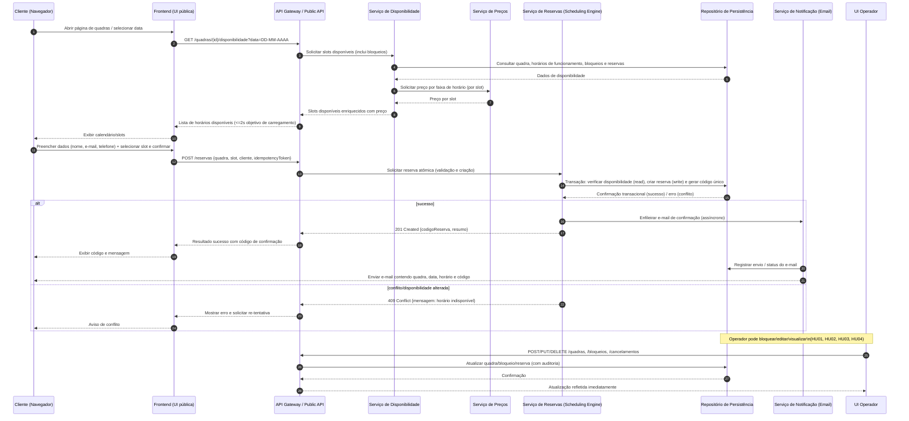

# Relatório Técnico de Arquitetura de Software

## 1. Identificação das HUs

Resumo das Histórias de Usuário (HU) mapeadas para requisitos funcionais (RF) e critérios de aceite principais.

- HU01 — Cadastrar quadra
  - RF: RF01, RF02
  - Critérios: Nome, tipo e valor obrigatórios; aparecimento imediato na disponibilidade.
- HU02 — Bloquear horários para manutenção
  - RF: RF03
  - Critérios: Horários bloqueados não aparecem; remoção de bloqueio possível.
- HU03 — Visualizar agenda consolidada
  - RF: RF11
  - Critérios: Agenda diária de todas as quadras; navegação por data.
- HU04 — Cancelar reserva com justificativa (Operador)
  - RF: RF09, RF10
  - Critérios: Motivo obrigatório; notificação por e-mail ao cliente.
- HU05 — Consultar disponibilidade sem cadastro (Cliente)
  - RF: RF04
  - Critérios: Acesso sem login; horários ocupados mostrados como indisponíveis.
- HU06 — Realizar reserva (Cliente)
  - RF: RF05, RF06, RF07, RF10
  - Critérios: Validação de disponibilidade no momento da confirmação; código de confirmação exibido e enviado por e-mail.
- HU07 — Cancelar minha reserva (Cliente)
  - RF: RF08
  - Critérios: Cancelamento mediante código válido; horário liberado imediatamente.

Observações de rastreabilidade: todos os RFs têm correspondência a pelo menos uma HU. RNFs são transversais e abordados na seção de decisões arquiteturais e na cobertura de requisitos (Seção 6).

## 2. Diagramas de Arquitetura (Mermaid)

A seguir estão dois diagramas: sequência de Reserva (fluxo cliente) e Diagrama de Componentes (visão global). Ambos em sintaxe mermaid válida.

Diagrama de sequência: processo de consulta e realização de reserva (inclui atomiticidade/controle de concorrência conceitual).



Diagrama de componentes: visão lógica dos componentes e interfaces principais.

```mermaid
graph LR
  UI_PUBLIC[Frontend - UI Pública (Cliente)]
  UI_ADMIN[Frontend - UI Operador (Admin)]
  API[API Gateway / Facade]
  AUTH[Auth Service (Admin)]
  AVAIL[Serviço de Disponibilidade]
  PRICING[Serviço de Preços / Tarifação]
  RESERVE[Serviço de Reservas (Scheduling Engine)]
  BLOCKS[Gestor de Bloqueios / Calendário]
  NOTIF[Serviço de Notificação (Email)]
  PERSIST[Repositório de Persistência (Autoritativo)]
  AUDIT[Audit & Logging]
  JOBS[Agendador de Jobs / Tarefas Assíncronas]
  MON[Monitoramento / Health Checks]

  UI_PUBLIC --> API
  UI_ADMIN --> API
  API --> AUTH
  API --> AVAIL
  API --> RESERVE
  API --> BLOCKS
  AVAIL --> PERSIST
  BLOCKS --> PERSIST
  RESERVE --> PERSIST
  RESERVE --> PRICING
  AVAIL --> PRICING
  RESERVE --> NOTIF
  NOTIF --> PERSIST
  API --> AUDIT
  RESERVE --> AUDIT
  BLOCKS --> AUDIT
  JOBS --> PERSIST
  JOBS --> NOTIF
  MON --> API
  MON --> PERSIST
```

Legenda conceitual: API = ponto único de entrada; Serviços modularizados por responsabilidade (Disponibilidade, Reservas, Preços, Bloqueios); Persistence = armazenamento autoritativo; Notificação = envio de e-mails assíncrono; Audit = trilha de alterações.

## 3. Decisões de Arquitetura

Principais decisões arquiteturais, justificativas e impactos.

1. Arquitetura modular por domínio (Serviço de Disponibilidade, Serviço de Reservas, Serviço de Preços, Serviço de Notificação, Gestor de Bloqueios)
   - Justificativa: atende RNF07 (manutenibilidade) e facilita inclusão de novas modalidades esportivas.
   - Impacto: permite evolução isolada de regras por modalidade; requer contratos de API bem definidos.

2. Reservas atômicas centralizadas (Scheduling Engine autoritativo)
   - Justificativa: RNF05 (confiabilidade / atômico) — a validação de disponibilidade e criação da reserva devem ocorrer em uma operação transacional/comparar-e-gravar para impedir duplo agendamento.
   - Implementação conceitual: operação única no Serviço de Reservas que realiza check-and-create em autoridade de persistência; suporte a idempotency token para repetição segura.
   - Impacto: reduz conflitos concorrentes; exige suporte a transações ou mecanismo equivalente no repositório e/ou estratégia de bloqueio (optimista com verifica-then-write ou pessimista via bloqueio curto).

3. Interface pública sem autenticação para consulta (leitura pública) e API protegida para operações administrativas
   - Justificativa: RF04 e RNF03. Consultas públicas sem cadastro; operações de operador requerem autenticação.
   - Impacto: necessidade de camadas de autorização e proteção de endpoints administrativos; separar superfícies de ataque.

4. Notificações assíncronas (envio de e-mail)
   - Justificativa: evitar latência em fluxo crítico de reserva; resiliente a falhas temporárias.
   - Impacto: confirmação visual imediata ao cliente (código exibido) enquanto envio de e-mail é processado assincronamente; registrar falhas de envio e permitir reenvio.

5. Cache/Read-optimized para disponibilidade (com invalidação rápida)
   - Justificativa: RNF02 (carregamento <= 2s) e RNF04 (disponibilidade). Disponibilidade consultada com alta frequência.
   - Padrão: cache de leitura com janela curta e mecanismo de invalidação quando reservas/bloqueios são criados/alterados.
   - Impacto: reduz latência; exige estratégia forte de invalidação para evitar exposição de slots já reservados.

6. Pricing Service com regras por faixa de horário
   - Justificativa: RF12. Separar lógica de tarifação para manter flexibilidade.
   - Impacto: permite composição de regras (horário nobre, promoções) sem acoplar ao Serviço de Reservas.

7. Auditoria e logs de domínio (todas as alterações são auditadas)
   - Justificativa: rastreabilidade para cancelamentos (motivo obrigatório), diagnóstico e conformidade.
   - Impacto: armazenamento adicional e operações de retenção definidas por políticas.

8. Alta disponibilidade e monitoramento
   - Justificativa: RNF04 (99% 24/7). Projetar redundância, health checks e recuperação automatizada.
   - Impacto: exigirá infraestrutura redundante e testes de failover (detalhes operacionais a definir).

9. Proteção contra abuso e controle de taxa
   - Justificativa: proteger endpoints públicos (ex.: scraping de disponibilidade) e evitar sobrecarga.
   - Impacto: definir limites e políticas de rate limiting.

Decisões não especificadas propositalmente: não foram escolhidos produtos ou frameworks — o desenho permanece agnóstico.

## 4. Tabela de Componentes e Rastreabilidade

| Componente | Responsabilidade Principal | Comunica-se com | Origem (HU / Critério de Aceite) |
|------------|---------------------------|------------------|----------------------------------|
| Frontend - UI Pública | Interface responsiva para consulta e criação de reservas sem login | API Gateway | HU05, HU06 (RNF01) |
| Frontend - UI Operador | Interface autenticada para cadastro/edição de quadras, bloqueios e agenda consolidada | API Gateway, Auth Service | HU01, HU02, HU03, HU04 (RF01, RF02, RF03, RF11) |
| API Gateway / Facade | Entrada unificada, roteamento, validação superficial, aplicação de rate limits | Frontends, Auth, Serviços de domínio | Transversal (todos HUs) |
| Auth Service (Admin) | Autenticação/autorização para área administrativa | API Gateway, UI Operador | RNF03 (Área administrativa protegida) |
| Serviço de Disponibilidade | Calcular e expor slots disponíveis por quadra/data (considera horário de funcionamento, bloqueios e reservas) | Persistence, Pricing Service, Block Manager | HU05, HU03, RF04 |
| Serviço de Reservas (Scheduling Engine) | Realizar reservas atômicas, gerar código único, validar concorrência | Persistence, Notification, Pricing, Audit | HU06, HU07, RF05, RF06, RNF05 |
| Serviço de Preços | Aplicar regras de preço por faixa de horário (horário nobre, descontos) | Availability, Reservation | RF12 |
| Gestor de Bloqueios / Calendário | Criar/gerenciar bloqueios por quadra (manutenção/feriado) | Persistence, Availability, Audit | HU02, RF03 |
| Serviço de Notificação (Email) | Enviar confirmações e notificações de cancelamento por e-mail (assíncrono) | Reservation, Persistence, Jobs | RF10, HU04 |
| Repositório de Persistência (Autoritativo) | Armazenar quadras, reservas, bloqueios, preços, logs de auditoria | Todos os serviços de domínio | Todos os RFs/HUs |
| Audit & Logging | Registrar alterações (cadastro, cancelamento, motivo) e eventos operacionais | Persistence, API, Reservation, Block Manager | HU04 (motivo obrigatório), requisitos de rastreabilidade |
| Agendador de Jobs / Tarefas Assíncronas | Reenvio de notificações, limpeza de expired tokens, relatórios | Persistence, Notification | Operações de manutenção |
| Monitoramento / Health Checks | Verificação de saúde, métricas de disponibilidade e alertas | API, Persistence, Serviços | RNF04 |

Observação: "Repositório de Persistência" é o armazenamento autoritativo; a implementação concreta fica a cargo do time (seguir neutralidade tecnológica).

## 5. Bloqueios e Pendências

Itens que exigem decisão/entrada do Product Owner / time para prosseguimento de implementação:

1. Política de granularidade de tempo
   - Pergunta: duração mínima de slot (30 min, 60 min, variável)? Permite reservas parciais?
   - Impacto: afeta modelagem de slots, pricing e regras de conflito.

2. Regras de fatiamento de horário e sobreposição
   - Pergunta: é permitida sobreposição parcial entre reservas? Como tratar tempos de buffer (tempo de troca entre jogos)?
   - Impacto: lógica de disponibilidade e atomiticidade.

3. Regras de cancelamento (prazos, taxas)
   - Pergunta: cancelamento sem custos? Janelas mínimas para cancelamento?
   - Impacto: fluxo de cancelamento, notificação e possíveis integrações financeiras (se houver).

4. SLA de entrega de e-mail / canal alternativo (SMS)
   - Pergunta: qual SLA aceitável para notificações e se SMS deve ser suportado?
   - Impacto: escolha de estratégias de retry e ops; requisito de canal alternativo não está explicitado.

5. Política de retenção e conformidade de dados
   - Pergunta: por quanto tempo manter registros de reservas, logs e dados pessoais?
   - Impacto: dimensionamento de armazenamento e requisitos legais.

6. Requisitos de escala e carga esperada
   - Pergunta: estimativa de requisições por segundo/usuários simultâneos nos picos?
   - Impacto: dimensionamento e estratégia de cache/particionamento.

7. Timezone e regras de horário
   - Pergunta: suporte a múltiplos fusos horários ou somente local? Como tratar horário de verão?
   - Impacto: cálculo de disponibilidade, exibição para cliente e lógica de bloqueios.

8. Mecanismo de autenticação para operadores
   - Pergunta: tipos de credenciais (usuário/senha, MFA) e gestão de usuários?
   - Impacto: requisito de segurança e integração com sistema de identidade.

9. Unicidade do código de confirmação
   - Pergunta: formato (alfanumérico, comprimentos) e políticas de colisão?
   - Impacto: geração e armazenamento.

10. Métricas e testes de aceitação para RNF02 (<=2s)
    - Pergunta: definição de cenários de teste e SLAs de P95/P99.
    - Impacto: escolhas de caching e otimizações.

Esses bloqueios devem ser resolvidos antes do detalhamento de implementação e seleção de tecnologias.

## 6. Cobertura de Requisitos

Mapeamento sintético de como cada requisito é coberto pela arquitetura proposta.

Requisitos Funcionais:
- RF01 (cadastro quadra): UI Operador -> API -> Persistence; Audit; Aceite HU01.
- RF02 (editar/remover quadra): UI Operador -> API -> Persistence; validações; Audit.
- RF03 (bloquear horários): Gestor de Bloqueios -> Persistence; Availability consulta bloqueios; HU02.
- RF04 (consulta sem login): Frontend Público -> API -> Availability (leitura pública); HU05.
- RF05 (realizar reserva): Frontend Público -> API -> Reservation (atômico) -> Persistence; HU06.
- RF06 (gerar código único): Serviço de Reservas gera código durante transação; HU06.
- RF07 (impedir reserva já ocupada): Serviço de Reservas faz check-and-create atômico; RNF05 aplicado.
- RF08 (cliente cancela com código): Endpoint público de cancelamento com validação de código -> Reservation -> Persistence; HU07.
- RF09 (operador cancela com motivo): UI Operador -> API -> Reservation with cancel reason -> Persistence + Notification; HU04.
- RF10 (enviar confirmação por e-mail): Reservation enfileira tarefa para Serviço de Notificação; Notification envia e-mail; HU06/HU04.
- RF11 (agenda consolidada): UI Operador -> API -> Availability + filtros por data -> exibe todas quadras; HU03.
- RF12 (valores por faixa): Serviço de Preços aplica regras por faixa e é consultado por Availability/Reservation; HU01, HU06.

Requisitos Não Funcionais:
- RNF01 (usabilidade/responsividade): Frontends responsivos; design mobile-first; componentes de UI leves.
- RNF02 (desempenho calendar <=2s): Availability e cache read-optimized; indexação/queries otimizadas; métricas de P95.
- RNF03 (segurança área admin): Auth Service + proteção de endpoints; logging de auditoria.
- RNF04 (disponibilidade 99%): redundância, health checks, monitoração, tratamento de falhas.
- RNF05 (confiabilidade/atômico): Reservas atômicas via Scheduling Engine e operações transacionais; idempotency tokens.
- RNF06 (compatibilidade navegadores): Frontend com práticas web compatíveis com navegadores modernos.
- RNF07 (manutenibilidade): modularização por serviço, plugins para novas modalidades.

Cobertura: todas as RFs e RNFs possuem correspondência com componentes/decisões. Pontos dependentes de decisões pendentes listadas em Seção 5.

## 7. Gap Analysis

Identificação de lacunas na especificação, impacto arquitetural e recomendações.

1. Lacuna: Granularidade de tempo e regras de duração de reservas
   - Impacto: modelagem de slots, checagem de conflito e cálculo de preço.
   - Recomendação: definir duração mínima/maior e se reservas podem ter durações múltiplas (p.ex. 30/60 min). Criar critérios de teste de aceitação (ex.: reserva de 90 minutos permitida?).

2. Lacuna: Comportamento de sobreposição e buffers entre reservas
   - Impacto: necessidade de lógica para impedir reservas adjacentes sem tempo de limpeza; complexidade na disponibilidade.
   - Recomendação: especificar política de buffer por quadra (0 por padrão) e incluir no modelo de disponibilidade.

3. Lacuna: Regras de cancelamento (prazos e possíveis taxas)
   - Impacto: UI, notificações, relatórios e possíveis integrações com pagamentos.
   - Recomendação: definir política de cancelamento com exemplos e fluxos de negócio.

4. Lacuna: Requisitos de carga/escala e padrões de uso
   - Impacto: dimensionamento de cache, capacidade do Serviço de Reservas e tolerância a picos.
   - Recomendação: obter estimativas de pico (req/s, reservas por minuto) para dimensionar e definir SLAs de performance.

5. Lacuna: Política de retenção de dados e privacidade
   - Impacto: compliance, armazenamento e limpeza de dados pessoais (e-mail/telefone).
   - Recomendação: definir retenção mínima/máxima e necessidades legais (ex.: logs de auditoria por X anos).

6. Lacuna: Formato e entrega de notificações (retries, SLA, fallback)
   - Impacto: entrega de confirmações e cancelamentos; experiência do cliente.
   - Recomendação: definir SLA de envio, política de retry e se canais alternativos (SMS) serão suportados.

7. Lacuna: Timezone e horário de verão
   - Impacto: cálculo de disponibilidade e exibição para cliente.
   - Recomendação: definir comportamento (usar horário local da quadra / do cliente) e testes de borda.

8. Lacuna: Gestão de identidades do operador
   - Impacto: segurança administrativa e auditoria.
   - Recomendação: definir políticas de autenticação (ex.: senha + MFA) e fluxos de recuperação.

9. Lacuna: Procedência e unicidade do código de confirmação
   - Impacto: chance muito baixa de colisão e usabilidade do código (tamanho/legibilidade).
   - Recomendação: definir formato e política de geração (ex.: aleatório com verificação de unicidade).

10. Lacuna: Métricas detalhadas e critérios de aceitação para RNF02/RNF04
    - Impacto: não haverá critérios objetivos para homologação.
    - Recomendação: definir métricas (P95, P99) e cenários de teste para disponibilidade e latência.

Prioridade das ações recomendadas:
- Alta: definir granularidade de tempo, regras de sobreposição/buffer, e regras de cancelamento.
- Média: definições de carga/escala, timezone, e políticas de retenção/dados.
- Baixa: formatos de código de confirmação e canais alternativos.

Conclusão e próximos passos curtos:
- Validar as pendências listadas com Product Owner/Stakeholders.
- Firmar critérios de aceitação operacional (latência, SLAs de notificação, carga).
- Projetar testes de concorrência intensiva para validar atomicidade de reservas.
- Com as decisões tomadas, detalhar contratos de API e modelos de dados (UML/ER) antes da implementação.

Fim do relatório.