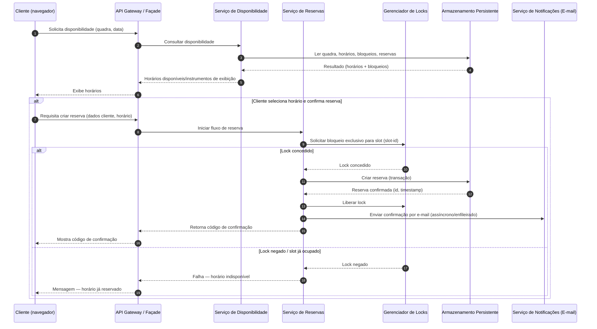

# Relatório Técnico de Arquitetura de Software

## 1. Identificação das HUs

Mapeamento das Histórias de Usuário (HU) e relação direta com requisitos funcionais (RF) relevantes:

- HU01 — Cadastrar quadra  
  - RF01, RF02, RNF07 (manutenibilidade), Critérios de aceite: nome, tipo, valor obrigatórios; quadra aparece imediatamente na disponibilidade do cliente.

- HU02 — Bloquear horários para manutenção  
  - RF03, RF07, RF11, Critérios de aceite: bloqueios removíveis; horários bloqueados não aparecem disponíveis.

- HU03 — Visualizar agenda consolidada  
  - RF11, RF04, RNF02 (tempo de carregamento), Critérios de aceite: exibe todas as quadras e horários/reservas; navegação por datas.

- HU04 — Cancelar reserva com justificativa (Operador)  
  - RF09, RF10, HU relacionada: notificação por e‑mail obrigatória; motivo obrigatório.

- HU05 — Consultar disponibilidade sem cadastro  
  - RF04, HU critérios: acesso sem login; exibir indisponíveis.

- HU06 — Realizar reserva (Cliente)  
  - RF05, RF06, RF07, RF10, RNF05 (atomicidade), Critérios de aceite: valida disponibilidade no momento da confirmação; código exibido e enviado por e‑mail.

- HU07 — Cancelar minha reserva (Cliente)  
  - RF08, RF07, Critérios de aceite: cancelamento mediante código; horário volta a ficar disponível imediatamente.

Observações:
- RF12 (valores diferenciados por faixa de horário) é transverso a HU01/HU03/HU06 e exige componente de tarifação/pricing.
- RNFs (usabilidade, desempenho, segurança, disponibilidade, confiabilidade, compatibilidade, manutenibilidade) aplicam‑se globalmente e são tratados nas decisões arquiteturais.

---

## 2. Diagramas de Arquitetura (Mermaid)

1) Diagrama de sequência: fluxo de consulta de disponibilidade e reserva (inclui controle de concorrência / atomicidade)



2) Diagrama de componentes (visão lógica, fronteiras e interfaces)

```mermaid
graph LR
  subgraph Cliente
    WebApp[Interface Cliente (pública; responsiva)]
    AdminApp[Interface Operador (protegida)]
  end

  APIGW[API Gateway / Façade]
  Auth[Serviço de Autenticação / Autorização]
  Reservations[Serviço de Reservas (lógica de negócio)]
  Availability[Serviço de Disponibilidade / Calendário]
  Courts[Serviço de Gestão de Quadras]
  Pricing[Serviço de Tarifação / Faixas Horárias]
  LockManager[Gerenciador de Concurrency / Locks]
  Notifications[Serviço de Notificações (e‑mail)]
  Store[Armazenamento Persistente (reservas, quadras, bloqueios, tarifas)]
  Audit[Serviço de Auditoria / Logs]
  Scheduler[Agendador de Bloqueios permanentes/feriados]
  Reporting[Serviço de Agenda Consolidada / Relatórios]

  WebApp --> APIGW
  AdminApp --> APIGW
  APIGW --> Auth
  APIGW --> Reservations
  APIGW --> Availability
  APIGW --> Courts
  APIGW --> Pricing
  Reservations --> LockManager
  Reservations --> Store
  Reservations --> Notifications
  Reservations --> Audit
  Availability --> Store
  Courts --> Store
  Pricing --> Store
  Scheduler --> Store
  Reporting --> Store
  AdminApp --> Reporting
  AdminApp --> Courts
  Notifications --> Store
```

---

## 3. Decisões de Arquitetura

D1. Arquitetura em camadas/componente com APIs internas (neutralidade tecnológica)  
- Separação clara entre interface pública (cliente), interface administrativa (operador) e serviços de domínio: Reservas, Disponibilidade, Gestão de Quadras, Tarifação, Notificações. Racional: modularidade, testabilidade e manutenibilidade (RNF07).

D2. Façade/API Gateway como único ponto de entrada para clientes e operadores  
- Centraliza autenticação, autorização, roteamento e limitação de taxa; simplifica a evolução das APIs.

D3. Consistência e atomicidade na criação de reserva (RNF05)  
- Reserva deve ser atômica: decisão entre duas abordagens conceituais (a) bloqueio pessimista por slot via Gerenciador de Locks (recomendado para baixa latência e garantia forte) ou (b) tentativa otimista com verificação de unicidade/versão ao persistir (recomendado quando locks distribuídos não são desejados). Arquitetura engloba um componente LockManager para suportar ambos os padrões conforme escolha de implementação.

D4. Disponibilidade e desempenho do calendário (RNF02, RNF04)  
- Serviço de Disponibilidade serve consultas frequentes; recomenda‑se cache com invalidação coerente por evento de escrita (ex.: nova reserva, cancelamento, bloqueio). Caching deve respeitar consistência eventual para leituras públicas, e leituras transacionais para confirmações de reserva.

D5. Notificação por e‑mail assincrona e resiliente (RF10, RF04, HU04)  
- Enfileiramento/assincronismo para envio de e‑mails: criação/retorno do código de confirmação não depende de entrega imediata do e‑mail, mas mensagem deve ser colocada em fila para tentativa/retries e auditoria.

D6. Autenticação/Autorização para área administrativa (RNF03)  
- Mecanismo de autenticação para operadores; APIs administrativas protegidas. Auditoria obrigatória para ações sensíveis (cadastro/edição/remoção de quadras, cancelamentos com justificativa).

D7. Tarifação por faixa horária (RF12)  
- Componente Pricing separado que recebe regras de faixas e calcula preço ao exibir e confirmar reserva; estas regras devem poder ser definidas via interface administrativa.

D8. Agenda consolidada e relatórios (RF11, HU03)  
- Componente Reporting/Agenda acessa dados consolidados; consultas por data devem ser eficientes (índices/visões pré‑agregadas ou cache).

D9. Registro de motivo em cancelamentos operacionais (HU04 / RF09)  
- Campo obrigatório para cancelamentos feitos por operador; evento de cancelamento notifica cliente e atualiza disponibilidade imediatamente.

D10. Expiração e integridade do código de confirmação (RF06 / RF08)  
- Códigos de confirmação devem ser únicos, com política de expiração/opção de reuso definida; verificação sintática e de existência necessária para cancelamento por cliente.

D11. Observabilidade e métricas (RNF04, RNF02)  
- Monitoramento de tempo de resposta do calendário, taxa de reservas concorrentes e sucessos/falhas no envio de e‑mail para cumprir SLAs 99% disponibilidade.

D12. Internacionalização/Timezone (pendência — ver seção 5/7)  
- Tratamento explícito de fuso horário deve ser definido (ver gaps).

---

## 4. Tabela de Componentes e Rastreabilidade

| Componente | Responsabilidade Principal | Comunica-se com | Origem (HU / Critério de Aceite) |
|---|---|---:|---|
| Interface Cliente (pública, responsiva) | Exibir disponibilidade, fluxo de reserva e cancelamento sem login | API Gateway | HU05, HU06 (consulta e reserva sem cadastro), RNF01 |
| Interface Operador (protegida) | CRUD de quadras, bloqueios, agenda consolidada, cancelamento com justificativa | API Gateway, Reporting | HU01, HU02, HU03, HU04; RF01, RF02, RF03, RF09 |
| API Gateway / Façade | Entrada única, roteamento, autenticação/limitação | Interfaces clientes, Auth, serviços backend | RNF03, RNF06 |
| Serviço de Reservas | Lógica de criação/validação/cancelamento de reservas; geração de código de confirmação | LockManager, Store, Notifications, Pricing | HU06, HU07, RF05, RF06, RF07, RNF05 |
| Serviço de Disponibilidade / Calendário | Calcular e servir horários disponíveis por quadra/data (considera bloqueios, reservas, faixas de tarifa) | Store, Pricing | HU05, HU03, RF04, RNF02 |
| Serviço de Gestão de Quadras | CRUD de quadras, horários de funcionamento | Store, Availability | HU01, HU02, RF01, RF02 |
| Serviço de Tarifação (Pricing) | Regras de faixas horárias e cálculo de preço por reserva | Store, Availability, Reservations | RF12, HU01, HU06 |
| Gerenciador de Concurrency / Locks | Garantir atomicidade ao reservar um slot (bloqueio de tempo) | Reservations, Store | RNF05, RF07 |
| Serviço de Notificações (E‑mail) | Enfileirar e enviar confirmações e cancelamentos por e‑mail | Reservations, Store | RF10, HU04, HU06 |
| Armazenamento Persistente (modelo conceitual) | Persistir quadras, reservas, bloqueios, tarifas, auditoria | Todos os serviços | RF01–RF12, RNF07 |
| Serviço de Auditoria / Logs | Registrar operações administrativas e eventos de reserva/cancelamento | AdminApp, Reservations, Notifications | RNF03, HU04 |
| Serviço de Agenda Consolidada / Reporting | Gerar visão diária consolidada de todas as quadras | AdminApp, Store | HU03, RF11 |
| Scheduler (Bloqueios/feriados) | Agendar bloqueios recorrentes/feriados que afetam disponibilidade | Store, Availability | RF03, HU02 |

---

## 5. Bloqueios e Pendências

1. Mecanismo de bloqueio/atomicidade — pendente a decisão operacional:
   - Escolher entre lock pessimista distribuído vs. abordagem otimista com verificação de unicidade e retry. Impacto direto em RNF05 (não permitir duplo agendamento).
   - Ação recomendada: prototipar ambos em cenário de carga esperado; escolher baseado em latência/taxa de conflitos.

2. Políticas de cache e invalidação para Disponibilidade:
   - Definir TTL, estratégia de invalidação (por evento: nova reserva/cancelamento/bloqueio). Pendência: nível de consistência aceitável nas views públicas.
   - Ação: especificar requisitos de consistência eventual vs. forte para diferentes endpoints.

3. Entrega de e‑mail e garantia de entrega:
   - Requisitos ausentes sobre retries, falhas e SLA de entrega. Necessário definir política de retries e fallback (ex.: notificações alternativas).
   - Ação: definir políticas de recuperação e retenção de mensagens em fila.

4. Time zone / localidade:
   - Não há especificação sobre fuso horário, horário de funcionamento por quadra (local vs. UTC). Impacto crítico em disponibilidade e cancelamentos.
   - Ação: definir explicitamente padrão de armazenamento e exibição (recomendado: armazenar timestamps em padrão neutro + metadados de fuso por quadra).

5. Política de expiração e validação do código de confirmação:
   - Não detalhado: validade do código, possibilidade de reuso, segurança contra fraude.
   - Ação: definir regras de expiração e proteção contra tentativa de adivinhação.

6. Regras de negócio para frações de hora / reservas parciais:
   - Não há definição se reservas são apenas por hora inteira ou por múltiplos fracionários.
   - Ação: definir granularidade temporal (p.ex. 15/30/60 min) para modelagem de slots.

7. Pagamento / cobrança:
   - RF01 e RF12 mencionam valor da hora, mas não há requisito de pagamento online. Decisão: o sistema deve ou não suportar pagamento?
   - Ação: estender requisitos se cobrança integrada for necessária (autenticação financeira, confirmações de pagamento).

8. Escala esperada / baseline de carga:
   - Não definida: número de quadras, picos de reserva simultânea. Impacta dimensionamento e escolha de estratégia de concurrency.
   - Ação: coletar estimativas de usuários, picos e SLAs de desempenho.

9. Retenção e privacidade de dados pessoais (e‑mail, telefone):
   - Falta política de retenção e requisitos de conformidade (LGPD/GDPR equivalentes).
   - Ação: definir período de retenção, consentimento e tratamento de dados.

---

## 6. Cobertura de Requisitos

Rastreamento resumido RF → componentes / verificações:

- RF01 (cadastrar quadras)  
  - Componentes: Interface Operador, API Gateway, Serviço de Gestão de Quadras, Store  
  - Verificação: testes de UI/integração; campo obrigatórios validados; quadra imediata na Availability (evento de escrita invalida cache).

- RF02 (editar/remover quadra)  
  - Componentes: Interface Operador, Gestão de Quadras, Store, Audit  
  - Verificação: operação registrada; disponibilidade atualizada.

- RF03 (bloquear horários)  
  - Componentes: Interface Operador, Scheduler, Gestão de Quadras, Store, Availability  
  - Verificação: blocos aplicam‑se e removem‑se; disponibilidade reflete bloqueios.

- RF04 (exibir disponibilidade sem login)  
  - Componentes: Interface Cliente, API Gateway, Availability, Store, Pricing  
  - Verificação: consultas públicas sem autenticação; UI responsiva (RNF01).

- RF05 (reservar com dados)  
  - Componentes: Interface Cliente, API Gateway, Reservations, LockManager, Store, Pricing, Notifications  
  - Verificação: valida disponibilidade no momento; testes de concorrência (RNF05).

- RF06 (gerar código único)  
  - Componentes: Reservations, Store  
  - Verificação: unicidade e retorno ao cliente; persistência.

- RF07 (impedir reserva duplicada)  
  - Componentes: Reservations, LockManager, Store  
  - Verificação: testes de stress/concorrência; política de locks/uniqueness.

- RF08 (cancelamento por cliente com código)  
  - Componentes: Interface Cliente, API Gateway, Reservations, Store, Notifications  
  - Verificação: validação de código, disponibilidade atualizada, notificação se necessário.

- RF09 (cancelamento por operador com motivo)  
  - Componentes: Interface Operador, API Gateway, Reservations, Audit, Notifications  
  - Verificação: motivo obrigatório; notificação por e‑mail.

- RF10 (enviar confirmação por e‑mail)  
  - Componentes: Notifications, Reservations, Store  
  - Verificação: mensagem enfileirada; logs de envio.

- RF11 (agenda diária consolidada)  
  - Componentes: Reporting, AdminApp, Store, Availability  
  - Verificação: exibição completa por data; navegação entre datas.

- RF12 (valores diferenciados por faixa)  
  - Componentes: Pricing, Availability, AdminApp, Store  
  - Verificação: regras aplicadas e exibidas; cálculo no momento de reserva.

Rastreamento RNF → tratamento arquitetural:

- RNF01 (usabilidade/responsividade): Interface Cliente design responsivo; testes cross‑device.
- RNF02 (desempenho: calendário < 2s): cache no Availability, índices no Store, monitoramento de latência.
- RNF03 (segurança área admin): Auth para AdminApp, HTTPS, RBAC; Audit de ações.
- RNF04 (disponibilidade 99% 24/7): redundância de serviços, auto‑recuperação, health checks; estratégia de fault tolerance.
- RNF05 (confiabilidade/atomicidade): LockManager/estratégia transacional decidida; testes de concorrência.
- RNF06 (compatibilidade navegadores): front-end compatível com browsers modernos; testes cross‑browser.
- RNF07 (manutenibilidade): modularização por serviço e contratos de API bem definidos.

---

## 7. Gap Analysis

1. Time zone e granularidade de tempos (Impacto: alto)  
   - Lacuna: não especificado como lidar com fusos e granularidade de reserva (hora inteira vs. fração).  
   - Impacto arquitetural: modelagem de slots, chave de concorrência e exibição ao usuário.  
   - Recomendações: definir padrão (armazenar timestamps em UTC + fuso da quadra; definir granularidade mínima p.ex. 15/30/60 min). Atualizar contratos de API e testes.

2. Política de pagamentos / cobrança (Impacto: médio)  
   - Lacuna: preço por hora armazenado e faixas horárias existem, mas não há requisito de pagamento.  
   - Impacto: se for necessário aceitar pagamento, exigirá integração adicional e estados de reserva (reservada vs. paga).  
   - Recomendações: esclarecer se pagamento será offline (no local) ou online; caso online, especificar fluxo e requisitos.

3. SLA de entrega de e‑mail e fallback (Impacto: médio)  
   - Lacuna: sem política de retries, tempo máximo de entrega, ou notificação alternativa.  
   - Impacto: confirmação de reserva pode ser exibida, mas cliente pode não receber e‑mail; impactos operacionais.  
   - Recomendações: definir política de retries, alertas de falha e possibilidade de reenviar manualmente pela interface administrativa.

4. Escala esperada e perfil de carga (Impacto: alto para decisão de concorrência)  
   - Lacuna: número estimado de usuários, picos por dia/semana, quantidade de quadras.  
   - Impacto: dimensionamento de LockManager, caches e bases de dados; escolha entre locks distribuídos e otimistas.  
   - Recomendações: obter estimativas para calibrar estratégia de concorrência e plano de capacidade.

5. Requisitos de retenção e conformidade de dados pessoais (Impacto: médio)  
   - Lacuna: políticas de retenção de dados de contato e logs.  
   - Impacto: necessidade de implementar políticas de anonimização e APIs para remoção.  
   - Recomendações: especificar período de retenção, consentimento e requisitos legais aplicáveis.

6. Regras de cancelamento e políticas comerciais (Impacto: médio)  
   - Lacuna: prazos para cancelamento (ex.: até X horas antes), penalidades, reembolso.  
   - Impacto: experiência do usuário e lógica de disponibilidade/pagamentos.  
   - Recomendações: definir regras comerciais para refletir na lógica de cancelamento e possíveis integrações.

7. Segurança operacional e gestão de credenciais dos operadores (Impacto: baixo‑médio)  
   - Lacuna: processos de criação/rotação de credenciais, roles e auditoria detalhada.  
   - Impacto: conformidade e segurança.  
   - Recomendações: definir políticas de acesso mínimo (RBAC), expiração e rotacionamento de credenciais; auditoria completa.

8. Mecanismo exato de lock/disponibilidade em ambiente distribuído (Impacto: alto)  
   - Lacuna: escolha técnica não tomada.  
   - Impacto: atomicidade de reservas sob concorrência e latência.  
   - Recomendações: avaliar alternativas e realizar prova de conceito com carga representativa.

9. Tratamento de erros e experiência em casos de conflito de reserva (Impacto: usuário final)  
   - Lacuna: UX para usuários que submetem reserva e perdem a disputa por concorrência.  
   - Impacto: frustração do usuário; perda de conversão.  
   - Recomendações: projetar mensagens claras, opções alternativas (lista de espera, sugestões de horários próximos).

10. Logs e monitoramento detalhado (Impacto: médio)  
   - Lacuna: métricas e alertas específicos para disponibilidade de calendário, taxa de lock failures, filas de e‑mail.  
   - Impacto: capacidade de operar para 99% disponibilidade.  
   - Recomendações: definir métricas SLO/SLI e alertas críticos; instrumentar serviços.

---

Resumo final e próximos passos recomendados (prioritários):
1. Definir política de tempo (timezone + granularidade de slots).  
2. Escolher estratégia de atomicidade (pessimista vs. otimista) com PoC de concorrência.  
3. Especificar políticas de cache/invalidação para o calendário visando cumprimento do RNF02.  
4. Determinar se haverá pagamento online e, se sim, expandir requisitos.  
5. Definir políticas de retenção/privacidade e requisitos de conformidade.  
6. Elaborar especificação de testes de carga e TDD para cenários de concorrência, e testes de UI responsiva.

Este relatório fornece a visão arquitetural canônica, rastreabilidade e pontos de decisão para o desenvolvimento: recomenda‑se que o time priorize esclarecimento das pendências em conjunto com stakeholders de negócio antes de iniciar a implementação final.