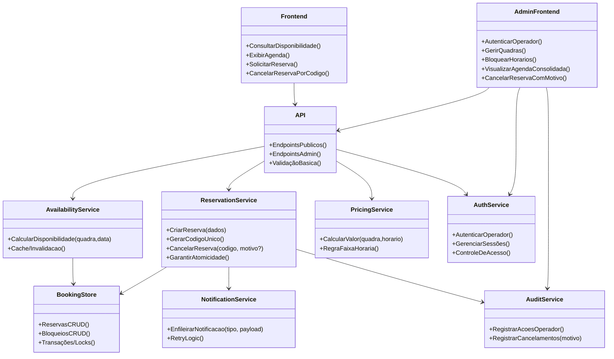

# Relatório Técnico de Arquitetura de Software

## 1. Identificação das HUs
Lista das Histórias de Usuário tratadas diretamente pela arquitetura:

- HU01 — Cadastrar quadra  
  - Critérios: Nome, tipo e valor obrigatórios; quadra aparece imediatamente na listagem de disponibilidade do cliente.
- HU02 — Bloquear horários para manutenção  
  - Critérios: Horários bloqueados não aparecem; operador pode remover bloqueio.
- HU03 — Visualizar agenda consolidada  
  - Critérios: Exibe todas as quadras e seus horários reservados/livres no dia; navegação entre datas.
- HU04 — Cancelar reserva com justificativa (Operador)  
  - Critérios: Motivo obrigatório; cliente notificado por e-mail.
- HU05 — Consultar disponibilidade sem cadastro (Cliente)  
  - Critérios: Acesso sem login; horários ocupados mostrados como indisponíveis.
- HU06 — Realizar reserva (Cliente)  
  - Critérios: Validação de disponibilidade no momento da confirmação; geração e exibição/envio de código de confirmação.
- HU07 — Cancelar minha reserva (Cliente)  
  - Critérios: Cancelamento por código válido; horário volta a ficar disponível imediatamente.

Cobertura adicional: todos os RFs e RNFs listados no enunciado estão considerados ao longo do relatório (ver Seção 6).

---

## 2. Diagramas de Arquitetura (Mermaid)

2.1 Diagrama de Sequência: fluxo de reserva (inclui verificação de disponibilidade, criação atômica da reserva, geração de código e envio de e‑mail)

```mermaid
sequenceDiagram
    autonumber
    participant Cliente
    participant Frontend
    participant API
    participant AvailabilityService
    participant ReservationService
    participant BookingStore
    participant NotificationService
    participant EmailService

    Cliente->>Frontend: Ver disponibilidade (quadra, data)
    Frontend->>API: GET /availability?court=&date=
    API->>AvailabilityService: Consultar disponibilidade(quadra,data)
    AvailabilityService->>BookingStore: Ler reservas + bloqueios (quadra,data)
    BookingStore-->>AvailabilityService: Reservas e bloqueios
    AvailabilityService-->>API: Disponibilidade calculada
    API-->>Frontend: Lista de horários (livres/ocupados/bloqueados)

    Cliente->>Frontend: Solicita reservar (nome,email,tel,horário)
    Frontend->>API: POST /reservations {dados}
    API->>ReservationService: CriarReserva(request)
    ReservationService->>BookingStore: INICIAR TRANSAÇÃO; Checar disponibilidade & inserir reserva provisória
    BookingStore-->>ReservationService: Sucesso/Conflito (único)
    alt Reserva bem sucedida
        ReservationService->>BookingStore: COMITAR transação; persistir código único
        ReservationService->>NotificationService: Enfileirar e-mail de confirmação
        NotificationService->>EmailService: Enviar e-mail assíncrono
        EmailService-->>NotificationService: Ack
        ReservationService-->>API: 201 Created {codigo_confirmacao}
    else Horário já ocupado
        BookingStore-->>ReservationService: Erro de conflito (409)
        ReservationService-->>API: 409 Conflito
    end
    API-->>Frontend: Exibir resultado e/ou código de confirmação
```

2.2 Diagrama de Componentes / Classes (visão lógica)



---

## 3. Decisões de Arquitetura
Cada decisão inclui justificativa, opção escolhida, implicações e alternativas consideradas.

D1 — Separação de responsabilidades por serviços (Services orientados a capacidades: Availability, Reservation, Pricing, Notification, Auth, Audit)  
- Justificativa: facilita modularidade, testabilidade e manutenção; atende RNF07 (modularidade para novas modalidades).  
- Implicações: contratos de interface bem definidos; testes de integração entre serviços; versionamento de API.  
- Alternativas: aplicação monolítica; rejeitada por comprometer modularidade.

D2 — API pública para clientes (sem autenticação) e API admin protegida (autenticação + controle de acesso)  
- Justificativa: atende HU05 (consulta sem cadastro) e RNF03 (autenticação área administrativa).  
- Implicações: segregação de endpoints, regras CORS, políticas de rate limiting.  
- Alternativas: tudo via mesma interface com feature flags (menos seguro).

D3 — Consistência e atomicidade na confirmação de reserva (transação atômica + checagem única)  
- Justificativa: atende RNF05 (impedir duplo agendamento frente a requisições simultâneas) e HU06.  
- Escolha: operação de "checar-e-criar" feita como unidade atômica na camada de persistência (transação, verificação única por chave composta horário+quadra, mecanismo de lock/optimistic/compare-and-swap dependendo do ambiente).  
- Implicações: necessidade de suporte de operações transacionais ou mecanismos de resolução de conflitos; pode afetar latência de escrita.  
- Alternativas: reserva tentadora com confirmação posterior (fila) — rejeitada por UX e RNF05.

D4 — Cache de disponibilidade com invalidação em escrita  
- Justificativa: cumprir RNF02 (carregar calendário em até 2 segundos).  
- Escolha: cache de leituras sobre AvailabilityService com TTL curtos e invalidação imediata quando uma reserva/bloqueio é criada/removido.  
- Implicações: complexidade de invalidação; necessidade de priorizar consistência para frames próximos no tempo.  
- Alternativas: sempre consultar origem de dados (pior latência).

D5 — Notificações por e-mail em modo assíncrono e idempotente (fila + retries)  
- Justificativa: não bloquear a confirmação da reserva por latência de entrega de e‑mail; garantir RNF04 (disponibilidade) e boa UX (HU06/HU04).  
- Implicações: garantir idempotência e eventual consistency para notificações; necessidade de monitoramento de filas e retries.  
- Alternativas: síncrono (bloqueia fluxo de reserva — rejeitado).

D6 — Logging/Auditoria para ações administrativas e cancelamentos (com motivo)  
- Justificativa: atender HU04 e requisitos de rastreabilidade.  
- Implicações: armazenamento de logs/auditoria, políticas de retenção e acesso restrito.

D7 — UI responsiva (design adaptativo) e separação de camadas UI/API  
- Justificativa: atender RNF01 (responsividade) e RNF06 (compatibilidade com navegadores).  
- Implicações: necessidade de testes responsivos e de compatibilidade.

D8 — Estratégia de alta disponibilidade e monitoramento (redundância, health checks, escalonamento)  
- Justificativa: atender RNF04 (99% disponibilidade).  
- Implicações: planejamento de recuperação, failover e roteiros de manutenção.

Observações sobre neutralidade: todas as decisões são expressas em termos de responsabilidades, propriedades transacionais e padrões arquiteturais — sem prescrição de produtos específicos.

---

## 4. Tabela de Componentes e Rastreabilidade

| Componente | Responsabilidade Principal | Comunica-se com | Origem (HU / Critério de Aceite) |
|---|---:|---|---|
| Frontend (Cliente) | Interface pública para consulta e reserva; responsiva | API | HU05, HU06; RNF01, RNF06 |
| AdminFrontend (Operador) | Interface administrativa para gerir quadras, bloquear horários, visualizar agenda | API, AuthService | HU01, HU02, HU03, HU04; RNF03 |
| API Gateway / Controlador | Roteamento, validação básica, limites de taxa, exposição de endpoints públicos/admin | Frontend, AdminFrontend, Services | Todos os HUs |
| AvailabilityService | Calcular e servir disponibilidade consolidada; cache/invalidar | BookingStore, API, PricingService | HU05, HU03; RNF02, RNF07 |
| ReservationService | Gerenciar ciclo de vida da reserva (criar, cancelar), garantir atomicidade | BookingStore, NotificationService, AuditService | HU06, HU07, HU04; RF06, RF07, RNF05 |
| PricingService | Aplicar regras de preço por faixa horária e calcular valor da hora | API, AvailabilityService, BookingStore | RF12; HU01 |
| BookingStore (persistência lógica) | Persistência de quadras, reservas, bloqueios, índices para checagem única | AvailabilityService, ReservationService, AdminFrontend | HU01, HU02, HU06 |
| NotificationService | Gerenciar envio assíncrono de e-mails; retries e idempotência | ReservationService, EmailService | RF10, HU06, HU04 |
| EmailService (integração) | Envio efetivo das mensagens (assíncrono) | NotificationService | RF10, HU04 |
| AuthService | Autenticação e autorização para área administrativa | AdminFrontend, API | RNF03 |
| AuditService / Logging | Registrar ações críticas e motivos de cancelamento | ReservationService, AdminFrontend | HU04 |
| BackgroundWorker / Scheduler | Tarefas assíncronas, limpeza, reenvio de notificações | NotificationService, BookingStore | RNF04, RF03 |
| Monitoring & Health | Saúde dos componentes e métricas de SLA | Operações | RNF04 |

Notas:
- "BookingStore" é um conceito de armazenamento lógico (tabelas/coleções/entidades para quadras, reservas, bloqueios). Requisitos de atomicidade e unicidade devem ser implementados na camada de persistência com apoio do ReservationService.
- Interfaces entre componentes deverão ser explicitadas como contratos REST/HTTP ou RPC funcionais, com payloads e erros padronizados (ex.: 201, 409 para conflito).

---

## 5. Bloqueios e Pendências
Itens que impedem decisões finais ou exigem esclarecimentos do produto/negócio:

1. Definição de granularidade de tempo dos horários (p.ex. 30min, 60min, múltiplos de hora) — impacto direto em modelo de dados, checagem de conflitos e UX. (Prioridade: alta)  
   - Ação recomendada: decidir granularity antes do design detalhado de BookingStore.

2. Regras completas de precificação por faixa horária (como são definidas faixas, heranças entre quadras, preços por dia da semana) — necessário para PricingService. (Prioridade: média)  
   - Ação: especificar UI/estrutura para definir faixas e precedência.

3. Política de cancelamento (prazos, penalidades, reembolsos) — não definida nos requisitos. Afeta disponibilidade automática e regras de negócio. (Prioridade: alta)  
   - Ação: confirmar regras de negócio.

4. Formato, comprimento e políticas de segurança dos códigos de confirmação (randomização, colisões, expiração). (Prioridade: alta)  
   - Ação: definir formato e TTL do código; critérios de auditabilidade.

5. Quotas e expectativas de carga (número de quadras, reservas/dia, picos) — necessário para projetar escalabilidade e caches. (Prioridade: média-alta)  
   - Ação: coletar estimativas de uso.

6. Política de retenção/privacidade de dados pessoais (e-mail, telefone) e conformidade legal (ex.: políticas de consentimento para e-mails) — impacto legal e de armazenamento. (Prioridade: alta)  
   - Ação: alinhar com time de conformidade.

7. SLA definindo o que compõe os 99% (manutenções programadas, janelas de backup) — para planejar HA. (Prioridade: média)  
   - Ação: acordar manutenção planejada e janelas.

8. Estratégia para envio de e-mails (taxas, testes de entrega, fallback) — configuração de retries e dead-letter handling. (Prioridade: média)  
   - Ação: especificar requisitos operacionais para NotificationService.

9. Definição de fusos horários e comportamento em caso de clientes/operadores em fusos diferentes — especialmente importante para reservas. (Prioridade: alta)  
   - Ação: padronizar uso de timezone e exibir localmente.

10. Requisitos não declarados: pagamentos não estão no escopo (confirmar se haverá cobrança online ou pagamento local). (Prioridade: média)  
   - Ação: confirmar necessidade de integração com fluxo de pagamentos.

---

## 6. Cobertura de Requisitos

6.1 Mapeamento RF -> Componentes principais (resumo)

| RF ID | Descrição | Componentes responsáveis |
|---|---|---|
| RF01 | Cadastro de quadras | AdminFrontend, API, BookingStore, PricingService (valor hora) — HU01 |
| RF02 | Editar/remover quadra | AdminFrontend, API, BookingStore, AvailabilityService — HU01 |
| RF03 | Bloquear horários | AdminFrontend, API, BookingStore, AvailabilityService — HU02 |
| RF04 | Exibir disponibilidade sem login | Frontend, API, AvailabilityService, BookingStore — HU05 |
| RF05 | Cliente realiza reserva com dados | Frontend, API, ReservationService, BookingStore, NotificationService — HU06 |
| RF06 | Gerar código de confirmação | ReservationService, BookingStore, NotificationService — HU06 |
| RF07 | Impedir reserva de horário ocupado | ReservationService, BookingStore (checagem atômica) — RNF05 |
| RF08 | Cliente cancela reserva por código | Frontend, API, ReservationService, BookingStore, NotificationService — HU07 |
| RF09 | Operador cancela reserva com motivo | AdminFrontend, API, ReservationService, AuditService, NotificationService — HU04 |
| RF10 | Enviar confirmação por e-mail | NotificationService, EmailService — HU06, HU04 |
| RF11 | Visualizar agenda consolidada | AdminFrontend, API, AvailabilityService, BookingStore — HU03 |
| RF12 | Valores por faixa horária | PricingService, AdminFrontend, BookingStore — HU01 |

6.2 Mapeamento RNF -> Contramedidas arquiteturais

| RNF ID | Descrição | Tratamento arquitetural |
|---|---|---|
| RNF01 | Responsividade UI | Frontend responsivo; testes cross-browser; design adaptativo |
| RNF02 | Calendar load <= 2s | Cache (AvailabilityService), consultas otimizadas, paginação/visualização incremental |
| RNF03 | Admin protegido | AuthService (autenticação + autorização), endpoints protegidos |
| RNF04 | Disponibilidade 99% | Redundância de componentes, health checks, fila para tarefas assíncronas, monitoramento/alertas |
| RNF05 | Confirmação atômica | Operação transacional no ReservationService/BookingStore; chave única por quadra+slot; lock/optimistic retry |
| RNF06 | Compatibilidade navegadores | Frontend com padrões web; testes em navegadores suportados |
| RNF07 | Modularidade | Serviços separados por responsabilidade, extensibilidade de modelagem de modalidades |

---

## 7. Gap Analysis
Identificação de lacunas, impacto e ações recomendadas.

GAP 1 — Granularidade dos horários (ausente)  
- Impacto: definição de modelo de dados para reservas, conflitos, UI de seleção de horários, cálculo de preço por faixa.  
- Risco: implementação errada pode exigir grande retrabalho de dados.  
- Recomendação: decidir se slots são em minutos (ex.: 30m) ou por hora, e se são compostos (várias unidades por reserva). Definir compatibilidade para reservas de múltiplas unidades (ex.: 90 minutos).

GAP 2 — Regras de precificação e sua modelagem (detalhes de faixas)  
- Impacto: PricingService e UX de operador; cálculo em HU06.  
- Recomendação: especificar formato de faixa (início/fim, dias da semana, exceções) e ordem de precedência.

GAP 3 — Política de cancelamento e janelas (quando é permitido cancelar, reembolso/punição)  
- Impacto: regras do ReservationService e comunicação ao cliente, possíveis integrações externas de pagamento.  
- Recomendação: definir política (p.ex. sem multa até X horas antes) e refletir no contrato de API.

GAP 4 — Formato e segurança do código de confirmação (comprimento, validade, exposição pública)  
- Impacto: colisões, brute-force, usabilidade do cancelamento por código.  
- Recomendação: definir comprimento, caracteres permitidos, TTL e limite de tentativas de uso. Implementar mecanismos de rate-limiting/brute-force para endpoint de cancelamento por código.

GAP 5 — Fuso horário/normalização temporal  
- Impacto: reservas incorretas se cliente/operador em fusos diferentes; interface confusa.  
- Recomendação: padronizar armazenamento em UTC e exibir localmente com clear timezone; aceitar entrada com timezone explícito.

GAP 6 — Volume esperado e dimensionamento (capacidade)  
- Impacto: escolhas de caching, dimensionamento horizontal, configuração de filas e limites de concorrência.  
- Recomendação: coletar estimativas de uso (reservas/dia, picos simultâneos) para definir SLAs de infra.

GAP 7 — Entrega de e-mails (SLA, taxa, fallback)  
- Impacto: confirmações não entregues afetam UX; perda de notificações.  
- Recomendação: definir SLA de entrega, políticas de retry e DLQ, e processo de monitoração/alerta para falhas.

GAP 8 — Requisitos regulatórios e proteção de dados (consentimento para e-mail, retenção)  
- Impacto: obrigações legais e riscos de compliance.  
- Recomendação: definir políticas de retenção, aviso de privacidade e mecanismo de opt-out; registrar consentimento em AuditService.

GAP 9 — Testes de concorrência e estratégia para conflitos de reserva  
- Impacto: possível dupla reserva em cenários de alta concorrência sem testes adequados.  
- Recomendação: criar cenários de teste de carga e de concorrência; testar mecanismos de lock/unique constraint.

GAP 10 — Níveis de permissão do operador (roles) e multi-operador simultâneo  
- Impacto: segurança e auditoria; ações conflitantes entre operadores.  
- Recomendação: definir papéis (p.ex. operador, administrador), regras de permissão e processo de audit trail.

GAP 11 — Backup / Restauração e políticas de retenção | DR plan  
- Impacto: proteger dados críticos (reservas/quadras).  
- Recomendação: definir RPO/RTO e estratégia para backups consistentes.

---

Observações finais e passos recomendados imediatos
1. Validar e priorizar as pendências críticas (granularidade de horários, política de cancelamento, formato de código de confirmação, timezone).  
2. Elaborar contratos de API (endpoints, payloads, códigos de erro) e modelagem de dados para BookingStore com foco em constraints de unicidade (quadra + slot).  
3. Projetar e implementar testes de concorrência e carga antes do go-live para validar RNF05 e RNF02.  
4. Definir métricas e alertas (tempo médio de resposta do calendário, taxa de erros, filas de notificação, entregas de e-mail) para cumprir RNF04.  
5. Documentar processos operacionais para manutenção e rollback de bloqueios de quadra (HU02) e para cancelamentos operacionais com justificativa (HU04).

---

Fim do Relatório Canônico.  
Se desejar, posso:
- Gerar um esboço de API (endpoints, parâmetros, exemplos de payload) mantendo neutralidade tecnológica;  
- Fornecer um modelo de dados inicial para BookingStore (entidades/reservas/quadras/bloqueios);  
- Produzir cenários de teste de concorrência e scripts de carga. Qual prefere primeiro?