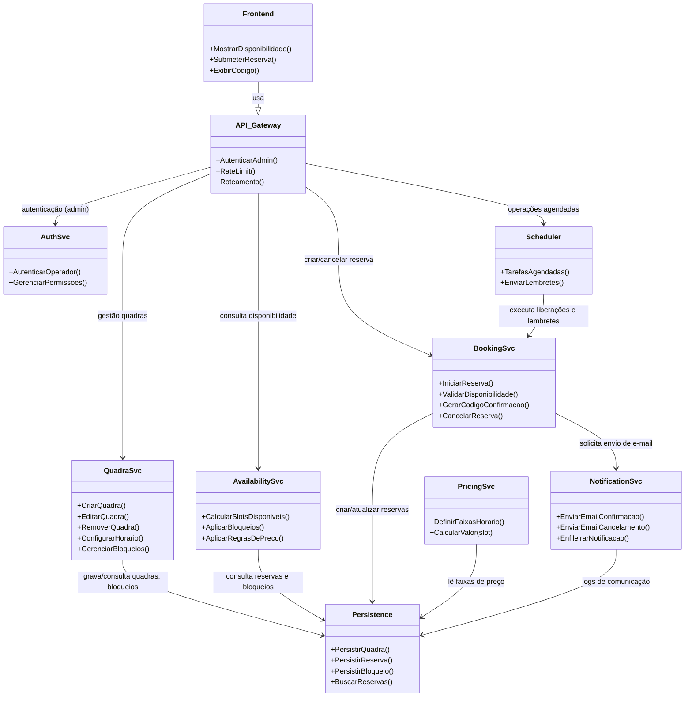

# Relatório Técnico de Arquitetura de Software

## 1. Identificação das HUs

Lista das Histórias de Usuário (HU) com breve escopo e rastreabilidade para os requisitos funcionais (RF) e critérios de aceite relevantes.

- HU01 — Cadastrar quadra  
  - Escopo: Operador cadastra quadra com nome, tipo, horário de funcionamento e valor da hora.  
  - RF relacionados: RF01, RF02  
  - Critérios de aceite: Nome, tipo e valor hora obrigatórios; quadra aparece imediatamente na listagem pública.

- HU02 — Bloquear horários para manutenção  
  - Escopo: Operador bloqueia horários de uma quadra (manutenção/feriado) e remove bloqueios.  
  - RF relacionados: RF03  
  - Critérios de aceite: Horários bloqueados não aparecem como disponíveis; bloqueio removível.

- HU03 — Visualizar agenda consolidada  
  - Escopo: Operador visualiza agenda diária consolidada de todas as quadras e navega entre datas.  
  - RF relacionados: RF11  
  - Critérios de aceite: Exibe todas as quadras e horários reservados/livres; navegação entre datas.

- HU04 — Cancelar reserva com justificativa (Operador)  
  - Escopo: Operador cancela reserva registrando motivo; cliente é notificado.  
  - RF relacionados: RF09, RF10  
  - Critério de aceite: Motivo obrigatório; cliente notificado por e-mail.

- HU05 — Consultar disponibilidade sem cadastro (Cliente)  
  - Escopo: Cliente consulta horários disponíveis por quadra/data sem login.  
  - RF relacionados: RF04  
  - Critérios de aceite: Acesso sem login; horários ocupados mostrados como indisponíveis.

- HU06 — Realizar reserva (Cliente)  
  - Escopo: Cliente realiza reserva informando nome, e‑mail, telefone e horário desejado; recebe código.  
  - RF relacionados: RF05, RF06, RF07, RF10, RNF05  
  - Critérios de aceite: Validação de disponibilidade no momento da confirmação; código exibido e enviado por e‑mail; operação atômica.

- HU07 — Cancelar minha reserva (Cliente)  
  - Escopo: Cliente cancela usando código de confirmação; horário volta a ficar disponível.  
  - RF relacionados: RF08, RF07  
  - Critérios de aceite: Cancelamento com código válido; disponibilidade imediatamente atualizada.

Observação: RNFs (usabilidade, desempenho, segurança, disponibilidade, confiabilidade, compatibilidade, manutenibilidade) aplicam-se transversalmente a todas as HUs acima.

---

## 2. Diagramas de Arquitetura (Mermaid)

A seguir estão dois diagramas: um diagrama de sequência end‑to‑end (reserva típica do cliente) com `autonumber` e um diagrama de componentes/classes que descreve responsabilidades e interfaces conceptuais.

Diagrama de sequência — fluxo de reservar horário (cliente):
```mermaid
sequenceDiagram
    autonumber
    participant Cliente as Cliente (Browser)
    participant Frontend as Frontend (UI)
    participant API as API Gateway / BFF
    participant Auth as Auth Service (Admin area)
    participant QuadraSvc as Quadra Management Service
    participant Disponibilidade as Availability Service
    participant ReservaSvc as Booking Service
    participant DataStore as Persistência (Reserva / Quadra / Bloqueios)
    participant Notif as Notification Service (Email)
    participant Scheduler as Scheduler / Job Service

    Cliente->>Frontend: Consultar disponibilidade (quadra, data)
    Frontend->>API: GET /quadras/{id}/disponibilidade?data=YYYY-MM-DD
    API->>Disponibilidade: solicitar janelas disponíveis
    Disponibilidade->>DataStore: obter reservas + bloqueios + regras de preços
    DataStore-->>Disponibilidade: retorna dados
    Disponibilidade-->>API: lista de slots (livres/ocupados, preços)
    API-->>Frontend: disponibilidade renderizada
    Frontend-->>Cliente: exibe slots e formulário de reserva

    Cliente->>Frontend: Submeter reserva (nome,e-mail,telefone,slot)
    Frontend->>API: POST /reservas {slot, cliente}
    API->>ReservaSvc: iniciar operação de reserva (idempotencyKey opc.)
    ReservaSvc->>Disponibilidade: checar e *reservar atomically* (lock ou transação)
    Disponibilidade->>DataStore: criar reserva com estado = PENDENTE/CONFIRMADA atômico
    alt reserva bem sucedida
        DataStore-->>ReservaSvc: confirmação + reservationCode
        ReservaSvc->>Notif: enqueue email de confirmação {reservationCode, dados}
        Notif-->>ReservaSvc: ack de envio (assíncrono)
        ReservaSvc-->>API: 201 Created {reservationCode}
        API-->>Frontend: mostra código e mensagem de sucesso
        Frontend-->>Cliente: exibe código na tela
    else conflito (slot ocupado)
        DataStore-->>ReservaSvc: erro de conflito
        ReservaSvc-->>API: 409 Conflict
        API-->>Frontend: informar indisponibilidade
        Frontend-->>Cliente: mostrar erro e sugerir outros horários
    end

    Note over Scheduler,DataStore: Scheduler executa tarefas (ex.: liberar bloqueios temporários; enviar lembrete)
```

Diagrama de componentes / classes (visão conceitual):


---

## 3. Decisões de Arquitetura

1. Separação por responsabilidades (principio SRP)
   - Componentes conceptuais: Frontend (UI), API Gateway/BFF, Quadra Management, Availability, Booking, Pricing, Notification, Auth, Persistence, Scheduler.
   - Racional: facilita modularidade e manutenibilidade (RNF07).

2. Interface clara e sem estado no Frontend/API
   - Frontend é responsivo; API fornece contratos REST/HTTP (ou similar) e expõe endpoints para consulta pública e área administrativa autenticada (RNF01, RNF03).

3. Disponibilidade e escalabilidade
   - Serviços são concebidos como logicamente independentes para escalar conforme carga de consultas (alta leitura de disponibilidade vs. gravação de reservas) visando RNF04.

4. Controle de concorrência e atomicidade (RNF05)
   - A criação de reserva deve ser atômica: decisão arquitetural para garantir verificação e marcação do slot em uma operação transacional sobre a persistência ou via mecanismo de bloqueio (pessimista/optimista). Deve existir um mecanismo de idempotência para re‑envios de requisição.
   - Garantir unicidade do par (quadra, data, horário) por meio de restrição lógica e/ou esforço de coordenação no Booking Service.

5. Cache de disponibilidade com invalidação rápida
   - Disponibilidade deve responder < 2s (RNF02): cache de consultas com TTL curto e invalidação/eviction imediata após criação/cancelamento de reservas ou alteração de bloqueios.

6. Notificação assíncrona
   - Enfileirar envio de e‑mail para não bloquear operação de reserva. Garantir entrega eventual e tentativa/retry, com logging e auditoria.

7. Segurança da área administrativa
   - Autenticação para operadores e proteção de endpoints administrativos (RNF03). Autorização de ações (ex.: somente operador pode cancelar com justificativa).

8. Auditoria e logs de negócio
   - Registrar ações críticas: criação/cancelamento de reservas (com motivo quando operador), edições de quadra, bloqueios. Necessário para rastreabilidade e suporte.

9. Modelagem de preços por faixa horária (RF12)
   - Pricing Service com regras aplicáveis sobre cada slot. Regras devem permitir hierarquias (faixas específicas, default) e ser consultadas pelo Availability e Booking.

10. UX anônima para consulta e reserva
    - Permitir consulta sem autenticação; reserva requer apenas dados de contato (nome, e‑mail, telefone) e o código de confirmação (RF04, HU05).

11. Disponibilidade imediata após cancelamento
    - Cancelamento atualiza estado atomically e aciona invalidação do cache de disponibilidade para tornar slot disponível (HU07).

12. Internacionalização e diferenças de fuso horário
    - Representar datas/horários sempre com timezone explícito e documentar comportamento em horário de verão — ação recomendada nas pendências.

Observação: Decisões acima são tecnológicas neutras (não prescrevem produtos/vendor).

---

## 4. Tabela de Componentes e Rastreabilidade

| Componente | Responsabilidade Principal | Comunica-se com | Origem (HU / Critério de Aceite) |
|---|---|---:|---|
| Frontend (UI público) | Exibir disponibilidade responsiva; formulário de reserva; exibir código | API Gateway | HU05, HU06, RNF01 |
| Frontend (Admin) | UI para operadores: cadastrar/editar quadras, bloquear horários, agenda consolidada | API Gateway, Auth Service | HU01, HU02, HU03, HU04; RF01,R F02,R F03,R F11 |
| API Gateway / BFF | Roteamento, agregação, validação básica, rate limiting, autenticação admin | Frontend, QuadraSvc, AvailabilitySvc, BookingSvc, AuthSvc | Transversal (todas HUs) |
| Quadra Management Service | CRUD de quadras, horários de funcionamento, gerenciar bloqueios de manutenção | Persistence, AvailabilitySvc | HU01, HU02; RF01, RF02, RF03 |
| Availability Service | Calcular slots livres/ocupados; aplicar bloqueios e regras de preço | Persistence, PricingSvc | HU05; RF04, RNF02 |
| Booking Service | Orquestrar reserva atômica; gerar código de confirmação; validar concorrência; cancelar | Persistence, NotificationSvc, AvailabilitySvc | HU06, HU07; RF05, RF06, RF07, RF08, RNF05 |
| Pricing Service | Gerenciar faixas de horário e cálculo de valor por slot | Persistence, AvailabilitySvc, BookingSvc | RF12; HU01 (valor da hora), RNF07 |
| Notification Service | Enfileirar e enviar e-mails de confirmação e cancelamento; retries/log | BookingSvc, Persistence | RF10, HU04, HU06 |
| Auth Service | Autenticar e autorizar operadores; tokens/session management para admin area | API Gateway, Admin Frontend | RF03 (área administrativa), RNF03 |
| Persistence (modelo de dados) | Armazenar quadras, reservas, bloqueios, preços, logs/audit | Todos os serviços | Todas as RFs e HUs que envolvem gravação |
| Scheduler / Job Service | Execução de tarefas agendadas: liberar bloqueios, enviar lembretes | BookingSvc, NotificationSvc, Persistence | HU02 (remover bloqueio manual/automático), lembretes (opcional) |
| Monitoring & Metrics | Coletar métricas de disponibilidade, latência, erros | Todos os serviços | RNF04, RNF02 |

Observação: "Persistence" é um componente conceitual que agrupa os modelos e operações de armazenamento; decisões de implementação ficam a cargo do time.

---

## 5. Bloqueios e Pendências

1. Mecanismo de controle de concorrência e transações
   - Necessidade de definir: estratégia pessimista (locks) vs. otimista (verificação + retry) vs. coordenação externa.
   - Impacto: afeta latência, complexidade de implementação e escalabilidade.  
   - Recomendação: decidir antes da implementação do Booking Service.

2. Especificação do formato e regras de pricing por faixa
   - Necessário detalhar: prioridades entre faixas sobrepostas, arredondamento, moeda, desconto, horários especiais.  
   - Impacto: AvailabilitySvc e BookingSvc precisam de contrato claro.

3. Autenticação / autorização administrativa
   - Definir mecanismo (SSO, credenciais locais, políticas de senha, roles).  
   - Impacto: configuração de AuthSvc, políticas de segurança e auditoria.

4. SLA de e‑mail e estratégia de retry
   - Definir requisitos de entrega e políticas de falha (quando notificar manualmente).  
   - Impacto: UX e operações de suporte.

5. Requisitos de retenção e privacidade de dados
   - Política de retenção de dados pessoais (nome, e-mail, telefone) e logs de auditoria.  
   - Impacto: persistência e conformidade legal.

6. Cenários de integração externa
   - Se houver integrações (pagamento, listas de espera, calendários externos) ainda não especificadas.  
   - Impacto: Extensibilidade da API e modelagem de eventos.

7. Níveis de carga esperados
   - Número esperado de consultas simultâneas e reservas por minuto/hora.  
   - Impacto: dimensionamento, caching e tolerância a falhas.

8. Timezone e DST
   - Definir política para exibição e armazenamento de horários (local da quadra vs. cliente).  
   - Impacto: cálculo de disponibilidade e risco de bug em horário de verão.

9. Geração e composição do código de confirmação
   - Definir formato, tamanho, características (legibilidade, colisão) e idempotência.  
   - Impacto: UX (facilidade de uso) e unicidade.

10. Notificações adicionais (lembretes, cancelamento pelo operador)
    - Definir gatilhos e templates de e‑mail (inclui linguagem e dados obrigatórios).

---

## 6. Cobertura de Requisitos

Mapeamento dos requisitos funcionais (RF) e não-funcionais (RNF) para componentes e comentários sobre cobertura.

- RF01 (Cadastrar quadras)  
  - Componentes: Quadra Management Service, Persistence, API Gateway, Admin Frontend  
  - Cobertura: Coberto — operações CRUD previstas; necessidade de validações obrigatórias (nome, tipo, valor) na camada de serviço.

- RF02 (Editar/remover quadra)  
  - Componentes: Quadra Management Service, Persistence, Admin Frontend  
  - Cobertura: Coberto — incluir confirmações e checagens de integridade (reservas existentes).

- RF03 (Bloquear horários)  
  - Componentes: QuadraSvc, Scheduler, AvailabilitySvc, Persistence, Admin Frontend  
  - Cobertura: Coberto — bloqueio e remoção contemplados; precisa especificar regras de prioridade entre bloqueios e reservas existentes.

- RF04 (Exibir disponibilidade sem login)  
  - Componentes: AvailabilitySvc, Frontend (public), API Gateway, Persistence, PricingSvc  
  - Cobertura: Coberto — cache e resposta rápida requerido (RNF02).

- RF05 (Realizar reserva com dados do cliente)  
  - Componentes: BookingSvc, AvailabilitySvc, Persistence, NotificationSvc, Frontend, API Gateway  
  - Cobertura: Coberto — exige atomicidade (RNF05) e validação de slot disponível.

- RF06 (Gerar código de confirmação único)  
  - Componentes: BookingSvc, Persistence  
  - Cobertura: Coberto — necessidade de definição de esquema de geração.

- RF07 (Impedir reserva de horário já ocupado)  
  - Componentes: BookingSvc, AvailabilitySvc, Persistence  
  - Cobertura: Coberto conceitualmente — implementação do controle concorrente pendente (ver Bloqueios e Pendências).

- RF08 (Cancelar reserva pelo cliente com código)  
  - Componentes: BookingSvc, Persistence, Frontend, API Gateway, NotificationSvc  
  - Cobertura: Coberto — validação de código e imediata invalidação de disponibilidade.

- RF09 (Operador cancelar com motivo)  
  - Componentes: BookingSvc, Persistence, Admin Frontend, NotificationSvc, AuthSvc  
  - Cobertura: Coberto — campo de motivo obrigatório e notificação prevista.

- RF10 (Enviar confirmação por e‑mail)  
  - Componentes: NotificationSvc, BookingSvc, Persistence  
  - Cobertura: Coberto — necessidade de definir SLA/templating.

- RF11 (Agenda diária consolidada)  
  - Componentes: Admin Frontend, API Gateway, AvailabilitySvc, Persistence  
  - Cobertura: Coberto — performance pode exigir paginação/filtragem.

- RF12 (Valores diferenciados por faixa de horário)  
  - Componentes: PricingSvc, AvailabilitySvc, QuadraSvc, BookingSvc, Persistence  
  - Cobertura: Coberto conceitualmente — regras detalhadas requeridas.

Não-Funcionais (RNFs) essenciais:
- RNF01 (Usabilidade responsiva) — Frontend; cobertura: aplicável, depende de implementação UI.
- RNF02 (Calendário < 2s) — AvailabilitySvc + cache + otimização; cobertura: abordado arquiteturalmente (cache), mas métricas e dimensionamento dependem da carga.
- RNF03 (Segurança área admin) — AuthSvc + API Gateway; cobertura: foco arquitetural, detalhes de política pendentes.
- RNF04 (Disponibilidade 99% 24/7) — alto nível: redundância e monitoramento previstos; detalhar SRE e SLAs.
- RNF05 (Confirmação atômica) — BookingSvc + transações; cobertura: requisito central, mecanismo precisa ser decidido.
- RNF06 (Compatibilidade navegadores) — Frontend; cobertura depende da implementação.
- RNF07 (Modularidade) — arquitetura em serviços atende; cobertura OK.

Resumo: todos os RFs têm suporte arquitetural. Pendências técnicas (concorrência, pricing rules, auth specifics, etc.) precisam ser definidas para fechar implementação.

---

## 7. Gap Analysis

Identificação de lacunas na especificação, impacto arquitetural e ações recomendadas.

1. Gap: Estratégia de controle de concorrência na reserva (pessimista vs. otimista)
   - Impacto: Pode causar dupla reserva em cenários de alta concorrência se mal implementado; afeta latência e escalabilidade.
   - Recomendado: Definir política (ex.: reserva dentro de transação com lock; ou verificação de unicidade + retry) e testes de carga e concorrência.

2. Gap: Regras completas de Pricing / Faixas de horário
   - Impacto: Ambiguidade em cálculo de valor e conflitos entre faixas; afeta faturamento e UX.
   - Recomendado: Especificar formato de regra (prioridade, sobreposição, arredondamento, moeda) e casos de teste.

3. Gap: Formato do código de confirmação e políticas de idempotência
   - Impacto: Colisões, segurança e experiência do cliente (erro ao digitar); necessidade de handling de re‑submissões.
   - Recomendado: Definir comprimento/alfanumérico, validade temporal e mecanismo idempotente (chave de requisição).

4. Gap: Política de retenção de dados e conformidade (privacidade)
   - Impacto: Armazenamento de dados pessoais sem política definida pode gerar não conformidade legal.
   - Recomendado: Definir período de retenção, anonimização para logs e política de remoção.

5. Gap: Especificação de SLAs operacionais (e-mail delivery, tempo de resposta sob pico)
   - Impacto: Sem SLA, expectativas de usuários e suporte não alinhadas.
   - Recomendado: Definir SLOs e estratégias de retry/alert.

6. Gap: Timezone/DST handling
   - Impacto: Reservas podem deslocar inadvertidamente em DST; UX confusa.
   - Recomendado: Normalizar armazenamento em timezone da quadra com conversão na UI; definir testes em cenários de DST.

7. Gap: Requisitos de monitoramento e recuperação (backups, restore)
   - Impacto: Recuperação após perda de dados ou falha grave incerta.
   - Recomendado: Definir política de backup, RTO/RPO e monitoramento de métricas chave (latência, erros, disponibilidade).

8. Gap: Detalhes sobre cancelamentos automáticos, penalidades ou políticas comerciais
   - Impacto: Incerteza sobre quando liberar reservas/evitar abuso.
   - Recomendado: Definir políticas de cancelamento, possíveis taxas e regras de bloqueio para reincidência.

9. Gap: Testes e dados para validar agenda consolidada em grandes volumes
   - Impacto: Possíveis problemas de performance na agenda do operador.
   - Recomendado: Planejar testes de carga e otimização de consultas/aggregation.

10. Gap: Definição de roles e níveis de permissão operadora
    - Impacto: Ações sensíveis (remover quadra, cancelar reserva sem justificativa) precisam de controle fino.
    - Recomendado: Definir roles mínimo/médio/admin, e auditoria por usuário.

Conclusão das gaps: embora a arquitetura cubra conceitualmente todos os requisitos, várias decisões de implementação e políticas operacionais precisam ser definidas antes de iniciar desenvolvimento detalhado e testes de aceitação. Priorizar: (1) política de concorrência/atomicidade; (2) regras de pricing; (3) autenticação/admin roles; (4) timezone/DST; (5) SLOs de notificações.

---

Fim do Relatório.