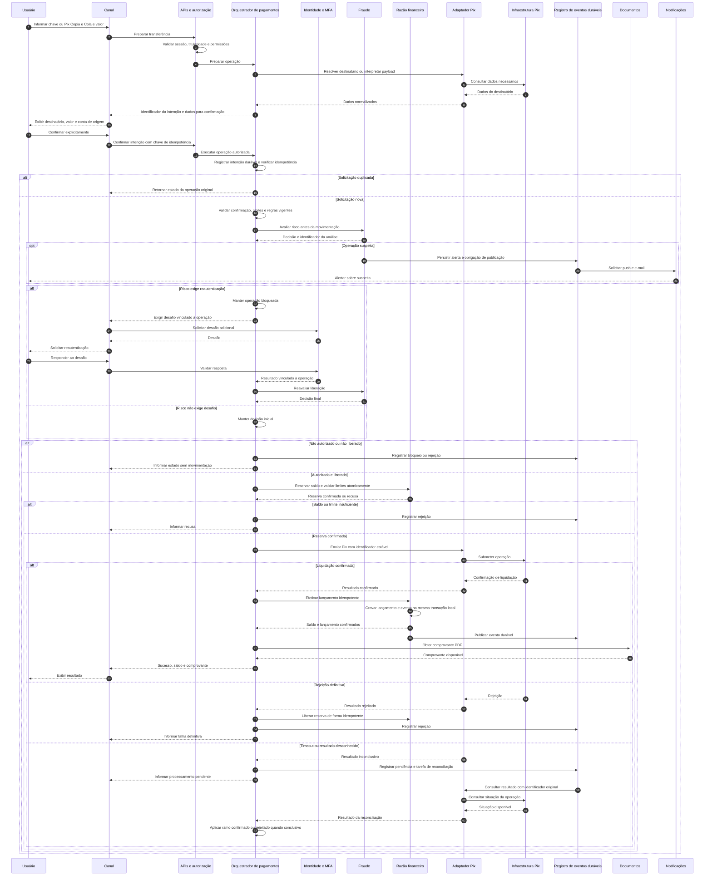

# Relatório Técnico de Arquitetura de Software

**Sistema:** Plataforma Financeira Digital — Sistema Bancário Digital (G01)  
**Identificação:** AI4ES — Time 2  
**Escopo:** RF01–RF47, RNF01–RNF24 e HU01–HU13.  
**Nível:** arquitetura lógica, tecnologicamente neutra.

Este relatório define responsabilidades, interfaces, fluxos e controles arquiteturais. A cobertura apresentada significa **alocação dos requisitos ao desenho**, não comprovação de implementação, desempenho ou conformidade regulatória. Decisões condicionadas a esclarecimentos estão identificadas nas seções 5 e 7.

## 1. Identificação das HUs

Os critérios de aceite são referenciados como **CA1, CA2...**, na ordem em que aparecem em cada história original.

| HU | Ator e objetivo | Critérios arquiteturalmente relevantes | RF relacionados |
|---|---|---|---|
| HU01 | PF: abrir conta digital | Validar identidade; comunicar resultado por e-mail e push em até 24 h; habilitar acesso imediatamente após aprovação | RF01, RF02, RF08 |
| HU02 | Usuário: autenticar com MFA | MFA em todo login; gerir métodos; alertar imediatamente sobre tentativas bloqueadas pelo MFA | RF03 |
| HU03 | Usuário: realizar Pix | Aceitar formas de iniciação previstas; confirmar destinatário; disponibilizar PDF após confirmação; aplicar limite noturno | RF13, RF22, RF24, RF27 |
| HU04 | Usuário: pagar ou agendar boleto | Confirmar beneficiário, valor e vencimento; agendar; lembrar um dia antes do vencimento | RF28–RF31 |
| HU05 | Usuário: gerenciar cartão de crédito | Faturas por ciclo; pagamento total, mínimo ou personalizado; bloqueio em até 60 s; push por transação | RF16–RF20 |
| HU06 | Usuário: contestar transação | Contestar transação de extrato ou fatura; motivo e evidências opcionais; protocolo e prazo de análise | RF21; ampliação de escopo pela HU |
| HU07 | Usuário: investir em renda fixa | Catálogo com liquidez e risco; confirmação da aplicação; atualização imediata da posição após aplicação/resgate | RF32–RF34 |
| HU08 | Usuário: controlar compartilhamento | Listar instituição, escopo e validade; revogar imediatamente; enviar e-mail na concessão/revogação | RF41, RF42 |
| HU09 | Usuário: responder a suspeita de fraude | Push e e-mail; resposta em até dois cliques; bloqueio preventivo e sinalização da conta quando contestada | RF36–RF39 |
| HU10 | Representante PJ: abrir conta empresarial | Validar CNPJ, sócios e documentos; KYC dos administradores; resultado em até 48 h | RF01, RF02, RF08 |
| HU11 | PJ: realizar TED | Validar destinatário; observar limites e horários; disponibilizar comprovante PDF | RF13, RF25, RF27 |
| HU12 | Gerente: acompanhar carteira | Consentimento prévio; consolidar produtos, saldos, investimentos e movimentos; registrar interações | RF07, RF45, RF46 |
| HU13 | Gerente: solicitar serviços | Identificar gerente; notificar abertura e resultado; impedir transação sem autorização explícita registrada | RF47 |

**Observações de governança:**

- As HUs não esgotam os requisitos. Sessões, rendimentos da poupança, chaves Pix, emissão de cartões, informe de rendimentos e relatórios regulatórios, entre outros, precisam de backlog próprio.
- PF e PJ são categorias de cliente; o acesso PJ ocorre por uma pessoa autenticada atuando como representante autorizado.
- A seção original agrupa várias histórias sob PF, mas utiliza o ator “usuário”. Sua aplicabilidade a PJ deve ser confirmada, sem presumir restrição exclusiva a PF.

## 2. Diagramas de Arquitetura (Mermaid)

### 2.1. Visão de componentes lógicos

Os componentes representam fronteiras de responsabilidade. **Não implicam um serviço implantável por componente.** As conexões indicam interfaces conceituais, não acesso irrestrito aos dados internos.

```mermaid
flowchart TB
    subgraph Canais["Canais de interação"]
        APP["C01 Aplicativo iOS e Android"]
        WEB["C01 Portal web responsivo"]
        GER["C01 Visão do gerente"]
    end

    subgraph Borda["Fronteira de acesso"]
        API["C02 Fachada de APIs e proteção de entrada"]
        IAM["C03 Identidade, MFA e sessões"]
        AUT["C04 Autorização e consentimentos"]
    end

    subgraph Dominio["Domínios de negócio"]
        KYC["C05 Cadastro e onboarding"]
        CTA["C06 Contas e poupança"]
        LED["C07 Razão financeiro"]
        CON["C08 Consultas e consolidação"]
        PAG["C09 Orquestração de pagamentos"]
        PIX["C10 Pix e chaves"]
        TED["C11 TED"]
        BOL["C12 Boletos"]
        AGE["C13 Agendamentos"]
        CAR["C14 Cartões e faturas"]
        INV["C15 Investimentos"]
        FRA["C16 Fraude e PLD/FT"]
        CAS["C17 Contestações e casos"]
        OF["C18 Open Finance"]
        CRM["C19 Relacionamento"]
    end

    subgraph Transversal["Capacidades transversais"]
        DOC["C20 Documentos e comprovantes"]
        NOT["C21 Notificações"]
        AUD["C22 Auditoria e relatórios regulatórios"]
        EVT["C23 Eventos duráveis e recuperação"]
        OPS["C24 Operação, segurança e continuidade"]
    end

    subgraph Externos["Sistemas externos"]
        IDP["Fontes de validação de identidade"]
        SPI["Infraestrutura Pix e diretório de chaves"]
        RED["Redes de TED e cobrança"]
        PCI["Processador certificado PCI-DSS"]
        CRED["Análise de crédito"]
        FIN["Provedores de investimentos"]
        PAR["Instituições Open Finance"]
        MSG["Canais de push e e-mail"]
        REG["Recepção regulatória"]
    end

    APP --> API
    WEB --> API
    GER --> API
    PAR --> OF
    OF --> API

    API --> IAM
    API --> AUT
    API --> KYC
    API --> CTA
    API --> CON
    API --> PAG
    API --> AGE
    API --> CAR
    API --> INV
    API --> CAS
    API --> CRM
    API --> PIX
    API --> OF

    KYC --> IDP
    KYC --> FRA
    KYC --> CTA
    CTA --> LED
    CTA --> DOC
    CON --> LED
    CON --> CAR
    CON --> INV

    PAG --> AUT
    PAG --> FRA
    PAG --> LED
    PAG --> PIX
    PAG --> TED
    PAG --> BOL

    PIX --> SPI
    TED --> RED
    BOL --> RED
    AGE --> PAG

    CAR --> PCI
    CAR --> CRED
    CAR --> PAG
    CAR --> FRA
    INV --> FIN
    INV --> LED
    INV --> FRA

    OF --> AUT
    OF --> CON
    OF --> PAG
    CRM --> AUT
    CRM --> CON
    CAS --> FRA
    CAS --> CAR
    CAS --> PAG

    KYC --> EVT
    CTA --> EVT
    IAM --> EVT
    AUT --> EVT
    PAG --> EVT
    CAR --> EVT
    INV --> EVT
    FRA --> EVT
    CAS --> EVT
    CRM --> EVT
    LED --> EVT

    EVT --> DOC
    EVT --> NOT
    EVT --> AUD
    NOT --> MSG
    AUD --> REG
    OPS -.-> API
    OPS -.-> EVT
    OPS -.-> LED
```

**Contratos principais:**

- **Comandos:** abrir conta, preparar/confirmar pagamento, bloquear cartão, aplicar/resgatar e revogar consentimento.
- **Consultas:** saldo, extrato, fatura, posição de investimentos, carteira e histórico de acessos.
- **Eventos:** fatos de negócio versionados, com identificador único, correlação, ator, entidade, instante e contexto mínimo necessário.
- **Integrações externas:** contratos isolados em adaptadores, com autenticação, validação de mensagens, tratamento de indisponibilidade e reconciliação.
- **Segurança transversal:** cada operação é autorizada no componente responsável; a fachada não é a única barreira de autorização.

### 2.2. Sequência de Pix com confirmação, risco, idempotência e recuperação

O fluxo pressupõe sessão autenticada com MFA. Uma resposta técnica de recebimento não é tratada como confirmação de liquidação.

**Regras complementares do fluxo:**

- Um timeout não autoriza criar outro Pix nem liberar automaticamente uma reserva cujo resultado externo seja desconhecido.
- A reconciliação persiste até obter resultado conclusivo ou encaminhar exceção para tratamento operacional.
- O prazo de 10 segundos deve ser medido com fronteiras acordadas. O tempo de decisão humana não deve ser silenciosamente incluído ou excluído.
- A geração do PDF possui recuperação própria: falha documental não desfaz uma transferência liquidada, mas constitui descumprimento do aceite de disponibilidade imediata até sua recuperação.

## 3. Decisões de Arquitetura

| ID | Decisão e justificativa | Consequências e controles |
|---|---|---|
| DA01 | **Separar capacidades por domínio**, preservando contratos explícitos | Evita acoplamento entre cadastro, pagamentos, cartões e investimentos. A topologia de implantação depende de carga, equipes e criticidade; não se impõe distribuição prematura |
| DA02 | **Separar identidade, cliente, representação e autorização** | Uma pessoa pode atuar como PF, representante PJ ou gerente. Permissões consideram ator, cliente representado, vínculo, produto, operação e consentimento |
| DA03 | **MFA obrigatório em todo login**, com OTP por aplicativo e biometria mobile suportados | Biometria permanece no dispositivo e habilita credencial protegida; não se centralizam modelos biométricos. Biometria isolada não é presumida como dois fatores |
| DA04 | **Distinguir bloqueio de acesso, bloqueio de cartão e bloqueio de transação** | Cada recurso possui estado próprio. Bloquear acesso revoga sessões; desbloqueio depende de procedimento seguro separado, ainda a especificar |
| DA05 | **Adotar razão financeiro como fonte autoritativa**, com lançamentos balanceados, reservas e ajustes rastreáveis | Valores usam representação monetária exata. Saldos disponíveis e contábeis não se confundem. Correções usam novos lançamentos, não edição destrutiva |
| DA06 | **Preservar consistência forte nas invariantes financeiras** | Reserva de saldo e consumo de limite devem impedir concorrência indevida. Atualização da posição de investimentos segue confirmação de execução; recebimento de ordem não equivale a execução |
| DA07 | **Usar máquina de estados durável para operações financeiras** | Preparação, autorização, reserva, envio, pendência, liquidação e rejeição são distinguíveis. Recuperação retoma operações pelo identificador original |
| DA08 | **Usar idempotência e publicação durável de eventos** | Estado e obrigação de publicação são persistidos atomicamente quando pertencem ao mesmo armazenamento transacional. Consumidores deduplicam; não se presume entrega “exatamente uma vez” entre instituições |
| DA09 | **Separar consultas otimizadas do processamento de comandos sem sacrificar atualização exigida** | Saldo consulta fonte autoritativa ou leitura com garantia de atualização. Projeções consolidadas precisam de versão e verificação de defasagem; eventualidade irrestrita não atende “tempo real” |
| DA10 | **Aplicar antifraude antes da efetivação e PLD/FT ao longo do ciclo de vida** | Operações de alto risco ficam bloqueadas. Reautenticação e confirmação de legitimidade não anulam automaticamente impedimentos regulatórios ou decisões adicionais de risco |
| DA11 | **Delegar dados de cartão ao processador PCI-DSS** | Captura sensível deve ocorrer em superfície do processador. A plataforma guarda referências opacas e dados não sensíveis autorizados; não guarda PAN, CVV ou dados equivalentes, inclusive em logs, anexos e backups |
| DA12 | **Separar consentimento de Open Finance, consentimento gerencial e mandato transacional** | Finalidade, escopo, prazo, cliente, instituição ou gerente são explícitos. Consentimento de visualização não concede poder de movimentação |
| DA13 | **Centralizar a política de acesso a dados compartilhados e validar revogação em cada requisição** | Tokens válidos não bastam após revogação. Não se permite decisão baseada apenas em cópia desatualizada do consentimento. Política para requisições em curso precisa de definição |
| DA14 | **Tratar regras financeiras e regulatórias como políticas versionadas** | Limites, calendários, rendimentos, elegibilidade, relatórios e formatos externos possuem vigência e histórico. Mudanças críticas exigem autorização e auditoria |
| DA15 | **Adotar segurança e privacidade em profundidade** | TLS 1.2 ou superior; AES-256 em repouso para dados sensíveis permitidos; bcrypt ou Argon2 para senhas; gestão e rotação de chaves; rate limiting; minimização e segregação de acesso |
| DA16 | **Auditar operações financeiras, acessos e configurações com evidências imutáveis** | Registrar ator real, representação, resultado, correlação e versão da política. Retenção mínima de cinco anos, com acesso restrito e compatibilização com LGPD e obrigações específicas |
| DA17 | **Projetar continuidade em múltiplas zonas de disponibilidade** | Componentes sem estado podem escalar horizontalmente; dados e tarefas duráveis exigem redundância, isolamento de falhas e testes. Múltiplas zonas não substituem automaticamente recuperação regional |
| DA18 | **Tratar acessibilidade, notificações e observabilidade como capacidades verificáveis** | WCAG 2.1 AA, compatibilidade de canais, métricas de jornada e auditoria não são atividades apenas de encerramento. Push/e-mail têm tentativas, estado de entrega e escalonamento de falhas |

### 3.1. Invariantes de domínio

1. **Movimentação financeira:** nenhuma operação pode debitar duas vezes pela repetição de uma mesma confirmação.
2. **Saldo e limites:** solicitações concorrentes não podem ultrapassar saldo disponível ou limite autorizado.
3. **Confirmação:** dados confirmados pelo usuário ficam vinculados à intenção. Alteração relevante exige nova confirmação.
4. **Agendamento:** a autorização do agendamento fica registrada; na execução, saldo, limites, bloqueios, consentimentos e regras vigentes são revalidados.
5. **Cartões:** limite de gasto configurado nunca supera o limite aprovado; bloqueios de débito e crédito são independentes.
6. **Poupança:** cálculo e crédito de rendimento são identificáveis por conta e competência, evitando crédito duplicado.
7. **Gerente:** abrir solicitação não equivale a aprová-la ou executá-la. No desenho-base, não há comando de transferência disponível ao gerente.
8. **Contestação:** recebimento de contestação não implica estorno automático. Transação já liquidada exige processo próprio de disputa, devolução ou recuperação.
9. **Consentimento:** autorizações expiradas ou revogadas não habilitam novas consultas ou iniciações.
10. **Recuperação:** operações aceitas duravelmente permanecem rastreáveis até um estado conclusivo.

### 3.2. Disponibilidade e desempenho

- **Disponibilidade:** medir 99,95% mensal por jornadas críticas, não apenas pelo funcionamento da API. Em um mês de 30 dias, o orçamento aproximado é de 21,6 minutos.
- **Saldo e extrato:** meta de até 1 segundo; extrato precisa de paginação e limites de consulta aprovados, sem eliminar os filtros exigidos.
- **Pix:** meta de até 10 segundos, incluindo integrações conforme fronteira contratual a confirmar.
- **Escala:** combinar expansão horizontal com controle de concorrência, capacidade das integrações e proteção contra sobrecarga.
- **Falhas:** repetição limitada e segura, isolamento de dependências, retomada de tarefas e reconciliação. Não simular sucesso diante da indisponibilidade de liquidação.
- **Backup:** recuperação pontual, cópias protegidas e testes de restauração para RPO ≤ 1 h e RTO ≤ 4 h. Esses limites não substituem o objetivo de alta disponibilidade.

## 4. Tabela de Componentes e Rastreabilidade

As referências a RF/RNF na última coluna indicam requisitos sem HU correspondente ou controles transversais; não representam histórias inventadas.

| Componente | Responsabilidade Principal | Comunica-se com | Origem (HU / Critério de Aceite) |
|---|---|---|---|
| **C01 — Canais digitais** | Jornadas mobile/web, acessibilidade, confirmações e apresentação de estados | C02, credencial biométrica do dispositivo | HU01–HU13; HU03/CA2; HU04/CA1; HU07/CA2; HU09/CA2; RNF18–RNF21 |
| **C02 — Fachada de APIs** | Contratos de entrada, contexto de segurança, validação e rate limiting | C01, C03, C04, componentes de domínio, C18 | HU02/CA1; RNF01, RNF04, RNF19 |
| **C03 — Identidade, MFA e sessões** | Credenciais, métodos MFA, sessão por perfil, histórico de acessos, bloqueio/desbloqueio | C02, C04, C21, C22 | HU02/CA1–CA3; RF03–RF06; RNF03 |
| **C04 — Autorização e consentimentos** | Papéis, representação PJ, escopos, consentimentos e eventual mandato explícito | C02, C03, C09, C18, C19, C22 | HU08/CA1–CA3; HU12/CA1; HU13/CA3; RF07 |
| **C05 — Cadastro e onboarding** | Cadastro PF/PJ/gerente, documentos, validação de identidade e decisões de onboarding | C03, C06, C16, C20, C21, fontes de identidade | HU01/CA1–CA3; HU10/CA1–CA3; RF01, RF02 |
| **C06 — Contas e poupança** | Abertura e ciclo de vida de contas; regras e crédito de rendimentos | C05, C07, C08, C20, C23 | HU01/CA3; HU10; RF08, RF11 |
| **C07 — Razão financeiro** | Lançamentos, reservas, saldo disponível/contábil e correções | C06, C08, C09, C15, C22, C23 | HU03/CA3–CA4; HU07/CA3; HU11/CA2–CA3; RF09, RF12 |
| **C08 — Consultas e consolidação** | Saldo, extrato filtrado, produtos e visões consolidadas autorizadas | C04, C06, C07, C14, C15, C19 | HU06/CA1; HU07/CA3; HU12/CA2; RF09, RF10, RF34, RF45 |
| **C09 — Orquestração de pagamentos** | Transferência interna, Pix, TED, boletos e pagamento de fatura; confirmação, limites e estados | C04, C07, C10–C14, C16, C20, C23 | HU03; HU04/CA1–CA2; HU05/CA2; HU11; RF12, RF17, RF27 |
| **C10 — Pix e chaves** | Resolução de destinatário, Copia e Cola, ciclo de vida das chaves e integração Pix | C09, infraestrutura Pix, diretório de chaves | HU03/CA1–CA4; RF22–RF24 |
| **C11 — TED** | Validar dados bancários e executar transferências conforme calendário e limites | C09, rede de transferência externa | HU11/CA1–CA3; RF25 |
| **C12 — Boletos** | Interpretar código/linha digitável, consultar beneficiário e executar pagamento | C09, C13, rede de cobrança | HU04/CA1–CA2; RF28, RF29 |
| **C13 — Agendamentos** | Persistir agendas, disparar execução única e lembretes | C09–C12, C21, C23 | HU04/CA2–CA3; RF26, RF30, RF31 |
| **C14 — Cartões e faturas** | Solicitação/emissão, análise de crédito, faturas, limites e bloqueios independentes | C09, C16, C17, C21, processador PCI-DSS, análise de crédito | HU05/CA1–CA4; HU06/CA1; RF14–RF20; RNF06 |
| **C15 — Investimentos** | Catálogo, aplicação/resgate, posição, projeções e dados tributários | C04, C07, C08, C16, C20, provedores financeiros | HU07/CA1–CA3; RF32–RF35 |
| **C16 — Fraude e PLD/FT** | Avaliar risco, bloquear, reavaliar após MFA, sinalizar contas e acompanhar alertas | C03, C05, C09, C14, C15, C17, C21, C22 | HU09/CA1–CA3; HU10/CA2; RF36–RF40; RNF08 |
| **C17 — Contestações e casos** | Receber motivo/evidências, protocolar e acompanhar resolução por tipo de transação | C09, C14, C16, C20, C21, C22 | HU06/CA1–CA3; HU09/CA2–CA3; RF21, RF39, RF40 |
| **C18 — Open Finance** | APIs padronizadas, compartilhamento autorizado e iniciação por parceiros | C02, C04, C08, C09, instituições participantes | HU08/CA1–CA3; RF41–RF44; RNF11 |
| **C19 — Relacionamento** | Carteira atribuída, interações, anotações e solicitações em nome do cliente | C04, C08, C21, C22, domínios responsáveis pelo serviço | HU12/CA1–CA3; HU13/CA1–CA3; RF07, RF45–RF47 |
| **C20 — Documentos e comprovantes** | Documentos de onboarding, evidências, PDF transacional e informe de rendimentos | C05, C06, C09, C15, C17, C24 | HU01/CA1; HU03/CA3; HU06/CA2; HU10/CA1; HU11/CA3; RF13, RF35 |
| **C21 — Notificações** | Push/e-mail, lembretes, resultados e rastreamento de tentativas | C03, C05, C13, C14, C16–C19, C23, provedores de envio | HU01/CA2; HU02/CA3; HU04/CA3; HU05/CA4; HU08/CA3; HU09/CA1; HU10/CA3; HU13/CA2 |
| **C22 — Auditoria e reporte regulatório** | Evidências imutáveis, consulta de auditoria, preparação, validação e transmissão regulatória | Todos os domínios, C23, recepção regulatória | HU13/CA1; RF40; RNF07–RNF12 |
| **C23 — Eventos duráveis e recuperação** | Publicação confiável, deduplicação, retomada, reconciliação e tratamento de exceções | Domínios, C20–C22, C24 | HUs com operações financeiras e notificações; RNF17 |
| **C24 — Operação, segurança e continuidade** | Criptografia, chaves, monitoramento, escala, redundância, backups e evidências de segurança | Todos os componentes e ambiente operacional | RNF01–RNF05, RNF10, RNF12–RNF17, RNF22–RNF24 |

## 5. Bloqueios e Pendências

As decisões abaixo precisam de responsáveis de negócio, segurança, conformidade ou operação. Não devem ser resolvidas implicitamente pelo código.

| ID | Tipo / prioridade | Questão | Encaminhamento e condição de resolução |
|---|---|---|---|
| BP01 | Conflito / crítica | RNF02 cita número de cartão criptografado; RNF06 proíbe armazenar dados de cartão | Adotar a restrição mais forte: não armazenar esses dados. Segurança e conformidade devem aprovar inventário de referências e metadados permitidos |
| BP02 | Ambiguidade / alta | Pix Copia e Cola está listado como chave; “edição de chave Pix” não define operações concretas | Produto e especialista Pix devem separar tipo de chave de payload de iniciação e mapear cadastro, exclusão e demais operações regulamentadas aplicáveis |
| BP03 | Ambiguidade / crítica | RF24/RNF15 falam em horário do SPI; HU03 exige uso a qualquer hora; falta fronteira dos 10 s | Confirmar calendário, significado de processamento concluído e relógio de medição. Preservar intenção de disponibilidade contínua, sujeita às regras vigentes |
| BP04 | Lacuna / crítica | Desbloqueio remoto pode depender de acesso já bloqueado | Segurança deve especificar recuperação, prova de identidade, revogação de sessões, antifraude e comunicação fora da sessão bloqueada |
| BP05 | Conflito de metas / crítica | RNF17 exige não perder transações; RNF22 admite RPO de até 1 h e RTO de até 4 h | Aprovar matriz por cenário de falha. Backup isolado não garante ausência de perda; recuperação de desastre precisa preservar ou reconstruir operações confirmadas |
| BP06 | Ambiguidade / alta | HU06 cobre qualquer transação; RF21 está no domínio de cartões | Adotar entrada unificada de contestação, condicionando prazos, elegibilidade e tratamento às regras de cada modalidade |
| BP07 | Lacuna / crítica | Consentimento do gerente não define mandato financeiro, alçadas PJ ou separação de funções | Manter gerente sem comandos financeiros no desenho-base. Qualquer delegação futura exige política explícita, autorização específica e auditoria |
| BP08 | Lacuna / alta | Especificações Open Finance, obrigações regulatórias e reporte dependem do enquadramento institucional | Conformidade deve produzir catálogo aplicável, versões, prazos, ambientes de homologação e evidências exigidas |
| BP09 | Ambiguidade / alta | “Imediatamente”, “tempo real”, “simultaneamente” e “últimas duas versões” carecem de condições de medição | Aprovar SLIs, marcos temporais, carga, matriz de compatibilidade e responsabilidade sobre dependências externas |
| BP10 | Lacuna / alta | Onboarding pode aprovar PF sem dispositivo apto a receber push; canal de resultado PJ não está definido | Produto deve definir inscrição no push, alternativas e tratamento de indisponibilidade sem alterar silenciosamente os prazos de 24 h/48 h |

**Critério de governança:** pendência crítica impede o fechamento do contrato ou fluxo afetado, mas não necessariamente o desenvolvimento de componentes independentes.

## 6. Cobertura de Requisitos

### 6.1. Requisitos funcionais

Cada faixa abaixo é inclusiva. Todos os **47 RF** possuem responsabilidade arquitetural identificada.

| Requisitos | Alocação principal | Verificação prevista |
|---|---|---|
| RF01–RF02 | C05, C03, C16, C20 | Cadastro por perfil, identidade PF/PJ, sócios e documentos |
| RF03–RF06 | C03, C21 | MFA, expiração por perfil, histórico completo, bloqueio e recuperação |
| RF07 | C04, C08, C19 | Carteira atribuída e consentimento vigente |
| RF08 | C05, C06 | Matriz PF/PJ × corrente/poupança e habilitação |
| RF09–RF10 | C07, C08 | Saldo atualizado, filtros de extrato e concorrência |
| RF11 | C06, C07 | Regras versionadas, cálculo e crédito sem duplicação |
| RF12–RF13 | C09, C07, C20 | Transferência interna consistente; PDF de cada transação realizada |
| RF14–RF15 | C14, C06 | Vínculo à conta corrente; aprovação de crédito; emissão externa |
| RF16–RF19 | C14, C09 | Ciclos de fatura, pagamentos, limite aprovado e bloqueios independentes |
| RF20–RF21 | C14, C17, C21 | Notificação por transação e contestação mobile/web |
| RF22–RF24 | C10, C09 | Formas de iniciação, chaves e prazo do Pix |
| RF25–RF27 | C09, C11, C13 | TED, agendas Pix/TED e limites por canal/horário |
| RF28–RF31 | C12, C13, C21 | Leitura/digitação, confirmação, agendamento e lembrete |
| RF32–RF35 | C15, C08, C20 | Catálogo, aplicação/resgate, posição/projeção e informe |
| RF36–RF40 | C16, C03, C17, C21, C22 | Detecção, bloqueio, reautenticação, resposta e histórico de resolução |
| RF41–RF44 | C18, C04, C08, C09 | Compartilhamento, revogação, iniciação e conformidade das APIs |
| RF45–RF47 | C19, C04, C08, C21, C22 | Carteira, anotações, solicitações, notificações e identificação do gerente |

### 6.2. Requisitos não funcionais

| Requisito | Realização arquitetural | Evidência necessária |
|---|---|---|
| RNF01 | TLS 1.2 ou superior nas comunicações cliente-servidor | Inspeção de configuração e testes de negociação |
| RNF02 | AES-256 para dados sensíveis cujo armazenamento seja permitido | Inventário, verificação criptográfica e gestão de chaves; observar BP01 |
| RNF03 | Hash de senha com bcrypt ou Argon2 | Revisão de parâmetros, salt e testes de armazenamento |
| RNF04 | Rate limiting na autenticação e transações | Testes de abuso e de impacto sobre usuários legítimos |
| RNF05 | Testes de penetração e auditorias periódicas | Plano, frequência aprovada, relatórios e correções |
| RNF06 | Delegação ao processador certificado PCI-DSS | Certificação válida do prestador, escopo e prova de ausência de dados proibidos |
| RNF07 | Políticas versionadas e catálogo regulatório | Parecer de conformidade e rastreabilidade por norma aplicável |
| RNF08 | KYC, PLD/FT, monitoramento e gestão de casos | Cenários regulatórios, testes e evidências de tratamento |
| RNF09 | Preparação, validação, transmissão e controle de retorno dos relatórios | Homologação, protocolos e conciliação do reporte |
| RNF10 | Minimização, controle de finalidade, retenção e direitos do titular | Inventário de tratamento, avaliação de privacidade e testes de acesso |
| RNF11 | Adaptador Open Finance versionado | Testes de conformidade e homologação nas especificações aplicáveis |
| RNF12 | Auditoria imutável com retenção mínima de cinco anos | Testes de integridade, tentativa de alteração e recuperação histórica |
| RNF13 | Redundância, isolamento de falhas e medição de jornadas | Disponibilidade mensal ≥ 99,95% sob fronteira aprovada |
| RNF14 | Consultas otimizadas com garantias de atualização | Testes de saldo/extrato ≤ 1 s sob carga e volume definidos |
| RNF15 | Caminho crítico Pix instrumentado | Testes de processamento ≤ 10 s e integração; observar BP03 |
| RNF16 | Expansão horizontal e controle de sobrecarga | Testes de pico, crescimento de capacidade e gargalos |
| RNF17 | Intenções duráveis, idempotência e reconciliação | Injeção de falhas em cada transição e ausência de perda/duplicação |
| RNF18 | Canais iOS e Android | Matriz das duas versões mais recentes e testes por dispositivo |
| RNF19 | Portal responsivo | Testes em Chrome, Firefox, Safari e Edge |
| RNF20 | WCAG 2.1 nível AA | Avaliação automatizada e manual, teclado e tecnologias assistivas |
| RNF21 | Confirmação explícita vinculada aos dados da operação | Testes de alteração, expiração e repetição da intenção |
| RNF22 | Backup contínuo e recuperação validada | Exercícios demonstrando RPO ≤ 1 h e RTO ≤ 4 h |
| RNF23 | Implantação em múltiplas zonas | Teste de perda de uma zona e distribuição das dependências |
| RNF24 | Métricas e painel operacional em tempo real | Evidência de latência, erros, disponibilidade e alertas acionáveis |

### 6.3. Cobertura das histórias e limites da declaração

- **HU01–HU13:** todas alocadas nas seções 1 e 4, incluindo seus critérios de aceite.
- **RF:** 47 de 47 com alocação.
- **RNF:** 24 de 24 com mecanismo ou atividade de garantia previsto.
- **Critérios numéricos preservados:** onboarding PF em 24 h; PJ em 48 h; cartão bloqueado em 60 s; lembrete de boleto um dia antes; resposta à fraude em até dois cliques; saldo/extrato em 1 s; Pix em 10 s.
- **Não comprovado por este relatório:** cumprimento desses tempos, disponibilidade, certificações, segurança efetiva ou conformidade legal.
- **Cobertura condicionada:** requisitos associados a BP01–BP10 precisam de esclarecimento e testes de aceite antes da declaração de atendimento.

## 7. Gap Analysis

A análise distingue lacunas de especificação de decisões de desenho. As ações abaixo devem gerar histórias, critérios mensuráveis, contratos ou políticas aprovadas.

| Gap | Lacuna real | Impacto arquitetural | Ação recomendada ao time |
|---|---|---|---|
| GA01 — Modelo de identidade PJ | Não há definição de representantes, procurações, múltiplos operadores ou alçadas | Autorizações inadequadas e movimentação empresarial sem poderes válidos | Modelar pessoa, empresa, vínculo, vigência, poderes e regras de aprovação; criar cenários de revogação e troca de representante |
| GA02 — Provisionamento de gerente | RF01 permite cadastro do perfil, mas não define quem concede esse privilégio | Risco de autoelevação de privilégio | Definir fluxo controlado de provisionamento, aprovação, desligamento e revisão periódica de acessos |
| GA03 — Ciclo de vida de onboarding | Faltam início do relógio, documentos incompletos, reenvio, reprovação e revisão manual | Estados e prazos de 24 h/48 h tornam-se ambíguos | Criar máquina de estados e critérios de SLA; especificar efeito da aprovação sobre conta e credenciais |
| GA04 — Recuperação e MFA | Faltam perda de dispositivo, ausência de biometria, troca de autenticador e recuperação de conta | Caminho de recuperação pode contornar MFA e bloqueios | Criar jornadas de recuperação com identidade reforçada, limites de tentativa e notificações; definir desafio ligado à transação |
| GA05 — Contabilidade e ciclo financeiro | Não há semântica de saldo, tarifas, reversões, valores mínimos, arredondamento ou datas contábeis | Inconsistências entre saldo, extrato, comprovante e reporte | Aprovar modelo financeiro, estados de liquidação e regras de ajuste; definir invariantes automatizáveis |
| GA06 — Agenda e regras temporais | Faltam fuso, feriados, insuficiência de saldo, cancelamento, edição e repetição de agendamentos | Execução duplicada, tardia ou inesperada | Especificar calendário, janela de execução, política de nova tentativa e novo aceite após alteração; definir dia de referência do lembrete |
| GA07 — Crédito e faturas | Não há regras para mínimo, parcial, encargos, vencimento e alteração de limite | Pagamento pode deixar saldo devedor calculado incorretamente | Definir responsabilidade contratual do processador e análise de crédito; criar critérios para valores válidos e liquidação da fatura |
| GA08 — Investimentos e poupança | Faltam produtos elegíveis, tributação, liquidez, carência, horário de corte e fonte das regras | “Resgate imediato” ou “posição imediata” pode conflitar com execução externa | Separar ordem, execução e posição; obter regras por produto, cálculo de projeções e informe tributário |
| GA09 — Fraude e contestação | Faltam limiares, autoridade de desbloqueio, prazos, evidências e destino de transação já liquidada | Bloqueio preventivo não pode ser aplicado retroativamente; MFA pode ser interpretado como liberação automática | Definir matriz de risco e estados por modalidade; separar confirmação de legitimidade, contestação e estorno |
| GA10 — Consentimentos e revogação | Faltam escopos, expiração, tratamento de requisições em curso e eventual mandato gerencial | Revogação pode não interromper acessos; visualização pode virar autorização financeira | Formalizar contratos separados, verificar estado vigente por acesso e testar corridas entre uso e revogação |
| GA11 — Capacidade e SLIs | Não há volume de usuários, operações, histórico, picos, payloads ou percentis | Não é possível dimensionar ou comprovar 1 s, 10 s e autoescala | Construir modelo de carga e protocolo de medição; não substituir limites absolutos por percentis sem aprovação |
| GA12 — Continuidade e integridade | Não há matriz de falhas, recuperação regional, dependências externas ou reconciliação após desastre | Multi-zona e backup podem não cumprir simultaneamente disponibilidade e ausência de perda | Definir cenários, metas por cenário e exercícios de recuperação; preservar identificadores e fontes para reconstrução |
| GA13 — Privacidade e retenção | Faltam bases legais, retenção por classe de dado, descarte, direitos do titular e localização aproximada | Retenção excessiva ou eliminação incompatível com auditoria obrigatória | Criar inventário de dados e política por finalidade; documentar exceções legais e precisão permitida da localização |
| GA14 — Evidências e conteúdo sensível | Uploads de documentos e contestações podem conter dados de cartão proibidos | RNF06 pode ser violado fora do fluxo de pagamento | Definir captura segura, orientação ao usuário, inspeção e rejeição/remoção de conteúdo proibido sem retenção indevida |
| GA15 — Notificações | Não há distinção entre enfileirar, enviar, entregar e usuário visualizar | “Imediato” e “simultâneo” tornam-se promessas não verificáveis | Definir SLIs por estágio, disparo independente de push/e-mail, repetição e tratamento de destinatário indisponível |
| GA16 — Cobertura de backlog | Diversos RF/RNF não possuem histórias ou aceite detalhado | Funcionalidades secundárias e controles operacionais podem ser omitidos | Criar HUs e tarefas de qualidade para RF04–RF06, RF11, RF14–RF15, RF23, RF26, RF35, RF40, RF43–RF44 e demais controles sem aceite suficiente |

**Prioridade recomendada para desenvolvimento:**

1. Resolver conflitos de dados de cartão, integridade financeira, identidade/representação e recuperação de acesso.
2. Formalizar estados transacionais, contratos externos, políticas de consentimento e critérios de medição.
3. Implementar uma fatia vertical de Pix com MFA, confirmação, limite, fraude, razão, comprovante, auditoria e recuperação.
4. Validar essa fatia com concorrência, repetição de requisições, timeout externo, perda de componente e restauração.
5. Expandir os demais produtos reutilizando os controles comuns, sem presumir equivalência entre suas regras financeiras.

**Conclusão:** o desenho oferece alocação integral do lote e fronteiras de responsabilidade coerentes. Sua aprovação como arquitetura executável deve ficar condicionada à resolução das pendências críticas e à transformação dos gaps em critérios de aceite verificáveis.