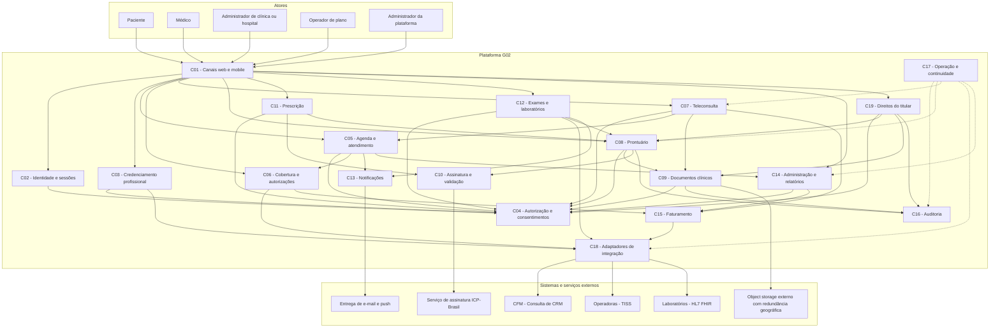
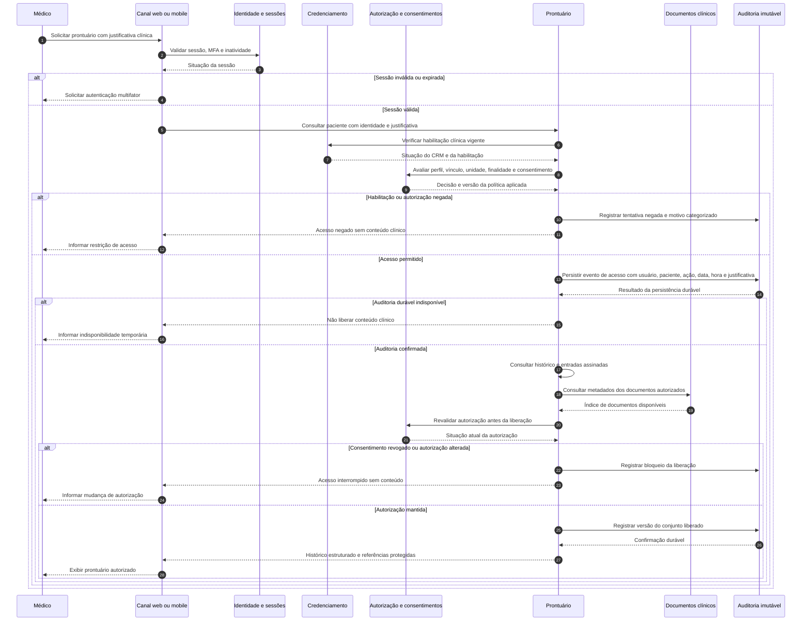
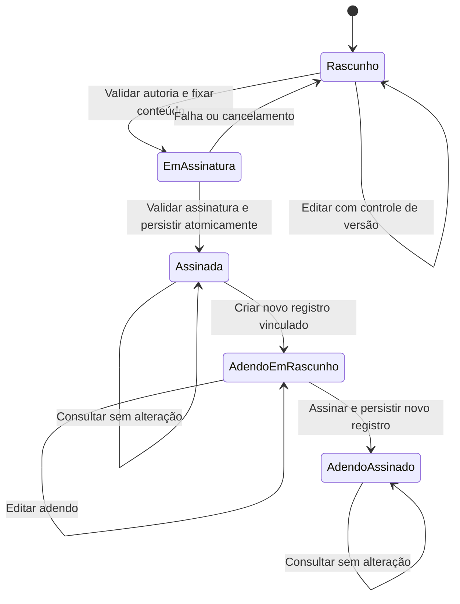

# Relatório Técnico de Arquitetura de Software

**Plataforma:** Plataforma Integrada de Saúde Digital — Telemedicina (G02)  
**Equipe:** AI4ES — Time 2  
**Base analisada:** 46 requisitos funcionais, 26 requisitos não funcionais e 14 histórias de usuário.  
**Natureza do relatório:** arquitetura lógica, tecnologicamente neutra, com decisões propostas e pendências de validação.

## 1. Identificação das HUs

As histórias são unidades de valor e validação funcional. RFs e RNFs continuam sendo fontes normativas independentes: ausência de HU não significa exclusão de requisito.

| HU | Perfil | Objetivo arquitetural | RFs relacionados | Critérios de aceite relevantes |
|---|---|---|---|---|
| HU01 | Paciente | Cadastro e gestão do consentimento | RF01, RF03, RF04, RF23 | Dados pessoais e plano; consentimento explícito com data/hora; consulta e revogação |
| HU02 | Paciente | Agendamento presencial ou remoto | RF07–RF09, RF11 | Agenda em tempo real; cobertura antes da confirmação; e-mail e push com informações e acesso |
| HU03 | Paciente | Participação segura em teleconsulta | RF14–RF18 | Ingresso habilitado cinco minutos antes; E2EE; ausência de gravação; compartilhamento de arquivos |
| HU04 | Paciente | Acesso ao histórico e aos resultados | RF19, RF21–RF24, RF33 | Histórico integrado; download em PDF; compartilhamento clínico condicionado a consentimento |
| HU05 | Paciente | Acesso e compartilhamento de prescrições | RF27, RF29, RF30 | Assinatura verificável; QR Code; link/PDF; identificação do receituário |
| HU06 | Paciente | Comunicação da disponibilidade de exames | RF31–RF33 | Push e e-mail; identificação de exame/laboratório; resultado acessível quando notificado |
| HU07 | Médico | Credenciamento e manutenção da habilitação | RF01, RF02 | CRM ativo; bloqueio clínico; retorno em até 24 horas; revalidação periódica |
| HU08 | Médico | Registro clínico assinado e imutável | RF20, RF25 | Anamnese, CID e plano; autoria/data/hora; assinatura; apenas adendos posteriores |
| HU09 | Médico | Prescrição com assinatura e validações clínicas | RF26–RF30 | ICP-Brasil; interações medicamentosas; receituário especial; vínculo automático ao prontuário |
| HU10 | Médico | Solicitação de exames e tratamento de resultados críticos | RF31, RF32, RF34, RF35 | Encaminhamento eletrônico; notificações; destaque do parâmetro crítico |
| HU11 | Médico | Acesso autorizado ao prontuário compartilhado | RF06, RF19, RF22, RF23 | Consentimento explícito; histórico autorizado; auditoria com justificativa clínica |
| HU12 | Administrador de clínica/hospital | Gestão de médicos e agendas | RF12, RF42, RF43 | Grades e tipos de atendimento; ocupação; notificação das mudanças; preservação das consultas confirmadas |
| HU13 | Administrador de clínica/hospital | Acompanhamento financeiro | RF40, RF41, RF44 | Valores faturados/enviados/autorizados e glosas; filtros; exportação CSV/PDF |
| HU14 | Operador de plano | Autorização prévia interoperável | RF38, RF39 | TISS vigente; autorização/negativa em até 30 minutos; código e justificativa de negativa |

**Critérios que ampliam o detalhamento dos RFs:** revogação de consentimento, QR Code, revalidação periódica de CRM, justificativa clínica de acesso externo, gestão de glosas e exportação de relatórios devem entrar no backlog com a mesma rastreabilidade das demais funcionalidades.

**Capacidades sem HU própria:** encerramento de sessão, cancelamento/remarcação, encaixe urgente, gestão de planos/TUSS, elegibilidade antes de cada atendimento, gestão de salas/equipamentos, painel da plataforma e portabilidade. Essas capacidades permanecem no escopo.

## 2. Diagramas de Arquitetura (Mermaid)

### 2.1. Visão lógica de componentes

Os componentes representam responsabilidades e interfaces. Não determinam quantidade de serviços, processos ou tecnologias de implantação.

**Convenções e restrições transversais:**

- Toda interface clínica exige identidade válida e autorização no servidor; as setas não autorizam acesso direto às persistências.
- Cada domínio é proprietário de seus dados. Compartilhamento ocorre por interfaces de consulta/comando ou eventos controlados.
- C16 recebe auditoria de todos os componentes que acessam ou alteram informações clínicas; algumas ligações foram omitidas para legibilidade.
- C17 observa todos os componentes, sem replicar dados clínicos em métricas ou logs operacionais.
- A mídia da teleconsulta utiliza um plano de transporte separado das APIs e mantém as chaves de conteúdo nos terminais autorizados.

### 2.2. Sequência completa: consulta autorizada ao prontuário compartilhado

O fluxo contempla autenticação, habilitação profissional, consentimento, trilha durável e indisponibilidade da auditoria. Cada download posterior de documento constitui uma nova operação autorizada e auditada.

**Limite semântico:** o evento registra acesso concedido e conteúdo liberado pela plataforma; não prova que o usuário leu ou compreendeu todas as informações.

### 2.3. Estados da entrada clínica

A transição para adendo representa a criação de outra entidade. A entrada original permanece assinada e imutável; não é substituída nem reaberta.

## 3. Decisões de Arquitetura

As decisões abaixo constituem a proposta de referência. Pontos dependentes de validação externa estão identificados na Seção 5.

### DA01 — Arquitetura modular orientada ao domínio

**Decisão:** separar identidade, consentimento, agenda, teleconsulta, prontuário, prescrição, exames, cobertura e faturamento por contratos explícitos.

- Não exigir distribuição física de todos os módulos desde o início.
- Permitir implantação e escalonamento independentes onde carga, criticidade ou isolamento justificarem.
- Proibir escrita direta de um domínio na persistência de outro.
- Distinguir comandos, consultas e eventos de negócio.

**Justificativa:** reduz acoplamento e permite evolução incremental sem prescrever produtos ou um estilo de implantação excessivamente distribuído.

**Origem:** RF01–RF46; RNF17, RNF25, RNF26.

### DA02 — Identidade forte e autorização contextual

**Decisão:** autenticação multifator para todos os perfis, com suporte a OTP e biometria mobile conforme o requisito.

- A biometria local deve ativar uma credencial vinculada ao dispositivo; um simples sinal de “biometria aprovada” enviado pelo cliente não é suficiente.
- Senhas protegidas por bcrypt ou Argon2.
- Sessões com limite de inatividade configurável por perfil e invalidação efetiva no servidor.
- Autorização por combinação de perfil, permissões, unidade, vínculo assistencial, paciente, finalidade e consentimento.
- Administradores e operadores não recebem acesso clínico global por consequência do cargo.
- CRM não validado, inativo ou suspenso impede atuação clínica.

**Consequência:** interfaces devem distinguir identidade autenticada de autorização para cada operação. Recuperação de conta e troca de fatores precisam de critérios próprios.

**Origem:** RF01–RF05, RF23; RNF03, RNF05; HU01, HU07, HU11.

### DA03 — Consentimento versionado e governança por finalidade

**Decisão:** manter um registro de consentimentos com titular, finalidade, escopo, destinatários, versão do termo, data/hora e evidência da manifestação.

- Separar consentimento de tratamento, consentimento de compartilhamento clínico e autorização temporária de compartilhamento documental.
- Associar cada finalidade à base legal aplicável do art. 11 da LGPD.
- Revogação invalida futuras concessões baseadas naquele consentimento, inclusive permissões em cache.
- Revogação não implica apagar automaticamente registros sujeitos a dever de guarda.
- O prontuário único é uma identidade clínica lógica por paciente, não uma permissão universal entre organizações.

**Consequência:** o catálogo de finalidades, bases legais e políticas precisa de aprovação do responsável por privacidade e da governança clínica.

**Origem:** RF19, RF23, RF24; RNF07, RNF12; HU01, HU04, HU11.

### DA04 — Consistência forte para agenda e confirmação

**Decisão:** confirmar agendamentos com reserva temporária de horário, prevenção de conflitos e operação idempotente.

- A agenda em tempo real é uma projeção de disponibilidade; a confirmação revalida o horário na fonte autoritativa.
- Cobertura, elegibilidade e autorização prévia são conceitos distintos.
- Cobertura é verificada antes da confirmação; elegibilidade é novamente verificada antes de cada atendimento.
- Quando necessária, autorização prévia condiciona a confirmação ou liberação conforme regra a aprovar.
- Timeout externo não equivale a cobertura aprovada.
- Cancelamento/remarcação respeitam prazo configurado; remarcação não deve perder a consulta original antes da confirmação do novo horário.
- Alteração da grade não remove consultas confirmadas.
- Encaixe urgente exige regra explícita sobre sobreposição e uso de recursos.

**Origem:** RF07–RF13, RF37, RF39, RF45; HU02, HU12.

### DA05 — Integrações resilientes e eventos duráveis

**Decisão:** encapsular CFM, laboratórios, operadoras, assinatura e entrega de mensagens por adaptadores.

Interfaces conceituais incluem:

- `ConsultarSituacaoCRM`;
- `VerificarCobertura` e `VerificarElegibilidade`;
- `SolicitarAutorizacao` e `ReceberDecisaoAutorizacao`;
- `EnviarSolicitacaoExame` e `ReceberResultadoExame`;
- `TransmitirFaturamento` e `ReceberRetornoFaturamento`.

**Garantias:**

- Contratos versionados, autenticação de parceiros e validação de mensagens.
- Identificadores de correlação e idempotência.
- Retentativas limitadas, isolamento de falhas, mensagens rejeitadas em quarentena e reconciliação.
- Eventos registrados de forma durável junto à mudança de estado que os originou.
- Consumidores tolerantes a duplicidade e reordenação; não presumir entrega “exatamente uma vez”.
- Resultados somente geram notificação após estarem vinculados e acessíveis.
- Associações ambíguas de paciente/exame não são concluídas automaticamente.

**Origem:** RF02, RF09, RF11, RF31–RF40; RNF14, RNF26; HU06, HU07, HU10, HU14.

### DA06 — Teleconsulta com E2EE real e sem gravação

**Decisão:** separar sinalização, transporte de mídia e metadados de duração.

- Clientes autenticados recebem autorização restrita à consulta e aos participantes.
- Botão de ingresso habilitado cinco minutos antes; lembrete cinco minutos antes do início, conforme HU03.
- Mídia cifrada nos terminais; intermediários não possuem chaves para decifrar conteúdo.
- Não realizar gravação, transcrição ou captura do conteúdo audiovisual pela plataforma.
- Medir duração por eventos de participação e estado da sessão, sem inspecionar mídia.
- Compartilhamento transitório durante a chamada deve manter confidencialidade entre participantes.
- Incorporação de documentos ao prontuário é uma operação distinta, explícita e auditada.

**Consequência:** qualquer topologia ou dispositivo que exija decifrar mídia no servidor é incompatível com RNF04. Recursos de diagnóstico não podem coletar conteúdo da chamada.

**Origem:** RF14–RF18; RNF04, RNF16, RNF22; HU03.

### DA07 — Prontuário imutável e auditoria segregada

**Decisão:** distinguir rascunhos editáveis, entradas assinadas e adendos independentes.

- Assinatura vincula autor, conteúdo exato, versão, data/hora e evidências de validação.
- Finalização verifica se o conteúdo continua igual ao que foi assinado.
- Entradas assinadas não podem ser sobrescritas ou excluídas pelas interfaces comuns.
- Auditoria contém ator, paciente, organização, ação, instante, resultado, finalidade e justificativa quando exigida.
- Registrar consultas, downloads, exportações, alterações, assinaturas e tentativas negadas.
- Persistência da auditoria com proteção contra alteração, segregação administrativa e verificação de integridade.
- Acesso clínico exige registro durável antes da liberação; indisponibilidade do painel de consulta da auditoria não deve impedir sua ingestão.
- Retenção mínima de 20 anos para a trilha, conforme RNF11, sujeita à validação normativa e à definição do marco inicial.

**Origem:** RF06, RF19–RF25; RNF08, RNF10, RNF11; HU08, HU11.

### DA08 — Prescrição e segurança clínica

**Decisão:** prescrição passa por validações clínicas e regulatórias antes da assinatura ICP-Brasil.

- Verificar interações medicamentosas antes da confirmação.
- Exigir tipo de receituário e dados obrigatórios para medicamentos de controle especial.
- Não emitir prescrição como válida quando a assinatura falhar.
- Vincular a versão assinada ao prontuário de forma idempotente e reconciliável.
- Gerar PDF e QR Code vinculados ao artefato assinado.
- Link de validação comprova autenticidade sem expor desnecessariamente dados clínicos.
- Link de compartilhamento usa autorização própria, escopo restrito e prazo a definir.
- Regras de alerta, bloqueio e justificativa de sobreposição clínica dependem de governança médica.

**Limite:** a arquitetura fornece mecanismos para atendimento normativo; não certifica, por si só, a validade de qualquer modalidade de receituário.

**Origem:** RF26–RF30; RNF06, RNF08; HU05, HU09.

### DA09 — Interoperabilidade clínica e financeira versionada

**Decisão:** manter modelos internos independentes dos formatos externos, com tradução controlada.

- Laboratórios: HL7 FHIR, com perfis, terminologias e versões acordados.
- Operadoras: TISS e tabelas TUSS vigentes, com histórico das versões utilizadas.
- Preservar identificadores externos, unidades, referências, proveniência e correções.
- Resultados retificados geram nova versão rastreável, sem apagar evidências anteriores.
- Autorizações, negativas, guias, lotes de faturamento e glosas possuem estados e protocolos próprios.
- Alertas críticos dependem de parâmetros clínicos validados, incluindo unidade e contexto.

**Origem:** RF20, RF31–RF40; RNF09, RNF26; HU10, HU13, HU14.

### DA10 — Proteção documental e direitos do titular

**Decisão:** documentos e imagens em object storage externo, criptografados com AES-256 e redundância geográfica.

- Separar metadados clínicos de arquivos binários.
- Gerenciar chaves com controle de acesso, rotação e recuperação compatível com a retenção.
- Não expor arquivos por endereços públicos permanentes.
- Autorizar e auditar cada acesso, inclusive por referência temporária.
- Validar integridade, tipo de arquivo e conteúdo potencialmente malicioso no fluxo de incorporação.
- Exportações do titular abrangem dados estruturados e documentos autorizados; PDF não é considerado, isoladamente, solução completa de portabilidade.
- Downloads deixam de estar sob controle técnico da plataforma após a entrega legítima; comunicar esse limite.

**Origem:** RF17, RF21, RF24, RF29, RF33; RNF02, RNF12, RNF18; HU04, HU05.

### DA11 — Disponibilidade, escalabilidade e recuperação

**Decisão:** executar produção em múltiplas zonas e manter estratégia adicional de recuperação geográfica.

- Múltiplas zonas protegem contra falhas zonais, mas não equivalem necessariamente a regiões geográficas independentes.
- Escalonar horizontalmente APIs, consumidores e capacidade de transporte conforme carga.
- Usar redundância, verificação de saúde e remoção de instâncias defeituosas.
- Backup contínuo com recuperação pontual, RPO máximo de uma hora e RTO máximo de quatro horas.
- Incluir dados clínicos, objetos, auditoria, configurações e material necessário à recuperação das chaves.
- Testar restauração; replicação não substitui backup.
- Isolar relatórios e processamentos pesados dos caminhos clínicos interativos.

**Alerta:** RTO de quatro horas não autoriza quatro horas mensais de indisponibilidade. A disponibilidade de 99,9% permite aproximadamente 43,2 minutos em um mês de 30 dias; alta disponibilidade deve tratar falhas comuns sem recorrer à recuperação completa.

**Origem:** RNF13, RNF17, RNF18, RNF23–RNF25.

### DA12 — Experiência, acessibilidade e observabilidade verificáveis

**Decisão:** canais web responsivos e aplicativos iOS/Android com política explícita de compatibilidade.

- Atender WCAG 2.1 AA, incluindo MFA, consentimento, documentos e ingresso na consulta.
- Ingresso em até dois cliques a partir da tela inicial, considerando o contexto de autenticação a validar.
- TLS 1.2 ou superior nas comunicações cliente-servidor.
- Medir latência, erros e disponibilidade por módulo, além de filas, entrega de notificações e saúde das integrações.
- Rate limiting por contexto e detecção de acessos anômalos ao prontuário.
- Métricas e logs operacionais não devem conter conteúdo clínico, senhas, tokens ou chaves.

**Origem:** RF03, RF15, RF46; RNF01, RNF05, RNF19–RNF22, RNF25.

## 4. Tabela de Componentes e Rastreabilidade

| Componente | Responsabilidade Principal | Comunica-se com | Origem (HU / Critério de Aceite) |
|---|---|---|---|
| **C01 — Canais web e mobile** | Jornadas por perfil, acessibilidade, MFA, visualização, download e ingresso na consulta | C02–C08, C11, C12, C14, C19 | HU01–HU14: interfaces das jornadas; HU03: ingresso; HU04/HU05: downloads; RNF19–RNF22 |
| **C02 — Identidade e sessões** | Cadastro de identidade, fatores, credenciais, sessão e inatividade | C01, C03, C04, C16 | HU01: cadastro; HU07: cadastro médico; RF01, RF03–RF05 complementam critérios |
| **C03 — Credenciamento profissional** | Validar CRM, manter habilitação, revalidar e bloquear atuação clínica | C02, C04, C13, C14, C18 | HU07: CRM ativo, retorno em 24 horas e revalidação; RF02 |
| **C04 — Autorização e consentimentos** | Decidir acesso contextual; registrar, consultar e revogar consentimentos | C02, C03 e todos os domínios protegidos | HU01: consentimento e revogação; HU04/HU11: compartilhamento autorizado; RF04, RF23, RF24 |
| **C05 — Agenda e atendimento** | Disponibilidade, reserva, confirmação, cancelamento, remarcação, encaixe e início do atendimento | C04, C06, C07, C13–C15, C16 | HU02: agendamento; HU12: grade preservando consultas; RF10 e RF13 sem HU específica |
| **C06 — Cobertura e autorizações** | Planos/TUSS, cobertura, elegibilidade, guias e autorização prévia | C04, C05, C12, C15, C18 | HU02: cobertura; HU14: TISS, prazo e negativas; RF36–RF39 |
| **C07 — Teleconsulta** | Controle de ingresso, sinalização, mídia E2EE, compartilhamento transitório e duração | C01, C04, C05, C09, C13, C15, C16 | HU03: chamada integrada, cinco minutos, E2EE e documentos; RF14–RF18 |
| **C08 — Prontuário** | Identidade clínica do paciente, histórico, registros, assinatura e adendos | C04, C09–C12, C16, C19 | HU04: histórico; HU08: entrada imutável; HU09: vínculo da prescrição; HU11: acesso compartilhado |
| **C09 — Documentos clínicos** | Conteúdo binário, metadados, integridade, criptografia, incorporação e acesso protegido | C04, C07, C08, C10–C12, C16, C19, object storage | HU03: compartilhamento; HU04: PDF; HU05: prescrição; HU06: resultado acessível; RNF02, RNF18 |
| **C10 — Assinatura e validação** | Assinar conteúdo fixado, verificar certificados e disponibilizar evidências de autenticidade | C08, C09, C11, serviço de assinatura | HU08: assinatura de entrada; HU09: ICP-Brasil; HU05: QR Code; RF25, RF27 |
| **C11 — Prescrição** | Medicamentos/exames/procedimentos, interações, receituário e compartilhamento | C04, C08–C10, C12, C16 | HU05: PDF/link/receituário; HU09: validações, assinatura e vínculo; RF26–RF30 |
| **C12 — Exames e laboratórios** | Solicitações, recebimento, associação, versionamento e alertas críticos | C04, C06, C08, C09, C11, C13, C18 | HU06: publicação anterior à notificação; HU10: encaminhamento e parâmetro crítico; RF31–RF35 |
| **C13 — Notificações** | E-mail/push, lembretes, preferências, tentativas, status e minimização de conteúdo | C03, C05, C07, C12, C14, canais externos | HU02/HU03: confirmação e lembrete; HU06/HU10: resultados; HU07: CRM; HU12: mudanças |
| **C14 — Administração e relatórios** | Organizações, vínculos, especialidades, salas/equipamentos e indicadores gerenciais | C03–C05, C15, C17 | HU12: unidade e ocupação; HU13: filtros e CSV/PDF; RF42–RF46 |
| **C15 — Faturamento** | Cobrança particular/coparticipação, duração faturável, lotes TISS, retornos e glosas | C05–C07, C14, C18 | HU13: valores e glosas; RF16, RF40, RF41 |
| **C16 — Auditoria** | Trilha durável e imutável, pesquisa autorizada e evidências de integridade | Todos os domínios protegidos, C17 | HU08: autoria/data/hora; HU11: acesso e justificativa; RF06; RNF11 |
| **C17 — Operação e continuidade** | Métricas, alertas, anomalias, capacidade, backups, restauração e contingência | Todos os componentes e C14 | Sem HU própria; RF46; RNF05, RNF13–RNF18, RNF23–RNF25 |
| **C18 — Adaptadores de integração** | Traduzir contratos externos, validar mensagens, controlar timeout, retentativas e reconciliação | C03, C06, C12, C15, CFM, operadoras e laboratórios | HU07: CFM; HU10: laboratório; HU14: TISS; RNF26 |
| **C19 — Direitos do titular** | Acesso, exportação portátil e acompanhamento de solicitações, respeitando guarda legal | C01, C04, C08, C09, C16 | HU01: gestão de consentimento; HU04: acesso; RNF12 sem HU integral de portabilidade |

## 5. Bloqueios e Pendências

Não há impedimento para iniciar modelagem, contratos e protótipos. Entretanto, os pontos abaixo bloqueiam a validação de determinadas garantias ou sua liberação em produção.

| ID | Bloqueio ou pendência | Impacto | Responsável recomendado | Condição de resolução |
|---|---|---|---|---|
| BP01 | Acesso oficial ao CFM: contrato, disponibilidade, limites e significado dos retornos não fornecidos | Validação e revalidação do CRM podem não cumprir HU07 | Integrações e credenciamento | Contrato e ambiente de homologação; periodicidade e política de indisponibilidade aprovadas |
| BP02 | Perfis HL7 FHIR, versões TISS/TUSS e particularidades dos parceiros indefinidos | Interoperabilidade não pode ser demonstrada apenas com o nome do padrão | Integrações e parceiros | Matriz de versões, exemplos, identificadores, terminologias e testes de contrato |
| BP03 | SLA externo para elegibilidade em cinco segundos e autorização em 30 minutos não contratado | A plataforma não controla o tempo de resposta da operadora | Produto e relacionamento com operadoras | Acordos, orçamento de latência, monitoramento e estados de timeout aprovados |
| BP04 | Catálogo de finalidades, bases legais e política de acesso do paciente incompletos | Risco de acesso indevido ou restrição injustificada de direitos | Privacidade, jurídico e governança clínica | Políticas versionadas e matriz de autorização aprovadas |
| BP05 | Modelo de assinatura de entradas clínicas e regras vigentes para receituários especiais não detalhados | Imutabilidade técnica pode não satisfazer exigências probatórias/regulatórias | Jurídico, governança clínica e segurança | Perfil de assinatura, validação temporal, modalidades permitidas e fornecedor homologado |
| BP06 | E2EE em todos os clientes e condições de rede ainda não demonstrada | Risco de incompatibilidade com RNF04/RNF16 | Segurança e equipe de comunicação | Prova de conceito multiplataforma e teste de ausência de acesso ao conteúdo por intermediários |
| BP07 | Fonte e governança das interações medicamentosas e valores críticos ausentes | Alertas podem ser incorretos, desatualizados ou sem significado clínico | Governança clínica | Fonte autorizada, atualização, regras por contexto e validação clínica |
| BP08 | Política de retenção por classe de dado e localização geográfica não definida | Afeta guarda, exportação, backup, custos e transferências internacionais | Jurídico, privacidade e operação | Tabela de temporalidade, regiões permitidas e marco de retenção aprovados |
| BP09 | Escala, volume de prontuário e método de aferição dos RNFs indefinidos | Não é possível provar capacidade nem metas de desempenho | Produto, arquitetura e qualidade | Perfil de carga, dataset, redes/dispositivos e protocolo de medição |
| BP10 | Relação entre MFA, sessão expirada e ingresso em dois cliques indefinida | RNF22 pode conflitar com autenticação obrigatória em alguns estados | Produto, segurança e experiência | Jornada aprovada por estado de sessão, sem redução dos controles de segurança |
| BP11 | “Imediatamente” nas notificações sem definição mensurável; conteúdo de exame em push/e-mail expõe informação sensível | Aceite ambíguo e risco de privacidade em dispositivos/canais externos | Produto e privacidade | Limite entre publicação, envio e entrega; política de pré-visualização e conteúdo |
| BP12 | Escopo de certificação SBIS e atualização do inventário normativo não confirmados | Não permite declarar conformidade certificada | Compliance e qualidade | Matriz normativa vigente, requisitos de certificação e plano de evidências |

**Comportamentos conservadores propostos enquanto houver falha operacional:**

- CRM sem validação inicial: conta pode permanecer cadastrada, mas sem acesso clínico.
- Cobertura ou elegibilidade desconhecida: não registrar aprovação fictícia; manter pendência e informar indisponibilidade.
- Assinatura indisponível: manter rascunho, sem apresentar documento como assinado.
- Associação laboratorial ambígua: quarentena e reconciliação, sem vínculo automático.
- Auditoria durável indisponível: bloquear liberação clínica até recuperação do mecanismo.
- Nenhuma exceção de emergência ao consentimento é presumida pelos requisitos atuais.

## 6. Cobertura de Requisitos

### 6.1. Requisitos funcionais

“Coberto” nesta seção significa **responsabilidade e tratamento arquitetural identificados**, não implementação concluída nem teste aprovado.

| Requisitos | Componentes | Tratamento arquitetural e evidência esperada |
|---|---|---|
| RF01–RF05 | C01–C04 | Cadastro por perfil, CRM, MFA, autorização e inatividade; testes positivos/negativos por perfil e sessão |
| RF06 | C08, C09, C16 | Auditoria de cada acesso, inclusive documentos; teste de completude, integridade e falha do destino durável |
| RF07–RF10 | C05, C06, C18 | Reserva e confirmação atômica, cobertura, cancelamento/remarcação; testes de concorrência, prazo e timeout |
| RF11–RF13 | C05, C13, C14 | Notificações, grade e encaixe; testes de preservação de consultas e entrega por canal |
| RF14–RF18 | C01, C05, C07, C09, C13, C15 | Chamada integrada, ingresso, duração, arquivos e alerta; testes de autorização, E2EE e horários |
| RF19–RF22 | C08, C09, C11, C12 | Prontuário lógico único, registros e histórico; testes de associação do paciente e composição clínica |
| RF23–RF25 | C04, C08, C10, C16 | Consentimento, acesso do titular e imutabilidade; testes de revogação e tentativa de alteração após assinatura |
| RF26–RF30 | C09–C11 | Prescrição, ICP-Brasil, interações, compartilhamento e receituário; validação de assinatura e regras clínicas |
| RF31–RF35 | C08, C09, C12, C13, C18 | Exames, integração, publicação, download e criticidade; testes de duplicidade, correção e alerta |
| RF36–RF39 | C05, C06, C12, C18 | Planos/TUSS, elegibilidade antes do atendimento, guias e autorização; homologação com operadoras |
| RF40–RF41 | C06, C15, C18 | Faturamento TISS e cobrança por atendimento; reconciliação de valores e retornos |
| RF42–RF45 | C03, C05, C14, C15 | Organizações, profissionais, relatórios e recursos; testes de isolamento por unidade e exportação |
| RF46 | C14, C17 | Painel operacional restrito ao perfil autorizado; validação de atualização e disponibilidade por módulo |

### 6.2. Requisitos não funcionais

| RNF | Alocação | Estratégia e forma de verificação |
|---|---|---|
| RNF01 | C01 e interfaces externas | TLS 1.2 ou superior; inspeção de configuração e testes de negociação |
| RNF02 | C08, C09, C16, C17 | AES-256 para dados clínicos em repouso, incluindo cópias; evidências de criptografia e gestão de chaves |
| RNF03 | C02 | bcrypt ou Argon2; revisão dos parâmetros e testes de segurança |
| RNF04 | C01, C07 | E2EE sem gravação; comprovar que intermediários não decifram mídia |
| RNF05 | C02, C04, C16, C17 | Limitação de requisições e detecção de anomalias; simulações de abuso e resposta operacional |
| RNF06 | C10, C11 | Assinatura ICP-Brasil; validação de cadeia, titularidade, integridade e situação do certificado |
| RNF07 | C04, C19 e todos os domínios | Matriz finalidade/base legal, minimização e governança; revisão de privacidade |
| RNF08 | C03, C07, C08, C10, C11 | Matriz de controles vinculada às normas vigentes; homologação clínica e jurídica |
| RNF09 | C06, C15, C18 | TISS versionado; validação estrutural e homologação de mensagens |
| RNF10 | C08–C10, C16 | Controles e evidências para prontuário e certificação SBIS; avaliação específica, não presumida |
| RNF11 | C16, C17 | Auditoria imutável e retenção mínima de 20 anos; testes de adulteração, preservação e recuperação |
| RNF12 | C04, C19 | Acesso e portabilidade; testes de completude, autorização e formato de exportação |
| RNF13 | C17 e componentes críticos | Disponibilidade mensal mínima de 99,9%; medição ponta a ponta e exercícios de contingência |
| RNF14 | C06, C18 | Elegibilidade em até cinco segundos; teste ponta a ponta incluindo dependência externa e timeout |
| RNF15 | C08, C09 | Carregamento em até três segundos; teste com tamanho de prontuário e escopo de conteúdo definidos |
| RNF16 | C01, C07 | Mínimo de 720p e latência máxima de 150 ms em rede adequada; ensaios com parâmetros de rede aprovados |
| RNF17 | C05–C18 conforme carga | Escalonamento horizontal; teste de pico, concorrência e ausência de degradação na carga acordada |
| RNF18 | C09, C17 | Object storage externo geograficamente redundante; teste de indisponibilidade de localização |
| RNF19 | C01 | iOS/Android nas duas versões mais recentes; matriz contínua de regressão |
| RNF20 | C01 | Web responsiva em Chrome, Firefox, Safari e Edge; testes de compatibilidade |
| RNF21 | C01 | WCAG 2.1 AA; auditoria automatizada e avaliação manual com tecnologias assistivas |
| RNF22 | C01, C02, C07 | Até dois cliques desde a tela inicial; teste de jornada nos estados de sessão acordados |
| RNF23 | C08, C09, C16, C17 | Backup contínuo, RPO ≤ 1 hora e RTO ≤ 4 horas; restauração cronometrada e verificação de consistência |
| RNF24 | C17 e implantação | Produção multizona; teste de perda de zona; alcance geográfico sujeito à definição adicional |
| RNF25 | C14, C17 | Latência, erros e disponibilidade por módulo em painel em tempo real; validar atualização e alarmes |
| RNF26 | C06, C12, C15, C18 | HL7 FHIR e TISS; testes de contrato, versão e incorporação de parceiro |

**Observações de mensuração:**

- Os limites de cinco segundos, três segundos e 150 ms não foram convertidos em percentis: os requisitos não autorizam essa flexibilização.
- Timeout em cinco segundos evita espera ilimitada, mas não constitui verificação de elegibilidade concluída com sucesso.
- Carregar o índice de documentos não comprova, por si só, carregar o “prontuário completo”. A inclusão de arquivos binários e imagens na meta de três segundos precisa ser definida.
- Métricas de envio, aceite pelo provedor e entrega ao destinatário devem ser separadas.

### 6.3. Síntese da cobertura

| Conjunto | Resultado da alocação arquitetural | Limite da conclusão |
|---|---|---|
| RFs | **46 de 46** possuem componente responsável e estratégia | Regras e contratos pendentes impedem aceite definitivo de algumas capacidades |
| RNFs | **26 de 26** possuem tratamento e estratégia de verificação | Desempenho, conformidade e continuidade exigem evidências de execução |
| HUs | **14 de 14** rastreadas aos componentes | Critérios ambíguos dependem das decisões da Seção 5 |
| Requisitos implementados/testados | **Não aferido** | O lote não contém código, resultados de testes ou evidências operacionais |
| Certificação e conformidade formal | **Não demonstradas** | Dependem de avaliação normativa, documental e técnica competente |

## 7. Gap Analysis

As lacunas a seguir são deficiências reais de especificação. As ações recomendadas refinam o backlog; não introduzem silenciosamente funcionalidades obrigatórias.

| ID | Lacuna de especificação | Impacto arquitetural | Ação recomendada ao time de desenvolvimento |
|---|---|---|---|
| GA01 | Não há regra de identificação unívoca, duplicidade, fusão ou separação de pacientes | Risco de associar exame/prontuário à pessoa errada; afeta o prontuário único | Definir identificadores, matching, revisão manual e operações de correção com auditoria |
| GA02 | Escopo do consentimento e fronteira entre especialidades/unidades não estão operacionalizados | Decisões inconsistentes de acesso e vazamento entre organizações | Criar matriz de acesso com destinatário, especialidade, unidade, finalidade, prazo e revogação |
| GA03 | Atendimento a menores, representantes e pacientes sem capacidade de consentir não foi especificado | Modelo atual pressupõe manifestação pelo próprio titular | Confirmar se esses públicos estão no escopo; se sim, modelar representação, poderes, validade e evidências |
| GA04 | Não existe política de acesso excepcional em urgência | Não é possível presumir quebra de consentimento para encaixe urgente | Decidir formalmente se haverá exceção e seus controles; até aprovação, manter restrições normais |
| GA05 | Prazos de cancelamento/remarcação, faltas, atrasos, sobreposição e prioridade de encaixe ausentes | Agenda e recursos podem assumir regras incompatíveis entre unidades | Elaborar tabela de políticas, estados e exemplos de conflito, incluindo salas/equipamentos |
| GA06 | Não está definido o efeito de cobertura negativa, timeout, coparticipação ou autorização pendente no agendamento | Máquina de estados da consulta permanece incompleta | Definir quando confirmar, aguardar, cancelar ou oferecer atendimento particular com aceite explícito |
| GA07 | “Antes de cada atendimento” não define gatilho nem validade da elegibilidade | Verificação pode ficar desatualizada entre agendamento e consulta | Definir gatilho de pré-atendimento, validade, revalidação e política de indisponibilidade |
| GA08 | Duração faturável não define início, fim, reconexão, ausência ou sessões sobrepostas | Cobrança e auditoria podem divergir | Especificar eventos autoritativos, regras de consolidação e reconciliação da duração |
| GA09 | Destino dos arquivos compartilhados em chamada e limite entre compartilhamento e persistência não estão claros | Pode ocorrer retenção indevida ou perda de documento clinicamente relevante | Separar envio transitório de incorporação ao prontuário; definir consentimento, autoria e retenção |
| GA10 | Nível de assinatura da entrada clínica e preservação de evidências por longo prazo indefinidos | Integridade técnica pode não assegurar verificação futura | Definir formato, política de certificado, evidências temporais e preservação das validações |
| GA11 | Catálogo de medicamentos, severidade das interações e permissão de ignorar alertas ausentes | Motor clínico pode bloquear indevidamente ou permitir risco sem registro | Especificar fonte, atualização, níveis, bloqueios e justificativas com aprovação clínica |
| GA12 | Resultados críticos não têm política de confirmação, escalonamento ou destinatário substituto | Notificação enviada pode não resultar em atenção clínica | Definir responsabilidade, prazo, ciência, escalonamento e tratamento de médico indisponível |
| GA13 | Resultados corrigidos, cancelados ou enviados fora de ordem não têm critérios de aceite | Sobrescrita indevida, duplicidade e notificações contraditórias | Adicionar histórias para versionamento, retificação, proveniência e reconciliação |
| GA14 | Glosas são exigidas em HU13, mas seu ciclo de vida e origem não estão descritos | Relatórios financeiros podem exibir dados incompletos | Especificar recebimento, conciliação, estados e valores; decidir se recurso de glosa está fora ou dentro do escopo |
| GA15 | Segurança de QR Code/link, validade e revogação do compartilhamento não foram definidas | Divulgação de prescrição e dados sensíveis por links reutilizáveis | Separar validação de autenticidade de acesso ao conteúdo; definir token, prazo, escopo e registro de acesso |
| GA16 | Portabilidade não possui formato, prazo, canal ou critérios de completude | Download em PDF pode ser indevidamente tratado como atendimento integral à LGPD | Criar HU própria de exportação com autenticação reforçada, dados estruturados, anexos e trilha |
| GA17 | Não há volumes, concorrência, crescimento, tamanho máximo de prontuário nem definição de “rede adequada” | Dimensionamento e validação de RNF14–RNF17 tornam-se inconclusivos | Criar cenários de qualidade com ambiente, estímulo, resposta e medida; executar testes representativos |
| GA18 | Multizona e redundância geográfica são usados sem definição de domínio de falha | Solução pode sobreviver a uma zona, mas não a desastre regional | Definir locais, distâncias, falhas cobertas, estratégia de recuperação e restrições territoriais |
| GA19 | Retenção de prontuário, documentos, consentimentos, metadados de chamada e backups não está individualizada | Exclusão e recuperação podem violar deveres de guarda ou minimização | Elaborar tabela de temporalidade por classe, marco inicial, suspensão de descarte e expurgo |
| GA20 | Não há fluxo de recuperação de MFA, perda do dispositivo ou múltiplos perfis | Recuperação pode se tornar uma via de contorno da autenticação | Criar histórias e testes de recuperação, revogação de credenciais e troca segura de contexto |
| GA21 | Política de acesso controlado do paciente é genérica | Pode restringir indevidamente informação do titular ou expor conteúdo sem revisão da política | Definir categorias, fundamento de eventual restrição, transparência e procedimento de contestação |
| GA22 | RF18 é menos explícito que HU03 sobre o instante do alerta | Interpretações distintas podem gerar lembrete antes do término em vez do início | Ratificar “cinco minutos antes do início” e definir tolerância, relógio e tratamento de atrasos |
| GA23 | RNF22 não esclarece se autenticação e permissões do dispositivo contam como cliques | Meta de usabilidade pode ser testada de maneira inconsistente | Definir cenários de sessão ativa, expirada, primeiro uso e permissões já concedidas |
| GA24 | Não há HUs específicas para várias funções administrativas e operacionais | RFs podem ficar fora das entregas orientadas exclusivamente por histórias | Criar HUs para RF10, RF13, RF36, RF37, RF45, RF46 e RNF12; derivar critérios verificáveis dos demais controles |

### Encaminhamento recomendado

1. **Antes de consolidar contratos:** resolver identidade do paciente, consentimento, estados de agenda/atendimento e contratos de parceiros.
2. **Antes de implementar caminhos clínicos críticos:** aprovar assinatura, regras medicamentosas, resultados críticos e auditoria durável.
3. **Antes de homologar:** demonstrar E2EE, interoperabilidade, acessibilidade, segurança e desempenho com cenários definidos.
4. **Antes da produção:** concluir avaliação normativa, ensaios de recuperação, medição de disponibilidade e aceite das pendências de risco.

**Conclusão:** o lote possui alocação arquitetural integral e permite iniciar desenvolvimento incremental. A liberação produtiva deve depender de critérios mensuráveis, contratos externos homologados e evidências de segurança, conformidade e continuidade — não apenas da existência dos componentes descritos.