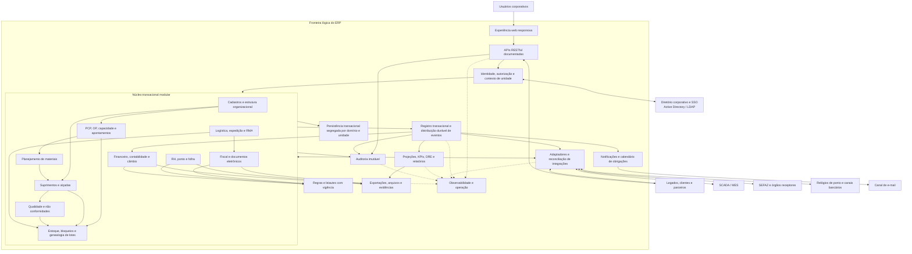
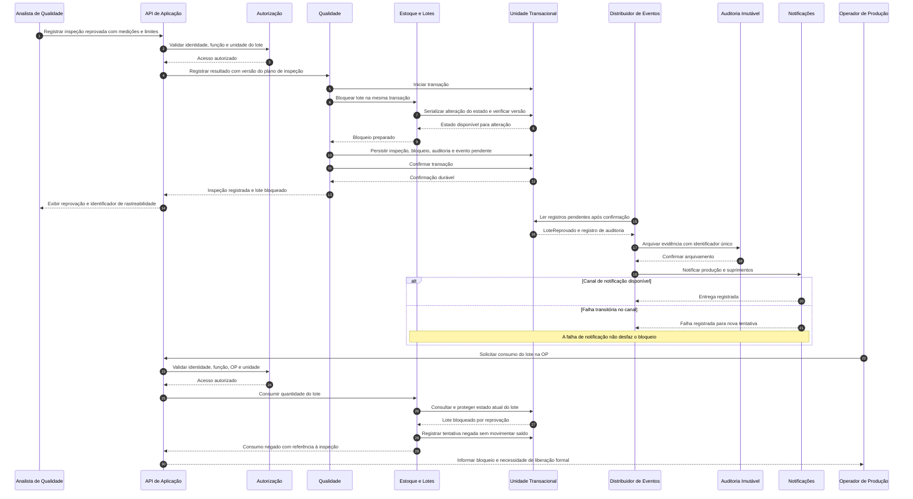
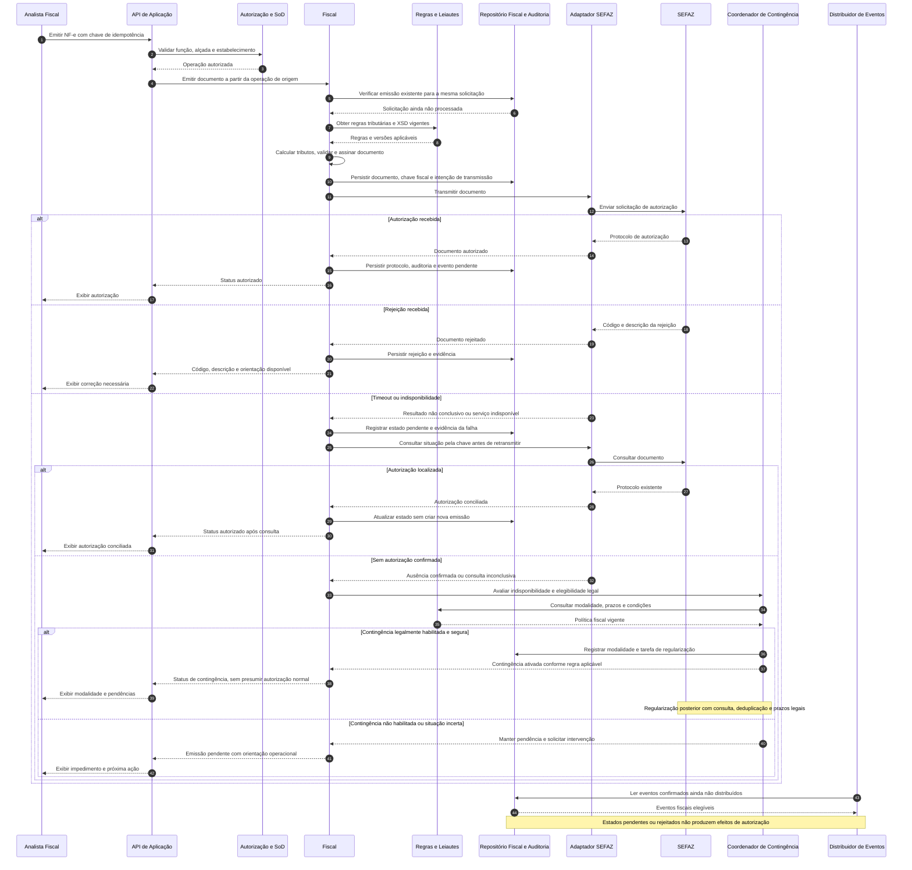

# Relatório Técnico de Arquitetura de Software

## 1. Identificação das HUs

**Sistema:** ERP para Indústria Manufatureira — G03  
**Equipe:** AI4ES — Time 2, Sistema Multi-Agente de Design de Software  
**Escopo analisado:** 53 requisitos funcionais, 24 requisitos não funcionais e 12 histórias de usuário.  
**Natureza do relatório:** arquitetura lógica proposta, tecnologicamente neutra, sujeita à validação das pendências de domínio e dos critérios operacionais.

**Convenções de rastreabilidade**

- `HUxx/CAy` identifica o critério de aceite na ordem em que aparece na história original.
- Componentes representam responsabilidades e contratos lógicos; não implicam processos, produtos ou implantações independentes.
- **Cobertura arquitetural** significa que existe uma responsabilidade e uma estratégia identificadas. Não significa implementação concluída, conformidade jurídica comprovada ou requisito aprovado em teste.
- Decisões adicionais necessárias ao desenho estão identificadas como **propostas**, e não como requisitos originais.

| HU | Perfil | Objetivo e critérios determinantes | RF relacionados | RNF determinantes |
|---|---|---|---|---|
| HU01 | Planejador de produção | Criar OP com roteiro; calcular necessidades líquidas considerando estoque, OPs e compras abertas; gerar solicitações para necessidades descobertas. | RF05–RF07, RF14 | RNF13, RNF16 |
| HU02 | Planejador de produção | Calcular OEE com apontamentos e integração industrial; alertar visualmente e por e-mail; navegar até os apontamentos. | RF08, RF10–RF12, RF50–RF52 | RNF14, RNF18, RNF23 |
| HU03 | Comprador | Enviar cotações; comparar propostas; submeter OC à alçada e notificar aprovador. | RF13, RF15, RF16, RF19 | RNF03, RNF19, RNF20 |
| HU04 | Gestor de suprimentos | Consultar pontualidade, rejeição e preço; filtrar por período, item e categoria; exportar PDF e Excel. | RF19, RF25, RF50, RF53 | RNF14, RNF16 |
| HU05 | Analista de qualidade | Registrar medições e limites; bloquear lote rejeitado até liberação formal; notificar produção e suprimentos. | RF20–RF22, RF24 | RNF03, RNF16, RNF23 |
| HU06 | Analista de qualidade | Rastrear documentos, inspeções, consumo, OPs e clientes; exportar evidências em PDF. | RF09, RF17, RF21, RF23, RF27, RF28, RF31, RF53 | RNF09, RNF10, RNF16 |
| HU07 | Analista fiscal | Calcular tributos; transmitir e obter status em até 30 segundos; explicar rejeições; ativar contingência na indisponibilidade. | RF31, RF32, RF34 | RNF06, RNF07, RNF15, RNF17 |
| HU08 | Analista fiscal | Alimentar escrituração automaticamente; validar arquivos; gerar períodos históricos retidos. | RF36, RF48 | RNF06, RNF08, RNF10 |
| HU09 | Analista de RH | Calcular folha a partir do ponto e tabelas vigentes; gerar remessa salarial e arquivos eSocial. | RF37–RF39, RF42, RF43 | RNF02, RNF08–RNF11 |
| HU10 | Analista de RH | Gerar obrigações aplicáveis; alertar com cinco dias úteis; validar antes do envio. | RF40 | RNF08, RNF09, RNF11 |
| HU11 | Controller | Consultar DRE por centro de custo; distinguir caixa realizado e projetado; detalhar até o lançamento. | RF43–RF47, RF49, RF52 | RNF02, RNF03, RNF14, RNF16 |
| HU12 | Executivo | Consultar KPIs mínimos, metas e variações; filtrar por período e unidade; chegar à origem em até três cliques. | RF10, RF25, RF29, RF45, RF47, RF50–RF52 | RNF14, RNF16, RNF24 |

**Observações de escopo**

1. Autenticação, autorização, auditoria, isolamento entre unidades e operação da plataforma são transversais a todas as HUs.
2. Existem RF sem HU específica, como devoluções a fornecedores, RMA, CT-e, férias e rescisões. Eles permanecem no escopo e recebem componentes responsáveis.
3. Remessa bancária salarial, notificações por e-mail, calendário de cinco dias úteis e limite de três cliques são requisitos expressos nas HUs e devem integrar o backlog, mesmo sem RF dedicado.
4. “Pedidos de venda”, estrutura de produto e outros dados fundamentais são referenciados, mas seus processos de manutenção não estão completamente especificados.

## 2. Diagramas de Arquitetura (Mermaid)

### 2.1. Visão lógica de componentes e integrações

**Estilo proposto:** núcleo transacional modular, interfaces explícitas entre domínios e processamento assíncrono durável para integrações, projeções e trabalhos de longa duração.

A distribuição física dos componentes poderá variar entre ambientes on-premises, nuvem privada e híbridos, sem alterar os contratos de domínio.

**Leitura do diagrama**

- A persistência compartilhada na visão lógica não autoriza escrita direta nas estruturas de outro domínio.
- Consultas executivas utilizam projeções, mas o drill-down acessa a origem mediante nova autorização.
- Adaptadores traduzem protocolos externos; regras de produção, tributação e folha permanecem nos domínios responsáveis.
- A auditoria possui destino e política de retenção próprios. Logs técnicos não substituem evidências de negócio.
- O acesso representado entre componentes pressupõe identidade de serviço, escopo de unidade e proteção das comunicações.

### 2.2. Sequência crítica: reprovação de lote e tentativa posterior de consumo

**Abrangência:** HU05, RF09, RF21, RF22 e RF03.

**Invariante:** após a confirmação da reprovação, nenhum novo consumo ou expedição pode ser confirmado para o lote bloqueado. A inspeção reprovada e o bloqueio são persistidos na mesma fronteira transacional.

**Concorrência e alcance**

- Consumo e expedição verificam o bloqueio no momento da confirmação da movimentação, não apenas na tela ou na reserva.
- Uma movimentação confirmada antes da reprovação não é apagada: a genealogia permite localizar produtos e destinatários afetados.
- Liberação, devolução, descarte e transferência para quarentena precisam de transições autorizadas e auditadas. As exceções à proibição genérica de movimentação ainda dependem de definição de negócio.

### 2.3. Sequência crítica: NF-e, rejeição, resultado incerto e contingência

**Abrangência:** HU07, RF31–RF34, RNF07, RNF15 e RNF17.

A contingência é tratada como uma estratégia fiscal regulamentada e configurada por estabelecimento. Não é presumida a existência de uma modalidade offline genérica válida para toda NF-e modelo 55.

## 3. Decisões de Arquitetura

### ADR-01 — Modularidade por domínio, sem distribuição prematura

**Decisão proposta:** organizar o ERP em domínios com proprietários de dados, contratos de aplicação e vocabulário explícitos. Manter inicialmente um núcleo transacional modular para operações fortemente acopladas.

**Justificativa:** consumo de materiais, bloqueio de lotes, recebimento e expedição exigem consistência rigorosa. Distribuir esses fluxos desde o início adicionaria falhas parciais e coordenação sem evidência de necessidade.

**Consequências:**

- MRP, integrações, relatórios e projeções podem executar em trabalhadores separados.
- Evolução para implantação independente depende de carga, autonomia das equipes e custo de consistência.
- Alterações em um domínio não podem contornar os contratos de outro por acesso direto aos dados.

**Rastreabilidade:** RF05–RF30, RNF13, RNF16, RNF22.

### ADR-02 — Consistência transacional nas invariantes; eventos nos efeitos derivados

**Decisão proposta:**

- Garantir atomicidade para movimentação e saldo de estoque, inspeção reprovada e bloqueio, lançamentos balanceados e registro da intenção de publicação.
- Usar registro de saída transacional para publicar eventos somente após confirmação.
- Admitir entrega de eventos **pelo menos uma vez**, com consumidores idempotentes.
- Aplicar consistência eventual a notificações, indicadores e integrações sem comprometer as invariantes de negócio.

**Contrato mínimo de evento:**

`eventId`, tipo, versão, entidade, versão da entidade, empresa, unidade, instante do fato, instante do registro, correlação, origem e dados mínimos necessários.

**Tratamento de falhas:** retentativas limitadas, tratamento de mensagens não processáveis, reconciliação e reprocessamento controlado. Não se presume processamento distribuído “exatamente uma vez”.

**Rastreabilidade:** RF03, RF09, RF22, RF43, RF45, RF50, RNF23.

### ADR-03 — Isolamento multiunidade aplicado no servidor

**Decisão proposta:** identificar empresa, estabelecimento e unidade nos objetos de negócio e aplicar políticas hierárquicas no acesso transacional, analítico, documental e de integração.

- O contexto de unidade é derivado da identidade autorizada, não aceito livremente do cliente.
- RBAC controla papéis; políticas complementares verificam função, unidade, hierarquia, alçada e SoD.
- Consolidação central exige permissão explícita.
- Exportações, buscas, caches e drill-down preservam as mesmas restrições.
- Transferências entre unidades serão operações explícitas, nunca ajustes informais de escopo.

**Pendência:** decidir se existem empresas juridicamente independentes que exigem isolamento adicional ao de filiais e unidades.

**Rastreabilidade:** RF01, RF04, RNF03, RNF16.

### ADR-04 — Identidade federada e proteção de acesso

**Decisão proposta:** delegar autenticação ao SSO corporativo integrado a Active Directory / LDAP e manter no ERP a autorização funcional e organizacional.

- TLS 1.2 ou superior entre cliente e servidor.
- **Extensão proposta:** proteger também comunicações entre componentes e integrações compatíveis.
- AES-256 em repouso para dados financeiros, fiscais e de RH, incluindo cópias e artefatos derivados.
- Segregar e rotacionar chaves e segredos.
- Aplicar rate limiting e coordenar bloqueios por tentativas malsucedidas com o provedor de identidade.
- Executar revisões de SoD, auditorias de segurança e testes de penetração periódicos.

**Trade-off:** a autenticação depende da disponibilidade do serviço corporativo. Acesso emergencial, se necessário, exige política aprovada.

**Rastreabilidade:** RF01–RF04, RNF01–RNF05, RNF09.

### ADR-05 — Auditoria completa, imutável e minimizada

**Decisão proposta:** registrar identidade humana ou de serviço, data/hora, módulo, ação, unidade, alvo, resultado e correlação. Para alterações relevantes, manter evidências suficientes da transição sem replicar dados pessoais desnecessários.

- Auditar operações de leitura, alteração, exportação, integração e acesso negado.
- Para operações críticas financeiras, fiscais e de RH, persistir a evidência durável junto à confirmação do negócio.
- Arquivar as evidências em armazenamento de retenção imutável, com verificação de integridade e acesso segregado.
- Impedir sucesso de operação crítica se não for possível garantir o registro durável da auditoria.
- Preservar identificadores de usuários desativados sem permitir uso indevido de suas credenciais.

**Ressalva jurídica:** os dez anos de RNF10 são tratados como requisito contratual mínimo de retenção, cuja fundamentação e aplicação por categoria precisam de validação. Não se assume que o Código Tributário Nacional determine genericamente esse prazo para todos os registros citados.

**Rastreabilidade:** RF03, RNF09, RNF10.

### ADR-06 — Regras legais e leiautes com vigência temporal

**Decisão proposta:** versionar regras tributárias, trabalhistas, obrigações, calendários, leiautes e critérios de aplicação por período, estabelecimento e categoria.

Cada cálculo ou arquivo deve manter:

- Dados de entrada e versão das regras utilizadas.
- Data de competência e demais datas relevantes.
- Memória de cálculo e resultado de validação.
- Versão do artefato enviado e resposta do destinatário.
- Distinção entre reprodução histórica e retificação.

**Limites de responsabilidade:**

- Fiscal produz a escrituração fiscal e de contribuições.
- Contabilidade produz ECD.
- A referência à EFD em RF48 reutiliza o responsável fiscal, evitando dois geradores concorrentes.
- Obrigações de RH são habilitadas conforme aplicabilidade legal e período histórico.

**Rastreabilidade:** RF31–RF41, RF48, RNF06–RNF08, RNF11.

### ADR-07 — MRP reproduzível e requisições de compra deduplicadas

**Decisão proposta:** executar MRP como trabalho controlado, com fotografia lógica das entradas, versão do cálculo, progresso e resultado rastreável.

Entradas mínimas:

- OPs abertas e demanda correspondente.
- Estrutura de materiais e roteiros.
- Estoque utilizável, reservas e bloqueios.
- Recebimentos previstos de OCs abertas.
- Prazos, calendários e políticas de lote aplicáveis.

**Saídas:** necessidades líquidas, sugestões e solicitações de compra para necessidades descobertas.

O reabastecimento por ponto de reposição e o MRP devem compartilhar a identificação da necessidade para evitar solicitações duplicadas. Antes da efetivação, alterações de estoque ou demanda posteriores à fotografia precisam ser reconciliadas.

**Meta:** concluir em até dez minutos para 50.000 itens ativos. A validação depende também de profundidade das estruturas, quantidade de OPs e horizonte de planejamento.

**Rastreabilidade:** HU01, RF06, RF14, RNF13.

### ADR-08 — Rastreabilidade baseada em movimentações e transformações

**Decisão proposta:** registrar genealogia explícita entre lotes recebidos, consumos, OPs, lotes produzidos, inspeções, expedições, documentos fiscais e destinatários.

- Suportar relações muitos-para-muitos.
- Tratar fracionamento, mistura, retrabalho e devolução sem sobrescrever a história.
- Manter saldo por item, lote, local e unidade.
- Preservar vínculo entre quantidade, unidade de medida e documento de origem.
- Separar estado de qualidade de saldo físico e disponibilidade para uso.

A consulta deve funcionar nos sentidos origem–destino e destino–origem, retornando evidências exportáveis.

**Rastreabilidade:** HU05, HU06, RF09, RF17, RF20–RF24, RF26–RF30.

### ADR-09 — Adaptadores industriais e tolerância a desconexões

**Decisão proposta:** integrar SCADA/MES por adaptadores configuráveis por unidade, utilizando OPC-UA, MQTT ou REST/JSON conforme os sistemas existentes.

- Normalizar equipamento, operação, OP, turno, unidade e timestamps.
- Deduplicar mensagens e tratar chegada fora de ordem.
- Preservar instante do evento e instante de recebimento.
- Usar armazenamento temporário durável próximo à fábrica quando a conectividade exigir.
- Monitorar atraso, perda, reconciliação e qualidade dos dados.

OEE deve ter fórmula, calendário, tempo de ciclo ideal, classificação de paradas e tratamento de refugos versionados.

**Limite:** o escopo prevê receber dados industriais, não executar comandos de controle em equipamentos.

**Rastreabilidade:** RF08–RF12, RNF18, RNF22.

### ADR-10 — Fiscal resiliente, com estados explícitos e reconciliação

**Decisão proposta:** modelar NF-e e CT-e por máquinas de estado, distinguindo preparação, validação, transmissão, pendência, autorização, rejeição, cancelamento e contingência aplicável.

- Assinatura, schemas, certificados e protocolos pertencem ao ciclo documental.
- Cancelamento e inutilização possuem comandos, prazos e evidências próprios.
- Timeouts não equivalem a rejeição nem provam ausência de autorização.
- Consultar situação antes de retransmitir uma solicitação ambígua.
- Ativar contingência automaticamente apenas quando a modalidade legal e os pré-requisitos estiverem satisfeitos.
- Regularizar pendências com controle de prazo e prevenção de duplicidade.

**Meta de 30 segundos:** instrumentar tempo até transmissão e até status final separadamente. A garantia de autorização depende da resposta externa; o critério HU07/CA2 exige negociação para cenários de atraso da SEFAZ.

**Rastreabilidade:** RF31–RF35, RNF07, RNF15, RNF17.

### ADR-11 — Contabilidade rastreável e consultas executivas desacopladas

**Decisão proposta:** gerar lançamentos a partir de fatos de negócio confirmados e regras contábeis versionadas.

- Cada origem gera efeitos contábeis deduplicados.
- Lançamentos devem permanecer balanceados.
- Correções preservam o histórico por estorno ou ajuste, sem alteração destrutiva de registros consolidados.
- Contas a pagar e receber mantêm títulos, vencimentos, baixas e projeções.
- Câmbio registra moeda original, taxa, data, fonte e moeda funcional.
- DRE, balanço e fluxo de caixa usam projeções reconciliáveis com os lançamentos.

Dashboards exibem instante de atualização, atraso de processamento e pendências relevantes. O drill-down liga cada valor aos fatos e lançamentos que o compõem.

**Trade-off:** carregamento rápido não significa dados instantaneamente consistentes. O atraso máximo aceitável ainda precisa ser definido.

**Rastreabilidade:** HU11, HU12, RF43–RF52, RNF14, RNF16.

### ADR-12 — Operação portátil, observável e recuperável

**Decisão proposta:**

- Manter contratos independentes da modalidade de hospedagem.
- Separar trabalhos longos do atendimento interativo.
- Eliminar pontos únicos de falha nos elementos necessários à disponibilidade acordada.
- Monitorar todos os módulos, integrações, filas de trabalho, auditoria e projeções.
- Executar backup diário com retenção mínima de 90 dias e arquivamento contínuo de WAL para RPO de até uma hora.
- Testar restauração de dados, documentos, configurações e material criptográfico necessário.
- Programar manutenção fora dos turnos produtivos.
- Disponibilizar interface responsiva sem plugins.

**Sinais mínimos:** disponibilidade por unidade, latência, erros, MRP, atraso dos dados industriais, emissão fiscal, pendências de integração, defasagem da DRE, entrega de notificações e sucesso de backups.

**Pendências:** RTO, definição da janela fabril consolidada, comportamento sem conectividade e metas de recuperação por módulo.

**Rastreabilidade:** RNF12–RNF24.

## 4. Tabela de Componentes e Rastreabilidade

| Componente | Responsabilidade Principal | Comunica-se com | Origem (HU / Critério de Aceite) |
|---|---|---|---|
| C01 — Experiência web e APIs de aplicação | Oferecer operações responsivas, validação de entrada, navegação, filtros e APIs RESTful documentadas. | Usuários, parceiros, C02 e componentes de domínio. | Todas as HUs; HU12/CA3–CA4; RF52; RNF19, RNF24. |
| C02 — Identidade e políticas de acesso | SSO, usuários, perfis, autorização por função/unidade, SoD, limitação de acesso e bloqueios coordenados. | Diretório corporativo, C01 e todos os domínios. | Transversal às HUs; RF01, RF02, RF04; RNF01–RNF04, RNF16. |
| C03 — Cadastros e estrutura organizacional | Manter unidades, hierarquias, itens, produtos, centros de trabalho/custo, unidades de medida e referências mestres. | C02, PCP, suprimentos, estoque, RH, fiscal e contabilidade. | HU01/CA1; HU04/CA2; HU11/CA1; RF04, RF05, RF07, RF37, RF44. Cadastros adicionais dependem de detalhamento. |
| C04 — PCP e capacidade | Gerenciar OPs, roteiros, recursos, sequenciamento, capacidade e estados de apontamento. | C03, C05, C07, C08, C17 e C18. | HU01/CA1; HU02/CA1–CA3; RF05, RF07–RF09, RF12. |
| C05 — Motor de MRP | Calcular necessidades líquidas, registrar versões da execução e gerar necessidades descobertas. | C03, C04, C06 e C07. | HU01/CA2–CA3; RF06, RF14; RNF13. |
| C06 — Suprimentos e alçadas | Fornecedores por item, cotações, comparação, OCs, aprovação, recebimento, devoluções e desempenho. | C05, C07, C08, C10, C12, C15 e C18. | HU03/CA1–CA3; HU04/CA1–CA3; RF13–RF19. RF18 sem HU dedicada. |
| C07 — Estoque e genealogia de lotes | Saldos, reservas, movimentações, endereçamento, bloqueios e vínculos entre lotes e documentos. | C04, C06, C08, C09, C10 e C15. | HU05/CA2; HU06/CA1–CA3; RF09, RF17, RF22, RF23, RF26. |
| C08 — Qualidade e NC | Planos versionados, inspeções, reprovações, liberações formais, causa-raiz, ações e custos de não qualidade. | C04, C06, C07, C09, C15 e C18. | HU05/CA1–CA3; HU06/CA1–CA2; HU04/CA1; RF20–RF25. |
| C09 — Logística e RMA | Expedições, volumes, rotas, transportadoras, romaneios, entregas, ocorrências e devoluções de clientes. | Origem de pedidos, C07, C08, C10, C12 e C17. | HU06/CA1–CA2; HU12/CA1; RF27–RF30. RMA sem HU dedicada. |
| C10 — Fiscal e documentos eletrônicos | Tributos, NF-e, CT-e, cancelamento, inutilização, contingência, escrituração fiscal e contribuições. | C06, C09, C12, C14, C16 e C17. | HU07/CA1–CA4; HU08/CA1–CA3; RF18, RF28, RF31–RF36, RF48. CT-e sem HU dedicada. |
| C11 — RH, ponto e folha | Colaboradores, ponto, folha, benefícios, férias, 13º, rescisões, remessas e obrigações aplicáveis. | Relógios, canais bancários, C12, C14, C16–C18. | HU09/CA1–CA3; HU10/CA1–CA3; RF37–RF42. RF41 sem HU dedicada. |
| C12 — Financeiro e tesouraria | Contas a pagar/receber, vencimentos, baixas, projeções e informações cambiais. | C06, C09–C11, C13, C15 e C17. | HU11/CA2; RF47, RF49; integração salarial de HU09/CA3. |
| C13 — Contabilidade e consolidação | Plano de contas, lançamentos automáticos, conciliação, DRE, balanço, fluxo de caixa e ECD. | C10–C12, C14–C17 e C19. | HU11/CA1–CA3; RF43–RF46, RF48, RF49. |
| C14 — Regras, leiautes e calendários | Versionar regras tributárias/trabalhistas, schemas, vigências e prazos por obrigação. | C10, C11, C13, C16 e C18. | HU07/CA1; HU08/CA2–CA3; HU09/CA2; HU10/CA1–CA3; RNF06–RNF08, RNF11. |
| C15 — Projeções analíticas e KPIs | Calcular OEE, desempenho, indicadores, metas, variações, DRE de consulta e linhagem para drill-down. | Domínios via C19, C01 e C16. | HU02/CA1–CA3; HU04/CA1–CA2; HU11/CA1–CA3; HU12/CA1–CA4; RF10, RF25, RF45, RF50–RF52. |
| C16 — Documentos, relatórios e intercâmbio | Gerar PDF, Excel e arquivos XML, CSV, JSON, XLSX; preservar artefatos e resultados de validação. | C06, C08, C10, C11, C13, C15 e C17. | HU04/CA3; HU06/CA3; HU08/CA2–CA3; HU09/CA3; HU10/CA1, CA3; RF53; RNF20. |
| C17 — Adaptadores de integração | Traduzir protocolos, autenticar sistemas, deduplicar mensagens, reconciliar e controlar erros externos. | SCADA/MES, SEFAZ, órgãos, relógios, parceiros, canais bancários e domínios. | HU02/CA1; HU07/CA2–CA4; HU09/CA1, CA3; HU10/CA3; RF11, RF29, RF31, RF35, RF38; RNF18–RNF20. |
| C18 — Notificações e obrigações | Alertas visuais/e-mail, avisos de alçada, reprovação e calendário de cinco dias úteis. | C04, C06, C08, C11, C14, C15 e canal de e-mail. | HU02/CA2; HU03/CA3; HU05/CA3; HU10/CA2; RF12, RF51. |
| C19 — Eventos e trabalhos duráveis | Registrar intenções atomicamente, distribuir eventos, controlar retentativas, deduplicação e reprocessamento. | Todos os domínios, C15, C17, C18 e C20. | Suporte a HU01–HU12; RF09, RF43, RF45, RF50; RNF17, RNF23. |
| C20 — Auditoria e governança de dados | Registrar ações, preservar evidências imutáveis, controlar retenção, acesso, integridade e tratamento de dados pessoais. | C01, C02, domínios, C16, C19 e C21. | Transversal; HU06/CA3; HU08/CA3; RF03; RNF05, RNF09, RNF10. |
| C21 — Persistência, proteção e recuperação | Persistir dados com consistência, criptografia, backup, WAL, restauração e proteção de chaves. | Domínios, C16, C19, C20 e C22. | Transversal; RNF02, RNF12, RNF16, RNF21, RNF22. |
| C22 — Observabilidade e operação | Métricas, logs técnicos, rastreamento de chamadas, alertas operacionais, SLOs e evidências de testes. | Todos os componentes e equipe de TI. | Transversal; RNF05, RNF12–RNF15, RNF23. |

### Contratos de integração relevantes

| Interface conceitual | Contrato e controles |
|---|---|
| Comandos transacionais | Identidade, empresa/unidade, versão esperada, validações de negócio e chave de idempotência quando houver risco de repetição. |
| Consultas e drill-down | Filtros autorizados, paginação, referência à origem, data de atualização e revalidação de acesso ao detalhe. |
| Eventos internos | Envelope versionado, correlação, identificação do fato e segregação por unidade; sem dados pessoais desnecessários. |
| Integração industrial | Protocolo configurado por unidade, identificação do equipamento e da OP, timestamps, qualidade e deduplicação. |
| Integração fiscal | Documento assinado, schema aplicável, protocolo, códigos de rejeição, consulta de situação e regularização. |
| Arquivos e importações | Leiaute e versão, validação estrutural e semântica, relatório de erros por registro e política explícita de aplicação parcial ou integral. |
| Remessa salarial | Competência, identificador da remessa, vínculo com folha aprovada, proteção do arquivo e formato bancário a definir. |

## 5. Bloqueios e Pendências

**Classificação:**  
**Bloqueante:** impede implementação segura ou aceite do fluxo afetado.  
**Alta:** permite desenvolvimento estrutural, mas impede estabilização ou dimensionamento.  
**Média:** necessita definição antes do aceite final.

| ID | Prioridade | Bloqueio ou pendência | Impacto | Responsável sugerido e condição de resolução |
|---|---|---|---|---|
| P01 | Bloqueante | RF34 menciona contingência offline de NF-e modelo 55 sem modalidade, UF e elegibilidade. | Não é possível implementar ativação automática juridicamente válida por uma regra genérica. | Fiscal/jurídico: aprovar matriz de modalidades, estabelecimentos, documentos, prazos e procedimentos. |
| P02 | Bloqueante | RF40/HU10 listam CAGED, RAIS e DIRF sem distinguir períodos históricos, substituições e aplicabilidade vigente. | Risco de gerar obrigação indevida ou leiaute incompatível. | RH/jurídico: definir matriz obrigação × competência × empregador e regras de retificação. |
| P03 | Bloqueante | RF35 exige CT-e para transporte próprio ou terceirizado sem definir emissor e habilitação. | Pode atribuir ao ERP uma emissão que cabe a outro interveniente. | Fiscal/logística: esclarecer cenários, credenciamentos, certificado e responsabilidade do transportador. |
| P04 | Bloqueante | Estruturas de produto, revisões, perdas, conversões e roteiros não estão detalhados. | MRP, capacidade, consumo e genealogia não podem ser validados com precisão. | PCP/engenharia: aprovar modelo mestre e conjuntos de cálculo de referência. |
| P05 | Bloqueante | Alçadas, SoD e liberação formal de lotes não têm matriz de autorização. | Risco de autoaprovação, liberação indevida e conflito de funções. | Controles internos/qualidade: aprovar papéis, limites, exceções e evidências. |
| P06 | Alta | Origem e ciclo de vida de pedidos de venda, clientes e faturamento comercial ausentes. | Expedição, crédito, RMA e receita dependem de dados sem proprietário definido. | Produto/comercial: decidir módulo interno ou integração e formalizar o contrato. |
| P07 | Alta | “Tempo real” não define atraso máximo; desempenho não informa percentis nem concorrência. | Não há teste objetivo de atualização, capacidade ou degradação. | Produto/TI: aprovar SLOs de latência e frescor com cenário de carga. |
| P08 | Alta | HU07 exige autorização em 30 segundos; RNF15 se refere à transmissão. | Critérios distintos e dependência externa tornam o aceite ambíguo. | Fiscal/TI: separar transmissão, resposta, timeout e status pendente. |
| P09 | Alta | Fórmulas de OEE, KPIs, custo industrial e custo da não qualidade incompletas. | Divergência em eficiência, estoque valorizado, margem bruta e DRE. | PCP/qualidade/controladoria: aprovar dicionário de indicadores e política de custeio. |
| P10 | Alta | Retenção de dez anos e LGPD sem classificação, bases legais e política de descarte. | Retenção excessiva ou eliminação indevida de evidências. | Jurídico/privacidade: aprovar tabela de temporalidade e suspensão de descarte. |
| P11 | Alta | RTO, topologia, conectividade por unidade e operação offline não definidos. | Dimensionamento de alta disponibilidade e recuperação permanece aberto. | TI/operações: aprovar cenários de falha e objetivos de recuperação. |
| P12 | Alta | RF32 inclui ISS sem delimitar serviços ou documento fiscal correspondente. | Motor tributário e emissão podem misturar domínios fiscais diferentes. | Fiscal/produto: definir operações com ISS e eventual escopo documental adicional. |
| P13 | Média | Bancos, formatos de remessa, relógios, calendários e canais externos sem contratos. | Adaptadores de folha, ponto e obrigações não podem ser homologados. | RH/tesouraria/TI: fornecer leiautes, exemplos e ambientes de teste. |
| P14 | Média | RF22 bloqueia consumo/expedição, enquanto HU05 fala em impedir movimentação em geral. | Quarentena, devolução e descarte podem ficar indevidamente bloqueados. | Qualidade/logística: aprovar máquina de estados e matriz de movimentos permitidos. |

**Regra de governança:** pendências não devem ser resolvidas silenciosamente por suposições no código. Toda resolução deve atualizar requisito, critério de aceite, contrato, teste e decisão arquitetural afetados.

## 6. Cobertura de Requisitos

### 6.1. Requisitos funcionais

Todos os RF possuem responsável arquitetural. As ressalvas abaixo indicam onde o comportamento ainda depende de especificação.

| Requisitos | Componentes responsáveis | Evidência de cobertura e ressalvas |
|---|---|---|
| RF01, RF02, RF04 | C02, C03 | Usuários, perfis, SSO e políticas por unidade/hierarquia. Matriz detalhada pendente em P05. |
| RF03 | C20, C19, C21 | Registro de todas as operações, confirmação durável e arquivo imutável. Retenção detalhada em P10. |
| RF05, RF07, RF08 | C03, C04 | OP, roteiro, capacidade, sequenciamento e apontamentos; dados mestres em P04. |
| RF06 | C05 | MRP com estoque utilizável, OPs e compras abertas; teste de escala condicionado ao cenário aprovado. |
| RF09 | C04, C07 | Consumo vinculado à OP e atualização transacional do estoque. |
| RF10, RF12 | C04, C15, C18 | OEE, thresholds e alertas; fórmulas e frescor em P07/P09. |
| RF11 | C17, C04 | Ingestão SCADA/MES, normalização e reconciliação. |
| RF13, RF15, RF16 | C06, C18 | Fornecedores, cotações, comparação, OCs e alçadas; P05. |
| RF14 | C05, C06, C07 | Reposição por ponto configurado e solicitações oriundas do MRP com deduplicação. |
| RF17, RF18 | C06, C07, C10 | Recebimento e conferência vinculados à OC; devolução com documento fiscal. |
| RF19 | C06, C15 | Histórico por fornecedor/item/período, alimentado por preço, recebimento e qualidade. |
| RF20, RF21, RF22 | C08, C07 | Planos, medições, status, bloqueio atômico e liberação formal; P05/P14. |
| RF23 | C07, C08, C09, C10 | Genealogia até destinatário e documento fiscal de saída. |
| RF24, RF25 | C08, C15, C16 | Ciclo de NC e relatórios; custo da não qualidade em P09. |
| RF26 | C07 | Estoque de produtos acabados por endereço e unidade. |
| RF27, RF28, RF29 | C09, C10, C17 | Expedição, documentos, transportadoras, rotas e ocorrências; origem do pedido em P06. |
| RF30 | C09, C08, C12 | RMA vinculado à venda, inspeção e encaminhamento para reposição ou crédito; P06. |
| RF31, RF32, RF33 | C10, C14, C17 | NF-e, tributos, cancelamento e inutilização; P08/P12. |
| RF34 | C10, C14, C17, C19 | Contingência e regularização; bloqueio jurídico/operacional em P01. |
| RF35 | C10, C17 | Responsabilidade de CT-e prevista, condicionada a P03. |
| RF36 | C10, C14, C16 | Escrituração fiscal e contribuições a partir das movimentações. |
| RF37, RF38, RF39 | C11, C14, C17 | Cadastro, ponto e folha; contratos externos em P13. |
| RF40 | C11, C14, C16, C18 | Obrigações e calendário; aplicabilidade bloqueada por P02. |
| RF41, RF42 | C11, C14 | Férias, 13º, rescisões, verbas e benefícios por categoria e vigência. |
| RF43, RF44 | C13, C19 | Lançamentos automáticos, regras contábeis e plano de contas configurável. |
| RF45, RF46 | C13, C15 | DRE, balanço e fluxo de caixa; política de custeio e frescor em P07/P09. |
| RF47 | C12 | Títulos a pagar/receber, vencimentos, baixas e projeções. |
| RF48 | C13, C10, C14, C16 | ECD sob contabilidade; EFD sob fiscal, sem duplicar responsabilidade. |
| RF49 | C12, C13 | Moedas, taxas e conversão; fonte e política cambial ainda precisam ser aprovadas. |
| RF50, RF51, RF52 | C01, C15, C18 | Painéis configuráveis, metas, alertas e linhagem até a origem. |
| RF53 | C16 | Exportações PDF e Excel com escopo de acesso preservado. |

### 6.2. Requisitos não funcionais e estratégia de verificação

| RNF | Atendimento arquitetural | Verificação necessária |
|---|---|---|
| RNF01 | C01, C02 e interfaces protegidas por TLS 1.2+. | Testar negociação e rejeição de versões inferiores nas interfaces cliente-servidor. |
| RNF02 | C21 e proteção dos artefatos de C16/C20 com AES-256. | Inspecionar dados, cópias, exportações retidas, chaves e procedimentos de recuperação. |
| RNF03 | C02 e políticas de alçada em C06/C10/C12/C13. | Testes positivos e negativos de RBAC, SoD e acesso entre unidades. |
| RNF04 | C02 com limitação e bloqueio configuráveis. | Simular excesso de chamadas e falhas de autenticação; validar coordenação com SSO. |
| RNF05 | Processo de segurança e evidências operacionais em C22. | Aprovar periodicidade, escopo, execução de auditorias e tratamento dos achados. |
| RNF06 | C10/C14 com regras fiscais vigentes. | Homologação fiscal por operação, NCM, UF e período; P12. |
| RNF07 | C10/C14/C17 com validação, assinatura e protocolo. | Validar XSD, certificado, integridade documental e respostas de homologação. |
| RNF08 | C10/C11/C13/C14/C16 com leiautes versionados. | Validadores aplicáveis e reprodução histórica; P02. |
| RNF09 | C02/C20/C21 com minimização e políticas de dados. | Avaliação de privacidade, controle de acesso, retenção e atendimento de direitos; P10. |
| RNF10 | C20/C21 com arquivo imutável e retenção contratual mínima. | Tentativas de alteração/eliminação, verificação de integridade e recuperação; P10. |
| RNF11 | C11/C14 com CLT e convenções por vigência/categoria. | Casos de cálculo homologados pelo departamento pessoal. |
| RNF12 | C21/C22 e implantação com continuidade. | Medir disponibilidade na janela fabril aprovada; executar testes de falha; P11. |
| RNF13 | C05 com trabalho controlado e entradas reproduzíveis. | Executar MRP em até dez minutos com 50.000 itens e carga representativa; P04/P07. |
| RNF14 | C15 com projeções e C01 com consultas delimitadas. | Carregar dashboards em até cinco segundos sob cenário acordado; medir frescor separadamente. |
| RNF15 | C10/C17 com rastreamento da transmissão fiscal. | Medir até 30 segundos em condições normais acordadas; separar autorização externa; P08. |
| RNF16 | C02/C03/C21 com escopo de unidade e consolidação autorizada. | Testes de vazamento entre unidades, carga multiunidade e consolidação. |
| RNF17 | C10/C17/C19 com detecção, política de contingência e reconciliação. | Simular indisponibilidade e regularização na modalidade aprovada; P01. |
| RNF18 | C17 com OPC-UA, MQTT ou REST/JSON por unidade. | Homologar protocolos necessários com duplicidade, atraso, desordem e reconexão. |
| RNF19 | C01/C17 com APIs RESTful documentadas. | Testes de contrato, autenticação, autorização, erros e compatibilidade. |
| RNF20 | C16/C17 com XML, CSV, JSON e XLSX. | Importação/exportação, encoding, formatos, validação e tratamento de erro por registro. |
| RNF21 | C21 com backup diário, retenção de 90 dias e WAL contínuo. | Restauração isolada demonstrando RPO máximo de uma hora. |
| RNF22 | C21/C22 com contratos independentes da hospedagem. | Validar implantação nas modalidades exigidas e dependências de conectividade. |
| RNF23 | C22 instrumentando todos os componentes. | Confirmar métricas, atualização, alertas e identificação de falhas por módulo. |
| RNF24 | C01 com interface responsiva e sem plugins. | Testes nos navegadores e dispositivos da matriz aprovada; HU12/CA4 em até três cliques. |

### 6.3. Critérios das HUs que ampliam os RF

| Critério | Tratamento arquitetural |
|---|---|
| HU01/CA2–CA3 | MRP considera compras abertas e gera solicitações por necessidade descoberta, além da reposição por ponto prevista em RF14. |
| HU02/CA2 | Notificação por e-mail incorporada a C18, além do alerta visual. |
| HU03/CA1, CA3 | Envio da cotação e notificação de alçada tratados por C06/C17/C18. |
| HU05/CA2–CA3 | Liberação formal e notificações a produção/suprimentos; exceções de movimentação em P14. |
| HU06/CA1–CA3 | Evidências ligadas à nota de entrada e NF-e de saída, identificação de clientes e exportação PDF. |
| HU07/CA2–CA3 | Distinção entre transmissão e autorização; catálogo de orientação de rejeições, sem prometer correção automática universal. |
| HU08/CA3 | Preservação de regras, fatos e arquivos para geração histórica, com distinção de retificação. |
| HU09/CA3 | Remessa bancária salarial incluída; formato e canal em P13. |
| HU10/CA2 | Calendário de dias úteis e aviso com antecedência mínima de cinco dias úteis. |
| HU11/CA2 | Caixa realizado separado de projeções por vencimento. |
| HU12/CA1–CA4 | Catálogo mínimo de KPIs, variação percentual, filtros temporais/unidade e limite de três cliques até a origem. |

**Síntese da cobertura**

- **53/53 RF:** possuem responsabilidade arquitetural identificada.
- **24/24 RNF:** possuem mecanismo ou processo proposto e estratégia de verificação.
- **12/12 HUs:** possuem rastreabilidade aos componentes e critérios de aceite.
- **Nenhum requisito é declarado implementado ou homologado por este relatório.**
- Os bloqueios da Seção 5 limitam o fechamento dos respectivos contratos e testes; o mapeamento completo não elimina essas lacunas.

## 7. Gap Analysis

### 7.1. Lacunas reais e ações para desenvolvimento

| Gap | Lacuna de especificação | Impacto arquitetural | Ação recomendada e artefato de saída |
|---|---|---|---|
| G01 — Dados mestres industriais | Não há definição completa de estrutura de produto, versões, substitutos, perdas, unidades de medida e roteiros. | MRP, capacidade, consumo e custo podem produzir resultados inconsistentes. | Realizar modelagem com PCP/engenharia; publicar modelo de domínio e massas de referência de cálculo. Relacionado a P04. |
| G02 — Comercial e demanda | Pedidos e clientes são dependências, mas não têm ciclo de vida e origem definidos. | Falta contrato para reserva, faturamento, entrega, crédito e RMA. | Definir proprietário da demanda e API/eventos de criação, alteração, cancelamento e atendimento. Relacionado a P06. |
| G03 — Custeio e margem | Não está definido o método de custeio, apropriação de mão de obra, custos indiretos, refugo e produção em processo. | DRE e margem bruta podem divergir da valorização do estoque e da produção. | Aprovar política de custeio com controladoria; criar exemplos reconciliados OP → estoque → custo → DRE. Relacionado a P09. |
| G04 — Estados e exceções de lote | Não há regras completas para quarentena, reensaio, liberação parcial, descarte, retrabalho e devolução. | A implementação pode permitir uso indevido ou impedir movimentações corretivas legítimas. | Modelar máquina de estados e matriz movimento × estado × papel; criar testes de concorrência. Relacionado a P05/P14. |
| G05 — Semântica de “tempo real” | Os requisitos não definem atraso máximo por fluxo nem tratamento de dados atrasados. | Não é possível escolher adequadamente frequência de atualização, capacidade ou modo degradado. | Especificar SLOs de estoque, OEE, DRE, entregas e painéis; definir indicação de dado desatualizado. Relacionado a P07. |
| G06 — Dimensão da carga | Faltam usuários simultâneos, unidades, eventos industriais por segundo, documentos fiscais, colaboradores e volumes históricos. | Dimensionamento, particionamento lógico e testes de desempenho permanecem especulativos. | Criar perfil de carga atual, pico e crescimento; executar provas de arquitetura para MRP, fiscal e dashboards. |
| G07 — Aplicabilidade fiscal | Contingência, CT-e, ISS e interpretação dos 30 segundos carecem de delimitação. | Risco de contratos tecnicamente corretos e fiscalmente inválidos. | Aprovar matriz fiscal e cenários de homologação antes de implementar exceções. Relacionado a P01/P03/P08/P12. |
| G08 — Obrigações trabalhistas | Lista de obrigações mistura necessidades atuais e potencialmente históricas, sem classificação. | Proliferação de geradores incorretos ou desnecessários. | Criar catálogo de obrigações por período/empregador e testes de vigência; incluir convenções coletivas. Relacionado a P02. |
| G09 — Privacidade e retenção | Não há inventário de dados, bases legais, temporalidade por artefato ou regras de eliminação. | Conflito entre retenção, auditoria, backups e direitos dos titulares. | Produzir inventário de tratamento, matriz de retenção e desenho de descarte/anomização quando aplicável. Relacionado a P10. |
| G10 — Continuidade fabril | Não está definido o que opera com WAN, SSO ou ambiente central indisponível. | A necessidade de processamento local e sincronização pode alterar a implantação. | Fazer análise de impacto; definir RTO por fluxo, autonomia local e reconciliação após reconexão. Relacionado a P11. |
| G11 — Governança financeira | Faltam regras de fechamento, reabertura, ajustes retroativos, consolidação entre empresas e câmbio. | Períodos históricos podem mudar sem controle; consolidação pode duplicar receitas e saldos. | Especificar calendário contábil, estornos, eliminações intercompanhia quando aplicáveis e política cambial. |
| G12 — Integrações e responsabilidades externas | Não há catálogos completos de APIs, arquivos, certificados, volumes, erros e responsáveis. | Adaptadores ficam dependentes de suposições e não podem ser homologados. | Criar catálogo de integrações com contratos versionados, amostras, ambientes de teste e política de reconciliação. Relacionado a P13. |
| G13 — Governança de KPIs e navegação | KPIs mínimos existem, mas fórmulas, donos, metas históricas e linhagem não estão formalizados. | Indicadores inconsistentes e drill-down sem explicação do valor. | Criar dicionário de KPIs e protótipo navegável; validar cada percurso em até três cliques. Relacionado a P09. |
| G14 — Migração e entrada em produção | Não há estratégia para saldos, lotes legados, documentos, histórico trabalhista e lançamentos iniciais. | Rastreabilidade e obrigações históricas podem ficar incompletas desde o primeiro dia. | Definir plano de migração, reconciliação, corte e reversão; preservar limitações conhecidas dos dados de origem. |
| G15 — Segurança e usabilidade verificáveis | Periodicidade de auditorias, política de sessão, matriz de navegadores e acessibilidade não estão especificadas. | RNF05 e RNF24 permanecem pouco objetivos; usuários podem ficar sem suporte adequado. | Aprovar controles e matriz de teste. Tratar acessibilidade como requisito adicional a validar, não como obrigação já presente. |

### 7.2. Encaminhamento incremental recomendado

1. **Fundação e governança:** identidade, unidades, autorização, auditoria, contratos, dados mestres e observabilidade.
2. **Fatia industrial integrada:** OP → MRP → compra → recebimento → inspeção → estoque → consumo → genealogia.
3. **Fatia comercial-fiscal:** pedido de origem → expedição → NF-e → contas a receber → contabilização, após resolver os bloqueios fiscais.
4. **Fatia trabalhista-financeira:** ponto → folha → aprovação → remessa → obrigações → lançamentos.
5. **Consolidação executiva:** projeções reconciliadas, KPIs, metas, drill-down e exportações.
6. **Preparação operacional:** testes de carga, segurança, recuperação, falhas externas, migração e homologação regulatória.

Cada incremento deve produzir contratos versionados, testes de invariantes, evidências de autorização por unidade e medições operacionais — não apenas telas e operações de cadastro.

**Conclusão arquitetural:** a proposta cobre o escopo informado por meio de domínios coesos, consistência forte nas operações críticas, integrações resilientes e consultas rastreáveis. O avanço seguro para implementação exige resolver prioritariamente as lacunas fiscais, industriais, de autorização e continuidade, preservando a distinção entre cobertura de desenho e conformidade efetivamente demonstrada.