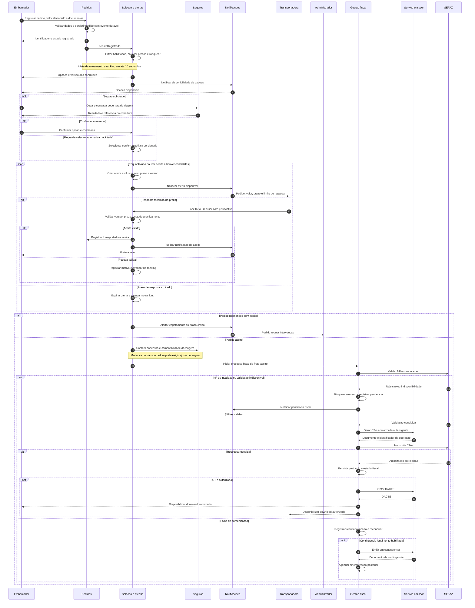
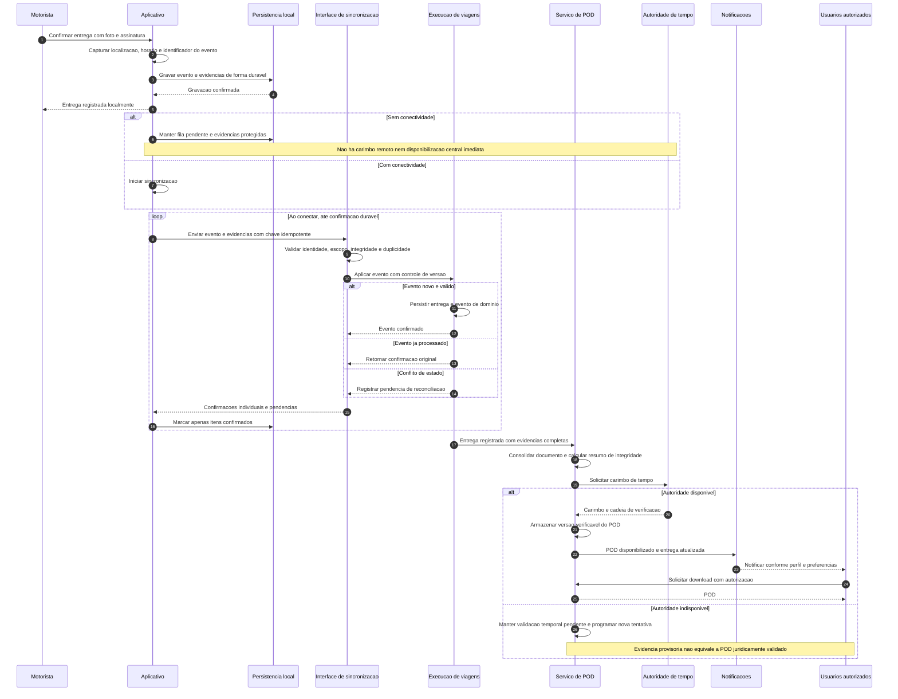

# Relatório Técnico de Arquitetura de Software

**Sistema:** Plataforma de Logística e Rastreamento de Cargas — G04  
**Equipe:** AI4ES — Time 2  
**Escopo analisado:** RF01–RF49, RNF01–RNF25 e HU01–HU14.  
**Natureza do relatório:** arquitetura conceitual, tecnologicamente neutra, com rastreabilidade e governança de requisitos.

> As decisões abaixo são propostas de arquitetura. Cobertura de modelagem não significa implementação, conformidade jurídica ou cumprimento de desempenho comprovados. Conflitos e dependências de validação estão explicitados nas seções 5 e 7.

## 1. Identificação das HUs

| HU | Perfil | Capacidade arquitetural | Requisitos associados | Critérios de aceite com impacto arquitetural |
|---|---|---|---|---|
| HU01 | Embarcador | Registro e documentação de pedidos | RF05, RF06, RF09–RF13; RNF13 | Validar dados obrigatórios, anexar documentos, declarar valor e iniciar seleção automaticamente. |
| HU02 | Embarcador | Seleção de transportadora e seguro | RF11–RF14, RF17, RF41, RF45 | Exibir ranking e condições; contratar seguro antes da confirmação; coordenar confirmação, aceite e emissão fiscal. |
| HU03 | Embarcador | Visão consolidada e acesso ao POD | RF07, RF31, RF34, RF37–RF39 | Consolidar status, previsão e alertas; disponibilizar comprovante; notificar ocorrências por e-mail. |
| HU04 | Embarcador | Abertura e acompanhamento de sinistros | RF42–RF44 | Vincular pedido, ocorrências e documentos; acompanhar seguradora e notificar atualizações. |
| HU05 | Transportadora | Aceite de pedidos e gestão operacional | RF03, RF13–RF15, RF35 | Controlar prazo de aceite, recusa justificada e acionamento da próxima transportadora. O gerenciamento de frota aparece no título, mas não possui critérios próprios. |
| HU06 | Transportadora | Supervisão de motoristas | RF25, RF26, RF31, RF32, RF35; RNF06, RNF15–RNF16 | Mapa operacional, alertas imediatos e contato com motorista. O contato direto não possui RF específico. |
| HU07 | Transportadora | Consulta de repasses | RF46, RF48 | Exibir valores brutos, comissão, líquido, filtros e exportação CSV/PDF. |
| HU08 | Motorista | Coleta com evidências | RF23, RF24, RF26, RF28 | Confirmar volumes, foto e assinatura; registrar divergências; transmitir imediatamente quando conectado. |
| HU09 | Motorista | Entrega, recusa e POD | RF27, RF28, RF37–RF40; RNF10, RNF17, RNF21 | Capturar foto, assinatura e localização; fluxo offline; POD em até 60 segundos; no máximo quatro interações. |
| HU10 | Motorista | Registro de ocorrências | RF26, RF28, RF34, RF35 | Categorias controladas, descrição livre, fotos e notificação aos responsáveis. |
| HU11 | Destinatário | Rastreamento por link | RF30–RF32; RNF05, RNF06, RNF15 | Acesso sem cadastro, token restrito ao frete, histórico cronológico, posição e previsão dinâmica; expiração após entrega. |
| HU12 | Destinatário | Notificações e preferências | RF33 | E-mail/SMS, previsão na saída para entrega e gestão de preferências pelo link. Preferências não possuem RF específico. |
| HU13 | Administrador | Monitoramento de SLA e intervenção | RF15, RF35, RF36; RNF25 | Detectar risco, alertar ausência de aceite, reatribuir manualmente e comunicar envolvidos. As duas últimas capacidades não possuem RF explícito. |
| HU14 | Administrador | Gestão financeira consolidada | RF46–RF49 | Receita, volume, ticket médio, inadimplência, filtros e exportação CSV/PDF. |

### 1.1. Atores e limites de acesso

- **Embarcador:** cria e acompanha pedidos de sua organização; acessa documentos, faturas, seguro e sinistros autorizados.
- **Transportadora:** administra vínculos de motoristas e veículos, responde ofertas e acompanha fretes sob sua responsabilidade.
- **Motorista:** acessa ordens atribuídas e registra posição, coleta, ocorrências e entrega.
- **Destinatário cadastrado:** utiliza as permissões de seu perfil, conforme RF01.
- **Destinatário sem cadastro:** utiliza uma credencial de capacidade limitada, representada pelo token do link; ausência de login não significa ausência de autorização.
- **Administrador:** realiza governança, intervenção operacional e gestão financeira, com privilégios segregados e auditados.
- **Sistemas externos:** serviço emissor de CT-e, SEFAZ, seguradoras, canais de e-mail/SMS, serviço de mapas/rotas e autoridade de carimbo de tempo. Os dois últimos são dependências arquiteturais propostas, a contratar e validar.

### 1.2. Vocabulário canônico e invariantes

| Conceito | Definição e regra |
|---|---|
| Pedido de frete | Solicitação do embarcador; não equivale automaticamente a uma viagem contratada. |
| Seleção | Escolha manual ou automática de uma opção ranqueada. Não representa aceite da transportadora. |
| Oferta | Convite à transportadora, com versão, prazo de resposta e condições comerciais registradas. |
| Aceite | Compromisso da transportadora. Deve existir no máximo uma atribuição ativa por pedido. |
| Viagem | Execução operacional vinculada ao pedido aceito, com motorista, veículo e paradas. A cardinalidade definitiva depende de validação. |
| Coleta realizada | Evento documental de coleta. Pode resultar imediatamente no estado operacional “em trânsito”, sem perder o registro da coleta. |
| Ocorrência | Fato operacional associado ao frete; não substitui obrigatoriamente seu estado principal. |
| Entrega registrada | Captura da execução e das evidências. Não deve ser confundida com conclusão da validação jurídica do POD. |
| POD | Documento consolidado, com evidências, integridade, autoria e carimbo de tempo conforme política jurídica aprovada. |

**Invariantes principais:**

1. Cancelamento e aceite concorrentes devem ser resolvidos de forma atômica, conforme RF08 e RF14.
2. CT-e somente pode entrar no processo de emissão após aceite da transportadora e validação das NF-es, ressalvadas regras fiscais oficialmente aprovadas.
3. Eventos reenviados não podem duplicar entrega, comissão, contratação de seguro ou documento fiscal.
4. Acesso a frete, documentos, posição e canais em tempo real deve ser autorizado no nível do objeto, não apenas pelo perfil.
5. Estado operacional, estado fiscal, estado do seguro e estado financeiro possuem ciclos de vida separados.

## 2. Diagramas de Arquitetura (Mermaid)

### 2.1. Componentes e fronteiras conceituais

Os componentes representam responsabilidades lógicas. Sua representação não impõe implantação independente para cada domínio.

```mermaid
flowchart TB
    subgraph Canais["Canais de acesso"]
        WEB["Portal web responsivo"]
        APP["Aplicativo do motorista"]
        LOCAL["Armazenamento local protegido e fila offline"]
        LINK["Interface do destinatário por token"]
    end

    subgraph Plataforma["Plataforma G04"]
        EDGE["Interfaces de entrada e autorização"]
        IAM["Identidade, perfis e políticas"]
        PED["Pedidos e documentos"]
        SEL["Seleção e orquestração de ofertas"]
        FROTA["Frota e execução de viagens"]
        GEO["Ingestão de posições e rastreamento"]
        ETA["Rotas, previsão e SLA"]
        FISC["Gestão fiscal de CT-e"]
        POD["Evidências e POD"]
        SEG["Seguros e sinistros"]
        FIN["Financeiro e faturamento"]
        NOT["Notificações e comunicação"]
        EVT["Eventos duráveis e agendamentos"]
        AUD["Auditoria imutável"]
        OBS["Observabilidade"]
        INT["Adaptadores externos versionados"]
    end

    subgraph Dados["Persistência por responsabilidade"]
        TRANS["Dados transacionais"]
        SERIES["Séries temporais e índices geoespaciais"]
        OBJ["Documentos e evidências"]
        READ["Projeções de consulta"]
    end

    subgraph Externos["Dependências externas"]
        EMIS["Serviço emissor de CT-e"]
        SEFAZ["SEFAZ"]
        INS["Seguradoras"]
        MSG["E-mail e SMS"]
        MAP["Mapas e rotas"]
        TSA["Autoridade de carimbo de tempo"]
    end

    WEB --> EDGE
    LINK --> EDGE
    APP --> LOCAL
    APP --> EDGE
    EDGE --> IAM
    EDGE --> PED
    EDGE --> SEL
    EDGE --> FROTA
    EDGE --> GEO
    EDGE --> FISC
    EDGE --> POD
    EDGE --> SEG
    EDGE --> FIN
    EDGE --> NOT

    PED --> SEL
    SEL --> FROTA
    SEL --> SEG
    SEL --> FISC
    FROTA --> POD
    GEO --> ETA
    ETA --> FROTA

    PED --> TRANS
    SEL --> TRANS
    FROTA --> TRANS
    FISC --> TRANS
    POD --> TRANS
    SEG --> TRANS
    FIN --> TRANS

    PED --> OBJ
    FROTA --> OBJ
    FISC --> OBJ
    POD --> OBJ
    SEG --> OBJ
    GEO --> SERIES

    PED --> EVT
    SEL --> EVT
    FROTA --> EVT
    GEO --> EVT
    ETA --> EVT
    FISC --> EVT
    POD --> EVT
    SEG --> EVT
    FIN --> EVT
    IAM --> EVT

    EVT --> NOT
    EVT --> FIN
    EVT --> SEL
    EVT --> READ
    EVT --> AUD
    EDGE --> READ

    FISC --> INT
    SEG --> INT
    NOT --> INT
    ETA --> INT
    POD --> INT

    INT --> EMIS
    INT --> SEFAZ
    INT --> INS
    INT --> MSG
    INT --> MAP
    INT --> TSA

    EDGE -.-> OBS
    EVT -.-> OBS
    INT -.-> OBS
    GEO -.-> OBS
```

**Interpretação:**

- Cada domínio controla suas gravações; compartilhamento de infraestrutura não autoriza acesso direto aos dados de outro domínio.
- Projeções de consulta atendem painéis sem centralizar regras de negócio.
- Eventos críticos originam-se de registros duráveis vinculados à transação de negócio.
- O tráfego de geolocalização deve ter capacidade e filas isoladas dos eventos fiscais, financeiros e de entrega.
- Toda interface externa atravessa um adaptador que traduz contratos, erros e versões.

### 2.2. Sequência: pedido, seleção, seguro, aceite e CT-e

O fluxo adota **provisoriamente** a interpretação de RF17: a confirmação do embarcador inicia a contratação; a emissão fiscal aguarda o aceite da transportadora. A divergência com HU02 exige aprovação.

**Regras complementares:** resposta tardia não reabre oferta expirada; cancelamento concorre com aceite por controle de versão. Falha de comunicação fiscal não significa rejeição: consultar o resultado antes de uma nova emissão evita duplicidade.

### 2.3. Sequência: entrega offline, sincronização e POD

Este fluxo preserva evidências offline, mas **não resolve por si só** o requisito de carimbo juridicamente válido no instante da assinatura. Essa condição permanece bloqueada para validação jurídica e definição técnica.

## 3. Decisões de Arquitetura

| ID | Decisão proposta | Fundamentação e consequências |
|---|---|---|
| DA01 | Organizar a plataforma em domínios com contratos explícitos | Separa pedidos, seleção, execução, fiscal, seguros, POD e financeiro. Permite evolução independente sem impor um serviço implantável por domínio. |
| DA02 | Isolar operacionalmente ingestão de geolocalização e processamento assíncrono | A taxa de posições não pode comprometer aceite, entrega, emissão fiscal ou faturamento. Capacidade física será definida por testes e volume acordado. |
| DA03 | Usar chamadas síncronas para validação imediata e eventos duráveis para propagação | Operações interativas retornam confirmação de persistência; notificações, projeções, desempenho e faturamento são processados de forma desacoplada. |
| DA04 | Adotar entrega de eventos pelo menos uma vez, com idempotência | Utilizar registro transacional de saída, deduplicação de entrada, retentativas, filas de falha e reprocessamento controlado. Não pressupor processamento global “exatamente uma vez”. |
| DA05 | Orquestrar ofertas com prazos persistidos e controle de concorrência | Impede aceite duplo e resolve disputas entre cancelamento, aceite, expiração e reatribuição. Relógio do servidor determina os prazos das ofertas. |
| DA06 | Versionar regras e condições comerciais | Ranking, preços, ad valorem, comissão, cancelamento e SLA devem registrar a versão aplicada. Cotações externas lentas exigem prazo limite e política explícita para cumprir RNF13. |
| DA07 | Manter aplicação mobile com operação local prioritária | Banco local protegido, fila durável, anexos retomáveis e confirmação individual garantem sobrevivência a interrupções de rede e reinício do aplicativo. Não há garantia contra destruição física do dispositivo antes da sincronização. |
| DA08 | Separar eventos, posições e projeções | Dados transacionais preservam invariantes; posições utilizam armazenamento otimizado para séries temporais e consultas geoespaciais; painéis utilizam projeções reconstruíveis. |
| DA09 | Aplicar autorização por perfil, organização, vínculo e frete | MFA para administrador e embarcador; sessões renováveis e bloqueio por inatividade no mobile; tokens do destinatário com escopo mínimo, validade e revogação. |
| DA10 | Encapsular integrações em adaptadores versionados | Isola particularidades de SEFAZ, emissor e seguradoras. Inclui prazos limite, interrupção temporária de chamadas a dependências indisponíveis, reconciliação e validação de retornos. |
| DA11 | Modelar CT-e com máquina de estados própria | Distinguir preparação, validação, transmissão, resultado incerto, autorização, rejeição, contingência e cancelamento. Inutilização de numeração é operação própria, não sinônimo de cancelar documento autorizado. |
| DA12 | Tratar o POD como conjunto verificável de evidências | Preservar foto, assinatura, identidade disponível, geolocalização, horários, resumos de integridade e carimbo. Validade jurídica depende de modalidade de assinatura e política aprovada, não apenas da imagem assinada. |
| DA13 | Criar razão financeira auditável por frete | Registrar bruto, comissão, líquido, impostos e ajustes de maneira idempotente. Correções por lançamentos compensatórios, sem sobrescrever histórico. Retenção financeira real depende do fluxo de liquidação. |
| DA14 | Separar auditoria, telemetria e dados pessoais operacionais | Auditoria crítica imutável; logs técnicos minimizados; localização restrita; políticas distintas de retenção, acesso e descarte, conciliando LGPD e obrigações legais. |
| DA15 | Projetar redundância, recuperação e degradação controlada | Falha de seguro ou emissão fiscal não deve indisponibilizar consulta de rastreamento. Backup diário é complementado por captura contínua ou em intervalo inferior a uma hora para o RPO. |
| DA16 | Definir qualidade por objetivos mensuráveis | Instrumentar latência de ranking, idade da posição, disponibilidade, sincronização, integrações, emissão fiscal, notificações e geração de POD. Dimensionamento e conformidade exigem evidências de teste. |

### 3.1. Interfaces e contratos conceituais

**Comandos principais:**

- `RegistrarPedido`, `CancelarPedido`, `ConfirmarSelecao`.
- `AceitarOferta`, `RecusarOferta`, `ReatribuirFrete`.
- `AtribuirMotoristaVeiculo`, `RegistrarColeta`, `RegistrarOcorrencia`, `RegistrarEntrega`.
- `SincronizarEventos`, `TransmitirPosicoes`.
- `EmitirCTe`, `ConsultarSituacaoFiscal`, `CancelarCTe`, `InutilizarNumeracao`.
- `ContratarSeguro`, `AbrirSinistro`, `GerarFatura`, `ConsultarDemonstrativo`.

**Consultas principais:** pedidos consolidados, ordens do dia, ranking, histórico de eventos, última posição conhecida, previsão de entrega, documentos e painéis financeiros.

**Eventos de domínio:** `PedidoRegistrado`, `OfertaExpirada`, `FreteAceito`, `ColetaRegistrada`, `OcorrenciaRegistrada`, `EntregaRegistrada`, `PODDisponibilizado`, `CTeAutorizado`, `SinistroAtualizado` e `ComissaoApurada`.

Os contratos de eventos devem conter, quando aplicável:

- Identificador único, tipo e versão do evento.
- Identificador do frete, organização, ator e origem.
- Horário de ocorrência, horário de recepção e sequência local.
- Identificador de correlação e causalidade.
- Versão esperada do agregado e chave idempotente.
- Referências protegidas a documentos, evitando dados pessoais excessivos na mensagem.

Erros distinguem validação, autorização, conflito de versão, indisponibilidade e resultado externo incerto.

### 3.2. Consistência e processamento operacional

- **Consistência forte:** aceite exclusivo, cancelamento, atribuição ativa, transições fiscais, lançamentos financeiros e confirmação durável de evidências.
- **Consistência eventual controlada:** ranking de desempenho, painéis, notificações, previsão de chegada e agregações financeiras.
- **Posições atrasadas:** entram no histórico, mas não substituem uma posição mais recente apenas por terem chegado depois.
- **Eventos offline conflitantes:** permanecem registrados e são encaminhados para reconciliação; não são descartados silenciosamente.
- **Rastreamento:** exibe idade da última posição e condição “sem atualização recente”; não apresenta coordenada antiga como posição em tempo real.
- **Performance da transportadora:** deriva de eventos verificáveis, com fórmula e versão registradas; pesos e tratamento de ocorrências ainda precisam de definição.
- **Rotas offline:** ordens, documentos essenciais e rota disponível são preparados antes da desconexão. Atualizações dinâmicas de trânsito e recálculo sem mapas locais dependem da política de operação offline.

### 3.3. Segurança, dados e recuperação

1. TLS 1.2 ou superior em toda comunicação cliente-servidor.
2. AES-256 em repouso para dados financeiros, fiscais e de localização, incluindo cópias, arquivos temporários e dados locais abrangidos pelo requisito.
3. Gestão segregada de chaves, rotação, controle de acesso e auditoria de uso.
4. Proteção de uploads por validação de tipo, tamanho, integridade e análise de conteúdo malicioso.
5. Tokens do destinatário não devem aparecer em logs, métricas ou referências externas; assinaturas de canais em tempo real devem revalidar expiração e revogação.
6. Auditoria financeira e fiscal imutável por no mínimo cinco anos, com acesso restrito e preservação verificável.
7. Backup automático diário, retenção mínima de 90 dias e recuperação pontual com perda máxima de uma hora para dados transacionais e de rastreamento.
8. Testes periódicos de restauração abrangendo dados, documentos, chaves, configurações e registros de eventos.

## 4. Tabela de Componentes e Rastreabilidade

| Componente | Responsabilidade Principal | Comunica-se com | Origem (HU / Critério de Aceite) |
|---|---|---|---|
| C01 — Portal web | Interfaces por perfil, pedidos, operação, documentos e financeiro; responsividade | C04 e C18 | HU01–HU07, HU13–HU14; RNF20 |
| C02 — Aplicativo do motorista | Ordens, coleta, entrega, ocorrências, posição e rotas; interação acessível | C04, C08–C10, C12; persistência local | HU08–HU10; RF23–RF29; RNF04, RNF17–RNF19, RNF21 |
| C03 — Interface do destinatário | Rastreamento, histórico, previsão, preferências e acesso limitado a comprovantes | C04, C09, C10, C12, C15 | HU11–HU12; RF30–RF33, RF39; RNF05–RNF06 |
| C04 — Entrada, identidade e autorização | Cadastro, perfis, MFA, sessões e autorização por frete | C01–C03 e domínios de negócio | Todos os perfis; RF01–RF02; RNF01, RNF03–RNF06 |
| C05 — Pedidos | Dados da carga, valor declarado, documentos, cancelamento e visão consolidada | C06, C08, C11, C13, C17–C18 | HU01–HU03; RF05–RF09 |
| C06 — Seleção e ofertas | Elegibilidade, cálculo comparativo, ranking, aceite, recusa, expiração e desempenho | C05, C07, C13–C16, C18 | HU01–HU02, HU05, HU13; RF10–RF16; RNF13 |
| C07 — Frota e vínculos | Cadastro e gestão de motoristas/veículos e habilitações operacionais | C04, C06, C08 | HU05, HU06; RF03 |
| C08 — Execução de viagens | Ordens, atribuições, paradas, coleta, entrega, recusa, ocorrências e reconciliação offline | C02, C05, C07, C09, C12, C15, C18 | HU06, HU08–HU10; RF23–RF28, RF40; RNF17 |
| C09 — Geolocalização e rastreamento | Ingestão, histórico, última posição e distribuição autorizada em tempo real | C02–C04, C08, C10, C18 | HU03, HU06, HU11; RF25, RF30–RF32; RNF06, RNF15–RNF16, RNF23 |
| C10 — Rotas, previsão e SLA | Otimização multiparada, previsão dinâmica e detecção de risco | C08–C09, C15–C16, C19; mapas/rotas | HU06, HU11, HU13; RF29, RF32, RF36 |
| C11 — Gestão fiscal | Validação de NF-e, CT-e, protocolos, contingência, cancelamento, inutilização e DACTE | C05–C06, C17–C20; emissor e SEFAZ | HU02; RF17–RF22; RNF07–RNF08, RNF11, RNF14, RNF24 |
| C12 — Evidências e POD | Consolidação, integridade, carimbo de tempo, estados de validação e download | C02–C04, C08, C15, C17–C19; autoridade de tempo | HU03, HU09; RF24, RF27, RF37–RF40; RNF10 |
| C13 — Seguros e sinistros | Cotação, contratação, ajustes, abertura e acompanhamento de sinistros | C05–C06, C08, C12, C15, C17, C19; seguradoras | HU02, HU04; RF41–RF44; RNF24 |
| C14 — Financeiro e faturamento | Tabelas de preços, comissão, faturas, repasses, indicadores e exportações | C05–C06, C08, C18, C20 | HU07, HU14; RF45–RF49; RNF02, RNF11 |
| C15 — Notificações e comunicação | E-mail/SMS, preferências, alertas, acompanhamento de envio e contato operacional | C04–C06, C08, C10–C14, C16, C18–C19 | HU01–HU06, HU10, HU12–HU13; RF13, RF33–RF36, RF43 |
| C16 — Configuração e intervenção | Políticas versionadas, prazos, critérios, comissões e reatribuição auditada | C04, C05–C06, C10, C14–C15, C20 | HU02, HU05, HU13; RF08, RF11–RF12, RF15, RF25, RF36 |
| C17 — Documentos e evidências armazenadas | Upload, metadados, integridade, retenção e acesso protegido a arquivos | C05, C08, C11–C13, C20 | HU01, HU03–HU04, HU08–HU09; RF09, RF22, RF24, RF27, RF39, RF44 |
| C18 — Eventos, agendamentos e projeções | Entrega durável, deduplicação, temporizadores, reprocessamento e consultas consolidadas | Domínios de negócio, C15, C20–C21 | HU03, HU05–HU06, HU13–HU14; RF07, RF15–RF16, RF31, RF49 |
| C19 — Adaptadores externos | Contratos versionados, tradução, resiliência e reconciliação | C10–C13, C15 e sistemas externos | HU02, HU04, HU09, HU11–HU12; RF17–RF21, RF29, RF33, RF38, RF41–RF43; RNF24 |
| C20 — Auditoria e governança de dados | Trilhas imutáveis, retenção, acesso, privacidade e evidências de operações críticas | C04 e todos os domínios críticos | Transversal; RF04; RNF02, RNF09, RNF11 |
| C21 — Operação, observabilidade e recuperação | Métricas, alertas, capacidade, disponibilidade, backup e restauração | Todos os componentes e persistências | HU13; RNF12–RNF16, RNF22, RNF25 |

**Observação de rastreabilidade:** capacidades presentes apenas em HUs — contato direto, preferências, exportações e reatribuição manual — foram preservadas no modelo, mas precisam ser formalizadas na especificação de requisitos.

## 5. Bloqueios e Pendências

| ID | Bloqueio ou pendência | Impacto | Encaminhamento e responsável sugerido |
|---|---|---|---|
| B01 | HU02 relaciona confirmação à emissão do CT-e; RF17 exige aceite prévio | Emissão antecipada, documentos incorretos e necessidade de compensação | **Bloqueia a baseline do fluxo fiscal.** Produto e especialista fiscal devem aprovar a sequência da seção 2.2. |
| B02 | RF38 exige carimbo no momento da assinatura, enquanto RF28/RNF17 exigem operação offline | Um carimbo remoto posterior não comprova, isoladamente, o instante declarado de assinatura | **Bloqueia a alegação de conformidade jurídica offline.** Jurídico, segurança e produto devem definir modalidade de assinatura, evidências e eventual mecanismo temporal confiável. |
| B03 | RF39 exige POD imediato e HU09 exige transmissão em 60 segundos, inclusive em contexto de entrega offline | Impossibilidade de disponibilização central sem conectividade | Definir SLA online e prazo contado da reconexão; aprovar estado provisório e regras de notificação. |
| B04 | Token de rastreamento expira após entrega, mas destinatário deve baixar POD e receber notificações finais | Perda de acesso ao comprovante | Aprovar credencial distinta para POD, com escopo e validade próprios, ou alterar a política de expiração de forma explícita. |
| B05 | Modalidades de CT-e, contingência, cancelamento e inutilização dependem de vigência normativa | Implementação de operação não permitida no leiaute vigente | Fiscal e provedor devem validar matriz por versão, modalidade e jurisdição. Não presumir que todas as modalidades citadas permanecem emitíveis. |
| B06 | “Reter comissão”, “repassar” e “inadimplência” não possuem fluxo de cobrança/liquidação | Painel pode contabilizar valores sem comprovar pagamento ou retenção real | **Bloqueia o fechamento do financeiro.** Definir cobrança, recebimento, conciliação, vencimento, estorno e liquidação. |
| B07 | Seguro contratado antes da confirmação pode preceder troca de transportadora | Cobertura incompatível com viagem aceita; custos de cancelamento | Definir validade de cotação, confirmação de cobertura, alteração de risco e compensações com seguradoras. |
| B08 | “Alto volume”, “tempo real” e “imediato” não têm carga e limites completos | Dimensionamento e testes de aceite não reprodutíveis | Produto e operação devem definir frota simultânea, frequência, usuários concorrentes, tamanhos de anexos e percentis de latência. |
| B09 | Gestão de frota não define atribuição de motorista/veículo, elegibilidade e múltiplas cargas | Ambiguidade nas ordens, rotas, seguro e segregação de dados | Validar modelo pedido–viagem–parada–veículo e regras de atribuição com a operação. |
| B10 | RPO definido, mas RTO e escopo de desastre não definidos | Recuperação pode cumprir perda de dados e ainda exceder indisponibilidade tolerada | Operação deve definir RTO, cenários de falha, redundância e critérios dos testes de restauração. |

## 6. Cobertura de Requisitos

### 6.1. Requisitos funcionais

**Legenda:** **M** — modelado; **MC** — modelado com condição ou pendência de especificação. Nenhum status representa homologação.

| Requisitos | Componentes principais | Status | Evidência de validação prevista |
|---|---|---|---|
| RF01–RF04 | C04, C07, C20 | M | Cadastro por perfil, testes de autorização por objeto, vínculos de frota e auditoria das operações críticas. |
| RF05–RF09 | C05, C17 | M | Validação de pedido, valor declarado, anexos, painel e corrida entre cancelamento e aceite. |
| RF10–RF16 | C06, C14–C16, C18 | MC | Ranking reproduzível, critérios versionados, aceite único, expiração persistente e atualização do desempenho; fórmulas pendentes. |
| RF17–RF22 | C11, C17, C19–C20 | MC | Validação de NF-e, schema, transmissão, consulta de resultado incerto, contingência, cancelamento, inutilização e DACTE; B01/B05. |
| RF23–RF29 | C02, C07–C10, C12 | MC | Ordens, atribuição, coleta, posição, ocorrência, entrega, sincronização e rota multiparada; B09 e escopo offline. |
| RF30–RF32 | C03–C04, C09–C10 | MC | Isolamento por token, cronologia, atualização de mapa, previsão e indicação de posição desatualizada; B04/B08. |
| RF33–RF36 | C10, C15–C16, C18–C19 | MC | Matriz evento–destinatário–canal, deduplicação, preferências e alertas; definição de “imediato” pendente. |
| RF37–RF40 | C08, C12, C17, C19 | MC | Integridade do POD, recusa documentada, carimbo e autorização de download; B02–B04. |
| RF41–RF44 | C13, C17, C19 | MC | Cotação/contratação idempotentes, sinistro vinculado, documentos e reconciliação de status; B07. |
| RF45–RF49 | C14, C18, C20 | MC | Cálculo versionado, comissão sem duplicidade, fatura, demonstrativo e indicadores; B06. |

**Resultado funcional:** os **49 RF possuem alocação arquitetural**. Permanecem condicionados os fluxos cuja semântica, política ou integração ainda não está fechada.

### 6.2. Requisitos não funcionais

| RNF | Resposta arquitetural | Verificação e ressalva |
|---|---|---|
| RNF01 | TLS 1.2 ou superior nas interfaces | Verificar configuração e rejeição de versões inferiores. |
| RNF02 | AES-256 em repouso, incluindo dados locais e cópias abrangidas | Inspecionar configuração, inventário de dados e gestão de chaves. |
| RNF03 | MFA obrigatório para administrador e embarcador | Testar autenticação e recuperação de conta sem caminhos de desvio. |
| RNF04 | Tokens renováveis e bloqueio local por inatividade | Testar expiração, renovação, revogação, desbloqueio e sincronização após reautenticação. |
| RNF05 | Token único, limitado ao frete, expirável e revogável | Testar enumeração, reutilização indevida e término da sessão; B04. |
| RNF06 | Autorização por frete em consultas e canais de posição | Testes entre organizações, motoristas e destinatários, inclusive após mudança de vínculo. |
| RNF07 | Validação XSD e suporte versionado ao leiaute vigente | Testes de contrato e regressão fiscal; B05. |
| RNF08 | Matriz de modalidades conforme legislação vigente | Homologação fiscal por modalidade; divergências com a lista original exigem aprovação. |
| RNF09 | Minimização, bases legais, direitos dos titulares e retenção por categoria | Inventário de tratamento e validação jurídica; imutabilidade não justifica retenção irrestrita. |
| RNF10 | Evidências verificáveis e política de assinatura/carimbo | Parecer jurídico e testes de verificação; B02. |
| RNF11 | Auditoria imutável financeira/fiscal por pelo menos cinco anos | Testes de resistência à alteração, consulta histórica e restauração. |
| RNF12 | Redundância, isolamento e recuperação | Medição mensal ponta a ponta, incluindo rastreamento. Em mês de 30 dias, 99,5% corresponde a até 216 minutos de indisponibilidade. |
| RNF13 | Filtragem e ranking com capacidade dedicada e dados previamente disponíveis quando permitido | Medir do registro durável até ranking pronto: até 10 segundos. Carga e percentil precisam de aprovação. |
| RNF14 | Fila fiscal prioritária, limite de tempo e telemetria por etapa | Definir marco final da transmissão em até 30 segundos; não confundir transmissão com autorização da SEFAZ. |
| RNF15 | Ingestão, projeção e atualização do canal em tempo real | Medição ponta a ponta de até 30 segundos após transmissão; definir tratamento de falhas e posições offline. |
| RNF16 | Particionamento, escalabilidade de ingestão e isolamento de filas | Testes de carga e saturação com volume contratado; B08. |
| RNF17 | Persistência local durável, anexos protegidos e sincronização idempotente | Testar desconexão, reinício, reenvio, bateria interrompida e armazenamento insuficiente, sem perda silenciosa. |
| RNF18 | Alvos de toque ampliados e modo apropriado à baixa luminosidade | Testes com motoristas usando luvas em condições representativas. |
| RNF19 | Aplicativo Android prioritário e iOS | Definir versões e dispositivos suportados; testes funcionais e offline em ambos. |
| RNF20 | Portal responsivo | Matriz de testes em Chrome, Firefox, Safari e Edge, com resoluções aprovadas. |
| RNF21 | Fluxo de entrega com até quatro interações | Protótipo e teste de tarefa; definir como contar assinatura, permissões e confirmação. |
| RNF22 | Backup diário, retenção de 90 dias e captura incremental/contínua | Demonstrar restauração com RPO ≤ 1 hora para transações e rastreamento; RTO pendente. |
| RNF23 | Persistência de posições otimizada para séries temporais e geoespaço | Testar ingestão, consultas por intervalo, proximidade e trajetória. |
| RNF24 | APIs e adaptadores com contratos versionados | Testes de compatibilidade e atualização independente; protocolos externos traduzidos no adaptador. |
| RNF25 | Métricas, rastreamento distribuído e painel operacional | Demonstrar latência de roteamento, aceitação e disponibilidade das integrações em tempo real. |

### 6.3. Síntese e estratégia de aceite

- **49/49 RF:** rastreados para componentes.
- **25/25 RNF:** associados a mecanismos arquiteturais e verificações.
- **14/14 HUs:** identificadas e preservadas, inclusive critérios sem RF correspondente.
- **Conformidade comprovada:** não aferida; não há evidências de implementação, execução de testes ou homologação neste relatório.

**Testes prioritários:**

1. Aceite simultâneo, cancelamento concorrente e resposta após expiração.
2. Entrega offline com encerramento do aplicativo, reenvio e anexos parcialmente transmitidos.
3. Timeout após transmissão fiscal, evitando emissão duplicada.
4. Tentativa de acesso a localização e documentos de outro frete.
5. Pico de geolocalização sem degradação dos comandos de entrega e aceite.
6. Restauração de transações, posições, evidências e auditoria.
7. Evento de entrega duplicado sem duplicar comissão, fatura ou notificação.
8. Validação do POD e de sua cadeia de evidências em cenários online e offline.

## 7. Gap Analysis

### 7.1. Lacunas reais de especificação

| ID | Lacuna identificada | Impacto arquitetural | Ação recomendada |
|---|---|---|---|
| G01 | Não há política para usuários com múltiplos perfis, vínculos entre organizações e destinatário cadastrado versus anônimo | Modelo de identidade, troca de contexto e isolamento de dados | Definir matriz sujeito–recurso–ação e ciclo de vida dos vínculos; formalizar critérios de autorização. |
| G02 | Dimensões constam em RF05, mas sua obrigatoriedade não aparece em HU01; faltam unidades, precisão e regras de carga especial | Validação, preço, elegibilidade, seguro e documentos | Criar dicionário de dados com unidades, limites, precisão monetária, múltiplos volumes e obrigatoriedade condicional. |
| G03 | Não existem fórmulas de ranking, desempenho, SLA em risco, ad valorem e arredondamento | Resultados não reproduzíveis e divergências financeiras | Especificar fórmulas versionadas, pesos, desempate, dados ausentes e exemplos de cálculo aprovados. |
| G04 | RF13 admite transportadoras selecionadas no plural, sem definir ofertas sequenciais ou paralelas | Risco de dupla contratação e semântica diferente de expiração | Aprovar oferta sequencial como baseline proposta ou definir concorrência paralela com vencedor atômico e invalidação das demais. |
| G05 | Não está definido se pedido pode gerar múltiplas viagens, entregas parciais, transbordos ou redespachos | Cardinalidades centrais, POD por parada, rastreamento e comissão | Realizar modelagem de domínio com casos reais antes de consolidar contratos e persistência. |
| G06 | Falta política para saída operacional antes da autorização fiscal e confirmação do seguro | Viagem pode começar sem pré-condições legais ou contratuais | Definir regras de liberação, exceções de contingência e responsáveis pela autorização. |
| G07 | “Assinatura digital” não especifica modalidade, identificação do recebedor ou forma de comprovação de autoria | Integrações, fluxo de assinatura, armazenamento e validade do POD | Obter especificação jurídica de assinatura, identidade, carimbo, verificação e contestação, inclusive offline. |
| G08 | Operação offline não define duração máxima, falta de espaço, ausência de localização ou perda do dispositivo | Limites da garantia de não perda e capacidade local | Criar matriz de falhas; impedir confirmação sem gravação durável; definir avisos, capacidade mínima e exceções documentadas. |
| G09 | Notificações obrigatórias convivem com preferências; faltam políticas de consentimento e entrega por canal | Orquestração, supressão, retentativas e rastreabilidade | Definir matriz de obrigatoriedade/base legal, preferências, tentativas, falhas permanentes e diferença entre envio e recebimento. |
| G10 | Contato direto de HU06/HU13 não define canal nem histórico | Pode exigir chamadas, mensagens, mascaramento de contatos e retenção | Formalizar RF específico e escolher capacidade de comunicação, permissões, evidências e dependências. |
| G11 | Reatribuição manual não define condições, autoridade nem compensações | Risco de invalidar seguro, CT-e, atribuição e preço | Especificar fluxo auditado, limites por estado, motivo obrigatório e compensações entre domínios. |
| G12 | Faltam cobrança, vencimento, recebimento, conciliação e tratamento de estorno | Não é possível determinar inadimplência ou retenção efetiva apenas com fretes concluídos | Completar o ciclo financeiro e definir sistema responsável pela liquidação e fonte oficial do pagamento. |
| G13 | Exportações CSV/PDF estão nas HUs, mas não possuem limites ou critérios de segurança | Consultas extensas, geração assíncrona e exposição de dados | Formalizar RF de exportação, filtros, volume, expiração de arquivos e neutralização de conteúdo interpretável em planilhas. |
| G14 | Não há matriz de retenção para posições, fotos, assinaturas, sinistros, tokens e backups | Conflito entre LGPD, auditoria imutável e custos de armazenamento | Jurídico e segurança devem aprovar retenção por classe, bloqueio legal, descarte e tratamento de dados restaurados. |
| G15 | Metas de carga, percentis, disponibilidade externa e tempos de recuperação estão incompletos | Capacidade e SLAs não podem ser contratados ou homologados objetivamente | Criar perfil de carga, indicadores e objetivos por jornada; definir RTO e comportamento degradado por dependência. |
| G16 | Falta definição de governança das APIs externas e certificados fiscais | Atualizações podem interromper emissão, seguro ou verificação de documentos | Definir responsáveis por credenciais, certificados, versões, homologação, calendário de atualização e reversão. |

### 7.2. Plano recomendado ao time de desenvolvimento

**Antes de fechar a baseline arquitetural**

- Resolver B01–B07 com produto, operação, fiscal, jurídico e financeiro.
- Aprovar o modelo pedido–oferta–viagem–parada e as máquinas de estados independentes.
- Formalizar critérios exclusivos das HUs em requisitos rastreáveis, sem descartá-los por ausência de RF.
- Registrar as decisões aprovadas, alternativas rejeitadas e responsáveis.

**Antes da construção dos fluxos críticos**

- Publicar contratos versionados de comandos, consultas, eventos e integrações.
- Definir invariantes, idempotência, controle de concorrência e compensações.
- Validar protótipo mobile com luvas, baixa luminosidade e limite de interações.
- Executar provas técnicas de sincronização offline, contingência fiscal, carimbo de tempo e atualização de mapa.

**Antes da homologação**

- Aprovar critérios mensuráveis para “imediato”, “tempo real”, “alto volume” e “condições normais”.
- Executar testes de carga, segurança, restauração e falhas de integração.
- Homologar emissão fiscal e política jurídica do POD.
- Demonstrar reconciliação financeira e retenção de comissão conforme o fluxo de liquidação aprovado.

**Conclusão:** a arquitetura proposta oferece alocação integral dos requisitos e separa os domínios críticos para evolução, segurança e resiliência. A aprovação definitiva depende principalmente da resolução do POD offline, da precedência entre confirmação e aceite, das regras fiscais vigentes e do ciclo real de cobrança e repasse.