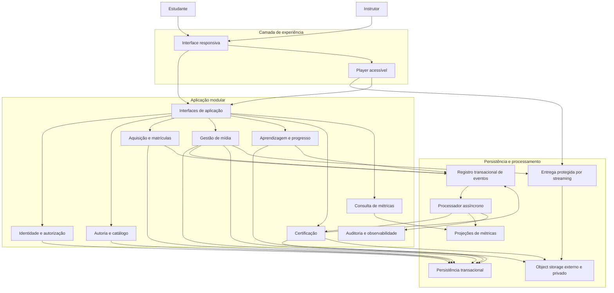
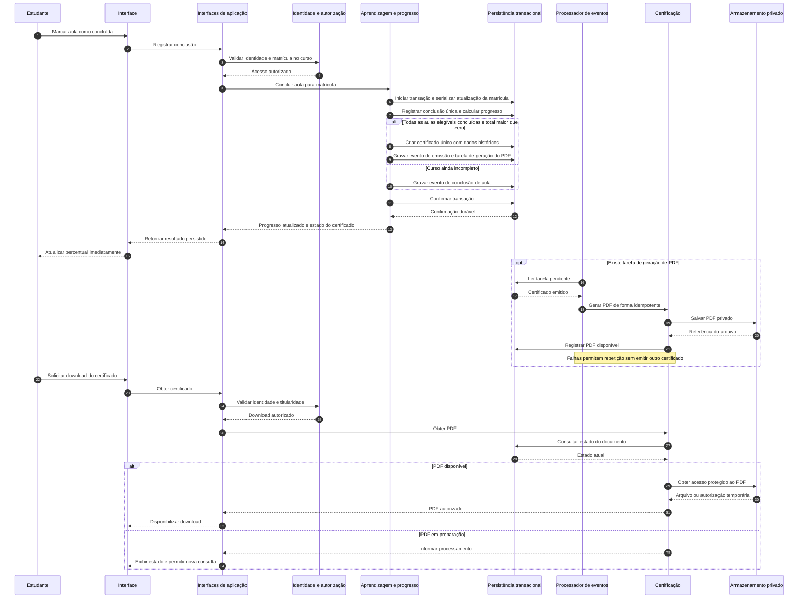

# Relatório Técnico de Arquitetura de Software

**Projeto:** Plataforma de Cursos Online — M01  
**Equipe:** AI4ES — Time 2  
**Escopo:** autoria de cursos, aquisição e acesso, consumo de vídeos, progresso, certificação e métricas.  
**Referência:** RF01–RF16, RNF01–RNF10 e HU01–HU09.  
**Status:** arquitetura conceitual proposta, com decisões de negócio pendentes de validação.

## 1. Identificação das HUs

| HU | Ator | Objetivo e critérios arquiteturalmente relevantes | Requisitos relacionados |
|---|---|---|---|
| HU01 | Instrutor | Criar curso; informar título e descrição obrigatórios; organizar, reordenar e remover módulos e aulas antes da publicação; enviar vídeo por aula. | RF01–RF04; RNF04, RNF09 |
| HU02 | Instrutor | Publicar/despublicar; apresentar status; retirar curso da descoberta pública sem revogar acesso de compradores anteriores. | RF05, RF08; RNF01 |
| HU03 | Instrutor | Consultar total de estudantes matriculados por curso, com defasagem máxima de 1 hora. | RF13; RNF06 |
| HU04 | Instrutor | Consultar visualizações e percentual de conclusão por aula no painel do curso. | RF14; RNF06 |
| HU05 | Estudante | Cadastrar nome, e-mail e senha; validar formato e unicidade do e-mail e senha com pelo menos 8 caracteres; redirecionar à página inicial. | RF06; RNF02 |
| HU06 | Estudante | Adquirir curso disponível; obter acesso imediatamente; visualizar aquisição na própria área; impedir aquisição duplicada. | RF07, RF08; RNF01, RNF09 |
| HU07 | Estudante | Reproduzir vídeo por streaming; marcar conclusão manualmente; persistir conclusão e atualizar progresso imediatamente. | RF09, RF10, RF12; RNF03, RNF07, RNF10 |
| HU08 | Estudante | Receber certificado automaticamente ao concluir todas as aulas; conter estudante, curso, instrutor e data; baixar PDF após emissão. | RF11, RF15; RNF09 |
| HU09 | Estudante | Listar todos os cursos adquiridos com título, capa e progresso; acessar qualquer aula; distinguir cursos concluídos. | RF08, RF10, RF12; RNF01, RNF05 |

**Requisitos transversais e complementares:**

- **RF16:** login e logout de estudantes e instrutores não possuem HU própria, mas integram o escopo.
- **RNF05 e RNF08:** aplicam-se a todas as interfaces de usuário.
- **RF01:** exige preço, embora HU01 não o mencione. O campo integra o modelo; moeda, limites e política de gratuidade permanecem pendentes.
- **RF06:** exige nome no cadastro. Sua ausência nos critérios de HU05 não elimina essa obrigação.
- **RF04 × HU01:** a edição e remoção após a publicação não estão suficientemente especificadas.

**Convenção de governança:** requisitos de entrada são obrigações; decisões abaixo são propostas arquiteturais. Regras de negócio não explícitas são identificadas como pendências, não tratadas como requisitos aprovados.

## 2. Diagramas de Arquitetura (Mermaid)

### 2.1 Visão de componentes e dependências

Os componentes representam **responsabilidades lógicas**. Não implicam processos, serviços ou implantações independentes.



**Limites relevantes:**

- A persistência de negócio e o registro de eventos devem permitir gravação atômica para operações críticas.
- O armazenamento de vídeos é externo ao servidor da aplicação, conforme RNF04.
- A entrega de streaming somente aceita autorizações emitidas após verificar identidade e matrícula.
- As projeções de métricas não são a fonte de verdade para acesso, progresso ou emissão de certificado.
- A comunicação direta do player com a entrega de streaming não permite acesso público ao armazenamento.

### 2.2 Sequência de aquisição e liberação de acesso

O diagrama começa quando a aquisição pode ser efetivada. A eventual confirmação financeira e sua integração dependem da definição do processo comercial.

```mermaid
sequenceDiagram
    autonumber
    participant E as Estudante
    participant UI as Interface
    participant API as Interfaces de aplicação
    participant IAM as Identidade e autorização
    participant AQ as Aquisição e matrículas
    participant DB as Persistência transacional
    participant P as Processador de eventos
    participant LOG as Auditoria
    participant MET as Projeções de métricas

    E->>UI: Adquirir curso
    UI->>API: Efetivar aquisição com identificador da operação
    API->>IAM: Validar sessão e identidade
    IAM-->>API: Identidade validada
    API->>AQ: Efetivar aquisição do estudante
    AQ->>DB: Iniciar transação e verificar curso e aquisição existente

    alt Aquisição já existente
        DB-->>AQ: Matrícula existente
        AQ->>DB: Encerrar transação sem duplicação
        AQ-->>API: Retornar aquisição existente
        API-->>UI: Curso já disponível na área do estudante
    else Curso indisponível ou confirmação insuficiente
        AQ->>DB: Encerrar transação sem aquisição
        AQ-->>API: Informar impedimento
        API-->>UI: Exibir motivo sem liberar conteúdo
    else Aquisição válida
        AQ->>DB: Gravar aquisição, matrícula e evento de auditoria
        Note over AQ,DB: Unicidade por estudante e curso; evento na mesma transação
        AQ->>DB: Confirmar transação
        DB-->>AQ: Confirmação durável
        AQ-->>API: Aquisição efetivada e acesso habilitado
        API-->>UI: Exibir curso adquirido
        UI-->>E: Permitir acesso imediato

        P->>DB: Ler eventos pendentes
        DB-->>P: Aquisição efetivada
        P->>LOG: Registrar evento crítico
        P->>MET: Atualizar total de matrículas
        Note over P,MET: Processamento idempotente e defasagem máxima de 1 hora
    end
```

A habilitação de acesso depende da matrícula confirmada, **não** do processamento posterior de auditoria ou métricas.

### 2.3 Sequência de conclusão e certificação



**Ponto de validação:** a emissão lógica ocorre na transação da última conclusão; a geração do PDF é recuperável e assíncrona. O tempo aceitável entre emissão e download precisa ser aprovado, pois HU08 pode ser interpretada como exigência de disponibilidade imediata do PDF.

## 3. Decisões de Arquitetura

### DA01 — Organização modular por responsabilidade

Adotar uma aplicação modular com limites explícitos entre identidade, catálogo, aquisição, mídia, aprendizagem, certificação e métricas.

- Evita distribuir prematuramente operações fortemente relacionadas.
- Permite escalar processamento de mídia, documentos e métricas separadamente, se necessário.
- As interfaces são conceituais e não prescrevem protocolos, produtos ou frameworks.

### DA02 — Autenticação e autorização centralizadas

- Cadastro com nome, e-mail válido e único e senha com mínimo de 8 caracteres.
- Senhas armazenadas com hash adaptativo seguro e salt individual, nunca em texto puro ou com criptografia reversível.
- Login estabelece sessão autenticada; logout invalida a sessão correspondente.
- Instrutores somente administram cursos e consultam métricas sob sua responsabilidade.
- Estudantes somente acessam conteúdo adquirido e seus próprios certificados.
- A autorização considera o recurso solicitado, não apenas o perfil do usuário.

O provisionamento de instrutores e a possibilidade de uma pessoa possuir ambos os perfis permanecem pendentes.

### DA03 — Separação entre publicação e direito de acesso

- **Publicação:** governa descoberta pública e disponibilidade para novas aquisições.
- **Matrícula:** governa acesso de compradores existentes.
- Despublicar não apaga matrícula, progresso ou certificado.
- Cursos despublicados permanecem em “Meus cursos” para seus adquirentes.

Essa interpretação concilia os dois critérios de HU02: invisibilidade pública e manutenção do acesso adquirido.

### DA04 — Aquisição e matrícula atômicas e idempotentes

A confirmação de aquisição grava, na mesma transação:

1. Aquisição efetivada.
2. Matrícula que habilita acesso.
3. Evento crítico correspondente.

Uma restrição de unicidade por estudante e curso impede duplicação, inclusive sob concorrência. Repetições da mesma operação retornam o resultado existente.

A expressão “aquisição confirmada” não pressupõe um mecanismo financeiro específico. Cobrança, confirmação, cancelamento e reembolso precisam de especificação.

### DA05 — Consistência imediata para progresso

- Cada conclusão é única por matrícula e aula.
- Repetir a marcação não incrementa o progresso novamente.
- A resposta de sucesso ocorre somente após confirmação durável.
- A interface usa o percentual retornado pela operação, sem aguardar projeções assíncronas.
- Atualizações concorrentes da mesma matrícula são serializadas ou protegidas por controle equivalente.

Para um conjunto de aulas elegíveis definido:

\[
\text{progresso} = \frac{\text{aulas elegíveis concluídas}}{\text{total de aulas elegíveis}} \times 100
\]

Um curso sem aulas não deve produzir divisão por zero nem certificado automático. A política de publicação de cursos vazios ainda requer validação.

### DA06 — Proteção do histórico acadêmico

Modelo conceitual principal:

| Entidade | Responsabilidade e vínculos |
|---|---|
| Usuário | Identidade, credenciais e perfis. |
| Curso | Instrutor responsável, título, descrição, capa, preço e estado de publicação. |
| Módulo | Agrupamento e posição dentro do curso. |
| Aula | Conteúdo, posição no módulo e referência ao vídeo. |
| Ativo de vídeo | Localização privada, estado de processamento e metadados técnicos. |
| Aquisição | Registro do negócio que originou o direito de acesso. |
| Matrícula | Vínculo único entre estudante e curso. |
| Conclusão de aula | Evidência persistida de conclusão manual, com data. |
| Certificado | Emissão única por matrícula e conjunto curricular aplicável; dados históricos e referência ao PDF. |
| Evento de visualização | Evidência de consumo usada pelas métricas conforme regra aprovada. |

**Proposta sujeita a aprovação:** versionar o conjunto curricular associado à matrícula quando houver mudanças estruturais após publicação. Isso evita alteração retroativa imprevisível do denominador de progresso.

Remoções físicas que invalidem aquisições, conclusões ou certificados não devem ser implementadas antes da aprovação da política de retenção e evolução curricular.

### DA07 — Vídeos externos e streaming protegido

Fluxo conceitual de mídia:

1. Validar instrutor e propriedade da aula.
2. Autorizar upload para área privada do object storage externo.
3. Confirmar recebimento e validar o arquivo.
4. Preparar representações adequadas ao streaming, quando necessário.
5. Disponibilizar a reprodução apenas após o ativo estar pronto.

A entrega usa autorização temporária vinculada ao conteúdo solicitado, com proteção dos manifestos e segmentos. O armazenamento de origem não pode oferecer acesso público alternativo.

Erros de upload são registrados com contexto e correlação. Extensões, tamanhos, duração e qualidade aceita precisam ser definidos.

### DA08 — Certificação automática e recuperável

- A elegibilidade é avaliada na transação que registra a conclusão.
- A emissão é idempotente e protegida contra concorrência.
- Nome do estudante, título do curso, nome do instrutor e data de conclusão são preservados como dados históricos.
- A preparação do PDF admite repetição após falha, sem criar novo certificado.
- Downloads exigem titularidade e não dependem de o curso continuar publicado.

Não são pressupostos envio por e-mail, assinatura digital ou verificação pública.

### DA09 — Métricas derivadas, com consistência eventual controlada

Manter projeções específicas para o painel:

- Total de matrículas por curso.
- Visualizações por aula.
- Quantidade e taxa de conclusão por aula.
- Data e hora da última atualização.

O total de matrículas deve respeitar defasagem máxima de 1 hora. A mesma meta é proposta para engajamento, mas depende de aprovação.

A taxa de conclusão depende da definição de população elegível. “Visualização” também exige regra explícita antes da implementação.

Para RNF06, evitar agregações históricas extensas no caminho síncrono do painel. Validar o limite de 3 segundos sob carga e volume acordados.

### DA10 — Eventos confiáveis e auditoria

Eventos críticos são registrados junto à mudança de negócio quando compartilham a mesma transação. Um processador posterior entrega eventos a auditoria e projeções.

- Consumidores idempotentes.
- Repetição após falhas.
- Monitoramento de atraso e eventos não processados.
- Logs de aquisição, emissão de certificado e erros de upload.
- Exclusão de senhas, credenciais temporárias e dados sensíveis desnecessários dos logs.

Falhas de upload ocorridas antes de qualquer gravação transacional exigem captura pelo mecanismo de observabilidade da aplicação.

### DA11 — Experiência responsiva, compatível e acessível

- Interfaces adaptáveis a dispositivos móveis e desktops.
- Validação nos navegadores Chrome, Firefox, Safari e Edge.
- Player com play/pause, volume e velocidade.
- Navegação por teclado, foco perceptível e identificação dos controles como critérios técnicos propostos.
- “Meus cursos” apresenta título, capa, progresso e destaque de conclusão, com navegação para qualquer aula autorizada.

Legendas, transcrições e nível formal de conformidade de acessibilidade não estão especificados.

### DA12 — Durabilidade com limites operacionais explícitos

RNF07 é atendido no fluxo nominal por transações duráveis, operações idempotentes e confirmação após persistência.

Entretanto, “sem risco de perda” não permite prometer risco operacional zero. São necessários objetivos de recuperação, cópias de segurança e testes de restauração definidos com o negócio.

## 4. Tabela de Componentes e Rastreabilidade

| Componente | Responsabilidade Principal | Comunica-se com | Origem (HU / Critério de Aceite) |
|---|---|---|---|
| Interface responsiva | Cadastro, login/logout, autoria, descoberta, área do estudante e painéis. | Interfaces de aplicação; player | HU01–HU09; HU05: redirecionamento; HU09: listagem e destaque; RF16 complementar |
| Player acessível | Reproduzir streaming e oferecer controles básicos; emitir eventos de consumo. | Entrega de streaming; interfaces de aplicação | HU07: reprodução na plataforma; RNF03, RNF10 |
| Interfaces de aplicação | Receber comandos e consultas, validar entrada e coordenar casos de uso. | Identidade; módulos de domínio | HU01–HU09: execução dos fluxos |
| Identidade e autorização | Cadastro, credenciais, sessões, perfis e permissões por recurso. | Persistência; interfaces de aplicação | HU05: cadastro e unicidade; HU06/HU09: acesso adquirido; RF16 |
| Autoria e catálogo | Criar, editar e organizar cursos, módulos e aulas; controlar publicação. | Persistência; gestão de mídia | HU01: estrutura e ordenação; HU02: status e visibilidade; RF01: preço |
| Aquisição e matrículas | Efetivar aquisição única e habilitar direito de acesso. | Persistência; registro de eventos | HU06: acesso imediato e compra única; HU02: acesso após despublicação |
| Gestão de mídia | Autorizar upload, validar ativo, coordenar preparação e liberar reprodução. | Object storage; streaming; persistência; auditoria | HU01: vídeo por aula; HU07: streaming; RNF04, RNF09 |
| Object storage externo e privado | Armazenar vídeos desacoplados da aplicação; armazenar PDFs por decisão de projeto. | Gestão de mídia; streaming; certificação | HU01: upload; HU08: PDF; RNF04 |
| Entrega protegida por streaming | Entregar mídia progressivamente, validando autorização temporária. | Player; gestão de mídia; object storage | HU07: streaming; HU06: acesso após aquisição; RNF01, RNF03 |
| Aprendizagem e progresso | Persistir conclusão única, calcular percentual e detectar conclusão do curso. | Persistência; registro de eventos | HU07: conclusão manual e atualização imediata; HU09: progresso |
| Certificação | Registrar emissão, gerar PDF e autorizar download. | Persistência; processador; armazenamento privado | HU08: emissão automática, conteúdo obrigatório e download |
| Persistência transacional | Preservar integridade, unicidade e atomicidade dos dados de negócio. | Módulos de domínio; registro de eventos | HU05: e-mail único; HU06: aquisição única; HU07: progresso salvo; HU08: emissão |
| Registro e processador de eventos | Garantir processamento recuperável e idempotente de efeitos posteriores. | Persistência; certificação; projeções; auditoria | HU03: atualização em até 1 hora; HU08: geração automática; RNF09 |
| Projeções e consulta de métricas | Fornecer contadores e taxas por curso/aula com leitura eficiente. | Processador; interfaces de aplicação | HU03: matrículas; HU04: visualizações e conclusão; RNF06 |
| Auditoria e observabilidade | Registrar eventos críticos, erros e indicadores operacionais. | Módulos de domínio; processador | RNF09, sem HU específica; suporte a HU01, HU06 e HU08 |

## 5. Bloqueios e Pendências

| ID | Pendência | Impacto / bloqueio | Encaminhamento e responsável sugerido |
|---|---|---|---|
| P01 | O que efetiva uma aquisição? Existe pagamento externo, confirmação assíncrona ou curso gratuito? | Bloqueia contrato definitivo de aquisição e eventual integração financeira. | Produto e negócio devem definir estados, confirmação, falhas e responsabilidade pela cobrança. |
| P02 | Edição e remoção de cursos, módulos e aulas após publicação ou aquisição. | Bloqueia política definitiva de progresso, retenção de conteúdo e certificação. | Produto deve aprovar versionamento, arquivamento ou outra política de preservação. |
| P03 | Definição de visualização e denominador da taxa de conclusão. | Bloqueia métricas de engajamento semanticamente corretas. | Produto e análise de dados devem fornecer fórmulas e exemplos verificáveis. |
| P04 | Prazo entre última conclusão, emissão e PDF disponível. | Pode exigir mudança no caminho síncrono de certificação. | Produto deve aceitar ou rejeitar estado “PDF em preparação” e definir limite de tempo. |
| P05 | Carga, volume, condições de rede e forma de medir os 3 segundos. | Impede comprovação objetiva de RNF06. | Qualidade e operação devem estabelecer cenário de desempenho e critério estatístico. |
| P06 | Recuperação, disponibilidade e retenção. | Impede qualificar operacionalmente RNF07 e garantir acesso prolongado aos certificados. | Operação e negócio devem definir objetivos de recuperação, retenção e testes. |
| P07 | Cadastro e atribuição do perfil de instrutor. | Bloqueia o fluxo completo de entrada de instrutores. | Produto e segurança devem definir provisionamento e múltiplos perfis. |
| P08 | Regras para publicação e upload. | Pode permitir publicação de curso vazio ou com vídeo indisponível. | Produto deve definir prontidão; time técnico deve acordar limites e formatos de mídia. |
| P09 | Cancelamento, reembolso, exclusão de conta e retenção legal. | Afeta direitos de acesso, métricas e histórico de certificados. | Negócio, segurança e responsáveis legais devem definir políticas. |

Essas pendências não impedem o desenvolvimento dos módulos estáveis, mas bloqueiam a aprovação das regras e dos critérios de aceite correspondentes.

## 6. Cobertura de Requisitos

**Legenda:**  
**C:** cobertura no desenho conceitual.  
**P:** cobertura parcial, dependente de decisão de negócio ou critério mensurável.  

Cobertura arquitetural não equivale a implementação concluída ou requisito testado.

### 6.1 Requisitos funcionais

| RF | Elementos de atendimento | Estado | Ressalva |
|---|---|---|---|
| RF01 | Autoria e catálogo; entidade Curso; DA01, DA06 | C | Regras de moeda, preço e obrigatoriedade da capa precisam de detalhamento. |
| RF02 | Módulos e aulas ordenados; autoria | C | — |
| RF03 | Gestão de mídia; armazenamento externo; DA07 | C | Limites de arquivos pendentes em P08. |
| RF04 | Operações de autoria; preservação histórica; DA06 | P | Edição e remoção pós-publicação: P02. |
| RF05 | Estado de publicação separado de matrícula; DA03 | C | — |
| RF06 | Identidade; validação e unicidade; DA02 | C | Nome obrigatório conforme RF06. |
| RF07 | Aquisição e matrículas; sequência 2.2; DA04 | P | Confirmação comercial: P01. |
| RF08 | Autorização por matrícula; streaming protegido; DA02–DA04 | C | Efetivação inicial depende de P01. |
| RF09 | Conclusão única e persistida; sequência 2.3; DA05 | C | — |
| RF10 | Fórmula de progresso; DA05, DA06 | P | Conjunto curricular após alterações: P02. |
| RF11 | Elegibilidade e emissão automática; DA08 | P | Alteração curricular e prazo de PDF: P02, P04. |
| RF12 | Retorno imediato do percentual; área do estudante | C | Usa a política curricular a aprovar. |
| RF13 | Projeção de matrículas por curso; DA09 | C | Defasagem máxima de 1 hora. |
| RF14 | Eventos e projeções de engajamento; DA09 | P | Definições de visualização e taxa: P03. |
| RF15 | PDF privado e download autorizado; DA08 | C | Prazo inicial e retenção: P04, P06. |
| RF16 | Sessões, login e logout; DA02 | C | HU e critérios específicos ainda ausentes. |

### 6.2 Requisitos não funcionais

| RNF | Estratégia arquitetural | Verificação proposta | Estado |
|---|---|---|---|
| RNF01 | Autorização por matrícula em conteúdo e entrega de mídia. | Testar acesso sem matrícula, troca de identificadores, autorização expirada e origem privada. | C |
| RNF02 | Hash seguro adaptativo com salt individual. | Inspecionar armazenamento, parâmetros e ausência de senha em logs. | C |
| RNF03 | Streaming com entrega incremental. | Demonstrar início de reprodução antes da transferência integral do vídeo. | C |
| RNF04 | Object storage externo desacoplado. | Verificar que vídeos não dependem do disco do servidor da aplicação. | C |
| RNF05 | Interface responsiva. | Executar cenários em tamanhos de tela móveis e desktop acordados. | C |
| RNF06 | Projeções de métricas e consultas eficientes. | Medir carregamento completo em até 3 segundos sob cenário aprovado em P05. | P |
| RNF07 | Transação durável, idempotência e resposta após confirmação. | Simular repetição, concorrência, falha antes/depois da confirmação e restauração. | P |
| RNF08 | Compatibilidade nos quatro navegadores indicados. | Executar matriz de versões suportadas, a definir. | C |
| RNF09 | Eventos críticos, logs correlacionados e processamento recuperável. | Conferir aquisição, emissão e falha de upload, inclusive sob repetição. | C |
| RNF10 | Controles de play/pause, volume e velocidade. | Validar operação dos controles, inclusive por teclado como extensão proposta. | C |

### 6.3 Síntese

- **9/9 HUs** identificadas e rastreadas.
- **16/16 RFs** possuem elementos arquiteturais associados: **11 C e 5 P**.
- **10/10 RNFs** possuem estratégia de atendimento: **8 C e 2 P**.
- Não há requisito descartado silenciosamente.
- A prontidão para aceite continua condicionada às pendências e aos testes de implementação.

## 7. Gap Analysis

| Lacuna real de especificação | Impacto arquitetural | Ação recomendada ao time de desenvolvimento |
|---|---|---|
| Aquisição não possui fluxo financeiro nem evento de confirmação definido. | Risco de liberar conteúdo indevidamente, duplicar cobrança ou depender de estados externos indefinidos. | Elaborar estados e contratos de aquisição com Produto; implementar idempotência; não presumir integração financeira específica. |
| HU01 garante liberdade antes da publicação, enquanto RF04 não limita edição e remoção. | Alterações podem reduzir/aumentar progresso, invalidar certificados ou remover conteúdo adquirido. | Registrar decisão de domínio; validar versionamento ou arquivamento; testar alterações com estudantes em andamento e concluídos. |
| Não existe definição objetiva de “visualização”. | Contadores podem ser inflados por recargas, retries ou sessões muito curtas. | Definir limiar, unidade de contagem e deduplicação; versionar o contrato dos eventos de consumo. |
| Denominador da taxa de conclusão não está definido. | Comparações entre aulas podem ficar incorretas, especialmente após alterações curriculares. | Aprovar população elegível e exemplos com zero matrículas, novas matrículas e mudanças de currículo. |
| “Emitir automaticamente” e “baixar após emissão” não estabelecem prazo de geração. | Processamento assíncrono pode divergir da expectativa de disponibilidade imediata. | Aprovar a separação emissão/PDF ou tornar o PDF parte da conclusão síncrona, avaliando confiabilidade e latência. |
| “Até 3 segundos” não indica carga nem ponto inicial/final da medição. | Não é possível dimensionar ou comprovar desempenho de forma reproduzível. | Definir cenário, volume, concorrência, rede e critério de medição; automatizar teste de desempenho. |
| “Sem risco de perda” não define desastre tolerado nem recuperação. | Atomicidade local pode ser confundida com proteção contra perda de infraestrutura. | Traduzir em objetivos operacionais mensuráveis; testar backups, restauração e falhas após confirmação. |
| RF16 não possui HU; instrutores não possuem fluxo de cadastro/provisionamento. | Autenticação pode ser entregue sem mecanismo aprovado de obtenção de privilégios. | Criar HU de acesso e critérios de sessão, logout e atribuição de perfil; testar escalada indevida de privilégios. |
| Formatos, limites e prontidão de vídeo não foram especificados. | Uploads aceitos podem não ser reproduzíveis nos navegadores exigidos. | Definir matriz de mídia e validações; testar falhas, processamento e compatibilidade real de reprodução. |
| Acessibilidade se limita à presença de controles básicos. | A simples exibição dos controles não assegura uso por pessoas com deficiência. | Validar escopo com Produto; acrescentar testes de teclado e tecnologias assistivas; decidir sobre legendas e transcrições. |
| Preço, capa e nome possuem níveis distintos de detalhe entre RFs e HUs. | Validações podem divergir entre interface, aplicação e critérios de aceite. | Consolidar dicionário de campos com obrigatoriedade, limites e formatos, preservando obrigações explícitas dos RFs. |
| Retenção e ciclo de vida de contas, cursos e certificados estão ausentes. | Exclusões ou expiração de arquivos podem quebrar o direito de acesso e o download futuro. | Definir retenção, anonimização, arquivamento e efeitos de cancelamentos antes de habilitar exclusões destrutivas. |

**Conclusão:** a arquitetura proposta separa descoberta de direito de acesso, mantém aquisição e progresso no caminho transacional e reserva consistência eventual para métricas e tarefas recuperáveis. A aprovação final deve priorizar aquisição, evolução curricular, semântica das métricas e disponibilidade do certificado, pois essas lacunas alteram diretamente contratos, dados e critérios de aceite.