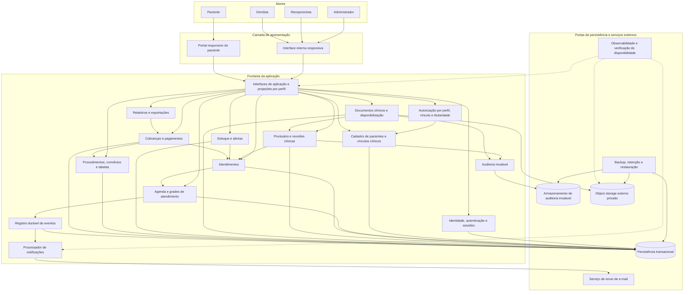
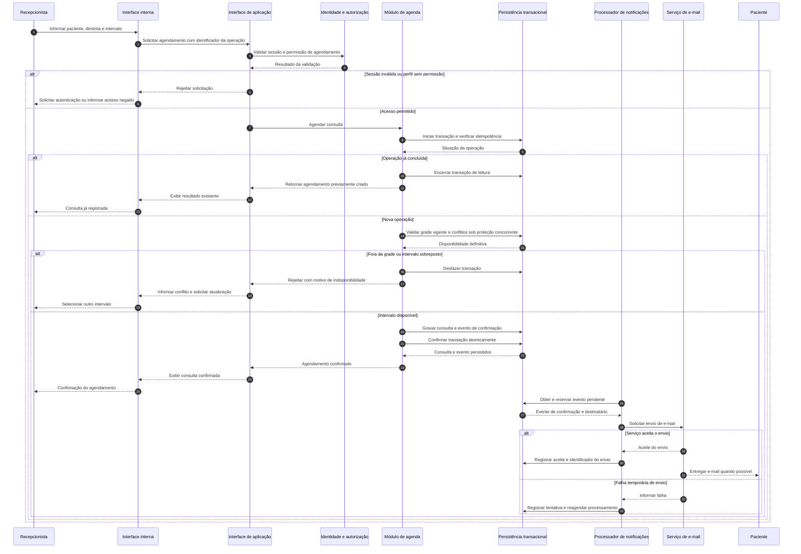
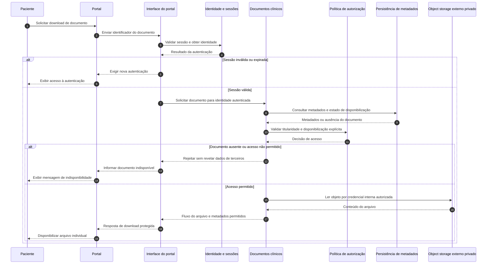

# Relatório Técnico de Arquitetura de Software

**Sistema:** Gestão de Clínica Odontológica — M02  
**Equipe:** AI4ES — Time 2  
**Escopo:** 25 requisitos funcionais, 11 requisitos não funcionais e 12 histórias de usuário.  
**Nível de arquitetura:** lógico e conceitual, tecnologicamente neutro.  
**Status:** proposta arquitetural rastreável, sujeita à resolução das pendências indicadas neste relatório.

## 1. Identificação das HUs

| HU | Perfil | Capacidade e critérios de aceite relevantes | Requisitos relacionados |
|---|---|---|---|
| HU01 | Recepcionista | Visualizar agenda unificada diária e semanal; distinguir disponibilidade e dentistas; filtrar por profissional. | RF03, RF04, RNF06 |
| HU02 | Recepcionista | Agendar, cancelar e remarcar dentro da grade; impedir sobreposição; notificar automaticamente por e-mail. | RF05–RF08 |
| HU03 | Recepcionista | Registrar pagamentos totais ou parciais; identificar cobranças abertas; atualizar status imediatamente. | RF21 |
| HU04 | Dentista | Registrar data, procedimento e observações; identificar automaticamente o responsável; apresentar histórico decrescente. | RF09, RF10, RF13, RNF05 |
| HU05 | Dentista | Anexar JPEG, PNG e PDF; registrar metadados; restringir acesso clínico. | RF11, RF12, RNF03, RNF07 |
| HU06 | Dentista | Consultar histórico e documentos em abas; localizar paciente por nome ou CPF; controlar acesso ao prontuário. | RF09, RF12, RNF02, RNF03 |
| HU07 | Dentista | Gerar cobrança com procedimentos cadastrados; aplicar tabela do convênio; disponibilizar cobrança à recepção. | RF18–RF20 |
| HU08 | Administrador | Cadastrar dentistas; configurar dias e faixas de atendimento; preservar agendamentos existentes ao alterar a grade. | RF01, RF03, RF07 |
| HU09 | Administrador | Cadastrar materiais e mínimos; destacar alertas com saldo; registrar reposição a partir do alerta. | RF14–RF16 |
| HU10 | Administrador | Filtrar faturamento por período, dentista e modalidade; agrupar e discriminar procedimentos; exportar CSV ou PDF. | RF22 |
| HU11 | Paciente | Autenticar-se no portal; consultar agendamentos futuros e histórico com procedimentos realizados. | RF23, RF24, RNF01 |
| HU12 | Paciente | Consultar e baixar documentos explicitamente disponibilizados; não acessar anotações internas. | RF25, RNF03 |

**Requisitos que exigem tratamento além das HUs:**

- **RF01–RF02:** cadastro de todos os perfis e política de autorização transversal.
- **RF13 e RNF05:** rastreabilidade das entradas e imutabilidade das alterações clínicas.
- **RF14:** inclui equipamentos, embora HU09 trate principalmente de materiais.
- **RF17:** consumo de material vinculado ao atendimento, sem HU específica.
- **RF18–RF19:** manutenção dos catálogos e tabelas financeiras, além de seu uso em HU07.
- **RNF04 e RNF08–RNF11:** credenciais, disponibilidade, experiência de uso, compatibilidade e recuperação.

**Convenções deste relatório:**

- **Exigido:** diretamente derivado de RF, RNF ou critério de aceite.
- **Decisão proposta:** solução arquitetural recomendada para satisfazer os requisitos.
- **Pendente:** regra não suficientemente especificada, que requer validação do responsável pelo produto.

## 2. Diagramas de Arquitetura (Mermaid)

### 2.1. Componentes e dependências conceituais

A solução é organizada em módulos de negócio com interfaces explícitas. Os módulos não implicam serviços distribuídos independentes.

**Regras de leitura:**

- As interfaces da aplicação autenticam e autorizam cada operação antes de executar a regra de negócio.
- Cada módulo é proprietário de suas regras e de seus dados lógicos; outros módulos usam interfaces, não alterações diretas nas estruturas internas.
- O armazenamento documental é externo ao servidor da aplicação, conforme RNF07.
- O registro durável de eventos permite desacoplar o envio de e-mails da confirmação transacional do agendamento.
- Auditoria e backup têm responsabilidades distintas: backup não substitui um histórico imutável.

### 2.2. Sequência — agendamento com controle de concorrência e notificação

**Garantias complementares:**

- A disponibilidade exibida na interface é informativa; a decisão definitiva ocorre na gravação protegida contra concorrência.
- Cancelamento e remarcação também persistem a mudança e o respectivo evento na mesma transação.
- Na remarcação, a reserva anterior só é liberada se a nova reserva puder ser confirmada atomicamente.
- Falha de e-mail não desfaz uma consulta confirmada.
- Aceite pelo serviço de e-mail não equivale a entrega comprovada ao paciente; o acompanhamento de entrega depende das capacidades da integração.

### 2.3. Sequência — download autorizado de documento pelo paciente

A entrega mediada é uma decisão proposta para manter a autorização no momento do acesso. O paciente nunca recebe credenciais do armazenamento nem acesso ao prontuário interno.

## 3. Decisões de Arquitetura

### 3.1. Organização modular e interfaces

| Decisão | Definição e justificativa | Rastreabilidade |
|---|---|---|
| DA01 — Aplicação modular | Separar identidade, agenda, atendimento, prontuário, documentos, estoque e faturamento. Adotar inicialmente uma aplicação modular, com processamento assíncrono de notificações, evitando distribuição prematura. | RF01–RF25 |
| DA02 — Interfaces por caso de uso | Expor operações conceituais como `AgendarConsulta`, `RegistrarProcedimento`, `DisponibilizarDocumento` e `RegistrarPagamento`. Validar entrada, identidade e autorização no servidor. | RF02, HU02–HU07, HU12 |
| DA03 — Persistência transacional | Garantir atomicidade nos invariantes de agenda, revisões clínicas, movimentações de estoque e pagamentos. Estruturas físicas e tecnologias ficam para o projeto detalhado. | RF06, RF13, RF15, RF21, RNF05 |
| DA04 — Processamento assíncrono confiável | Persistir eventos de notificação junto à alteração da agenda; processar com tentativas controladas, identificação de duplicidades e acompanhamento de falhas. | RF08, HU02 |
| DA05 — Projeções específicas por perfil | Produzir respostas próprias para recepção, dentista, administrador e paciente, evitando enviar dados sensíveis para depois ocultá-los na interface. | RF02, RF12, RF24, RF25, HU12 |

### 3.2. Modelo de domínio e invariantes

| Agregado ou entidade | Responsabilidade e regras essenciais |
|---|---|
| **Usuário / Perfil / Sessão** | Identidade autenticada, perfil autorizado e controle de atividade. Paciente e dentista possuem cadastros de domínio vinculáveis às identidades de acesso. |
| **Paciente / Vínculo clínico** | Identificação do paciente e associação autorizada com dentistas. O vínculo é uma condição explícita de acesso, não inferida apenas pelo perfil. |
| **Agenda / Grade / Consulta** | Uma agenda por dentista; grade individual; consulta com paciente, dentista, início, fim e estado. Alterações de grade preservam consultas existentes. |
| **Atendimento** | Representa a execução clínica, distinta da reserva de horário; concentra referências para procedimentos realizados, consumo e cobrança. |
| **Prontuário / Entrada / Revisão** | Um prontuário por paciente. Entradas identificam o autor clínico, a data do procedimento e o instante de registro. Edições criam revisões sem destruir o histórico. |
| **Documento clínico** | Metadados, referência privada ao objeto, paciente, dentista responsável e estado explícito de disponibilização ao paciente. |
| **Item de estoque / Movimentação** | Cadastro de materiais e equipamentos; entradas e saídas de materiais; saldo e mínimo; referência opcional ao atendimento nas saídas por consumo. |
| **Procedimento / Convênio / Tabela** | Catálogo de procedimentos, preços particulares e preços associados ao convênio. |
| **Cobrança / Item de cobrança / Pagamento** | Uma cobrança por atendimento; itens discriminados; modalidade particular ou convênio; múltiplos pagamentos para suportar quitação parcial. |
| **Evento de auditoria** | Registro imutável de autoria, instante, operação e referência à revisão clínica afetada. |

**Invariantes propostos:**

1. **Não sobreposição:** consultas que ocupam a agenda não podem ter interseção de intervalos para o mesmo dentista. Recomenda-se representar intervalos como `[início, fim)`, permitindo consultas consecutivas.
2. **Grade preservada:** novas reservas e novas remarcações obedecem à grade aplicável; reservas já confirmadas não são alteradas automaticamente por uma mudança de grade.
3. **Autoria clínica:** o dentista responsável é obtido da identidade autenticada, não de um campo livre informado pelo cliente.
4. **Histórico clínico:** correções geram novas revisões. A consulta apresenta a versão corrente e mantém acesso autorizado ao histórico.
5. **Consumo consistente:** registrar consumo vinculado ao atendimento e debitar o estoque constituem uma única operação lógica, protegida contra repetição.
6. **Cobrança única:** solicitações repetidas de geração não produzem duas cobranças para o mesmo atendimento.
7. **Valores preservados:** itens da cobrança guardam descrição e valor aplicado no momento da emissão; alterações posteriores de catálogo não reescrevem cobranças existentes.
8. **Saldo financeiro:** o saldo é o total da cobrança menos pagamentos válidos. O registro de pagamento e a atualização do status ocorrem atomicamente, com controle concorrente.
9. **Estados financeiros mínimos propostos:** aberta, parcialmente paga e quitada. Cobranças parcialmente pagas permanecem na listagem de valores em aberto.
10. **Histórico do portal:** procedimentos apresentados derivam dos atendimentos realizados, não apenas do catálogo ou da passagem do horário agendado.

As políticas de estorno, sobrepagamento, estados completos da consulta e estoque negativo permanecem pendentes.

### 3.3. Segurança, privacidade e rastreabilidade

**Autenticação e sessão — RNF01 e RNF04**

- Exigir autenticação nas interfaces de negócio.
- Invalidar sessões no servidor quando a inatividade ultrapassar 30 minutos; a interface não é a autoridade sobre a expiração.
- Armazenar senhas com hash seguro apropriado para senhas, salt individual e parâmetros revisáveis.
- Definir em projeto detalhado o que conta como atividade, evitando que atualizações automáticas de tela mantenham indefinidamente uma sessão sem interação humana.
- Propor recuperação de acesso e proteção contra tentativas automatizadas, com regras a validar.

**Autorização — RF02, RF12 e RNF03**

| Perfil | Permissões derivadas do escopo | Limites |
|---|---|---|
| Administrador | Gerenciar usuários, dentistas, grades e estoque; consultar relatórios. | O perfil administrativo não concede acesso clínico por si só. |
| Recepcionista | Consultar agendas, agendar, cancelar, remarcar e registrar pagamentos. | Sem acesso às anotações internas ou documentos clínicos por esse perfil. |
| Dentista | Consultar e editar prontuários autorizados; anexar e disponibilizar documentos; gerar cobrança do atendimento. | Restrito a pacientes vinculados; operações financeiras e clínicas devem validar o contexto do atendimento. |
| Paciente | Consultar seus agendamentos, histórico permitido e documentos disponibilizados. | Sem acesso a outros pacientes ou às anotações internas. |

**Resolução provisória de ambiguidades:**

- **HU06 × RF12/RNF03:** “dentistas da clínica” é interpretado como condição necessária, mas insuficiente. Aplica-se também o vínculo com o paciente. A interpretação mais restritiva deve ser ratificada.
- **HU05/RNF03 × HU12:** ser o próprio paciente não torna todos os documentos automaticamente visíveis. O portal exige também disponibilização explícita pelo dentista.
- Na ausência de regra de permissão, a decisão padrão é negar acesso.

**Documentos e proteção de dados — RNF02, RNF03 e RNF07**

- Object storage externo privado, desacoplado do servidor.
- Validação de JPEG, PNG e PDF por conteúdo e formato, não apenas pela extensão.
- Recomenda-se verificação de segurança dos arquivos antes de torná-los disponíveis.
- Metadados mínimos: nome, tipo, data de upload, dentista responsável, paciente e referência ao objeto.
- Controlar estados de envio e conclusão para evitar documentos publicados sem objeto válido e objetos órfãos sem metadados.
- Propor criptografia em trânsito e em repouso, gestão restrita de chaves e minimização de dados em mensagens e registros operacionais.
- E-mails de agenda não devem incluir observações clínicas ou anexos de prontuário.

**Auditoria — RF13 e RNF05**

- Registrar usuário, data e hora de cada modificação, operação e revisão afetada.
- Distinguir data clínica declarada do procedimento e instante técnico da gravação.
- Persistir revisão e evidência auditável de forma atômica: uma alteração não pode ser confirmada sem seu registro de rastreabilidade.
- Usar armazenamento de anexação com proteção contra alteração e exclusão, acesso segregado e verificação de integridade.
- A indisponibilidade do mecanismo de auditoria deve impedir uma alteração clínica que não possa ser rastreada.
- A escolha dessas medidas não constitui, isoladamente, comprovação de conformidade com LGPD e normas do CFO; a política de tratamento e retenção requer validação especializada.

### 3.4. Desempenho, disponibilidade e operação

| Tema | Decisão proposta | Evidência necessária |
|---|---|---|
| Agenda em até 3 segundos | Consultas por intervalo e dentista, acesso eficiente aos dados, projeção enxuta para visão diária/semanal e ausência de documentos clínicos nessa resposta. | Teste ponta a ponta incluindo todos os dentistas no cenário de carga acordado. |
| Disponibilidade de 99,5% | Reduzir pontos únicos de falha conforme análise de risco; monitorar jornadas críticas; preparar recuperação e procedimentos de incidente. Falha de e-mail não bloqueia agendamentos. | Medição durante o horário de funcionamento, com calendário, janela e critérios de indisponibilidade definidos. |
| Documentos externos | Separar capacidade documental da capacidade de processamento da aplicação. Falha documental deve ser reportada sem derrubar agenda e faturamento. | Testes de indisponibilidade, autorização e recuperação do armazenamento externo. |
| Backup diário | Automatizar cópias dos dados transacionais, objetos clínicos e auditoria, com retenção mínima de 30 dias e acesso protegido. | Histórico de execução e testes periódicos de restauração consistente entre metadados e arquivos. |
| Interface responsiva | Adaptar agendas, formulários, tabelas e portal a dispositivos móveis e desktops. | Testes em resoluções representativas e jornadas dos quatro perfis. |
| Navegadores | Verificar funcionamento em Chrome, Firefox, Safari e Edge, conforme versões suportadas a acordar. | Matriz de compatibilidade e testes de upload, download, agenda e exportação. |
| Observabilidade | Medir latência, disponibilidade, falhas de backup, tentativas de notificação e falhas de autorização, sem expor dados clínicos. | Painéis, alertas e procedimentos operacionais validados. |

A retenção de backups por 30 dias não define o prazo de guarda legal do prontuário.

## 4. Tabela de Componentes e Rastreabilidade

| Componente | Responsabilidade Principal | Comunica-se com | Origem (HU / Critério de Aceite) |
|---|---|---|---|
| Interface interna | Oferecer jornadas responsivas por perfil, agenda diária/semanal e formulários operacionais. | Interfaces de aplicação | HU01–HU10; RNF09–RNF10 |
| Portal do paciente | Exibir agenda futura, histórico permitido e download individual. | Interfaces do portal, identidade | HU11; HU12: documentos liberados e ausência de notas internas; RF23–RF25 |
| Interfaces de aplicação | Validar contratos, aplicar autenticação/autorização e entregar projeções mínimas por perfil. | Identidade, autorização, módulos de negócio | RF02; HU01–HU12 |
| Identidade e sessões | Cadastrar identidades e perfis, autenticar, proteger credenciais e expirar sessões. | Persistência, interfaces de aplicação | HU08: cadastro de dentista; HU11: autenticação; RF01; RNF01, RNF04 |
| Autorização contextual | Avaliar perfil, vínculo clínico, titularidade e disponibilização documental. | Identidade, vínculos, módulos protegidos | HU05, HU06, HU12; RF02, RF12; RNF03 |
| Cadastro de pacientes e vínculos | Manter identificação e relações paciente–dentista; localizar pacientes por nome ou CPF. | Identidade, autorização, agenda, prontuário | HU06: busca; RF09, RF12; RNF03 |
| Agenda e grades | Manter agenda individual e unificada, grades, reservas, cancelamentos e remarcações sem sobreposição. | Atendimentos, persistência, eventos | HU01, HU02, HU08; RF03–RF07; RNF06 |
| Atendimentos | Identificar a execução clínica e integrar procedimentos, consumo e cobrança. | Agenda, prontuário, estoque, faturamento | HU04, HU07, HU11; RF10, RF17, RF20 |
| Prontuário e revisões | Manter histórico completo, registrar e corrigir entradas com autoria e ordem cronológica decrescente. | Atendimentos, documentos, autorização, auditoria | HU04; HU06: histórico em abas; RF09–RF13; RNF05 |
| Documentos clínicos | Validar uploads, manter metadados, controlar disponibilização e autorizar downloads. | Prontuário, autorização, object storage, auditoria | HU05: JPEG, PNG, PDF e metadados; HU12; RF11, RF25; RNF03, RNF07 |
| Adaptador de object storage | Encapsular gravação e leitura privada dos arquivos externos. | Documentos, serviço externo, backup | HU05, HU12; RNF07 |
| Auditoria imutável | Preservar evidências de alterações clínicas sem sobrescrita. | Prontuário, documentos, armazenamento de auditoria | HU04: rastreabilidade; RF13; RNF05 |
| Estoque e alertas | Cadastrar materiais/equipamentos, registrar movimentos e consumos; destacar saldo no limite ou abaixo; permitir reposição pelo alerta. | Atendimentos, interface administrativa, persistência | HU09; RF14–RF17 |
| Catálogo de procedimentos e convênios | Manter códigos, descrições, valores e tabelas de convênio. | Faturamento, interface de manutenção | HU07: seleção e preço automático; RF18–RF19 |
| Cobranças e pagamentos | Emitir cobrança única, discriminar itens e modalidade, registrar pagamentos parciais/totais e atualizar saldo/status. | Atendimentos, catálogos, relatórios | HU03, HU07; RF20–RF21 |
| Relatórios e exportações | Filtrar e agrupar faturamento por período, dentista, modalidade e procedimento; exportar CSV/PDF. | Faturamento, interface administrativa | HU10; RF22 |
| Eventos e notificações | Registrar eventos duráveis e enviar e-mails de confirmação, cancelamento e remarcação com tratamento de falhas. | Agenda, persistência, serviço de e-mail | HU02: e-mail automático; RF08 |
| Backup e restauração | Realizar cópias diárias, reter por pelo menos 30 dias e recuperar dados e documentos de forma consistente. | Persistência, auditoria, object storage | RNF11, sem HU específica |
| Observabilidade e continuidade | Medir desempenho/disponibilidade e apoiar resposta a incidentes. | Aplicação, processadores e dependências | RNF06, RNF08, sem HU específica |

## 5. Bloqueios e Pendências

Não há evidência de impedimento para iniciar a estrutura modular e os contratos básicos. Entretanto, as pendências abaixo bloqueiam a validação final de determinadas regras e dos critérios de produção.

| ID | Pendência | Consequência | Responsável sugerido | Encaminhamento |
|---|---|---|---|---|
| P01 | Definição de “próprios pacientes” e do vínculo clínico. | Impede finalizar autorização e busca de prontuários. | Produto e responsável clínico | Definir criação, vigência, revogação, substituição e eventual compartilhamento do vínculo; ratificar a leitura restritiva de HU06. |
| P02 | Duração de consultas, estados, bloqueios, exceções de grade e fuso horário. | Afeta cálculo de disponibilidade e sobreposição. | Produto e recepção | Formalizar intervalos, estados que ocupam agenda e tratamento de feriados/ausências. |
| P03 | Relação entre consulta, atendimento e encerramento clínico. | Afeta histórico do portal, consumo e momento de cobrança. | Produto e responsável clínico | Definir início, conclusão, faltas e eventuais atendimentos sem agendamento. |
| P04 | Regras financeiras complementares. | Impede fechar casos de correção e relatórios. | Responsável financeiro | Definir vigência de tabelas, competência, descontos, estornos, sobrepagamento e devedor em convênio. |
| P05 | Política de proteção e guarda de dados. | Bloqueia aprovação de conformidade para produção. | Governança de dados e responsável jurídico/clínico | Validar bases de tratamento, retenção, acesso, correção, descarte e atendimento aos direitos do titular. |
| P06 | Política documental. | Afeta capacidade, segurança e ciclo de disponibilização. | Produto e responsável clínico | Definir tamanho máximo, quantidade, substituição, retirada de acesso e acesso após fim do vínculo. |
| P07 | Carga e medição dos RNFs. | Não permite comprovar 3 segundos e 99,5%. | Produto, arquitetura e operação | Fixar quantidade de dentistas, volume, concorrência, ambiente, horário de funcionamento e método de medição. |
| P08 | Objetivos de recuperação. | Backup diário não garante tempo de retorno aceitável. | Operação e gestão da clínica | Aprovar perda máxima tolerável de dados e tempo máximo de recuperação; planejar simulação de restauração. |
| P09 | Permissões não explicitadas. | Pode ampliar acesso indevidamente. | Produto e segurança | Definir quem mantém pacientes, convênios e procedimentos e quem registra consumos; esclarecer múltiplos perfis e desligamento de usuários. |
| P10 | Regras de estoque e equipamentos. | Afeta consistência de saldo e abrangência do módulo. | Administração da clínica | Definir unidade de medida, ajustes, estoque negativo e se equipamentos exigem controle além do cadastro quantitativo. |
| P11 | Prazo e falhas de e-mail. | O envio automático fica sem critério temporal de aceite. | Produto e operação | Definir prazo esperado, tentativas, tratamento de destinatário inválido e escalonamento de falhas. |

## 6. Cobertura de Requisitos

### 6.1. Requisitos funcionais

A cobertura abaixo significa **alocação arquitetural**, não implementação nem aceite homologado.

| Requisito | Realização arquitetural | Verificação principal |
|---|---|---|
| RF01 | Identidade, perfis e cadastro vinculado de dentista/paciente. | Cadastrar usuários dos quatro perfis. |
| RF02 | Autorização central e validação contextual no servidor. | Testes positivos e negativos por operação, perfil e titularidade. |
| RF03 | Agenda individual por dentista. | Isolamento e identificação das agendas. |
| RF04 | Projeção unificada para recepção. | Visões diária/semanal, distinção visual e filtro. |
| RF05 | Operações de agendamento, cancelamento e remarcação. | Executar os três fluxos para diferentes dentistas. |
| RF06 | Validação transacional concorrente dos intervalos. | Duas solicitações simultâneas conflitantes não podem ser confirmadas. |
| RF07 | Grades individuais com aplicação temporal. | Configurar dias/faixas e preservar reservas existentes. |
| RF08 | Eventos duráveis e processador de e-mail. | Gerar os três tipos de notificação e recuperar falha temporária. |
| RF09 | Prontuário único e histórico clínico por paciente. | Consultar histórico completo, sem duplicar prontuários. |
| RF10 | Registro de procedimento associado ao atendimento. | Registrar durante e após atendimento com campos exigidos. |
| RF11 | Metadados documentais e object storage externo. | Enviar, armazenar e recuperar arquivo autorizado. |
| RF12 | Autorização por vínculo e edição por revisão. | Permitir dentista vinculado e negar não vinculado. |
| RF13 | Identificação automática do dentista e instante da entrada. | Verificar autoria e timestamps não manipuláveis pelo cliente. |
| RF14 | Cadastro quantitativo de materiais e equipamentos. | Cadastrar nome, saldo e mínimo para ambos. |
| RF15 | Registro transacional de entradas e saídas. | Reconciliar saldo com movimentações. |
| RF16 | Alerta para saldo menor ou igual ao mínimo. | Testar abaixo, igual e acima do limiar. |
| RF17 | Movimento de consumo referenciado ao atendimento. | Rastrear consumo e impedir débito duplicado. |
| RF18 | Catálogo de procedimentos e preços. | Manter código, descrição e valor. |
| RF19 | Convênios e respectivas tabelas. | Associar procedimentos e valores a cada convênio. |
| RF20 | Cobrança única com itens e modalidade. | Emitir particular/convênio e validar discriminação e preços. |
| RF21 | Pagamentos múltiplos e saldo/status transacionais. | Registrar parcial e total; verificar atualização imediata e cobranças abertas. |
| RF22 | Relatórios com filtros, agrupamentos e exportação. | Reconciliar totais e verificar CSV/PDF. |
| RF23 | Portal web autenticado e responsivo. | Acessar jornadas do paciente com sessão válida. |
| RF24 | Projeção de consultas futuras e histórico próprio. | Conferir datas, dentistas e procedimentos realizados. |
| RF25 | Disponibilização explícita e download autorizado. | Permitir documento liberado e negar não liberado ou de terceiros. |

### 6.2. Requisitos não funcionais

| Requisito | Tratamento arquitetural | Evidência para aceite |
|---|---|---|
| RNF01 | Autenticação e expiração por inatividade no servidor. | Testar acesso anônimo e sessão após mais de 30 minutos inativa. |
| RNF02 | Minimização, autorização, proteção de dados, auditoria e política de ciclo de vida. | Revisão documentada de conformidade, controles e procedimentos. |
| RNF03 | Armazenamento privado e autorização por vínculo/titularidade, com liberação no portal. | Testes de acesso direto, identificadores de terceiros e vínculo revogado. |
| RNF04 | Hash seguro de senha com salt e parâmetros controlados. | Inspeção do armazenamento e dos fluxos de credenciais. |
| RNF05 | Revisões e logs imutáveis gravados sem lacuna de auditoria. | Alterar prontuário e demonstrar autoria, horário e resistência a adulteração. |
| RNF06 | Consulta otimizada da agenda unificada. | Carregamento em até 3 segundos no cenário acordado. |
| RNF07 | Object storage externo por interface própria. | Demonstrar independência do armazenamento local do servidor. |
| RNF08 | Monitoramento, continuidade e recuperação. | Apuração de uptime mínimo de 99,5% no horário definido. |
| RNF09 | Interfaces responsivas. | Jornadas funcionais em dispositivos móveis e desktops. |
| RNF10 | Compatibilidade com os quatro navegadores indicados. | Matriz de testes nas versões acordadas. |
| RNF11 | Backup diário e retenção mínima de 30 dias. | Evidências de execução, retenção e restauração de dados e arquivos. |

### 6.3. Síntese da cobertura

| Conjunto | Cobertura arquitetural | Ressalva |
|---|---:|---|
| Requisitos funcionais | 25/25 alocados | Parte das regras depende de decisões de negócio registradas na seção 5. |
| Requisitos não funcionais | 11/11 tratados | Conformidade, desempenho, disponibilidade e recuperação exigem comprovação. |
| Histórias de usuário | 12/12 mapeadas | Todos os critérios possuem componente responsável; ambiguidades estão explicitadas. |

**Critérios adicionais das HUs preservados na arquitetura:** pagamentos parciais, exportação CSV/PDF, formatos JPEG/PNG/PDF, busca por nome/CPF, organização por abas, histórico decrescente, preservação de reservas existentes e disponibilização documental explícita.

## 7. Gap Analysis

### 7.1. Lacunas reais, impactos e ações

| Gap | Lacuna de especificação | Impacto arquitetural | Ação recomendada ao time |
|---|---|---|---|
| G01 — Vínculo clínico | Não há regra para estabelecer ou encerrar o vínculo paciente–dentista; HU06 admite leitura mais ampla que RF12. | Políticas de autorização, busca e revogação podem ficar inconsistentes. | Criar uma decisão de negócio sobre vínculo e testes de acesso para dentista vinculado, não vinculado, substituto e desligado. |
| G02 — Ciclo clínico | A transição entre consulta agendada, atendimento realizado e encerramento não está definida. | Histórico, consumo e cobrança podem representar eventos diferentes. | Modelar estados e transições; definir quando procedimentos passam a compor o histórico e quando a cobrança pode ser emitida. |
| G03 — Temporalidade da agenda | Não estão definidos duração, estados impeditivos, exceções nem significado preciso de “agendamentos futuros” após mudança de grade. | Risco de sobreposição e alteração indevida de reservas existentes. | Formalizar intervalos e vigência; testar concorrência, consultas adjacentes, cancelamento e remarcação com conflito. |
| G04 — Ciclo financeiro | Não há regra para vigência de preços, estornos, correções, sobrepagamento e responsabilidade de pagamento em convênio. | Pode exigir revisão de cobrança, eventos compensatórios e segregação de devedores. | Especificar cenários financeiros antes de fechar contratos de emissão e pagamento; preservar preços já emitidos. |
| G05 — Significado de faturamento | Não foi definido se o período usa data do atendimento, emissão ou recebimento. | Relatórios podem produzir totais divergentes apesar de tecnicamente corretos. | Aprovar dicionário de indicadores e massa de teste com pagamentos parciais em períodos diferentes. |
| G06 — Guarda e correção clínica | Faltam prazos legais e regras de correção, arquivamento e descarte de prontuários/documentos. | Afeta revisões, retenção, auditoria e eliminação em backups. | Validar política com responsáveis competentes e converter obrigações em controles e testes; não confundir exclusão solicitada com exclusão automaticamente permitida. |
| G07 — Ciclo documental | Não há limites de upload nem regras de substituição, revogação de disponibilização ou acesso por representantes. | Afeta dimensionamento, autorização e comportamento de downloads. | Definir limites e transições; manter representação de menores/responsáveis fora do escopo até aprovação explícita. |
| G08 — Orçamento de desempenho | O limite de 3 segundos não informa volume, concorrência, rede ou método de medição. | Não é possível dimensionar nem reproduzir o aceite. | Estabelecer cenário representativo e medir a jornada completa, sem substituir o limite por uma média não aprovada. |
| G09 — Continuidade | Uptime não tem calendário/janela definidos; backup não possui objetivos de perda e recuperação. | Redundância e plano de recuperação ficam sem alvo verificável. | Definir calendário, cálculo de disponibilidade, objetivos de recuperação e ensaio de restauração conjunta de dados e objetos. |
| G10 — Estoque e equipamentos | Não há HU para RF17 nem política de unidades, ajustes ou estoque negativo; equipamentos podem ser apenas cadastro ou patrimônio. | Risco de ampliar indevidamente o módulo ou permitir saldos incorretos. | Criar HU de consumo por atendimento; esclarecer limites do controle de equipamentos e regras de movimentação. |
| G11 — Gestão de acesso | Faltam recuperação de conta, convite ao portal, múltiplos perfis e desligamento. | Afeta vínculo de identidade, revogação de sessões e segregação de funções. | Detalhar o ciclo de vida das contas e uma matriz de permissões aprovada, mantendo negação por padrão. |
| G12 — Operação de notificações | Não há prazo de envio, limite de tentativas ou comportamento para e-mail inválido. | Filas de falha podem crescer sem tratamento e pacientes podem não ser informados. | Definir indicadores, política de repetição e tratamento operacional, distinguindo agendamento confirmado de e-mail entregue. |
| G13 — Compatibilidade e usabilidade | “Navegadores modernos” e funcionamento adequado não especificam versões nem critérios verificáveis. | Testes e suporte podem ficar indefinidos. | Aprovar matriz de versões/dispositivos e critérios de uso da agenda em telas pequenas; pactuar requisitos de acessibilidade. |

### 7.2. Prioridade de refinamento

1. **Antes de consolidar o modelo de domínio:** vínculo clínico, estados de consulta/atendimento, temporalidade da agenda e regras financeiras.
2. **Antes de implementar acesso a dados clínicos:** matriz de permissões, disponibilização documental, revisões e auditoria atômica.
3. **Antes de homologar integrações:** limites de arquivos, recuperação de falhas de upload e política de notificações.
4. **Antes de entrar em produção:** validação LGPD/CFO, testes concorrentes, desempenho de agenda, disponibilidade, compatibilidade e restauração comprovada.

**Conclusão:** a arquitetura proposta aloca todo o escopo informado e separa responsabilidades clínicas, administrativas e financeiras. As principais decisões ainda necessárias concentram-se nas regras de vínculo, temporalidade, ciclo financeiro e governança dos dados. A rastreabilidade está estabelecida; o aceite final depende da resolução dessas lacunas e das evidências de teste indicadas.