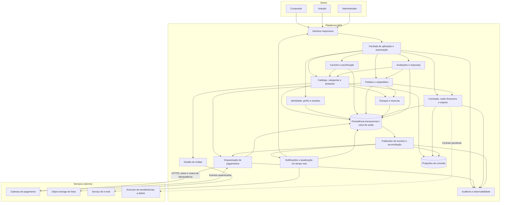

# Relatório Técnico de Arquitetura de Software

**Sistema:** Marketplace de Produtos Artesanais — M03  
**Equipe:** AI4ES — Time 2  
**Status:** arquitetura conceitual proposta, com decisões condicionadas às pendências identificadas.  
**Base de análise:** 30 requisitos funcionais, 13 requisitos não funcionais e 12 histórias de usuário.

## 1. Identificação das HUs

As histórias são organizadas por capacidade de negócio. Critérios de aceite que ampliam os RF são tratados como requisitos de arquitetura, não como funcionalidades opcionais.

| HU | Perfil | Capacidade e critérios arquiteturalmente relevantes | RF relacionados |
|---|---|---|---|
| HU01 | Artesão | Cadastro com campos obrigatórios, múltiplas fotos e visibilidade imediatamente após publicação. | RF04–RF06 |
| HU02 | Artesão | Atualização manual do estoque, baixa após confirmação, indicação de indisponibilidade e bloqueio de compra. | RF07–RF09 |
| HU03 | Artesão | Consulta dos pedidos, progressão de status e notificação do comprador na plataforma. | RF19–RF22 |
| HU04 | Artesão | Histórico financeiro por venda, comissão aplicada, valores líquidos, totais por período e saldo disponível. | RF26–RF29 |
| HU05 | Artesão | Solicitação de saque com dados bancários, data, valor e status; redução imediata do saldo disponível. | RF29–RF30 |
| HU06 | Artesão | Resposta pública única por avaliação, sem edição ou exclusão pelo autor após publicação. | RF25 |
| HU07 | Comprador | Navegação por categorias, pesquisa parcial durante digitação, resumo público e exclusão padrão de itens sem estoque na busca. | RF10–RF11, RF24 |
| HU08 | Comprador | Carrinho multiartesão, resumo consolidado, pagamento único e confirmação por e-mail; falha de pagamento sem baixa de estoque. | RF08–RF09, RF13–RF19, RF22 |
| HU09 | Comprador | Histórico das compras e atualização em tempo real, com status individual por subpedido. | RF20–RF22 |
| HU10 | Comprador | Avaliação individual após entrega, nota de 1 a 5, comentário e unicidade por item comprado. | RF23–RF24 |
| HU11 | Administrador | Gestão de categorias, confirmação explícita para remoção de categoria com produtos ativos e aviso para reclassificação. | RF12 |
| HU12 | Administrador | Comissão configurável e visível ao artesão; alterações prospectivas e auditadas. | RF26–RF28 |

**Requisitos transversais sem HU específica:**

- **RF01–RF03:** cadastro, autenticação, encerramento de sessão e coexistência dos perfis comprador/artesão.
- **RNF01–RNF13:** segurança, desempenho, disponibilidade, interoperabilidade, privacidade, rastreabilidade e operação.
- Não há HU específica para processamento efetivo dos saques, reconciliação financeira, recuperação de acesso ou tratamento de estornos. Essas ausências são registradas nas seções 5 e 7.

## 2. Diagramas de Arquitetura (Mermaid)

### 2.1. Visão de componentes e fronteiras

Os componentes representam responsabilidades lógicas. **Não implicam serviços implantados separadamente.** A proposta inicial mantém pedidos, estoque e escrituração financeira sob uma fronteira transacional local, com integrações externas desacopladas.



**Interfaces conceituais principais:**

- **Comandos:** cadastrar/publicar produto, alterar estoque, finalizar compra, avançar subpedido, avaliar item, responder avaliação, configurar comissão e solicitar saque.
- **Consultas:** catálogo paginado, busca parcial, resumo do carrinho, histórico de pedidos, painel financeiro e avaliações públicas.
- **Eventos internos:** `PedidoConfirmado`, `SubpedidoAtualizado`, `ComissaoAlterada`, `SaqueSolicitado` e `CategoriaRemovida`.
- **Integrações:** iniciar/consultar pagamento, receber eventos autenticados, armazenar fotos e enviar e-mail.
- **Dados de cartão:** coletados e tokenizados em interface segura do provedor; não atravessam a persistência nem os logs da plataforma.

### 2.2. Sequência de checkout multiartesão e confirmação

A reserva reduz a quantidade **disponível para novas compras**, mas não reduz o estoque físico. A baixa definitiva ocorre somente na confirmação local do pedido após comprovação da aprovação do pagamento.

```mermaid
sequenceDiagram
    autonumber
    participant C as Comprador
    participant UI as Interface
    participant O as Orquestrador de pedidos
    participant D as Persistência transacional
    participant P as Adaptador de pagamento
    participant G as Gateway de pagamento
    participant R as Processador de eventos e reconciliação
    participant N as Notificações
    participant A as Artesão

    C->>UI: Finalizar compra
    UI->>O: Checkout com chave de idempotência
    O->>D: Consultar tentativa e revalidar preços, publicação e estoque

    alt Tentativa já existente
        D-->>O: Pedido e estado da tentativa anterior
        O-->>UI: Retornar o mesmo resultado conhecido
    else Nova tentativa sem disponibilidade
        D-->>O: Item indisponível ou quantidade insuficiente
        O-->>UI: Recusar checkout sem iniciar pagamento
    else Nova tentativa válida
        O->>D: Transação: criar pedido, subpedidos e reservas
        D-->>O: Commit da preparação
        O->>P: Iniciar pagamento único com chave estável
        P->>G: Solicitar pagamento por HTTPS
        G-->>P: Identificador e estado inicial
        P-->>O: Referência da operação
        O->>D: Registrar referência de pagamento
        O-->>UI: Pedido aguardando pagamento

        G->>P: Evento de mudança de estado
        P->>P: Validar autenticidade e estrutura
        P->>D: Persistir evento recebido com deduplicação
        D-->>P: Evento duravelmente registrado
        P-->>G: Confirmar recebimento

        R->>D: Ler evento pendente
        R->>P: Obter estado autoritativo do pagamento
        P->>G: Consultar operação
        G-->>P: Estado confirmado pelo provedor
        P-->>R: Resultado da consulta

        alt Pagamento recusado ou cancelado sem cobrança
            R->>D: Transação: registrar falha e liberar reservas
            Note over R,D: Nenhuma baixa de estoque físico
        else Estado incerto ou ainda pendente
            R->>D: Manter pendência e programar reconciliação
            Note over R,D: Não repetir cobrança nem liberar reserva sem decisão segura
        else Pagamento aprovado
            R->>D: Transação: confirmar pedido, baixar estoque, consumir reservas, escriturar venda e comissão, gravar eventos
            alt Commit local concluído
                D-->>R: Confirmação durável
                R->>D: Ler eventos da caixa de saída
                R->>N: Publicar confirmação com deduplicação
                N-->>UI: Confirmação na plataforma
                N-->>C: E-mail de confirmação
                N-->>A: E-mail por subpedido recebido
            else Falha local ou resultado do commit desconhecido
                R->>D: Consultar por identificador e retomar idempotentemente
                Note over R,G: Não iniciar nova cobrança; reconciliar antes de declarar resultado
            end
        end
    end
```

**Limite importante:** o fluxo não representa uma transação ACID envolvendo o gateway. A interpretação literal de RNF08 — nenhuma cobrança em qualquer falha, inclusive falha local após aprovação externa — depende de garantias do provedor e de uma definição formal de “falha”. Essa pendência é bloqueante; compensação por estorno não equivale a “nenhuma cobrança efetivada”.

## 3. Decisões de Arquitetura

### 3.1. Organização e consistência

| Decisão | Diretriz | Justificativa e consequência |
|---|---|---|
| DA01 — Modularidade inicial | Aplicação organizada em módulos de domínio com interfaces explícitas. | Evita distribuição prematura e facilita atomicidade entre pedido, estoque e razão financeira. Extração futura exige nova avaliação de consistência. |
| DA02 — Transações locais fortes | Confirmar pedido, consumir reservas, baixar estoque, registrar venda/comissão e gravar eventos em uma mesma transação local. | Impede confirmação local parcial. Escritas críticas não podem depender de projeções assíncronas. |
| DA03 — Integrações assíncronas confiáveis | Utilizar caixa de saída transacional, recepção durável de eventos, idempotência, retentativas e reconciliação. | Tolera indisponibilidade de e-mail e repetição de eventos sem duplicar efeitos financeiros. Não promete entrega “exatamente uma vez” entre sistemas. |
| DA04 — Leitura otimizada | Catálogo paginado e indexado; projeções para agregações financeiras e médias de avaliações. | Apoia RNF05 e RNF06. O saldo usado para autorizar saque vem da fonte transacional autoritativa. |
| DA05 — Fronteiras externas | Pagamento, e-mail e fotos acessados por contratos abstratos e adaptadores. | Reduz acoplamento sem impor fornecedor ou tecnologia. |
| DA06 — Identidade multiperfil | Associar um usuário a um conjunto de perfis, permitindo comprador e artesão simultaneamente. | Evita duplicar contas. Perfil administrativo não pode ser autoatribuído no cadastro público; fluxo de concessão depende de definição. |

### 3.2. Modelo de domínio e invariantes

**Entidades centrais:**

- `Usuario`, `Perfil` e `Sessao`.
- `Produto`, `FotoProduto`, `Categoria`, `Estoque` e `ReservaEstoque`.
- `Carrinho` e `ItemCarrinho`.
- `Pedido`, `Subpedido`, `ItemPedido` e `TentativaPagamento`.
- `Avaliacao` e `RespostaAvaliacao`.
- `PoliticaComissao`, `LancamentoFinanceiro`, `ContaVendedor` e `SolicitacaoSaque`.
- `Notificacao`, `EventoIntegracao` e `RegistroAuditoria`.

**Relações e regras:**

1. Um usuário pode possuir vários perfis; cada produto pertence a um artesão.
2. Um pedido possui um comprador, um ou mais subpedidos e uma cobrança consolidada no checkout.
3. Cada subpedido pertence a exatamente um artesão. Deve existir unicidade de subpedido por par **pedido/artesão**.
4. Cada item pertence a um subpedido e preserva descrição, vendedor, preço unitário e demais valores utilizados na compra. Alterações posteriores no catálogo não modificam o histórico.
5. Quantidades devem ser inteiras e positivas nos itens; estoque físico e disponível não podem ficar negativos.
6. `disponível = estoque físico − reservas ativas`. Atualizações manuais não podem reduzir o estoque físico abaixo da quantidade já reservada.
7. A reserva de todos os itens do checkout é atômica: indisponibilidade de qualquer item impede a preparação parcial da compra.
8. Pedido e tentativa de pagamento têm identificadores estáveis. Retentativas não criam nova cobrança para a mesma tentativa.
9. Remoção de produto não elimina referências históricas. Propõe-se remoção lógica da oferta, com preservação dos registros da compra.
10. Cada avaliação referencia um item efetivamente comprado pelo autor e entregue. Há no máximo uma avaliação por item, independentemente da quantidade adquirida.
11. Cada avaliação admite uma única resposta, publicada pelo artesão proprietário do produto. Edição e exclusão pelo autor são bloqueadas.

### 3.3. Estados de pedidos e comunicação

Separar três dimensões evita ambiguidades:

| Dimensão | Estados conceituais |
|---|---|
| Pagamento | Pendente, aprovado, recusado, cancelado; incerteza operacional exige reconciliação. |
| Pedido | Aguardando pagamento, confirmado ou encerrado sem confirmação. Estados adicionais dependem das políticas de cancelamento e estorno. |
| Subpedido | Recebido → em preparação → enviado → entregue. |

- A aprovação financeira inicia os subpedidos em **recebido**.
- O artesão avança apenas os próprios subpedidos, por transição válida e com controle de concorrência.
- O comprador visualiza todos os subpedidos da compra. A interface não deve ocultar diferenças de andamento em um único status consolidado.
- Cada alteração gera notificação persistida na plataforma e atualização por canal de envio de eventos, com consulta de recuperação após desconexão.
- A elegibilidade da avaliação é proposta por **subpedido entregue**. A diferença entre “pedido entregue” em HU10 e entregas parciais de RF22 precisa de aprovação.
- E-mails de confirmação e de novo pedido são emitidos após a confirmação durável. Falha no envio não desfaz a venda.

### 3.4. Estoque, pagamento e RNF08

**Garantias oferecidas pela proposta:**

- Pagamento recusado antes de cobrança: nenhuma baixa de estoque físico.
- Checkout concorrente: reservas e operações condicionais impedem sobrevenda.
- Evento duplicado: não duplica baixa, comissão nem venda.
- Falha local após aprovação: operação permanece em reconciliação; a plataforma não informa falsamente que nada foi cobrado.
- Reenvio de uma solicitação: consulta ou reaproveita a operação anterior.
- Pedido confirmado: estoque e registros financeiros locais são consistentes entre si.

**Garantia ainda não demonstrável:** ausência absoluta de cobrança em qualquer falha distribuída.

A seleção contratual do gateway deve avaliar:

- Idempotência e consulta autoritativa de operações.
- Autenticidade de eventos e identificação de duplicatas.
- Eventual separação entre autorização e captura, quando suportada pelo método.
- Cancelamento, expiração, estorno e tratamento de aprovações tardias.
- Um método integrado obrigatório; cartão e PIX são exemplos, não obrigação de oferecer ambos.

A expiração de reservas não pode ocorrer cegamente enquanto o pagamento puder ser aprovado. A política deve coordenar prazo da reserva, expiração/cancelamento externo e reconciliação.

### 3.5. Comissão, razão financeira e saques

- Políticas de comissão são versionadas com percentual, vigência, autor e instante de alteração.
- Cada venda preserva o percentual e os valores efetivamente aplicados.
- Valores monetários usam representação decimal exata ou unidades monetárias mínimas, nunca aritmética binária aproximada.
- A regra conceitual é `líquido = bruto − comissão`, sujeita à definição de taxas, frete, arredondamento e base de cálculo.
- A comissão é segregada contabilmente do saldo do artesão. A retenção operacional dos recursos depende do modelo de liquidação contratado com o provedor.
- Venda, comissão e movimentações de saque geram lançamentos imutáveis, com data/hora, valor, moeda, natureza, identificador de origem e partes envolvidas.
- Correções financeiras são realizadas por lançamentos compensatórios, não por alteração ou exclusão do histórico.
- Propõe-se razão de partidas balanceadas para permitir conciliação entre recursos recebidos, comissão e obrigações com vendedores.

**Solicitação de saque:**

1. Autenticar o artesão e validar titularidade, valor e dados bancários.
2. Verificar saldo autoritativo com controle de concorrência.
3. Registrar solicitação pendente e transferir contabilmente o valor de disponível para em processamento, na mesma transação.
4. Registrar evento crítico e atualizar imediatamente a consulta de saldo.
5. Marcar como processado somente após evidência de execução da transferência.

Falha ou rejeição de transferência exige estados e lançamentos adicionais ainda não especificados. Solicitar saque não significa realizar transferência bancária automaticamente.

### 3.6. Catálogo, categorias, fotos e avaliações

- Apenas ofertas publicadas aparecem no catálogo público.
- Produtos sem estoque são sinalizados e bloqueados para compra; a busca os exclui por padrão.
- A pesquisa aceita correspondência parcial por nome, categoria ou artesão, com controle de frequência de consultas durante a digitação.
- Publicação deve tornar o produto consultável sem depender de atualização tardia de índices. Invalidação coordenada e leitura autoritativa de contingência devem preservar HU01.
- Fotos ficam em object storage externo; a aplicação mantém referências e metadados, valida tipo/tamanho e autoriza operações de upload.
- A exclusão de categoria com produtos ativos exige confirmação explícita e notificação aos artesãos afetados.
- Propõe-se exclusão lógica da categoria e marcação dos produtos para reclassificação. A permanência dessas ofertas no catálogo é uma decisão de negócio pendente.
- Média e comentários são públicos. Após nova avaliação, a interface deve evitar divergência perceptível entre comentário publicado e média exibida.
- Campos obrigatórios além de nome, preço e quantidade precisam ser definidos para diferenciar rascunho e publicação.

### 3.7. Segurança, privacidade e operação

- Autenticação e autorização por perfil **e propriedade do recurso**, inclusive em consultas, canais de atualização e downloads restritos.
- Senhas com hash seguro, salt individual e parâmetros de custo revisáveis; bcrypt é exemplo permitido pelo requisito.
- Encerramento de sessão invalida a credencial de sessão aplicável; abrangência entre dispositivos permanece pendente.
- Comunicação com gateway por HTTPS; dados de cartão não são persistidos. Tokenização não dispensa avaliação do escopo PCI-DSS.
- Dados pessoais e bancários são minimizados, protegidos em trânsito e em repouso e acessíveis apenas por necessidade.
- Logs não contêm senhas, dados de cartão nem dados bancários completos.
- Referências pseudonimizadas separam a razão imutável dos dados cadastrais sujeitos a retenção ou eliminação, observadas obrigações legais.
- Auditoria financeira imutável é distinta de logs operacionais, que têm finalidade e política de retenção próprias.
- Eventos críticos incluem confirmação de pedido, falha de pagamento, solicitação de saque e alterações de comissão. A última registra autor, data/hora e valores anterior/novo.
- Disponibilidade é apoiada por redundância, monitoramento, recuperação testada, cópias de segurança e retentativas limitadas.
- Interface responsiva e testes nos navegadores Chrome, Firefox, Safari e Edge atendem à matriz funcional, com versões suportadas a definir.

## 4. Tabela de Componentes e Rastreabilidade

| Componente | Responsabilidade Principal | Comunica-se com | Origem (HU / Critério de Aceite) |
|---|---|---|---|
| Interface responsiva | Jornadas por perfil, catálogo, checkout, pedidos, avaliações e painéis. | Fachada; notificações; interface segura do gateway. | HU01–HU12; critérios de apresentação e interação; RNF07, RNF10. |
| Fachada e autorização | Expor comandos/consultas; validar contexto, perfil e propriedade. | Identidade e módulos de negócio. | Transversal às HUs; RF01–RF03; RNF01. |
| Identidade, perfis e sessões | Cadastro, autenticação, logout e perfis cumulativos. | Fachada; persistência; auditoria. | Sem HU dedicada; RF01–RF03; RNF01–RNF02. |
| Catálogo e pesquisa | Produtos, publicação, consulta por categoria e busca parcial. | Estoque; mídias; categorias; avaliações; projeções. | HU01: cadastro/publicação; HU07: busca e navegação; RF04–RF06, RF10–RF11; RNF05. |
| Gestão de categorias | Criar, editar, remover com confirmação e iniciar reclassificação. | Catálogo; notificações; auditoria. | HU11: confirmação e aviso aos artesãos; RF12. |
| Gestão de mídias | Upload múltiplo autorizado e referências de fotos externas. | Catálogo; object storage. | HU01: múltiplas fotos; RF04; RNF04. |
| Estoque e reservas | Quantidades, disponibilidade, reserva concorrente, baixa e liberação. | Catálogo; pedidos; persistência. | HU02; HU08: falha sem baixa; RF07–RF09; RNF08. |
| Carrinho e precificação | Adição, remoção, quantidades e resumo consolidado. | Catálogo; pedidos; persistência. | HU08: edição e resumo; RF13–RF15. |
| Pedidos e subpedidos | Checkout, separação por artesão, histórico e transições. | Carrinho; estoque; pagamentos; financeiro; notificações. | HU03, HU08, HU09; RF16, RF18–RF22. |
| Orquestração de pagamentos | Pagamento integrado, idempotência, eventos e consulta de estado. | Pedidos; gateway; reconciliação; auditoria. | HU08: transação única e confirmação; RF16–RF18; RNF03, RNF08. |
| Comissão e razão financeira | Vigência, cálculo, retenção contábil e escrituração imutável. | Pedidos; pagamentos; saques; painel; auditoria. | HU04, HU12; RF26–RF28; RNF09, RNF13. |
| Painel financeiro | Histórico por venda, totais por período e comissão vigente. | Razão financeira; projeções; conta do vendedor. | HU04 e HU12; RF28–RF29; RNF06. |
| Gestão de saques | Validar saldo, registrar solicitação e reservar valor em processamento. | Razão; identidade; executor de transferências a definir. | HU05: dados bancários, status e saldo imediato; RF29–RF30; RNF09. |
| Avaliações e respostas | Elegibilidade, unicidade, média pública e resposta imutável do artesão. | Pedidos; catálogo; identidade. | HU06, HU10; HU07: média; RF23–RF25. |
| Notificações | E-mails e avisos persistentes, com atualização em tempo real. | Eventos; e-mail; interface; persistência. | HU03, HU08, HU09, HU11; RF18–RF19, RF21. |
| Eventos e reconciliação | Entrega confiável, deduplicação e recuperação de integrações incertas. | Caixa de saída; pagamentos; notificações; projeções. | Derivado de HU08; RNF08, RNF12–RNF13. |
| Persistência e projeções | Atomicidade local, integridade histórica e consultas otimizadas. | Módulos de negócio; processadores de eventos. | HU01, HU02, HU04, HU05, HU08; RNF05–RNF06, RNF09. |
| Auditoria, privacidade e observabilidade | Evidências, logs críticos, proteção de dados e indicadores operacionais. | Todos os módulos. | HU12: alteração auditada; RNF09, RNF11–RNF13. |

## 5. Bloqueios e Pendências

**Classificação:** bloqueante impede homologar a capacidade indicada; alta exige decisão antes da implementação correspondente; média exige definição antes dos testes de aceite.

| ID | Prioridade | Pendência | Consequência / responsável sugerido |
|---|---|---|---|
| P01 | Bloqueante | Definir RNF08 para falhas externas, locais e resultados desconhecidos. | Sem isso não se pode garantir a semântica financeira exigida. Produto, arquitetura e provedor. |
| P02 | Bloqueante | Definir método inicial, modelo de recebimento, retenção e liquidação dos valores. | Determina integração, conciliação e disponibilidade financeira. Produto, financeiro e jurídico. |
| P03 | Bloqueante | Definir quando o líquido fica disponível para saque e quem executa a transferência. | Impede homologar saldo disponível e conclusão de saques. Financeiro e produto. |
| P04 | Alta | Definir comissão: base, vigência aplicável, arredondamento, moeda e taxas. | Evita divergência entre total cobrado, comissão e saldo. Financeiro e produto. |
| P05 | Alta | Definir prazos de pagamento, reservas e aprovações tardias. | Evita cobrança sem estoque ou estoque reservado indefinidamente. Produto e arquitetura. |
| P06 | Alta | Definir frete, endereço, entregas parciais e autoridade para confirmar entrega. | Afeta checkout, valores, subpedidos e avaliação. Produto e operação. |
| P07 | Alta | Definir cancelamentos, devoluções, estornos, contestações e saque rejeitado. | Faltam transições, compensações e responsabilidade operacional. Produto e financeiro. |
| P08 | Alta | Definir concessão/revogação de perfil administrativo e recuperação de acesso. | Evita escalada de privilégio e contas sem recuperação. Segurança e produto. |
| P09 | Alta | Definir bases legais, retenção e tratamento de solicitações LGPD. | Necessário para homologar tratamento de dados e imutabilidade financeira. Jurídico e privacidade. |
| P10 | Média | Definir comportamento dos produtos após remoção de categoria e obrigatoriedade de campos na publicação. | Evita ofertas inconsistentes e testes contraditórios. Produto. |
| P11 | Média | Quantificar volume, concorrência, percentis, versões de navegadores e “tempo real”. | RNF05–RNF07, RNF10 e HUs de atualização não possuem condições completas de aceite. Produto e qualidade. |
| P12 | Média | Definir medição de disponibilidade, RPO, RTO e dependências contabilizadas. | RNF12 não determina sozinho um plano verificável de continuidade. Operação e produto. |

## 6. Cobertura de Requisitos

**Legenda:**

- **M:** mapeado para responsabilidades e regras verificáveis na arquitetura.
- **C:** mapeado, mas condicionado a decisão ou contrato pendente.
- Os estados indicam **cobertura de design**, não implementação, certificação ou aprovação em testes.

### 6.1. Requisitos funcionais

| Requisito | Cobertura arquitetural e evidência esperada | Estado |
|---|---|---|
| RF01 | Identidade e perfis; testes de cadastro por perfil. Concessão administrativa depende de P08. | C |
| RF02 | Sessões; testes de autenticação e invalidação no logout. | M |
| RF03 | Associação multiperfil; mesma conta compra e vende sem duplicação. | M |
| RF04 | Catálogo e mídias; validar atributos e múltiplas fotos. Obrigatoriedade de publicação depende de P10. | C |
| RF05 | Autorização por proprietário e remoção lógica; impedir alterações por outro artesão. | M |
| RF06 | Publicação/despublicação; testar visibilidade imediatamente após confirmação. | M |
| RF07 | Estoque; atualização manual respeita reservas e não negatividade. | M |
| RF08 | Validação autoritativa no checkout; testes concorrentes e estoque zero. | M |
| RF09 | Baixa na confirmação local, uma única vez; testar eventos duplicados. | M |
| RF10 | Catálogo por categoria com paginação. | M |
| RF11 | Busca por nome, categoria e artesão, incluindo correspondência parcial. | M |
| RF12 | Gestão de categorias; confirmação, notificação e destino dos produtos conforme P10. | C |
| RF13 | Carrinho; adicionar e remover itens. | M |
| RF14 | Carrinho; alterar quantidades válidas. | M |
| RF15 | Resumo com itens, quantidades, preços e total revalidado. | M |
| RF16 | Checkout e pagamento único; integração e semântica de falha dependem de P01–P02. | C |
| RF17 | Contrato para pelo menos um método; escolha e homologação em P02. | C |
| RF18 | Confirmação persistida na plataforma e e-mail após aprovação e commit local. | M |
| RF19 | Evento confirmado gera e-mail ao artesão de cada subpedido. | M |
| RF20 | Transições progressivas autorizadas por artesão. | M |
| RF21 | Consulta privada e atualização dos pedidos do comprador. | M |
| RF22 | Pedido consolidado com subpedido único por artesão. | M |
| RF23 | Avaliação por item entregue, nota e comentário; entrega e parcialidade dependem de P06. | C |
| RF24 | Página pública com média e comentários. | M |
| RF25 | Resposta única, pública e sem edição/exclusão pelo autor. | M |
| RF26 | Razão e segregação da comissão; retenção operacional depende de P02 e P04. | C |
| RF27 | Política versionada e auditada; marco de aplicação depende de P04. | C |
| RF28 | Histórico e agregações financeiras; conceitos de liquidação dependem de P03–P04. | C |
| RF29 | Saldo autoritativo destacado; regra de liberação depende de P03. | C |
| RF30 | Solicitação e reserva atômica de saldo; processamento depende de P03 e P07. | C |

### 6.2. Requisitos não funcionais

| Requisito | Mecanismo / verificação proposta | Estado |
|---|---|---|
| RNF01 | Controle de perfil e propriedade; testes negativos em todas as interfaces. | M |
| RNF02 | Hash seguro com salt e custo configurável; inspeção de armazenamento e testes de segurança. | M |
| RNF03 | HTTPS, tokenização, ausência de cartão em dados/logs e avaliação PCI-DSS da integração escolhida. | C |
| RNF04 | Fotos externas à aplicação; testar upload, acesso e recuperação por referência. | M |
| RNF05 | Paginação, índices e consultas limitadas; teste de até 2 s sob carga definida em P11. | C |
| RNF06 | Agregações/projeções e saldo autoritativo; teste de até 3 s sob carga definida em P11. | C |
| RNF07 | Interface responsiva; matriz de telas e dispositivos conforme P11. | C |
| RNF08 | Transações locais, reservas, idempotência e reconciliação; garantia global bloqueada por P01. | C |
| RNF09 | Lançamentos append-only e correções compensatórias; testar impossibilidade de mutação pelas interfaces operacionais e controles de persistência. | M |
| RNF10 | Testes em Chrome, Firefox, Safari e Edge, com versões definidas em P11. | C |
| RNF11 | Minimização, segregação e proteção; conformidade depende de políticas e validação jurídica em P09. | C |
| RNF12 | Redundância e recuperação; comprovação de 99,5% depende de escopo e medição definidos em P12. | C |
| RNF13 | Logs estruturados dos quatro tipos de evento exigidos, com correlação e sem dados sensíveis. | M |

Para um mês de 30 dias, **99,5%** representa até **216 minutos** de indisponibilidade, caso toda a janela mensal seja contabilizada. Exclusões e escopo precisam ser contratados.

### 6.3. Síntese de cobertura e validação

| Universo | Total | Mapeados | Condicionados |
|---|---:|---:|---:|
| RF | 30 | 17 | 13 |
| RNF | 13 | 5 | 8 |
| HU | 12 | Todas possuem componentes e regras associados | Critérios dependentes das pendências não estão homologados. |

**Cenários prioritários de teste:**

1. Dois compradores disputam a última unidade: apenas um checkout obtém reserva.
2. Evento de aprovação repetido: apenas uma baixa e uma escrituração.
3. Pagamento recusado: estoque físico inalterado e reserva liberada.
4. Aprovação externa seguida de falha local: recuperação sem nova cobrança.
5. Dois saques simultâneos: soma reservada nunca supera o saldo disponível.
6. Alteração de comissão: vendas históricas permanecem inalteradas.
7. Pedido multiartesão: atualização de um subpedido não altera indevidamente os demais.
8. Avaliação duplicada e resposta editada: ambas as operações são recusadas.
9. Categoria removida: confirmação e notificações verificáveis.
10. Publicação de produto e reconexão do acompanhamento: ausência de perda permanente de visibilidade ou atualização.

## 7. Gap Analysis

| Lacuna real de especificação | Impacto arquitetural | Ação recomendada ao time de desenvolvimento |
|---|---|---|
| **Atomicidade distribuída de RNF08 não definida.** “Falha” pode incluir timeout após cobrança ou falha de confirmação local. | Nenhuma transação local consegue desfazer unilateralmente um efeito no gateway. Estorno não satisfaz a redação literal. | Realizar análise conjunta com produto/provedor; escrever critérios separados para recusa, resultado desconhecido e aprovação com falha local; homologar com injeção de falhas. |
| **Modelo financeiro do marketplace ausente.** Não está definido quem recebe, custodia, divide e transfere recursos. | Muda a integração de pagamento, a retenção real da comissão e as obrigações de conciliação e conformidade. | Elaborar fluxo de fundos e responsabilidades legais antes de implementar liquidação. |
| **“Disponível”, “líquido repassado” e “em processamento” não estão formalizados.** | O painel pode mostrar como sacável um valor apenas aprovado, ainda não liquidado. | Criar glossário financeiro e transições entre valores pendentes, disponíveis, bloqueados e pagos. |
| **Comissão sem base e marco temporal definidos.** | Pedidos iniciados antes de uma mudança podem receber regras ambíguas; arredondamentos podem gerar diferenças. | Definir base, moeda, arredondamento e instante de vinculação da política. Criar exemplos numéricos de aceite. |
| **Reservas e pagamentos tardios sem política.** | Expiração prematura pode produzir pagamento aprovado sem estoque; ausência de expiração bloqueia vendas. | Especificar protocolo entre vencimento, cancelamento externo, reconciliação e liberação de estoque. |
| **Entrega, frete e confirmação insuficientes.** | Faltam dados do checkout e fonte confiável para habilitar avaliações. | Definir endereço, cálculo de frete, registro da entrega e avaliação por subpedido entregue, submetendo a proposta à aprovação. |
| **Ciclo pós-venda e exceções de saque ausentes.** | Não há regras para devolução de estoque, reversão de comissão, saldo negativo ou transferência rejeitada. | Acrescentar HUs e máquina de estados para cancelamento, estorno, contestação e falha de saque. |
| **Remoção de categoria conflita com integridade do catálogo.** | Produtos podem ficar sem classificação válida ou inacessíveis. | Aprovar regra de reclassificação, visibilidade temporária e eventual categoria de destino, sem introduzi-la como requisito tácito. |
| **Campos obrigatórios e regras de publicação incompletos.** RF04 lista atributos, mas HU01 explicita apenas três obrigatórios. | Rascunhos e ofertas publicadas podem ser validados de forma inconsistente. | Definir validações por estado, preço mínimo, limites e requisitos das fotos. |
| **Imutabilidade de respostas versus moderação e LGPD.** | Proibição de exclusão pelo artesão não resolve conteúdo ilícito, dados pessoais ou pedidos legais. | Separar direitos do autor de ações legais/moderadoras; definir ocultação, evidência e retenção com jurídico. |
| **Autogestão de acesso incompleta.** | Risco de autoatribuição administrativa, contas abandonadas e sessões indevidamente ativas. | Especificar concessão de privilégios, recuperação de senha, bloqueio e revogação de sessões. |
| **Metas de desempenho sem perfil de medição.** “Grande volume” e “tempo real” não são números verificáveis. | Não é possível dimensionar nem declarar atendimento aos tempos exigidos. | Fixar cardinalidades, carga, rede de referência, percentis, tamanho de página e latência máxima de atualização. |
| **Continuidade e observabilidade sem contrato operacional completo.** | Disponibilidade mensal não define perda aceitável de dados nem tempo de recuperação. | Definir indicadores, RPO/RTO, retenção de logs, alertas e exercícios de recuperação. |

**Conclusão:** a arquitetura proposta oferece rastreabilidade integral do lote, fronteiras de responsabilidade e mecanismos para consistência local, concorrência e recuperação. A implementação pode avançar em identidade, catálogo, carrinho e estrutura de pedidos. A homologação de pagamento, retenção de comissão e saques permanece condicionada, principalmente, à resolução de **P01–P05**, sem presumir garantias financeiras que os requisitos e contratos externos ainda não sustentam.