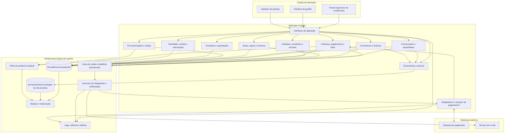
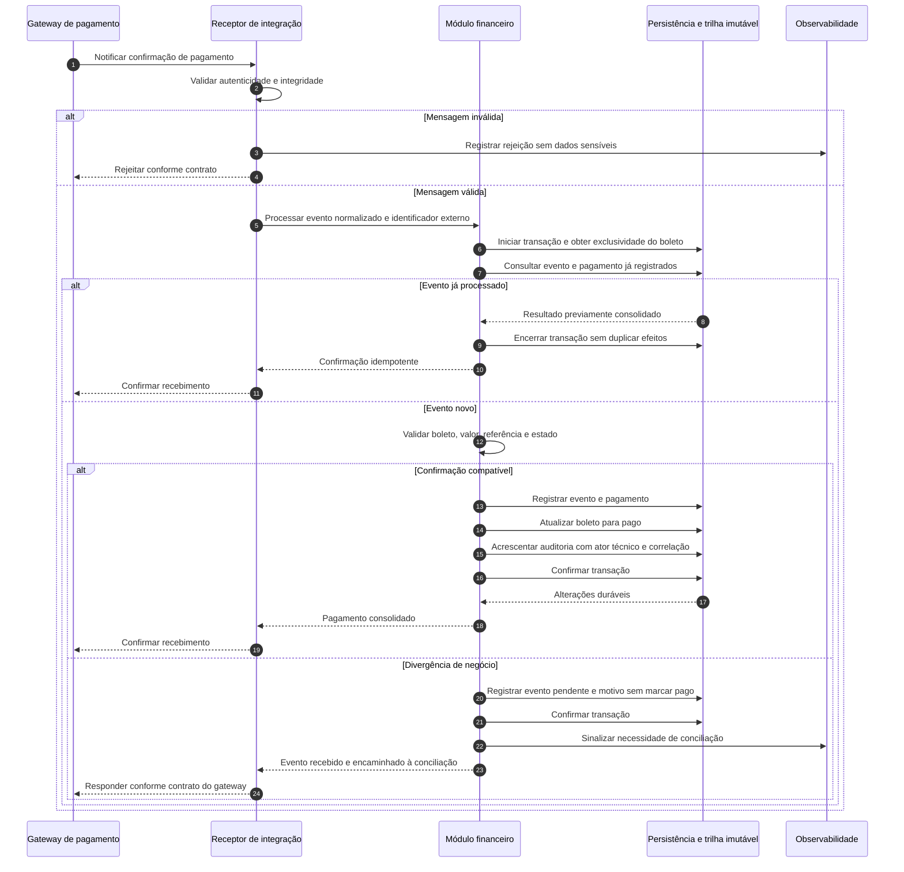
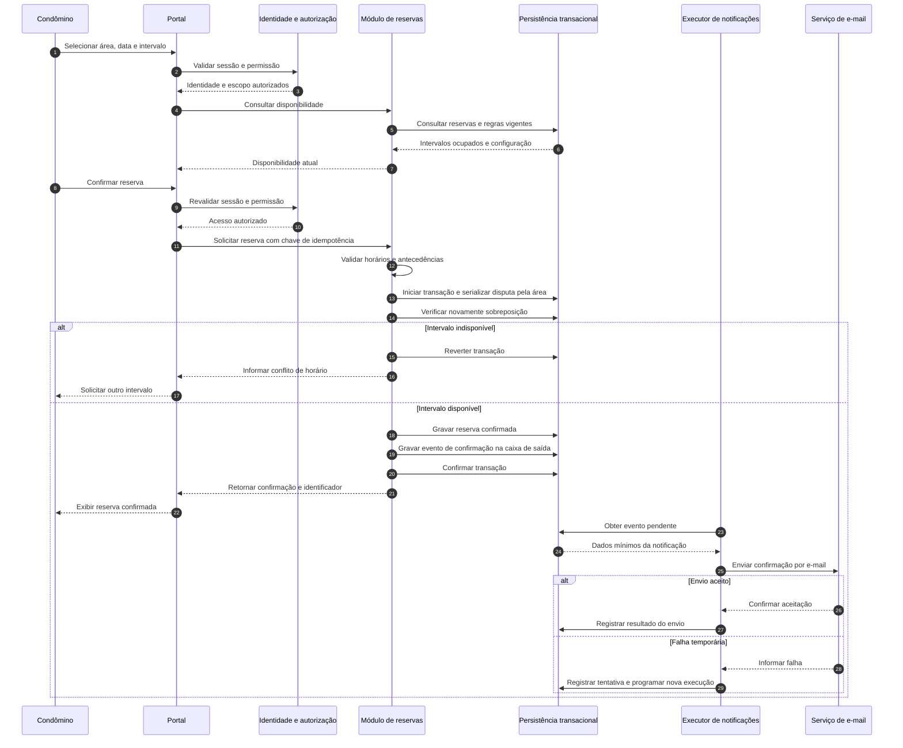

# Relatório Técnico de Arquitetura de Software

**Sistema:** Gestão de Condomínio — M04  
**Identificação do relatório:** AI4ES — Time 2  
**Natureza:** arquitetura lógica, independente de produtos e tecnologias.  
**Base de análise:** RF01–RF33, RNF01–RNF13 e HU01–HU14, incluindo seus critérios de aceite.

> As decisões abaixo constituem propostas de arquitetura. Cobertura arquitetural não significa implementação, teste ou conformidade já comprovados. Ambiguidades dos requisitos estão registradas nas seções 5 e 7.

## 1. Identificação das HUs

Os critérios de aceite integram o escopo, inclusive quando introduzem comportamentos que não aparecem explicitamente nos RF.

| HU | Perfil | Capacidade e critérios relevantes | RF relacionados |
|---|---|---|---|
| HU01 | Síndico | Gerenciar unidades e moradores; bloco e número obrigatórios; nome, CPF e e-mail obrigatórios; CPF único; múltiplos moradores por unidade. | RF04–RF07 |
| HU02 | Síndico | Emitir boletos por competência e vencimento para todas as unidades ativas; enviar por e-mail; identificar falhas por unidade. | RF09–RF13 |
| HU03 | Síndico | Consultar inadimplência com unidade, morador, valor e dias em atraso; filtrar por bloco, período e faixa de atraso; exportar CSV. | RF15 |
| HU04 | Síndico | Publicar comunicados com título, conteúdo e data; notificar todos os condôminos; fixar comunicados. | RF16–RF17 |
| HU05 | Síndico | Consultar, categorizar e atualizar ocorrências; filtrar por status, categoria e período; notificar o autor. | RF23–RF24 |
| HU06 | Síndico | Agendar assembleias; notificar condôminos; registrar ata após realização; anexar documentos e disponibilizar no portal. | RF18–RF19 |
| HU07 | Síndico | Cadastrar áreas; configurar horários, antecedência e regras; acompanhar calendário; cancelar qualquer reserva e notificar o condômino. | RF25, RF28–RF29 |
| HU08 | Condômino | Consultar boletos abertos, pagos e vencidos; visualizar e baixar boleto aberto; acompanhar confirmação automática do pagamento. | RF10–RF12 |
| HU09 | Condômino | Consultar disponibilidade em tempo real; reservar sem sobreposição; obter confirmação imediata e por e-mail. | RF26–RF27 |
| HU10 | Condômino | Registrar ocorrência com categoria, descrição e fotos opcionais; acompanhar status e histórico; receber notificações. | RF21, RF24 |
| HU11 | Condômino | Pré-autorizar visitante por nome e data; disponibilizar autorização à portaria no dia previsto; cancelar antes do registro da visita. | RF31–RF32 |
| HU12 | Condômino | Consultar assembleias futuras e respectivas pautas; visualizar e baixar atas passadas em PDF. | RF20 |
| HU13 | Funcionário | Registrar entrada com dados obrigatórios; destacar pré-autorização; registrar saída e encerrar visita aberta. | RF30 |
| HU14 | Funcionário | Consultar pré-autorizações do dia; filtrar por unidade e visitante; identificar autorizador; vincular entrada à autorização. | RF31–RF32 |

### 1.1 Requisitos sem HU específica

Estes requisitos permanecem no escopo e não devem ser descartados pela ausência de história:

- **RF01–RF03:** cadastro de usuários, autorização por perfil, autenticação e encerramento de sessão.
- **RF08:** cadastro de veículos por unidade.
- **RF14:** registro de pagamento externo pelo síndico.
- **RF22:** registro de ocorrências internas por funcionários.
- **RF33:** consulta do histórico de visitantes pelo síndico.
- **RNF01–RNF13:** controles transversais de segurança, qualidade, operação e conformidade.

### 1.2 Regras de identificação e acesso

- **Usuário** representa a identidade de acesso; **morador** representa o cadastro e seu vínculo residencial. Não são conceitos intercambiáveis.
- O perfil de condômino deve ser relacionado a vínculos residenciais autorizados para restringir dados por unidade.
- A possibilidade de múltiplos perfis por usuário e múltiplas unidades por morador depende de validação.
- O perfil **administrador** existe em RF01, mas suas permissões não foram definidas. Não será tratado automaticamente como acesso irrestrito.
- A política inicial é de **negação por padrão**, concedendo apenas permissões explicitamente autorizadas.

## 2. Diagramas de Arquitetura (Mermaid)

### 2.1 Visão lógica de componentes

Propõe-se uma aplicação modular com limites de responsabilidade explícitos. Os componentes abaixo representam capacidades lógicas, não serviços obrigatoriamente implantados de forma independente.

**Regras de interpretação:**

- As interfaces de aplicação autenticam e autorizam operações humanas antes de encaminhá-las aos módulos.
- O receptor do gateway utiliza autenticação própria de integração, não uma sessão de usuário.
- Cada módulo é proprietário das suas regras e escritas. O acesso lógico a uma persistência comum não autoriza alterações diretas nos dados de outro módulo.
- Consultas e exportações respeitam as mesmas regras de acesso dos comandos.
- As relações com a auditoria e a caixa de saída representam compromissos duráveis, conforme a decisão de atomicidade da seção 3.

### 2.2 Sequência — confirmação automática de pagamento

O fluxo protege contra notificações falsas, eventos duplicados e inconsistência entre pagamento, boleto e auditoria.

**Condição de falha:** se a persistência falhar antes da confirmação, a transação deve ser revertida e o recebimento não deve ser confirmado como durável. Retentativas e conciliação seguem o contrato do gateway.

### 2.3 Sequência — reserva com proteção contra sobreposição

A consulta de disponibilidade auxilia o usuário, mas a garantia de RF27 ocorre no momento da gravação.

**Invariante proposta:** para uma mesma área, duas reservas confirmadas não podem satisfazer simultaneamente `início A < fim B` e `início B < fim A`. O uso de intervalos com término exclusivo permite reservas consecutivas; essa convenção deve ser validada pelo negócio.

## 3. Decisões de Arquitetura

### DA01 — Modularização por capacidade de negócio

**Decisão:** adotar uma aplicação modular, organizada pelos domínios da seção 2, com interfaces conceituais explícitas e execução assíncrona para trabalhos demorados.

**Justificativa:** os requisitos não demonstram necessidade de distribuição em múltiplos serviços. A proposta favorece consistência transacional e menor complexidade operacional.

**Consequência:** notificações, integrações e lotes podem ter execução separada sem fragmentar prematuramente o domínio.

### DA02 — Identidade, sessão e autorização centralizadas

- Todas as operações humanas exigem autenticação, exceto os pontos necessários ao próprio ingresso na plataforma.
- Encerrar a sessão explicitamente deve invalidá-la no servidor.
- Rejeitar sessões com inatividade superior a 30 minutos, conforme RNF01.
- Armazenar senhas apenas com hash adaptativo seguro e salt individual.
- Verificar perfil e escopo do recurso no servidor, não apenas na interface.
- Downloads, exportações e consultas por identificador também passam por autorização.
- Integrações possuem identidade técnica e credenciais próprias.

**Pendências:** definir o que conta como atividade, permissões do administrador, concessão de perfis e efeitos da desativação de morador sobre suas sessões.

### DA03 — Modelo de domínio com histórico preservado

| Agregado lógico | Entidades e vínculos principais |
|---|---|
| Identidade | Usuário, perfil, concessão de acesso, sessão. |
| Cadastro residencial | Unidade, morador, vínculo residencial e veículo. Uma unidade comporta vários moradores e veículos. |
| Financeiro | Regra de taxa, boleto, pagamento, lote, item de lote e evento de conciliação. |
| Comunicação | Comunicado, assembleia, ata e anexos. |
| Ocorrências | Ocorrência, autor, categoria, histórico de alterações e anexos. |
| Reservas | Área comum, regras vigentes e reserva. |
| Portaria | Pré-autorização e visita, com registros de entrada e saída. |
| Governança | Evento de auditoria, trabalho pendente, tentativa de integração e documento. |

**Invariantes:**

- CPF único no sistema, após normalização e validação de formato.
- Nome, CPF e e-mail obrigatórios para moradores; telefone disponível no cadastro.
- Bloco, número e tipo disponíveis para unidades; bloco e número obrigatórios.
- Proprietário/inquilino deve ser registrado no vínculo residencial.
- Desativação de morador preserva referências e histórico.
- Visita identifica unidade e funcionários responsáveis pelos registros.
- Ata só pode ser registrada para assembleia concluída.
- Reserva cancelada deixa de bloquear disponibilidade, mas permanece no histórico.

**Proposta a validar:** impedir exclusão física de unidades referenciadas por histórico, usando desativação ou arquivamento. RF04 solicita remoção, enquanto HU02 pressupõe unidades ativas.

### DA04 — Financeiro com valores históricos e operações idempotentes

- A regra de taxa resolve o valor aplicável à unidade na emissão.
- O boleto conserva valor, competência e vencimento usados na emissão; alteração posterior da configuração não modifica cobranças já geradas.
- Pagamento confirmado pelo gateway e registro manual utilizam a mesma validação de consistência financeira.
- O registro manual exige síndico autorizado e identificação rastreável da operação.
- Eventos externos e comandos repetidos não podem duplicar pagamentos.
- Divergências entre valor recebido, boleto e situação atual seguem para conciliação.

**Propostas a validar:**

1. Configuração específica da unidade prevalece sobre a configuração por tipo.
2. Uma cobrança ordinária por unidade e competência, salvo reemissão ou cobrança adicional formalmente definida.
3. “Vencido” é apresentado quando o boleto não está pago e o vencimento já passou, respeitando o calendário e fuso aprovados.

Não estão definidos juros, multa, pagamentos parciais, estornos, descontos nem reemissão.

### DA05 — Lotes com atomicidade por unidade e resultado consolidado

**Interpretação proposta de RNF11:** cada item do lote é transacional; falhas em uma unidade não corrompem nem desfazem itens concluídos de outras unidades.

Fluxo conceitual:

1. Validar competência, vencimento e autorização.
2. Registrar lote e fotografia das unidades elegíveis.
3. Criar um item rastreável por unidade.
4. Resolver e registrar os dados financeiros daquele item.
5. Executar a emissão externa, se exigida pelo contrato.
6. Consolidar boleto, auditoria e evento de envio por e-mail.
7. Expor o resultado de cada unidade e o resumo do lote.

**Estados técnicos propostos para itens:** pendente, em processamento, emitido, falhou e aguardando conciliação.

**Tratamento de falhas:**

- Usar identificadores estáveis por lote e item.
- Não manter transação local aberta durante chamada externa.
- Quando houver resposta externa incerta, consultar ou conciliar antes de repetir.
- Reexecutar apenas itens elegíveis, sem gerar duplicidades.
- Falha no e-mail não transforma boleto emitido em falha de emissão.

Uma transação local não desfaz, por si só, uma emissão efetivada no gateway. Caso o negócio exija “tudo ou nada” para o lote inteiro, será necessário outro contrato, incluindo compensações externas.

### DA06 — Auditoria financeira imutável e separada de logs

Cada operação financeira deve produzir evento com:

- Identificador da operação e do objeto afetado.
- Usuário responsável ou identidade técnica da automação.
- Usuário iniciador, quando houver uma ação humana causal.
- Data e hora confiáveis.
- Tipo de operação, resultado e identificadores de correlação.

A alteração financeira e o compromisso durável da auditoria devem ocorrer atomicamente. O desenho lógico deve impedir atualização e exclusão ordinárias dos registros.

**Controles complementares:** segregação de permissões, proteção contra adulteração, verificação de integridade e retenção governada. A aplicação não pode alegar imutabilidade apenas porque sua interface não oferece exclusão.

Logs operacionais atendem RNF13, mas não substituem essa trilha.

### DA07 — Eventos duráveis para notificações

Publicações e alterações de negócio gravam um evento na mesma transação do estado correspondente. Um executor posterior realiza a comunicação externa.

**Eventos cobertos:**

- Boleto emitido — HU02.
- Comunicado publicado — RF17/HU04.
- Assembleia criada — HU06.
- Status de ocorrência alterado — RF24/HU05/HU10.
- Reserva confirmada — HU09.
- Reserva cancelada pelo síndico — HU07.

Cada evento mantém destinatário, situação e tentativas. A aceitação pelo serviço de e-mail não comprova entrega na caixa postal.

**Limite:** “imediatamente” precisa de prazo mensurável. O envio assíncrono evita que indisponibilidade de e-mail impeça publicação ou reserva.

### DA08 — Reservas protegidas na persistência

A prevenção de sobreposição deve funcionar mesmo com solicitações simultâneas.

- Aplicar exclusividade transacional sobre a disputa pela área ou mecanismo equivalente de restrição de intervalos.
- Revalidar disponibilidade na confirmação.
- Validar horários permitidos e antecedências mínima e máxima.
- Revalidar o prazo de cancelamento no servidor.
- Permitir cancelamento de qualquer reserva pelo síndico, com notificação ao condômino.
- Impedir que retentativa da mesma solicitação gere múltiplas reservas.

Fuso horário, fronteiras do prazo de cancelamento e comportamento em mudanças de regras permanecem pendentes.

### DA09 — Portaria com vínculo e concorrência controlados

- A pré-autorização informa visitante, data, unidade e condômino autorizador.
- A portaria consulta autorizações válidas do dia e filtra por unidade ou nome.
- A entrada pode ser registrada sem pré-autorização, conforme RF30.
- Quando utilizada, a autorização é vinculada ao registro de visita.
- O cancelamento da autorização e o registro da entrada devem ser mutuamente consistentes: apenas uma operação vence a disputa.
- A saída deve apontar para visita aberta e não anteceder a entrada.
- Preservar os responsáveis pelos registros de entrada e saída.

**Pendência:** determinar se uma autorização permite uma única visita ou múltiplas entradas no dia.

### DA10 — Documentos protegidos por autorização de domínio

Fotos, anexos de ata e PDFs são acessados por intermédio de interfaces autorizadas.

- Validar tipo, tamanho e conteúdo conforme política aprovada.
- Verificar conteúdo potencialmente malicioso.
- Não disponibilizar anexos sensíveis por endereço público permanente.
- Atas devem poder ser visualizadas e baixadas em PDF.
- Boletos devem ter documento consultável e baixável pelo usuário autorizado.
- Metadados e arquivos devem integrar o processo de backup.

A geração de PDF a partir de texto de ata é uma opção de implementação, não uma obrigação explicitamente estabelecida.

### DA11 — Consultas orientadas a desempenho e segregação

O painel de inadimplência e o calendário devem ter consultas especializadas, com critérios de busca e estruturas de acesso adequados.

- Painel: unidade, morador, valor, dias em atraso, bloco, período e faixa de atraso.
- Calendário: reservas confirmadas por área e período.
- Exportação CSV: mesmo escopo de autorização e filtros da consulta; tratamento de conteúdo que possa ser interpretado como fórmula.
- Consultas derivadas ou pré-calculadas, caso adotadas, precisam de política explícita de atualização.
- A confirmação de reserva nunca depende exclusivamente de informação potencialmente desatualizada.

RNF08 exige até três segundos, mas ainda não define volume, concorrência e ponto de medição.

### DA12 — Operação, disponibilidade e recuperação

- Projetar redundância dos elementos essenciais para o atendimento ao usuário.
- Monitorar disponibilidade de ponta a ponta, latência e falhas por integração.
- Isolar falhas de e-mail e do gateway das capacidades não dependentes desses serviços.
- Adotar limites de tempo, retentativas controladas e encaminhamento de falhas persistentes para tratamento.
- Realizar backup diário com retenção mínima de 90 dias e testes de restauração.
- Proteger cópias de segurança com controles equivalentes aos dados de produção.
- Planejar atualizações com interrupções compatíveis com o objetivo de disponibilidade.

**Referência operacional:** 99,5% em um mês de 30 dias permite aproximadamente 3h36 de indisponibilidade. A forma de medição e o tratamento de manutenção precisam ser acordados.

### DA13 — Privacidade e compatibilidade desde o desenho

- Minimizar dados pessoais em logs, mensagens, consultas e exportações.
- Proteger dados em trânsito e em repouso, especialmente CPF, documentos e anexos.
- Definir finalidades, bases legais, retenção e atendimento aos direitos dos titulares.
- Não armazenar dados de cartão; minimizar o escopo da integração sujeita a PCI-DSS.
- Verificar requisitos aplicáveis de PCI-DSS junto ao provedor, sem presumir que não armazenar cartão basta para conformidade.
- Validar interface responsiva em dispositivos móveis e desktops.
- Executar testes nos navegadores Chrome, Firefox, Safari e Edge, conforme RNF10.

A conformidade depende também de processos organizacionais e evidências, não somente de mecanismos de software.

## 4. Tabela de Componentes e Rastreabilidade

As interfaces citadas são conceituais; não fixam protocolo, produto ou framework.

| Componente | Responsabilidade Principal | Comunica-se com | Origem (HU / Critério de Aceite) |
|---|---|---|---|
| Portal de condôminos | Apresentar boletos, comunicados, assembleias, ocorrências, reservas e pré-autorizações. | Interfaces de aplicação; documentos. | HU08–HU12; RF16; RNF09–RNF10. |
| Interface de gestão | Disponibilizar cadastros, financeiro, publicação, gestão de ocorrências, calendário e histórico de visitantes. | Interfaces de aplicação; consultas e exportações. | HU01–HU07; RF08, RF14, RF33. |
| Interface de portaria | Consultar autorizações e registrar entrada/saída de visitantes. | Visitantes; identidade e autorização. | HU13–HU14. |
| Identidade, sessão e autorização | Cadastrar identidades conforme política aprovada; autenticar; encerrar sessão; validar perfil e escopo. | Todos os pontos de entrada; persistência. | Sem HU específica: RF01–RF03; RNF01–RNF02. |
| Unidades, moradores e veículos | Manter unidades, vínculos proprietário/inquilino, CPF único, desativação e veículos. | Identidade; financeiro; reservas; visitantes; persistência. | HU01 e seus critérios; RF04–RF08. |
| Configuração e emissão de cobrança | Resolver taxas; emitir boleto individual; preservar competência, vencimento e valor. | Cadastros; adaptador de pagamento; documentos; auditoria. | HU02/HU08; RF09–RF10. |
| Orquestração de lotes | Enumerar unidades ativas; controlar itens; retomar falhas; consolidar resultado. | Emissão; trabalhos persistentes; auditoria; notificações. | HU02: emissão por unidade, e-mail e identificação de falhas; RF13; RNF11. |
| Pagamentos e conciliação | Processar confirmação externa e pagamento manual; atualizar boleto; tratar duplicidades e divergências. | Adaptador de pagamento; persistência; auditoria. | HU08: atualização automática; RF11–RF12, RF14; RNF03, RNF05. |
| Adaptador de pagamento | Isolar contrato externo; validar mensagens; normalizar estados e identificadores. | Gateway; pagamentos; executor; observabilidade. | RF11–RF12; RNF03; HU08. |
| Consultas e exportações | Produzir painel de inadimplência, CSV, calendário e histórico de visitantes autorizado. | Financeiro; cadastros; reservas; visitantes. | HU03; HU07: calendário; RF15, RF29, RF33; RNF08. |
| Comunicados | Publicar conteúdo, registrar data e fixação, solicitar notificações. | Portal; cadastros; caixa de saída. | HU04: título, corpo, data, e-mail e fixação; RF16–RF17. |
| Assembleias e atas | Agendar eventos; registrar conclusão, ata e anexos; oferecer consulta no portal. | Documentos; portal; notificações. | HU06/HU12: aviso de criação, documentos e PDF; RF18–RF20. |
| Ocorrências | Registrar ocorrências residenciais e internas; categorizar; manter status e histórico. | Cadastros; documentos; notificações; persistência. | HU05/HU10; RF21–RF24; RNF13. |
| Áreas comuns e reservas | Gerir capacidade e regras; consultar disponibilidade; confirmar e cancelar sem conflitos. | Cadastros; autorização; persistência; notificações; consultas. | HU07/HU09; RF25–RF29. |
| Pré-autorizações e visitas | Autorizar, cancelar, listar, vincular entrada e registrar saída com responsáveis. | Cadastros; autorização; persistência; auditoria. | HU11/HU13/HU14; RF30–RF33; RNF06. |
| Documentos e anexos | Guardar e entregar PDFs e imagens com autorização e validação de conteúdo. | Assembleias; ocorrências; financeiro; armazenamento protegido. | HU06: anexos; HU08: boleto; HU10: fotos; HU12: PDF; RNF04. |
| Caixa de saída e executor | Persistir eventos; executar trabalhos; controlar tentativas e duplicidades. | Módulos de negócio; adaptadores; e-mail; observabilidade. | HU02/HU04/HU06/HU07/HU09/HU10; RF17, RF24; RNF11. |
| Auditoria imutável | Preservar operações financeiras e evidências de acessos de visitantes. | Financeiro; visitantes; persistência protegida; backup. | Sem HU específica para imutabilidade: RNF05–RNF06; HU13. |
| Observabilidade | Registrar eventos críticos, medir disponibilidade e desempenho e emitir alertas. | Interfaces; módulos; integrações; executor. | RNF07–RNF08, RNF13. |
| Backup e recuperação | Executar cópias diárias, reter por 90 dias ou mais e testar restauração. | Persistência; documentos; auditoria; operação. | Sem HU específica: RNF12; suporte a RNF07. |

## 5. Bloqueios e Pendências

**Classificação:** “bloqueio” impede concluir uma implementação ou aceite confiável de determinada capacidade; não significa paralisação de todo o sistema.

| ID | Tipo / prioridade | Questão pendente | Impacto | Encaminhamento |
|---|---|---|---|---|
| P01 | Bloqueio de segurança / alta | Quem cadastra usuários, concede perfis e administra acessos? O que o administrador pode fazer? | Não é possível concluir a matriz de permissões de RF01–RF02. | Produto e segurança devem aprovar matriz ator × operação × escopo. |
| P02 | Bloqueio financeiro / alta | O gateway emite boletos? Como autentica eventos? Oferece idempotência, consulta e conciliação? | Impede fechar contratos e recuperação de falhas de RF10–RF12. | Obter contrato técnico e validar cenários em ambiente de testes da integração. |
| P03 | Bloqueio semântico / alta | RNF11 exige atomicidade por item ou por lote inteiro? | Altera transações, compensações e resultado de falha parcial. | Aprovar formalmente a interpretação DA05 ou substituí-la. |
| P04 | Pendência de domínio / alta | O que caracteriza unidade ativa? Como remover unidade com histórico? | Afeta lotes, integridade referencial e retenção. | Definir ciclo de vida de unidade e política de arquivamento. |
| P05 | Bloqueio de autorização / alta | Como usuário, morador e unidade se relacionam? Quem vê boletos em unidade com vários moradores? | Risco de exposição indevida ou acesso negado incorretamente. | Aprovar cardinalidades, vigência de vínculos e visibilidade financeira. |
| P06 | Bloqueio financeiro / alta | Precedência das taxas, unicidade de cobrança, juros, multa, pagamento parcial, estorno e reemissão. | Impede fechar cálculo, estados e conciliação. | Criar regras e exemplos de aceite financeiro. |
| P07 | Bloqueio de conformidade para produção / alta | Bases legais, retenção de dados, responsabilidades LGPD e obrigações PCI-DSS. | Afeta coleta, descarte, auditoria, exportação e backups. | Validar com responsáveis jurídicos, privacidade e segurança. |
| P08 | Pendência operacional / alta | Carga esperada, medição dos três segundos, RPO, RTO e cálculo do uptime. | Não é possível comprovar desempenho e recuperação sem parâmetros. | Produto e operação devem aprovar objetivos e cenários de teste. |
| P09 | Pendência temporal / média | Fuso, intervalos de reserva, limite de cancelamento e reutilização de pré-autorização. | Afeta validações, concorrência e testes de fronteira. | Aprovar convenções temporais e regras de portaria. |
| P10 | Pendência de comunicação / média | Prazo de envio “imediato”, destinatários de boletos e tratamento de falha permanente. | Afeta aceite, privacidade e experiência do usuário. | Definir SLA, seleção de destinatários e procedimentos de reenvio. |
| P11 | Pendência documental / média | Formatos e limites de anexos; ata enviada em PDF ou convertida pelo sistema. | Afeta armazenamento, validação e esforço de geração documental. | Definir política de documentos e exemplos de aceite. |
| P12 | Pendência de escopo / alta | O sistema atende um condomínio ou vários com isolamento? | Altera chaves, unicidade, autorização, consultas e operação. | Confirmar escopo antes de consolidar o modelo de dados. |

## 6. Cobertura de Requisitos

### 6.1 Critério de cobertura

- **Cobertura arquitetural:** existe responsabilidade atribuída e mecanismo proposto.
- **Cobertura condicionada:** o mecanismo depende de decisão registrada na seção 5.
- **Verificação:** evidência que o time deverá produzir. Nenhuma evidência de implementação ou execução de testes foi fornecida.

### 6.2 Requisitos funcionais

| Requisitos | Cobertura proposta | Verificação necessária / condição |
|---|---|---|
| RF01, RF02, RF03 | Identidade, sessão e autorização; DA02. | Cadastro por ator autorizado; autenticação; logout; testes de acesso negado por perfil e recurso. P01/P05. |
| RF04, RF05, RF06, RF07 | Cadastros e vínculos com histórico; DA03. | Campos, CPF único, múltiplos moradores, proprietário/inquilino, desativação e remoção controlada. P04/P05. |
| RF08 | Veículos vinculados à unidade. | Cadastro de placa, modelo e cor; validação do vínculo. |
| RF09 | Configuração de taxa por unidade ou tipo; DA04. | Resolução determinística da taxa e preservação do valor emitido. P06. |
| RF10, RF11, RF12 | Emissão, integração e confirmação idempotente; DA04 e sequência 2.2. | Emissão individual, vencimento configurável, evento autêntico e atualização automática. P02/P06. |
| RF13 | Orquestração de lotes; DA05. | Todas as unidades elegíveis; resultado por unidade; retomada sem duplicidade. P03/P04. |
| RF14 | Registro manual de pagamento e auditoria. | Permissão do síndico; boleto consistente; proteção contra dupla baixa. P06. |
| RF15 | Painel e consultas; DA11. | Unidade e período, filtros e valores corretos; desempenho. P08. |
| RF16, RF17 | Comunicados e notificações; DA07. | Visibilidade para condôminos e envio após publicação. P10. |
| RF18, RF19, RF20 | Assembleias, atas e documentos; DA03/DA10. | Dados do evento, ata após conclusão, consulta e download autorizado. P11. |
| RF21, RF22, RF23, RF24 | Ocorrências, histórico e notificações. | Registro por condômino e funcionário; gestão pelo síndico; e-mail ao autor por mudança de status. |
| RF25, RF26, RF27, RF28, RF29 | Áreas, regras e reservas; DA08 e sequência 2.3. | Cadastro completo, reserva concorrente, prazo de cancelamento e calendário. P09. |
| RF30, RF31, RF32, RF33 | Portaria, pré-autorizações, visitas e histórico; DA09. | Entrada/saída com campos obrigatórios; listagem diária; vínculo com autorização; consulta pelo síndico. P09. |

### 6.3 Requisitos não funcionais

| RNF | Mecanismo arquitetural | Evidência de aceite a produzir |
|---|---|---|
| RNF01 | Autenticação e controle de inatividade no servidor; DA02. | Testes de expiração acima de 30 minutos, logout e tentativa de reutilização de sessão. |
| RNF02 | Hash adaptativo seguro com salt individual. | Revisão do armazenamento, configuração de custo e ausência de senha em texto claro ou logs. |
| RNF03 | Adaptador isolado; ausência de armazenamento de cartão; contrato seguro. | Avaliação do escopo PCI-DSS e revisão de dados transitados/armazenados. P02/P07. |
| RNF04 | Minimização, autorização, proteção e governança de retenção; DA13. | Inventário de dados, bases legais, matriz de acesso e procedimentos dos titulares. P07. |
| RNF05 | Auditoria imutável com ator e tempo; atomicidade com operação financeira; DA06. | Tentativas de adulteração rejeitadas e testes de falha entre mudança de estado e auditoria. |
| RNF06 | Visita com data/hora, unidade e funcionário responsável; DA09. | Integridade dos registros de entrada/saída e consulta histórica. |
| RNF07 | Redundância, isolamento de falhas e monitoramento; DA12. | Medição mensal de uptime e testes de falha/recuperação. P08. |
| RNF08 | Consultas especializadas e estruturas de acesso; DA11. | Testes do painel e calendário em até três segundos sob carga acordada. P08. |
| RNF09 | Interfaces responsivas. | Testes de navegação, formulários e leitura em dispositivos móveis e desktops. |
| RNF10 | Compatibilidade entre navegadores exigidos. | Execução dos fluxos essenciais em Chrome, Firefox, Safari e Edge, em versões acordadas. |
| RNF11 | Transação por item, estados rastreáveis e conciliação; DA05. | Injeção de falhas parciais, retomada e comprovação de não corrupção dos demais itens. P03. |
| RNF12 | Backup diário, retenção mínima de 90 dias e restauração; DA12. | Evidências de execução, retenção e restauração consistente de dados, arquivos e auditoria. |
| RNF13 | Logs estruturados e correlacionados; observabilidade. | Registros de emissão/pagamento, publicação, alteração de ocorrência e acesso de visitante. |

### 6.4 Critérios das HUs que ampliam os RF

| Origem | Complemento preservado no desenho |
|---|---|
| HU01 | CPF único e múltiplos moradores por unidade. |
| HU02 | E-mail com boleto e indicação individual de falhas. |
| HU03 | Filtros detalhados e exportação CSV. |
| HU04 | Fixação de comunicados e prazo “imediato” a especificar. |
| HU05 | Filtros de ocorrência por status, categoria e período. |
| HU06 | E-mail na criação de assembleia e anexos da ata. |
| HU07 | Horários, antecedências e cancelamento pelo síndico com notificação. |
| HU08 | Lista de boletos com competência, valor, vencimento e status; visualização e download. |
| HU09 | Disponibilidade atual, confirmação imediata e e-mail de reserva. |
| HU10 | Fotos opcionais e histórico de alterações. |
| HU11 | Cancelamento da pré-autorização antes do registro da visita. |
| HU12 | Visualização e download de ata em PDF. |
| HU13 | Destaque de pré-autorização e encerramento da visita na saída. |
| HU14 | Filtros de pré-autorização e vínculo explícito com a visita. |

**Resultado da análise:** os **33 RF**, **13 RNF** e **14 HUs** possuem alocação arquitetural. A suficiência do aceite permanece condicionada às pendências; não há base para declarar cobertura de testes ou conformidade concluída.

## 7. Gap Analysis

### 7.1 Lacunas reais, impactos e ações

| Gap | Lacuna de especificação | Impacto arquitetural | Ação recomendada ao time |
|---|---|---|---|
| G01 | Permissões de administrador e responsável pelo cadastro não definidos. | Pode produzir escalonamento indevido de privilégios. | Elaborar matriz de autorização e testes negativos antes de liberar administração de usuários. Relacionado a P01. |
| G02 | Relação entre usuário, morador e unidade não tem cardinalidade ou vigência definida. | Compromete autorização, histórico e seleção de destinatários. | Modelar vínculos temporais e aprovar cenários de mudança, locação e múltiplas unidades. P05. |
| G03 | RF04 pede remoção, HU02 pressupõe unidade ativa e RF07 exige preservação de histórico de morador. | Exclusões podem quebrar referências financeiras e de portaria. | Definir estados e política de exclusão lógica/física, incluindo comportamento de vínculos antigos. P04. |
| G04 | “Transacional” em RNF11 convive com falhas parciais sem atomicidade explicitada. | Uma implementação pode ser tecnicamente consistente, mas rejeitada pelo negócio. | Aprovar transação por item e especificar resultados de falha; se houver atomicidade global, definir compensação. P03. |
| G05 | Gateway sem contrato funcional e operacional. | Não há como garantir emissão única, autenticação de confirmação ou recuperação de timeout. | Criar testes de contrato, duplicidade, atraso, indisponibilidade e resposta incerta. P02. |
| G06 | Ciclo financeiro incompleto. | Estados e cálculos podem divergir entre pagamento automático, manual e painel. | Especificar tabela de decisões financeiras, valores aceitos, eventos e regras de conciliação. P06. |
| G07 | Inadimplência exige “morador”, mas uma unidade pode ter vários moradores. | Risco de duplicar dívida na consulta ou atribuí-la ao destinatário incorreto. | Definir responsável financeiro, representação da unidade no painel e destinatários de boletos. P05/P10. |
| G08 | Regras temporais não definem fuso e limites inclusivos/exclusivos. | Erros em vencimentos, atraso, reservas e autorizações do dia. | Publicar convenções de tempo e testes de fronteira, incluindo concorrência entre cancelamento e entrada. P09. |
| G09 | “Imediatamente” e “tempo real” não são metas mensuráveis. | Não há critério objetivo para notificações e atualização de disponibilidade. | Definir latência máxima de consulta e despacho, política de atualização e tratamento de falhas. P08/P10. |
| G10 | Três segundos e 99,5% não têm escopo completo de medição. | Dimensionamento e comprovação de qualidade ficam indeterminados. | Fixar volumes, simultaneidade, origem da medição, janelas e tratamento das dependências externas. P08. |
| G11 | Backup diário não define RPO/RTO nem consistência entre arquivos e dados. | Uma cópia existente pode não oferecer recuperação operacional aceitável. | Aprovar objetivos de recuperação e executar restauração conjunta com relatório de integridade. P08. |
| G12 | LGPD, retenção histórica e imutabilidade não possuem política conciliada. | Pode haver retenção excessiva ou eliminação de evidências obrigatórias. | Definir retenção por finalidade e categoria; separar identificadores pessoais da evidência quando cabível; tratar backups. P07. |
| G13 | Ocorrências internas podem não ter unidade de origem, embora HU05 peça esse campo na listagem. | Uma unidade obrigatória impediria ocorrências sobre áreas ou operações gerais. | Aprovar origem “interna/área comum” ou unidade opcional e ajustar critérios da listagem. |
| G14 | Ata pode ser texto, PDF enviado ou documento gerado; limites de anexos ausentes. | Altera processamento, armazenamento e segurança de conteúdo. | Definir formatos, limites, geração de PDF e regras de substituição/versionamento. P11. |
| G15 | Escopo de um ou vários condomínios não foi explicitado. | Afeta isolamento de dados e significado de “CPF único no sistema”. | Confirmar fronteira organizacional antes de fechar identificadores e restrições. P12. |
| G16 | Recuperação de senha, convite e desativação de identidade não foram especificados. | O ciclo operacional de acesso fica incompleto. | Criar histórias e critérios adicionais; não assumir esses fluxos como requisitos já aprovados. |
| G17 | Transições de ocorrência, categoria inicial e alteração de descrição não estão definidas. | Histórico e notificações podem ter comportamentos inconsistentes. | Especificar máquina de estados, permissões e eventos notificáveis, incluindo reabertura se desejada. |
| G18 | Não há política de acessibilidade nem versões mínimas de navegadores. | Responsividade pode ser atendida sem uso inclusivo ou compatibilidade reproduzível. | Definir matriz de versões e critérios de acessibilidade como evolução formal do escopo. |

### 7.2 Priorização recomendada

1. **Antes de consolidar o domínio:** resolver autorização, vínculos residenciais, ciclo de vida das unidades e escopo de condomínios.
2. **Antes de implementar o financeiro:** aprovar semântica do lote, contrato do gateway e regras de cobrança/pagamento.
3. **Antes de validar funcionalidades temporais:** fechar fuso, regras de reserva e uso de pré-autorizações.
4. **Antes do aceite não funcional:** estabelecer carga, métricas de latência, disponibilidade, RPO/RTO e prazo de notificações.
5. **Antes da produção:** reunir evidências de segurança, conformidade, restauração, auditoria imutável e operação das integrações.

**Conclusão:** a arquitetura proposta atribui responsabilidade a todo o escopo recebido e protege os pontos críticos de concorrência, consistência financeira, rastreabilidade e acesso a dados pessoais. A continuidade deve preservar a separação entre requisitos aprovados, decisões técnicas propostas e regras de negócio ainda pendentes.