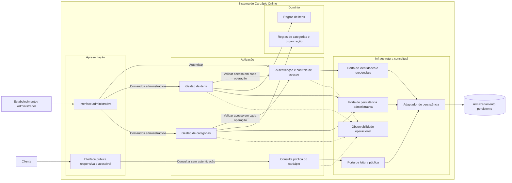
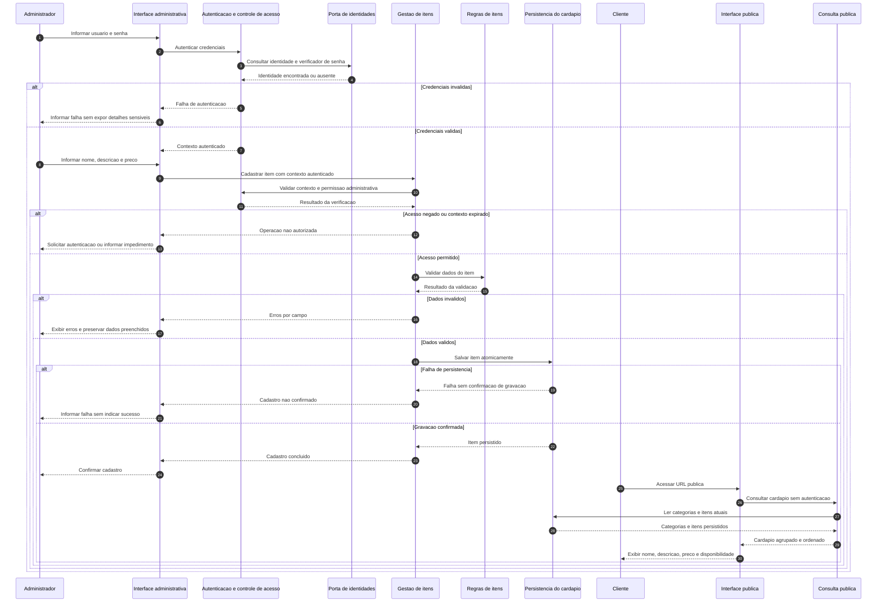

# Relatório Técnico de Arquitetura de Software

**Projeto:** Cardápio Digital para Restaurante — P01  
**Equipe:** AI4ES — Time 2  
**Escopo:** arquitetura conceitual, contratos de responsabilidade e rastreabilidade dos requisitos fornecidos.  
**Status:** proposta arquitetural para validação. Cobertura de projeto não representa comprovação por implementação ou testes.

## 1. Identificação das HUs

| HU | Perfil | Objetivo | Critérios de aceite determinantes para a arquitetura | RF relacionados |
|---|---|---|---|---|
| HU01 | Estabelecimento / Administrador | Cadastrar item | Validar nome e preço; publicar o item imediatamente após o cadastro | RF01, RF11 |
| HU02 | Estabelecimento / Administrador | Organizar por categorias | Nomear categorias livremente; limitar cada item a uma categoria; controlar a ordem das categorias | RF04, RF05, RF09 |
| HU03 | Estabelecimento / Administrador | Editar item | Permitir alteração dos campos do cadastro; refletir alterações imediatamente no cardápio público | RF02 |
| HU04 | Estabelecimento / Administrador | Alterar disponibilidade | Manter o item visível quando indisponível; permitir reativação | RF06, RF07, RF10 |
| HU05 | Estabelecimento / Administrador | Remover item | Solicitar confirmação; retirar o item do cardápio público após a exclusão | RF03 |
| HU06 | Cliente | Consultar sem cadastro | Acesso por URL direta, sem autenticação; funcionamento em dispositivos móveis | RF08 |
| HU07 | Cliente | Navegar por categorias | Exibir categorias identificadas e seus respectivos itens | RF09 |
| HU08 | Cliente | Identificar indisponibilidade | Indicação visual clara; manutenção do item na lista | RF10 |

**Requisitos transversais:**

- **RF11:** nome, descrição e preço integram a representação pública dos itens.
- **RNF01, RNF06 e RNF07:** orientam a apresentação pública e sua validação.
- **RNF02 e RNF04:** orientam desempenho, operação e observabilidade.
- **RNF03:** protege todas as operações administrativas.
- **RNF05:** orienta a separação modular e os contratos internos.

**Diferenças relevantes entre RFs e HUs:**

1. A ordenação de categorias está explicitada em HU02, mas não possui RF específico.
2. RF04 exige editar e remover categorias; HU02 detalha principalmente criação, associação e ordenação.
3. HU01 declara nome e preço obrigatórios, mas não torna explícita a obrigatoriedade da descrição.
4. “Imediatamente”, nas HUs 01 e 03, não define se páginas já abertas devem se atualizar automaticamente.
5. “Apenas uma categoria” determina o limite máximo, mas não esclarece se um item pode ficar sem categoria.

Essas diferenças são tratadas como pendências de governança, sem eliminar obrigações já expressas.

## 2. Diagramas de Arquitetura (Mermaid)

### 2.1. Visão de componentes

Propõe-se uma **aplicação modular**, com canais público e administrativo separados logicamente. As fronteiras abaixo representam responsabilidades, não exigem processos, servidores ou serviços independentes.

**Leitura arquitetural:**

- A consulta pública não depende de autenticação do cliente.
- Operações de gestão verificam acesso no servidor; ocultar controles na interface não constitui proteção.
- A leitura pública expõe somente os dados do cardápio, sem credenciais ou informações administrativas.
- As portas de leitura e escrita podem utilizar o mesmo armazenamento. A separação é contratual, não uma exigência de duplicação de dados.
- A observabilidade deve ser coletada sem expor senhas e sem tornar o atendimento dependente de um coletor externo.

### 2.2. Sequência — cadastro autenticado e consulta pública

O fluxo apresenta autenticação, autorização, validação, persistência e consulta posterior. A consulta ao final representa uma **nova requisição pública**; atualização automática de páginas já abertas depende de definição adicional.

### 2.3. Modelo conceitual mínimo

| Elemento | Dados e responsabilidades conceituais | Restrições |
|---|---|---|
| Item | Identificador, nome, descrição, preço, disponibilidade e referência à categoria | Nome e preço obrigatórios; no máximo uma categoria; indisponibilidade não implica exclusão |
| Categoria | Identificador, nome e informação de ordenação | Uma categoria pode organizar vários itens; ordenação controlada pelo administrador |
| Identidade administrativa | Identificador de usuário, verificador protegido de senha e habilitação de acesso | Credenciais não integram a representação pública |
| Contexto de acesso | Identidade autenticada e validade do acesso | Verificado em cada operação administrativa |
| Visão pública do cardápio | Categorias ordenadas e itens agrupados com os campos de RF11 | Inclui itens indisponíveis; exclui itens removidos |

**Pontos ainda não fixados no modelo:** obrigatoriedade de categoria, estado inicial de disponibilidade, moeda, precisão monetária, unicidade dos nomes e comportamento de categorias vazias.

## 3. Decisões de Arquitetura

### DA01 — Modularidade sem distribuição prematura

**Decisão:** separar apresentação, aplicação, domínio e infraestrutura por contratos explícitos, em uma aplicação modular.

**Justificativa:** atende RNF05 e ao porte funcional apresentado, sem introduzir complexidade operacional não requerida.

**Consequência:** módulos devem ser testáveis isoladamente. Mudanças de armazenamento ou apresentação não devem modificar as regras de negócio.

### DA02 — Separação entre canal público e administrativo

**Decisão:** manter consulta anônima do cardápio e operações administrativas protegidas em interfaces distintas.

**Contratos conceituais:**

- Público: `consultarCardapio()`.
- Acesso administrativo: `autenticar(usuario, senha)` e `validarAcesso(contexto)`.
- Itens: `cadastrarItem`, `editarItem`, `removerItem`, `definirDisponibilidade`.
- Categorias: `criarCategoria`, `editarCategoria`, `removerCategoria`, `ordenarCategorias`, `associarItemCategoria`.

**Justificativa:** concilia RF08/HU06 com RNF03.

**Controles derivados propostos:** proteção das senhas por verificadores não reversíveis apropriados, transporte protegido, expiração de contexto e limitação de tentativas de autenticação. Os parâmetros dessas medidas dependem de política de segurança.

Se o contexto for transportado automaticamente pelo navegador, as operações de alteração também precisam de proteção contra requisições forjadas.

### DA03 — Validação autoritativa no domínio

**Decisão:** validar os dados no servidor, independentemente das validações de interface.

**Regras confirmadas:**

- Nome e preço obrigatórios no cadastro.
- Preço representado como valor monetário, evitando aproximações inadequadas para esse domínio.
- Nome, descrição e preço alteráveis.
- Associação limitada a uma categoria por item.
- Indisponibilidade reversível e independente da remoção.

**Limites:** valores mínimos, máximos, casas decimais e comprimentos dos textos não foram especificados. A arquitetura reserva pontos de validação, mas não cria esses critérios silenciosamente.

### DA04 — Persistência confirmada e visibilidade pública coerente

**Decisão:** responder sucesso somente após confirmação da gravação. Novas consultas públicas devem observar alterações confirmadas, sem depender de uma publicação assíncrona intermediária.

**Justificativa:** HU01, HU03 e HU05 exigem rápida convergência entre gestão e apresentação pública.

**Consequências:**

- Alterações relacionadas devem preservar atomicidade e integridade.
- A ordenação de categorias deve ser gravada como uma operação consistente.
- Caso sejam introduzidas cópias ou caches dos dados do cardápio, sua coerência deverá respeitar o contrato de atualização aprovado.
- Esta decisão **não resolve**, por si só, a atualização de uma página que já esteja aberta.

### DA05 — Indisponibilidade visível e semanticamente identificável

**Decisão:** a consulta pública retorna itens disponíveis e indisponíveis, com estado explícito.

A interface deve apresentar um texto como “Indisponível”, associado ao item. Cor ou redução de opacidade podem complementar, mas não substituir a informação textual nem prejudicar sua leitura.

**Justificativa:** RF06, RF07, RF10, HU04, HU08 e RNF07.

### DA06 — Exclusão de item com confirmação

**Decisão:** a interface solicita confirmação antes de enviar a operação de remoção. O servidor valida acesso e existência do item, realiza a alteração persistente e só então confirma sucesso.

**Contrato público:** após remoção confirmada, o item deixa de integrar novas consultas do cardápio.

**Limite:** os requisitos não determinam exclusão física, retenção histórica ou restauração. A implementação interna deve aguardar a política correspondente, mantendo o mesmo comportamento externo.

A exclusão de **categoria com itens associados** permanece pendente: não será presumida exclusão em cascata.

### DA07 — Organização pública por categorias

**Decisão:** centralizar a montagem do cardápio na consulta pública, aplicando agrupamento e ordem definidos pelo estabelecimento.

**Justificativa:** RF09, HU02 e HU07.

**Pendências associadas:** apresentação de itens sem categoria, categorias vazias e ordenação dos itens dentro de cada categoria.

### DA08 — Apresentação responsiva, compatível e acessível

**Decisão:** estruturar a visão pública para diferentes dimensões de tela, com conteúdo semântico e interação independente de recursos exclusivos de um navegador.

**Diretrizes:**

- Navegação por teclado e ausência de bloqueios de foco.
- Títulos e agrupamentos semanticamente identificáveis.
- Nome acessível para controles.
- Indisponibilidade comunicada sem depender apenas de cor.
- Verificação dos critérios aplicáveis da WCAG 2.1 nível A, não apenas dos exemplos acima.
- Testes nos navegadores explicitados: Chrome, Firefox, Safari e Edge.

**Justificativa:** RNF01, RNF06 e RNF07.

### DA09 — Desempenho e disponibilidade mensuráveis

**Decisão:** instrumentar a consulta pública com medições de tempo, taxa de erros e verificações sintéticas de acesso.

Para o desempenho, a medição deve ocorrer também no navegador: latência interna do servidor não comprova carregamento em até 3 segundos.

Para disponibilidade, a proposta de medição é:

> Disponibilidade = tempo em que a jornada pública satisfaz o critério de sucesso ÷ tempo total observado.

A janela, o critério de sucesso e eventuais exclusões precisam de aprovação. Como referência, 99% em 30 dias corresponde a até **7h12min** de indisponibilidade; isso não define automaticamente a janela contratual.

**Medidas arquiteturais propostas:** caminho público enxuto, consultas eficientes, recursos de apresentação leves, tratamento de falhas, recuperação operacional e verificação da capacidade. A necessidade de redundância deve ser avaliada conforme os riscos e o orçamento de indisponibilidade.

**Justificativa:** RNF02 e RNF04.

## 4. Tabela de Componentes e Rastreabilidade

| Componente | Responsabilidade Principal | Comunica-se com | Origem (HU / Critério de Aceite) |
|---|---|---|---|
| Interface administrativa | Capturar alterações, apresentar validações, solicitar confirmação de exclusão e permitir ordenar categorias | Autenticação; gestão de itens; gestão de categorias | HU01: campos obrigatórios; HU02: ordenação; HU03: edição; HU04: reversão; HU05: confirmação |
| Interface pública | Exibir cardápio sem login, responsivo, agrupado e com indicação de indisponibilidade | Consulta pública | HU06: URL direta e acesso móvel; HU07: categorias; HU08: indicação visual; RF11; RNF01, RNF06, RNF07 |
| Autenticação e controle de acesso | Autenticar usuário e senha; validar acesso administrativo | Interface administrativa; gestões; porta de identidades | RNF03; suporte transversal a HU01–HU05, sem HU própria |
| Gestão de itens | Coordenar cadastro, edição, remoção, indisponibilidade e reativação | Controle de acesso; regras de itens; persistência administrativa | HU01, HU03, HU04, HU05; RF01–RF03, RF06, RF07 |
| Regras de itens | Validar campos e invariantes do item | Gestão de itens | HU01: nome e preço; HU03: campos editáveis; HU04: disponibilidade reversível |
| Gestão de categorias | Coordenar criação, edição, remoção, associação e ordenação | Controle de acesso; regras de categorias; persistência administrativa | HU02: criação, associação única e ordem; RF04, RF05 |
| Regras de categorias e organização | Preservar associação e consistência da ordenação | Gestão de categorias | HU02: até uma categoria por item e ordem controlável; políticas de remoção pendentes |
| Consulta pública | Montar representação pública atual, agrupada e ordenada | Interface pública; porta de leitura pública | HU01/HU03: visibilidade das alterações; HU06–HU08; RF08–RF11 |
| Porta de persistência administrativa | Definir contratos de gravação e consulta necessários à gestão | Gestões; adaptador de persistência | HU01–HU05: manutenção dos dados; RNF05 |
| Porta de leitura pública | Fornecer categorias e itens sem expor dados administrativos | Consulta pública; adaptador de persistência | HU06–HU08; RF09–RF11 |
| Porta de identidades e credenciais | Encapsular acesso a identidades e verificadores de senha | Controle de acesso; adaptador de persistência | RNF03; componente técnico derivado |
| Adaptador de persistência | Implementar armazenamento, integridade e atomicidade atrás das portas | Portas; armazenamento persistente | HU01–HU05; HU01/HU03: publicação após gravação; RNF05 |
| Observabilidade operacional | Medir desempenho, erros e disponibilidade sem registrar segredos | Autenticação; gestões; consulta pública; operação | RNF02 e RNF04; componente técnico derivado, sem HU própria |

**Nota:** armazenamento persistente é uma capacidade conceitual. Não há prescrição de produto, modelo de banco de dados ou plataforma de execução.

## 5. Bloqueios e Pendências

As pendências abaixo não impedem todo o desenvolvimento, mas algumas bloqueiam contratos e critérios de aceite específicos.

| ID | Prioridade | Pendência / decisão necessária | Parte bloqueada ou afetada | Responsável sugerido |
|---|---|---|---|---|
| P01 | Alta | Definir “imediatamente”: próxima consulta ou atualização automática de páginas abertas? Qual o atraso aceitável? | Contrato de consistência, atualização da interface e aceite de HU01/HU03 | Produto + Arquitetura |
| P02 | Alta | Definir se categoria é obrigatória e como exibir itens sem categoria | Cadastro, associação e agrupamento público | Produto |
| P03 | Alta | Definir exclusão de categoria com itens: bloquear, desassociar ou exigir transferência | Integridade referencial e remoção de categorias | Produto + Desenvolvimento |
| P04 | Alta | Especificar banda larga padrão, dispositivo, volume do cardápio, concorrência e métrica de carregamento | Validação objetiva de RNF02 e dimensionamento | Produto + Qualidade + Arquitetura |
| P05 | Alta | Definir janela de disponibilidade, critério de sucesso, tratamento de manutenção e objetivos de recuperação | Plano operacional e aceite de RNF04 | Produto + Operação |
| P06 | Alta | Definir como o primeiro administrador é provisionado e como recupera acesso | Entrada em operação e continuidade da administração | Produto + Segurança |
| P07 | Média | Definir descrição obrigatória ou opcional, moeda, precisão, limites de preço e tamanho dos campos | Modelo de dados, validação e apresentação | Produto |
| P08 | Média | Definir estado inicial de disponibilidade dos novos itens | Cadastro e comportamento inicial no cardápio | Produto |
| P09 | Média | Confirmar instalação para um estabelecimento ou atendimento a vários, incluindo identificação por URL | Escopo de dados, autorização e roteamento | Produto + Arquitetura |
| P10 | Média | Definir versões dos navegadores, dispositivos e tamanhos de tela de referência | Matriz de testes de RNF01 e RNF06 | Qualidade + Produto |
| P11 | Média | Definir tratamento de edição concorrente e repetição de comandos após falhas de comunicação | Prevenção de sobrescrita e cadastro duplicado | Produto + Desenvolvimento |
| P12 | Média | Definir retenção de itens removidos, categorias vazias, duplicidade de nomes e ordem interna dos itens | Políticas de persistência e apresentação | Produto |

**Encaminhamento:** registrar as decisões aprovadas como critérios de aceite versionados, atualizar contratos e revisar os testes antes de encerrar os respectivos requisitos.

## 6. Cobertura de Requisitos

### 6.1. Requisitos funcionais

| RF | Cobertura arquitetural | Evidência de validação prevista | Situação |
|---|---|---|---|
| RF01 | Gestão e regras de itens; persistência; interface administrativa | Cadastro válido persistido; rejeição de nome/preço ausentes; exibição pública | Coberto no desenho; detalhes P01, P02, P07, P08 |
| RF02 | Gestão de itens; atualização persistente | Alteração de nome, descrição e preço refletida na consulta pública | Coberto no desenho; P01 e P11 |
| RF03 | Confirmação na interface; remoção pela gestão | Cancelar preserva item; confirmar remove da visão pública | Coberto no desenho; retenção em P12 |
| RF04 | Gestão e regras de categorias | Criar, editar e remover categoria conforme política aprovada | Parcial: política de remoção em P03 |
| RF05 | Associação pela gestão de categorias | Associar item; impedir múltiplas categorias simultâneas | Coberto no desenho; obrigatoriedade em P02 |
| RF06 | Alteração do estado de disponibilidade | Item indisponível permanece persistido e visível | Coberto no desenho |
| RF07 | Reversão do estado de disponibilidade | Item reativado volta a ser apresentado como disponível | Coberto no desenho |
| RF08 | Consulta pública sem dependência de autenticação | Acesso por URL em contexto sem sessão | Coberto no desenho |
| RF09 | Agrupamento e ordenação na consulta pública | Itens apresentados nas categorias correspondentes | Coberto no desenho; P02 e P12 |
| RF10 | Estado público explícito e indicação textual/visual | Item indisponível continua na lista e é identificável | Coberto no desenho |
| RF11 | Representação pública com nome, descrição e preço | Conferência de conteúdo e formatação de cada item | Coberto no desenho; P07 |

### 6.2. Requisitos não funcionais

| RNF | Estratégia arquitetural | Verificação necessária | Situação |
|---|---|---|---|
| RNF01 | Apresentação responsiva | Testes de leitura e interação em telas móveis e desktop | Projetado; matriz pendente em P10 |
| RNF02 | Caminho público enxuto; medição no navegador; capacidade observada | Ensaio de carregamento até 3 segundos no cenário aprovado | Parcial: cenário e métrica em P04 |
| RNF03 | Autenticação e verificação de acesso em toda operação administrativa | Rejeição de credenciais inválidas e chamadas administrativas sem autorização | Projetado; políticas operacionais em P06 |
| RNF04 | Monitoramento público, tratamento de falhas e recuperação | Medição contínua de disponibilidade e exercícios de recuperação | Parcial: contrato operacional em P05 |
| RNF05 | Módulos coesos, portas e dependências explícitas | Revisão de dependências e testes isolados dos módulos | Coberto no desenho |
| RNF06 | Interface compatível com Chrome, Firefox, Safari e Edge | Execução da jornada pública na matriz aprovada | Projetado; versões em P10 |
| RNF07 | Semântica, teclado e comunicação acessível de estados | Avaliação automática e manual dos critérios aplicáveis da WCAG 2.1 A | Projetado; conformidade ainda não verificada |

### 6.3. Histórias de usuário

| HU | Critérios contemplados | Limitações para encerramento |
|---|---|---|
| HU01 | Validação de nome/preço; gravação antes do sucesso; integração com consulta pública | Semântica de publicação imediata e regras complementares do cadastro |
| HU02 | Criação/nomeação, associação única e ordenação | Categoria obrigatória, nomes e casos de remoção ainda precisam de detalhamento |
| HU03 | Edição dos campos; leitura posterior dos dados confirmados | Atualização automática de páginas abertas não definida |
| HU04 | Indisponibilidade sem remoção; reativação | Testes de integração e apresentação ainda necessários |
| HU05 | Confirmação; desaparecimento das consultas após remoção | Testes e política de retenção interna |
| HU06 | URL direta, ausência de login, interface móvel | Matriz responsiva e testes reais |
| HU07 | Categorias identificadas e itens agrupados | Tratamento de itens sem categoria e categorias vazias |
| HU08 | Indicação visual e textual; preservação do item na lista | Testes visuais e de acessibilidade |

**Síntese de cobertura:**

- **11/11 RFs**, **7/7 RNFs** e **8/8 HUs** possuem rastreabilidade para elementos arquiteturais.
- RF04, RNF02 e RNF04 apresentam lacunas que impedem fechar integralmente seus contratos.
- As demais pendências afetam regras complementares ou a interpretação de critérios de aceite.
- Nenhum requisito é declarado implementado, testado ou homologado neste relatório.

## 7. Gap Analysis

| Lacuna real de especificação | Impacto arquitetural | Ação recomendada ao time de desenvolvimento |
|---|---|---|
| Ordenação de categorias existe apenas em HU02 | Pode ser omitida se a implementação considerar somente a tabela de RFs | Formalizar requisito derivado de ordenação e teste de persistência/reapresentação da ordem |
| Edição e remoção de categorias não possuem critérios detalhados | Resultados ambíguos, especialmente quando há itens associados | Complementar HU02 ou criar histórias específicas; definir comportamento sem presumir exclusão em cascata |
| “Imediatamente” não estabelece semântica nem limite temporal | Pode exigir apenas consistência em nova leitura ou mecanismo adicional de atualização de páginas abertas | Aprovar contrato temporal e casos de teste antes de escolher mecanismo de atualização |
| Categoria máxima única não esclarece cardinalidade mínima | Afeta obrigatoriedade de campos, integridade e agrupamento | Definir se o item admite zero categorias e, se admitir, sua apresentação pública |
| Preço e descrição têm validações incompletas | Risco de dados inconsistentes e divergência entre cadastro e edição | Especificar moeda, precisão, limites e obrigatoriedade da descrição; compartilhar as mesmas regras entre operações |
| Disponibilidade inicial não está definida | Novos itens podem surgir com estado inesperado | Aprovar o estado inicial e incluí-lo no aceite de HU01 |
| RNF02 não define ambiente nem evento de carregamento | Não é possível reproduzir ou comprovar o limite de 3 segundos | Definir perfil de rede, dispositivo, volume, concorrência, estado inicial de carregamento e métrica; automatizar o ensaio |
| RNF04 não define janela e política de medição | Dimensionamento e comprovação dos 99% ficam indeterminados | Aprovar indicador, janela, exclusões, alertas e objetivos de recuperação; testar restauração |
| Autenticação não cobre ciclo de vida das contas | Primeiro acesso, recuperação e desativação podem ficar sem solução operacional | Definir processo mínimo de provisionamento e recuperação, sem presumir cadastro público de administradores |
| Quantidade de estabelecimentos e usuários administrativos é desconhecida | Pode alterar isolamento de dados, autorização e resolução da URL | Confirmar o modelo operacional antes de consolidar o escopo das entidades e permissões |
| Concorrência e repetição de comandos não foram tratadas | Possibilidade de perda de atualização ou duplicação após nova tentativa | Definir política de conflito e de repetição segura; criar testes de chamadas concorrentes e falhas de comunicação |
| Navegadores “modernos” e dispositivos não estão delimitados | O aceite de compatibilidade pode variar continuamente | Versionar uma matriz de suporte para Chrome, Firefox, Safari e Edge e revisá-la periodicamente |
| WCAG 2.1 A está indicada, mas falta plano de comprovação | Soluções visuais isoladas podem ser confundidas com conformidade completa | Elaborar checklist dos critérios aplicáveis e combinar testes automáticos com avaliação manual |
| Exclusão não define retenção ou restauração | Pode levar a decisões irreversíveis de persistência | Aprovar política de retenção; separar desaparecimento público de eliminação física interna |
| Categorias vazias, nomes repetidos e ordem dos itens não foram definidos | Interfaces podem adotar comportamentos divergentes | Registrar políticas explícitas e aplicar os mesmos resultados na administração e no cardápio público |

**Conclusão arquitetural:** a aplicação modular proposta cobre as responsabilidades centrais sem impor tecnologias ou distribuição desnecessária. As decisões prioritárias para estabilizar o projeto são a semântica de atualização imediata, o ciclo de vida das categorias, o acesso administrativo e os contratos mensuráveis de desempenho e disponibilidade.

Pedidos, pagamentos, estoque, imagens e mecanismos promocionais **não integram o escopo recebido**. Sua ausência não constitui lacuna deste projeto e não justifica componentes adicionais nesta arquitetura.