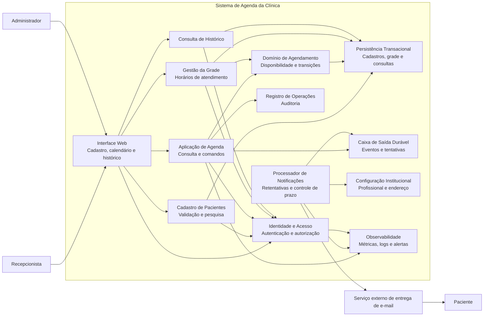
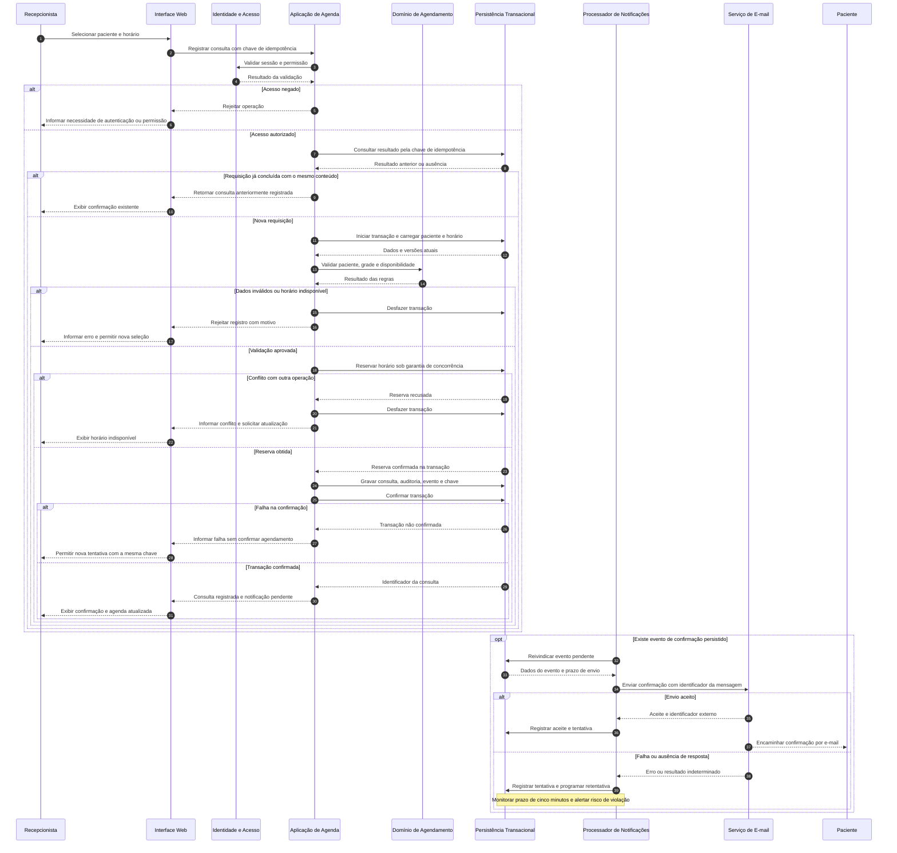
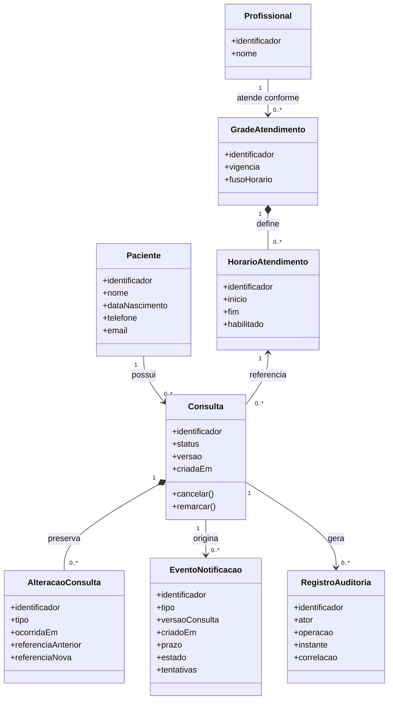

# Relatório Técnico de Arquitetura de Software

**Sistema:** Agendador de Consultas para Clínica Pequena — P02  
**Identificação:** AI4ES — Time 2  
**Base de análise:** RF01–RF12, RNF01–RNF08 e HU01–HU09.  
**Status:** arquitetura proposta, sujeita às decisões de negócio e aos critérios de medição relacionados nas seções 5 e 7.

## 1. Identificação das HUs

| HU | Perfil | Objetivo e critérios relevantes | Requisitos relacionados |
|---|---|---|---|
| HU01 | Recepcionista | Cadastrar paciente; exigir nome, telefone e e-mail; validar e-mail; impedir duplicidade por CPF ou e-mail. | RF01; RNF01, RNF02 |
| HU02 | Recepcionista | Pesquisar por nome ou telefone, incluindo correspondência parcial; listar nome e telefone. | RF03; RNF01, RNF02 |
| HU03 | Recepcionista | Consultar calendário diário/semanal, navegar entre períodos e distinguir horários livres e ocupados. | RF04; RNF03, RNF04, RNF07 |
| HU04 | Recepcionista | Agendar em horário disponível, apresentar confirmação e disparar e-mail automático. | RF05, RF06, RF09; RNF01, RNF05, RNF08 |
| HU05 | Recepcionista | Confirmar cancelamento, liberar horário e notificar paciente. | RF07, RF10; RNF01, RNF08 |
| HU06 | Recepcionista | Remarcar para horário disponível, liberar horário anterior e notificar novo horário. | RF06, RF08, RF10; RNF01, RNF08 |
| HU07 | Recepcionista | Acessar pelo cadastro o histórico de consultas realizadas e canceladas, com data, horário e status. | RF12; RNF01, RNF02 |
| HU08 | Paciente | Receber confirmação contendo profissional, data, horário e endereço da clínica, em até cinco minutos. | RF09; RNF05 |
| HU09 | Paciente | Receber cancelamento explícito ou remarcação com novo dia e horário. | RF10 |

**Requisitos sem HU correspondente:**

- **RF02:** edição cadastral.
- **RF11:** configuração da grade de atendimento.
- **RNF01:** autenticação e permissões também precisam de critérios próprios.
- **RNF02, RNF06 e RNF08:** privacidade, disponibilidade e logs exigem critérios operacionais transversais.

**Limites e premissas de modelagem:**

- O paciente é destinatário de e-mails; os requisitos não estabelecem portal, login ou autoagendamento para ele.
- O administrador é um usuário autenticado, mas suas permissões não estão definidas. Não se presume acesso irrestrito aos dados dos pacientes.
- A arquitetura comporta identificação do profissional em cada consulta. A regra de conflito **por profissional e horário** é uma proposta a validar, pois RF06 não explicita esse escopo.
- O sistema trata dados cadastrais e agenda, não prontuário clínico.
- CPF, conclusão do atendimento e dados institucionais apresentam lacunas que impedem fechar integralmente os respectivos contratos.

## 2. Diagramas de Arquitetura (Mermaid)

### 2.1. Visão de componentes e fronteiras

A proposta é uma **aplicação modular**, com processamento de notificações desacoplado da interação do usuário. Os módulos representam responsabilidades lógicas, não serviços distribuídos obrigatórios.

**Fronteira de consistência:** consultas, reservas de horários, registros críticos de auditoria e eventos de notificação devem ser confirmados na mesma transação lógica. Sua separação no desenho não implica armazenamentos independentes.

**Fronteira externa:** a entrega de e-mail depende de um serviço externo. Sua indisponibilidade não deve desfazer um agendamento já confirmado.

### 2.2. Sequência completa — registrar consulta e processar confirmação

O aceite pelo serviço de e-mail não comprova chegada à caixa de entrada. O ponto de medição de RNF05/HU08 deve ser aprovado antes da homologação.

### 2.3. Modelo conceitual

**Restrições que complementam o diagrama:**

- Um horário pode ter múltiplas consultas históricas, mas no máximo uma reserva ativa.
- Cancelamento preserva a consulta e libera sua reserva.
- Remarcação mantém a identidade da consulta, troca o horário e preserva a referência anterior no histórico.
- `REALIZADA` e `CANCELADA` são necessários para RF12. A transição para `REALIZADA` permanece sem origem funcional definida.
- CPF não integra ainda o modelo fechado: sua coleta e obrigatoriedade precisam ser esclarecidas.

## 3. Decisões de Arquitetura

### DA01 — Modularidade proporcional ao porte

Adotar módulos de cadastro, agenda, grade, histórico, identidade, notificações e observabilidade, com contratos explícitos.

**Justificativa:** atende ao porte da clínica, reduz complexidade operacional e mantém separação suficiente para testes e manutenção. Não há requisito que justifique distribuição obrigatória dos módulos.

### DA02 — Regras de domínio centralizadas e transacionais

A interface pode indicar disponibilidade, mas a decisão final ocorre no servidor, dentro da operação transacional.

- **Agendar:** validar paciente e grade; adquirir reserva; persistir consulta.
- **Cancelar:** verificar estado e versão; cancelar; liberar reserva.
- **Remarcar:** reservar destino e liberar origem na mesma transação. Se o destino falhar, a reserva original permanece intacta.
- **Editar grade:** coordenar alterações com reservas existentes; não invalidar silenciosamente consultas.

A implementação deverá combinar garantia de exclusividade na persistência e controle de concorrência. Uma verificação prévia de disponibilidade, isoladamente, não atende RF06.

### DA03 — Comandos idempotentes e proteção contra atualização perdida

Registrar, cancelar e remarcar aceitam identificador de operação. Repetições equivalentes retornam o resultado anterior; reutilização da chave com conteúdo diferente deve ser rejeitada.

O versionamento da consulta evita que ações concorrentes sobrescrevam alterações já confirmadas.

**Consequência:** cliques repetidos e retentativas de rede não devem criar novas consultas ou novos eventos para a mesma operação.

### DA04 — Notificações com caixa de saída durável

Persistir o evento junto da alteração da consulta e processar o envio posteriormente.

- Confirmação: profissional, data, horário e endereço.
- Cancelamento: indicação inequívoca da operação.
- Remarcação: novo dia e horário.
- Retentativas controladas, registro de tentativas e alertas antes do vencimento do prazo de confirmação.
- Ordenação lógica por consulta e versão para reduzir notificações fora de sequência.

O consumidor deve tolerar reprocessamento. Não se promete entrega “exatamente uma vez” ao destinatário: uma resposta externa perdida pode causar envio duplicado, dependendo do contrato do serviço de e-mail.

### DA05 — Calendário derivado da grade e das reservas

A consulta da agenda combina:

1. horários habilitados pela grade;
2. reservas de consultas;
3. período diário ou semanal solicitado.

Contrato conceitual: `consultarAgenda(profissional, início, fim)`.

As consultas devem ser limitadas ao período solicitado e apoiadas por mecanismos de acesso eficientes por profissional e intervalo. Qualquer otimização de leitura deve respeitar a liberação de horários após cancelamento/remarcação; não se deve introduzir informação obsoleta sem política explícita.

### DA06 — Segurança e privacidade desde os contratos

- Autenticação obrigatória para todas as funções internas.
- Autorização no servidor, por operação e perfil, com negação por padrão.
- Proteção dos dados em trânsito e armazenados, incluindo cópias de segurança.
- Privilégio mínimo e segregação entre dados operacionais e logs.
- Minimização dos dados pessoais em e-mails, auditoria e telemetria.
- Política de retenção, descarte e atendimento a direitos dos titulares a ser definida com o responsável por proteção de dados.

Essas medidas **apoiam**, mas não comprovam sozinhas, conformidade com a LGPD. Base legal, finalidade, retenção e responsabilidades exigem definição organizacional.

### DA07 — Separação entre histórico funcional e auditoria

O histórico do paciente apresenta consultas com data, horário e status. A auditoria registra quem realizou a operação, quando, sobre qual entidade e com qual resultado.

Os registros críticos de sucesso devem ser persistidos junto da transação. Tentativas rejeitadas e falhas ficam nos registros operacionais, com correlação e sem exposição desnecessária de dados pessoais.

### DA08 — Metas operacionais verificáveis

| Meta | Abordagem arquitetural | Evidência necessária |
|---|---|---|
| Agenda em até 2 segundos | Consulta por período, acesso eficiente e instrumentação do carregamento. | Teste ponta a ponta com volume, concorrência e condições acordados. |
| Confirmação em até 5 minutos | Processamento contínuo, retentativas e monitoramento da idade dos eventos. | Diferença entre registro confirmado e marco de envio aprovado. |
| Disponibilidade mínima de 99% | Monitoramento em horário de funcionamento, recuperação, cópias de segurança e procedimentos de incidentes. | Relatório de disponibilidade em janela definida. |
| Navegadores previstos | Interface baseada em padrões web e testes das jornadas críticas. | Matriz de versões e resultados em Chrome, Firefox, Safari e Edge. |

O prazo de cinco minutos aplica-se explicitamente à confirmação. Sua extensão a cancelamento e remarcação é uma decisão pendente.

## 4. Tabela de Componentes e Rastreabilidade

| Componente | Responsabilidade Principal | Comunica-se com | Origem (HU / Critério de Aceite) |
|---|---|---|---|
| Interface Web | Cadastro, busca, calendário diário/semanal, confirmação de ações e acesso ao histórico. | Identidade, Cadastro, Agenda, Grade, Histórico | HU01–HU07; obrigatoriedade de campos, lista nome/telefone, navegação e distinção visual. |
| Identidade e Acesso | Autenticar usuários e autorizar operações por perfil. | Interface e módulos internos | Sem HU específica; RNF01. Perfis citados em HU01–HU07. |
| Cadastro de Pacientes | Cadastrar, editar, validar e pesquisar; aplicar política de unicidade. | Identidade, Persistência | HU01: e-mail válido e não duplicidade; HU02: busca parcial. RF02 sem HU. |
| Aplicação de Agenda | Orquestrar leitura, agendamento, cancelamento e remarcação. | Identidade, Domínio, Persistência, Auditoria, Caixa de Saída | HU03–HU06; confirmação de registro e liberação de horários. |
| Domínio de Agendamento | Validar disponibilidade, estados, exclusividade e remarcação atômica. | Agenda, Grade, Persistência | HU04: apenas horários disponíveis; HU05: liberar horário; HU06: trocar horário sem perder consistência. |
| Gestão da Grade | Definir horários habilitados e coordenar alterações com reservas. | Interface, Identidade, Domínio, Persistência | Sem HU específica; RF11. Apoia HU03, HU04 e HU06. |
| Consulta de Histórico | Listar consultas realizadas/canceladas por paciente. | Interface, Identidade, Persistência | HU07: acesso pelo cadastro; data, horário e status. |
| Persistência Transacional | Preservar entidades, exclusividade, versões e atomicidade. | Cadastro, Agenda, Domínio, Grade, Histórico, Notificações | HU01: unicidade; HU04–HU06: consistência; HU07: histórico. |
| Caixa de Saída Durável | Armazenar eventos, estados e tentativas de notificação. | Agenda, Persistência, Processador de Notificações | HU04–HU06, HU08, HU09; envio automático confiável. |
| Processador de Notificações | Compor e enviar mensagens, controlar retentativas, sequência e prazo. | Caixa de Saída, Configuração, Serviço de E-mail, Observabilidade | HU08: conteúdo e cinco minutos; HU09: cancelamento/remarcação. |
| Configuração Institucional | Disponibilizar identificação do profissional e endereço da clínica. | Notificações, Persistência | HU08: conteúdo obrigatório. Fluxo de manutenção não especificado. |
| Registro de Operações | Registrar criação, cancelamento e remarcação com ator e correlação. | Agenda, Persistência, Observabilidade | Sem HU específica; RNF08. Operações de HU04–HU06. |
| Observabilidade | Medir latência, disponibilidade e atraso de notificações; emitir alertas. | Agenda, Identidade, Notificações | HU08: prazo; RNF04, RNF05, RNF06, RNF08. |
| Serviço externo de E-mail | Aceitar mensagens e tentar entregá-las ao destinatário. | Processador de Notificações, Paciente | HU08 e HU09. Dependência externa, não componente interno. |

## 5. Bloqueios e Pendências

| ID | Pendência ou bloqueio | Efeito na entrega | Responsável sugerido |
|---|---|---|---|
| BP01 | HU01 exige unicidade por CPF, mas RF01 não prevê sua coleta. | Bloqueia o fechamento do cadastro e dos testes de duplicidade por CPF. | Produto e responsável por proteção de dados |
| BP02 | Não existe operação para registrar consulta como realizada. | Bloqueia o atendimento integral de RF12/HU07. | Produto e representante da clínica |
| BP03 | Duração, recorrência, intervalos, exceções e fuso da grade indefinidos. | Bloqueia o fechamento das regras de disponibilidade. | Produto e clínica |
| BP04 | RF06 não define se o conflito é global ou por profissional, nem como tratar sobreposições. | Bloqueia a definição final da restrição de exclusividade. | Produto |
| BP05 | Administrador não possui matriz de permissões; responsável por RF11 não definido. | Bloqueia a homologação da autorização. | Produto e segurança |
| BP06 | Não há origem/manutenção do nome do profissional e endereço da clínica. | Bloqueia a composição completa do e-mail de HU08 sem configuração validada. | Clínica e produto |
| BP07 | LGPD não possui base legal, retenção, descarte ou fluxo de direitos definidos. | Bloqueia o aceite de conformidade para produção. | Controlador dos dados e responsável por proteção de dados |
| BP08 | Métricas carecem de carga, janelas, marco de envio e matriz de versões. | Bloqueia o aceite objetivo de RNF04–RNF07. | Produto, qualidade e operação |

Essas pendências não impedem o desenvolvimento de todos os módulos, mas impedem considerar os requisitos afetados integralmente concluídos.

## 6. Cobertura de Requisitos

**Legenda:**  
**C** — cobertura arquitetural definida; depende de implementação e testes.  
**P** — cobertura parcial; decisão de especificação pendente.  
**V** — mecanismo previsto; atendimento depende de medição ou validação externa.

### 6.1. Requisitos funcionais

| Requisito | Cobertura proposta | Situação | Verificação principal |
|---|---|---|---|
| RF01 | Cadastro com validação e proteção de dados. | P | Campos, e-mail e política CPF/e-mail; BP01. |
| RF02 | Edição pelo módulo de cadastro. | P | Confirmar campos editáveis e efeitos sobre unicidade/notificações. |
| RF03 | Pesquisa por nome, telefone e filtros cadastrais aprovados. | P | Busca parcial nome/telefone; definir “outros dados cadastrais”. |
| RF04 | Consulta de grade e reservas em calendário. | C | Horários livres/ocupados e navegação diária/semanal. |
| RF05 | Registro transacional com associação paciente-horário. | C | Persistência, confirmação e geração do evento. |
| RF06 | Exclusividade de reserva sob concorrência. | P | Disputa simultânea pelo mesmo recurso; BP03/BP04. |
| RF07 | Cancelamento com liberação transacional. | C | Confirmar ação, preservar histórico e liberar horário após sucesso. |
| RF08 | Remarcação atômica e versionada. | P | Destino disponível; origem preservada em falhas; regras da grade pendentes. |
| RF09 | Evento durável e envio de confirmação. | P | Conteúdo completo e falhas externas; BP06/BP08. |
| RF10 | Eventos de cancelamento/remarcação. | C | Mensagens distintas, novo horário e retentativas. |
| RF11 | Gestão da grade de atendimento. | P | Recorrências, exceções, permissões e conflitos; BP03/BP05. |
| RF12 | Consulta de histórico preservado. | P | Realizadas/canceladas com data, horário e status; BP02. |

### 6.2. Requisitos não funcionais

| Requisito | Cobertura proposta | Situação | Verificação principal |
|---|---|---|---|
| RNF01 | Autenticação e autorização no servidor. | P | Acesso anônimo negado e matriz de permissões; BP05. |
| RNF02 | Minimização, proteção, controle de acesso e ciclo de vida dos dados. | P | Avaliação de conformidade organizacional e técnica; BP07. |
| RNF03 | Calendário diário e semanal. | C | Navegação e distinção visual de estados. |
| RNF04 | Consulta eficiente e medição ponta a ponta. | V | Carregamento em até dois segundos sob condições acordadas. |
| RNF05 | Caixa de saída, retentativas e monitoramento de prazo. | V | Confirmação em até cinco minutos no marco aprovado. |
| RNF06 | Monitoramento, recuperação e operação planejada. | V | Disponibilidade mínima de 99% no horário e período acordados. |
| RNF07 | Interface compatível e testes entre navegadores. | V | Jornadas críticas na matriz de versões aprovada. |
| RNF08 | Auditoria das três operações críticas. | C | Registros com ator, instante, operação, entidade e correlação. |

### 6.3. Histórias de usuário

| HU | Situação | Evidência de aceite ou restrição |
|---|---|---|
| HU01 | P | Nome/telefone/e-mail obrigatórios e validação previstos; CPF pendente. |
| HU02 | C | Correspondência parcial e lista com nome/telefone previstas. |
| HU03 | C | Visões, navegação e distinção visual previstas. |
| HU04 | P | Fluxo transacional e confirmação previstos; conflitos e conteúdo do e-mail dependem de decisões. |
| HU05 | C | Confirmação prévia, liberação e evento de cancelamento previstos. |
| HU06 | P | Troca atômica prevista; modelo final de horários pendente. |
| HU07 | P | Consulta do histórico prevista; origem do estado realizada ausente. |
| HU08 | P | Processamento previsto; dados institucionais e medição de entrega pendentes. |
| HU09 | C | Conteúdo de cancelamento e novo horário previstos. |

**Síntese:** os **12 RF, 8 RNF e 9 HU** estão rastreados. Rastreabilidade integral não equivale a implementação concluída nem a conformidade comprovada.

## 7. Gap Analysis

| Lacuna real | Impacto arquitetural | Ação recomendada ao time de desenvolvimento |
|---|---|---|
| CPF aparece apenas no aceite de HU01. | Afeta esquema cadastral, minimização de dados e regras de unicidade. | Solicitar decisão formal sobre coleta e obrigatoriedade. Se aprovado, definir validação, normalização e tratamento de registros sem CPF. |
| Obrigatoriedade da data de nascimento não está explícita; unicidade do e-mail não tem política de normalização. | Pode gerar validações divergentes e duplicidades aparentes. | Criar dicionário de dados e testes de equivalência, incluindo tratamento de e-mail compartilhado conforme decisão de negócio. |
| Ausência do fluxo de conclusão da consulta. | Histórico não consegue produzir registros “realizados” de forma confiável. | Criar HU para conclusão, com ator autorizado, critérios e auditoria. Não inferir realização apenas porque o horário passou. |
| Grade sem duração, exceções ou regra de sobreposição. | Determina se a reserva usa horários discretos ou intervalos e como conflitos são detectados. | Realizar refinamento com exemplos de dias comuns, feriados, bloqueios e atendimentos de durações diferentes. |
| Escopo de RF06 indefinido. | Uma restrição global pode bloquear profissionais diferentes; uma restrição apenas por início pode aceitar sobreposições. | Aprovar explicitamente recurso reservado e condição de conflito antes de implementar a garantia de persistência. |
| Edição da grade com consultas existentes não especificada. | Risco de consultas fora da grade ou cancelamentos implícitos. | Definir política de rejeição, preservação ou migração assistida. Impedir alterações silenciosas enquanto a regra não for aprovada. |
| Edição cadastral e escopo dos filtros de pesquisa carecem de aceite. | Afeta validação, autorização, privacidade e desempenho de consultas. | Criar HUs para RF02 e detalhar filtros de RF03, paginação e tratamento de múltiplos resultados. |
| Perfis sem matriz de autorização. | Não é possível testar acesso legítimo e acesso indevido de forma completa. | Aprovar matriz operação × perfil, especialmente para grade, cadastro, histórico e administração de usuários. |
| Prazo de e-mail usa “enviar” e “receber” sem marco comum. | Aceite externo e recebimento real possuem garantias distintas. | Definir marco, evidência, tratamento de rejeições e obrigação contratual do serviço externo. Não apresentar aceite como entrega comprovada. |
| Cancelamento/remarcação não têm prazo de envio nem política para mudanças rápidas. | Pode haver mensagens atrasadas ou inconsistentes na percepção do paciente. | Definir prazo e regra para eventos sucessivos; testar agendar–remarcar–cancelar antes do primeiro envio. |
| Dados institucionais sem responsável por manutenção. | HU08 depende de conteúdo que nenhum fluxo fornece. | Definir configuração autorizada de profissional, endereço e fuso, com validação e origem rastreável. |
| LGPD não detalhada operacionalmente. | Retenção indefinida pode conflitar com exclusão; cópias e e-mails ampliam a superfície de exposição. | Mapear dados, finalidades, bases legais, operadores, retenção e direitos; incluir cópias de segurança, auditoria e eventos nesse inventário. |
| Desempenho e disponibilidade sem condições de medição. | Não há critério reproduzível para aceite ou dimensionamento. | Definir volume de pacientes/consultas, concorrência, rede, ponto de medição, horário de funcionamento, janela de apuração e manutenção contabilizada. |
| Recuperação e preservação dos logs não detalhadas. | Uptime não define perda de dados tolerável; logs podem existir sem utilidade investigativa. | Estabelecer objetivos de recuperação e perda tolerável, testar restauração e definir retenção, integridade e acesso à auditoria. |
| “Imediatamente” na liberação não define propagação entre telas abertas. | Pode exigir apenas leitura atualizada após confirmação ou atualização ativa de todas as sessões. | Adotar consistência da reserva após a transação e validar expectativa de atualização das demais interfaces. |

**Encaminhamento prioritário:** resolver primeiro CPF, ciclo de vida da consulta, regras da grade/conflito e permissões. Em paralelo, fechar conformidade e critérios operacionais. A arquitetura deve ser consolidada após essas decisões, com testes de concorrência, atomicidade, retentativa e rastreabilidade como condições de aceite técnico.