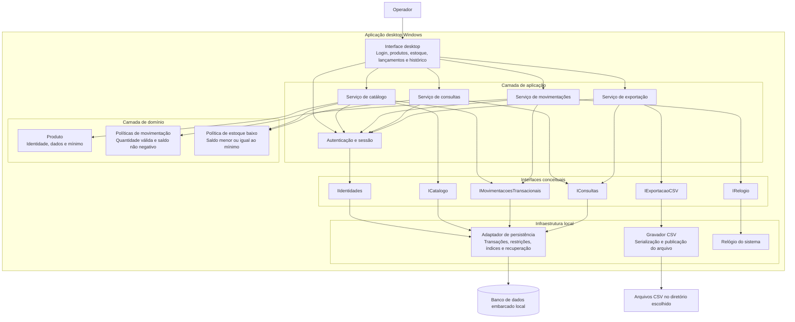

# Relatório Técnico de Arquitetura de Software

**Projeto:** Controle de Estoque para Loja Física — P03  
**Equipe:** AI4ES — Time 2  
**Escopo:** aplicação desktop Windows, com autenticação, persistência local embarcada, gestão de produtos, movimentações, consultas, alertas e exportação CSV.  
**Natureza do documento:** arquitetura conceitual, tecnologicamente neutra. Decisões propostas que dependem de esclarecimento de negócio estão identificadas como pendentes de validação.

## 1. Identificação das HUs

| HU | Capacidade | Critérios de aceite arquiteturalmente relevantes | Requisitos relacionados |
|---|---|---|---|
| HU01 | Cadastrar produto | Nome e quantidade inicial obrigatórios; nome não duplicado; exibição imediata na consulta | RF01, RF10 |
| HU02 | Registrar entrada | Seleção por lista ou busca; quantidade inteira positiva; atualização imediata; histórico com data e hora | RF04, RF07, RF11, RF12, RNF03, RNF04, RNF08 |
| HU03 | Registrar saída | Bloqueio por saldo insuficiente; atualização imediata; registro no histórico | RF05, RF06, RF07, RF11, RNF03, RNF04, RNF08 |
| HU04 | Alertar estoque baixo | Destaque quando saldo atingir ou ficar abaixo do mínimo; identificação do produto e saldo; persistência do alerta | RF09, RNF04 |
| HU05 | Configurar limite mínimo | Configuração individual; inteiro não negativo; efeito imediato nos alertas | RF08, RF09 |
| HU06 | Consultar estoque | Uma tela com produtos, saldo e mínimo; destaque de estoque baixo; ordenação por nome ou quantidade | RF09, RF10, RNF05 |
| HU07 | Consultar histórico | Filtros por produto e período; tipo, quantidade, data, hora e usuário; ordem cronológica decrescente | RF11, RNF05, RNF08 |
| HU08 | Exportar dados | Estoque e movimentações em CSV; escolha do diretório; campos relevantes; confirmação de sucesso | RNF07 |

**Capacidades obrigatórias sem HU própria:**

- **Editar produto — RF02:** contemplada no serviço de catálogo; permanece pendente definir quais campos podem ser alterados.
- **Remover produto — RF03:** contemplada no serviço de catálogo; a política de remoção depende da preservação do histórico.
- **Pesquisar por nome — RF12:** capacidade transversal às telas de estoque e lançamento.
- **Autenticar — RNF06:** caso de uso transversal, sem critérios de aceite próprios.
- **Executar em Windows com banco local embarcado — RNF01 e RNF02:** restrições de implantação.
- **Durabilidade, desempenho e rastreabilidade — RNF03, RNF05 e RNF08:** propriedades transversais, não restritas a uma única HU.

## 2. Diagramas de Arquitetura (Mermaid)

### 2.1 Visão de componentes

Arquitetura proposta: **monólito modular desktop**, organizado em apresentação, aplicação, domínio e infraestrutura. Os componentes abaixo representam responsabilidades lógicas, não processos ou serviços distribuídos.



**Interfaces principais:**

- `IIdentidades`: consultar identidade e verificar credenciais.
- `ICatalogo`: cadastrar, editar, configurar mínimo e executar a política aprovada de remoção.
- `IMovimentacoesTransacionais`: registrar lançamento, atualizar saldo e gravar auditoria em uma única transação; consultar resultado por identificador de operação.
- `IConsultas`: listar estoque, pesquisar nomes, filtrar histórico e fornecer uma visão consistente para exportação.
- `IExportacaoCSV`: serializar dados e publicar o arquivo no destino escolhido.
- `IRelogio`: fornecer o instante técnico de registro, independentemente da data de movimentação informada pelo operador.

### 2.2 Sequência de registro de saída

O fluxo demonstra validação, proteção contra saldo negativo, atomicidade, rastreabilidade e tratamento de confirmação incerta. Representa uma operação nova; repetições com o mesmo identificador devem recuperar o resultado existente, sem duplicar o lançamento.

```mermaid
sequenceDiagram
    autonumber
    participant OP as Operador
    participant UI as Interface desktop
    participant APP as Serviço de movimentações
    participant AUTH as Autenticação e sessão
    participant REP as Persistência transacional
    participant DB as Banco embarcado
    participant CON as Serviço de consultas

    OP->>UI: Informar produto, quantidade e data; confirmar saída
    UI->>APP: registrarSaida(idOperacao, produto, quantidade, data, sessao)
    APP->>AUTH: validarSessao(sessao)
    AUTH-->>APP: Resultado e identidade autenticada

    alt Sessão inválida
        APP-->>UI: Acesso negado
        UI-->>OP: Solicitar autenticação
    else Sessão válida
        APP->>APP: Validar quantidade inteira positiva e data
        alt Dados inválidos
            APP-->>UI: Erros de validação
            UI-->>OP: Exibir mensagem clara e preservar formulário
        else Dados válidos
            APP->>APP: Obter instante de registro
            APP->>REP: registrarSaidaAtomica(dados, usuario, instante)
            REP->>DB: Iniciar transação de escrita
            REP->>DB: Decrementar saldo somente se produto disponível e saldo suficiente
            DB-->>REP: Resultado da alteração condicional

            alt Produto indisponível ou saldo insuficiente
                REP->>DB: Reverter transação
                DB-->>REP: Transação revertida
                REP-->>APP: Rejeição de negócio
                APP-->>UI: Saída não registrada e motivo
                UI-->>OP: Exibir erro sem alterar saldo apresentado
            else Débito aceito
                REP->>DB: Inserir movimentação, idOperacao, data, instante e usuário
                DB-->>REP: Resultado da gravação

                alt Erro antes da confirmação
                    REP->>DB: Reverter transação
                    REP-->>APP: Falha sem lançamento confirmado
                    APP-->>UI: Não apresentar sucesso
                    UI-->>OP: Informar falha e permitir nova tentativa controlada
                else Gravação aceita
                    REP->>DB: Confirmar transação com garantia de durabilidade
                    DB-->>REP: Resultado da confirmação

                    alt Confirmação recebida
                        REP-->>APP: Lançamento confirmado
                        APP-->>UI: Sucesso
                        UI->>CON: Reconsultar produto e condição de estoque baixo
                        CON->>REP: Consultar estado confirmado
                        REP->>DB: Ler saldo e mínimo
                        DB-->>REP: Estado persistido
                        REP-->>CON: Saldo e mínimo
                        CON-->>UI: Saldo atual e destaque recalculado
                        UI-->>OP: Exibir confirmação, saldo e eventual alerta
                    else Falha ou confirmação incerta
                        REP-->>APP: Resultado não confirmado
                        APP-->>UI: Reconciliar usando idOperacao
                        UI-->>OP: Informar pendência sem afirmar sucesso ou perda
                        Note over APP,DB: Após recuperação, consultar idOperacao antes de repetir o lançamento
                    end
                end
            end
        end
    end
```

**Propriedades do fluxo:**

- O saldo exibido previamente não é usado como autorização definitiva para a saída.
- A verificação de disponibilidade ocorre dentro da operação transacional.
- Falha entre alteração do saldo e gravação do histórico não pode deixar alterações parciais.
- Se a aplicação encerrar após a confirmação no banco e antes da mensagem ao operador, o lançamento permanece recuperável.
- O alerta é recalculado a partir do estado confirmado, inclusive na próxima inicialização.

## 3. Decisões de Arquitetura

### DA01 — Aplicação desktop modular com implantação local

**Decisão:** concentrar a solução em uma aplicação desktop Windows, com banco embarcado local e sem dependência de servidor externo.

**Justificativa:** atende RNF01 e RNF02, reduzindo complexidade operacional incompatível com o escopo apresentado.

**Consequência:** modularidade será obtida por interfaces internas e separação de responsabilidades, não por distribuição de serviços.

### DA02 — Saldo e histórico atualizados atomicamente

**Decisão:** cada entrada ou saída deve, na mesma transação:

1. Validar as precondições de persistência.
2. Alterar o saldo.
3. Inserir a movimentação.
4. Registrar usuário e instante da operação.
5. Confirmar o conjunto.

**Invariantes:**

- Quantidade movimentada é um inteiro positivo, tanto para entrada quanto para saída.
- Saldo nunca é negativo.
- Saída não pode exceder o saldo disponível no momento da gravação.
- Não existe lançamento confirmado sem sua correspondente alteração de saldo.
- Não existe alteração de saldo decorrente de lançamento sem registro no histórico.

A persistência deve oferecer transações duráveis, restrições de integridade e controle de concorrência suficiente para impedir duas saídas de consumirem o mesmo saldo.

### DA03 — Confirmação durável e repetição segura

**Decisão:** apresentar sucesso somente após confirmação durável. Atribuir um identificador único à operação para reconhecer repetições e reconciliar resultados incertos.

**Justificativa:** atende à intenção de RNF03 e reduz duplicidades quando o operador repete uma ação cujo resultado não chegou à interface.

**Limite da garantia:** a arquitetura garante a preservação de **lançamentos confirmados**, dentro das garantias do armazenamento adotado. Formulários ainda não enviados ou operações não confirmadas não são automaticamente duráveis.

Caso RNF03 pretenda incluir esses estados, será necessário especificar recuperação de rascunhos ou registro durável prévio das intenções. Falha física do dispositivo também não é coberta apenas pela persistência local.

### DA04 — Modelo de domínio e dados

| Entidade/conceito | Dados principais | Regras e observações |
|---|---|---|
| Produto | Identificador, nome, chave de comparação do nome, preço de custo, saldo atual, limite mínimo | Nome único segundo regra de comparação a aprovar; mínimo inteiro não negativo |
| Movimentação | Identificador, identificador da operação, produto, tipo, quantidade, data informada, instante de registro, usuário responsável | Vinculada ao produto e usuário; não editável pelos casos de uso atualmente especificados |
| Usuário | Identificador, nome de acesso, verificador protegido de senha | Identidade persistente para autenticação e rastreabilidade |
| Alerta de estoque baixo | Produto, saldo, mínimo, condição calculada | Estado derivado; não exige entidade persistida independente |
| Visão de exportação | Estoque e movimentações em um recorte consistente | Não deve combinar estados de momentos incompatíveis |

**Distinção temporal:** a data de entrada/saída informada pelo operador e o instante técnico de registro são campos diferentes. A escolha do campo usado para filtros e ordenação precisa ser aprovada.

**Saldo inicial — proposta:** cadastrar produto e representar a quantidade inicial positiva como uma entrada identificada como originada no cadastro, na mesma transação. Para quantidade inicial zero, criar somente o produto. A aceitação de zero e a apresentação dessa entrada no histórico ainda exigem validação.

**Reconciliação proposta:** se a política acima for aprovada, o saldo poderá ser conferido pela soma das entradas menos as saídas.

### DA05 — Catálogo sem quebra de rastreabilidade

**Decisão:** impedir que operações de catálogo destruam a consistência do histórico.

- Alterações do saldo não devem ser tratadas como simples edição de campo.
- Alteração de nome e preço não reescreve as movimentações.
- Remoção não deve apagar movimentações em cascata.
- Proposta para produtos com histórico: remoção lógica do cadastro operacional, mantendo consultas históricas.
- Política para produtos com saldo positivo e eventual reutilização de nomes permanece pendente.

Essas restrições precisam ser conciliadas com RF02 e RF03 antes da implementação dos respectivos fluxos.

### DA06 — Estoque baixo como condição derivada

**Regra:**

`estoqueBaixo = limiteConfigurado E saldoAtual <= limiteMinimo`

A condição deve ser recalculada:

- Após cadastro e movimentação confirmados.
- Após alteração do mínimo.
- Ao abrir ou atualizar a consulta.

O destaque identifica produto e saldo, permanece enquanto a condição for verdadeira e não depende de uma notificação transitória.

**Proposta:** mínimo não configurado é diferente de mínimo zero; sem configuração, não há alerta. Essa semântica precisa de aprovação.

A persistência do alerta segue a condição vigente: reposição acima do mínimo ou alteração do limite que elimine a condição devem atualizar a interface, conciliando HU04 e HU05.

### DA07 — Autenticação e autoria confiável

**Decisão:** verificar a sessão nos serviços de aplicação, não apenas na tela inicial. O usuário responsável pelo lançamento deve ser obtido da sessão autenticada, nunca informado livremente no formulário.

Senhas não devem ser armazenadas em texto simples nem de forma reversível; devem ser verificadas por mecanismo apropriado de derivação de senha com sal individual.

**Limite:** autenticação da aplicação não equivale a proteção contra acesso direto aos arquivos pelo sistema operacional. Proteção adicional dos dados locais depende do modelo de ameaça a definir.

Não são introduzidos perfis administrativos ou permissões diferenciadas como requisitos aprovados.

### DA08 — Consultas responsivas e fluxo curto de lançamento

**Decisão:**

- Disponibilizar entrada e saída diretamente na tela principal.
- Usar formulários compactos, seleção de produto por lista ou busca e confirmação única.
- Evitar etapas obrigatórias adicionais após a confirmação.
- Indexar nomes, referências de produto e campos temporais usados nos filtros.
- Adotar carregamento paginado ou incremental na mesma tela, sem eliminar o acesso a todos os produtos.
- Executar operações demoradas sem bloquear a interação da interface.

**Ressalvas:**

- A definição de “três interações” deve ser acordada; três etapas de fluxo não são necessariamente três cliques ou ações de teclado.
- Paginação não comprova, por si só, RNF05. A meta de dois segundos depende de volume, equipamento e definição de “carregado”.

### DA09 — Exportação consistente, explícita e segura

**Decisão:** exportar estoque e movimentações a partir de uma visão consistente, permitindo escolher o diretório.

Proposta de campos:

- **Estoque:** identificador, nome, saldo atual, preço de custo e limite mínimo.
- **Movimentações:** identificador, produto, tipo, quantidade, data informada, instante de registro, usuário e identificador da operação.
- Metadados de exportação, como versão do leiaute e instante de geração, podem acompanhar os arquivos.

A serialização deve tratar separadores, aspas, quebras de linha e codificação. A aplicação só confirma sucesso após concluir a gravação e publicar o arquivo final; falhas não podem ser apresentadas como exportações válidas.

**Limite:** CSV permite cópia e análise dos dados exportados, mas não constitui automaticamente um backup integral restaurável. Importação, restauração, credenciais e políticas de recuperação não foram especificadas.

## 4. Tabela de Componentes e Rastreabilidade

| Componente | Responsabilidade Principal | Comunica-se com | Origem (HU / Critério de Aceite) |
|---|---|---|---|
| Interface desktop | Apresentar cadastro, consulta, lançamentos, histórico e exportação | Todos os serviços de aplicação | HU01–HU08; exibição imediata, mensagens, filtros e escolha de destino; RNF01, RNF04 |
| Autenticação e sessão | Validar credenciais e fornecer identidade autenticada | Interface, serviços de aplicação, `IIdentidades` | Sem HU específica; derivado de RNF06 e RNF08 |
| Serviço de catálogo | Cadastrar, editar, configurar mínimo e executar remoção aprovada | Autenticação, Produto, `ICatalogo`, persistência transacional | HU01: obrigatoriedade e não duplicidade; HU05: mínimo individual; RF02 e RF03 sem HU própria |
| Serviço de movimentações | Coordenar entradas e saídas atômicas e auditadas | Autenticação, políticas de domínio, `IMovimentacoesTransacionais`, `IRelogio` | HU02 e HU03: validação, atualização imediata e histórico; RNF03, RNF08 |
| Produto e políticas de catálogo | Validar dados e representar identidade e configuração | Serviço de catálogo | HU01: nome e quantidade inicial; HU05: inteiro não negativo |
| Políticas de movimentação | Validar quantidade e preservar saldo não negativo | Serviço de movimentações, persistência transacional | HU02: inteiro positivo; HU03: bloqueio por saldo insuficiente |
| Política de estoque baixo | Calcular condição de alerta a partir de saldo e mínimo | Catálogo, consultas | HU04: atingir ou ficar abaixo, identificação e persistência; HU05: efeito imediato; HU06: destaque |
| Serviço de consultas | Pesquisar produtos, listar e ordenar estoque, filtrar histórico | Autenticação, `IConsultas`, política de estoque baixo | HU02: seleção por busca; HU06: lista e ordenação; HU07: filtros, campos e ordem decrescente; RF12 |
| Serviço de exportação | Coordenar seleção, visão consistente e resultado da exportação | Autenticação, `IConsultas`, `IExportacaoCSV` | HU08: campos relevantes, diretório e confirmação; RNF07 |
| Adaptador de persistência local | Implementar transações, restrições, índices e recuperação | Interfaces de persistência, banco embarcado | HU01–HU03, HU05–HU08; derivado de RNF02, RNF03, RNF05 e RNF08 |
| Registro auditável de movimentações | Preservar vínculo entre lançamento, produto, instante e usuário | Movimentações, consultas, persistência, exportação | HU02, HU03 e HU07: histórico; RNF08 |
| Gravador CSV | Serializar e publicar arquivos completos, reportando falhas | Serviço de exportação, sistema de arquivos | HU08: geração do CSV e confirmação de sucesso |
| Adaptador de relógio | Fornecer instante técnico testável de registro | Serviço de movimentações, relógio local | HU02 e HU07: data e hora; RNF08 |

## 5. Bloqueios e Pendências

Os itens abaixo não impedem a definição dos módulos, mas bloqueiam a validação completa de comportamentos ou garantias.

| ID | Pendência | Impacto | Encaminhamento |
|---|---|---|---|
| P01 | O que significa “nenhum lançamento perdido”? | Define a fronteira de durabilidade e eventual recuperação de formulários ou intenções | Negócio e arquitetura devem distinguir confirmado, em processamento e não enviado |
| P02 | RF02 permite editar saldo ou quantidade inicial? | Edição direta pode invalidar histórico e reconciliação | Aprovar campos editáveis e especificar ajuste/estorno, se necessário |
| P03 | Como remover produto com saldo ou histórico? | Risco de perda de rastreabilidade e referências inválidas | Definir remoção física/lógica, bloqueios e tratamento nas consultas |
| P04 | Qual volume e equipamento caracterizam RNF05? | Impossibilidade de verificar objetivamente os dois segundos | Definir massa de dados, hardware, estado de cache e ponto de medição |
| P05 | O que conta como interação em RNF04? | O fluxo pode atender três etapas e falhar em três ações elementares | Validar protótipo e roteiro de medição com operadores |
| P06 | Qual é a regra de igualdade de nomes? | Duplicidade e busca podem produzir resultados inconsistentes | Definir tratamento de maiúsculas, acentos e espaços; aplicar a mesma regra na restrição persistente |
| P07 | Quais regras se aplicam a quantidade inicial e preço de custo? | Afeta validação, armazenamento e cadastro inicial | Confirmar zero, limites máximos, obrigatoriedade, moeda, precisão e arredondamento |
| P08 | Como tratar datas retroativas, futuras e intervalos? | Afeta filtros, ordenação e interpretação da auditoria | Definir campo temporal de referência, limites inclusivos e tratamento de fuso |
| P09 | Como criar o primeiro usuário e recuperar acesso? | A autenticação pode tornar a instalação inicial inutilizável | Especificar provisionamento, troca de senha e recuperação |
| P10 | Qual é o leiaute CSV e o alcance de “backup”? | Pode haver exportação sem capacidade de recuperação | Aprovar arquivos, campos, codificação, separador, filtros e necessidade de restauração |
| P11 | Como tratar mínimo não configurado? | Alerta pode surgir indevidamente ou deixar de surgir | Aprovar ausência de mínimo, valor padrão e comportamento no cadastro |
| P12 | Quantas instâncias podem acessar o banco local? | Afeta bloqueios, concorrência e mensagens de contenção | Definir uso por instalação; manter proteção transacional independentemente da decisão |

## 6. Cobertura de Requisitos

**Legenda:**  
**C — Contemplado no desenho:** há responsabilidade e mecanismo definidos; não significa implementação ou teste concluído.  
**CP — Contemplado com pendência:** existe solução estrutural, mas falta definição necessária para fechar o comportamento ou a aceitação.

### 6.1 Requisitos funcionais

| Requisito | Cobertura arquitetural | Estado | Verificação prevista |
|---|---|---|---|
| RF01 | Catálogo, Produto e transação de cadastro | CP — P06, P07 | Cadastro válido, rejeição de duplicidade e atualização da consulta |
| RF02 | Serviço de catálogo com edição controlada | CP — P02 | Edição apenas dos campos aprovados, sem corromper histórico |
| RF03 | Política de remoção com preservação de referências | CP — P03 | Cenários sem histórico, com histórico e com saldo |
| RF04 | Entrada transacional com produto, quantidade e data | CP — P08 | Persistência de dados, auditoria e incremento correto |
| RF05 | Saída transacional com produto, quantidade e data | CP — P08 | Persistência de dados, auditoria e decremento correto |
| RF06 | Débito condicional dentro da transação | C | Saída excessiva rejeitada; saídas concorrentes não geram saldo negativo |
| RF07 | Saldo e lançamento na mesma transação | C | Falha intermediária reverte o conjunto; sucesso atualiza consulta |
| RF08 | Mínimo individual validado pelo catálogo | C | Rejeição de negativos e não inteiros; configuração por produto |
| RF09 | Política derivada de estoque baixo e destaque visual | CP — P11 | Saldo igual/abaixo/acima do mínimo, reinício e alteração do limite |
| RF10 | Consulta central de estoque com ordenação | C | Todos os produtos do escopo operacional acessíveis na mesma tela |
| RF11 | Consulta histórica filtrada e indexada | CP — P08 | Produto, intervalo, campos auditáveis e ordem decrescente |
| RF12 | Pesquisa por nome | CP — P06 | Busca coerente com a regra de comparação aprovada |

### 6.2 Requisitos não funcionais

| Requisito | Cobertura arquitetural | Estado | Evidência necessária |
|---|---|---|---|
| RNF01 | Aplicação desktop Windows | C | Instalação e execução nas versões suportadas a definir |
| RNF02 | Banco embarcado e armazenamento local | C | Operação sem servidor externo |
| RNF03 | Confirmação durável, atomicidade, recuperação e identificação de operações | CP — P01 | Encerramentos forçados antes, durante e após a confirmação; reconciliação após reinício |
| RNF04 | Acesso direto e formulário compacto | CP — P05 | Teste de usabilidade com contagem acordada de interações |
| RNF05 | Índices, consultas limitadas e carregamento incremental | CP — P04 | Medição ponta a ponta em massa e ambiente representativos |
| RNF06 | Autenticação, sessão e armazenamento protegido de verificadores | CP — P09 | Rejeição de credenciais inválidas e acesso sem sessão; fluxo de provisionamento |
| RNF07 | Exportação CSV consistente para diretório selecionado | CP — P10 | Validação de conteúdo, erros de gravação e abertura por ferramenta externa |
| RNF08 | Usuário da sessão e instante registrados atomicamente | C | Nenhum lançamento confirmado sem autoria e data/hora de registro |

### 6.3 Histórias de usuário

| HU | Componentes centrais | Situação dos critérios |
|---|---|---|
| HU01 | Interface, catálogo e persistência | Contemplados; duplicidade e regras dos campos dependem de P06 e P07 |
| HU02 | Interface, consultas e movimentações | Contemplados; semântica temporal depende de P08 |
| HU03 | Interface e movimentações | Bloqueio, atualização e histórico contemplados; datas dependem de P08 |
| HU04 | Política de estoque baixo e interface | Contemplados; ausência de mínimo depende de P11 |
| HU05 | Catálogo e política de estoque baixo | Configuração individual, validação e recálculo contemplados |
| HU06 | Consultas e interface | Lista, ordenação e destaque contemplados; desempenho depende de P04 |
| HU07 | Consultas e registro auditável | Campos contemplados; filtros e ordenação temporal dependem de P08 |
| HU08 | Exportação e gravador CSV | Destino e confirmação contemplados; leiaute e backup dependem de P10 |

**Resultado:** os **12 RF, 8 RNF e 8 HUs** possuem vínculo arquitetural explícito. Isso representa cobertura de desenho, não comprovação de conformidade. As pendências impedem declarar atendimento integral dos requisitos associados.

## 7. Gap Analysis

| Lacuna real de especificação | Impacto arquitetural ou operacional | Ação recomendada ao time |
|---|---|---|
| Durabilidade sem fronteira definida | Uma operação confirmada, um clique ainda não persistido e um rascunho têm garantias distintas | Formalizar estados do lançamento e critérios de recuperação; criar testes de interrupção e confirmação incerta — P01 |
| Ausência de fluxo de correção de lançamentos | Erros operacionais podem incentivar edição direta de saldo ou exclusão de evidências | Levantar HU de ajuste/estorno; somente após aprovação definir compensações e auditoria — P02 |
| Remoção sem política histórica | Exclusão física pode destruir rastreabilidade ou tornar histórico incompreensível | Aprovar matriz de remoção por saldo e existência de movimentos; definir visibilidade de produtos removidos — P03 |
| Quantidade inicial sem vínculo explícito com histórico | O saldo pode não ser reconciliável apenas pelas movimentações | Aprovar a entrada de abertura proposta ou documentar uma base inicial separada e sua regra de reconciliação — P07 |
| Tempo de negócio confundido com tempo de registro | Lançamentos retroativos podem alterar o significado de filtros e ordem cronológica | Manter os dois campos e definir qual governa cada consulta; especificar desempate estável — P08 |
| “Grande volume” e “carregado” não mensuráveis | Não há base objetiva para provar a meta de dois segundos | Criar perfil de carga, conjunto de consultas, ambiente e protocolo de medição — P04 |
| “Três interações” sem unidade de contagem | Um fluxo visualmente curto pode violar o critério literal | Produzir protótipo e teste observacional; acordar o tratamento de digitação, seleção e confirmação — P05 |
| Ciclo de vida de usuários ausente | Instalação inicial, recuperação de senha e preservação da autoria ficam indefinidas | Criar HUs de provisionamento e recuperação; impedir perda do vínculo histórico ao desativar usuários — P09 |
| Autenticação sem modelo de ameaça local | Quem acessar diretamente os arquivos pode contornar a interface | Avaliar permissões locais, proteção dos arquivos e necessidade de controles adicionais, sem pressupô-los como escopo aprovado |
| CSV tratado como backup sem restauração | Uma exportação pode ser íntegra e ainda insuficiente para reconstruir o sistema | Distinguir exportação analítica de recuperação integral; especificar restauração e testar o processo caso seja requerido — P10 |
| Contrato CSV incompleto | Incompatibilidade entre planilhas, perda de precisão ou interpretação de nomes como fórmulas | Definir versão do leiaute, codificação, datas, decimais e tratamento seguro de conteúdo, preservando a fidelidade dos dados — P10 |
| Evolução do banco e falhas de armazenamento não especificadas | Atualizações, falta de espaço ou corrupção podem comprometer disponibilidade e dados | Planejar migrações verificáveis, tratamento de disco cheio e recuperação; acordar política de cópias de segurança |
| Topologia de uso local indefinida | Múltiplas instâncias podem gerar contenção e resultados inesperados se não previstas | Definir política de instâncias e testar concorrência, sem confiar apenas na interface para proteger o saldo — P12 |

**Prioridade recomendada:**

1. **Antes de consolidar o modelo de dados:** resolver durabilidade, edição de saldo, remoção, saldo inicial e semântica temporal.
2. **Antes de fechar os critérios de aceite:** definir desempenho, contagem de interações, nomes, mínimo padrão, autenticação inicial e contrato CSV.
3. **Antes da liberação:** comprovar atomicidade e recuperação, executar testes de concorrência, desempenho e usabilidade, e documentar limites da exportação como backup.

**Conclusão:** o monólito modular desktop com persistência embarcada transacional é compatível com o escopo. A integridade depende de manter saldo, movimentação e autoria em uma única unidade de confirmação, enquanto consultas e alertas refletem somente estados persistidos. As principais lacunas remanescentes são de semântica de negócio e critérios de aceitação, não de escolha tecnológica.