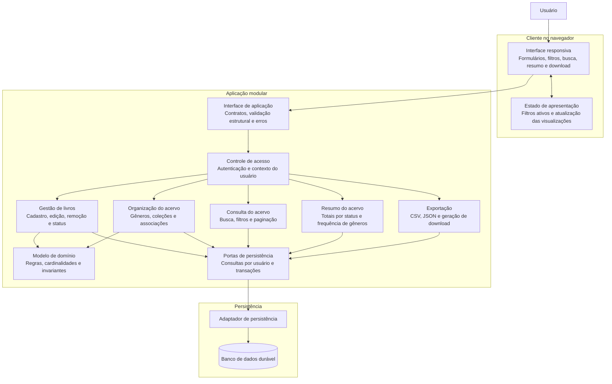

# Relatório Técnico de Arquitetura de Software

**Projeto:** Biblioteca Pessoal de Livros — P04  
**Elaboração:** AI4ES — Time 2 — Sistema Multi-Agente de Design de Software  
**Base de requisitos:** RF01–RF13, RNF01–RNF07 e HU01–HU08  
**Natureza:** arquitetura conceitual, tecnologicamente neutra. Decisões propostas e pendências não substituem a validação com o responsável pelo produto.

## 1. Identificação das HUs

| HU | Objetivo | Critérios de aceite determinantes para a arquitetura | Requisitos relacionados |
|---|---|---|---|
| HU01 | Cadastrar livro | Título e autor obrigatórios; status restrito às três opções; livro visível imediatamente após o cadastro. Registrar também editora e tipo. | RF01, RF04, RF13; RNF04 |
| HU02 | Atualizar status | Permitir qualquer transição entre não lido, lendo e concluído; refletir a mudança imediatamente no resumo. | RF04, RF05; RNF05 |
| HU03 | Organizar por gênero | Criar, renomear e remover gêneros; múltiplos gêneros por livro; remoção apenas desvincula os livros. | RF06, RF08 |
| HU04 | Organizar por coleção | Criar, renomear e remover coleções; no máximo uma coleção por livro; remoção apenas desvincula os livros. | RF07, RF08 |
| HU05 | Filtrar o acervo | Filtrar também por tipo; combinar filtros; atualizar resultados dinamicamente; limpar todos os filtros em uma ação. | RF09, RF13; RNF03 |
| HU06 | Pesquisar livros | Correspondência parcial em título ou autor; atualização dinâmica durante a digitação. | RF12; RNF03 |
| HU07 | Visualizar resumo | Exibir total geral, totais por status e gêneros mais frequentes; atualizar automaticamente após alterações. | RF10, RF11; RNF05 |
| HU08 | Exportar o acervo | Exportar todos os campos de todos os livros em CSV ou JSON; disponibilizar download no navegador. | RNF07 |

**Requisitos sem HU específica:**

- **RF02 e RF03:** edição completa e remoção de livros. Devem ser implementadas, embora não possuam histórias e critérios de aceite próprios.
- **RNF01:** autenticação e isolamento por usuário são transversais a todos os casos de uso.
- **RNF02 e RNF06:** responsividade e compatibilidade são transversais à interface.
- **RNF04:** persistência aplica-se a todas as operações de escrita.

**Conciliação da especificação:**

- HU05 complementa RF09 ao incluir filtro por **tipo**.
- HU07 complementa RF10 ao exigir o **total geral**.
- HU03 e HU04 esclarecem que excluir categorias não exclui livros.
- RNF07, embora classificado como não funcional, contém uma capacidade funcional explícita: **exportação**.
- Não há critérios suficientes para tornar RNF03 e a expressão “tempo real” de RNF05 integralmente verificáveis; essas pendências estão nas seções 5 e 7.

## 2. Diagramas de Arquitetura (Mermaid)

### 2.1 Visão de componentes e fronteiras de responsabilidade

A proposta é uma aplicação organizada em módulos lógicos, com uma fronteira central de autenticação e autorização. Os componentes abaixo não implicam serviços implantados separadamente.



**Regras da fronteira:**

- Toda operação deve receber um contexto de usuário autenticado, inclusive busca, estatísticas e exportação.
- O proprietário dos dados deriva desse contexto, nunca de uma identificação livre enviada pela interface.
- Identificadores de livros, gêneros e coleções devem ser validados dentro do acervo do usuário.
- Consultas e transações são expostas por interfaces conceituais; a tecnologia de persistência permanece em aberto.

### 2.2 Sequência completa — alteração de status e atualização do resumo

O fluxo exemplifica HU02 e RNF05. Cadastro, edição e remoção seguem o mesmo princípio: só confirmar sucesso após persistência e devolver uma visão coerente do resultado.

```mermaid
sequenceDiagram
    autonumber
    participant U as Usuário
    participant UI as Interface responsiva
    participant API as Interface de aplicação
    participant SEG as Controle de acesso
    participant LIV as Gestão de livros
    participant RES as Resumo do acervo
    participant P as Persistência transacional

    U->>UI: Selecionar novo status
    UI->>API: Atualizar status do livro
    API->>SEG: Validar autenticação
    SEG-->>API: Resultado e contexto do usuário

    alt Autenticação inválida
        API-->>UI: Acesso negado
        UI-->>U: Solicitar autenticação
    else Usuário autenticado
        API->>LIV: Atualizar status no acervo do usuário
        LIV->>P: Iniciar transação e localizar livro por usuário
        P-->>LIV: Livro encontrado ou ausente

        alt Livro ausente no acervo autorizado
            LIV->>P: Encerrar transação sem alterações
            LIV-->>API: Recurso indisponível
            API-->>UI: Erro sem expor dados de outro usuário
            UI-->>U: Informar impossibilidade da operação
        else Livro encontrado
            LIV->>LIV: Validar status e versão do registro

            alt Status inválido ou conflito de versão
                LIV->>P: Encerrar transação sem alterações
                LIV-->>API: Erro de validação ou conflito
                API-->>UI: Solicitar correção ou atualização dos dados
                UI-->>U: Exibir orientação
            else Alteração válida
                LIV->>P: Gravar novo status
                LIV->>RES: Calcular resumo no contexto da transação
                RES->>P: Consultar totais e frequências do usuário
                P-->>RES: Agregados coerentes com a alteração
                RES-->>LIV: Resumo atualizado
                LIV->>P: Confirmar transação
                P-->>LIV: Resultado da persistência

                alt Persistência confirmada
                    LIV-->>API: Livro atualizado e resumo
                    API-->>UI: Sucesso com dados confirmados
                    UI->>UI: Atualizar livro, resumo e lista afetada
                    UI-->>U: Exibir resultado sem recarregar a página
                else Persistência não confirmada
                    LIV->>P: Reverter se a transação ainda estiver ativa
                    LIV-->>API: Falha ou resultado indeterminado
                    API-->>UI: Não confirmar sucesso; solicitar reconciliação
                    UI-->>U: Informar falha e permitir verificar o estado
                end
            end
        end
    end
```

**Limite do fluxo:** ele atende à atualização imediata na sessão que realizou a alteração. Sincronização automática entre abas ou dispositivos exige definição adicional de escopo e latência.

## 3. Decisões de Arquitetura

### DA01 — Aplicação modular, sem distribuição prematura

**Decisão proposta:** separar apresentação, aplicação, domínio e persistência em módulos com interfaces explícitas, mantendo inicialmente uma única fronteira de aplicação.

**Justificativa:** os requisitos não demonstram necessidade de serviços distribuídos. Essa organização simplifica transações, isolamento e atualização consistente do resumo.

**Consequência:** consultas, resumo e exportação podem evoluir internamente sem alterar as regras centrais do acervo.

### DA02 — Propriedade explícita e isolamento transversal

Cada livro, gênero e coleção deve possuir um proprietário. Toda leitura ou alteração deve ser limitada ao usuário autenticado.

Regras obrigatórias:

- Não associar um livro a gênero ou coleção de outro usuário.
- Aplicar o mesmo isolamento a contagens, buscas e arquivos exportados.
- Não revelar a existência de recursos de outros usuários em mensagens de erro.
- Se houver cache, arquivos temporários ou processamento em segundo plano, preservar o contexto de propriedade.
- Proteger credenciais, sessões e transmissão de dados; o mecanismo de autenticação permanece pendente.

### DA03 — Modelo de domínio e cardinalidades

| Elemento | Dados conceituais | Invariantes |
|---|---|---|
| Usuário | Identificador da identidade autenticada | É proprietário de seu acervo. O cadastro da identidade não está especificado. |
| Livro | Identificador, proprietário, título, autor, editora, tipo, status, coleção opcional e versão técnica | Título e autor não vazios; status válido; tipo físico ou digital; no máximo uma coleção. |
| Gênero | Identificador, proprietário e nome | Pode estar associado a vários livros do mesmo usuário. |
| Coleção | Identificador, proprietário e nome | Pode agrupar vários livros do mesmo usuário. |
| Associação livro–gênero | Livro e gênero | Não duplicar o mesmo vínculo; ambos pertencem ao mesmo usuário. |

**Cardinalidades propostas:**

- Usuário → livros, gêneros e coleções: **zero a muitos**.
- Livro ↔ gênero: **muitos para muitos**, permitindo livro ainda sem gênero.
- Livro → coleção: **zero ou uma**.
- Coleção → livros: **zero a muitos**.

A possibilidade de manter livros sem classificação decorre do cadastro sem categorias obrigatórias e da desvinculação exigida por HU03/HU04. Deve ser confirmada devido à redação de RF08.

**Domínios fechados:**

- Status: **não lido**, **lendo**, **concluído**.
- Tipo: **físico**, **digital**.
- Todas as transições entre status são permitidas; não há fluxo sequencial obrigatório.

**Hipóteses a validar:** editora opcional, tipo obrigatório sem valor padrão e tratamento de nomes vazios nas categorias. Duplicidade de livros e unicidade de nomes não devem ser bloqueadas sem decisão de produto.

### DA04 — Escritas atômicas e exclusões não destrutivas para categorias

Uma operação deve persistir integralmente suas alterações ou não aplicá-las.

- Remover gênero elimina seus vínculos, preservando livros.
- Remover coleção elimina o agrupamento e deixa os livros sem coleção.
- Remover livro elimina seus vínculos, preservando gêneros e coleções.
- Alterar livro e suas associações deve ocorrer na mesma transação.
- Controle de versão é proposto para detectar edições concorrentes e evitar sobrescrita silenciosa.

A confirmação da operação depende da persistência durável, não apenas da alteração visual no navegador.

### DA05 — Contratos conceituais de aplicação

| Interface | Operações conceituais |
|---|---|
| Gestão de livros | Cadastrar, obter, editar, remover e atualizar status |
| Organização | Criar, editar e remover gênero ou coleção; associar e desassociar livros |
| Consulta | Listar com filtros combinados, termo de busca e parâmetros de paginação |
| Resumo | Obter total geral, totais por status e frequências de gêneros |
| Exportação | Exportar acervo completo em CSV ou JSON |
| Controle de acesso | Validar identidade e fornecer contexto de usuário |
| Persistência | Executar consultas delimitadas por usuário e unidades transacionais |

Os contratos devem distinguir erros de validação, acesso, recurso indisponível, conflito e persistência. Listagem e exportação são contratos diferentes: a exportação completa não pode ficar limitada à página visível.

### DA06 — Consulta dinâmica com trabalho limitado por resposta

**Decisões propostas:**

- Paginar a listagem, evitando transferir o acervo inteiro a cada interação.
- Executar busca e filtros na aplicação/persistência.
- Preparar estruturas de acesso para propriedade, atributos filtráveis, vínculos e busca parcial.
- Aplicar uma pequena espera configurável durante a digitação e descartar respostas antigas, evitando que uma consulta anterior substitua a mais recente.
- Limpar os filtros em uma ação e reiniciar a posição da listagem.

**Semântica inicial proposta:** filtros distintos são combinados por **E**; o termo de busca corresponde a **título OU autor**; busca e filtros também se combinam por **E**.

A regra para múltiplos gêneros selecionados e o tratamento de acentos e maiúsculas dependem de validação.

**Limitação:** paginação e índices não provam “até 2 segundos, independentemente do volume”. RNF03 exige delimitação de carga e ambiente para ser verificável.

### DA07 — Resumo consistente, sem atualização manual

O resumo deve representar o **acervo completo do usuário**, independentemente dos filtros, como interpretação inicial de HU07.

- Total geral: quantidade de livros.
- Totais por status: devem somar o total geral.
- Frequência de gênero: quantidade de livros distintos associados ao gênero.
- Um livro com vários gêneros contribui para cada gênero; a soma das frequências pode superar o total de livros.

Inicialmente, os agregados podem ser calculados sobre dados persistidos, sem armazenamento redundante. Após uma escrita, a interface recebe o resumo atualizado ou o consulta automaticamente.

Alterações de vínculos e remoção ou renomeação de gêneros também devem atualizar a visualização correspondente. Se medições exigirem agregados pré-calculados, a mudança deve preservar a consistência definida pelo produto.

### DA08 — Exportação completa e isolada

A exportação deve:

- Abranger todos os livros do usuário, sem aplicar filtros da tela.
- Incluir título, autor, editora, tipo, status, gêneros e coleção.
- Preservar campos ausentes de forma documentada.
- Usar uma leitura consistente, evitando misturar estados incompatíveis durante alterações concorrentes.
- Disponibilizar o arquivo apenas ao usuário autorizado.
- Permitir geração e transferência progressivas quando necessário.

**Formato proposto:**

- **JSON:** estrutura versionada, com lista de livros, lista de gêneros de cada livro e coleção opcional.
- **CSV:** uma linha por livro, com representação documentada para múltiplos gêneros, codificação e escape.
- Valores potencialmente interpretados como fórmulas em planilhas devem receber tratamento seguro, com impacto sobre fidelidade documentado.

A inclusão de gêneros e coleções vazios, identificadores estáveis e metadados do arquivo depende da definição de “backup completo”. Não se presume funcionalidade de importação.

### DA09 — Interface e compatibilidade verificáveis

A apresentação deve adaptar formulários, listagem, filtros e resumo a telas móveis e desktops.

Devem existir testes para Chrome, Firefox, Safari e Edge, incluindo download, atualização dinâmica e operações de edição. Versões e dispositivos de referência precisam ser acordados.

Uso por teclado, rótulos claros, mensagens de erro e foco previsível são recomendações de qualidade; não constituem um nível formal de acessibilidade já exigido pelos requisitos.

## 4. Tabela de Componentes e Rastreabilidade

| Componente | Responsabilidade Principal | Comunica-se com | Origem (HU / Critério de Aceite) |
|---|---|---|---|
| Interface responsiva | Apresentar formulários, acervo, filtros, resumo e download em diferentes telas | Estado de apresentação; Interface de aplicação | HU01–HU08; RNF02, RNF06 |
| Estado de apresentação | Manter filtros, controlar respostas dinâmicas e atualizar visualizações sem recarga | Interface responsiva | HU01: livro imediato; HU02/HU07: resumo automático; HU05: limpar filtros; HU06: busca dinâmica |
| Interface de aplicação | Expor casos de uso, validar estrutura das solicitações e padronizar respostas | Interface responsiva; Controle de acesso; módulos de aplicação | HU01–HU08; RF02, RF03 |
| Controle de acesso | Autenticar e estabelecer o contexto obrigatório de propriedade | Interface de aplicação; módulos de aplicação | RNF01; transversal a todas as HUs |
| Gestão de livros | Cadastrar, editar, remover livros e atualizar status | Modelo de domínio; Persistência; Resumo | HU01, HU02; RF01–RF05, RF13 |
| Organização do acervo | Manter gêneros, coleções e vínculos sem excluir livros ao remover categorias | Modelo de domínio; Persistência | HU03/HU04: gestão e desvinculação; RF06–RF08 |
| Consulta do acervo | Combinar filtros, realizar busca parcial e paginar resultados | Persistência | HU05/HU06; RF09, RF12, RF13; RNF03 |
| Resumo do acervo | Calcular total geral, totais por status e frequência de gêneros | Persistência; Gestão de livros; Interface de aplicação | HU02/HU07; RF10, RF11; RNF05 |
| Exportação | Gerar representação completa e disponibilizar download autorizado | Persistência; Interface de aplicação | HU08: campos, formatos e download; RNF07, RNF01 |
| Modelo de domínio | Validar status, tipo, campos e cardinalidades | Gestão de livros; Organização do acervo | HU01–HU04; RF04, RF08, RF13 |
| Portas e adaptador de persistência | Executar consultas por proprietário, transações e gravação durável | Módulos de aplicação; Banco de dados | RNF01, RNF04; critérios de preservação das HU03/HU04 |
| Banco de dados durável | Armazenar livros, categorias, vínculos e controles de integridade | Adaptador de persistência | RNF04; persistência exigida pelas HU01–HU04 |

## 5. Bloqueios e Pendências

**Não há bloqueio para iniciar o núcleo funcional. Há bloqueios para fechar contratos e demonstrar conformidade integral dos requisitos não funcionais.**

| ID | Pendência | Consequência | Encaminhamento / responsável |
|---|---|---|---|
| P01 | RNF03 exige tempo constante para volume ilimitado, sem cenário de medição | Impede garantir e homologar o requisito literalmente | Produto, arquitetura e qualidade: definir volumes, concorrência, ambiente, rede e indicador de latência |
| P02 | “Tempo real” e “imediatamente” não possuem limite de atraso nem escopo entre sessões | Impede escolher e testar a política completa de atualização | Produto: definir latência máxima e abrangência entre abas/dispositivos |
| P03 | Autenticação sem ciclo de vida definido | Fluxos de acesso, expiração e recuperação permanecem incompletos | Produto e segurança: definir origem da identidade, sessão, saída e recuperação |
| P04 | Obrigatoriedade de editora, tipo e classificação não está totalmente harmonizada | Afeta formulários, contratos e restrições de dados | Produto: aprovar matriz de campos obrigatórios e cardinalidades |
| P05 | CSV e significado de backup completo não especificados | Risco de perda de informação organizacional e baixa interoperabilidade | Produto e desenvolvimento: aprovar esquema e exemplos de exportação |
| P06 | Ausência de versões-alvo de navegadores e dispositivos | Compatibilidade e responsividade não têm fronteira de aceite | Qualidade e produto: definir matriz de homologação |
| P07 | Edição e remoção de livros sem critérios de aceite próprios | Comportamentos de confirmação, erro e efeitos na tela ficam indefinidos | Produto: detalhar RF02/RF03 e testes correspondentes |

P01 e P02 devem ser resolvidas antes da homologação de desempenho e atualização automática. As demais decisões precisam anteceder a consolidação dos respectivos contratos.

## 6. Cobertura de Requisitos

**Legenda:**  
**Coberto no desenho:** há responsabilidade, regra e interface identificadas.  
**Com pendência:** há suporte arquitetural, mas faltam definições para aceite completo.

Cobertura de desenho não equivale a implementação concluída ou teste aprovado.

### 6.1 Requisitos funcionais

| Requisito | Atendimento arquitetural | Situação |
|---|---|---|
| RF01 | Gestão de livros, validação de cadastro e persistência transacional | Com pendência de campos obrigatórios — P04 |
| RF02 | Operação de edição com validação e controle de concorrência | Com pendência de aceite — P07 |
| RF03 | Remoção do livro e de seus vínculos, preservando categorias | Com pendência de aceite — P07 |
| RF04 | Domínio fechado com os três status especificados | Coberto no desenho |
| RF05 | Atualização de status sem restrição de sequência | Coberto no desenho |
| RF06 | Gestão de gêneros e desvinculação não destrutiva | Coberto no desenho |
| RF07 | Gestão de coleções e desvinculação não destrutiva | Coberto no desenho |
| RF08 | Associação muitos-para-muitos com gêneros e coleção única opcional | Com pendência de cardinalidade mínima — P04 |
| RF09 | Consulta combinável por atributos, incluindo tipo por HU05 | Coberto no desenho; semântica fina pendente |
| RF10 | Agregação dos totais por status | Coberto no desenho |
| RF11 | Contagem de livros distintos por gênero | Coberto no desenho; ordenação e limite pendentes |
| RF12 | Busca parcial por título ou autor | Coberto no desenho; normalização textual pendente |
| RF13 | Tipo físico/digital no domínio, cadastro e filtro | Coberto no desenho; obrigatoriedade pendente |

### 6.2 Requisitos não funcionais

| Requisito | Atendimento arquitetural | Evidência de aceite necessária |
|---|---|---|
| RNF01 | Autenticação transversal e propriedade em consultas, vínculos e exportações | Testes negativos entre usuários; testes de sessão e acesso direto a identificadores |
| RNF02 | Interface responsiva | Testes de tarefas e apresentação em dispositivos acordados |
| RNF03 | Paginação, estruturas de acesso e controle de consultas dinâmicas | Testes de carga; conformidade bloqueada até resolução de P01 |
| RNF04 | Banco de dados durável e confirmação após persistência | Reabrir/recarregar após escrita confirmada; testar falhas e atomicidade |
| RNF05 | Atualização automática de livro e resumo após alterações | Medir atraso e verificar coerência; aceite completo depende de P02 |
| RNF06 | Contratos de interface compatíveis com os navegadores citados | Execução da matriz de navegadores e versões de P06 |
| RNF07 | Exportador CSV/JSON completo e autorizado | Comparar origem e arquivo, validar multigênero, caracteres, campos vazios e download; depende de P05 |

### 6.3 Histórias de usuário e testes essenciais

| HU | Verificação principal |
|---|---|
| HU01 | Rejeitar título/autor vazios e status inválido; mostrar o livro após gravação confirmada |
| HU02 | Exercitar todas as transições entre status e conferir os totais resultantes |
| HU03 | Associar vários gêneros; renomear e remover gênero preservando livros |
| HU04 | Trocar a coleção sem manter duas simultaneamente; remover coleção preservando livros |
| HU05 | Combinar filtros, incluindo tipo; atualizar resultados e limpar todos em uma ação |
| HU06 | Encontrar partes de título e autor; impedir que respostas antigas substituam resultados recentes |
| HU07 | Conferir total geral, partições por status e frequências após alterações de livros e vínculos |
| HU08 | Exportar além da página visível, em ambos os formatos, incluindo todos os campos e apenas dados do usuário |

**Resultado:** os **28 itens de entrada — 13 RF, 7 RNF e 8 HU — possuem rastreabilidade arquitetural**. Não se declara conformidade integral enquanto persistirem as pendências e não existirem evidências de implementação e teste.

## 7. Gap Analysis

| Lacuna real | Impacto arquitetural | Ação recomendada ao time |
|---|---|---|
| Desempenho sem limite de volume ou condições de execução | Nenhuma capacidade finita pode sustentar a garantia universal de RNF03; transferir resultados ilimitados também inviabiliza a meta | Negociar um envelope de carga e medir desde a interação até a página renderizada, explicitando paginação e indicador estatístico |
| Atualização em tempo real sem escopo definido | A sessão autora pode atualizar-se pela resposta da escrita; outras sessões exigem mecanismo adicional | Definir clientes abrangidos e atraso máximo antes de escolher propagação de mudanças |
| Cadastro de identidades e gestão de sessões ausentes | Proteção de acesso está exigida, mas entrada, expiração, saída e recuperação não estão definidas | Criar critérios de aceite de autenticação e testes de isolamento para todos os casos de uso |
| RF08 ambíguo quanto à classificação obrigatória | Exigir categoria sempre conflita com desvinculação e cadastro sem categorias | Confirmar livro com zero ou mais gêneros e zero ou uma coleção, ou definir um fluxo alternativo consistente |
| Regras de campos e duplicidade incompletas | Restrições prematuras podem rejeitar dados válidos; ausência de limites pode gerar entradas inconsistentes | Definir obrigatoriedade, comprimentos, normalização e política de duplicatas de livros e categorias |
| Semântica de filtros e busca parcialmente aberta | Resultados podem divergir entre implementação e expectativa | Especificar múltiplos gêneros, acentos, maiúsculas, ordenação estável e interação entre busca, filtros e limpeza |
| “Gêneros mais frequentes” sem limite ou desempate | O resumo não tem saída determinística plenamente definida | Definir quantidade exibida, desempate e tratamento de gêneros sem livros; validar contagem por livro distinto |
| Resumo global ou dependente dos filtros não explicitado | Pode haver contratos e cálculos diferentes para a mesma tela | Confirmar a proposta de resumo global; se houver resumo filtrado, distinguir os dois explicitamente |
| Backup pessoal sem esquema e sem restauração definida | Exportar apenas livros pode omitir categorias vazias; CSV pode perder estrutura ou ser interpretado de forma insegura | Aprovar esquema versionado, representação multivalorada e exemplos; registrar que importação está fora do escopo atual |
| Concorrência e repetição de solicitações não especificadas | Edições simultâneas podem sobrescrever dados; repetição após falha pode duplicar cadastros | Validar controle de versão e política de repetição segura, incluindo reconciliação de resultado indeterminado |
| Persistência confundida com proteção contra qualquer perda | RNF04 cobre fechamento/recarga, mas não define desastre, corrupção ou exclusão acidental | Separar durabilidade transacional de recuperação operacional; negociar retenção, cópias e testes de restauração se necessários |
| Edição e remoção sem histórias próprias | Permanecem indefinidos confirmação, irreversibilidade e efeitos em filtros e resumo | Acrescentar critérios de aceite para RF02/RF03, sem retirar esses requisitos do escopo |
| Compatibilidade e usabilidade sem matriz mensurável | Não é possível provar funcionamento adequado em qualquer versão ou dispositivo | Definir navegadores, versões, dimensões e tarefas de teste; avaliar meta formal de acessibilidade |

**Encaminhamento final:** iniciar pelos invariantes de domínio, isolamento por usuário e persistência transacional. Em paralelo, resolver desempenho, atualização automática, autenticação e esquema de exportação. O desenho mantém todos os requisitos rastreados sem transformar hipóteses de arquitetura em requisitos aprovados.